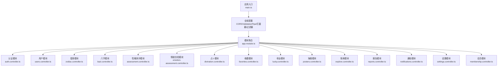
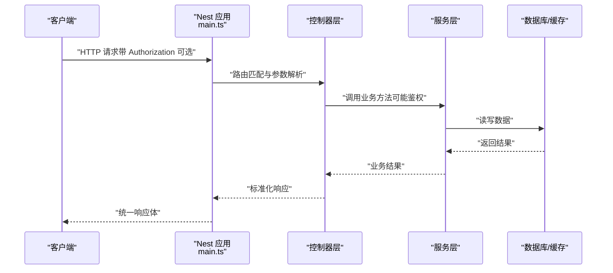
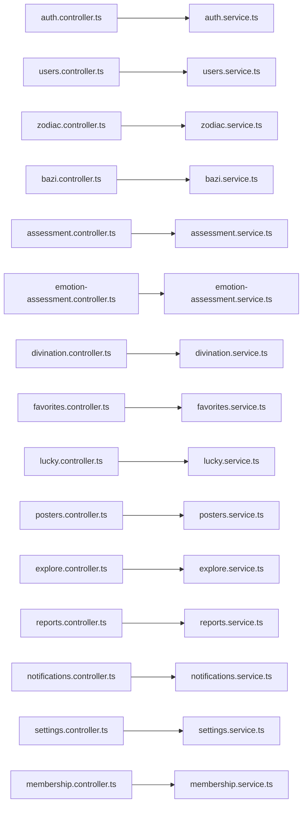

# API 接口文档

<cite>
**本文引用的文件**
- [services/api/src/main.ts](file://services/api/src/main.ts)
- [services/api/src/app.module.ts](file://services/api/src/app.module.ts)
- [services/api/src/auth/auth.controller.ts](file://services/api/src/auth/auth.controller.ts)
- [services/api/src/users/users.controller.ts](file://services/api/src/users/users.controller.ts)
- [services/api/src/zodiac/zodiac.controller.ts](file://services/api/src/zodiac/zodiac.controller.ts)
- [services/api/src/bazi/bazi.controller.ts](file://services/api/src/bazi/bazi.controller.ts)
- [services/api/src/assessment/assessment.controller.ts](file://services/api/src/assessment/assessment.controller.ts)
- [services/api/src/assessment/emotion-assessment.controller.ts](file://services/api/src/assessment/emotion-assessment.controller.ts)
- [services/api/src/divination/divination.controller.ts](file://services/api/src/divination/divination.controller.ts)
- [services/api/src/favorites/favorites.controller.ts](file://services/api/src/favorites/favorites.controller.ts)
- [services/api/src/lucky/lucky.controller.ts](file://services/api/src/lucky/lucky.controller.ts)
- [services/api/src/posters/posters.controller.ts](file://services/api/src/posters/posters.controller.ts)
- [services/api/src/explore/explore.controller.ts](file://services/api/src/explore/explore.controller.ts)
- [services/api/src/reports/reports.controller.ts](file://services/api/src/reports/reports.controller.ts)
- [services/api/src/notifications/notifications.controller.ts](file://services/api/src/notifications/notifications.controller.ts)
- [services/api/src/settings/settings.controller.ts](file://services/api/src/settings/settings.controller.ts)
- [services/api/src/membership/membership.controller.ts](file://services/api/src/membership/membership.controller.ts)
</cite>

## 目录
1. [简介](#简介)
2. [项目结构](#项目结构)
3. [核心组件](#核心组件)
4. [架构总览](#架构总览)
5. [详细组件分析](#详细组件分析)
6. [依赖关系分析](#依赖关系分析)
7. [性能与安全](#性能与安全)
8. [故障排查指南](#故障排查指南)
9. [版本与兼容性策略](#版本与兼容性策略)
10. [结论](#结论)
11. [附录](#附录)

## 简介
本文件为 Fortune Hub 的完整 API 接口文档，覆盖认证、用户、星座运势、八字命理、性格测评、情绪自检、占卜、收藏、幸运、海报生成、探索、报告、通知、设置与会员等模块。文档按功能分组，逐项说明 HTTP 方法、URL 路径、请求参数、响应格式、状态码含义，并提供调用示例、错误处理机制、鉴权方式与限流策略建议。同时给出 Postman 集合与 OpenAPI 规范的使用指引，帮助前端开发者快速集成与测试。

## 项目结构
- 后端采用 NestJS 框架，全局前缀为 /api/v1。
- CORS 默认允许本地开发环境（localhost、127.0.0.1）及配置项中指定的来源，生产环境严格校验。
- 全局启用统一异常过滤器与数据转换拦截器，开启参数校验管道。
- 模块化组织：各功能域以独立模块注册，主模块集中导入。

图表来源
- [services/api/src/main.ts:1-74](file://services/api/src/main.ts#L1-L74)
- [services/api/src/app.module.ts:1-145](file://services/api/src/app.module.ts#L1-L145)

章节来源
- [services/api/src/main.ts:1-74](file://services/api/src/main.ts#L1-L74)
- [services/api/src/app.module.ts:1-145](file://services/api/src/app.module.ts#L1-L145)

## 核心组件
- 全局前缀：/api/v1
- 鉴权：所有需要登录态的接口均通过 Authorization 头传递令牌；部分管理后台接口使用管理员会话守卫。
- 参数校验：启用 ValidationPipe，自动进行类型转换与白名单过滤。
- 统一响应：TransformInterceptor 将成功响应包装为统一结构。
- 异常处理：HttpExceptionFilter 将异常标准化输出。
- CORS：生产环境严格校验 Origin，本地开发可绕过限制。

章节来源
- [services/api/src/main.ts:32-59](file://services/api/src/main.ts#L32-L59)

## 架构总览
下图展示 API 总体交互路径与鉴权流程：

图表来源
- [services/api/src/main.ts:32-43](file://services/api/src/main.ts#L32-L43)
- [services/api/src/app.module.ts:120-141](file://services/api/src/app.module.ts#L120-L141)

## 详细组件分析

### 认证相关
- 基础路径：/api/v1/auth
- 支持微信登录、发送手机验证码、手机快捷登录
- 鉴权方式：接口不强制要求 Authorization，但后续需登录态的接口请携带令牌

接口清单
- POST /api/v1/auth/wechat-login
  - 请求体：见 DTO（微信登录）
  - 成功响应：返回用户登录态信息
  - 状态码：200 成功；400 参数错误；500 服务器错误
  - 示例：参见“调用示例”章节
- POST /api/v1/auth/phone-code
  - 请求体：手机号、场景等（见 DTO）
  - 成功响应：发送成功提示
  - 状态码：200 成功；400 参数错误；500 服务器错误
  - 示例：参见“调用示例”章节
- POST /api/v1/auth/phone-login
  - 请求体：手机号、验证码等（见 DTO）
  - 成功响应：返回用户登录态信息
  - 状态码：200 成功；400 参数错误；500 服务器错误
  - 示例：参见“调用示例”章节

章节来源
- [services/api/src/auth/auth.controller.ts:12-25](file://services/api/src/auth/auth.controller.ts#L12-L25)

### 用户相关
- 基础路径：/api/v1（多处接口在根路径下）
- 需要 Authorization 才能访问的接口均通过头部携带令牌

接口清单
- GET /api/v1/me
  - 功能：获取当前用户资料
  - 鉴权：是
  - 成功响应：用户资料对象
  - 状态码：200 成功；401 未授权；500 服务器错误
- PUT /api/v1/me/profile
  - 功能：更新个人资料
  - 鉴权：是
  - 请求体：见 DTO（更新字段）
  - 成功响应：更新后的用户资料
- POST /api/v1/me/phone/bind
  - 功能：绑定手机号
  - 鉴权：是
  - 请求体：见 DTO（验证码等）
  - 成功响应：绑定结果
- GET /api/v1/me/preferences
  - 功能：获取偏好设置
  - 鉴权：是
  - 成功响应：偏好设置对象
- PUT /api/v1/me/preferences
  - 功能：更新偏好设置
  - 鉴权：是
  - 请求体：见 DTO（更新字段）
  - 成功响应：更新后的偏好设置
- GET /api/v1/records
  - 功能：获取统一记录历史（可传 limit）
  - 鉴权：是
  - 查询参数：limit
  - 成功响应：记录列表
- GET /api/v1/record/overview
  - 功能：获取记录概览
  - 鉴权：否（可匿名或登录态）
  - 成功响应：概览数据
- GET /api/v1/record/mood
  - 功能：获取情绪记录列表
  - 鉴权：是
  - 成功响应：情绪记录数组
- GET /api/v1/record/mood/detail
  - 功能：获取情绪记录详情（支持 recordDate 或 recordId）
  - 鉴权：是
  - 查询参数：recordDate、recordId
  - 成功响应：记录详情
- POST /api/v1/record/mood
  - 功能：保存情绪记录
  - 鉴权：是
  - 请求体：见 DTO（情绪评分、描述等）
  - 成功响应：保存结果
- GET /api/v1/record/meditation
  - 功能：获取冥想记录列表
  - 鉴权：是
  - 成功响应：记录数组
- GET /api/v1/record/meditation/music
  - 功能：获取冥想音乐库
  - 成功响应：音乐资源列表
- GET /api/v1/record/meditation/detail
  - 功能：获取冥想记录详情（recordId）
  - 鉴权：是
  - 查询参数：recordId
  - 成功响应：记录详情
- POST /api/v1/record/meditation
  - 功能：保存冥想记录
  - 鉴权：是
  - 请求体：见 DTO（时长、曲目等）
  - 成功响应：保存结果
- POST /api/v1/me/pulse
  - 功能：保存每日脉搏数据
  - 鉴权：是
  - 请求体：见 DTO（脉搏值、时间等）
  - 成功响应：保存结果
- GET /api/v1/me/pulse
  - 功能：查询脉搏历史（from/to）
  - 鉴权：是
  - 查询参数：from、to
  - 成功响应：历史数据
- GET /api/v1/me/pulse/streak
  - 功能：获取脉搏连续天数
  - 鉴权：是
  - 成功响应：连续天数
- GET /api/v1/wellness/breathing/modes
  - 功能：获取呼吸模式配置
  - 成功响应：模式列表
- POST /api/v1/record/breathing
  - 功能：保存呼吸记录
  - 鉴权：是
  - 请求体：见 DTO（模式、轮数、时长、前后情绪等）
  - 成功响应：保存结果

章节来源
- [services/api/src/users/users.controller.ts:27-203](file://services/api/src/users/users.controller.ts#L27-L203)

### 星座运势
- 基础路径：/api/v1/zodiac

接口清单
- GET /api/v1/zodiac/today
  - 查询参数：zodiac（星座）
  - 成功响应：今日运势摘要
- GET /api/v1/zodiac/daily
  - 查询参数：zodiac
  - 成功响应：当日详细运势
- GET /api/v1/zodiac/weekly
  - 查询参数：zodiac
  - 成功响应：本周运势
- GET /api/v1/zodiac/yearly
  - 查询参数：zodiac、year
  - 成功响应：年度运势
- GET /api/v1/zodiac/monthly
  - 查询参数：zodiac、month
  - 成功响应：月度运势
- GET /api/v1/zodiac/compatibility
  - 查询参数：zodiac、partner
  - 成功响应：配对兼容性
- GET /api/v1/zodiac/knowledge
  - 查询参数：zodiac
  - 成功响应：星座知识

章节来源
- [services/api/src/zodiac/zodiac.controller.ts:12-45](file://services/api/src/zodiac/zodiac.controller.ts#L12-L45)

### 八字命理
- 基础路径：/api/v1/bazi

接口清单
- POST /api/v1/bazi/analyze
  - 鉴权：是
  - 请求体：出生信息（见 DTO）
  - 成功响应：基础分析结果
- POST /api/v1/bazi/professional/analyze
  - 鉴权：是
  - 请求体：出生信息（见 DTO）
  - 成功响应：专业分析结果
- GET /api/v1/bazi/history
  - 鉴权：是
  - 成功响应：分析历史
- GET /api/v1/bazi/professional/records/{recordId}/detail
  - 鉴权：是
  - 成功响应：专业分析详情
- GET /api/v1/bazi/birth-places
  - 查询参数：keyword、limit
  - 成功响应：地名搜索结果

章节来源
- [services/api/src/bazi/bazi.controller.ts:13-52](file://services/api/src/bazi/bazi.controller.ts#L13-L52)

### 性格测评
- 基础路径：/api/v1/assessments/personality

接口清单
- GET /api/v1/assessments/personality/tests
  - 成功响应：测评测试集
- GET /api/v1/assessments/personality/tests/{code}
  - 成功响应：测试详情
- POST /api/v1/assessments/personality/tests/{code}/submit
  - 鉴权：是
  - 请求体：答案集合（见 DTO）
  - 成功响应：测评结果
- GET /api/v1/assessments/personality/history
  - 鉴权：是
  - 成功响应：历史记录

章节来源
- [services/api/src/assessment/assessment.controller.ts:13-37](file://services/api/src/assessment/assessment.controller.ts#L13-L37)

### 情绪自检
- 基础路径：/api/v1/assessments/emotion

接口清单
- GET /api/v1/assessments/emotion/tests
  - 成功响应：情绪测试集
- GET /api/v1/assessments/emotion/tests/{code}
  - 成功响应：测试详情
- POST /api/v1/assessments/emotion/tests/{code}/submit
  - 鉴权：是
  - 请求体：答案集合（见 DTO）
  - 成功响应：测评结果
- GET /api/v1/assessments/emotion/history
  - 鉴权：是
  - 成功响应：历史记录

章节来源
- [services/api/src/assessment/emotion-assessment.controller.ts:13-37](file://services/api/src/assessment/emotion-assessment.controller.ts#L13-L37)

### 占卜
- 基础路径：/api/v1/divination

接口清单
- GET /api/v1/divination/content
  - 成功响应：内容目录
- GET /api/v1/divination/reviews
  - 鉴权：是
  - 成功响应：占卜评论列表
- POST /api/v1/divination/reviews/sync
  - 鉴权：是
  - 请求体：见 DTO（同步内容）
  - 成功响应：同步结果

章节来源
- [services/api/src/divination/divination.controller.ts:13-31](file://services/api/src/divination/divination.controller.ts#L13-L31)

### 收藏
- 基础路径：/api/v1/favorites

接口清单
- GET /api/v1/favorites
  - 鉴权：是
  - 成功响应：收藏列表
- POST /api/v1/favorites/toggle
  - 鉴权：是
  - 请求体：见 DTO（目标标识）
  - 成功响应：切换结果

章节来源
- [services/api/src/favorites/favorites.controller.ts:13-26](file://services/api/src/favorites/favorites.controller.ts#L13-L26)

### 幸运
- 基础路径：/api/v1/lucky

接口清单
- GET /api/v1/lucky/today
  - 鉴权：否（可匿名或登录态）
  - 成功响应：今日幸运事项
- GET /api/v1/lucky/yearly
  - 鉴权：否（可匿名或登录态）
  - 查询参数：year
  - 成功响应：年度运势
- GET /api/v1/lucky/recommendations
  - 鉴权：否（可匿名或登录态）
  - 成功响应：推荐内容
- GET /api/v1/lucky/signs/{bizCode}
  - 鉴权：否（可匿名或登录态）
  - 成功响应：签文详情
- POST /api/v1/lucky/wallpaper/generate
  - 鉴权：是
  - 请求体：见 DTO（主题、文案等）
  - 成功响应：生成结果
- POST /api/v1/lucky/wallpaper/jobs
  - 鉴权：是
  - 请求体：见 DTO（任务参数）
  - 成功响应：任务创建结果
- GET /api/v1/lucky/wallpaper/jobs/{jobId}
  - 鉴权：是
  - 成功响应：任务状态/结果

章节来源
- [services/api/src/lucky/lucky.controller.ts:13-68](file://services/api/src/lucky/lucky.controller.ts#L13-L68)

### 海报生成
- 基础路径：/api/v1/posters

接口清单
- POST /api/v1/posters/generate
  - 鉴权：是
  - 请求体：见 DTO（海报模板、文案、头像等）
  - 成功响应：生成结果
- POST /api/v1/posters/jobs
  - 鉴权：是
  - 请求体：见 DTO（异步任务参数）
  - 成功响应：任务创建结果
- GET /api/v1/posters/jobs/{jobId}
  - 鉴权：是
  - 成功响应：任务状态/结果
- GET /api/v1/posters/mini-program-code
  - 查询参数：sourceType、sourceCode、recordId
  - 成功响应：小程序码二进制流（设置 MIME 与缓存头）
- GET /api/v1/posters/{posterId}
  - 鉴权：是
  - 成功响应：海报详情

章节来源
- [services/api/src/posters/posters.controller.ts:14-66](file://services/api/src/posters/posters.controller.ts#L14-L66)

### 探索
- 基础路径：/api/v1/explore

接口清单
- GET /api/v1/explore/index
  - 鉴权：否（可匿名或登录态）
  - 成功响应：探索页索引
- GET /api/v1/explore/search
  - 鉴权：否（可匿名或登录态）
  - 查询参数：keyword、type、goal、sort
  - 成功响应：搜索结果

章节来源
- [services/api/src/explore/explore.controller.ts:12-33](file://services/api/src/explore/explore.controller.ts#L12-L33)

### 报告
- 基础路径：/api/v1/reports

接口清单
- GET /api/v1/reports/{recordId}
  - 鉴权：是
  - 成功响应：报告详情

章节来源
- [services/api/src/reports/reports.controller.ts:12-19](file://services/api/src/reports/reports.controller.ts#L12-L19)

### 通知
- 基础路径：/api/v1/notifications（用户侧）、/api/v1/admin/notifications（管理侧）

用户侧
- GET /api/v1/notifications/subscriptions
  - 鉴权：是
  - 成功响应：我的订阅列表
- POST /api/v1/notifications/subscribe
  - 鉴权：是
  - 请求体：见 DTO（订阅参数）
  - 成功响应：订阅结果
- DELETE /api/v1/notifications/subscribe
  - 鉴权：是
  - 请求体：见 DTO（取消参数）
  - 成功响应：取消结果

管理侧（需管理员会话）
- GET /api/v1/admin/notifications/logs
  - 查询参数：scene、status、limit
  - 成功响应：投递日志
- POST /api/v1/admin/notifications/run
  - 请求体：见 DTO（场景、模式）
  - 成功响应：执行结果
- POST /api/v1/admin/notifications/retry
  - 成功响应：重试结果
- POST /api/v1/admin/notifications/cleanup-expired
  - 成功响应：清理结果
- POST /api/v1/admin/notifications/run-scheduled
  - 成功响应：定时任务执行结果

章节来源
- [services/api/src/notifications/notifications.controller.ts:18-104](file://services/api/src/notifications/notifications.controller.ts#L18-L104)

### 设置
- 基础路径：/api/v1/settings、/api/v1（部分设置接口）

接口清单
- GET /api/v1/settings
  - 鉴权：否（可匿名或登录态）
  - 成功响应：系统设置
- POST /api/v1/feedback
  - 鉴权：否（可匿名或登录态）
  - 请求体：见 DTO（反馈内容）
  - 成功响应：提交结果
- POST /api/v1/feedback/attachments
  - 鉴权：否（可匿名或登录态）
  - 上传文件：限制大小与 MIME 类型
  - 成功响应：上传结果
- GET /api/v1/feedback/my
  - 鉴权：是
  - 成功响应：我的反馈列表
- GET /api/v1/me/consents
  - 鉴权：是
  - 成功响应：我的同意列表
- POST /api/v1/me/data-deletion-requests
  - 鉴权：是
  - 请求体：见 DTO（删除申请）
  - 成功响应：提交结果
- POST /api/v1/me/consents
  - 鉴权：是
  - 请求体：见 DTO（同意某项）
  - 成功响应：同意结果
- DELETE /api/v1/me/consents/{consentType}
  - 鉴权：是
  - 成功响应：撤销结果
- POST /api/v1/me/consents/{consentType}/revoke
  - 鉴权：是
  - 成功响应：撤销结果

章节来源
- [services/api/src/settings/settings.controller.ts:56-132](file://services/api/src/settings/settings.controller.ts#L56-L132)

### 会员
- 基础路径：/api/v1/membership

接口清单
- GET /api/v1/membership/status
  - 鉴权：是
  - 成功响应：会员状态

章节来源
- [services/api/src/membership/membership.controller.ts:12-16](file://services/api/src/membership/membership.controller.ts#L12-L16)

## 依赖关系分析
- 控制器到服务：各控制器通过依赖注入使用对应服务，实现业务逻辑解耦。
- 服务到数据：服务层通过实体与 TypeORM 进行数据库操作。
- 模块装配：AppModule 统一导入各功能模块，形成清晰的领域边界。

图表来源
- [services/api/src/auth/auth.controller.ts:12-25](file://services/api/src/auth/auth.controller.ts#L12-L25)
- [services/api/src/users/users.controller.ts:27-203](file://services/api/src/users/users.controller.ts#L27-L203)
- [services/api/src/zodiac/zodiac.controller.ts:12-45](file://services/api/src/zodiac/zodiac.controller.ts#L12-L45)
- [services/api/src/bazi/bazi.controller.ts:13-52](file://services/api/src/bazi/bazi.controller.ts#L13-L52)
- [services/api/src/assessment/assessment.controller.ts:13-37](file://services/api/src/assessment/assessment.controller.ts#L13-L37)
- [services/api/src/assessment/emotion-assessment.controller.ts:13-37](file://services/api/src/assessment/emotion-assessment.controller.ts#L13-L37)
- [services/api/src/divination/divination.controller.ts:13-31](file://services/api/src/divination/divination.controller.ts#L13-L31)
- [services/api/src/favorites/favorites.controller.ts:13-26](file://services/api/src/favorites/favorites.controller.ts#L13-L26)
- [services/api/src/lucky/lucky.controller.ts:13-68](file://services/api/src/lucky/lucky.controller.ts#L13-L68)
- [services/api/src/posters/posters.controller.ts:14-66](file://services/api/src/posters/posters.controller.ts#L14-L66)
- [services/api/src/explore/explore.controller.ts:12-33](file://services/api/src/explore/explore.controller.ts#L12-L33)
- [services/api/src/reports/reports.controller.ts:12-19](file://services/api/src/reports/reports.controller.ts#L12-L19)
- [services/api/src/notifications/notifications.controller.ts:18-104](file://services/api/src/notifications/notifications.controller.ts#L18-L104)
- [services/api/src/settings/settings.controller.ts:56-132](file://services/api/src/settings/settings.controller.ts#L56-L132)
- [services/api/src/membership/membership.controller.ts:12-16](file://services/api/src/membership/membership.controller.ts#L12-L16)

## 性能与安全
- 鉴权与会话
  - 所有需要用户身份的接口均通过 Authorization 头传递令牌。
  - 管理后台接口使用管理员会话守卫，确保权限隔离。
- CORS 与来源校验
  - 生产环境严格校验 Origin，避免跨站风险；本地开发可绕过限制。
- 参数校验与输入净化
  - 使用 ValidationPipe 自动进行类型转换与白名单过滤，减少脏数据进入业务层。
- 统一响应与异常处理
  - TransformInterceptor 与 HttpExceptionFilter 提升一致性与可观测性。
- 限流策略建议
  - 对短信验证码、登录等高频接口建议基于 IP 或手机号维度做限流。
  - 对生成类接口（海报、壁纸）建议队列化与配额控制，避免瞬时高并发。
- 缓存与异步任务
  - 对查询类接口可引入 Redis 缓存热点数据。
  - 对耗时任务（海报生成、壁纸生成）建议使用作业队列与幂等设计。

## 故障排查指南
- 常见状态码
  - 200：请求成功
  - 400：参数错误或业务校验失败
  - 401：未提供或无效的 Authorization
  - 403：无权限访问（管理员接口）
  - 404：资源不存在
  - 429：请求过于频繁（限流）
  - 500：服务器内部错误
- 常见问题定位
  - 鉴权失败：确认 Authorization 是否正确传递且未过期。
  - CORS 错误：检查请求来源是否在允许列表内。
  - 参数校验失败：对照 DTO 字段与类型，确保必填项齐全。
  - 生成类接口长时间无响应：确认是否走异步任务流程并查询任务状态。
- 日志与审计
  - 管理后台通知执行支持审计日志，便于追踪运行与重试行为。

章节来源
- [services/api/src/notifications/notifications.controller.ts:66-103](file://services/api/src/notifications/notifications.controller.ts#L66-L103)

## 版本与兼容性策略
- 版本前缀
  - 当前全局前缀为 /api/v1，未来升级时保持该前缀稳定，新增 /v2 以承载破坏性变更。
- 向后兼容
  - 新增字段采用可选策略；删除字段先标记废弃再移除；变更语义需在文档中标注。
- 变更管理流程
  - 设计评审 → 文档更新 → 灰度发布 → 全量上线 → 回滚预案。
- OpenAPI 与 Postman
  - 建议维护 OpenAPI 规范文件，自动生成 SDK 与接口测试套件。
  - 提供 Postman 集合，包含环境变量（如 Base URL、Authorization），便于团队协作。

## 结论
本接口文档系统梳理了 Fortune Hub 的全部对外能力，涵盖认证、用户、星座、八字、测评、占卜、收藏、幸运、海报、探索、报告、通知、设置与会员等模块。通过统一的鉴权、参数校验与响应规范，配合建议的限流与缓存策略，可有效保障系统的稳定性与可扩展性。建议团队持续完善 OpenAPI 与 Postman 集合，推动前后端协同开发与自动化测试。

## 附录
- 调用示例（示意）
  - 获取今日运势
    - 方法：GET
    - 路径：/api/v1/zodiac/today?zodiac=双子座
    - 响应：包含今日运势摘要
  - 保存情绪记录
    - 方法：POST
    - 路径：/api/v1/record/mood
    - 请求头：Authorization: Bearer <token>
    - 请求体：包含情绪评分与描述
    - 响应：保存成功
  - 生成海报
    - 方法：POST
    - 路径：/api/v1/posters/generate
    - 请求头：Authorization: Bearer <token>
    - 请求体：包含模板、文案、头像等
    - 响应：生成结果或任务 ID
- 错误处理机制
  - 统一异常过滤器将错误标准化输出，包含错误码、消息与上下文。
  - 建议前端对 4xx/5xx 场景进行友好提示与重试策略。
- 鉴权方式
  - 所有需要登录态的接口均通过 Authorization 头传递令牌。
  - 管理后台接口需管理员会话，否则返回 401/403。
- 限流策略
  - 建议对短信验证码、登录、生成类接口实施限流，防止滥用。
- 工具支持
  - OpenAPI 规范：建议维护并定期同步接口定义。
  - Postman 集合：提供环境配置与认证模板，便于联调与回归测试。