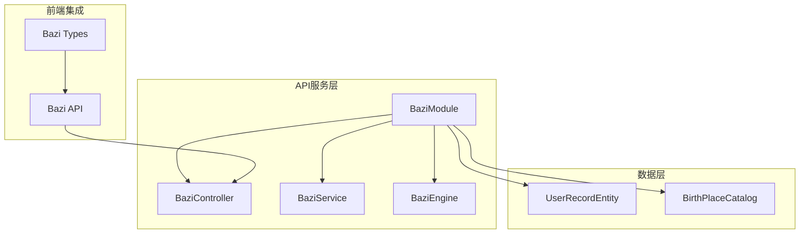
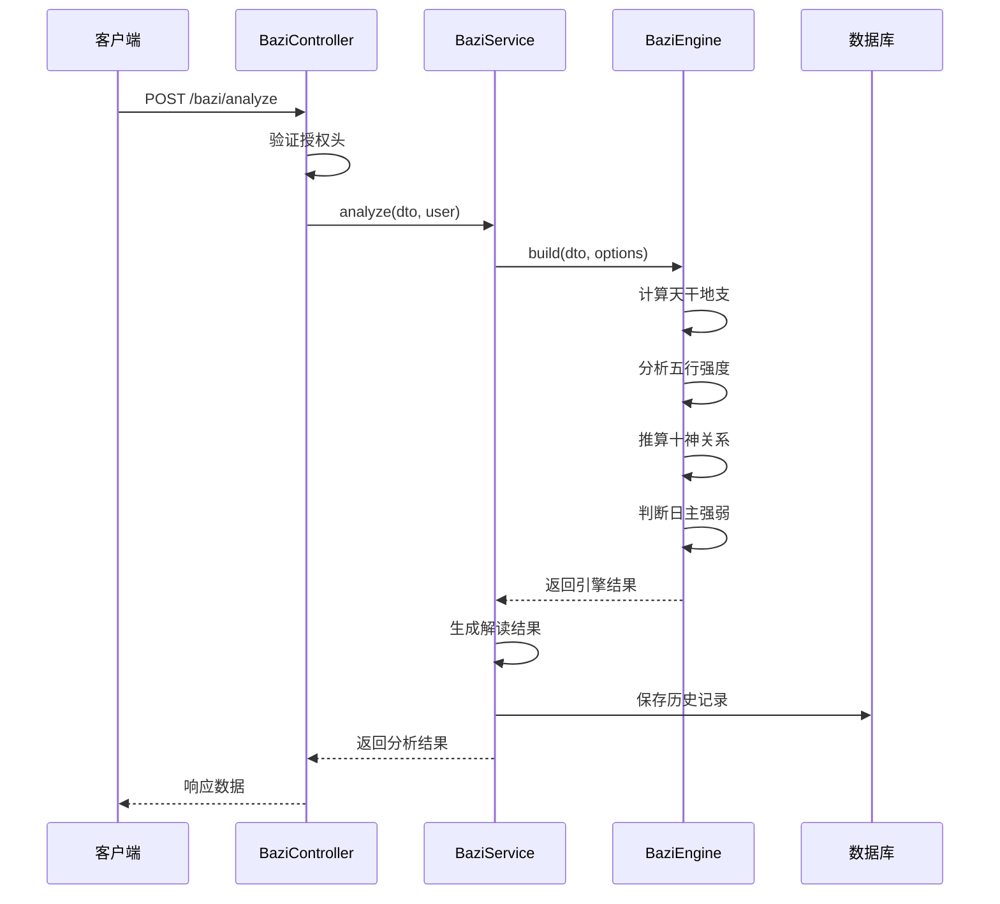
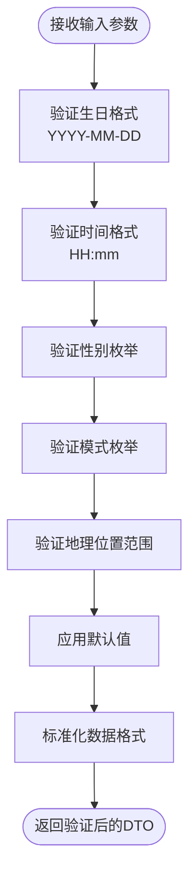
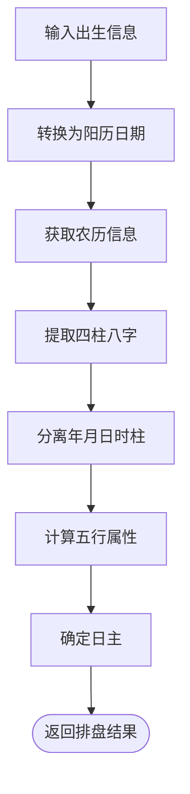
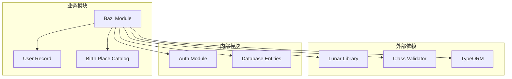

# 八字命理接口

<cite>
**本文档引用的文件**
- [bazi.controller.ts](file://services/api/src/bazi/bazi.controller.ts)
- [bazi.service.ts](file://services/api/src/bazi/bazi.service.ts)
- [bazi-engine.ts](file://services/api/src/bazi/bazi-engine.ts)
- [analyze-bazi.dto.ts](file://services/api/src/bazi/dto/analyze-bazi.dto.ts)
- [birth-place.catalog.ts](file://services/api/src/bazi/birth-place.catalog.ts)
- [bazi.types.ts](file://apps/mobile/src/types/bazi.ts)
- [bazi.api.ts](file://apps/mobile/src/api/bazi.ts)
- [接口开发文档.md](file://docs/接口开发文档.md)
- [开发文档.md](file://docs/开发文档.md)
- [app.module.ts](file://services/api/src/app.module.ts)
- [user-record.entity.ts](file://services/api/src/database/entities/user-record.entity.ts)
</cite>

## 目录
1. [简介](#简介)
2. [项目结构](#项目结构)
3. [核心组件](#核心组件)
4. [架构概览](#架构概览)
5. [详细组件分析](#详细组件分析)
6. [依赖关系分析](#依赖关系分析)
7. [性能考虑](#性能考虑)
8. [故障排除指南](#故障排除指南)
9. [结论](#结论)
10. [附录](#附录)

## 简介

八字命理接口是 Fortune Hub 项目中的核心功能模块，提供基于中国传统命理学的四柱八字分析服务。该接口实现了完整的八字排盘算法，包括天干地支计算、五行分析、十神推算、格局判断等功能，为用户提供个性化的命理解读和生活指导建议。

本系统采用现代化的技术栈构建，基于 NestJS 框架，结合 TypeORM 数据库持久化，提供 RESTful API 接口，支持小程序端和管理端的双重使用场景。

## 项目结构

八字命理模块在整体项目架构中位于 `services/api/src/bazi/` 目录下，采用标准的 NestJS 模块化结构：



**图表来源**
- [bazi.module.ts:1-15](file://services/api/src/bazi/bazi.module.ts#L1-L15)
- [bazi.controller.ts:1-54](file://services/api/src/bazi/bazi.controller.ts#L1-L54)
- [bazi.service.ts:1-436](file://services/api/src/bazi/bazi.service.ts#L1-L436)

**章节来源**
- [bazi.module.ts:1-15](file://services/api/src/bazi/bazi.module.ts#L1-L15)
- [app.module.ts:1-145](file://services/api/src/app.module.ts#L1-L145)

## 核心组件

八字命理系统由四个核心组件构成，每个组件都有明确的职责分工：

### 1. 控制器层 (BaziController)
负责处理 HTTP 请求和响应，提供 RESTful API 接口：
- `POST /bazi/analyze` - 基础八字分析接口
- `POST /bazi/professional/analyze` - 专业版八字分析接口
- `GET /bazi/history` - 获取用户历史记录
- `GET /bazi/professional/records/:recordId/detail` - 获取专业版详情
- `GET /bazi/birth-places` - 出生地搜索接口

### 2. 服务层 (BaziService)
实现业务逻辑的核心服务，负责：
- 调用引擎进行八字计算
- 处理用户历史记录
- 生成解读结果
- 管理专业版和简化版的区别

### 3. 引擎层 (BaziEngine)
提供核心算法实现，包括：
- 天干地支计算
- 五行强度分析
- 十神推算
- 日主强弱判断
- 大运流年分析

### 4. 数据传输对象 (DTO)
定义输入参数的验证规则和数据结构。

**章节来源**
- [bazi.controller.ts:1-54](file://services/api/src/bazi/bazi.controller.ts#L1-L54)
- [bazi.service.ts:1-436](file://services/api/src/bazi/bazi.service.ts#L1-L436)
- [bazi-engine.ts:1-647](file://services/api/src/bazi/bazi-engine.ts#L1-L647)

## 架构概览

八字命理系统的整体架构采用分层设计，确保了良好的可维护性和扩展性：



**图表来源**
- [bazi.controller.ts:13-29](file://services/api/src/bazi/bazi.controller.ts#L13-L29)
- [bazi.service.ts:45-117](file://services/api/src/bazi/bazi.service.ts#L45-L117)
- [bazi-engine.ts:196-291](file://services/api/src/bazi/bazi-engine.ts#L196-L291)

系统采用模块化设计，各组件之间通过清晰的接口进行通信，支持单元测试和集成测试。

## 详细组件分析

### 输入参数验证与标准化

八字分析接口接受以下输入参数，所有参数都会经过严格的验证和标准化处理：

#### 必填参数
- **birthday** (`string`, 必填): 出生日期，格式为 `YYYY-MM-DD`
- **birthTime** (`string`, 必填): 出生时间，格式为 `HH:mm`

#### 可选参数
- **gender** (`'male' | 'female' | 'unknown'`, 可选): 性别，默认为 `'unknown'`
- **mode** (`'lite' | 'professional'`, 可选): 模式，默认为 `'lite'`
- **birthPlace** (`string`, 可选): 出生地名称
- **longitude** (`number`, 可选): 经度，默认值取决于出生地
- **latitude** (`number`, 可选): 纬度，默认值取决于出生地
- **timezoneOffset** (`number`, 可选): 时区偏移，默认值取决于出生地

#### 参数验证规则
系统使用 class-validator 库进行参数验证，确保数据的完整性和正确性：



**图表来源**
- [analyze-bazi.dto.ts:13-53](file://services/api/src/bazi/dto/analyze-bazi.dto.ts#L13-L53)

**章节来源**
- [analyze-bazi.dto.ts:1-54](file://services/api/src/bazi/dto/analyze-bazi.dto.ts#L1-L54)

### 四柱排盘算法实现

四柱排盘是八字命理的核心算法，系统采用 `lunar-typescript` 库进行精确计算：

#### 天干地支计算流程



**图表来源**
- [bazi-engine.ts:196-291](file://services/api/src/bazi/bazi-engine.ts#L196-L291)

#### 五行分析算法

系统实现了一套完整的五行分析算法，包括：

1. **天干地支映射**: 将天干地支映射到对应的五行属性
2. **强度计算**: 天干权重为2，地支权重为1
3. **强弱判断**: 基于支持和压力的平衡分数判断日主强弱
4. **十神推算**: 根据日主与其他天干的关系推算十神

#### 十神分析

十神是八字命理的重要概念，系统实现了完整的十神推算算法：

| 十神类型 | 定义 | 条件 |
|---------|------|------|
| 比肩 | 与日主同五行同阴阳 | 天干地支相同且阴阳相同 |
| 劫财 | 与日主同五行异阴阳 | 天干地支相同但阴阳不同 |
| 食神 | 日主生我者 | 生成日主的五行 |
| 食神 | 日主生我者 | 生成日主的五行 |
| 正财 | 我克日主者 | 克制日主的五行 |
| 偏财 | 我克日主者 | 克制日主的五行 |
| 正印 | 我生日主者 | 生助日主的五行 |
| 偏印 | 我生日主者 | 生助日主的五行 |
| 正官 | 克我日主者 | 克制日主的五行 |
| 七杀 | 克我日主者 | 克制日主的五行 |

**章节来源**
- [bazi-engine.ts:349-424](file://services/api/src/bazi/bazi-engine.ts#L349-L424)
- [bazi-engine.ts:564-596](file://services/api/src/bazi/bazi-engine.ts#L564-L596)

### 民俗解读模块

系统提供了丰富的民俗解读功能，包括：

#### 五行强弱评估
- **支持元素**: 能够生助日主的五行
- **压力元素**: 能够克制日主的五行
- **平衡分数**: 支持分数减去压力分数的差值

#### 喜用神分析
系统根据日主强弱提供相应的喜用神建议：
- **日主偏强**: 喜用神为泄秀、承财、约束
- **日主偏弱**: 喜用神为印星、比劫
- **日主平衡**: 喜用神为生扶、泄秀

#### 生活指导建议
- **职业建议**: 根据五行特性推荐适合的职业方向
- **人际关系**: 提供不同五行在关系中的表现特点
- **生活节奏**: 建议如何调整生活节奏以达到更好的平衡

**章节来源**
- [bazi-engine.ts:502-562](file://services/api/src/bazi/bazi-engine.ts#L502-L562)
- [bazi.service.ts:362-390](file://services/api/src/bazi/bazi.service.ts#L362-L390)

### 专业版与简化版对比

系统提供两种分析模式，满足不同用户的需求：

#### 简化版 (Lite Mode)
- 使用统一的农历/干支库排盘
- 不启用真太阳时校正
- 适用于快速体验和基本解读

#### 专业版 (Professional Mode)
- 启用真太阳时校正
- 使用节气换月和立春年界规则
- 提供更详细的命理分析
- 支持大运流年的深入分析

**章节来源**
- [bazi.service.ts:292-314](file://services/api/src/bazi/bazi.service.ts#L292-L314)

## 依赖关系分析

八字命理系统与其他模块的依赖关系如下：



**图表来源**
- [bazi.module.ts:1-15](file://services/api/src/bazi/bazi.module.ts#L1-L15)
- [bazi-engine.ts:1-6](file://services/api/src/bazi/bazi-engine.ts#L1-L6)

系统采用松耦合的设计，通过接口和依赖注入实现模块间的解耦，便于测试和维护。

**章节来源**
- [bazi.module.ts:1-15](file://services/api/src/bazi/bazi.module.ts#L1-L15)
- [app.module.ts:1-145](file://services/api/src/app.module.ts#L1-L145)

## 性能考虑

### 算法优化策略

1. **缓存机制**: 对常用的计算结果进行缓存，减少重复计算
2. **批量处理**: 支持批量查询和分析，提高处理效率
3. **异步处理**: 对耗时操作采用异步处理，避免阻塞主线程

### 数据库优化

1. **索引优化**: 在用户ID和记录类型字段上建立复合索引
2. **查询优化**: 使用分页查询避免大量数据的频繁读取
3. **连接池**: 配置合适的数据库连接池大小

### 并发处理能力

系统支持高并发访问，通过以下机制保证稳定性：
- **负载均衡**: 支持多实例部署
- **限流控制**: 防止恶意请求和流量攻击
- **超时处理**: 设置合理的请求超时时间

## 故障排除指南

### 常见问题及解决方案

#### 1. 参数验证失败
**问题**: 输入参数不符合验证规则
**解决方案**: 检查参数格式是否正确，确保必填参数完整

#### 2. 授权失败
**问题**: 未提供有效的 Authorization 头
**解决方案**: 确保携带正确的 Bearer Token

#### 3. 数据库连接异常
**问题**: 无法连接到数据库
**解决方案**: 检查数据库配置和网络连接

#### 4. 算法计算错误
**问题**: 排盘结果不正确
**解决方案**: 验证输入数据的准确性，检查算法版本

**章节来源**
- [bazi.service.ts:175-183](file://services/api/src/bazi/bazi.service.ts#L175-L183)

## 结论

八字命理接口系统是一个功能完整、架构清晰的命理分析平台。系统实现了传统的四柱八字排盘算法，结合现代技术手段，为用户提供了准确、便捷的命理分析服务。

### 主要优势

1. **算法准确性**: 基于专业的命理理论和精确的天文计算
2. **用户体验**: 提供简洁直观的操作界面和详细的解读结果
3. **技术先进**: 采用现代化的技术栈和最佳实践
4. **扩展性强**: 模块化设计便于功能扩展和维护

### 发展方向

1. **算法优化**: 持续改进算法精度和性能
2. **功能扩展**: 增加更多命理分析功能
3. **用户体验**: 优化界面设计和交互体验
4. **数据丰富化**: 增加更多的命理知识和案例

## 附录

### 接口调用示例

#### 基础八字分析
```javascript
// 请求示例
{
  "birthday": "1990-01-27",
  "birthTime": "12:00",
  "gender": "male",
  "birthPlace": "杭州",
  "longitude": 120.16,
  "latitude": 30.25,
  "timezoneOffset": 8
}

// 响应示例
{
  "code": 0,
  "message": "ok",
  "data": {
    "recordId": "123456789",
    "isSaved": true,
    "result": {
      "title": "木势偏旺型",
      "subtitle": "日主为甲木，四柱呈现木势更明显",
      "summary": "你的节奏更适合先稳住内在状态...",
      "chart": {
        "yearPillar": "庚午",
        "monthPillar": "己卯",
        "dayPillar": "甲寅",
        "hourPillar": "丙申"
      },
      "fiveElements": [
        {"name": "木", "value": 6},
        {"name": "火", "value": 3},
        {"name": "土", "value": 2},
        {"name": "金", "value": 1},
        {"name": "水", "value": 0}
      ]
    }
  }
}
```

#### 专业版八字分析
```javascript
// 请求示例
{
  "birthday": "1990-01-27",
  "birthTime": "12:00",
  "gender": "male",
  "mode": "professional",
  "birthPlace": "杭州",
  "longitude": 120.16,
  "latitude": 30.25,
  "timezoneOffset": 8
}

// 响应示例
{
  "code": 0,
  "message": "ok",
  "data": {
    "recordId": "123456789",
    "isSaved": true,
    "result": {
      "algorithmVersion": "bazi-engine-v1.2.0",
      "professional": {
        "mode": "professional",
        "library": "lunar-typescript",
        "adjustedBirthday": "1990-01-27",
        "adjustedBirthTime": "12:00",
        "trueSolarOffsetMinutes": 0,
        "majorLuck": {
          "available": true,
          "direction": "forward",
          "cycles": [
            {
              "index": 0,
              "ganZhi": "庚午",
              "startAge": 0,
              "endAge": 10,
              "tenGod": "正财",
              "element": "金"
            }
          ]
        }
      }
    }
  }
}
```

### 法律合规要求

系统在设计时充分考虑了法律合规要求：

1. **免责声明**: 明确标注结果仅供娱乐和自我观察使用
2. **数据保护**: 严格遵守个人信息保护相关法律法规
3. **内容审核**: 所有命理解读内容经过严格审核
4. **用户同意**: 在使用前明确告知用户相关风险

### 错误处理机制

系统实现了完善的错误处理机制：

1. **参数验证**: 所有输入参数都会经过严格验证
2. **异常捕获**: 捕获并处理各种可能的异常情况
3. **错误响应**: 返回标准化的错误响应格式
4. **日志记录**: 记录详细的错误日志便于排查问题

**章节来源**
- [接口开发文档.md:237-271](file://docs/接口开发文档.md#L237-L271)
- [开发文档.md:254-270](file://docs/开发文档.md#L254-L270)