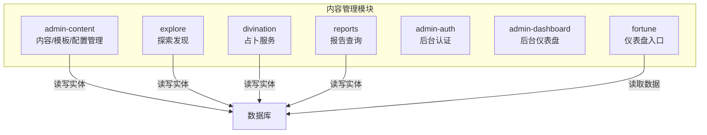
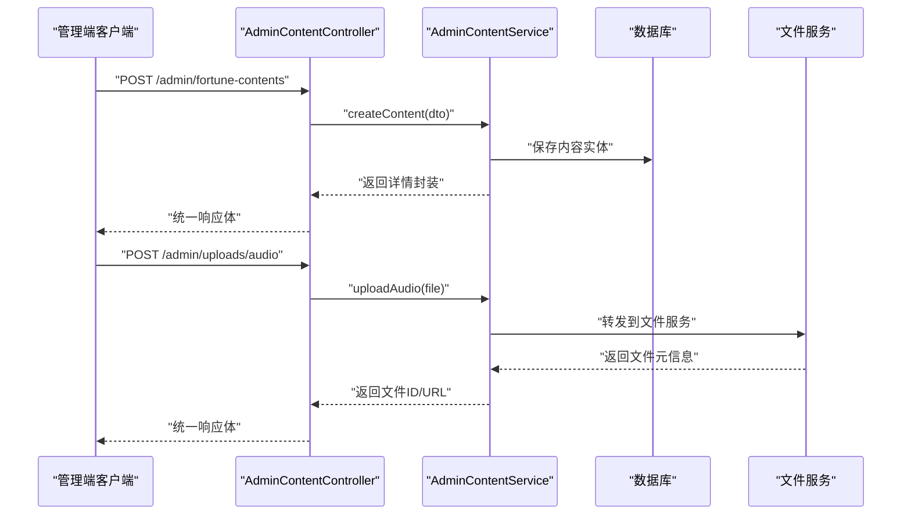
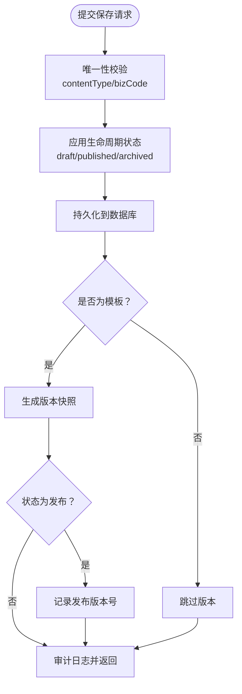
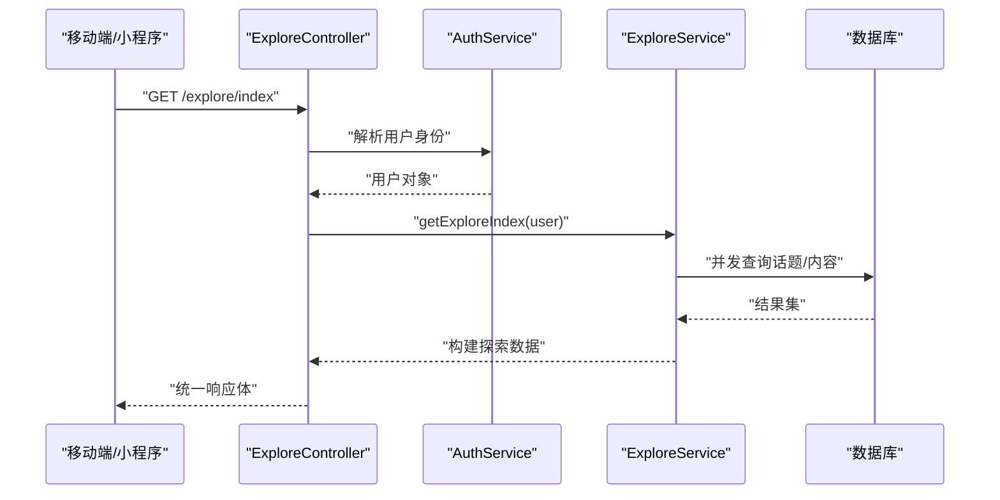
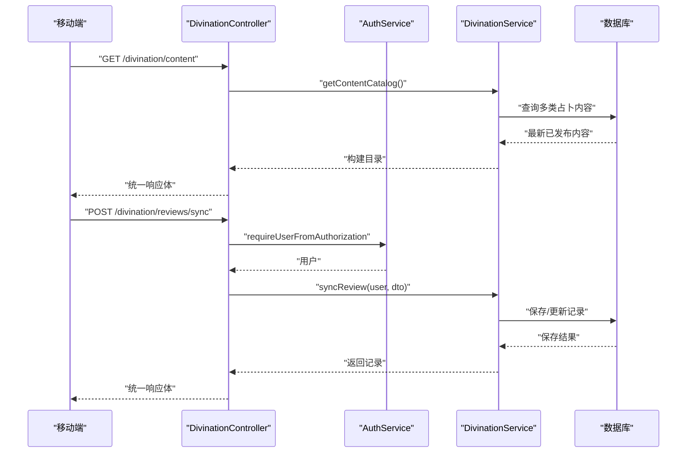
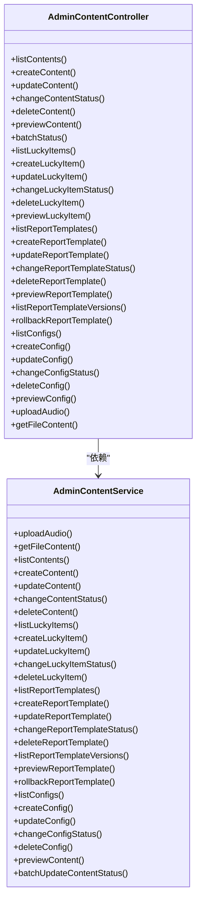

# 内容管理接口

<cite>
**本文引用的文件**
- [services/api/src/admin-content/admin-content.controller.ts](file://services/api/src/admin-content/admin-content.controller.ts)
- [services/api/src/admin-content/admin-content.service.ts](file://services/api/src/admin-content/admin-content.service.ts)
- [services/api/src/admin-content/dto/save-fortune-content.dto.ts](file://services/api/src/admin-content/dto/save-fortune-content.dto.ts)
- [services/api/src/admin-content/dto/save-lucky-item.dto.ts](file://services/api/src/admin-content/dto/save-lucky-item.dto.ts)
- [services/api/src/admin-content/dto/save-report-template.dto.ts](file://services/api/src/admin-content/dto/save-report-template.dto.ts)
- [services/api/src/admin-content/dto/save-config-entry.dto.ts](file://services/api/src/admin-content/dto/save-config-entry.dto.ts)
- [services/api/src/admin-auth/admin-auth.controller.ts](file://services/api/src/admin-auth/admin-auth.controller.ts)
- [services/api/src/admin-dashboard/admin-dashboard.controller.ts](file://services/api/src/admin-dashboard/admin-dashboard.controller.ts)
- [services/api/src/fortune/fortune.controller.ts](file://services/api/src/fortune/fortune.controller.ts)
- [services/api/src/explore/explore.controller.ts](file://services/api/src/explore/explore.controller.ts)
- [services/api/src/explore/explore.service.ts](file://services/api/src/explore/explore.service.ts)
- [services/api/src/divination/divination.controller.ts](file://services/api/src/divination/divination.controller.ts)
- [services/api/src/divination/divination.service.ts](file://services/api/src/divination/divination.service.ts)
- [services/api/src/divination/dto/sync-divination-review.dto.ts](file://services/api/src/divination/dto/sync-divination-review.dto.ts)
- [services/api/src/reports/reports.controller.ts](file://services/api/src/reports/reports.controller.ts)
</cite>

## 目录
1. [简介](#简介)
2. [项目结构](#项目结构)
3. [核心组件](#核心组件)
4. [架构总览](#架构总览)
5. [详细组件分析](#详细组件分析)
6. [依赖分析](#依赖分析)
7. [性能考虑](#性能考虑)
8. [故障排查指南](#故障排查指南)
9. [结论](#结论)
10. [附录](#附录)

## 简介
本文件面向内容管理接口的完整说明，覆盖以下模块与能力：
- 运势内容：内容生产、审核、发布、推荐、版本管理与批量操作
- 探索发现：内容分类、标签管理、智能推荐、用户行为分析
- 占卜服务：占卜类型、占卜流程、结果生成、历史记录
- 内容管理后台：内容编辑、状态控制、版本管理、批量操作
- 内容分发：CDN 配置、缓存策略、多端同步
- 合规与质量：内容质量控制、版权保护、违规检测
- 数据分析：内容表现统计、用户偏好分析、效果评估

## 项目结构
后端采用 NestJS 架构，按功能域划分模块，内容管理相关的核心模块如下：
- admin-content：内容与配置的后台管理接口（运势内容、幸运物、报告模板、应用配置）
- explore：探索发现模块（首页索引、搜索、推荐）
- divination：占卜服务模块（内容目录、历史记录同步）
- reports：报告查询接口
- admin-auth、admin-dashboard：后台登录与仪表盘
- fortune：移动端/管理端仪表盘入口

图表来源
- [services/api/src/admin-content/admin-content.controller.ts:58-108](file://services/api/src/admin-content/admin-content.controller.ts#L58-L108)
- [services/api/src/explore/explore.controller.ts:5-34](file://services/api/src/explore/explore.controller.ts#L5-L34)
- [services/api/src/divination/divination.controller.ts:6-32](file://services/api/src/divination/divination.controller.ts#L6-L32)
- [services/api/src/reports/reports.controller.ts:5-20](file://services/api/src/reports/reports.controller.ts#L5-L20)

章节来源
- [services/api/src/admin-content/admin-content.controller.ts:58-108](file://services/api/src/admin-content/admin-content.controller.ts#L58-L108)
- [services/api/src/explore/explore.controller.ts:5-34](file://services/api/src/explore/explore.controller.ts#L5-L34)
- [services/api/src/divination/divination.controller.ts:6-32](file://services/api/src/divination/divination.controller.ts#L6-L32)
- [services/api/src/reports/reports.controller.ts:5-20](file://services/api/src/reports/reports.controller.ts#L5-L20)

## 核心组件
- 管理控制器与服务
  - admin-content.controller：提供内容、幸运物、报告模板、配置的增删改查、状态变更、预览、批量操作、文件上传等接口
  - admin-content.service：实现业务逻辑（生命周期状态、唯一性校验、版本快照、配置校验、文件代理等）
- 前台探索与占卜
  - explore.controller + explore.service：探索首页索引、搜索、推荐排序与过滤
  - divination.controller + divination.service：占卜内容目录、历史记录同步
- 报告与仪表盘
  - reports.controller：报告查询
  - admin-auth.controller + admin-dashboard.controller：后台登录、菜单、仪表盘
  - fortune.controller：移动端/管理端仪表盘入口

章节来源
- [services/api/src/admin-content/admin-content.controller.ts:58-108](file://services/api/src/admin-content/admin-content.controller.ts#L58-L108)
- [services/api/src/admin-content/admin-content.service.ts:123-196](file://services/api/src/admin-content/admin-content.service.ts#L123-L196)
- [services/api/src/explore/explore.controller.ts:12-33](file://services/api/src/explore/explore.controller.ts#L12-L33)
- [services/api/src/explore/explore.service.ts:219-281](file://services/api/src/explore/explore.service.ts#L219-L281)
- [services/api/src/divination/divination.controller.ts:13-31](file://services/api/src/divination/divination.controller.ts#L13-L31)
- [services/api/src/divination/divination.service.ts:25-72](file://services/api/src/divination/divination.service.ts#L25-L72)
- [services/api/src/reports/reports.controller.ts:12-19](file://services/api/src/reports/reports.controller.ts#L12-L19)
- [services/api/src/admin-auth/admin-auth.controller.ts:10-28](file://services/api/src/admin-auth/admin-auth.controller.ts#L10-L28)
- [services/api/src/admin-dashboard/admin-dashboard.controller.ts:10-13](file://services/api/src/admin-dashboard/admin-dashboard.controller.ts#L10-L13)
- [services/api/src/fortune/fortune.controller.ts:9-18](file://services/api/src/fortune/fortune.controller.ts#L9-L18)

## 架构总览
内容管理接口围绕“内容实体 + 生命周期 + 版本管理 + 文件服务代理”的模式组织，前后端通过统一响应体返回，后台接口均受会话守卫保护。

图表来源
- [services/api/src/admin-content/admin-content.controller.ts:72-75](file://services/api/src/admin-content/admin-content.controller.ts#L72-L75)
- [services/api/src/admin-content/admin-content.controller.ts:299-309](file://services/api/src/admin-content/admin-content.controller.ts#L299-L309)
- [services/api/src/admin-content/admin-content.service.ts:75-79](file://services/api/src/admin-content/admin-content.service.ts#L75-L79)
- [services/api/src/admin-content/admin-content.service.ts:81-121](file://services/api/src/admin-content/admin-content.service.ts#L81-L121)

## 详细组件分析

### 运势内容管理（内容中心）
- 功能范围
  - 内容 CRUD、状态变更、批量状态更新、预览、删除
  - 幸运物管理（分类、排序、状态）
  - 报告模板管理（模板类型、排序、灰度、发布说明、版本快照、回滚）
  - 应用配置管理（命名空间、键、值类型、状态）
  - 文件上传（音频，大小限制、MIME 白名单）、公开文件下载（带缓存头）
- 关键流程
  - 创建/更新时进行唯一性校验（同类型 bizCode 唯一）
  - 生命周期状态：草稿/发布/归档；发布时自动设置发布时间并清空归档时间
  - 报告模板每次更新/创建/状态变更均生成版本快照，发布时记录发布版本号
  - 配置状态变更时对首页布局配置进行严格校验（模块ID、受众、排序、图标、路由等）

图表来源
- [services/api/src/admin-content/admin-content.service.ts:625-640](file://services/api/src/admin-content/admin-content.service.ts#L625-L640)
- [services/api/src/admin-content/admin-content.service.ts:603-623](file://services/api/src/admin-content/admin-content.service.ts#L603-L623)
- [services/api/src/admin-content/admin-content.service.ts:308-357](file://services/api/src/admin-content/admin-content.service.ts#L308-L357)
- [services/api/src/admin-content/admin-content.service.ts:705-782](file://services/api/src/admin-content/admin-content.service.ts#L705-L782)

章节来源
- [services/api/src/admin-content/admin-content.controller.ts:63-107](file://services/api/src/admin-content/admin-content.controller.ts#L63-L107)
- [services/api/src/admin-content/admin-content.controller.ts:115-158](file://services/api/src/admin-content/admin-content.controller.ts#L115-L158)
- [services/api/src/admin-content/admin-content.controller.ts:166-233](file://services/api/src/admin-content/admin-content.controller.ts#L166-L233)
- [services/api/src/admin-content/admin-content.controller.ts:241-291](file://services/api/src/admin-content/admin-content.controller.ts#L241-L291)
- [services/api/src/admin-content/admin-content.controller.ts:299-340](file://services/api/src/admin-content/admin-content.controller.ts#L299-L340)
- [services/api/src/admin-content/admin-content.service.ts:123-196](file://services/api/src/admin-content/admin-content.service.ts#L123-L196)
- [services/api/src/admin-content/admin-content.service.ts:198-272](file://services/api/src/admin-content/admin-content.service.ts#L198-L272)
- [services/api/src/admin-content/admin-content.service.ts:274-452](file://services/api/src/admin-content/admin-content.service.ts#L274-L452)
- [services/api/src/admin-content/admin-content.service.ts:454-551](file://services/api/src/admin-content/admin-content.service.ts#L454-L551)
- [services/api/src/admin-content/admin-content.service.ts:705-782](file://services/api/src/admin-content/admin-content.service.ts#L705-L782)

### 探索发现（内容分类、标签管理、智能推荐、用户行为分析）
- 功能范围
  - 探索首页索引：登录态、今日适配提示、筛选器、横幅、功能入口、话题、内容列表
  - 搜索：关键词、类型、目标、排序（推荐/相关/最新）
  - 内容来源：幸运物、运势内容、报告模板、测评
  - 推荐算法要点：基于来源优先级、关键词匹配度、发布时间排序
- 关键流程
  - 构建探索数据：并发拉取话题与内容，回退到内置兜底数据
  - 过滤与排序：类型/目标过滤，关键词相关度或发布时间排序
  - 用户画像：根据资料完整性决定“今日适配”提示

图表来源
- [services/api/src/explore/explore.controller.ts:12-16](file://services/api/src/explore/explore.controller.ts#L12-L16)
- [services/api/src/explore/explore.service.ts:219-281](file://services/api/src/explore/explore.service.ts#L219-L281)

章节来源
- [services/api/src/explore/explore.controller.ts:12-33](file://services/api/src/explore/explore.controller.ts#L12-L33)
- [services/api/src/explore/explore.service.ts:283-352](file://services/api/src/explore/explore.service.ts#L283-L352)
- [services/api/src/explore/explore.service.ts:371-526](file://services/api/src/explore/explore.service.ts#L371-L526)
- [services/api/src/explore/explore.service.ts:746-765](file://services/api/src/explore/explore.service.ts#L746-L765)

### 占卜服务（占卜类型、占卜流程、结果生成、历史记录）
- 功能范围
  - 占卜内容目录：线位、主题文案、策略、映射、幸运物、页面标签等
  - 历史记录：收藏、结果状态、笔记、主题、标题、摘要、前后情绪强度、期望等
  - 种子数据：首次访问时自动注入占卜内容种子
- 关键流程
  - 获取目录：并发查询各类占卜内容，合并默认与来源数据
  - 同步历史：幂等创建/更新用户占卜记录，字段可选更新

图表来源
- [services/api/src/divination/divination.controller.ts:13-31](file://services/api/src/divination/divination.controller.ts#L13-L31)
- [services/api/src/divination/divination.service.ts:25-56](file://services/api/src/divination/divination.service.ts#L25-L56)
- [services/api/src/divination/divination.service.ts:74-141](file://services/api/src/divination/divination.service.ts#L74-L141)

章节来源
- [services/api/src/divination/divination.controller.ts:13-31](file://services/api/src/divination/divination.controller.ts#L13-L31)
- [services/api/src/divination/divination.service.ts:25-72](file://services/api/src/divination/divination.service.ts#L25-L72)
- [services/api/src/divination/divination.service.ts:143-179](file://services/api/src/divination/divination.service.ts#L143-L179)
- [services/api/src/divination/divination.service.ts:181-249](file://services/api/src/divination/divination.service.ts#L181-L249)
- [services/api/src/divination/divination.service.ts:251-270](file://services/api/src/divination/divination.service.ts#L251-L270)
- [services/api/src/divination/dto/sync-divination-review.dto.ts:13-73](file://services/api/src/divination/dto/sync-divination-review.dto.ts#L13-L73)

### 内容管理后台接口（内容编辑、状态控制、版本管理、批量操作）
- 登录与会话
  - 登录、当前管理员信息、菜单权限均受后台会话守卫保护
- 内容管理
  - 支持三类资源：运势内容、幸运物、报告模板、应用配置
  - 支持状态变更、批量状态变更、预览、删除
  - 报告模板具备版本列表、回滚能力
- 文件服务
  - 音频上传（MIME 白名单、大小限制）
  - 公开文件下载（带缓存控制头）

章节来源
- [services/api/src/admin-auth/admin-auth.controller.ts:10-43](file://services/api/src/admin-auth/admin-auth.controller.ts#L10-L43)
- [services/api/src/admin-content/admin-content.controller.ts:63-107](file://services/api/src/admin-content/admin-content.controller.ts#L63-L107)
- [services/api/src/admin-content/admin-content.controller.ts:115-158](file://services/api/src/admin-content/admin-content.controller.ts#L115-L158)
- [services/api/src/admin-content/admin-content.controller.ts:166-233](file://services/api/src/admin-content/admin-content.controller.ts#L166-L233)
- [services/api/src/admin-content/admin-content.controller.ts:241-291](file://services/api/src/admin-content/admin-content.controller.ts#L241-L291)
- [services/api/src/admin-content/admin-content.controller.ts:299-340](file://services/api/src/admin-content/admin-content.controller.ts#L299-L340)

### 报告查询接口
- 路径：GET /reports/:recordId
- 权限：需登录态
- 行为：按记录ID查询报告，返回统一响应体

章节来源
- [services/api/src/reports/reports.controller.ts:12-19](file://services/api/src/reports/reports.controller.ts#L12-L19)

### 仪表盘接口
- 移动端仪表盘：GET /dashboard/mobile
- 管理端仪表盘：GET /dashboard/admin（需后台会话）
- 后台仪表盘：GET /admin/dashboard（需后台会话）

章节来源
- [services/api/src/fortune/fortune.controller.ts:9-18](file://services/api/src/fortune/fortune.controller.ts#L9-L18)
- [services/api/src/admin-dashboard/admin-dashboard.controller.ts:10-13](file://services/api/src/admin-dashboard/admin-dashboard.controller.ts#L10-L13)

## 依赖分析
- 控制器依赖服务：各模块控制器仅负责参数解析与鉴权，具体业务由对应服务实现
- 服务依赖数据库：使用 TypeORM Repository 访问实体
- 文件服务代理：通过配置项拼接文件服务地址，转发上传/下载请求
- 统一响应体：所有控制器返回固定结构（code/message/data/timestamp），便于前端处理

图表来源
- [services/api/src/admin-content/admin-content.controller.ts:58-340](file://services/api/src/admin-content/admin-content.controller.ts#L58-L340)
- [services/api/src/admin-content/admin-content.service.ts:58-800](file://services/api/src/admin-content/admin-content.service.ts#L58-L800)

章节来源
- [services/api/src/admin-content/admin-content.controller.ts:58-340](file://services/api/src/admin-content/admin-content.controller.ts#L58-L340)
- [services/api/src/admin-content/admin-content.service.ts:58-800](file://services/api/src/admin-content/admin-content.service.ts#L58-L800)

## 性能考虑
- 查询优化
  - 探索模块使用并发查询（Promise.all）减少 RTT
  - 内容列表默认限制返回条数，避免大结果集
- 缓存与分发
  - 文件下载接口透传文件服务的缓存头（Cache-Control、ETag、Last-Modified 等），利于 CDN 生效
- 批量操作
  - 批量状态更新去重并逐条执行，保证幂等与一致性
- 数据校验
  - DTO 层严格约束字段长度与枚举值，降低数据库异常与后续处理成本

## 故障排查指南
- 文件服务不可达
  - 现象：文件下载/上传失败
  - 排查：确认 FILE_SERVICE_BASE_URL 与 TOKEN 配置，检查服务连通性
- 音频上传失败
  - 现象：MIME 类型不在白名单或超过大小限制
  - 排查：核对上传类型与大小，参考控制器中的白名单与限制
- 配置状态校验失败
  - 现象：首页布局配置发布时报错（灰度百分比、模块ID、受众、排序、图标、路由等）
  - 排查：对照校验规则修正配置
- 模板版本回滚失败
  - 现象：指定版本不存在
  - 排查：确认版本ID与模板ID关联正确

章节来源
- [services/api/src/admin-content/admin-content.controller.ts:28-56](file://services/api/src/admin-content/admin-content.controller.ts#L28-L56)
- [services/api/src/admin-content/admin-content.service.ts:81-121](file://services/api/src/admin-content/admin-content.service.ts#L81-L121)
- [services/api/src/admin-content/admin-content.service.ts:688-703](file://services/api/src/admin-content/admin-content.service.ts#L688-L703)
- [services/api/src/admin-content/admin-content.service.ts:380-404](file://services/api/src/admin-content/admin-content.service.ts#L380-L404)

## 结论
本接口体系以“内容实体 + 生命周期 + 版本管理 + 文件服务代理”为核心，覆盖内容生产的全链路能力，并通过统一响应体与守卫机制保障安全与一致性。探索发现与占卜服务提供智能推荐与用户行为记录，后台管理接口支持高效的内容治理与合规控制。

## 附录

### 接口一览（按模块）
- 内容管理后台
  - GET /admin/fortune-contents 列出运势内容
  - POST /admin/fortune-contents 创建内容
  - POST /admin/fortune-contents/preview 预览内容
  - POST /admin/fortune-contents/batch-status 批量状态变更
  - PUT /admin/fortune-contents/:id 更新内容
  - DELETE /admin/fortune-contents/:id 删除内容
  - POST /admin/fortune-contents/:id/status 变更状态
  - GET /admin/lucky-items 列出幸运物
  - POST /admin/lucky-items 创建幸运物
  - POST /admin/lucky-items/preview 预览幸运物
  - POST /admin/lucky-items/batch-status 批量状态变更
  - PUT /admin/lucky-items/:id 更新幸运物
  - DELETE /admin/lucky-items/:id 删除幸运物
  - POST /admin/lucky-items/:id/status 变更状态
  - GET /admin/report-templates 列出报告模板
  - POST /admin/report-templates 创建模板
  - GET /admin/report-templates/:id/versions 查看版本
  - POST /admin/report-templates/:id/rollback/:versionId 回滚模板
  - POST /admin/report-templates/batch-status 批量状态变更
  - PUT /admin/report-templates/:id 更新模板
  - DELETE /admin/report-templates/:id 删除模板
  - POST /admin/report-templates/:id/status 变更状态
  - GET /admin/configs 列出配置
  - POST /admin/configs 创建配置
  - POST /admin/configs/preview 预览配置
  - POST /admin/configs/batch-status 批量状态变更
  - PUT /admin/configs/:id 更新配置
  - DELETE /admin/configs/:id 删除配置
  - POST /admin/configs/:id/status 变更状态
  - POST /admin/uploads/audio 上传音频
  - GET /files/:id/content 下载文件
- 探索发现
  - GET /explore/index 探索首页索引
  - GET /explore/search 探索搜索
- 占卜服务
  - GET /divination/content 占卜内容目录
  - GET /divination/reviews 历史记录
  - POST /divination/reviews/sync 同步历史
- 报告查询
  - GET /reports/:recordId 报告详情
- 仪表盘
  - GET /dashboard/mobile 移动端仪表盘
  - GET /dashboard/admin 管理端仪表盘
  - GET /admin/dashboard 后台仪表盘
- 后台认证
  - POST /admin/auth/login 登录
  - GET /admin/me 当前管理员
  - GET /admin/menus 菜单

章节来源
- [services/api/src/admin-content/admin-content.controller.ts:63-340](file://services/api/src/admin-content/admin-content.controller.ts#L63-L340)
- [services/api/src/explore/explore.controller.ts:12-33](file://services/api/src/explore/explore.controller.ts#L12-L33)
- [services/api/src/divination/divination.controller.ts:13-31](file://services/api/src/divination/divination.controller.ts#L13-L31)
- [services/api/src/reports/reports.controller.ts:12-19](file://services/api/src/reports/reports.controller.ts#L12-L19)
- [services/api/src/fortune/fortune.controller.ts:9-18](file://services/api/src/fortune/fortune.controller.ts#L9-L18)
- [services/api/src/admin-auth/admin-auth.controller.ts:10-43](file://services/api/src/admin-auth/admin-auth.controller.ts#L10-L43)
- [services/api/src/admin-dashboard/admin-dashboard.controller.ts:10-13](file://services/api/src/admin-dashboard/admin-dashboard.controller.ts#L10-L13)