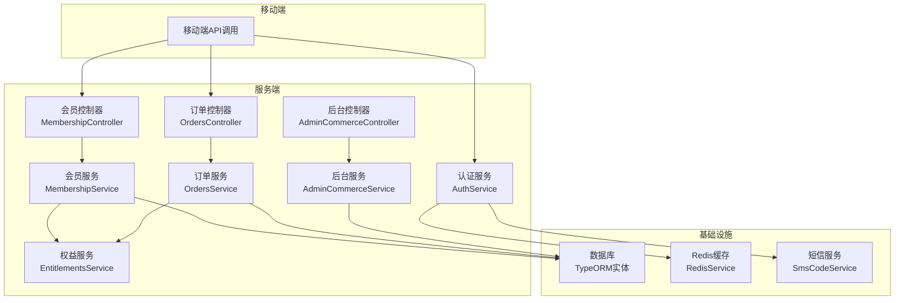
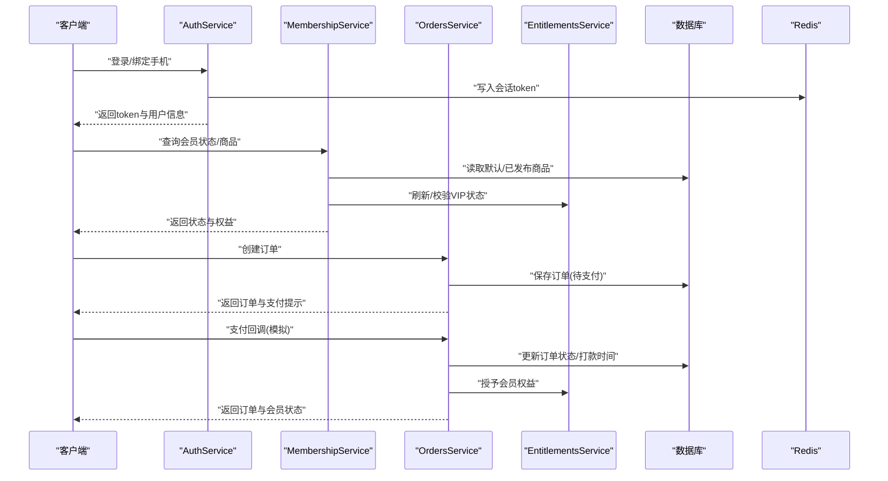
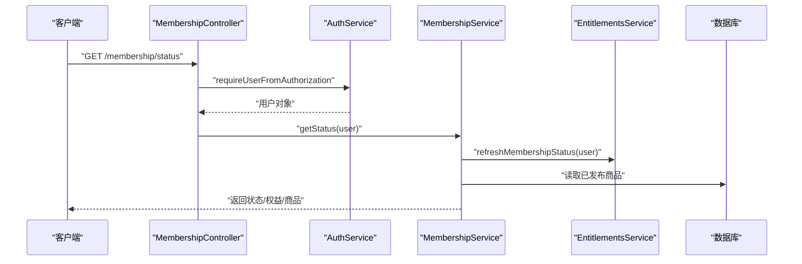
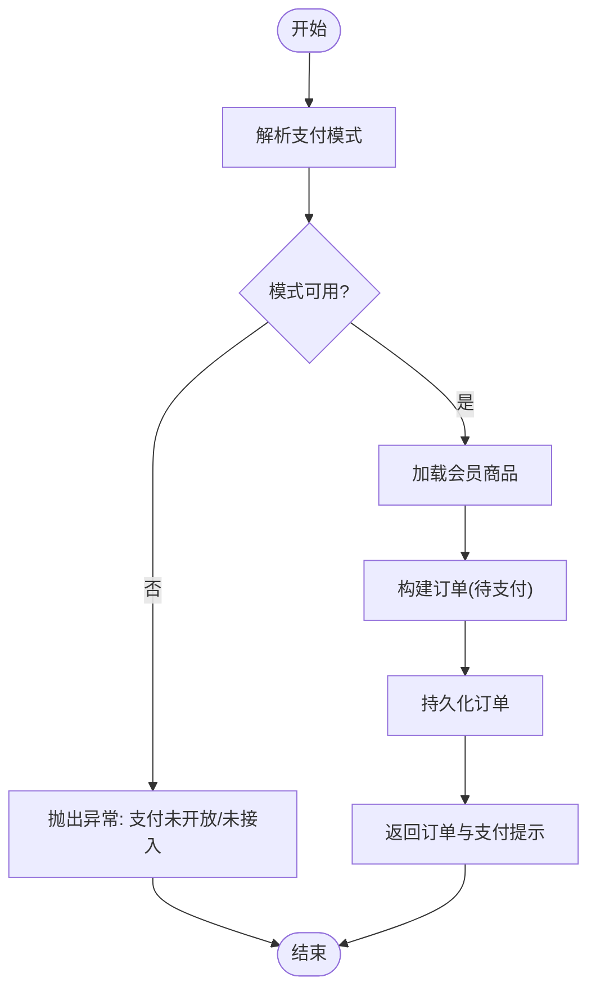
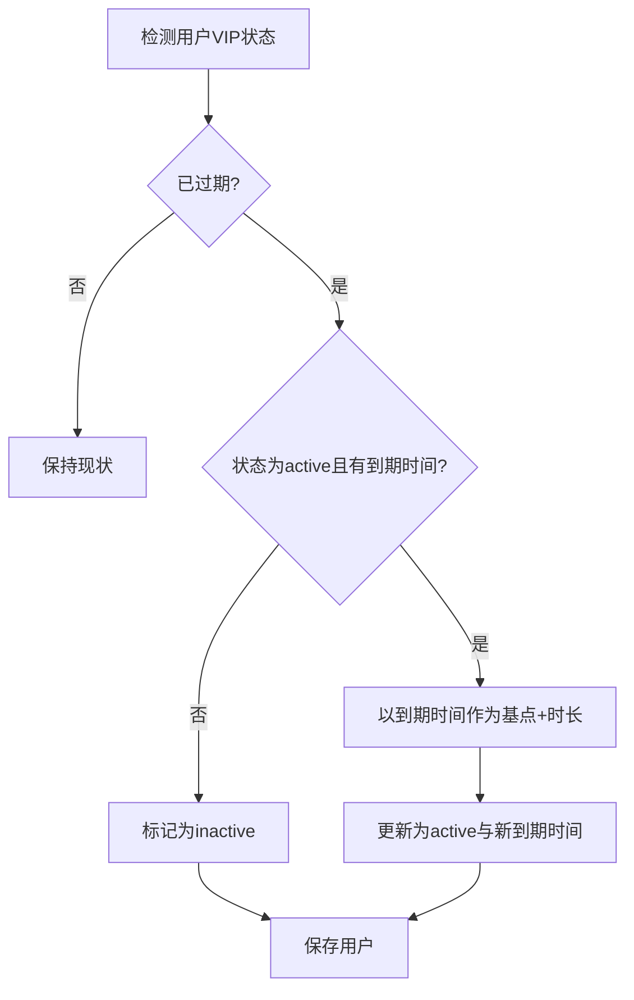
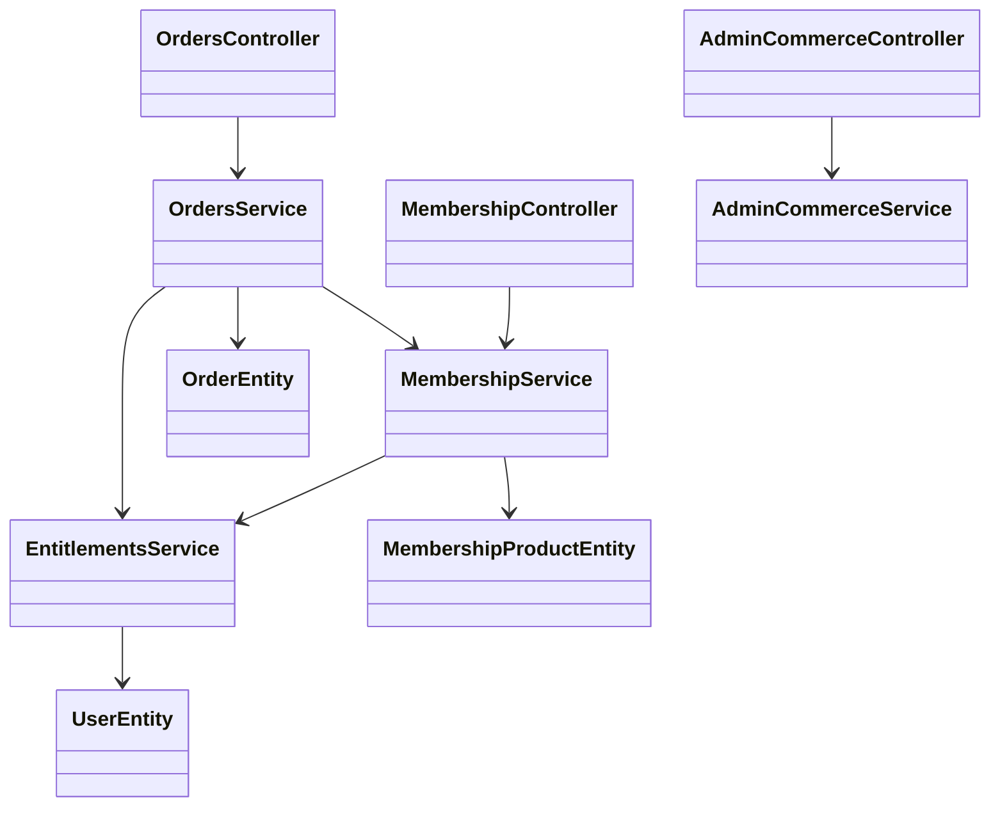

# 商业化接口

<cite>
**本文引用的文件**
- [services/api/src/admin-commerce/admin-commerce.controller.ts](file://services/api/src/admin-commerce/admin-commerce.controller.ts)
- [services/api/src/admin-commerce/admin-commerce.service.ts](file://services/api/src/admin-commerce/admin-commerce.service.ts)
- [services/api/src/admin-commerce/dto/save-membership-product.dto.ts](file://services/api/src/admin-commerce/dto/save-membership-product.dto.ts)
- [services/api/src/membership/membership.controller.ts](file://services/api/src/membership/membership.controller.ts)
- [services/api/src/membership/membership.service.ts](file://services/api/src/membership/membership.service.ts)
- [services/api/src/orders/orders.controller.ts](file://services/api/src/orders/orders.controller.ts)
- [services/api/src/orders/orders.service.ts](file://services/api/src/orders/orders.service.ts)
- [services/api/src/orders/dto/create-order.dto.ts](file://services/api/src/orders/dto/create-order.dto.ts)
- [services/api/src/orders/dto/order-pay-callback.dto.ts](file://services/api/src/orders/dto/order-pay-callback.dto.ts)
- [services/api/src/commerce/commerce.defaults.ts](file://services/api/src/commerce/commerce.defaults.ts)
- [services/api/src/database/entities/membership-product.entity.ts](file://services/api/src/database/entities/membership-product.entity.ts)
- [services/api/src/database/entities/order.entity.ts](file://services/api/src/database/entities/order.entity.ts)
- [services/api/src/database/entities/user.entity.ts](file://services/api/src/database/entities/user.entity.ts)
- [services/api/src/entitlements/entitlements.service.ts](file://services/api/src/entitlements/entitlements.service.ts)
- [services/api/src/auth/auth.service.ts](file://services/api/src/auth/auth.service.ts)
- [services/api/src/auth/sms-code.service.ts](file://services/api/src/auth/sms-code.service.ts)
- [services/api/src/redis/redis.service.ts](file://services/api/src/redis/redis.service.ts)
</cite>

## 目录
1. [简介](#简介)
2. [项目结构](#项目结构)
3. [核心组件](#核心组件)
4. [架构总览](#架构总览)
5. [详细组件分析](#详细组件分析)
6. [依赖关系分析](#依赖关系分析)
7. [性能考量](#性能考量)
8. [故障排查指南](#故障排查指南)
9. [结论](#结论)
10. [附录：接口清单与调用示例](#附录接口清单与调用示例)

## 简介
本文件面向商业化接口的完整说明，覆盖会员管理、订单处理、商品管理、支付集成、营销活动（权益）、财务结算与风控安全机制。文档以代码为依据，结合实体模型与服务层实现，提供接口定义、调用流程、错误处理与最佳实践，帮助开发者快速理解并集成。

## 项目结构
- 后端采用 NestJS 架构，按功能模块拆分控制器与服务层，数据库使用 TypeORM 实体映射。
- 电商相关模块集中在 membership（会员）、orders（订单）、admin-commerce（后台商品与订单管理）。
- 权益校验由 entitlements 服务统一处理；支付流程通过订单服务与支付模式配置解耦；短信验证码由独立服务负责风控与发送。

图表来源
- [services/api/src/membership/membership.controller.ts:1-18](file://services/api/src/membership/membership.controller.ts#L1-L18)
- [services/api/src/orders/orders.controller.ts:1-31](file://services/api/src/orders/orders.controller.ts#L1-L31)
- [services/api/src/admin-commerce/admin-commerce.controller.ts:1-60](file://services/api/src/admin-commerce/admin-commerce.controller.ts#L1-L60)
- [services/api/src/membership/membership.service.ts:1-115](file://services/api/src/membership/membership.service.ts#L1-L115)
- [services/api/src/orders/orders.service.ts:1-160](file://services/api/src/orders/orders.service.ts#L1-L160)
- [services/api/src/admin-commerce/admin-commerce.service.ts:1-256](file://services/api/src/admin-commerce/admin-commerce.service.ts#L1-L256)
- [services/api/src/entitlements/entitlements.service.ts:1-78](file://services/api/src/entitlements/entitlements.service.ts#L1-L78)
- [services/api/src/auth/auth.service.ts:1-419](file://services/api/src/auth/auth.service.ts#L1-L419)
- [services/api/src/auth/sms-code.service.ts:1-400](file://services/api/src/auth/sms-code.service.ts#L1-L400)
- [services/api/src/redis/redis.service.ts:1-125](file://services/api/src/redis/redis.service.ts#L1-L125)

章节来源
- [services/api/src/membership/membership.controller.ts:1-18](file://services/api/src/membership/membership.controller.ts#L1-L18)
- [services/api/src/orders/orders.controller.ts:1-31](file://services/api/src/orders/orders.controller.ts#L1-L31)
- [services/api/src/admin-commerce/admin-commerce.controller.ts:1-60](file://services/api/src/admin-commerce/admin-commerce.controller.ts#L1-L60)

## 核心组件
- 认证与会话：基于 Bearer Token 的会话存储于 Redis，支持微信登录与手机号验证码登录。
- 会员体系：会员商品（membership-product）与用户 VIP 状态（vipStatus/vipExpiredAt）管理，权益刷新与授予。
- 订单系统：订单实体（order）记录购买行为，支持支付模式配置与回调处理。
- 后台管理：会员商品的增删改查、上下架与订单列表、转化率统计。
- 风控与短信：短信发送频率限制、IP 与日累计限制、验证码哈希比对与防重放。

章节来源
- [services/api/src/auth/auth.service.ts:1-419](file://services/api/src/auth/auth.service.ts#L1-L419)
- [services/api/src/redis/redis.service.ts:1-125](file://services/api/src/redis/redis.service.ts#L1-L125)
- [services/api/src/auth/sms-code.service.ts:1-400](file://services/api/src/auth/sms-code.service.ts#L1-L400)
- [services/api/src/membership/membership.service.ts:1-115](file://services/api/src/membership/membership.service.ts#L1-L115)
- [services/api/src/orders/orders.service.ts:1-160](file://services/api/src/orders/orders.service.ts#L1-L160)
- [services/api/src/admin-commerce/admin-commerce.service.ts:1-256](file://services/api/src/admin-commerce/admin-commerce.service.ts#L1-L256)

## 架构总览
下图展示从移动端到服务端的关键交互路径，以及与数据库、Redis、短信服务的协作。

图表来源
- [services/api/src/auth/auth.service.ts:1-419](file://services/api/src/auth/auth.service.ts#L1-L419)
- [services/api/src/membership/membership.service.ts:1-115](file://services/api/src/membership/membership.service.ts#L1-L115)
- [services/api/src/orders/orders.service.ts:1-160](file://services/api/src/orders/orders.service.ts#L1-L160)
- [services/api/src/entitlements/entitlements.service.ts:1-78](file://services/api/src/entitlements/entitlements.service.ts#L1-L78)
- [services/api/src/database/entities/order.entity.ts:1-53](file://services/api/src/database/entities/order.entity.ts#L1-L53)
- [services/api/src/database/entities/user.entity.ts:1-75](file://services/api/src/database/entities/user.entity.ts#L1-L75)

## 详细组件分析

### 会员管理接口
- 功能要点
  - 会员状态查询：根据 Authorization 头解析用户，刷新并返回 VIP 状态、到期时间、权益列表与可购商品。
  - 商品管理（后台）：新增、编辑、删除、上下架会员商品；确保默认商品在首次访问时落库。
  - 权益授予与刷新：根据订单支付成功后的商品时长，延长或激活用户 VIP 有效期。

- 关键实体与字段
  - 用户实体包含 VIP 状态与到期时间，用于权益判定。
  - 会员商品实体包含价格、时长、排序与状态，支撑前台展示与后台管理。

- 接口清单
  - GET /membership/status：查询当前会员状态与权益
  - GET /admin/membership-products：后台列出所有会员商品
  - POST /admin/membership-products：创建会员商品
  - PUT /admin/membership-products/:code：更新会员商品
  - DELETE /admin/membership-products/:code：删除会员商品
  - POST /admin/membership-products/:code/status：更新商品状态(draft/published)

- 调用流程（状态查询）

图表来源
- [services/api/src/membership/membership.controller.ts:1-18](file://services/api/src/membership/membership.controller.ts#L1-L18)
- [services/api/src/membership/membership.service.ts:1-115](file://services/api/src/membership/membership.service.ts#L1-L115)
- [services/api/src/entitlements/entitlements.service.ts:1-78](file://services/api/src/entitlements/entitlements.service.ts#L1-L78)

章节来源
- [services/api/src/membership/membership.controller.ts:1-18](file://services/api/src/membership/membership.controller.ts#L1-L18)
- [services/api/src/membership/membership.service.ts:1-115](file://services/api/src/membership/membership.service.ts#L1-L115)
- [services/api/src/admin-commerce/admin-commerce.controller.ts:1-60](file://services/api/src/admin-commerce/admin-commerce.controller.ts#L1-L60)
- [services/api/src/admin-commerce/admin-commerce.service.ts:1-256](file://services/api/src/admin-commerce/admin-commerce.service.ts#L1-L256)
- [services/api/src/commerce/commerce.defaults.ts:1-36](file://services/api/src/commerce/commerce.defaults.ts#L1-L36)
- [services/api/src/database/entities/membership-product.entity.ts:1-50](file://services/api/src/database/entities/membership-product.entity.ts#L1-L50)
- [services/api/src/database/entities/user.entity.ts:1-75](file://services/api/src/database/entities/user.entity.ts#L1-L75)

### 订单处理接口
- 功能要点
  - 订单创建：解析用户、校验支付模式、加载商品、生成唯一订单号、持久化待支付状态。
  - 支付回调：仅在模拟环境允许回调；更新订单状态、交易号与打款时间；支付成功后授予会员权益。
  - 订单查询与统计（后台）：分页查询、按状态过滤、转化率与收入统计。

- 关键实体与字段
  - 订单实体包含用户ID、订单号、商品信息、金额、类型、状态、交易号与打款时间等。

- 接口清单
  - POST /orders/create：创建订单
  - POST /orders/:orderNo/pay-callback：支付回调（模拟）
  - GET /admin/orders：后台订单列表
  - GET /admin/orders/stats：后台订单统计

- 流程图（订单创建）

图表来源
- [services/api/src/orders/orders.service.ts:1-160](file://services/api/src/orders/orders.service.ts#L1-L160)
- [services/api/src/database/entities/order.entity.ts:1-53](file://services/api/src/database/entities/order.entity.ts#L1-L53)

章节来源
- [services/api/src/orders/orders.controller.ts:1-31](file://services/api/src/orders/orders.controller.ts#L1-L31)
- [services/api/src/orders/orders.service.ts:1-160](file://services/api/src/orders/orders.service.ts#L1-L160)
- [services/api/src/admin-commerce/admin-commerce.controller.ts:42-58](file://services/api/src/admin-commerce/admin-commerce.controller.ts#L42-L58)
- [services/api/src/admin-commerce/admin-commerce.service.ts:150-225](file://services/api/src/admin-commerce/admin-commerce.service.ts#L150-L225)
- [services/api/src/database/entities/order.entity.ts:1-53](file://services/api/src/database/entities/order.entity.ts#L1-L53)

### 商品管理接口（后台）
- 功能要点
  - 会员商品的增删改查与状态切换，支持草稿与发布两种状态。
  - 首次访问时自动填充默认商品集，保证商品目录可用。

- DTO 校验
  - 会员商品创建/更新 DTO 对字段长度、数值范围、枚举值进行严格校验。

章节来源
- [services/api/src/admin-commerce/admin-commerce.controller.ts:11-40](file://services/api/src/admin-commerce/admin-commerce.controller.ts#L11-L40)
- [services/api/src/admin-commerce/admin-commerce.service.ts:22-148](file://services/api/src/admin-commerce/admin-commerce.service.ts#L22-L148)
- [services/api/src/admin-commerce/dto/save-membership-product.dto.ts:1-50](file://services/api/src/admin-commerce/dto/save-membership-product.dto.ts#L1-L50)
- [services/api/src/commerce/commerce.defaults.ts:1-36](file://services/api/src/commerce/commerce.defaults.ts#L1-L36)

### 权益与续费处理
- 功能要点
  - 刷新会员状态：若到期但未刷新则标记为非活跃。
  - 授予会员资格：以当前时间为基准或以到期时间为基准，按商品时长延长有效期。
  - 全量报告访问控制：根据 VIP 状态决定是否解锁完整报告。

- 续费流程

图表来源
- [services/api/src/entitlements/entitlements.service.ts:1-78](file://services/api/src/entitlements/entitlements.service.ts#L1-L78)
- [services/api/src/database/entities/user.entity.ts:1-75](file://services/api/src/database/entities/user.entity.ts#L1-L75)

章节来源
- [services/api/src/entitlements/entitlements.service.ts:1-78](file://services/api/src/entitlements/entitlements.service.ts#L1-L78)
- [services/api/src/database/entities/user.entity.ts:1-75](file://services/api/src/database/entities/user.entity.ts#L1-L75)

### 支付集成接口
- 支付模式
  - 模拟（开发环境）：允许回调，便于联调。
  - 微信（接入中）：预留通道，当前未接入。
  - 禁用（生产环境）：默认关闭支付。

- 回调处理
  - 仅当支付模式为模拟时允许回调；否则拒绝。
  - 更新订单状态与打款时间；支付成功后授予会员权益。

章节来源
- [services/api/src/orders/orders.service.ts:137-158](file://services/api/src/orders/orders.service.ts#L137-L158)
- [services/api/src/orders/orders.controller.ts:23-29](file://services/api/src/orders/orders.controller.ts#L23-L29)

### 营销活动与权益
- 当前实现聚焦会员权益（完整报告、历史记录解锁、海报生成），未见独立的优惠券、积分、折扣、拼团等营销活动接口。
- 权益验证通过用户 VIP 状态与到期时间判断，支持对特定内容的访问控制。

章节来源
- [services/api/src/membership/membership.service.ts:17-42](file://services/api/src/membership/membership.service.ts#L17-L42)
- [services/api/src/entitlements/entitlements.service.ts:63-76](file://services/api/src/entitlements/entitlements.service.ts#L63-L76)

### 财务结算与报表
- 后台提供订单统计接口，返回总单数、已支付单数、总金额、当月金额与转化率。
- 结算维度以订单为单位，未见分账、税务处理等扩展。

章节来源
- [services/api/src/admin-commerce/admin-commerce.controller.ts:55-58](file://services/api/src/admin-commerce/admin-commerce.controller.ts#L55-L58)
- [services/api/src/admin-commerce/admin-commerce.service.ts:189-225](file://services/api/src/admin-commerce/admin-commerce.service.ts#L189-L225)

## 依赖关系分析
- 控制器依赖服务层，服务层依赖实体与配置。
- 订单服务依赖会员服务与权益服务，确保支付完成后正确授予会员资格。
- 认证服务依赖 Redis 进行会话存储，依赖短信服务进行手机号登录校验。
- 权益服务直接操作用户实体，维护 VIP 状态一致性。

图表来源
- [services/api/src/membership/membership.controller.ts:1-18](file://services/api/src/membership/membership.controller.ts#L1-L18)
- [services/api/src/orders/orders.controller.ts:1-31](file://services/api/src/orders/orders.controller.ts#L1-L31)
- [services/api/src/admin-commerce/admin-commerce.controller.ts:1-60](file://services/api/src/admin-commerce/admin-commerce.controller.ts#L1-L60)
- [services/api/src/membership/membership.service.ts:1-115](file://services/api/src/membership/membership.service.ts#L1-L115)
- [services/api/src/orders/orders.service.ts:1-160](file://services/api/src/orders/orders.service.ts#L1-L160)
- [services/api/src/admin-commerce/admin-commerce.service.ts:1-256](file://services/api/src/admin-commerce/admin-commerce.service.ts#L1-L256)
- [services/api/src/entitlements/entitlements.service.ts:1-78](file://services/api/src/entitlements/entitlements.service.ts#L1-L78)
- [services/api/src/database/entities/membership-product.entity.ts:1-50](file://services/api/src/database/entities/membership-product.entity.ts#L1-L50)
- [services/api/src/database/entities/order.entity.ts:1-53](file://services/api/src/database/entities/order.entity.ts#L1-L53)
- [services/api/src/database/entities/user.entity.ts:1-75](file://services/api/src/database/entities/user.entity.ts#L1-L75)

## 性能考量
- Redis 会话与短信验证码：建议合理设置 TTL 与连接池，避免阻塞与抖动。
- 订单查询：后台分页查询需配合索引优化；统计接口建议缓存近期聚合结果。
- 权益刷新：批量刷新用户 VIP 状态时注意并发与锁竞争，必要时引入队列异步处理。

## 故障排查指南
- 登录态失效
  - 现象：返回“登录状态已失效，请重新登录”。
  - 排查：确认 Authorization 头格式、Token 是否存在于 Redis、用户是否存在。
- 支付回调被拒
  - 现象：当前环境不允许模拟回调或支付模式非模拟。
  - 排查：检查支付模式配置与环境变量，确保仅在开发环境启用模拟回调。
- 商品不存在
  - 现象：创建/更新商品时报错“会员商品不存在”。
  - 排查：确认商品 code 唯一性与状态，确保默认商品已初始化。
- 短信发送受限
  - 现象：验证码发送过于频繁或次数超限。
  - 排查：检查 Redis 中冷却、日累计与 IP 计数键，核对配置项与阈值。

章节来源
- [services/api/src/auth/auth.service.ts:171-200](file://services/api/src/auth/auth.service.ts#L171-L200)
- [services/api/src/orders/orders.service.ts:60-64](file://services/api/src/orders/orders.service.ts#L60-L64)
- [services/api/src/admin-commerce/admin-commerce.service.ts:74-82](file://services/api/src/admin-commerce/admin-commerce.service.ts#L74-L82)
- [services/api/src/auth/sms-code.service.ts:115-146](file://services/api/src/auth/sms-code.service.ts#L115-L146)

## 结论
本商业化接口围绕会员与订单两大核心闭环展开，具备完善的权限校验、权益授予与后台管理能力。支付集成以模拟模式为主，后续可按需接入微信支付；风控方面通过短信服务与会话缓存形成基础防护。建议在生产环境逐步完善支付通道、营销活动与财务结算能力，并加强监控与审计。

## 附录：接口清单与调用示例

- 会员状态查询
  - 方法与路径：GET /membership/status
  - 请求头：Authorization: Bearer <token>
  - 返回：当前 VIP 状态、到期时间、权益列表与可购商品
  - 参考实现：[services/api/src/membership/membership.controller.ts:12-16](file://services/api/src/membership/membership.controller.ts#L12-L16)

- 创建订单
  - 方法与路径：POST /orders/create
  - 请求头：Authorization: Bearer <token>
  - 请求体：{ productCode }
  - 返回：订单信息与支付提示（开发环境为模拟）
  - 参考实现：[services/api/src/orders/orders.controller.ts:14-21](file://services/api/src/orders/orders.controller.ts#L14-L21)，[services/api/src/orders/dto/create-order.dto.ts:1-8](file://services/api/src/orders/dto/create-order.dto.ts#L1-L8)

- 支付回调（模拟）
  - 方法与路径：POST /orders/{orderNo}/pay-callback
  - 请求体：{ status?, transactionNo? }
  - 返回：订单状态与会员到期时间
  - 参考实现：[services/api/src/orders/orders.controller.ts:23-29](file://services/api/src/orders/orders.controller.ts#L23-L29)，[services/api/src/orders/dto/order-pay-callback.dto.ts:1-14](file://services/api/src/orders/dto/order-pay-callback.dto.ts#L1-L14)

- 后台：会员商品管理
  - 列表：GET /admin/membership-products
  - 新增：POST /admin/membership-products
  - 更新：PUT /admin/membership-products/:code
  - 删除：DELETE /admin/membership-products/:code
  - 上下架：POST /admin/membership-products/:code/status
  - 参考实现：[services/api/src/admin-commerce/admin-commerce.controller.ts:11-40](file://services/api/src/admin-commerce/admin-commerce.controller.ts#L11-L40)，[services/api/src/admin-commerce/dto/save-membership-product.dto.ts:1-50](file://services/api/src/admin-commerce/dto/save-membership-product.dto.ts#L1-L50)

- 后台：订单管理与统计
  - 订单列表：GET /admin/orders?page&pageSize&status
  - 统计：GET /admin/orders/stats
  - 参考实现：[services/api/src/admin-commerce/admin-commerce.controller.ts:42-58](file://services/api/src/admin-commerce/admin-commerce.controller.ts#L42-L58)，[services/api/src/admin-commerce/admin-commerce.service.ts:150-225](file://services/api/src/admin-commerce/admin-commerce.service.ts#L150-L225)

- 错误处理要点
  - 未授权：Authorization 缺失或无效、会话失效
  - 参数错误：DTO 校验失败（如长度、数值范围、枚举）
  - 业务异常：商品不存在、支付模式不匹配、短信发送超限
  - 参考实现：各服务层抛出异常处与控制器返回封装