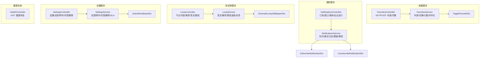
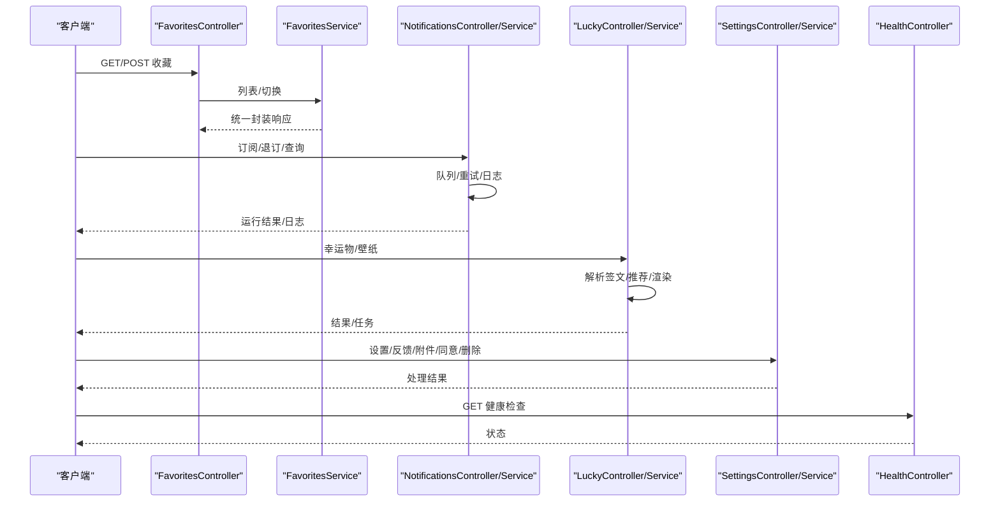
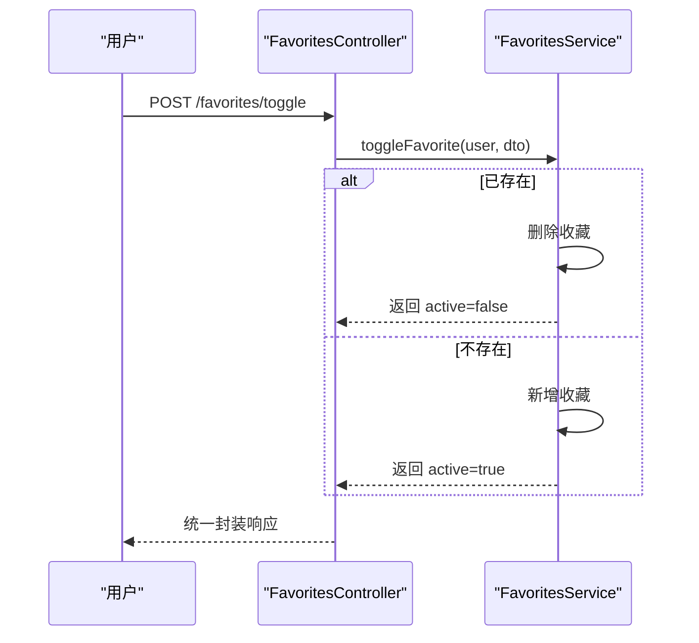
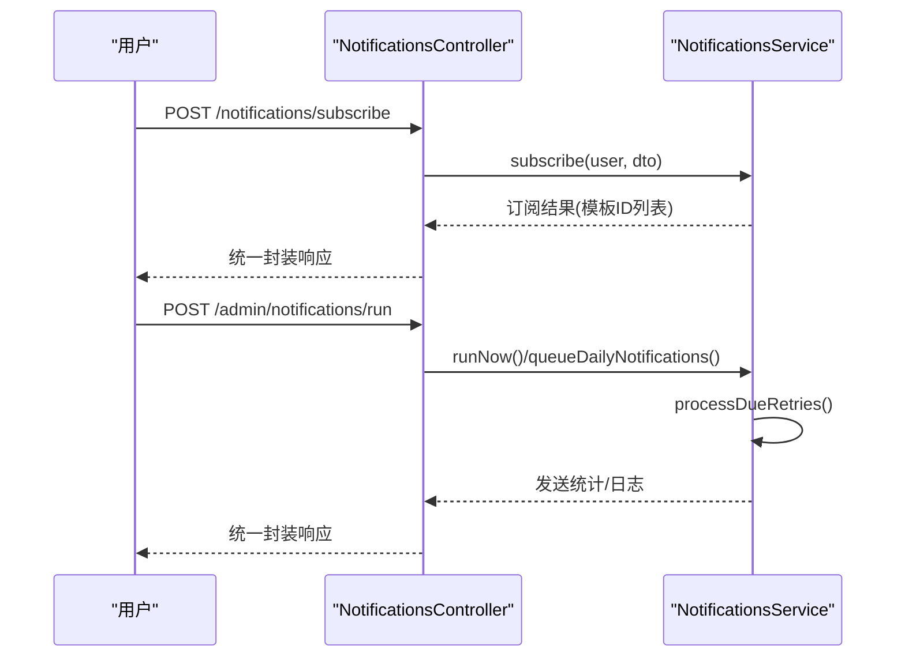
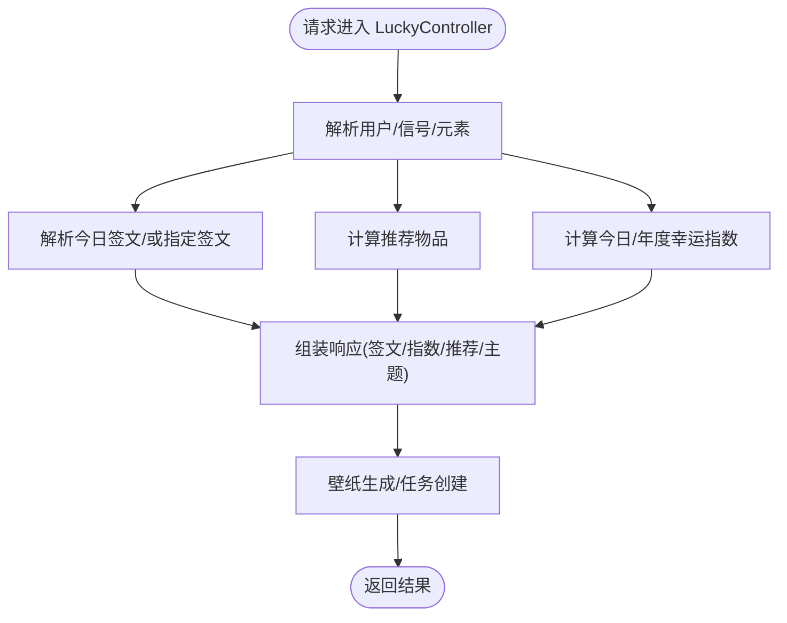
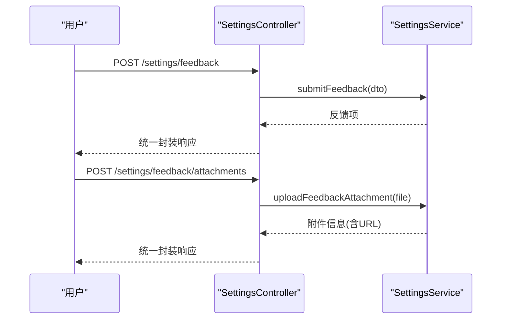
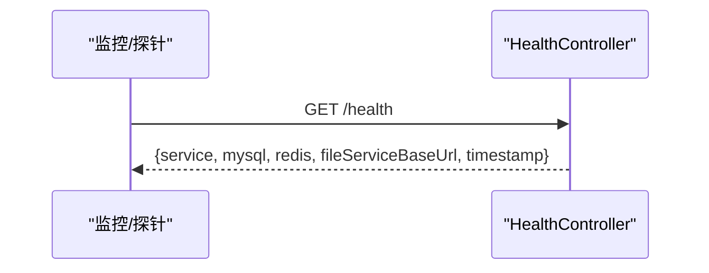
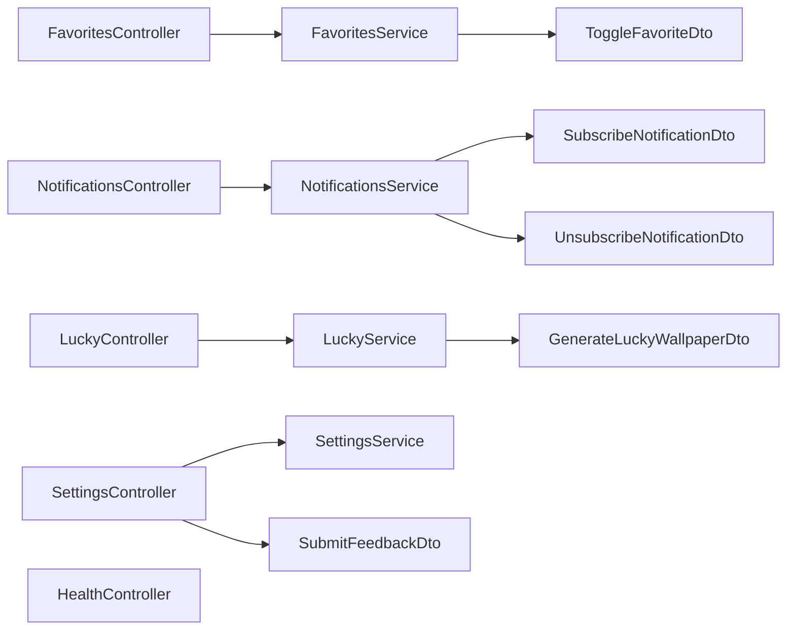

# 工具类接口

<cite>
**本文引用的文件**
- [services/api/src/favorites/favorites.controller.ts](file://services/api/src/favorites/favorites.controller.ts)
- [services/api/src/favorites/favorites.service.ts](file://services/api/src/favorites/favorites.service.ts)
- [services/api/src/favorites/dto/toggle-favorite.dto.ts](file://services/api/src/favorites/dto/toggle-favorite.dto.ts)
- [services/api/src/notifications/notifications.controller.ts](file://services/api/src/notifications/notifications.controller.ts)
- [services/api/src/notifications/notifications.service.ts](file://services/api/src/notifications/notifications.service.ts)
- [services/api/src/notifications/dto/subscribe-notification.dto.ts](file://services/api/src/notifications/dto/subscribe-notification.dto.ts)
- [services/api/src/notifications/dto/unsubscribe-notification.dto.ts](file://services/api/src/notifications/dto/unsubscribe-notification.dto.ts)
- [services/api/src/lucky/lucky.controller.ts](file://services/api/src/lucky/lucky.controller.ts)
- [services/api/src/lucky/lucky.service.ts](file://services/api/src/lucky/lucky.service.ts)
- [services/api/src/lucky/dto/generate-lucky-wallpaper.dto.ts](file://services/api/src/lucky/dto/generate-lucky-wallpaper.dto.ts)
- [services/api/src/settings/settings.controller.ts](file://services/api/src/settings/settings.controller.ts)
- [services/api/src/settings/settings.service.ts](file://services/api/src/settings/settings.service.ts)
- [services/api/src/settings/dto/submit-feedback.dto.ts](file://services/api/src/settings/dto/submit-feedback.dto.ts)
- [services/api/src/health/health.controller.ts](file://services/api/src/health/health.controller.ts)
</cite>

## 目录
1. [简介](#简介)
2. [项目结构](#项目结构)
3. [核心组件](#核心组件)
4. [架构总览](#架构总览)
5. [详细组件分析](#详细组件分析)
6. [依赖关系分析](#依赖关系分析)
7. [性能考量](#性能考量)
8. [故障排查指南](#故障排查指南)
9. [结论](#结论)
10. [附录](#附录)

## 简介
本文件面向“工具类接口”的使用与维护，覆盖以下能力域：
- 收藏管理：添加/取消收藏、列表查询、批量退订（基于收藏键的批量操作语义）
- 消息通知：推送订阅、消息发送、状态追踪、历史记录、定时/重试调度
- 幸运物：今日/年度幸运指数、签文解析、物品推荐、壁纸生成与任务查询
- 系统设置：用户偏好、隐私设置、反馈提交与附件上传、数据删除申请、同意记录
- 文件上传：图片处理、格式校验、压缩优化、存储代理
- 健康检查：服务状态、数据库连接、缓存状态、第三方服务可用性
- 国际化支持：多语言切换、本地化配置、时区处理（概念性说明）
- 调试工具：日志查询、性能监控、错误追踪、数据导出（概念性说明）

## 项目结构
后端采用 NestJS 架构，按功能模块划分控制器与服务层，统一返回体封装，实体持久化基于 TypeORM。

图表来源
- [services/api/src/favorites/favorites.controller.ts:1-28](file://services/api/src/favorites/favorites.controller.ts#L1-L28)
- [services/api/src/favorites/favorites.service.ts:1-111](file://services/api/src/favorites/favorites.service.ts#L1-L111)
- [services/api/src/notifications/notifications.controller.ts:1-105](file://services/api/src/notifications/notifications.controller.ts#L1-L105)
- [services/api/src/notifications/notifications.service.ts:1-553](file://services/api/src/notifications/notifications.service.ts#L1-L553)
- [services/api/src/lucky/lucky.controller.ts:1-70](file://services/api/src/lucky/lucky.controller.ts#L1-L70)
- [services/api/src/lucky/lucky.service.ts:1-800](file://services/api/src/lucky/lucky.service.ts#L1-L800)
- [services/api/src/settings/settings.controller.ts:1-133](file://services/api/src/settings/settings.controller.ts#L1-L133)
- [services/api/src/settings/settings.service.ts:1-655](file://services/api/src/settings/settings.service.ts#L1-L655)
- [services/api/src/health/health.controller.ts:1-28](file://services/api/src/health/health.controller.ts#L1-L28)

章节来源
- [services/api/src/favorites/favorites.controller.ts:1-28](file://services/api/src/favorites/favorites.controller.ts#L1-L28)
- [services/api/src/notifications/notifications.controller.ts:1-105](file://services/api/src/notifications/notifications.controller.ts#L1-L105)
- [services/api/src/lucky/lucky.controller.ts:1-70](file://services/api/src/lucky/lucky.controller.ts#L1-L70)
- [services/api/src/settings/settings.controller.ts:1-133](file://services/api/src/settings/settings.controller.ts#L1-L133)
- [services/api/src/health/health.controller.ts:1-28](file://services/api/src/health/health.controller.ts#L1-L28)

## 核心组件
- 收藏管理
  - 控制器：提供收藏列表查询与切换接口
  - 服务：实现收藏列表、切换（新增/删除）、最近收藏与计数
- 消息通知
  - 控制器：提供订阅/退订/查询；管理员后台提供运行/重试/清理/定时
  - 服务：实现队列构建、重试调度、日志过滤、模板渲染、微信订阅消息发送
- 幸运物
  - 控制器：提供今日/年度/推荐/签文详情/壁纸生成与任务查询
  - 服务：实现签文解析、推荐算法、壁纸渲染与持久化、任务异步处理
- 系统设置
  - 控制器：提供设置读取、反馈提交、附件上传、我的反馈、同意记录、数据删除申请
  - 服务：实现反馈/附件/同意/删除流程与SLA计算
- 健康检查
  - 控制器：返回服务、数据库、缓存、文件服务基地址与时间戳

章节来源
- [services/api/src/favorites/favorites.controller.ts:13-26](file://services/api/src/favorites/favorites.controller.ts#L13-L26)
- [services/api/src/favorites/favorites.service.ts:15-87](file://services/api/src/favorites/favorites.service.ts#L15-L87)
- [services/api/src/notifications/notifications.controller.ts:18-41](file://services/api/src/notifications/notifications.controller.ts#L18-L41)
- [services/api/src/notifications/notifications.service.ts:76-158](file://services/api/src/notifications/notifications.service.ts#L76-L158)
- [services/api/src/lucky/lucky.controller.ts:13-68](file://services/api/src/lucky/lucky.controller.ts#L13-L68)
- [services/api/src/lucky/lucky.service.ts:158-350](file://services/api/src/lucky/lucky.service.ts#L158-L350)
- [services/api/src/settings/settings.controller.ts:56-122](file://services/api/src/settings/settings.controller.ts#L56-L122)
- [services/api/src/settings/settings.service.ts:71-370](file://services/api/src/settings/settings.service.ts#L71-L370)
- [services/api/src/health/health.controller.ts:14-26](file://services/api/src/health/health.controller.ts#L14-L26)

## 架构总览
下图展示请求从控制器到服务与数据库/外部服务的流转路径。

图表来源
- [services/api/src/favorites/favorites.controller.ts:1-28](file://services/api/src/favorites/favorites.controller.ts#L1-L28)
- [services/api/src/favorites/favorites.service.ts:1-111](file://services/api/src/favorites/favorites.service.ts#L1-L111)
- [services/api/src/notifications/notifications.controller.ts:1-105](file://services/api/src/notifications/notifications.controller.ts#L1-L105)
- [services/api/src/notifications/notifications.service.ts:1-553](file://services/api/src/notifications/notifications.service.ts#L1-L553)
- [services/api/src/lucky/lucky.controller.ts:1-70](file://services/api/src/lucky/lucky.controller.ts#L1-L70)
- [services/api/src/lucky/lucky.service.ts:1-800](file://services/api/src/lucky/lucky.service.ts#L1-L800)
- [services/api/src/settings/settings.controller.ts:1-133](file://services/api/src/settings/settings.controller.ts#L1-L133)
- [services/api/src/settings/settings.service.ts:1-655](file://services/api/src/settings/settings.service.ts#L1-L655)
- [services/api/src/health/health.controller.ts:1-28](file://services/api/src/health/health.controller.ts#L1-L28)

## 详细组件分析

### 收藏管理
- 接口概览
  - 查询收藏列表：GET /favorites
  - 切换收藏：POST /favorites/toggle
- 关键行为
  - 切换逻辑：若存在则删除，否则新增；返回 active 状态与序列化后的收藏项
  - 列表查询：按用户过滤、倒序、限制条数
  - 最近收藏与计数：供前端快速展示
- 数据模型要点
  - 使用收藏实体进行持久化，字段包含类型、键、标题、摘要、图标、路由与扩展JSON
- 错误与边界
  - 通过 DTO 校验输入长度与类型，避免脏数据
  - 未授权时由认证中间件拦截

图表来源
- [services/api/src/favorites/favorites.controller.ts:19-26](file://services/api/src/favorites/favorites.controller.ts#L19-L26)
- [services/api/src/favorites/favorites.service.ts:31-65](file://services/api/src/favorites/favorites.service.ts#L31-L65)

章节来源
- [services/api/src/favorites/favorites.controller.ts:13-26](file://services/api/src/favorites/favorites.controller.ts#L13-L26)
- [services/api/src/favorites/favorites.service.ts:15-87](file://services/api/src/favorites/favorites.service.ts#L15-L87)
- [services/api/src/favorites/dto/toggle-favorite.dto.ts:8-38](file://services/api/src/favorites/dto/toggle-favorite.dto.ts#L8-L38)

### 消息通知
- 接口概览
  - 查询我的订阅：GET /notifications/subscriptions
  - 订阅：POST /notifications/subscribe
  - 退订：DELETE /notifications/subscribe
  - 后台管理：GET /admin/notifications/logs
  - 后台管理：POST /admin/notifications/run（立即发送/入队）
  - 后台管理：POST /admin/notifications/retry
  - 后台管理：POST /admin/notifications/cleanup-expired
  - 后台管理：POST /admin/notifications/run-scheduled
- 关键行为
  - 订阅：去重合并模板ID，设置过期时间与额外信息
  - 退订：按场景与模板ID筛选，批量标记为取消
  - 日常队列：清理过期订阅，按场景筛选用户，构建投递日志
  - 重试：定时/手动触发，带最大重试次数与下次重试时间
  - 日志：支持按场景/状态过滤，返回详细投递信息
  - 微信订阅消息：获取access_token，调用微信API发送
- 安全与审计
  - 管理员操作写入审计日志
  - 用户偏好影响是否发送（夜间免打扰、开关）

图表来源
- [services/api/src/notifications/notifications.controller.ts:24-76](file://services/api/src/notifications/notifications.controller.ts#L24-L76)
- [services/api/src/notifications/notifications.service.ts:76-214](file://services/api/src/notifications/notifications.service.ts#L76-L214)

章节来源
- [services/api/src/notifications/notifications.controller.ts:18-41](file://services/api/src/notifications/notifications.controller.ts#L18-L41)
- [services/api/src/notifications/notifications.controller.ts:48-103](file://services/api/src/notifications/notifications.controller.ts#L48-L103)
- [services/api/src/notifications/notifications.service.ts:160-278](file://services/api/src/notifications/notifications.service.ts#L160-L278)
- [services/api/src/notifications/notifications.service.ts:300-352](file://services/api/src/notifications/notifications.service.ts#L300-L352)
- [services/api/src/notifications/notifications.service.ts:354-366](file://services/api/src/notifications/notifications.service.ts#L354-L366)
- [services/api/src/notifications/notifications.service.ts:441-475](file://services/api/src/notifications/notifications.service.ts#L441-L475)
- [services/api/src/notifications/notifications.service.ts:477-503](file://services/api/src/notifications/notifications.service.ts#L477-L503)
- [services/api/src/notifications/dto/subscribe-notification.dto.ts:10-23](file://services/api/src/notifications/dto/subscribe-notification.dto.ts#L10-L23)
- [services/api/src/notifications/dto/unsubscribe-notification.dto.ts:3-14](file://services/api/src/notifications/dto/unsubscribe-notification.dto.ts#L3-L14)

### 幸运物
- 接口概览
  - 今日幸运：GET /lucky/today
  - 年度详情：GET /lucky/yearly?year=...
  - 物品推荐：GET /lucky/recommendations
  - 签文详情：GET /lucky/signs/:bizCode
  - 壁纸生成：POST /lucky/wallpaper/generate
  - 异步任务：POST /lucky/wallpaper/jobs, GET /lucky/wallpaper/jobs/:jobId
- 关键行为
  - 今日/年度：综合签文、信号、五行元素，计算幸运指数与主题
  - 推荐算法：基于规则与权重，结合个性、情绪、八字等打分
  - 壁纸：模板渲染、文件上传至文件服务、返回公开URL
  - 任务：异步生成，支持查询任务状态
- 数据与配置
  - 种子数据：签文、幸运物、推荐策略与规则
  - 布局与主题：根据比例与元素选择主题色板

图表来源
- [services/api/src/lucky/lucky.controller.ts:13-68](file://services/api/src/lucky/lucky.controller.ts#L13-L68)
- [services/api/src/lucky/lucky.service.ts:158-220](file://services/api/src/lucky/lucky.service.ts#L158-L220)
- [services/api/src/lucky/lucky.service.ts:352-420](file://services/api/src/lucky/lucky.service.ts#L352-L420)
- [services/api/src/lucky/lucky.service.ts:422-457](file://services/api/src/lucky/lucky.service.ts#L422-L457)

章节来源
- [services/api/src/lucky/lucky.controller.ts:13-68](file://services/api/src/lucky/lucky.controller.ts#L13-L68)
- [services/api/src/lucky/lucky.service.ts:158-350](file://services/api/src/lucky/lucky.service.ts#L158-L350)
- [services/api/src/lucky/lucky.service.ts:352-457](file://services/api/src/lucky/lucky.service.ts#L352-L457)
- [services/api/src/lucky/dto/generate-lucky-wallpaper.dto.ts:3-29](file://services/api/src/lucky/dto/generate-lucky-wallpaper.dto.ts#L3-L29)

### 系统设置
- 接口概览
  - 获取设置：GET /settings
  - 提交反馈：POST /settings/feedback
  - 上传反馈附件：POST /settings/feedback/attachments
  - 我的反馈：GET /settings/feedback/my
  - 同意记录：GET /settings/me/consents, POST /settings/me/consents
  - 撤销同意：DELETE /settings/me/consents/:consentType, POST /settings/me/consents/:consentType/revoke
  - 数据删除申请：POST /settings/me/data-deletion-requests
- 关键行为
  - 反馈：支持分类、优先级、SLA计算、管理员回复后通知
  - 附件：限制MIME类型与大小，上传至文件服务，返回公开URL
  - 同意：版本化记录，支持撤销
  - 删除：以反馈形式提交数据删除请求，标注高优先级
- 安全与合规
  - 上传前严格校验MIME与大小
  - 敏感信息脱敏（如手机号掩码）

图表来源
- [services/api/src/settings/settings.controller.ts:62-83](file://services/api/src/settings/settings.controller.ts#L62-L83)
- [services/api/src/settings/settings.service.ts:90-126](file://services/api/src/settings/settings.service.ts#L90-L126)
- [services/api/src/settings/settings.controller.ts:71-83](file://services/api/src/settings/settings.controller.ts#L71-L83)
- [services/api/src/settings/settings.service.ts:234-309](file://services/api/src/settings/settings.service.ts#L234-L309)

章节来源
- [services/api/src/settings/settings.controller.ts:56-122](file://services/api/src/settings/settings.controller.ts#L56-L122)
- [services/api/src/settings/settings.service.ts:71-138](file://services/api/src/settings/settings.service.ts#L71-L138)
- [services/api/src/settings/settings.service.ts:234-310](file://services/api/src/settings/settings.service.ts#L234-L310)
- [services/api/src/settings/settings.service.ts:323-370](file://services/api/src/settings/settings.service.ts#L323-L370)
- [services/api/src/settings/dto/submit-feedback.dto.ts:11-40](file://services/api/src/settings/dto/submit-feedback.dto.ts#L11-L40)

### 健康检查
- 接口概览
  - GET /health：返回服务名、数据库、缓存、文件服务基地址与时间戳
- 关键行为
  - 数据库：基于 TypeORM DataSource 初始化状态
  - 缓存：RedisService ping
  - 文件服务：读取配置基地址

图表来源
- [services/api/src/health/health.controller.ts:14-26](file://services/api/src/health/health.controller.ts#L14-L26)

章节来源
- [services/api/src/health/health.controller.ts:14-26](file://services/api/src/health/health.controller.ts#L14-L26)

## 依赖关系分析
- 控制器依赖服务：各模块控制器均通过构造函数注入对应服务
- 服务依赖仓储与配置：服务层使用 TypeORM Repository 访问数据库，读取 Nest 配置
- 外部集成：通知模块依赖微信订阅消息API与文件服务上传
- 统一返回体：所有服务与控制器均返回包含 code/message/data/timestamp 的封装对象

图表来源
- [services/api/src/favorites/favorites.controller.ts:1-28](file://services/api/src/favorites/favorites.controller.ts#L1-L28)
- [services/api/src/favorites/favorites.service.ts:1-111](file://services/api/src/favorites/favorites.service.ts#L1-L111)
- [services/api/src/notifications/notifications.controller.ts:1-105](file://services/api/src/notifications/notifications.controller.ts#L1-L105)
- [services/api/src/notifications/notifications.service.ts:1-553](file://services/api/src/notifications/notifications.service.ts#L1-L553)
- [services/api/src/lucky/lucky.controller.ts:1-70](file://services/api/src/lucky/lucky.controller.ts#L1-L70)
- [services/api/src/lucky/lucky.service.ts:1-800](file://services/api/src/lucky/lucky.service.ts#L1-L800)
- [services/api/src/settings/settings.controller.ts:1-133](file://services/api/src/settings/settings.controller.ts#L1-L133)
- [services/api/src/settings/settings.service.ts:1-655](file://services/api/src/settings/settings.service.ts#L1-L655)
- [services/api/src/health/health.controller.ts:1-28](file://services/api/src/health/health.controller.ts#L1-L28)

章节来源
- [services/api/src/favorites/favorites.controller.ts:1-28](file://services/api/src/favorites/favorites.controller.ts#L1-L28)
- [services/api/src/notifications/notifications.controller.ts:1-105](file://services/api/src/notifications/notifications.controller.ts#L1-L105)
- [services/api/src/lucky/lucky.controller.ts:1-70](file://services/api/src/lucky/lucky.controller.ts#L1-L70)
- [services/api/src/settings/settings.controller.ts:1-133](file://services/api/src/settings/settings.controller.ts#L1-L133)
- [services/api/src/health/health.controller.ts:1-28](file://services/api/src/health/health.controller.ts#L1-L28)

## 性能考量
- 分页与限制
  - 收藏列表默认限制条数，避免一次性返回过多数据
  - 通知日志与反馈列表默认限制条数，支持 limit 查询参数
- 批处理与异步
  - 壁纸生成采用任务队列异步执行，避免阻塞请求
  - 通知重试按批次处理，受限于每次处理上限
- 缓存与网络
  - 微信 access_token 带缓存与过期时间控制
  - 文件上传设置超时时间，失败时保留内联图片作为降级
- 数据库索引
  - 建议对收藏、订阅、日志等高频查询字段建立索引（如用户ID、场景、状态、创建时间）

## 故障排查指南
- 收藏
  - 若切换无效，检查 DTO 字段长度与类型是否符合约束
  - 列表为空可能因用户未登录或无收藏记录
- 通知
  - 订阅/退订失败：确认模板ID与场景正确，检查用户是否已过期
  - 发送失败：查看日志中的错误信息与重试次数；检查微信密钥配置
  - 重试/定时未触发：确认后台工作线程开关与间隔配置
- 幸运物
  - 签文/推荐为空：检查种子数据是否初始化成功
  - 壁纸生成失败：检查文件服务上传地址与令牌，关注超时异常
- 设置
  - 附件上传失败：确认 MIME 类型与大小限制，检查文件服务可达性
  - 数据删除申请：确认已登录且优先级已提升
- 健康检查
  - 数据库/缓存 DOWN：检查连接配置与服务状态

章节来源
- [services/api/src/favorites/favorites.service.ts:15-29](file://services/api/src/favorites/favorites.service.ts#L15-L29)
- [services/api/src/notifications/notifications.service.ts:280-298](file://services/api/src/notifications/notifications.service.ts#L280-L298)
- [services/api/src/notifications/notifications.service.ts:300-352](file://services/api/src/notifications/notifications.service.ts#L300-L352)
- [services/api/src/lucky/lucky.service.ts:521-566](file://services/api/src/lucky/lucky.service.ts#L521-L566)
- [services/api/src/settings/settings.service.ts:234-309](file://services/api/src/settings/settings.service.ts#L234-L309)
- [services/api/src/health/health.controller.ts:14-26](file://services/api/src/health/health.controller.ts#L14-L26)

## 结论
本工具类接口体系以模块化方式组织，统一返回体与鉴权机制，覆盖收藏、通知、幸运物、设置、健康检查等常用能力。通过任务队列与定时任务实现异步与批处理，借助配置中心与外部服务集成增强可运维性。建议在生产环境中完善索引、监控与告警，并持续优化推荐与渲染策略。

## 附录
- 国际化支持接口（概念性说明）
  - 多语言切换：通过请求头或用户偏好传递语言标识，后端按配置加载对应资源
  - 本地化配置：应用配置表中维护文案与提示，支持版本化与灰度
  - 时区处理：统一使用UTC存储，对外按用户时区转换显示
- 调试工具接口（概念性说明）
  - 日志查询：按时间范围、级别、关键词过滤
  - 性能监控：暴露指标端点，采集关键链路耗时
  - 错误追踪：统一异常捕获与上报，关联请求ID
  - 数据导出：按条件生成报表，支持分页与增量导出