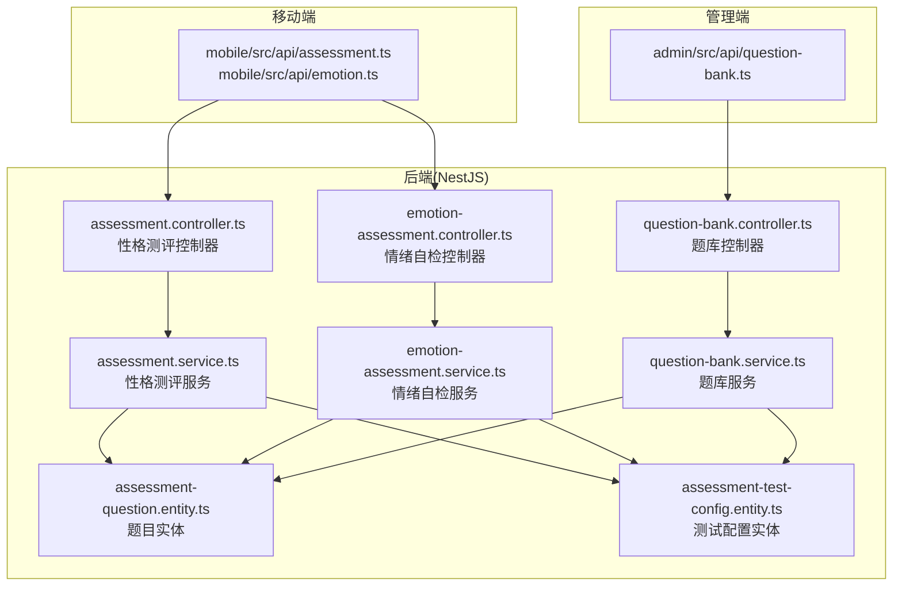
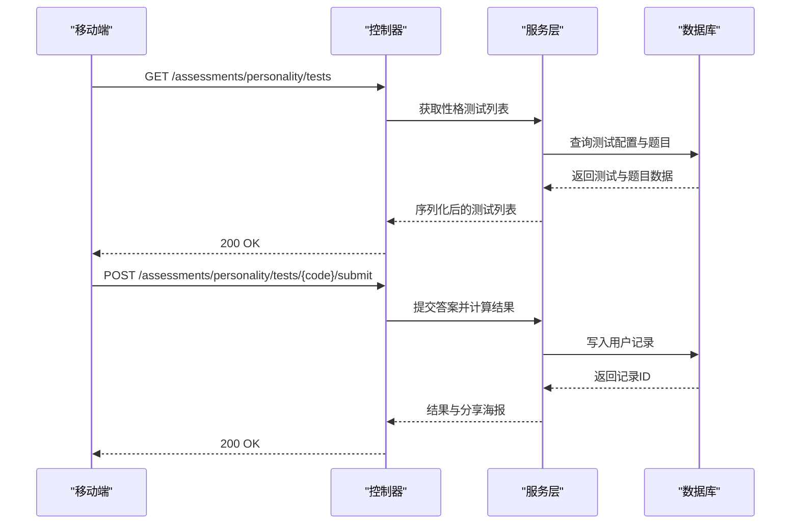
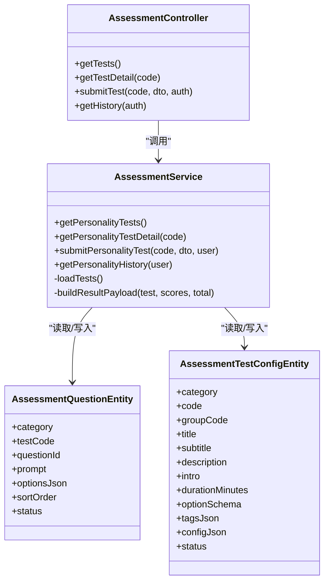
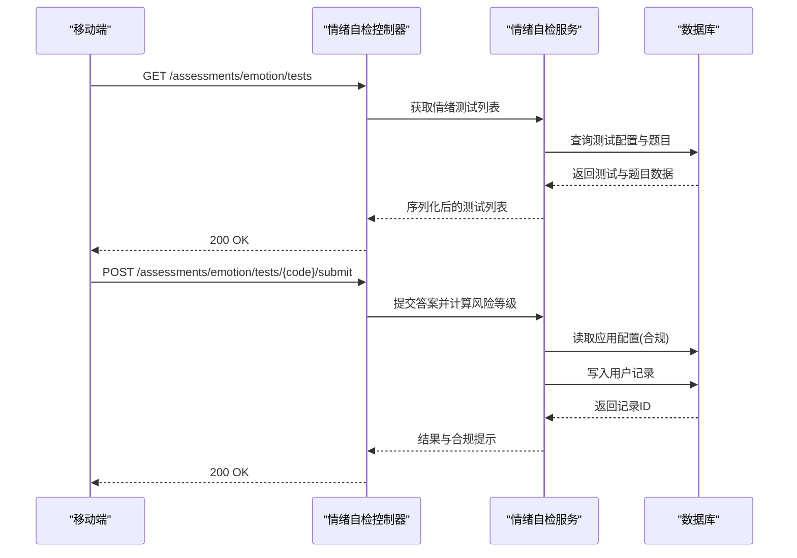
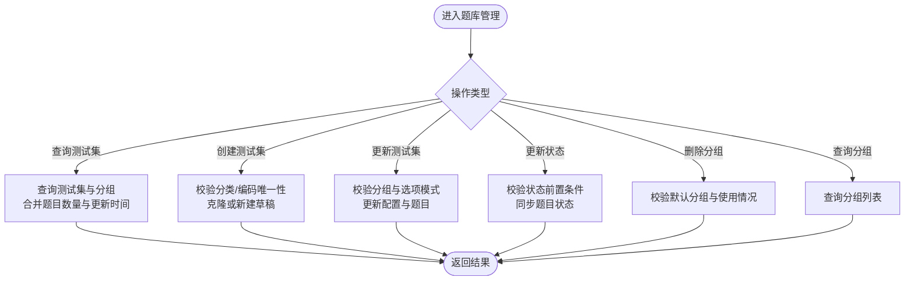
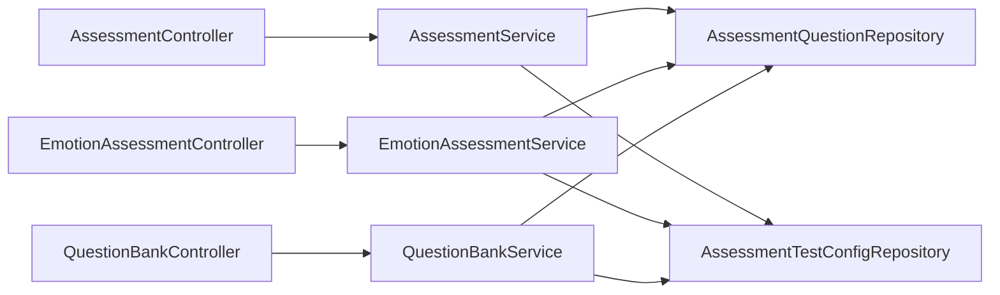

# 性格测评接口

<cite>
**本文引用的文件**
- [services/api/src/assessment/assessment.controller.ts](file://services/api/src/assessment/assessment.controller.ts)
- [services/api/src/assessment/assessment.service.ts](file://services/api/src/assessment/assessment.service.ts)
- [services/api/src/assessment/emotion-assessment.controller.ts](file://services/api/src/assessment/emotion-assessment.controller.ts)
- [services/api/src/assessment/emotion-assessment.service.ts](file://services/api/src/assessment/emotion-assessment.service.ts)
- [services/api/src/assessment/question-bank.controller.ts](file://services/api/src/assessment/question-bank.controller.ts)
- [services/api/src/assessment/question-bank.service.ts](file://services/api/src/assessment/question-bank.service.ts)
- [services/api/src/assessment/dto/submit-assessment.dto.ts](file://services/api/src/assessment/dto/submit-assessment.dto.ts)
- [services/api/src/assessment/dto/create-question-bank-test.dto.ts](file://services/api/src/assessment/dto/create-question-bank-test.dto.ts)
- [services/api/src/assessment/dto/update-question-bank.dto.ts](file://services/api/src/assessment/dto/update-question-bank.dto.ts)
- [services/api/src/assessment/question-bank.defaults.ts](file://services/api/src/assessment/question-bank.defaults.ts)
- [services/api/src/database/entities/assessment-question.entity.ts](file://services/api/src/database/entities/assessment-question.entity.ts)
- [services/api/src/database/entities/assessment-test-config.entity.ts](file://services/api/src/database/entities/assessment-test-config.entity.ts)
- [apps/mobile/src/api/assessment.ts](file://apps/mobile/src/api/assessment.ts)
- [apps/mobile/src/api/emotion.ts](file://apps/mobile/src/api/emotion.ts)
- [apps/admin/src/api/question-bank.ts](file://apps/admin/src/api/question-bank.ts)
</cite>

## 目录
1. [简介](#简介)
2. [项目结构](#项目结构)
3. [核心组件](#核心组件)
4. [架构总览](#架构总览)
5. [详细组件分析](#详细组件分析)
6. [依赖分析](#依赖分析)
7. [性能考量](#性能考量)
8. [故障排查指南](#故障排查指南)
9. [结论](#结论)
10. [附录](#附录)

## 简介
本文件系统性阐述“性格测评接口”的完整能力与实现，覆盖以下模块：
- 性格测评：多套轻量性格量表（如日常节奏感、表达风格）的题目获取、答案提交、结果计算与报告生成。
- 情绪自检：近七日低落感与紧张感两类自检量表，包含评分阈值、风险等级、建议输出与合规提示。
- 题库管理：面向管理员的题库维护能力，包括测试集与题目的增删改查、分组管理、生命周期控制、难度与有效性控制。
- 测评会话管理：基于用户态的测评历史记录、结果汇总与分享海报渲染。
- 数据统计分析：结果分布、趋势与对比分析的实现思路与扩展点。
- 用户体验与安全：防作弊、数据安全与合规提示的技术要点。

## 项目结构
后端采用 NestJS 架构，按功能域划分模块：
- assessment 模块：性格测评、情绪自检、题库管理的控制器与服务。
- database/entities：持久化模型，包含题目、测试配置、分组等。
- mobile/admin 前端：分别提供移动端与管理端的 API 调用封装。

图表来源
- [services/api/src/assessment/assessment.controller.ts:1-39](file://services/api/src/assessment/assessment.controller.ts#L1-L39)
- [services/api/src/assessment/assessment.service.ts:1-806](file://services/api/src/assessment/assessment.service.ts#L1-L806)
- [services/api/src/assessment/emotion-assessment.controller.ts:1-39](file://services/api/src/assessment/emotion-assessment.controller.ts#L1-L39)
- [services/api/src/assessment/emotion-assessment.service.ts:1-778](file://services/api/src/assessment/emotion-assessment.service.ts#L1-L778)
- [services/api/src/assessment/question-bank.controller.ts:1-87](file://services/api/src/assessment/question-bank.controller.ts#L1-L87)
- [services/api/src/assessment/question-bank.service.ts:1-1238](file://services/api/src/assessment/question-bank.service.ts#L1-L1238)
- [services/api/src/database/entities/assessment-question.entity.ts:1-52](file://services/api/src/database/entities/assessment-question.entity.ts#L1-L52)
- [services/api/src/database/entities/assessment-test-config.entity.ts:1-67](file://services/api/src/database/entities/assessment-test-config.entity.ts#L1-L67)

章节来源
- [services/api/src/assessment/assessment.controller.ts:1-39](file://services/api/src/assessment/assessment.controller.ts#L1-L39)
- [services/api/src/assessment/emotion-assessment.controller.ts:1-39](file://services/api/src/assessment/emotion-assessment.controller.ts#L1-L39)
- [services/api/src/assessment/question-bank.controller.ts:1-87](file://services/api/src/assessment/question-bank.controller.ts#L1-L87)

## 核心组件
- 控制器层：暴露 REST 接口，负责路由与鉴权解析。
- 服务层：实现业务逻辑，包括题目加载、答案校验、计分与结果构建、历史记录查询与持久化。
- 实体层：TypeORM 实体映射数据库表，支撑题目、测试配置与分组的存储。
- DTO 层：输入参数校验与序列化，确保数据一致性与安全性。
- 默认配置：内置默认题库与模板，支持运行时覆盖与动态渲染。

章节来源
- [services/api/src/assessment/assessment.service.ts:267-806](file://services/api/src/assessment/assessment.service.ts#L267-L806)
- [services/api/src/assessment/emotion-assessment.service.ts:229-778](file://services/api/src/assessment/emotion-assessment.service.ts#L229-L778)
- [services/api/src/assessment/question-bank.service.ts:122-1238](file://services/api/src/assessment/question-bank.service.ts#L122-L1238)
- [services/api/src/database/entities/assessment-question.entity.ts:10-52](file://services/api/src/database/entities/assessment-question.entity.ts#L10-L52)
- [services/api/src/database/entities/assessment-test-config.entity.ts:10-67](file://services/api/src/database/entities/assessment-test-config.entity.ts#L10-L67)

## 架构总览
后端以“控制器-服务-实体”三层架构组织，结合 DTO 校验与默认配置，形成可扩展的题库与测评体系。移动端与管理端通过统一的 REST 接口进行交互。

图表来源
- [services/api/src/assessment/assessment.controller.ts:13-31](file://services/api/src/assessment/assessment.controller.ts#L13-L31)
- [services/api/src/assessment/assessment.service.ts:277-393](file://services/api/src/assessment/assessment.service.ts#L277-L393)

## 详细组件分析

### 性格测评模块
- 接口能力
  - 获取测试列表与详情：包含题目、维度标签、简介与标签等元信息。
  - 提交答案并计算结果：按题型计分，生成维度得分、等级、摘要与建议，并生成分享海报。
  - 历史记录：返回最近测评记录，支持分页与排序。
- 关键流程
  - 加载测试：从数据库加载题目与配置，若无则回退至内置默认配置。
  - 答案校验：确保每道题均作答且选项有效。
  - 计分与评级：按最大分值归一化为百分制，按阈值映射等级。
  - 结果构建：聚合维度得分、主维度、优势与建议，并渲染分享海报模板。
- 数据模型
  - 测试配置：包含分类、代码、标题、副标题、介绍、时长、标签、配置JSON等。
  - 题目实体：包含分类、测试代码、题目ID、题干、选项JSON、排序与状态。

图表来源
- [services/api/src/assessment/assessment.controller.ts:6-38](file://services/api/src/assessment/assessment.controller.ts#L6-L38)
- [services/api/src/assessment/assessment.service.ts:267-415](file://services/api/src/assessment/assessment.service.ts#L267-L415)
- [services/api/src/database/entities/assessment-question.entity.ts:15-51](file://services/api/src/database/entities/assessment-question.entity.ts#L15-L51)
- [services/api/src/database/entities/assessment-test-config.entity.ts:15-66](file://services/api/src/database/entities/assessment-test-config.entity.ts#L15-L66)

章节来源
- [services/api/src/assessment/assessment.controller.ts:13-38](file://services/api/src/assessment/assessment.controller.ts#L13-L38)
- [services/api/src/assessment/assessment.service.ts:277-415](file://services/api/src/assessment/assessment.service.ts#L277-L415)
- [services/api/src/database/entities/assessment-question.entity.ts:15-51](file://services/api/src/database/entities/assessment-question.entity.ts#L15-L51)
- [services/api/src/database/entities/assessment-test-config.entity.ts:15-66](file://services/api/src/database/entities/assessment-test-config.entity.ts#L15-L66)

### 情绪自检模块
- 接口能力
  - 获取测试列表与详情：包含题干、选项与阈值配置。
  - 提交答案并计算风险等级：根据阈值映射“稳定/关注/需要支持/紧急”，输出建议与支持信号。
  - 合规提示：从应用配置中读取最新版本与资源清单，保障提示一致性。
  - 历史记录：返回最近自检记录。
- 关键流程
  - 阈值匹配：按总分查找首个不超过阈值项，确定风险等级与文案。
  - 结果构建：包含标题、副标题、摘要、风险等级、建议、支持信号与分享海报。
  - 合规信息：动态读取合规版本与资源，确保提示时效性。

图表来源
- [services/api/src/assessment/emotion-assessment.controller.ts:13-37](file://services/api/src/assessment/emotion-assessment.controller.ts#L13-L37)
- [services/api/src/assessment/emotion-assessment.service.ts:279-349](file://services/api/src/assessment/emotion-assessment.service.ts#L279-L349)

章节来源
- [services/api/src/assessment/emotion-assessment.controller.ts:13-37](file://services/api/src/assessment/emotion-assessment.controller.ts#L13-L37)
- [services/api/src/assessment/emotion-assessment.service.ts:241-371](file://services/api/src/assessment/emotion-assessment.service.ts#L241-L371)

### 题库管理模块
- 接口能力
  - 测试集管理：查询、创建、更新、更新状态、删除（受生命周期约束）。
  - 分组管理：查询、创建、更新状态、删除（默认分组不可删除）。
  - 支持克隆：从已有测试集克隆草稿，加速配置。
- 生命周期与有效性控制
  - 分类与测试集状态联动：测试集发布需其分组已发布；草稿/归档状态同步题目状态。
  - 默认分组与默认测试集：首次访问自动播种，确保可用性。
- 配置与模板
  - 支持维度标签、画像、阈值、分享海报模板等配置的动态覆盖。
  - 默认模板与文案回退策略，保证异常情况下的稳定性。

图表来源
- [services/api/src/assessment/question-bank.controller.ts:19-86](file://services/api/src/assessment/question-bank.controller.ts#L19-L86)
- [services/api/src/assessment/question-bank.service.ts:132-589](file://services/api/src/assessment/question-bank.service.ts#L132-L589)

章节来源
- [services/api/src/assessment/question-bank.controller.ts:19-86](file://services/api/src/assessment/question-bank.controller.ts#L19-L86)
- [services/api/src/assessment/question-bank.service.ts:122-589](file://services/api/src/assessment/question-bank.service.ts#L122-L589)

### 测评会话管理与历史记录
- 会话与进度
  - 用户登录态下提交测评，服务端将结果持久化为用户记录，包含测试代码、标题、分数、等级与完整结果数据。
  - 历史接口返回最近若干条记录，支持按时间倒序展示。
- 结果汇总
  - 性格测评：维度得分、主维度、优势与建议、分享海报。
  - 情绪自检：风险等级、建议、支持信号、合规提示、分享海报。

章节来源
- [services/api/src/assessment/assessment.service.ts:362-415](file://services/api/src/assessment/assessment.service.ts#L362-L415)
- [services/api/src/assessment/emotion-assessment.service.ts:318-371](file://services/api/src/assessment/emotion-assessment.service.ts#L318-L371)

### 接口调用示例与题型处理
- 性格测评
  - 多选题：每个问题仅选择一个选项，按维度与分数累加。
  - 填空题：当前实现以多选题为主，如需填空可扩展选项结构与计分规则。
  - 量表题：按选项分数累加，最终映射为百分制与等级。
- 情绪自检
  - 五级量表：A=几乎没有，B=偶尔会有，C=经常会有，D=几乎每天，按选项分数累加并匹配阈值。
- 移动端调用
  - 获取测试列表、详情、提交答案、查询历史，均通过统一的 HTTP 客户端封装。

章节来源
- [apps/mobile/src/api/assessment.ts:10-30](file://apps/mobile/src/api/assessment.ts#L10-L30)
- [apps/mobile/src/api/emotion.ts:10-30](file://apps/mobile/src/api/emotion.ts#L10-L30)
- [services/api/src/assessment/dto/submit-assessment.dto.ts:10-26](file://services/api/src/assessment/dto/submit-assessment.dto.ts#L10-L26)

### 数据统计分析（实现思路）
- 结果分布：按等级或维度得分区间统计占比。
- 趋势分析：基于历史记录的时间序列，观察分数变化。
- 对比分析：同一用户不同测试间的维度得分对比，或跨用户群体的分布对比。
- 扩展点：可在服务层新增聚合查询与报表接口，结合 Redis 缓存提升性能。

[本节为通用实现建议，不直接分析具体文件，故无章节来源]

## 依赖分析
- 组件耦合
  - 控制器仅依赖服务接口，职责清晰。
  - 服务层依赖实体与数据库仓库，遵循单一职责。
- 外部依赖
  - TypeORM：数据库访问与事务。
  - class-validator/class-transformer：请求参数校验与序列化。
  - 管理端鉴权：AdminSessionGuard 保护题库管理接口。
- 循环依赖
  - 未见循环导入，模块间通过接口契约解耦。

图表来源
- [services/api/src/assessment/assessment.controller.ts:8-11](file://services/api/src/assessment/assessment.controller.ts#L8-L11)
- [services/api/src/assessment/emotion-assessment.controller.ts:8-11](file://services/api/src/assessment/emotion-assessment.controller.ts#L8-L11)
- [services/api/src/assessment/question-bank.controller.ts](file://services/api/src/assessment/question-bank.controller.ts#L22)
- [services/api/src/assessment/assessment.service.ts:268-275](file://services/api/src/assessment/assessment.service.ts#L268-L275)
- [services/api/src/assessment/emotion-assessment.service.ts:230-239](file://services/api/src/assessment/emotion-assessment.service.ts#L230-L239)
- [services/api/src/assessment/question-bank.service.ts:123-130](file://services/api/src/assessment/question-bank.service.ts#L123-L130)

章节来源
- [services/api/src/assessment/assessment.service.ts:268-275](file://services/api/src/assessment/assessment.service.ts#L268-L275)
- [services/api/src/assessment/emotion-assessment.service.ts:230-239](file://services/api/src/assessment/emotion-assessment.service.ts#L230-L239)
- [services/api/src/assessment/question-bank.service.ts:123-130](file://services/api/src/assessment/question-bank.service.ts#L123-L130)

## 性能考量
- 数据加载
  - 使用 Promise.all 并行加载题目与配置，减少往返延迟。
  - 首次访问自动播种默认题库与配置，避免空表导致的多次失败重试。
- 结果计算
  - 计分与等级映射为 O(n) 遍历，复杂度可控。
- 缓存建议
  - 可引入 Redis 缓存热门测试详情与默认配置，降低数据库压力。
- 分页与排序
  - 历史记录限制条数并按时间倒序，避免大结果集传输。

[本节为通用性能建议，不直接分析具体文件，故无章节来源]

## 故障排查指南
- 常见错误
  - 未完成题目或选项无效：提交时会触发参数校验异常，需确保每题均有有效选项。
  - 测评不存在或未开放：查询测试时若未找到，返回“不存在或暂未开放”。
  - 分类状态不合法：更新分组状态或删除分组时需满足前置条件（如默认分组不可删除、分类需已发布等）。
- 排查步骤
  - 检查请求路径与参数：确认 code、category、status 等字段正确。
  - 查看服务日志：定位异常抛出位置与上下文。
  - 核对数据库状态：确认测试集与题目的状态是否符合预期。
- 安全与合规
  - 情绪自检结果包含敏感提示，需确保合规信息来自应用配置并保持版本一致。

章节来源
- [services/api/src/assessment/assessment.service.ts:324-351](file://services/api/src/assessment/assessment.service.ts#L324-L351)
- [services/api/src/assessment/emotion-assessment.service.ts:287-306](file://services/api/src/assessment/emotion-assessment.service.ts#L287-L306)
- [services/api/src/assessment/question-bank.service.ts:316-332](file://services/api/src/assessment/question-bank.service.ts#L316-L332)

## 结论
本接口体系以“可配置、可扩展、可运营”为核心设计目标，通过默认配置与动态覆盖机制，实现了轻量、易用且具备专业提示能力的性格测评与情绪自检。题库管理模块提供了完善的生命周期与有效性控制，配合历史记录与分享海报，形成了从“答题—计分—建议—沉淀”的完整闭环。建议在生产环境中进一步完善缓存策略、统计分析与合规提示的自动化校验，以提升用户体验与数据治理水平。

[本节为总结性内容，不直接分析具体文件，故无章节来源]

## 附录

### 接口一览（移动端）
- 性格测评
  - GET /assessments/personality/tests
  - GET /assessments/personality/tests/{code}
  - POST /assessments/personality/tests/{code}/submit
  - GET /assessments/personality/history
- 情绪自检
  - GET /assessments/emotion/tests
  - GET /assessments/emotion/tests/{code}
  - POST /assessments/emotion/tests/{code}/submit
  - GET /assessments/emotion/history

章节来源
- [apps/mobile/src/api/assessment.ts:10-30](file://apps/mobile/src/api/assessment.ts#L10-L30)
- [apps/mobile/src/api/emotion.ts:10-30](file://apps/mobile/src/api/emotion.ts#L10-L30)

### 接口一览（管理端）
- 题库测试集
  - GET /admin/question-bank/tests?category={personality|emotion}
  - GET /admin/question-bank/tests/{category}/{code}
  - POST /admin/question-bank/tests
  - PUT /admin/question-bank/tests/{category}/{code}
  - POST /admin/question-bank/tests/{category}/{code}/status
- 题库分组
  - GET /admin/question-bank/groups?category={personality|emotion}
  - POST /admin/question-bank/groups
  - DELETE /admin/question-bank/groups/{category}/{code}
  - POST /admin/question-bank/groups/{category}/{code}/status

章节来源
- [apps/admin/src/api/question-bank.ts:142-274](file://apps/admin/src/api/question-bank.ts#L142-L274)