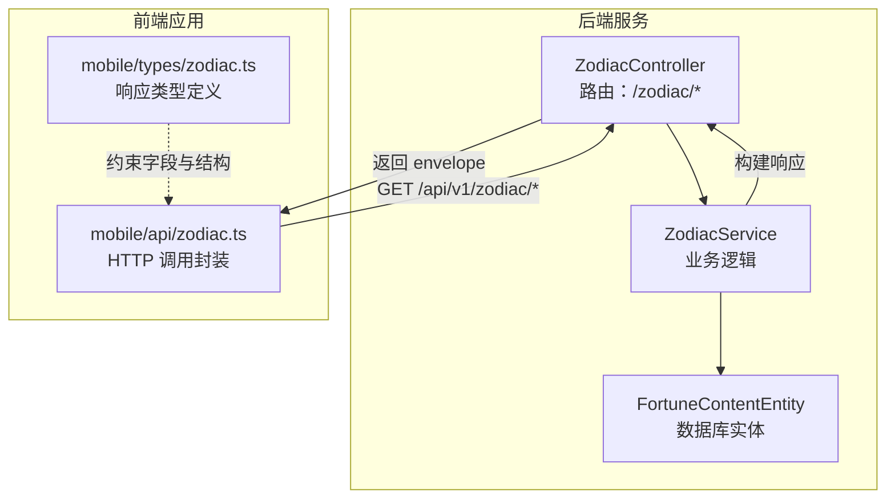
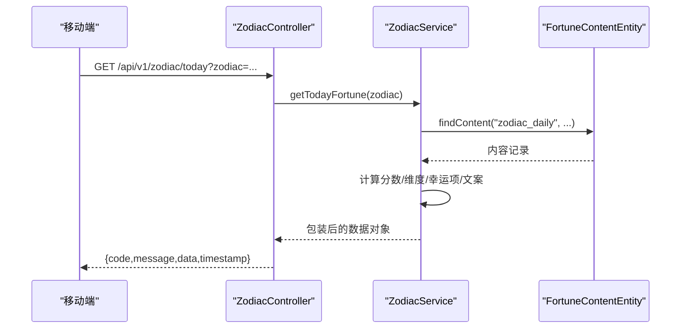
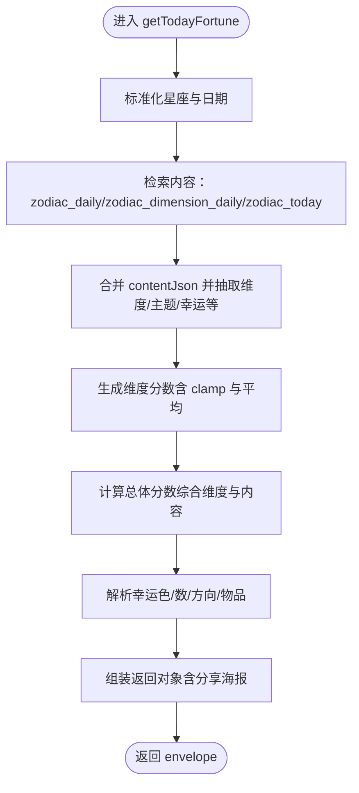
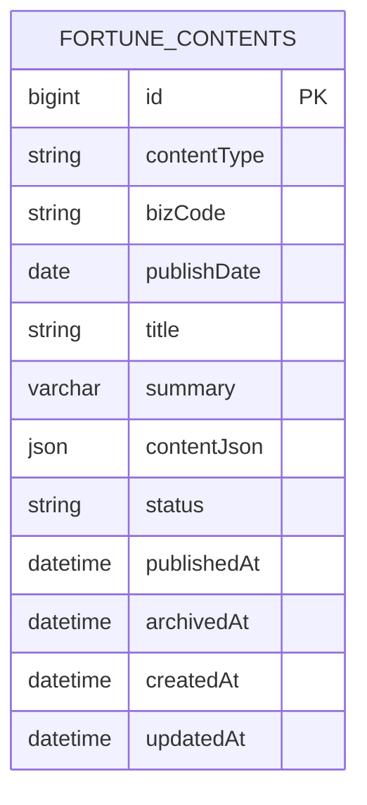
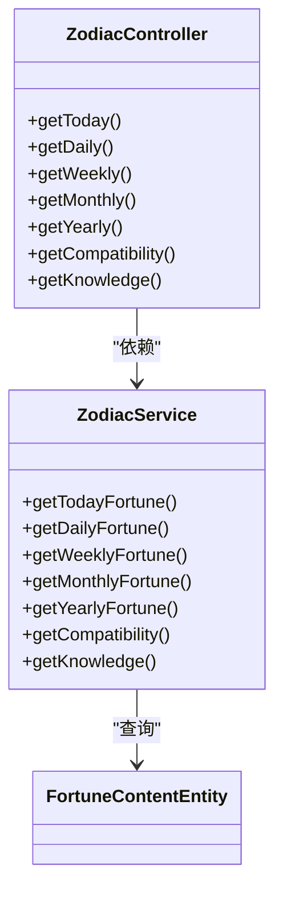

# 星座运势接口

<cite>
**本文引用的文件**
- [zodiac.controller.ts](file://services/api/src/zodiac/zodiac.controller.ts)
- [zodiac.service.ts](file://services/api/src/zodiac/zodiac.service.ts)
- [zodiac.constants.ts](file://services/api/src/zodiac/zodiac.constants.ts)
- [zodiac-query.dto.ts](file://services/api/src/zodiac/dto/zodiac-query.dto.ts)
- [zodiac-daily-query.dto.ts](file://services/api/src/zodiac/dto/zodiac-daily-query.dto.ts)
- [zodiac-monthly-query.dto.ts](file://services/api/src/zodiac/dto/zodiac-monthly-query.dto.ts)
- [zodiac-yearly-query.dto.ts](file://services/api/src/zodiac/dto/zodiac-yearly-query.dto.ts)
- [zodiac-compatibility-query.dto.ts](file://services/api/src/zodiac/dto/zodiac-compatibility-query.dto.ts)
- [fortune-content.entity.ts](file://services/api/src/database/entities/fortune-content.entity.ts)
- [zodiac.ts（移动端）](file://apps/mobile/src/api/zodiac.ts)
- [zodiac.ts（类型定义）](file://apps/mobile/src/types/zodiac.ts)
- [app.module.ts](file://services/api/src/app.module.ts)
- [main.ts](file://services/api/src/main.ts)
</cite>

## 目录
1. [简介](#简介)
2. [项目结构](#项目结构)
3. [核心组件](#核心组件)
4. [架构总览](#架构总览)
5. [详细组件分析](#详细组件分析)
6. [依赖分析](#依赖分析)
7. [性能考量](#性能考量)
8. [故障排查指南](#故障排查指南)
9. [结论](#结论)
10. [附录](#附录)

## 简介
本文件面向“星座运势接口”的完整使用与实现说明，覆盖今日运势、本周运势、本月运势、年度运势、关系匹配与知识速写等查询接口。文档从接口定义、参数与返回结构、时间范围与数据来源、计算算法与等级划分、前后端对接约定、数据更新与缓存策略、并发与错误处理等方面进行系统化阐述，并提供可视化图示与实践建议。

## 项目结构
- 后端采用 NestJS 模块化组织，星座模块位于 services/api/src/zodiac，包含控制器、服务、DTO、常量与数据库实体。
- 移动端位于 apps/mobile，提供前端调用封装与类型定义，确保前后端数据契约一致。
- 应用入口与全局中间件在 main.ts 与 app.module.ts 中统一配置。

图表来源
- [zodiac.controller.ts:1-47](file://services/api/src/zodiac/zodiac.controller.ts#L1-L47)
- [zodiac.service.ts:1-120](file://services/api/src/zodiac/zodiac.service.ts#L1-L120)
- [fortune-content.entity.ts:1-49](file://services/api/src/database/entities/fortune-content.entity.ts#L1-L49)
- [zodiac.ts（移动端）:1-50](file://apps/mobile/src/api/zodiac.ts#L1-L50)
- [zodiac.ts（类型定义）:1-221](file://apps/mobile/src/types/zodiac.ts#L1-L221)

章节来源
- [zodiac.controller.ts:1-47](file://services/api/src/zodiac/zodiac.controller.ts#L1-L47)
- [zodiac.service.ts:1-120](file://services/api/src/zodiac/zodiac.service.ts#L1-L120)
- [app.module.ts:55-138](file://services/api/src/app.module.ts#L55-L138)
- [main.ts:32-59](file://services/api/src/main.ts#L32-L59)

## 核心组件
- 控制器：暴露 /zodiac/{today|daily|weekly|monthly|yearly|compatibility|knowledge} 等路由，接收查询参数并委派给服务层。
- 服务层：负责数据聚合、内容检索、评分与等级计算、文案拼装与返回包装。
- DTO：对查询参数进行校验与类型约束（如星座枚举、月份格式、年份范围等）。
- 常量与模型：定义 12 星座的属性、元素/模式、关键词、最佳配对、节气与主题模板等。
- 数据实体：fortune_contents 表承载每日/每周/每月/年度/关系等运势内容，支持按业务码与发布日期检索。
- 前端封装：mobile 端提供统一的 GET 方法，自动拼接查询参数；类型定义保证响应结构一致性。

章节来源
- [zodiac.controller.ts:8-46](file://services/api/src/zodiac/zodiac.controller.ts#L8-L46)
- [zodiac.service.ts:50-120](file://services/api/src/zodiac/zodiac.service.ts#L50-L120)
- [zodiac.constants.ts:1-513](file://services/api/src/zodiac/zodiac.constants.ts#L1-L513)
- [fortune-content.entity.ts:10-49](file://services/api/src/database/entities/fortune-content.entity.ts#L10-L49)
- [zodiac.ts（移动端）:21-49](file://apps/mobile/src/api/zodiac.ts#L21-L49)
- [zodiac.ts（类型定义）:28-221](file://apps/mobile/src/types/zodiac.ts#L28-L221)

## 架构总览
- 入口与中间件：全局前缀 /api/v1，启用统一拦截器与异常过滤器，开启 CORS。
- 模块装配：AppModule 引入 ZodiacModule，注入 TypeORM 的 FortuneContentEntity。
- 控制器到服务：控制器仅做参数透传与路由分发，服务层完成数据聚合与算法计算。
- 数据来源：fortune_contents 表，按 contentType 与 bizCode 查询，支持按 publishDate 或未发布记录回退。

图表来源
- [zodiac.controller.ts:12-15](file://services/api/src/zodiac/zodiac.controller.ts#L12-L15)
- [zodiac.service.ts:57-141](file://services/api/src/zodiac/zodiac.service.ts#L57-L141)
- [fortune-content.entity.ts:10-49](file://services/api/src/database/entities/fortune-content.entity.ts#L10-L49)

章节来源
- [main.ts:32-59](file://services/api/src/main.ts#L32-L59)
- [app.module.ts:55-138](file://services/api/src/app.module.ts#L55-L138)
- [zodiac.controller.ts:8-46](file://services/api/src/zodiac/zodiac.controller.ts#L8-L46)
- [zodiac.service.ts:424-467](file://services/api/src/zodiac/zodiac.service.ts#L424-L467)

## 详细组件分析

### 接口一览与参数说明
- 今日运势（/zodiac/today）
  - 参数：zodiac（可选，默认“狮子座”）
  - 返回：总体分数、维度分数、主题、关键词、幸运色/数/方向/物品、行动清单、兼容建议、分享海报信息等
- 今日简报（/zodiac/daily）
  - 参数：zodiac（可选）
  - 返回：当日摘要、关系/事业/财富/健康四维简述、幸运要素、兼容建议、知识提示、建议语
- 本周运势（/zodiac/weekly）
  - 参数：zodiac（可选）
  - 返回：周范围、主题、概览、周节奏、关注点（关系/事业/财富/健康）、幸运窗口、最佳配对、行动与警示
- 本月运势（/zodiac/monthly）
  - 参数：zodiac（可选）、month（YYYY-MM，可选，默认当月）
  - 返回：月份、主题、节奏、关注点、机会/警示、关键日期、行动建议
- 年度运势（/zodiac/yearly）
  - 参数：zodiac（可选）、year（可选，>=2024，默认当年）
  - 返回：年份、主题、季度预测、关注焦点（关系/事业/财富/健康）、关键月份、锚定建议
- 关系匹配（/zodiac/compatibility）
  - 参数：zodiac（必填）、partner（可选，默认该座的默认配对）
  - 返回：分数、等级、摘要、化学反应（情感/沟通/成长）、要点、警示、建议
- 星座知识（/zodiac/knowledge）
  - 参数：zodiac（可选）
  - 返回：标题、概述、速记事实（元素/模式/季节）、优势、关系风格、工作风格、成长建议、关键词

章节来源
- [zodiac.controller.ts:12-45](file://services/api/src/zodiac/zodiac.controller.ts#L12-L45)
- [zodiac-daily-query.dto.ts:18-23](file://services/api/src/zodiac/dto/zodiac-daily-query.dto.ts#L18-L23)
- [zodiac-monthly-query.dto.ts:3-13](file://services/api/src/zodiac/dto/zodiac-monthly-query.dto.ts#L3-L13)
- [zodiac-yearly-query.dto.ts:4-10](file://services/api/src/zodiac/dto/zodiac-yearly-query.dto.ts#L4-L10)
- [zodiac-compatibility-query.dto.ts:5-10](file://services/api/src/zodiac/dto/zodiac-compatibility-query.dto.ts#L5-L10)

### 时间范围与日期规范
- 今日：以系统本地日期字符串（YYYY-MM-DD）作为基准。
- 本周：根据当前日期推导当周周一与周日，格式为 MM.DD - MM.DD。
- 月度：normalizeMonth 支持 YYYY-MM 输入，否则默认当月；findMonthlyContent 使用 Between 查询当月区间。
- 年度：year 参数最小为 2024，否则取当前年份。

章节来源
- [zodiac.service.ts:496-536](file://services/api/src/zodiac/zodiac.service.ts#L496-L536)

### 数据模型与字段说明
- 响应 envelope
  - code：整型，0 表示成功
  - message：字符串，描述
  - data：各接口具体数据对象
  - timestamp：ISO 字符串
- 今日运势（ZodiacTodayData）
  - zodiac/date/profile/score/theme/dimensions/dayparts/lucky/action/compatibility/sharePoster
- 今日简报（ZodiacDailyData）
  - zodiac/date/profile/summary/metrics/lucky/compatibility/knowledge/suggestion
- 本周运势（ZodiacWeeklyData）
  - zodiac/weekRange/profile/theme/overview/rhythm/focus/luckyWindow/bestMatch/action/caution
- 本月运势（ZodiacMonthlyData）
  - zodiac/month/profile/theme/rhythm/focus/opportunities/cautions/keyDays/action
- 年度运势（ZodiacYearlyData）
  - zodiac/year/profile/theme/quarterForecasts/focus/keyMonths/anchorAdvice
- 关系匹配（ZodiacCompatibilityData）
  - zodiac/partner/score/level/summary/chemistry/highlights/caution/tips
- 星座知识（ZodiacKnowledgeData）
  - zodiac/title/overview/quickFacts/strengths/relationshipStyle/workStyle/growthTip/keywords

章节来源
- [zodiac.service.ts:394-410](file://services/api/src/zodiac/zodiac.service.ts#L394-L410)
- [zodiac.ts（类型定义）:58-221](file://apps/mobile/src/types/zodiac.ts#L58-L221)

### 星座数据模型与属性
- 12 星座枚举与类型：ZODIAC_SIGNS、ZodiacSign
- 属性特征：
  - 元素（ZodiacElement）：fire/earth/air/water
  - 模式（ZodiacModality）：cardinal/fixed/mutable
  - 季节、音调、最佳配对、关键词、优势、关系/工作风格、成长建议、年度主题/建议等
- 幸运样式（ZODIAC_LUCKY_STYLES）：每日摘要、幸运色/数/方向、默认配对、知识提示
- 周节奏（ZODIAC_WEEKLY_RHYTHM）、年度关注（ZODIAC_YEARLY_FOCUS）、季度模板（ZODIAC_QUARTER_TEMPLATES）、关键月份（ZODIAC_KEY_MONTHS）

章节来源
- [zodiac.constants.ts:1-513](file://services/api/src/zodiac/zodiac.constants.ts#L1-L513)

### 运势计算算法与等级划分
- 今日维度分数生成
  - 基于“种子值”与固定偏移，经 clampScore 限制在 [52, 96]，平均后与内容覆盖值合并
- 总体分数
  - 综合内容分数与维度平均值，clampScore 限制范围
- 幸运项与主题
  - 幸运色/数/方向/物品由元素映射；主题标题/摘要、关键词、分享主题名由内容与默认模板拼装
- 关系匹配分数
  - 初始 68，依据元素相同/互补、模式相同、互为最佳配对、自身相等等因素加减，最终限制在 [58, 96]，按阈值划分为“需要经营/可持续磨合/顺畅互补/高默契”
- 月度节奏与关键日
  - 上/中/下旬节奏模板；关键日固定为每月 6/15/24
- 年度季度预测
  - 基于模式模板填充季度标题与摘要

图表来源
- [zodiac.service.ts:57-141](file://services/api/src/zodiac/zodiac.service.ts#L57-L141)
- [zodiac.service.ts:604-620](file://services/api/src/zodiac/zodiac.service.ts#L604-L620)
- [zodiac.service.ts:732-738](file://services/api/src/zodiac/zodiac.service.ts#L732-L738)

章节来源
- [zodiac.service.ts:57-141](file://services/api/src/zodiac/zodiac.service.ts#L57-L141)
- [zodiac.service.ts:762-794](file://services/api/src/zodiac/zodiac.service.ts#L762-L794)

### 不同维度查询示例
- 按日期查询（今日/每日）
  - GET /api/v1/zodiac/today?zodiac=天蝎座
  - GET /api/v1/zodiac/daily?zodiac=天蝎座
- 按星座查询（关系匹配/知识）
  - GET /api/v1/zodiac/compatibility?zodiac=天蝎座&partner=巨蟹座
  - GET /api/v1/zodiac/knowledge?zodiac=天蝎座
- 按时间周期查询（周/月/年）
  - GET /api/v1/zodiac/weekly?zodiac=天蝎座
  - GET /api/v1/zodiac/monthly?zodiac=天蝎座&month=2025-01
  - GET /api/v1/zodiac/yearly?zodiac=天蝎座&year=2025

章节来源
- [zodiac.ts（移动端）:21-49](file://apps/mobile/src/api/zodiac.ts#L21-L49)

### 数据更新机制与内容检索
- 内容表结构：fortune_contents，支持 contentType、bizCode、publishDate、status 等字段
- 检索策略：
  - 按 contentType 与 bizCode 列表查询，优先命中当天 publishDate 的记录，否则回退到 publishDate 为空的记录
  - 对月度内容，按 YYYY-MM 当月区间检索
  - 结果按发布时间与 ID 排序，取第一条
- 更新流程（建议）
  - 后台编辑：新增/修改 fortune_contents 记录，设置 contentType、bizCode、contentJson、publishDate/status
  - 发布策略：提前一天设置 publishDate，或在当日零点后通过定时任务统一发布

图表来源
- [fortune-content.entity.ts:10-49](file://services/api/src/database/entities/fortune-content.entity.ts#L10-L49)

章节来源
- [zodiac.service.ts:424-494](file://services/api/src/zodiac/zodiac.service.ts#L424-L494)

### 缓存策略与并发处理
- 缓存建议
  - 读多写少的今日/周/月/年数据可引入 Redis 缓存，键规则：zod:<sign>:<type>:<date_or_month_or_year>
  - TTL：今日/周可短于月/年；热点星座可适当延长
- 并发与幂等
  - 控制器与服务无状态，遵循幂等 GET；若引入缓存需注意写后失效与热点清洗
  - 数据库查询已按时间与 ID 排序，避免竞态下的脏读

章节来源
- [zodiac.service.ts:424-494](file://services/api/src/zodiac/zodiac.service.ts#L424-L494)

### 错误处理与异常情况
- 参数校验：DTO 使用 class-validator 约束，非法参数返回 400
- CORS：生产环境严格校验 origin，拒绝外域访问
- 全局异常：HttpExceptionFilter 统一封装错误响应
- 未命中内容：findContent/findMonthlyContent 回退到 publishDate 为空的记录，避免 404

章节来源
- [main.ts:32-59](file://services/api/src/main.ts#L32-L59)
- [zodiac-daily-query.dto.ts:18-23](file://services/api/src/zodiac/dto/zodiac-daily-query.dto.ts#L18-L23)
- [zodiac-monthly-query.dto.ts:3-13](file://services/api/src/zodiac/dto/zodiac-monthly-query.dto.ts#L3-L13)
- [zodiac-yearly-query.dto.ts:4-10](file://services/api/src/zodiac/dto/zodiac-yearly-query.dto.ts#L4-L10)
- [zodiac-compatibility-query.dto.ts:5-10](file://services/api/src/zodiac/dto/zodiac-compatibility-query.dto.ts#L5-L10)

## 依赖分析
- 控制器依赖服务：ZodiacController 仅注入 ZodiacService
- 服务依赖数据层：ZodiacService 注入 FortuneContentRepository
- 类型与常量：服务使用 zodiac.constants.ts 提供的枚举与模板
- 前端依赖：mobile 端通过统一 API 文件与类型定义对接

图表来源
- [zodiac.controller.ts:8-46](file://services/api/src/zodiac/zodiac.controller.ts#L8-L46)
- [zodiac.service.ts:50-120](file://services/api/src/zodiac/zodiac.service.ts#L50-L120)
- [fortune-content.entity.ts:10-49](file://services/api/src/database/entities/fortune-content.entity.ts#L10-L49)

章节来源
- [zodiac.controller.ts:8-46](file://services/api/src/zodiac/zodiac.controller.ts#L8-L46)
- [zodiac.service.ts:50-120](file://services/api/src/zodiac/zodiac.service.ts#L50-L120)
- [zodiac.ts（移动端）:21-49](file://apps/mobile/src/api/zodiac.ts#L21-L49)

## 性能考量
- 数据库索引：fortune_contents 已建复合索引 (contentType,status,publishDate)，有利于按类型与发布日期检索
- 查询优化：findContent/findMonthlyContent 限制返回条目数量，排序稳定，减少扫描
- 前端缓存：建议对今日/周/月/年接口做本地缓存，降低重复请求
- 限流与熔断：在网关或反向代理层对 /zodiac/* 接口实施限流，防止突发流量冲击

章节来源
- [fortune-content.entity.ts:10-11](file://services/api/src/database/entities/fortune-content.entity.ts#L10-L11)
- [zodiac.service.ts:424-494](file://services/api/src/zodiac/zodiac.service.ts#L424-L494)

## 故障排查指南
- 400 参数错误
  - 检查 zodiac 是否为合法枚举值；month 是否符合 YYYY-MM；year 是否 >=2024
- 404 未找到内容
  - 确认 fortune_contents 中是否存在对应 contentType/bizCode/status/publishDate 的记录
- CORS 拒绝
  - 校验请求头 Origin 是否在允许列表；生产环境禁止任意源
- 响应结构不符
  - 对照 mobile/types/zodiac.ts 的类型定义，确认字段名称与类型

章节来源
- [zodiac-daily-query.dto.ts:18-23](file://services/api/src/zodiac/dto/zodiac-daily-query.dto.ts#L18-L23)
- [zodiac-monthly-query.dto.ts:3-13](file://services/api/src/zodiac/dto/zodiac-monthly-query.dto.ts#L3-L13)
- [zodiac-yearly-query.dto.ts:4-10](file://services/api/src/zodiac/dto/zodiac-yearly-query.dto.ts#L4-L10)
- [main.ts:44-59](file://services/api/src/main.ts#L44-L59)
- [zodiac.ts（类型定义）:28-221](file://apps/mobile/src/types/zodiac.ts#L28-L221)

## 结论
本接口体系以清晰的路由与 DTO 校验为基础，结合常量模板与服务层算法，实现了从内容检索到结果拼装的全链路闭环。通过合理的数据模型与时间范围定义，满足了用户对今日/周/月/年运势及关系匹配的多样化查询需求。建议在生产环境中配合缓存与限流策略，进一步提升稳定性与性能。

## 附录

### 接口对照表
- GET /api/v1/zodiac/today → 今日运势
- GET /api/v1/zodiac/daily → 今日简报
- GET /api/v1/zodiac/weekly → 本周运势
- GET /api/v1/zodiac/monthly → 本月运势
- GET /api/v1/zodiac/yearly → 年度运势
- GET /api/v1/zodiac/compatibility → 关系匹配
- GET /api/v1/zodiac/knowledge → 星座知识

章节来源
- [zodiac.controller.ts:12-45](file://services/api/src/zodiac/zodiac.controller.ts#L12-L45)
- [zodiac.ts（移动端）:21-49](file://apps/mobile/src/api/zodiac.ts#L21-L49)