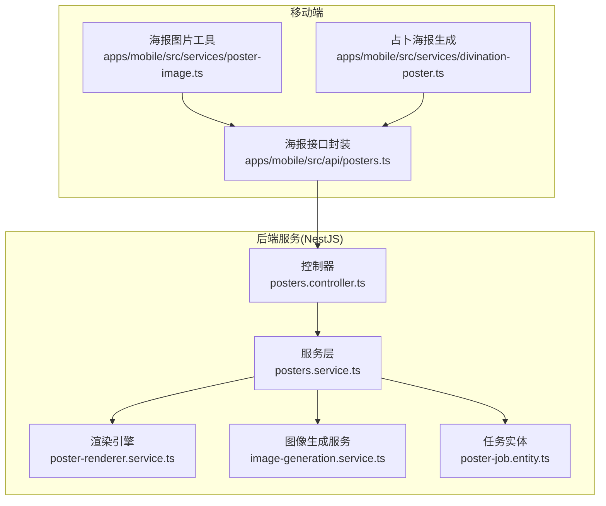
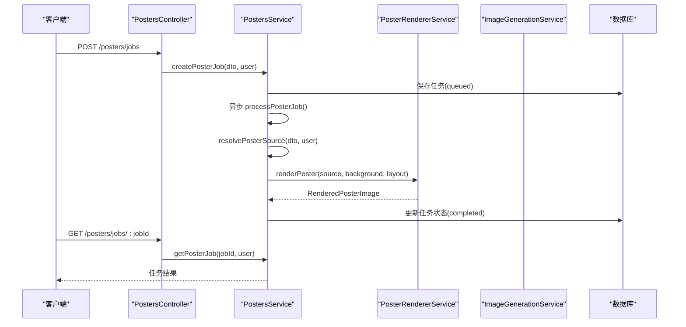
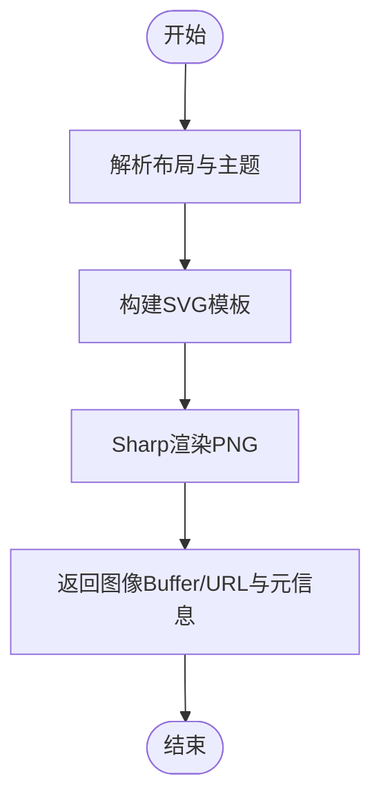
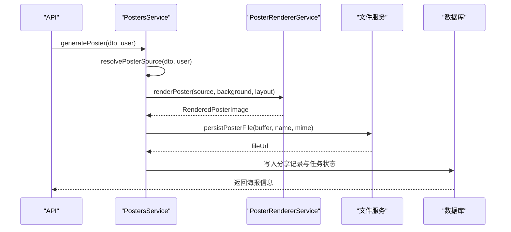
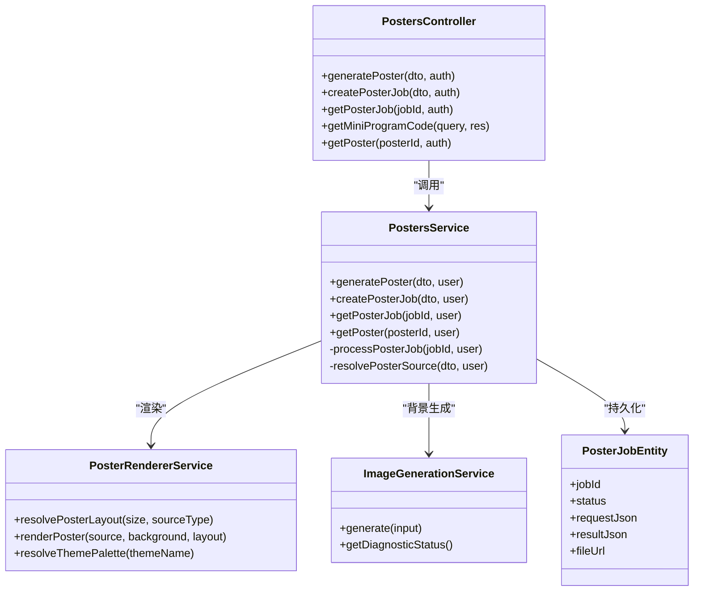

# 海报生成接口

<cite>
**本文档引用的文件**
- [posters.controller.ts](file://services/api/src/posters/posters.controller.ts)
- [posters.service.ts](file://services/api/src/posters/posters.service.ts)
- [generate-poster.dto.ts](file://services/api/src/posters/dto/generate-poster.dto.ts)
- [poster-renderer.service.ts](file://services/api/src/common/poster-renderer.service.ts)
- [image-generation.service.ts](file://services/api/src/common/image-generation.service.ts)
- [poster-image.ts](file://apps/mobile/src/services/poster-image.ts)
- [posters.ts](file://apps/mobile/src/api/posters.ts)
- [poster.ts](file://apps/mobile/src/types/poster.ts)
- [poster-job.entity.ts](file://services/api/src/database/entities/poster-job.entity.ts)
- [divination-poster.ts](file://apps/mobile/src/services/divination-poster.ts)
- [layout.ts](file://apps/mobile/src/poster/divinationPoster/layout.ts)
- [types.ts](file://apps/mobile/src/poster/divinationPoster/types.ts)
</cite>

## 目录
1. [简介](#简介)
2. [项目结构](#项目结构)
3. [核心组件](#核心组件)
4. [架构总览](#架构总览)
5. [详细组件分析](#详细组件分析)
6. [依赖关系分析](#依赖关系分析)
7. [性能考量](#性能考量)
8. [故障排查指南](#故障排查指南)
9. [结论](#结论)
10. [附录](#附录)

## 简介
本文件面向“海报生成接口”的使用者与维护者，系统化阐述以下内容：
- 支持的海报类型：结果类（八字、情绪）、分享类（今日指数、星座今日、幸运签）以及占卜分享海报。
- 模板系统与渲染引擎：模板设计规范、布局结构、元素配置、样式定制与文本适配。
- 图像渲染引擎工作原理：SVG 构建、文本处理、图形绘制、特效应用、尺寸适配与最终 PNG 输出。
- 生成流程：参数校验、内容填充、样式应用、图片输出与持久化。
- 接口示例：静态海报、动态海报（通过任务队列）、分享海报等。
- 性能优化策略：缓存、异步与并发控制、资源管理。
- 文件存储方案：本地/云存储、CDN 分发与清理策略。
- 质量控制机制：分辨率适配、色彩管理、字体渲染与兼容性测试。

## 项目结构
后端服务采用 NestJS，前端小程序使用 uni-app 生态，海报生成涉及三层协作：
- 控制层：接收请求、鉴权、转发至服务层。
- 服务层：解析来源数据、构建渲染源、调用渲染引擎、持久化与任务管理。
- 渲染引擎：基于 SVG 的模板系统，结合 Sharp 进行 PNG 输出，并支持外部背景图与小程序码叠加。

图表来源
- [posters.controller.ts:1-68](file://services/api/src/posters/posters.controller.ts#L1-L68)
- [posters.service.ts:1-200](file://services/api/src/posters/posters.service.ts#L1-L200)
- [poster-renderer.service.ts:1-120](file://services/api/src/common/poster-renderer.service.ts#L1-L120)
- [image-generation.service.ts:1-131](file://services/api/src/common/image-generation.service.ts#L1-L131)
- [poster-job.entity.ts:1-54](file://services/api/src/database/entities/poster-job.entity.ts#L1-L54)

章节来源
- [posters.controller.ts:1-68](file://services/api/src/posters/posters.controller.ts#L1-L68)
- [posters.service.ts:1-120](file://services/api/src/posters/posters.service.ts#L1-L120)
- [poster-renderer.service.ts:1-120](file://services/api/src/common/poster-renderer.service.ts#L1-L120)

## 核心组件
- 控制器：提供海报生成、任务创建与查询、小程序码获取等接口。
- 服务层：解析来源数据、构建渲染源、调用渲染引擎、持久化与任务管理。
- 渲染引擎：统一的海报布局解析、主题配色、SVG 模板构建、Sharp 输出。
- 图像生成服务：对接大模型背景生成能力，支持尺寸与超时配置。
- 任务系统：数据库实体记录任务状态、请求与结果，支持轮询与异步完成通知。
- 移动端工具：下载、预览、保存、分享海报图片，处理微信环境差异。

章节来源
- [posters.controller.ts:1-68](file://services/api/src/posters/posters.controller.ts#L1-L68)
- [posters.service.ts:1-200](file://services/api/src/posters/posters.service.ts#L1-L200)
- [poster-renderer.service.ts:174-321](file://services/api/src/common/poster-renderer.service.ts#L174-L321)
- [image-generation.service.ts:42-131](file://services/api/src/common/image-generation.service.ts#L42-L131)
- [poster-job.entity.ts:14-53](file://services/api/src/database/entities/poster-job.entity.ts#L14-L53)
- [poster-image.ts:1-120](file://apps/mobile/src/services/poster-image.ts#L1-L120)
- [posters.ts:1-87](file://apps/mobile/src/api/posters.ts#L1-L87)

## 架构总览
后端通过控制器暴露 REST 接口，服务层负责业务编排，渲染引擎以 SVG 为基础进行模板合成，最终由 Sharp 转换为 PNG 输出。图像生成服务可选地提供外部背景图，任务系统支持异步生成与查询。

图表来源
- [posters.controller.ts:23-40](file://services/api/src/posters/posters.controller.ts#L23-L40)
- [posters.service.ts:217-295](file://services/api/src/posters/posters.service.ts#L217-L295)
- [poster-renderer.service.ts:256-300](file://services/api/src/common/poster-renderer.service.ts#L256-L300)
- [image-generation.service.ts:53-55](file://services/api/src/common/image-generation.service.ts#L53-L55)

## 详细组件分析

### 接口定义与参数校验
- 生成接口：支持 recordId、sourceType、bizCode、size 参数，sourceType 限定为 lucky_sign、today_index、zodiac_today 之一，size 支持多种标准尺寸。
- 任务接口：提交生成任务并轮询结果，支持等待完成或失败处理。
- 小程序码接口：按来源类型与记录生成二维码数据，返回二进制与 MIME 类型。

章节来源
- [generate-poster.dto.ts:1-24](file://services/api/src/posters/dto/generate-poster.dto.ts#L1-L24)
- [posters.controller.ts:14-57](file://services/api/src/posters/posters.controller.ts#L14-L57)
- [posters.ts:1-87](file://apps/mobile/src/api/posters.ts#L1-L87)

### 模板系统与布局结构
- 布局解析：根据海报类型与请求尺寸自动选择 square 或 portrait 布局，并给出宽高与尺寸标识。
- 主题配色：按主题名映射主色板，用于渐变与覆盖层。
- 模板构建：
  - 分享海报：正方形背景，抽象渐变覆盖，标题、副标题、强调语、页脚等文本区域。
  - 富文本海报：竖版布局，包含指标块、标签块、高亮提示、摘要等。
  - 星座档案：基于 PNG 模板叠加 SVG 文字与小程序码。
  - 占卜分享：小程序端独立 Canvas 方案，模板与二维码叠加绘制。
- 文本适配：按字符显示单位估算宽度，自动换行与断点选择，保证在限定宽度内展示最佳效果。

章节来源
- [poster-renderer.service.ts:178-230](file://services/api/src/common/poster-renderer.service.ts#L178-L230)
- [poster-renderer.service.ts:663-689](file://services/api/src/common/poster-renderer.service.ts#L663-L689)
- [poster-renderer.service.ts:691-747](file://services/api/src/common/poster-renderer.service.ts#L691-L747)
- [poster-renderer.service.ts:749-800](file://services/api/src/common/poster-renderer.service.ts#L749-L800)
- [poster-renderer.service.ts:323-351](file://services/api/src/common/poster-renderer.service.ts#L323-L351)
- [divination-poster.ts:166-219](file://apps/mobile/src/services/divination-poster.ts#L166-L219)
- [layout.ts:1-66](file://apps/mobile/src/poster/divinationPoster/layout.ts#L1-L66)

### 图像渲染引擎工作原理
- 输入：渲染源（标题、副标题、强调语、摘要、指标、主题名、小程序码等）与布局。
- 中间：SVG 字符串构建，包含背景图或抽象背景、文本层、指标与标签块、小程序码遮罩等。
- 输出：Sharp 将 SVG 渲染为 PNG，返回 Buffer、Data URL、MIME 类型与扩展名。
- 特效：滤镜、阴影、渐变、描边、圆角等，确保视觉层次与品牌一致性。

图表来源
- [poster-renderer.service.ts:256-300](file://services/api/src/common/poster-renderer.service.ts#L256-L300)
- [poster-renderer.service.ts:3002-3010](file://services/api/src/common/poster-renderer.service.ts#L3002-L3010)

章节来源
- [poster-renderer.service.ts:256-321](file://services/api/src/common/poster-renderer.service.ts#L256-L321)
- [poster-renderer.service.ts:3002-3020](file://services/api/src/common/poster-renderer.service.ts#L3002-L3020)

### 海报生成流程
- 参数验证：校验 DTO 字段与枚举值。
- 来源解析：根据 recordId 或 sourceType 解析具体数据，构建渲染源对象（标题、副标题、强调语、摘要、指标、主题名、小程序码等）。
- 布局选择：依据类型与请求尺寸确定布局与宽高。
- 渲染执行：调用渲染引擎生成图像。
- 存储与持久化：将图像写入文件服务，返回可公开访问 URL。
- 任务管理：异步任务记录请求、结果、状态与时间戳，支持轮询查询。

图表来源
- [posters.service.ts:88-175](file://services/api/src/posters/posters.service.ts#L88-L175)
- [poster-renderer.service.ts:256-300](file://services/api/src/common/poster-renderer.service.ts#L256-L300)

章节来源
- [posters.service.ts:88-175](file://services/api/src/posters/posters.service.ts#L88-L175)
- [posters.service.ts:297-477](file://services/api/src/posters/posters.service.ts#L297-L477)

### 不同类型海报接口示例
- 结果类海报（八字、情绪）
  - 通过 recordId 获取用户评测或八字记录，自动填充标题、副标题、强调语、摘要、指标与关键词。
  - 情绪海报：包含评分、风险等级、关键词、维度与建议。
  - 八字海报：包含日主、五行趋势、喜用神、运势项等。
- 分享类海报（今日指数、星座今日、幸运签）
  - 今日指数：根据用户当日运势与元素，生成抽象风格背景与指标卡。
  - 星座今日：从服务端获取档案数据，构建主题词、气质、能量倾向、守护元素、魅力与社交分数、幸运色等。
  - 幸运签：从内容库获取签文，回填标题、副标题、强调语、页脚与主题名。
- 占卜分享海报（小程序端）
  - 使用 Canvas 与模板图片叠加绘制，支持二维码与模板回退路径。

章节来源
- [posters.service.ts:297-477](file://services/api/src/posters/posters.service.ts#L297-L477)
- [posters.service.ts:479-648](file://services/api/src/posters/posters.service.ts#L479-L648)
- [divination-poster.ts:166-219](file://apps/mobile/src/services/divination-poster.ts#L166-L219)

### 文件存储方案
- 后端存储：将渲染后的图像以指定扩展名与 MIME 类型写入文件服务，返回可公开访问 URL。
- 前端存储：浏览器端直接下载，小程序端保存到相册或预览，微信环境支持直接分享图片。
- CDN 分发：文件服务返回的 URL 可接入 CDN，提升分发效率。
- 清理策略：建议按海报生命周期与访问频率制定定期清理策略（如过期删除、低频访问降级存储）。

章节来源
- [posters.service.ts:116-120](file://services/api/src/posters/posters.service.ts#L116-L120)
- [poster-image.ts:318-359](file://apps/mobile/src/services/poster-image.ts#L318-L359)

### 质量控制机制
- 分辨率适配：根据布局尺寸与 DPI 要求生成目标宽高，确保在不同设备清晰显示。
- 色彩管理：主题配色映射统一主色板，保持品牌一致性。
- 字体渲染：多语言字体族配置，中文与西文混合排版，文本断点与单位估算保障可读性。
- 兼容性测试：对不同尺寸与内容长度进行渲染测试，确保边界条件稳定输出。

章节来源
- [poster-renderer.service.ts:663-689](file://services/api/src/common/poster-renderer.service.ts#L663-L689)
- [poster-renderer.service.ts:2886-2900](file://services/api/src/common/poster-renderer.service.ts#L2886-L2900)
- [poster-renderer.service.ts:2912-2970](file://services/api/src/common/poster-renderer.service.ts#L2912-L2970)

## 依赖关系分析
- 控制器依赖服务层与认证服务，负责鉴权与参数透传。
- 服务层依赖渲染引擎、图像生成服务、数据库实体与第三方服务（运势、评测、占卜）。
- 渲染引擎依赖 Sharp 进行 PNG 输出，内置 SVG 文本测量与断点算法。
- 任务系统通过数据库实体记录任务状态与结果，供前端轮询查询。

图表来源
- [posters.controller.ts:1-68](file://services/api/src/posters/posters.controller.ts#L1-L68)
- [posters.service.ts:63-86](file://services/api/src/posters/posters.service.ts#L63-L86)
- [poster-renderer.service.ts:174-175](file://services/api/src/common/poster-renderer.service.ts#L174-L175)
- [image-generation.service.ts:42-55](file://services/api/src/common/image-generation.service.ts#L42-L55)
- [poster-job.entity.ts:14-53](file://services/api/src/database/entities/poster-job.entity.ts#L14-L53)

章节来源
- [posters.controller.ts:1-68](file://services/api/src/posters/posters.controller.ts#L1-L68)
- [posters.service.ts:63-86](file://services/api/src/posters/posters.service.ts#L63-L86)
- [poster-renderer.service.ts:174-175](file://services/api/src/common/poster-renderer.service.ts#L174-L175)
- [image-generation.service.ts:42-55](file://services/api/src/common/image-generation.service.ts#L42-L55)
- [poster-job.entity.ts:14-53](file://services/api/src/database/entities/poster-job.entity.ts#L14-L53)

## 性能考量
- 缓存机制
  - 星座模板缓存：渲染引擎对星座模板进行内存缓存，减少重复读取。
  - 小程序码缓存：后端对小程序码 Data URL 进行短期缓存，降低重复生成开销。
- 异步处理
  - 任务队列：通过任务实体记录状态，前端轮询完成或失败，避免阻塞请求。
  - 异步生成：服务层在创建任务后立即返回，后台处理完成后更新状态。
- 并发控制
  - 限制同时生成数量与超时时间，防止资源耗尽。
  - 对外部图像生成服务设置合理超时与重试策略。
- 资源管理
  - 渲染输出使用压缩级别与合适的图像格式，平衡体积与质量。
  - 模板与字体资源集中管理，避免重复加载。

章节来源
- [poster-renderer.service.ts:176-177](file://services/api/src/common/poster-renderer.service.ts#L176-L177)
- [posters.service.ts:65-70](file://services/api/src/posters/posters.service.ts#L65-L70)
- [posters.service.ts:217-245](file://services/api/src/posters/posters.service.ts#L217-L245)
- [image-generation.service.ts:53-79](file://services/api/src/common/image-generation.service.ts#L53-L79)

## 故障排查指南
- 参数错误
  - 检查 DTO 字段是否符合约束（字符串长度、枚举值、尺寸枚举）。
- 权限问题
  - 需要登录的海报类型（今日指数、结果类）需携带有效授权头。
- 数据缺失
  - 用户资料不完整（生日、星座）会导致今日指数生成失败。
  - 记录不存在或无权访问会抛出“海报不存在”异常。
- 任务状态
  - 任务状态非 completed 时前端应提示“仍在处理中”，并继续轮询。
- 图片下载/保存
  - 小程序端需相册权限，若失败引导用户前往设置开启。
  - 浏览器端直接触发下载，注意跨域与缓存头设置。

章节来源
- [generate-poster.dto.ts:1-24](file://services/api/src/posters/dto/generate-poster.dto.ts#L1-L24)
- [posters.service.ts:297-477](file://services/api/src/posters/posters.service.ts#L297-L477)
- [posters.service.ts:177-200](file://services/api/src/posters/posters.service.ts#L177-L200)
- [posters.ts:17-37](file://apps/mobile/src/api/posters.ts#L17-L37)
- [poster-image.ts:368-389](file://apps/mobile/src/services/poster-image.ts#L368-L389)

## 结论
本海报生成接口以统一的模板系统与渲染引擎为核心，结合任务队列与文件服务，实现了从参数校验到图片输出的完整链路。通过主题配色、文本适配与外部背景生成，满足多样化海报风格需求；借助缓存、异步与并发控制，保障了性能与稳定性。配合移动端工具链，可实现从生成、预览到分享的一体化体验。

## 附录
- 常用尺寸
  - 正方形：1280x1280
  - 竖版：1080x1440、1088x1472、941x1672
- 主题名称示例
  - amber、sunset、sand、silver、ocean、mint 等
- 小程序码来源
  - 支持静态 URL 与后端动态生成两种来源，优先使用可用来源

章节来源
- [generate-poster.dto.ts:21-22](file://services/api/src/posters/dto/generate-poster.dto.ts#L21-L22)
- [poster-renderer.service.ts:663-689](file://services/api/src/common/poster-renderer.service.ts#L663-L689)
- [divination-poster.ts:358-387](file://apps/mobile/src/services/divination-poster.ts#L358-L387)