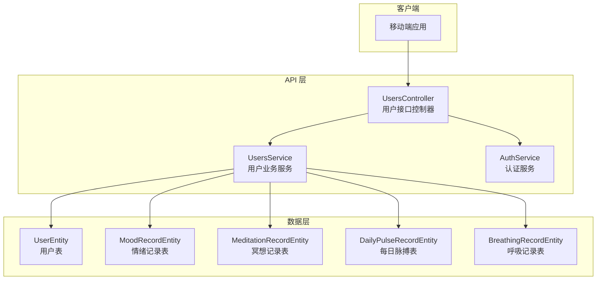
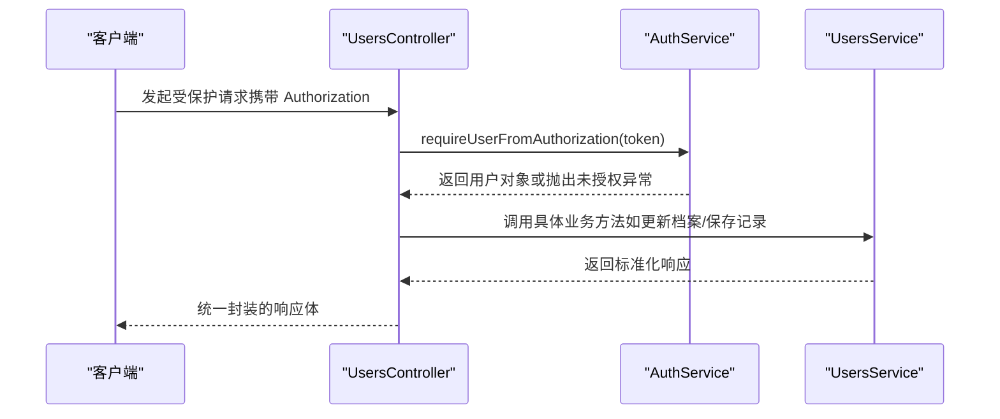
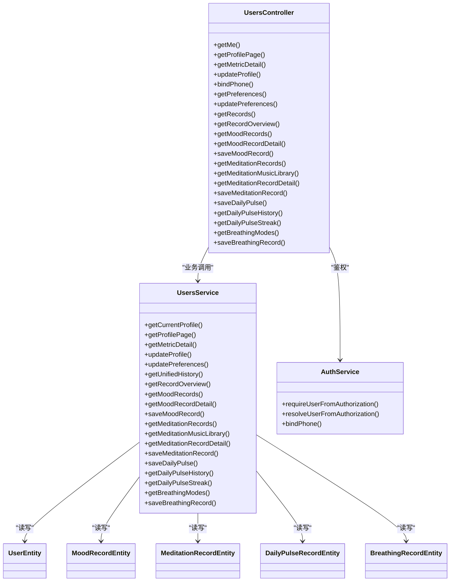
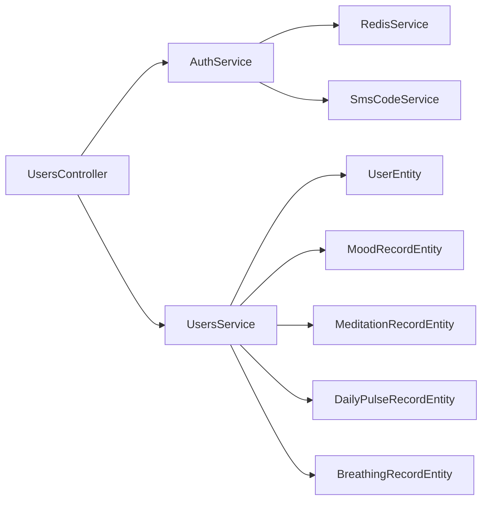

# 用户管理接口

<cite>
**本文引用的文件**
- [services/api/src/users/users.controller.ts](file://services/api/src/users/users.controller.ts)
- [services/api/src/users/users.service.ts](file://services/api/src/users/users.service.ts)
- [services/api/src/users/dto/update-profile.dto.ts](file://services/api/src/users/dto/update-profile.dto.ts)
- [services/api/src/users/dto/save-daily-pulse.dto.ts](file://services/api/src/users/dto/save-daily-pulse.dto.ts)
- [services/api/src/users/dto/save-mood-record.dto.ts](file://services/api/src/users/dto/save-mood-record.dto.ts)
- [services/api/src/users/dto/save-meditation-record.dto.ts](file://services/api/src/users/dto/save-meditation-record.dto.ts)
- [services/api/src/users/dto/update-preferences.dto.ts](file://services/api/src/users/dto/update-preferences.dto.ts)
- [services/api/src/database/entities/user.entity.ts](file://services/api/src/database/entities/user.entity.ts)
- [services/api/src/database/entities/mood-record.entity.ts](file://services/api/src/database/entities/mood-record.entity.ts)
- [services/api/src/database/entities/meditation-record.entity.ts](file://services/api/src/database/entities/meditation-record.entity.ts)
- [services/api/src/database/entities/daily-pulse-record.entity.ts](file://services/api/src/database/entities/daily-pulse-record.entity.ts)
- [services/api/src/database/entities/breathing-record.entity.ts](file://services/api/src/database/entities/breathing-record.entity.ts)
- [services/api/src/auth/auth.service.ts](file://services/api/src/auth/auth.service.ts)
- [services/api/src/users/profile-metrics.service.ts](file://services/api/src/users/profile-metrics.service.ts)
</cite>

## 目录
1. [简介](#简介)
2. [项目结构](#项目结构)
3. [核心组件](#核心组件)
4. [架构总览](#架构总览)
5. [详细组件分析](#详细组件分析)
6. [依赖关系分析](#依赖关系分析)
7. [性能考量](#性能考量)
8. [故障排查指南](#故障排查指南)
9. [结论](#结论)
10. [附录](#附录)

## 简介
本文件为“用户管理接口”的完整技术文档，覆盖以下能力范围：
- 用户基本信息管理：头像、昵称、性别、生日、出生时间、出生地、偏好合并等
- 健康数据记录：每日脉搏（情绪强度、分类、备注）、情绪记录（类型、分数、标签、内容）、冥想记录（类别、来源、时长、完成状态、前后状态、专注度等）
- 偏好设置：每日提醒、好运推送、免打扰模式、历史卡片保存、主题模式与手动主题键
- 个人档案与历史概览：统一历史、记录概览、情绪趋势、连续记录天数、冥想统计洞察
- 权限与安全：基于 Bearer Token 的会话校验、未登录可访问的公开接口、错误处理与数据一致性
- 数据隐私与同步：用户偏好 JSON 存储、生日/生辰影响五行与星座计算、数据聚合与快照

## 项目结构
用户相关接口集中在 NestJS 模块中的控制器与服务层，配合 TypeORM 实体进行数据持久化；认证服务负责会话解析与授权。

图表来源
- [services/api/src/users/users.controller.ts:1-204](file://services/api/src/users/users.controller.ts#L1-L204)
- [services/api/src/users/users.service.ts:1-229](file://services/api/src/users/users.service.ts#L1-L229)
- [services/api/src/auth/auth.service.ts:171-200](file://services/api/src/auth/auth.service.ts#L171-L200)
- [services/api/src/database/entities/user.entity.ts:1-75](file://services/api/src/database/entities/user.entity.ts#L1-L75)
- [services/api/src/database/entities/mood-record.entity.ts:1-41](file://services/api/src/database/entities/mood-record.entity.ts#L1-L41)
- [services/api/src/database/entities/meditation-record.entity.ts:1-74](file://services/api/src/database/entities/meditation-record.entity.ts#L1-L74)
- [services/api/src/database/entities/daily-pulse-record.entity.ts:1-43](file://services/api/src/database/entities/daily-pulse-record.entity.ts#L1-L43)
- [services/api/src/database/entities/breathing-record.entity.ts:1-42](file://services/api/src/database/entities/breathing-record.entity.ts#L1-L42)

章节来源
- [services/api/src/users/users.controller.ts:1-204](file://services/api/src/users/users.controller.ts#L1-L204)
- [services/api/src/users/users.service.ts:1-229](file://services/api/src/users/users.service.ts#L1-L229)

## 核心组件
- 控制器（UsersController）：暴露 REST 接口，解析 Authorization 头部，调用 AuthService 进行用户鉴权，再委派给 UsersService 执行业务逻辑
- 服务（UsersService）：实现用户档案更新、偏好设置、健康数据记录、历史聚合、统计洞察等核心功能
- 认证（AuthService）：解析 Bearer Token，校验会话有效性，解析用户身份
- 实体（User/Mood/Meditation/DailyPulse/Breathing）：映射数据库表结构，包含字段约束与索引

章节来源
- [services/api/src/users/users.controller.ts:20-204](file://services/api/src/users/users.controller.ts#L20-L204)
- [services/api/src/users/users.service.ts:205-229](file://services/api/src/users/users.service.ts#L205-L229)
- [services/api/src/auth/auth.service.ts:171-200](file://services/api/src/auth/auth.service.ts#L171-L200)
- [services/api/src/database/entities/user.entity.ts:10-75](file://services/api/src/database/entities/user.entity.ts#L10-L75)

## 架构总览
用户接口遵循“控制器-服务-仓储-实体”的分层架构，所有受保护接口均通过 requireUserFromAuthorization 校验会话，未登录可访问的接口通过 resolveUserFromAuthorization 返回空值以支持访客态展示。

图表来源
- [services/api/src/users/users.controller.ts:27-31](file://services/api/src/users/users.controller.ts#L27-L31)
- [services/api/src/auth/auth.service.ts:171-188](file://services/api/src/auth/auth.service.ts#L171-L188)
- [services/api/src/users/users.service.ts:332-359](file://services/api/src/users/users.service.ts#L332-L359)

## 详细组件分析

### 用户档案与偏好接口
- 获取当前用户信息
  - 方法与路径：GET /me
  - 鉴权：必需
  - 响应：包含序列化用户与档案完整性标记
- 获取档案页面（访客态友好）
  - 方法与路径：GET /user/profile
  - 鉴权：可选（未登录返回 null）
  - 响应：登录态、用户信息、档案完成度、会员状态、数据卡片、工具与服务、近期历史
- 更新用户档案
  - 方法与路径：PUT /me/profile
  - 鉴权：必需
  - 请求体：昵称、头像、生日、性别、出生时间、出生地（合并到偏好）
  - 响应：更新后的用户与档案完成度
- 获取与更新偏好设置
  - 获取：GET /me/preferences
  - 更新：PUT /me/preferences
  - 请求体：可选布尔开关与主题模式、手动主题键
  - 响应：标准化偏好对象（含默认值合并）

权限与数据模型要点
- 会话校验：requireUserFromAuthorization 从 Redis 取 token 对应用户 ID，若不存在则 401
- 偏好默认值：服务端对未设置项填充默认值，确保前端稳定渲染
- 出生信息影响：生日与出生时间用于计算星座与五行分布，作为后续指标的基础

章节来源
- [services/api/src/users/users.controller.ts:27-80](file://services/api/src/users/users.controller.ts#L27-L80)
- [services/api/src/users/users.service.ts:231-242](file://services/api/src/users/users.service.ts#L231-L242)
- [services/api/src/users/users.service.ts:332-359](file://services/api/src/users/users.service.ts#L332-L359)
- [services/api/src/users/users.service.ts:361-378](file://services/api/src/users/users.service.ts#L361-L378)
- [services/api/src/users/dto/update-profile.dto.ts:10-38](file://services/api/src/users/dto/update-profile.dto.ts#L10-L38)
- [services/api/src/users/dto/update-preferences.dto.ts:9-36](file://services/api/src/users/dto/update-preferences.dto.ts#L9-L36)
- [services/api/src/database/entities/user.entity.ts:14-75](file://services/api/src/database/entities/user.entity.ts#L14-L75)

### 健康数据记录接口
- 每日脉搏记录
  - 新增/更新：POST /me/pulse
  - 查询历史：GET /me/pulse（支持 from/to 时间范围）
  - 查询连击天数：GET /me/pulse/streak
  - 请求体：情绪类型、强度、可选分类与备注
  - 响应：记录与连击天数
- 情绪记录
  - 列表：GET /record/mood
  - 详情：GET /record/mood/detail（支持 recordDate 或 recordId）
  - 新增/更新：POST /record/mood
  - 请求体：记录日期、情绪类型、分数、可选标签与内容
  - 响应：标准化情绪记录
- 冥想记录
  - 列表：GET /record/meditation
  - 详情：GET /record/meditation/detail（支持 recordId）
  - 音乐库：GET /record/meditation/music（支持配置源与回退）
  - 新增/更新：POST /record/meditation
  - 请求体：日期、标题、类别、来源类型/标题、时长、完成状态、前后状态、专注度、洞察与下一步等
  - 响应：标准化冥想记录
- 呼吸记录
  - 新增：POST /record/breathing
  - 请求体：模式、轮次、时长（秒）、前后情绪与强度
  - 响应：标准化呼吸记录

数据模型与约束
- 情绪记录：唯一索引（用户+日期），分数范围与类型枚举
- 冥想记录：类别与来源类型枚举，时长与完成状态
- 每日脉搏：唯一索引（用户+日期），强度与情绪类型枚举
- 呼吸记录：轮次与时长默认值，前后情绪强度可空

章节来源
- [services/api/src/users/users.controller.ts:157-202](file://services/api/src/users/users.controller.ts#L157-L202)
- [services/api/src/users/users.service.ts:1512-1599](file://services/api/src/users/users.service.ts#L1512-L1599)
- [services/api/src/users/users.service.ts:389-481](file://services/api/src/users/users.service.ts#L389-L481)
- [services/api/src/users/users.service.ts:483-557](file://services/api/src/users/users.service.ts#L483-L557)
- [services/api/src/users/users.service.ts:500-527](file://services/api/src/users/users.service.ts#L500-L527)
- [services/api/src/users/users.service.ts:1591-1600](file://services/api/src/users/users.service.ts#L1591-L1600)
- [services/api/src/users/dto/save-daily-pulse.dto.ts:3-23](file://services/api/src/users/dto/save-daily-pulse.dto.ts#L3-L23)
- [services/api/src/users/dto/save-mood-record.dto.ts:13-40](file://services/api/src/users/dto/save-mood-record.dto.ts#L13-L40)
- [services/api/src/users/dto/save-meditation-record.dto.ts:13-96](file://services/api/src/users/dto/save-meditation-record.dto.ts#L13-L96)
- [services/api/src/database/entities/mood-record.entity.ts:10-41](file://services/api/src/database/entities/mood-record.entity.ts#L10-L41)
- [services/api/src/database/entities/meditation-record.entity.ts:10-74](file://services/api/src/database/entities/meditation-record.entity.ts#L10-L74)
- [services/api/src/database/entities/daily-pulse-record.entity.ts:10-43](file://services/api/src/database/entities/daily-pulse-record.entity.ts#L10-L43)
- [services/api/src/database/entities/breathing-record.entity.ts:9-42](file://services/api/src/database/entities/breathing-record.entity.ts#L9-L42)

### 统一历史与概览
- 统一历史：GET /records（支持 limit，默认 20，上限 30）
- 记录概览：GET /record/overview（包含日历、趋势、情绪与冥想统计、连续天数、收藏等）
- 指标详情：GET /user/metrics/:metricKey/detail（支持时间范围）

章节来源
- [services/api/src/users/users.controller.ts:82-98](file://services/api/src/users/users.controller.ts#L82-L98)
- [services/api/src/users/users.service.ts:380-387](file://services/api/src/users/users.service.ts#L380-L387)
- [services/api/src/users/users.service.ts:605-734](file://services/api/src/users/users.service.ts#L605-L734)
- [services/api/src/users/users.service.ts:328-330](file://services/api/src/users/users.service.ts#L328-L330)
- [services/api/src/users/profile-metrics.service.ts:139-181](file://services/api/src/users/profile-metrics.service.ts#L139-L181)

### 类图（代码级）

图表来源
- [services/api/src/users/users.controller.ts:20-204](file://services/api/src/users/users.controller.ts#L20-L204)
- [services/api/src/users/users.service.ts:205-229](file://services/api/src/users/users.service.ts#L205-L229)
- [services/api/src/auth/auth.service.ts:171-200](file://services/api/src/auth/auth.service.ts#L171-L200)
- [services/api/src/database/entities/user.entity.ts:14-75](file://services/api/src/database/entities/user.entity.ts#L14-L75)
- [services/api/src/database/entities/mood-record.entity.ts:13-41](file://services/api/src/database/entities/mood-record.entity.ts#L13-L41)
- [services/api/src/database/entities/meditation-record.entity.ts:13-74](file://services/api/src/database/entities/meditation-record.entity.ts#L13-L74)
- [services/api/src/database/entities/daily-pulse-record.entity.ts:12-43](file://services/api/src/database/entities/daily-pulse-record.entity.ts#L12-L43)
- [services/api/src/database/entities/breathing-record.entity.ts:11-42](file://services/api/src/database/entities/breathing-record.entity.ts#L11-L42)

## 依赖关系分析
- 控制器依赖认证服务进行会话解析，依赖用户服务执行业务
- 用户服务依赖多个实体仓储进行数据读写，依赖配置与工具函数进行偏好归一化、音乐库归一化、统计聚合
- 认证服务依赖 Redis 存储会话，依赖短信服务进行手机验证码校验

图表来源
- [services/api/src/users/users.controller.ts:11-25](file://services/api/src/users/users.controller.ts#L11-L25)
- [services/api/src/users/users.service.ts:207-229](file://services/api/src/users/users.service.ts#L207-L229)
- [services/api/src/auth/auth.service.ts:41-48](file://services/api/src/auth/auth.service.ts#L41-L48)

章节来源
- [services/api/src/users/users.controller.ts:1-204](file://services/api/src/users/users.controller.ts#L1-L204)
- [services/api/src/users/users.service.ts:1-229](file://services/api/src/users/users.service.ts#L1-L229)
- [services/api/src/auth/auth.service.ts:1-200](file://services/api/src/auth/auth.service.ts#L1-L200)

## 性能考量
- 分页与限制：统一历史默认取 20 条，上限 30；情绪/冥想列表默认取 30 条，避免一次性拉取过多数据
- 聚合查询：记录概览采用并发查询多类记录与统计，减少往返次数
- 索引优化：用户相关记录表在用户与时间维度建立索引，提升查询效率
- 缓存策略：会话存储于 Redis，避免频繁数据库查询；音乐库可通过配置源动态下发，减少前端硬编码

## 故障排查指南
常见错误与处理
- 未登录或会话失效：requireUserFromAuthorization 抛出 401，需重新登录获取 Authorization
- 手机号绑定冲突：同一手机号已绑定其他账号时返回 409，需解绑或更换号码
- 参数校验失败：DTO 使用 class-validator 校验，非法类型/长度/枚举值将导致 400
- 数据唯一性冲突：每日脉搏与记录按用户+日期唯一，重复提交会触发更新而非插入

章节来源
- [services/api/src/auth/auth.service.ts:171-188](file://services/api/src/auth/auth.service.ts#L171-L188)
- [services/api/src/auth/auth.service.ts:144-146](file://services/api/src/auth/auth.service.ts#L144-L146)
- [services/api/src/users/dto/save-daily-pulse.dto.ts:3-23](file://services/api/src/users/dto/save-daily-pulse.dto.ts#L3-L23)
- [services/api/src/users/dto/save-mood-record.dto.ts:13-40](file://services/api/src/users/dto/save-mood-record.dto.ts#L13-L40)
- [services/api/src/users/dto/save-meditation-record.dto.ts:13-96](file://services/api/src/users/dto/save-meditation-record.dto.ts#L13-L96)

## 结论
本接口体系围绕“用户档案—健康数据—偏好设置—历史概览”形成闭环，既满足移动端日常记录场景，也兼顾访客态展示与数据隐私保护。通过 DTO 校验、会话鉴权与实体约束，保障了数据一致性与安全性。

## 附录

### 接口清单与规范
- 通用约定
  - 认证方式：Authorization: Bearer <token>
  - 成功响应：统一 envelope 包裹 { code, message, data, timestamp }
  - 错误响应：同 envelope，code 非 0，message 描述错误
- 用户档案
  - GET /me：获取当前用户信息
  - PUT /me/profile：更新昵称、头像、生日、性别、出生时间、出生地（合并偏好）
  - GET /user/profile：访客态友好页面数据
- 健康数据
  - POST /me/pulse：新增/更新每日脉搏
  - GET /me/pulse：历史查询（from/to）
  - GET /me/pulse/streak：连击天数
  - POST /record/mood：新增/更新情绪记录
  - GET /record/mood：情绪列表
  - GET /record/mood/detail：情绪详情
  - POST /record/meditation：新增/更新冥想记录
  - GET /record/meditation：冥想列表
  - GET /record/meditation/detail：冥想详情
  - GET /record/meditation/music：冥想音乐库
  - POST /record/breathing：新增呼吸记录
- 偏好设置
  - GET /me/preferences：获取偏好
  - PUT /me/preferences：更新偏好（布尔开关、主题模式、手动主题键）
- 历史与概览
  - GET /records：统一历史（limit）
  - GET /record/overview：记录概览（日历、趋势、统计）
  - GET /user/metrics/:metricKey/detail：指标详情（带范围）

章节来源
- [services/api/src/users/users.controller.ts:27-202](file://services/api/src/users/users.controller.ts#L27-L202)
- [services/api/src/users/users.service.ts:380-734](file://services/api/src/users/users.service.ts#L380-L734)