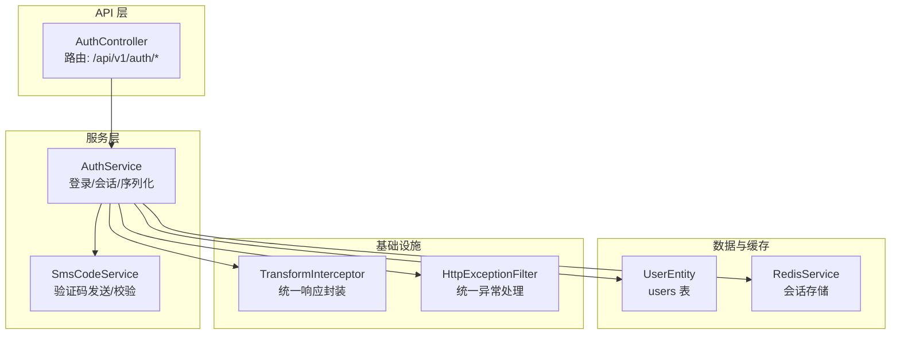
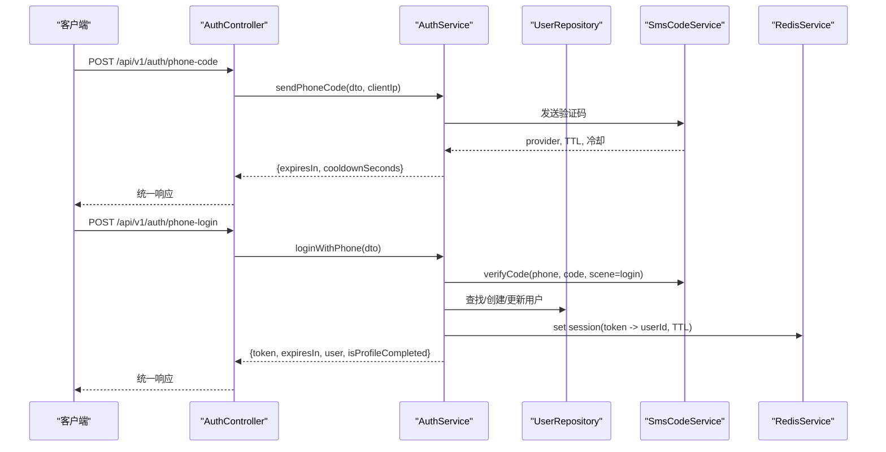
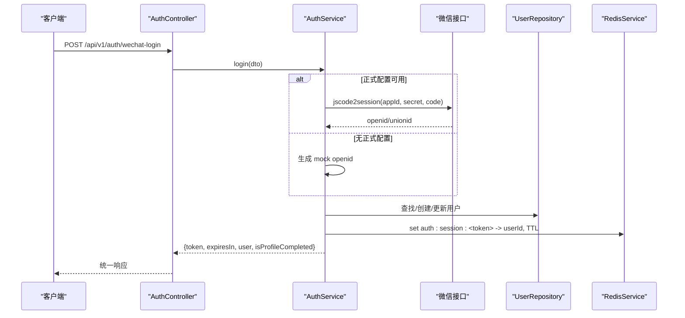
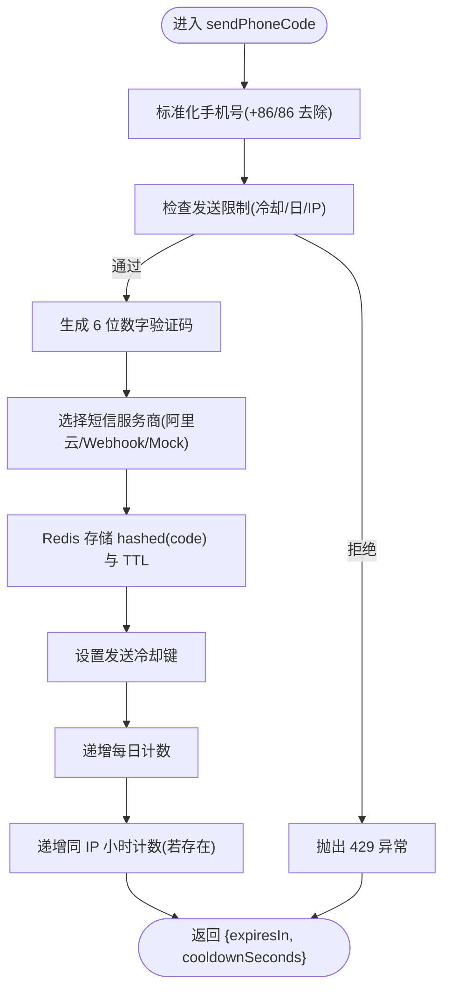
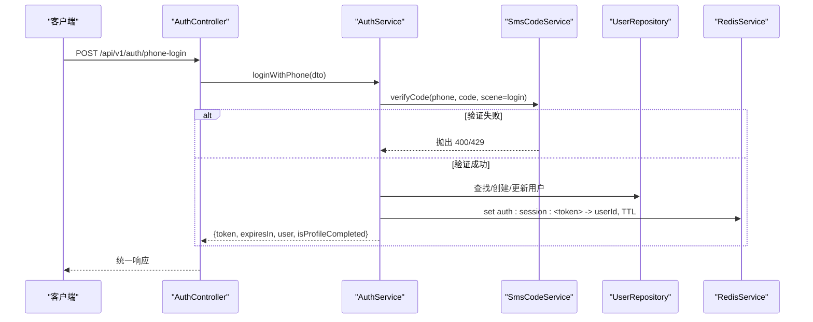
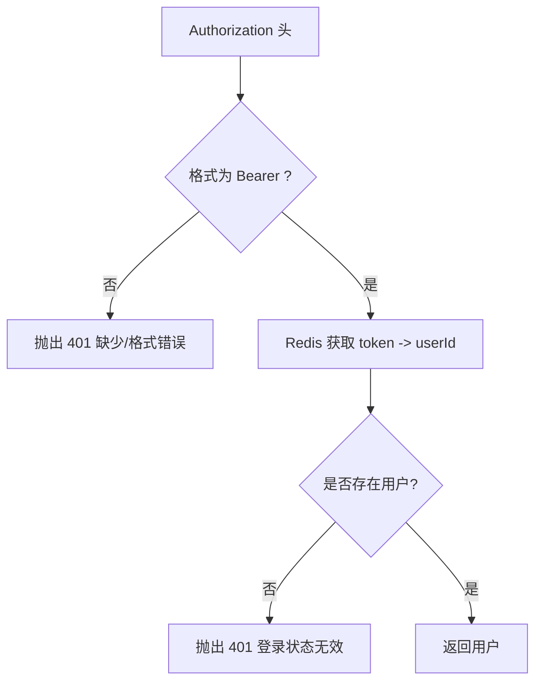
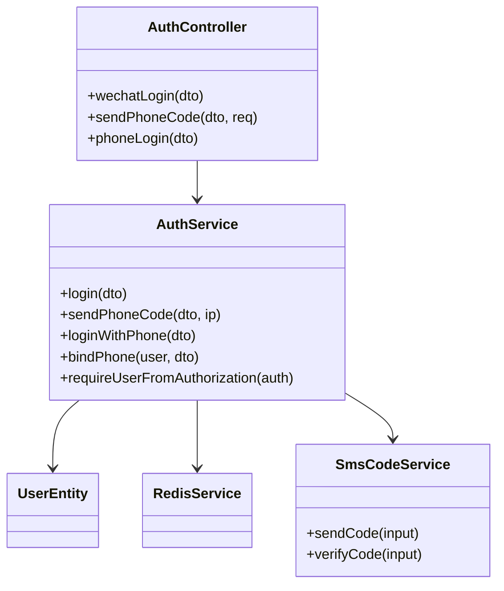

# 认证相关接口

<cite>
**本文引用的文件**
- [services/api/src/auth/auth.controller.ts](file://services/api/src/auth/auth.controller.ts)
- [services/api/src/auth/auth.service.ts](file://services/api/src/auth/auth.service.ts)
- [services/api/src/auth/sms-code.service.ts](file://services/api/src/auth/sms-code.service.ts)
- [services/api/src/auth/dto/wechat-login.dto.ts](file://services/api/src/auth/dto/wechat-login.dto.ts)
- [services/api/src/auth/dto/phone-login.dto.ts](file://services/api/src/auth/dto/phone-login.dto.ts)
- [services/api/src/auth/dto/phone-code.dto.ts](file://services/api/src/auth/dto/phone-code.dto.ts)
- [services/api/src/auth/dto/bind-phone.dto.ts](file://services/api/src/auth/dto/bind-phone.dto.ts)
- [services/api/src/auth/auth.module.ts](file://services/api/src/auth/auth.module.ts)
- [services/api/src/database/entities/user.entity.ts](file://services/api/src/database/entities/user.entity.ts)
- [services/api/src/redis/redis.service.ts](file://services/api/src/redis/redis.service.ts)
- [services/api/src/common/interceptors/transform.interceptor.ts](file://services/api/src/common/interceptors/transform.interceptor.ts)
- [services/api/src/common/filters/http-exception.filter.ts](file://services/api/src/common/filters/http-exception.filter.ts)
- [services/api/src/main.ts](file://services/api/src/main.ts)
- [docker-compose.yml](file://docker-compose.yml)
</cite>

## 目录
1. [简介](#简介)
2. [项目结构](#项目结构)
3. [核心组件](#核心组件)
4. [架构总览](#架构总览)
5. [详细组件分析](#详细组件分析)
6. [依赖关系分析](#依赖关系分析)
7. [性能考量](#性能考量)
8. [故障排查指南](#故障排查指南)
9. [结论](#结论)
10. [附录](#附录)

## 简介
本文件面向移动端与管理端的认证相关接口，覆盖以下能力：
- 微信授权登录：通过小程序 code 换取会话，创建或更新用户，返回 Token 与用户信息。
- 手机号登录：发送短信验证码、校验验证码、完成手机号登录并创建/更新用户。
- 绑定手机：在已有会话下，使用验证码将手机号绑定到当前用户。

接口统一采用 Bearer Token 鉴权，基于 Redis 存储会话，支持统一响应体与异常过滤。本文提供每个接口的 HTTP 方法、URL、请求 DTO、响应结构、状态码含义，并给出微信登录与手机号登录的完整流程图与示例。

## 项目结构
认证模块由控制器、服务层、DTO 校验、短信服务、Redis 与数据库实体组成；全局拦截器与过滤器负责统一封装响应与异常。

图表来源
- [services/api/src/auth/auth.controller.ts:1-36](file://services/api/src/auth/auth.controller.ts#L1-L36)
- [services/api/src/auth/auth.service.ts:1-419](file://services/api/src/auth/auth.service.ts#L1-L419)
- [services/api/src/auth/sms-code.service.ts:1-400](file://services/api/src/auth/sms-code.service.ts#L1-L400)
- [services/api/src/database/entities/user.entity.ts:1-75](file://services/api/src/database/entities/user.entity.ts#L1-L75)
- [services/api/src/redis/redis.service.ts:1-125](file://services/api/src/redis/redis.service.ts#L1-L125)
- [services/api/src/common/interceptors/transform.interceptor.ts:1-59](file://services/api/src/common/interceptors/transform.interceptor.ts#L1-L59)
- [services/api/src/common/filters/http-exception.filter.ts:1-92](file://services/api/src/common/filters/http-exception.filter.ts#L1-L92)

章节来源
- [services/api/src/auth/auth.controller.ts:1-36](file://services/api/src/auth/auth.controller.ts#L1-L36)
- [services/api/src/auth/auth.module.ts:1-16](file://services/api/src/auth/auth.module.ts#L1-L16)
- [services/api/src/main.ts:32-59](file://services/api/src/main.ts#L32-L59)

## 核心组件
- 控制器：暴露 /api/v1/auth/* 的三个接口，分别用于微信登录、发送手机验证码、手机登录。
- 服务层：
  - AuthService：实现微信登录、手机号登录、绑定手机、会话创建与校验、用户序列化。
  - SmsCodeService：实现验证码生成、发送（支持阿里云/自定义 Webhook/Mock）、校验与限流。
- 数据与缓存：UserEntity 映射 users 表；RedisService 提供键值存取。
- 全局拦截器与过滤器：统一响应体与异常处理。

章节来源
- [services/api/src/auth/auth.controller.ts:1-36](file://services/api/src/auth/auth.controller.ts#L1-L36)
- [services/api/src/auth/auth.service.ts:1-419](file://services/api/src/auth/auth.service.ts#L1-L419)
- [services/api/src/auth/sms-code.service.ts:1-400](file://services/api/src/auth/sms-code.service.ts#L1-L400)
- [services/api/src/database/entities/user.entity.ts:1-75](file://services/api/src/database/entities/user.entity.ts#L1-L75)
- [services/api/src/redis/redis.service.ts:1-125](file://services/api/src/redis/redis.service.ts#L1-L125)
- [services/api/src/common/interceptors/transform.interceptor.ts:1-59](file://services/api/src/common/interceptors/transform.interceptor.ts#L1-L59)
- [services/api/src/common/filters/http-exception.filter.ts:1-92](file://services/api/src/common/filters/http-exception.filter.ts#L1-L92)

## 架构总览
认证接口遵循“请求 → DTO 校验 → 服务处理 → 数据/缓存 → 统一响应”的链路。微信登录依赖微信官方接口换取 openid；手机号登录依赖短信服务；会话通过 Redis 存储，客户端以 Bearer Token 方式携带。

图表来源
- [services/api/src/auth/auth.controller.ts:17-25](file://services/api/src/auth/auth.controller.ts#L17-L25)
- [services/api/src/auth/auth.service.ts:81-131](file://services/api/src/auth/auth.service.ts#L81-L131)
- [services/api/src/auth/sms-code.service.ts:35-76](file://services/api/src/auth/sms-code.service.ts#L35-L76)

## 详细组件分析

### 接口一览与规范
- 基础路径：/api/v1
- 认证方式：HTTP 头 Authorization: Bearer <token>
- 统一响应体字段：code, message, data, timestamp
- 统一错误体字段：code, message, data=null, timestamp

章节来源
- [services/api/src/common/interceptors/transform.interceptor.ts:10-15](file://services/api/src/common/interceptors/transform.interceptor.ts#L10-L15)
- [services/api/src/common/filters/http-exception.filter.ts:11-16](file://services/api/src/common/filters/http-exception.filter.ts#L11-L16)
- [services/api/src/main.ts:32-34](file://services/api/src/main.ts#L32-L34)

### 微信授权登录
- HTTP 方法与路径
  - POST /api/v1/auth/wechat-login
- 请求参数 DTO（WechatLoginDto）
  - code: string（最小长度 2，平台限定 mp-weixin）
  - platform: 'mp-weixin'
  - nickname?: string（最大长度 64）
  - avatarUrl?: string（最大长度 255）
- 响应数据
  - token: string（会话标识）
  - expiresIn: number（秒）
  - authMode: 'wechat' | 'mock'
  - authProviderLabel: string（中文标签）
  - user: 用户对象（见“用户序列化”）
  - isProfileCompleted: boolean
- 流程说明
  - 使用 code 调用微信接口换取 openid/unionid（或使用 Mock）。
  - 根据 openid 查找/创建用户，更新头像、昵称、最后登录时间与提供商。
  - 生成随机 token，写入 Redis（TTL=30 天），返回统一响应。
- 成功示例
  - 请求：包含 code、platform、可选 nickname/avatarUrl
  - 响应：包含 token、expiresIn、user、isProfileCompleted
- 失败示例
  - code 无效或微信接口异常：返回 502 Bad Gateway
  - 未配置正式微信密钥且不允许 Mock：返回 502 Bad Gateway
- 状态码
  - 200 成功
  - 400 参数错误/微信接口异常
  - 502 微信登录失败或配置缺失

图表来源
- [services/api/src/auth/auth.controller.ts:12-15](file://services/api/src/auth/auth.controller.ts#L12-L15)
- [services/api/src/auth/auth.service.ts:50-79](file://services/api/src/auth/auth.service.ts#L50-L79)
- [services/api/src/auth/auth.service.ts:372-417](file://services/api/src/auth/auth.service.ts#L372-L417)

章节来源
- [services/api/src/auth/auth.controller.ts:12-15](file://services/api/src/auth/auth.controller.ts#L12-L15)
- [services/api/src/auth/dto/wechat-login.dto.ts:1-22](file://services/api/src/auth/dto/wechat-login.dto.ts#L1-L22)
- [services/api/src/auth/auth.service.ts:50-79](file://services/api/src/auth/auth.service.ts#L50-L79)
- [services/api/src/auth/auth.service.ts:372-417](file://services/api/src/auth/auth.service.ts#L372-L417)

### 发送手机验证码
- HTTP 方法与路径
  - POST /api/v1/auth/phone-code
- 请求参数 DTO（PhoneCodeDto）
  - phone: string（5-20 位，自动去除空格/横杠，+86/86 前缀兼容）
  - scene?: 'login' | 'bind'（默认 login）
- 响应数据
  - expiresIn: number（验证码有效期，秒）
  - cooldownSeconds: number（发送冷却时间，秒）
- 限制与风控
  - 单手机号发送冷却（默认 60 秒）
  - 每日上限（默认 10 次）
  - 同 IP 小时级上限（默认 30 次）
  - 验证码错误尝试上限（默认 5 次）
- 成功示例
  - 请求：{ phone: "13800001111", scene: "login" }
  - 响应：{ expiresIn: 300, cooldownSeconds: 60 }
- 失败示例
  - 验证码发送过于频繁：返回 429 Too Many Requests
  - 今日已达上限：返回 429
  - IP 小时内超限：返回 429
  - 未配置短信服务：返回 400
- 状态码
  - 200 成功
  - 400 参数错误/短信服务配置错误
  - 429 频率限制
  - 502 短信服务发送失败

图表来源
- [services/api/src/auth/auth.service.ts:81-93](file://services/api/src/auth/auth.service.ts#L81-L93)
- [services/api/src/auth/sms-code.service.ts:35-76](file://services/api/src/auth/sms-code.service.ts#L35-L76)
- [services/api/src/auth/sms-code.service.ts:115-146](file://services/api/src/auth/sms-code.service.ts#L115-L146)

章节来源
- [services/api/src/auth/auth.controller.ts:17-20](file://services/api/src/auth/auth.controller.ts#L17-L20)
- [services/api/src/auth/dto/phone-code.dto.ts:1-20](file://services/api/src/auth/dto/phone-code.dto.ts#L1-L20)
- [services/api/src/auth/sms-code.service.ts:19-23](file://services/api/src/auth/sms-code.service.ts#L19-L23)
- [services/api/src/auth/sms-code.service.ts:115-146](file://services/api/src/auth/sms-code.service.ts#L115-L146)

### 手机号登录
- HTTP 方法与路径
  - POST /api/v1/auth/phone-login
- 请求参数 DTO（PhoneLoginDto）
  - phone: string（5-20 位）
  - code: string（4-8 位）
  - nickname?: string（最大 64）
  - avatarUrl?: string（最大 255）
- 流程说明
  - 校验验证码（scene=login）。
  - 查找/创建/更新用户：设置手机号、标记手机号验证时间、默认昵称、最后登录时间与提供商。
  - 创建会话：生成 token，写入 Redis（TTL=30 天），返回统一响应。
- 成功示例
  - 请求：{ phone, code, 可选昵称/头像 }
  - 响应：{ token, expiresIn, user, isProfileCompleted }
- 失败示例
  - 验证码错误/过期：返回 400
  - 验证码错误次数过多：返回 429
  - 未配置短信服务：返回 400
- 状态码
  - 200 成功
  - 400 参数错误/验证码错误
  - 429 验证码错误次数过多
  - 502 短信服务异常

图表来源
- [services/api/src/auth/auth.controller.ts:22-25](file://services/api/src/auth/auth.controller.ts#L22-L25)
- [services/api/src/auth/auth.service.ts:95-131](file://services/api/src/auth/auth.service.ts#L95-L131)
- [services/api/src/auth/sms-code.service.ts:78-113](file://services/api/src/auth/sms-code.service.ts#L78-L113)

章节来源
- [services/api/src/auth/auth.controller.ts:22-25](file://services/api/src/auth/auth.controller.ts#L22-L25)
- [services/api/src/auth/dto/phone-login.dto.ts:1-24](file://services/api/src/auth/dto/phone-login.dto.ts#L1-L24)
- [services/api/src/auth/auth.service.ts:95-131](file://services/api/src/auth/auth.service.ts#L95-L131)
- [services/api/src/auth/sms-code.service.ts:78-113](file://services/api/src/auth/sms-code.service.ts#L78-L113)

### 绑定手机
- HTTP 方法与路径
  - POST /api/v1/auth/bind-phone（需携带 Authorization: Bearer <token>）
- 请求参数 DTO（BindPhoneDto）
  - phone: string（5-20 位）
  - code: string（4-8 位）
- 流程说明
  - 校验验证码（scene=bind）。
  - 检查手机号是否已被其他用户绑定，若冲突则返回 409。
  - 更新当前用户手机号与验证时间，保存用户。
  - 返回用户信息与是否完善资料。
- 成功示例
  - 请求：{ phone, code }
  - 响应：{ user, isProfileCompleted }
- 失败示例
  - 验证码错误/过期：返回 400
  - 手机号已被绑定：返回 409
- 状态码
  - 200 成功
  - 400 参数错误/验证码错误
  - 409 手机号冲突
  - 401 未登录或会话失效

章节来源
- [services/api/src/auth/auth.service.ts:133-169](file://services/api/src/auth/auth.service.ts#L133-L169)
- [services/api/src/auth/dto/bind-phone.dto.ts:1-14](file://services/api/src/auth/dto/bind-phone.dto.ts#L1-L14)
- [services/api/src/auth/sms-code.service.ts:78-113](file://services/api/src/auth/sms-code.service.ts#L78-L113)

### 用户序列化与鉴权
- 用户序列化（AuthService.serializeUser）
  - 输出字段：id、openid、phoneMasked、phoneVerifiedAt、lastLoginProvider、nickname、avatarUrl、birthday、birthTime、birthPlace、gender、zodiac、baziSummary、fiveElements、preferences、vipStatus、vipExpiredAt。
- 鉴权方式
  - Bearer Token：从 Authorization 头解析 Bearer <token>。
  - 会话存储：Redis 键前缀 auth:session:，TTL=30 天。
  - 解析流程：提取 token → 查询 Redis → 若存在则查询用户 → 返回用户。
- 过期与刷新
  - 当前实现：会话 TTL 固定，未提供刷新策略；建议前端在即将过期时重新登录换取新 token。
- 会话校验异常
  - 未提供凭证：401
  - 凭证格式错误：401
  - 会话不存在或用户不存在：401
- 会话校验（可选）
  - 支持可选校验：resolveUserFromAuthorization 返回 null 而非抛异常。

图表来源
- [services/api/src/auth/auth.service.ts:171-200](file://services/api/src/auth/auth.service.ts#L171-L200)
- [services/api/src/auth/auth.service.ts:288-300](file://services/api/src/auth/auth.service.ts#L288-L300)

章节来源
- [services/api/src/auth/auth.service.ts:202-224](file://services/api/src/auth/auth.service.ts#L202-L224)
- [services/api/src/auth/auth.service.ts:171-200](file://services/api/src/auth/auth.service.ts#L171-L200)
- [services/api/src/auth/auth.service.ts:288-300](file://services/api/src/auth/auth.service.ts#L288-L300)

## 依赖关系分析
- 控制器依赖服务层；服务层依赖数据库实体、Redis 与短信服务。
- 全局拦截器与过滤器贯穿所有请求，确保统一响应与异常处理。
- 认证模块导入 TypeORM 的 User 实体与权益模块。

图表来源
- [services/api/src/auth/auth.controller.ts:1-36](file://services/api/src/auth/auth.controller.ts#L1-L36)
- [services/api/src/auth/auth.service.ts:1-48](file://services/api/src/auth/auth.service.ts#L1-L48)
- [services/api/src/auth/sms-code.service.ts:1-33](file://services/api/src/auth/sms-code.service.ts#L1-L33)
- [services/api/src/database/entities/user.entity.ts:1-75](file://services/api/src/database/entities/user.entity.ts#L1-L75)
- [services/api/src/redis/redis.service.ts:1-125](file://services/api/src/redis/redis.service.ts#L1-L125)

章节来源
- [services/api/src/auth/auth.module.ts:1-16](file://services/api/src/auth/auth.module.ts#L1-L16)

## 性能考量
- Redis 连接健康：RedisService 提供 ping 与连接状态检测，建议在健康检查中调用。
- 会话存储：使用 EX 过期策略，避免内存泄漏；建议监控 key 数量与命中率。
- 验证码存储：使用哈希加盐存储，避免明文；注意 Redis 写入失败回退策略。
- 短信服务：阿里云/自定义 Webhook 的网络开销较大，建议异步化与重试；对频繁失败进行熔断。
- DTO 校验：开启白名单与隐式转换，减少无效字段与类型转换成本。
- CORS 与全局中间件：仅允许必要来源与方法，降低跨域风险与无效请求。

## 故障排查指南
- 微信登录失败
  - 症状：返回 502，提示微信登录失败或配置缺失。
  - 排查：确认 WECHAT_APP_ID/WECHAT_APP_SECRET 已配置；若未配置且不允许 Mock，将触发 502。
- 验证码发送失败
  - 症状：返回 400 或 502。
  - 排查：检查 SMS_PROVIDER、阿里云配置、Webhook 地址与 Token；查看频率限制是否触发。
- 验证码错误/过期
  - 症状：返回 400；错误次数过多返回 429。
  - 排查：确认验证码未过期、输入正确；检查 attempts 计数是否被清零。
- 绑定手机冲突
  - 症状：返回 409。
  - 排查：确认手机号未被其他用户绑定；检查唯一索引约束。
- 会话无效
  - 症状：返回 401。
  - 排查：确认 Authorization 头格式、Token 是否过期、Redis 中是否存在对应键。

章节来源
- [services/api/src/auth/auth.service.ts:372-417](file://services/api/src/auth/auth.service.ts#L372-L417)
- [services/api/src/auth/sms-code.service.ts:115-146](file://services/api/src/auth/sms-code.service.ts#L115-L146)
- [services/api/src/auth/sms-code.service.ts:78-113](file://services/api/src/auth/sms-code.service.ts#L78-L113)
- [services/api/src/auth/auth.service.ts:171-200](file://services/api/src/auth/auth.service.ts#L171-L200)

## 结论
本认证体系以 DTO 校验、服务层编排、Redis 会话与短信服务为核心，提供微信登录、手机号登录与绑定手机三大能力。通过统一响应与异常过滤，保证前后端交互一致性；通过严格的风控与配置校验，提升安全性与稳定性。建议在生产环境严格配置短信与微信参数，避免 Mock 模式；同时关注 Redis 与短信服务的可用性与性能。

## 附录

### 请求与响应示例（示意）
- 微信登录
  - 请求：POST /api/v1/auth/wechat-login
  - 请求体：{ code: "...", platform: "mp-weixin", nickname: "小明", avatarUrl: "..." }
  - 成功响应：{ code: 0, message: "ok", data: { token, expiresIn, user, isProfileCompleted }, timestamp: "..." }
  - 失败响应：{ code: 400/502, message: "...", data: null, timestamp: "..." }
- 发送验证码
  - 请求：POST /api/v1/auth/phone-code
  - 请求体：{ phone: "13800001111", scene: "login" }
  - 成功响应：{ code: 0, message: "ok", data: { expiresIn: 300, cooldownSeconds: 60 }, timestamp: "..." }
- 手机号登录
  - 请求：POST /api/v1/auth/phone-login
  - 请求体：{ phone: "13800001111", code: "123456", nickname: "..." }
  - 成功响应：{ code: 0, message: "ok", data: { token, expiresIn, user, isProfileCompleted }, timestamp: "..." }
- 绑定手机
  - 请求：POST /api/v1/auth/bind-phone（需 Authorization）
  - 请求体：{ phone: "13800001111", code: "123456" }
  - 成功响应：{ code: 0, message: "ok", data: { user, isProfileCompleted }, timestamp: "..." }

### 配置项参考（生产环境）
- 微信登录
  - WECHAT_APP_ID、WECHAT_APP_SECRET（必须）
  - WECHAT_LOGIN_ALLOW_MOCK（生产禁用）
- 短信服务
  - SMS_PROVIDER：aliyun/webhook/mock
  - SMS_MOCK_ENABLED（生产禁用）
  - SMS_CODE_PEPPER（强随机）
  - 阿里云：ALIYUN_ACCESS_KEY_ID/SECRET、ALIYUN_SMS_SIGN_NAME、ALIYUN_SMS_TEMPLATE_CODE、ALIYUN_SMS_ENDPOINT
  - Webhook：SMS_WEBHOOK_URL、SMS_WEBHOOK_TOKEN

章节来源
- [docker-compose.yml:76-96](file://docker-compose.yml#L76-L96)
- [services/api/src/common/production-config.validator.ts:43-104](file://services/api/src/common/production-config.validator.ts#L43-L104)