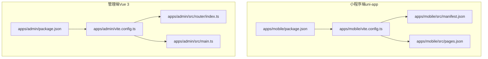
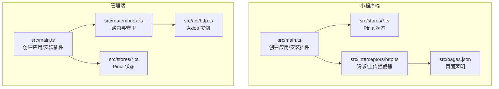
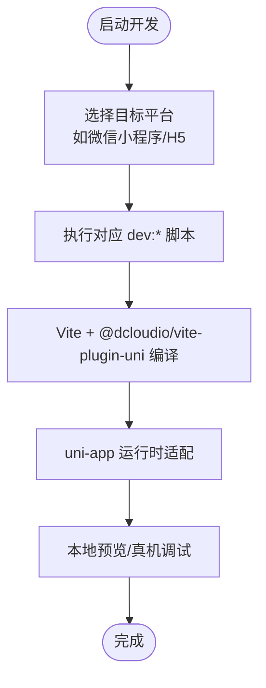
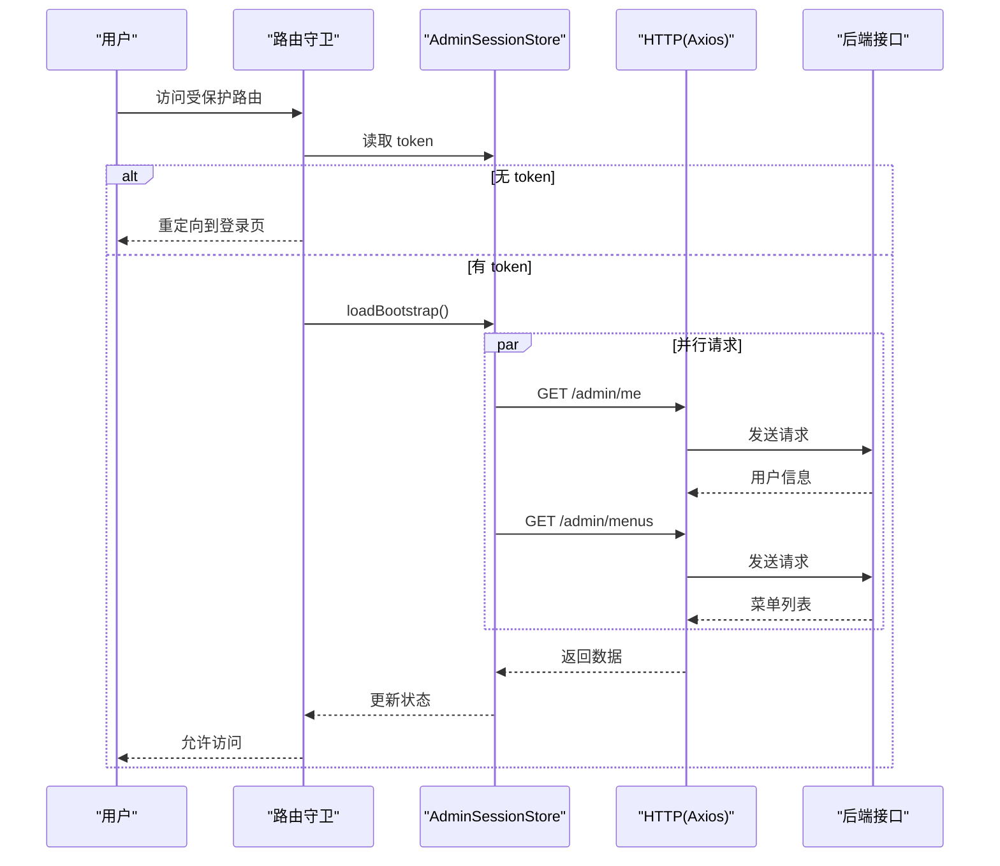
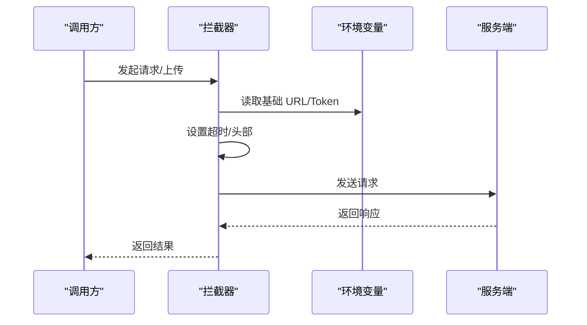
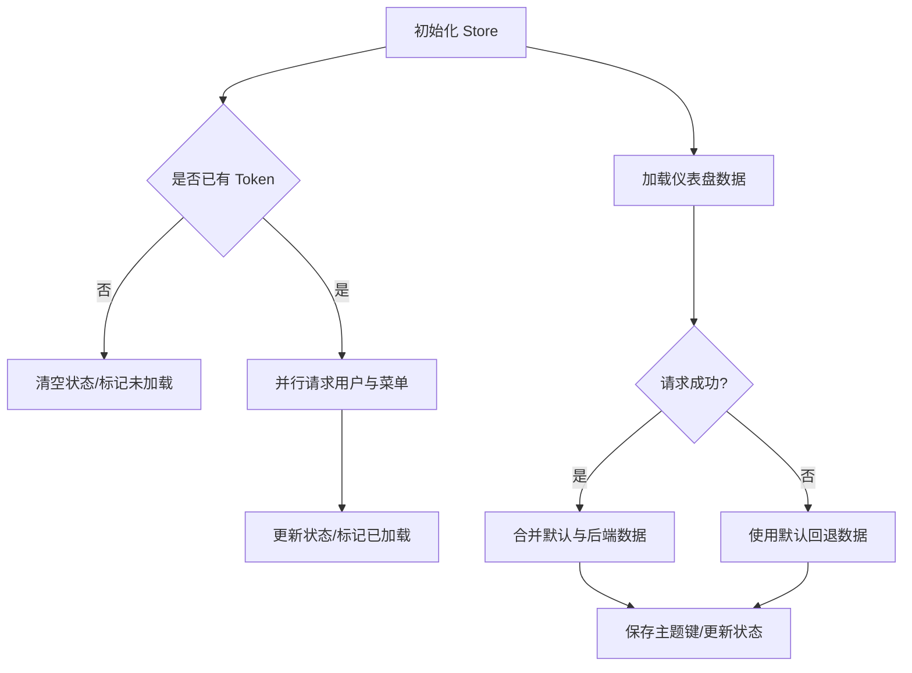
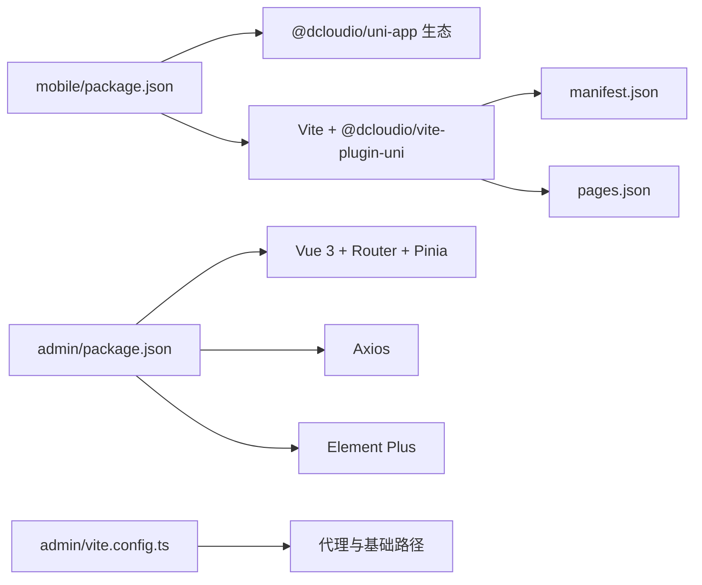

# 前端开发

<cite>
**本文引用的文件**
- [apps/mobile/package.json](file://apps/mobile/package.json)
- [apps/admin/package.json](file://apps/admin/package.json)
- [apps/mobile/vite.config.ts](file://apps/mobile/vite.config.ts)
- [apps/admin/vite.config.ts](file://apps/admin/vite.config.ts)
- [apps/mobile/src/manifest.json](file://apps/mobile/src/manifest.json)
- [apps/mobile/src/pages.json](file://apps/mobile/src/pages.json)
- [apps/admin/src/router/index.ts](file://apps/admin/src/router/index.ts)
- [apps/admin/src/main.ts](file://apps/admin/src/main.ts)
- [apps/mobile/src/main.ts](file://apps/mobile/src/main.ts)
- [apps/admin/src/stores/admin-session.ts](file://apps/admin/src/stores/admin-session.ts)
- [apps/mobile/src/stores/dashboard.ts](file://apps/mobile/src/stores/dashboard.ts)
- [apps/admin/src/api/http.ts](file://apps/admin/src/api/http.ts)
- [apps/mobile/src/interceptors/http.ts](file://apps/mobile/src/interceptors/http.ts)
</cite>

## 目录
1. [简介](#简介)
2. [项目结构](#项目结构)
3. [核心组件](#核心组件)
4. [架构总览](#架构总览)
5. [详细组件分析](#详细组件分析)
6. [依赖分析](#依赖分析)
7. [性能考虑](#性能考虑)
8. [故障排查指南](#故障排查指南)
9. [结论](#结论)
10. [附录](#附录)

## 简介
本指南面向 Fortune Hub 前端团队，系统性介绍小程序端（uni-app）与管理端（Vue 3）的项目结构、开发规范与最佳实践。重点涵盖：
- uni-app 多端编译原理与平台适配策略
- Vue 3 组合式 API、TypeScript 类型系统与 Pinia 状态管理
- 组件化设计原则、页面路由配置与 HTTP 请求封装
- 与后端 API 的交互模式、开发工具链与性能优化建议

## 项目结构
项目采用多包工作区组织，分别包含：
- 小程序端（apps/mobile）：基于 uni-app 3，支持多端构建与运行
- 管理端（apps/admin）：基于 Vite + Vue 3 + TypeScript，使用 Element Plus

图表来源
- [apps/mobile/package.json:1-76](file://apps/mobile/package.json#L1-L76)
- [apps/admin/package.json:1-32](file://apps/admin/package.json#L1-L32)
- [apps/mobile/vite.config.ts:1-8](file://apps/mobile/vite.config.ts#L1-L8)
- [apps/admin/vite.config.ts:1-58](file://apps/admin/vite.config.ts#L1-L58)
- [apps/mobile/src/manifest.json:1-56](file://apps/mobile/src/manifest.json#L1-L56)
- [apps/mobile/src/pages.json:1-223](file://apps/mobile/src/pages.json#L1-L223)
- [apps/admin/src/router/index.ts:1-62](file://apps/admin/src/router/index.ts#L1-L62)
- [apps/admin/src/main.ts:1-15](file://apps/admin/src/main.ts#L1-L15)

章节来源
- [apps/mobile/package.json:1-76](file://apps/mobile/package.json#L1-L76)
- [apps/admin/package.json:1-32](file://apps/admin/package.json#L1-L32)
- [apps/mobile/vite.config.ts:1-8](file://apps/mobile/vite.config.ts#L1-L8)
- [apps/admin/vite.config.ts:1-58](file://apps/admin/vite.config.ts#L1-L58)
- [apps/mobile/src/manifest.json:1-56](file://apps/mobile/src/manifest.json#L1-L56)
- [apps/mobile/src/pages.json:1-223](file://apps/mobile/src/pages.json#L1-L223)
- [apps/admin/src/router/index.ts:1-62](file://apps/admin/src/router/index.ts#L1-L62)
- [apps/admin/src/main.ts:1-15](file://apps/admin/src/main.ts#L1-L15)

## 核心组件
- 小程序端（uni-app）
  - 构建与多端：通过脚本命令与 @dcloudio/vite-plugin-uni 实现多端编译与运行
  - 页面与导航：通过 pages.json 配置页面路径与全局样式
  - 拦截器：通过 uni.addInterceptor 注入请求与上传拦截器，统一带入认证与基础 URL
  - 状态管理：Pinia Store 负责仪表盘等业务数据加载与缓存
- 管理端（Vue 3）
  - 路由守卫：登录态校验与重定向
  - HTTP 封装：Axios 实例注入 Token 与公共头
  - 状态管理：Pinia Store 管理管理员会话与菜单

章节来源
- [apps/mobile/src/main.ts:1-15](file://apps/mobile/src/main.ts#L1-L15)
- [apps/mobile/src/interceptors/http.ts:1-49](file://apps/mobile/src/interceptors/http.ts#L1-L49)
- [apps/mobile/src/stores/dashboard.ts:1-382](file://apps/mobile/src/stores/dashboard.ts#L1-L382)
- [apps/admin/src/router/index.ts:1-62](file://apps/admin/src/router/index.ts#L1-L62)
- [apps/admin/src/api/http.ts:1-21](file://apps/admin/src/api/http.ts#L1-L21)
- [apps/admin/src/stores/admin-session.ts:1-65](file://apps/admin/src/stores/admin-session.ts#L1-L65)

## 架构总览
整体前端架构分为两部分：
- 小程序端：以 uni-app 为核心，统一入口导出 createApp 并安装 Pinia；通过拦截器统一处理请求与上传；页面通过 pages.json 声明式注册
- 管理端：以 Vite + Vue 3 + TypeScript 为基础，使用 Element Plus 提供 UI 组件；通过路由守卫控制访问权限；HTTP 封装统一注入 Token

图表来源
- [apps/mobile/src/main.ts:1-15](file://apps/mobile/src/main.ts#L1-L15)
- [apps/mobile/src/interceptors/http.ts:1-49](file://apps/mobile/src/interceptors/http.ts#L1-L49)
- [apps/mobile/src/pages.json:1-223](file://apps/mobile/src/pages.json#L1-L223)
- [apps/admin/src/main.ts:1-15](file://apps/admin/src/main.ts#L1-L15)
- [apps/admin/src/router/index.ts:1-62](file://apps/admin/src/router/index.ts#L1-L62)
- [apps/admin/src/api/http.ts:1-21](file://apps/admin/src/api/http.ts#L1-L21)

## 详细组件分析

### 小程序端（uni-app）多端编译与页面配置
- 多端编译
  - 使用 @dcloudio/vite-plugin-uni 插件在 Vite 中启用 uni-app 支持
  - 通过 package.json 的 scripts 定义多端开发与构建命令，覆盖微信小程序、H5、快应用等平台
- 页面与导航
  - 通过 pages.json 声明页面路径、标题与导航样式，支持全局样式统一配置
  - manifest.json 配置应用信息、平台特定参数与模块权限

图表来源
- [apps/mobile/vite.config.ts:1-8](file://apps/mobile/vite.config.ts#L1-L8)
- [apps/mobile/package.json:4-37](file://apps/mobile/package.json#L4-L37)
- [apps/mobile/src/pages.json:1-223](file://apps/mobile/src/pages.json#L1-L223)
- [apps/mobile/src/manifest.json:1-56](file://apps/mobile/src/manifest.json#L1-L56)

章节来源
- [apps/mobile/vite.config.ts:1-8](file://apps/mobile/vite.config.ts#L1-L8)
- [apps/mobile/package.json:4-37](file://apps/mobile/package.json#L4-L37)
- [apps/mobile/src/pages.json:1-223](file://apps/mobile/src/pages.json#L1-L223)
- [apps/mobile/src/manifest.json:1-56](file://apps/mobile/src/manifest.json#L1-L56)

### 管理端（Vue 3）路由与登录态控制
- 路由配置
  - 使用 vue-router 创建路由实例，定义登录页与嵌套布局
  - 通过 beforeEach 守卫进行登录态校验：未登录跳转至登录页；已登录禁止重复进入登录页
- 登录流程
  - 通过 Pinia Store 管理 token、用户信息与菜单，并在登录成功后并行拉取用户与菜单数据
  - 请求通过 Axios 实例统一注入 X-Client 与 Authorization 头

图表来源
- [apps/admin/src/router/index.ts:46-61](file://apps/admin/src/router/index.ts#L46-L61)
- [apps/admin/src/stores/admin-session.ts:23-55](file://apps/admin/src/stores/admin-session.ts#L23-L55)
- [apps/admin/src/api/http.ts:12-20](file://apps/admin/src/api/http.ts#L12-L20)

章节来源
- [apps/admin/src/router/index.ts:1-62](file://apps/admin/src/router/index.ts#L1-L62)
- [apps/admin/src/stores/admin-session.ts:1-65](file://apps/admin/src/stores/admin-session.ts#L1-L65)
- [apps/admin/src/api/http.ts:1-21](file://apps/admin/src/api/http.ts#L1-L21)

### HTTP 请求封装与拦截器
- 小程序端
  - 通过 uni.addInterceptor 注册 request 与 uploadFile 拦截器
  - 自动注入超时、基础 URL 与认证头；上传文件走独立文件服务域名
- 管理端
  - 通过 axios.create 创建实例，设置基础 URL、超时与公共头
  - 请求拦截器读取 Token 并写入 Authorization

图表来源
- [apps/mobile/src/interceptors/http.ts:18-48](file://apps/mobile/src/interceptors/http.ts#L18-L48)
- [apps/admin/src/api/http.ts:4-20](file://apps/admin/src/api/http.ts#L4-L20)

章节来源
- [apps/mobile/src/interceptors/http.ts:1-49](file://apps/mobile/src/interceptors/http.ts#L1-L49)
- [apps/admin/src/api/http.ts:1-21](file://apps/admin/src/api/http.ts#L1-L21)

### Pinia 状态管理实践
- 小程序端仪表盘
  - 提供加载状态与回退数据，按需合并后端返回与默认值
  - 异常时回退默认数据并持久化主题键
- 管理端会话
  - 管理 token、用户与菜单，登录成功后并行拉取用户与菜单
  - 提供登出清理逻辑

图表来源
- [apps/mobile/src/stores/dashboard.ts:342-381](file://apps/mobile/src/stores/dashboard.ts#L342-L381)
- [apps/admin/src/stores/admin-session.ts:15-64](file://apps/admin/src/stores/admin-session.ts#L15-L64)

章节来源
- [apps/mobile/src/stores/dashboard.ts:1-382](file://apps/mobile/src/stores/dashboard.ts#L1-L382)
- [apps/admin/src/stores/admin-session.ts:1-65](file://apps/admin/src/stores/admin-session.ts#L1-L65)

### 组件化设计原则
- 单一职责：每个组件聚焦于单一功能，便于复用与测试
- 可组合性：通过 Props/Events/Slots 传递数据与行为，降低耦合
- 主题与样式：通过主题令牌与 SCSS 变量统一风格，确保跨端一致性
- 无障碍与可访问性：遵循平台规范，保证键盘与屏幕阅读器可用

（本节为通用设计原则说明，无需具体文件引用）

## 依赖分析
- 小程序端
  - 依赖 @dcloudio/uni-app 生态与 @dcloudio/vite-plugin-uni，构建与运行由 Vite 驱动
  - 通过 manifest.json 与 pages.json 控制平台能力与页面结构
- 管理端
  - 依赖 vue、vue-router、pinia、axios、element-plus 等生态库
  - 通过 Vite 配置代理与基础路径，统一开发体验

图表来源
- [apps/mobile/package.json:39-74](file://apps/mobile/package.json#L39-L74)
- [apps/mobile/vite.config.ts:1-8](file://apps/mobile/vite.config.ts#L1-L8)
- [apps/mobile/src/manifest.json:1-56](file://apps/mobile/src/manifest.json#L1-L56)
- [apps/mobile/src/pages.json:1-223](file://apps/mobile/src/pages.json#L1-L223)
- [apps/admin/package.json:11-30](file://apps/admin/package.json#L11-L30)
- [apps/admin/vite.config.ts:42-57](file://apps/admin/vite.config.ts#L42-L57)

章节来源
- [apps/mobile/package.json:1-76](file://apps/mobile/package.json#L1-L76)
- [apps/admin/package.json:1-32](file://apps/admin/package.json#L1-L32)
- [apps/admin/vite.config.ts:1-58](file://apps/admin/vite.config.ts#L1-L58)

## 性能考虑
- 请求层
  - 合理设置超时与重试策略，避免阻塞 UI
  - 对上传类请求单独设置更高超时，提升稳定性
- 状态层
  - Pinia Store 中区分加载态与回退数据，避免闪烁
  - 对高频数据进行缓存与去抖，减少重复请求
- 构建与分发
  - 在小程序端按需引入组件与图标，减少包体
  - 管理端通过 Vite 的懒加载与按需导入优化首屏

（本节提供通用指导，无需具体文件引用）

## 故障排查指南
- 登录态异常
  - 检查路由守卫中的 token 读取与重定向逻辑
  - 确认 Axios 拦截器是否正确注入 Authorization
- 请求失败
  - 核对基础 URL 与代理配置，确认 /api 前缀是否匹配
  - 检查拦截器是否正确拼接基础 URL 与 Token
- 页面无法渲染
  - 检查 pages.json 中页面路径与标题配置
  - 确认 manifest.json 中平台能力与权限声明

章节来源
- [apps/admin/src/router/index.ts:46-61](file://apps/admin/src/router/index.ts#L46-L61)
- [apps/admin/src/api/http.ts:12-20](file://apps/admin/src/api/http.ts#L12-L20)
- [apps/mobile/src/interceptors/http.ts:18-48](file://apps/mobile/src/interceptors/http.ts#L18-L48)
- [apps/mobile/src/pages.json:1-223](file://apps/mobile/src/pages.json#L1-L223)
- [apps/mobile/src/manifest.json:1-56](file://apps/mobile/src/manifest.json#L1-L56)

## 结论
本指南总结了 Fortune Hub 前端在小程序端与管理端的关键实现与最佳实践。通过统一的 HTTP 封装、Pinia 状态管理与路由守卫，结合 uni-app 的多端能力与 Vite 的高效构建，团队可以快速迭代并保持一致的开发标准。

## 附录
- 开发命令速查
  - 小程序端：dev:h5、dev:mp-weixin、build:h5、build:mp-weixin 等
  - 管理端：dev、build、preview
- 关键配置
  - 小程序端：vite.config.ts、manifest.json、pages.json
  - 管理端：vite.config.ts、router/index.ts、api/http.ts

章节来源
- [apps/mobile/package.json:4-37](file://apps/mobile/package.json#L4-L37)
- [apps/admin/package.json:6-10](file://apps/admin/package.json#L6-L10)
- [apps/mobile/vite.config.ts:1-8](file://apps/mobile/vite.config.ts#L1-L8)
- [apps/admin/vite.config.ts:42-57](file://apps/admin/vite.config.ts#L42-L57)
- [apps/mobile/src/manifest.json:1-56](file://apps/mobile/src/manifest.json#L1-L56)
- [apps/mobile/src/pages.json:1-223](file://apps/mobile/src/pages.json#L1-L223)
- [apps/admin/src/router/index.ts:1-62](file://apps/admin/src/router/index.ts#L1-L62)
- [apps/admin/src/api/http.ts:1-21](file://apps/admin/src/api/http.ts#L1-L21)