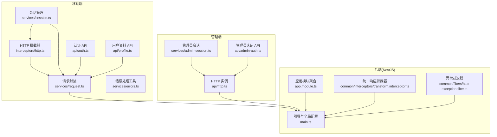
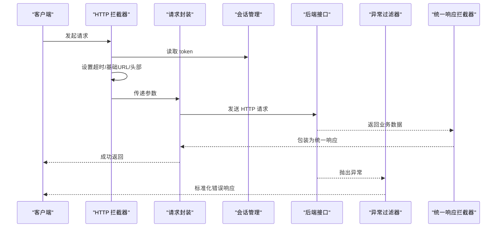
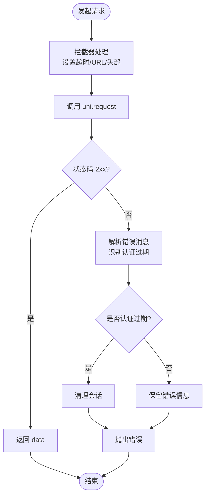
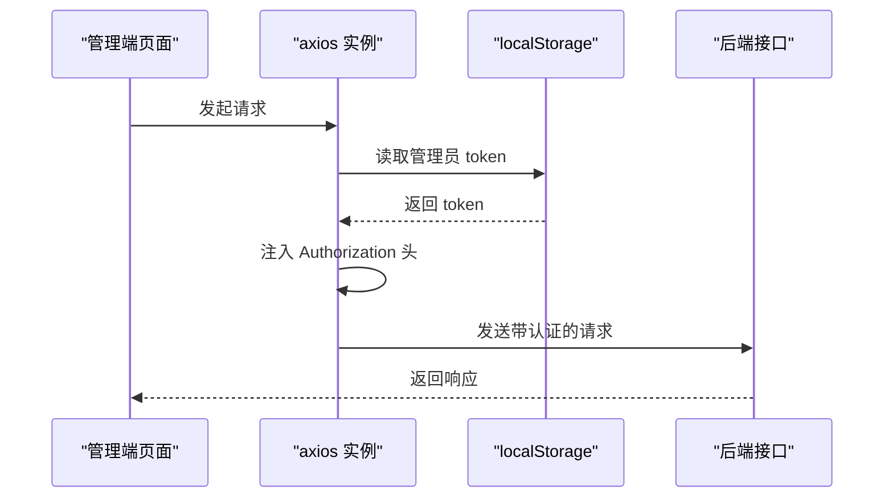
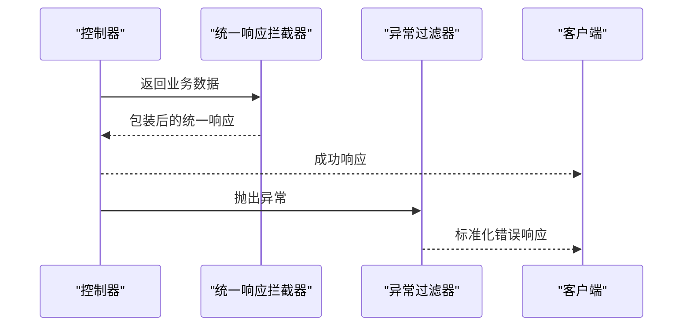
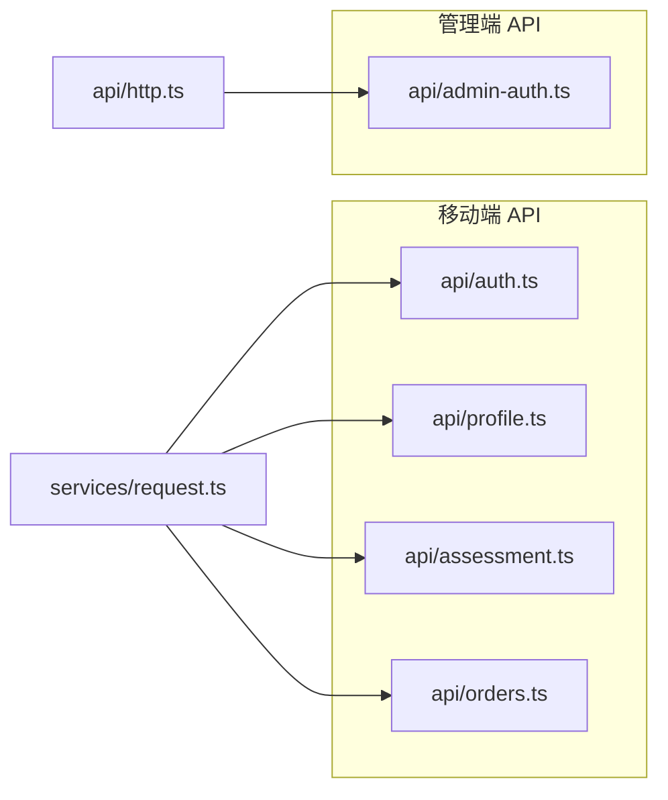
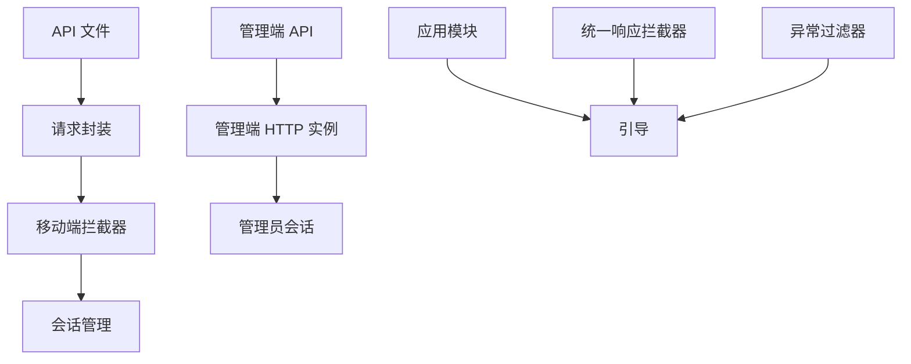

# API 服务集成

<cite>
**本文引用的文件**
- [apps/admin/src/api/http.ts](file://apps/admin/src/api/http.ts)
- [apps/admin/src/api/admin-auth.ts](file://apps/admin/src/api/admin-auth.ts)
- [apps/admin/src/services/admin-session.ts](file://apps/admin/src/services/admin-session.ts)
- [apps/mobile/src/interceptors/http.ts](file://apps/mobile/src/interceptors/http.ts)
- [apps/mobile/src/services/request.ts](file://apps/mobile/src/services/request.ts)
- [apps/mobile/src/services/session.ts](file://apps/mobile/src/services/session.ts)
- [apps/mobile/src/services/errors.ts](file://apps/mobile/src/services/errors.ts)
- [apps/mobile/src/api/auth.ts](file://apps/mobile/src/api/auth.ts)
- [apps/mobile/src/api/profile.ts](file://apps/mobile/src/api/profile.ts)
- [services/api/src/common/interceptors/transform.interceptor.ts](file://services/api/src/common/interceptors/transform.interceptor.ts)
- [services/api/src/common/filters/http-exception.filter.ts](file://services/api/src/common/filters/http-exception.filter.ts)
- [services/api/src/main.ts](file://services/api/src/main.ts)
- [services/api/src/app.module.ts](file://services/api/src/app.module.ts)
</cite>

## 目录
1. [简介](#简介)
2. [项目结构](#项目结构)
3. [核心组件](#核心组件)
4. [架构总览](#架构总览)
5. [详细组件分析](#详细组件分析)
6. [依赖关系分析](#依赖关系分析)
7. [性能考量](#性能考量)
8. [故障排查指南](#故障排查指南)
9. [结论](#结论)
10. [附录](#附录)

## 简介
本指南聚焦于本仓库中的 API 服务集成实践，系统阐述三层 API 设计与实现：前端拦截与封装（移动端与管理端）、后端统一响应与异常过滤、以及模块化服务组织与可复用策略。内容涵盖：
- 前端 HTTP 拦截器与请求封装：请求预处理、认证 token 注入、上传文件基地址拼接、统一错误处理与会话失效处理。
- 后端拦截与过滤：统一响应包装、异常标准化输出、全局 CORS 与校验管道配置。
- 服务层设计：按功能域划分模块、控制器与服务职责分离、DTO 输入校验与数据转换。

## 项目结构
本项目采用多应用与多服务并行的分层架构：
- 移动端应用（H5/小程序）：通过拦截器与封装层统一处理请求、认证与错误。
- 管理端应用：基于 axios 的统一实例与拦截器注入 Bearer Token。
- 后端服务（NestJS）：模块化组织、全局拦截器与异常过滤、TypeORM 集成与数据库实体。

图表来源
- [apps/mobile/src/interceptors/http.ts:18-48](file://apps/mobile/src/interceptors/http.ts#L18-L48)
- [apps/mobile/src/services/request.ts:13-119](file://apps/mobile/src/services/request.ts#L13-L119)
- [apps/mobile/src/services/session.ts:15-55](file://apps/mobile/src/services/session.ts#L15-L55)
- [apps/mobile/src/services/errors.ts:42-81](file://apps/mobile/src/services/errors.ts#L42-L81)
- [apps/mobile/src/api/auth.ts:14-55](file://apps/mobile/src/api/auth.ts#L14-L55)
- [apps/mobile/src/api/profile.ts:4-6](file://apps/mobile/src/api/profile.ts#L4-L6)
- [apps/admin/src/api/http.ts:4-20](file://apps/admin/src/api/http.ts#L4-L20)
- [apps/admin/src/services/admin-session.ts:7-29](file://apps/admin/src/services/admin-session.ts#L7-L29)
- [apps/admin/src/api/admin-auth.ts:46-62](file://apps/admin/src/api/admin-auth.ts#L46-L62)
- [services/api/src/main.ts:8-61](file://services/api/src/main.ts#L8-L61)
- [services/api/src/app.module.ts:61-144](file://services/api/src/app.module.ts#L61-L144)
- [services/api/src/common/interceptors/transform.interceptor.ts:17-58](file://services/api/src/common/interceptors/transform.interceptor.ts#L17-L58)
- [services/api/src/common/filters/http-exception.filter.ts:18-91](file://services/api/src/common/filters/http-exception.filter.ts#L18-L91)

章节来源
- [services/api/src/app.module.ts:61-144](file://services/api/src/app.module.ts#L61-L144)
- [services/api/src/main.ts:8-61](file://services/api/src/main.ts#L8-L61)

## 核心组件
- 前端拦截与封装
  - 移动端拦截器：统一设置超时、拼接基础 URL、注入认证头、区分普通请求与上传文件。
  - 请求封装：统一封装 uni.request，处理状态码与错误对象，识别 401 或“重新登录”提示并清理会话。
  - 会话管理：存储与读取 token、用户信息与元数据，支持一键清空。
  - 错误处理工具：从多种错误形态中提取消息，判定是否认证过期并触发登出与跳转。
- 管理端拦截与封装
  - axios 实例：统一 base URL、超时与自定义头。
  - 请求拦截器：从本地存储读取 token 并注入 Authorization 头。
- 后端拦截与过滤
  - 统一响应拦截器：对非手动响应的数据进行包装，避免重复包裹。
  - 异常过滤器：标准化错误响应体，区分字符串或对象形式的消息，记录 5xx 错误堆栈。
  - 全局配置：设置全局前缀、启用 CORS、注册验证管道。

章节来源
- [apps/mobile/src/interceptors/http.ts:18-48](file://apps/mobile/src/interceptors/http.ts#L18-L48)
- [apps/mobile/src/services/request.ts:13-119](file://apps/mobile/src/services/request.ts#L13-L119)
- [apps/mobile/src/services/session.ts:15-55](file://apps/mobile/src/services/session.ts#L15-L55)
- [apps/mobile/src/services/errors.ts:42-81](file://apps/mobile/src/services/errors.ts#L42-L81)
- [apps/admin/src/api/http.ts:4-20](file://apps/admin/src/api/http.ts#L4-L20)
- [apps/admin/src/services/admin-session.ts:7-29](file://apps/admin/src/services/admin-session.ts#L7-L29)
- [services/api/src/common/interceptors/transform.interceptor.ts:17-58](file://services/api/src/common/interceptors/transform.interceptor.ts#L17-L58)
- [services/api/src/common/filters/http-exception.filter.ts:18-91](file://services/api/src/common/filters/http-exception.filter.ts#L18-L91)
- [services/api/src/main.ts:8-61](file://services/api/src/main.ts#L8-L61)

## 架构总览
下图展示从前端到后端的关键交互路径与职责边界：

图表来源
- [apps/mobile/src/interceptors/http.ts:18-48](file://apps/mobile/src/interceptors/http.ts#L18-L48)
- [apps/mobile/src/services/request.ts:13-119](file://apps/mobile/src/services/request.ts#L13-L119)
- [apps/mobile/src/services/session.ts:15-55](file://apps/mobile/src/services/session.ts#L15-L55)
- [services/api/src/common/interceptors/transform.interceptor.ts:17-58](file://services/api/src/common/interceptors/transform.interceptor.ts#L17-L58)
- [services/api/src/common/filters/http-exception.filter.ts:18-91](file://services/api/src/common/filters/http-exception.filter.ts#L18-L91)

## 详细组件分析

### 移动端 HTTP 拦截器与请求封装
- 功能要点
  - 请求拦截：设置默认超时、拼接基础 URL、注入 X-Client 与 Authorization 头。
  - 上传拦截：针对 uploadFile 自动切换文件服务基础 URL，并注入 X-Client。
  - 请求封装：统一封装 uni.request，按状态码判断成功/失败；失败时解析错误消息，识别认证过期并清理会话。
  - 错误处理工具：从多种错误形态中提取消息，判定是否认证过期并触发登出与跳转。
- 关键流程

图表来源
- [apps/mobile/src/interceptors/http.ts:18-48](file://apps/mobile/src/interceptors/http.ts#L18-L48)
- [apps/mobile/src/services/request.ts:13-119](file://apps/mobile/src/services/request.ts#L13-L119)
- [apps/mobile/src/services/errors.ts:42-81](file://apps/mobile/src/services/errors.ts#L42-L81)

章节来源
- [apps/mobile/src/interceptors/http.ts:18-48](file://apps/mobile/src/interceptors/http.ts#L18-L48)
- [apps/mobile/src/services/request.ts:13-119](file://apps/mobile/src/services/request.ts#L13-L119)
- [apps/mobile/src/services/errors.ts:42-81](file://apps/mobile/src/services/errors.ts#L42-L81)

### 管理端 HTTP 拦截器与会话管理
- 功能要点
  - axios 实例：统一基础 URL、超时与自定义头。
  - 请求拦截器：从 localStorage 读取管理员 token 并注入 Authorization。
- 关键流程

图表来源
- [apps/admin/src/api/http.ts:4-20](file://apps/admin/src/api/http.ts#L4-L20)
- [apps/admin/src/services/admin-session.ts:7-29](file://apps/admin/src/services/admin-session.ts#L7-L29)

章节来源
- [apps/admin/src/api/http.ts:4-20](file://apps/admin/src/api/http.ts#L4-L20)
- [apps/admin/src/services/admin-session.ts:7-29](file://apps/admin/src/services/admin-session.ts#L7-L29)

### 后端统一响应与异常过滤
- 统一响应拦截器
  - 对未使用手动响应的控制器返回数据进行包装，避免重复包裹。
  - 自动添加 code/message/data/timestamp 字段。
- 异常过滤器
  - 将 HttpException 与未知异常标准化为统一错误体。
  - 支持从字符串或对象响应中提取第一条可用消息。
  - 记录 5xx 错误堆栈以便排查。
- 全局配置
  - 设置全局前缀、启用 CORS、注册验证管道（白名单、类型转换等）。

图表来源
- [services/api/src/common/interceptors/transform.interceptor.ts:17-58](file://services/api/src/common/interceptors/transform.interceptor.ts#L17-L58)
- [services/api/src/common/filters/http-exception.filter.ts:18-91](file://services/api/src/common/filters/http-exception.filter.ts#L18-L91)
- [services/api/src/main.ts:8-61](file://services/api/src/main.ts#L8-L61)

章节来源
- [services/api/src/common/interceptors/transform.interceptor.ts:17-58](file://services/api/src/common/interceptors/transform.interceptor.ts#L17-L58)
- [services/api/src/common/filters/http-exception.filter.ts:18-91](file://services/api/src/common/filters/http-exception.filter.ts#L18-L91)
- [services/api/src/main.ts:8-61](file://services/api/src/main.ts#L8-L61)

### 模块化 API 文件组织与服务层设计
- 移动端 API 文件组织
  - 按功能域拆分：auth.ts、profile.ts、assessment.ts、orders.ts 等。
  - 每个文件导出一组与该领域相关的请求方法，内部统一使用 http 封装。
- 管理端 API 文件组织
  - admin-auth.ts 定义管理员登录、个人信息、菜单等接口方法。
  - 统一使用 http 实例，减少重复配置。
- 后端模块化
  - app.module.ts 聚合各功能模块（如 AuthModule、UsersModule、AssessmentModule 等），集中配置数据库与中间件。
  - 控制器与服务分离，DTO 用于输入校验与转换。

图表来源
- [apps/mobile/src/api/auth.ts:14-55](file://apps/mobile/src/api/auth.ts#L14-L55)
- [apps/mobile/src/api/profile.ts:4-6](file://apps/mobile/src/api/profile.ts#L4-L6)
- [apps/admin/src/api/admin-auth.ts:46-62](file://apps/admin/src/api/admin-auth.ts#L46-L62)
- [apps/admin/src/api/http.ts:4-20](file://apps/admin/src/api/http.ts#L4-L20)
- [apps/mobile/src/services/request.ts:83-119](file://apps/mobile/src/services/request.ts#L83-L119)

章节来源
- [apps/mobile/src/api/auth.ts:14-55](file://apps/mobile/src/api/auth.ts#L14-L55)
- [apps/mobile/src/api/profile.ts:4-6](file://apps/mobile/src/api/profile.ts#L4-L6)
- [apps/admin/src/api/admin-auth.ts:46-62](file://apps/admin/src/api/admin-auth.ts#L46-L62)
- [apps/admin/src/api/http.ts:4-20](file://apps/admin/src/api/http.ts#L4-L20)
- [apps/mobile/src/services/request.ts:83-119](file://apps/mobile/src/services/request.ts#L83-L119)

## 依赖关系分析
- 前端依赖链
  - 拦截器依赖会话管理以读取 token。
  - 请求封装依赖拦截器提供的参数与头部。
  - API 文件依赖请求封装以暴露领域方法。
- 后端依赖链
  - 应用模块聚合各业务模块。
  - 全局拦截器与过滤器在引导阶段注册。
  - 验证管道确保 DTO 输入安全与类型转换。

图表来源
- [apps/mobile/src/interceptors/http.ts:18-48](file://apps/mobile/src/interceptors/http.ts#L18-L48)
- [apps/mobile/src/services/session.ts:15-55](file://apps/mobile/src/services/session.ts#L15-L55)
- [apps/mobile/src/services/request.ts:13-119](file://apps/mobile/src/services/request.ts#L13-L119)
- [apps/admin/src/api/http.ts:4-20](file://apps/admin/src/api/http.ts#L4-L20)
- [apps/admin/src/services/admin-session.ts:7-29](file://apps/admin/src/services/admin-session.ts#L7-L29)
- [services/api/src/app.module.ts:61-144](file://services/api/src/app.module.ts#L61-L144)
- [services/api/src/main.ts:8-61](file://services/api/src/main.ts#L8-L61)
- [services/api/src/common/interceptors/transform.interceptor.ts:17-58](file://services/api/src/common/interceptors/transform.interceptor.ts#L17-L58)
- [services/api/src/common/filters/http-exception.filter.ts:18-91](file://services/api/src/common/filters/http-exception.filter.ts#L18-L91)

章节来源
- [services/api/src/app.module.ts:61-144](file://services/api/src/app.module.ts#L61-L144)
- [services/api/src/main.ts:8-61](file://services/api/src/main.ts#L8-L61)

## 性能考量
- 超时与并发
  - 前端拦截器与封装均设置了默认超时，建议根据接口特性调整（如上传接口可适当提高）。
- 缓存策略
  - 当前实现未内置缓存层，建议在业务层引入内存缓存或 LRU 缓存，对高频只读数据进行短期缓存。
- 重试机制
  - 可在请求封装层增加指数退避重试，针对 5xx 或网络错误进行有限次重试。
- 离线处理
  - 在网络不可用时，优先返回本地缓存或兜底数据，同时提示用户当前离线状态。
- CORS 与全局前缀
  - 后端已配置允许的来源与方法，建议生产环境严格限制来源，避免跨站风险。

## 故障排查指南
- 常见问题定位
  - 认证过期：移动端会在收到 401 或包含“重新登录”的消息时自动清理会话并提示。
  - 网络错误：统一从 errMsg 中提取错误描述，若为空则使用默认提示。
  - 5xx 错误：异常过滤器会记录堆栈，便于定位具体控制器与调用链。
- 处理步骤
  - 检查拦截器是否正确注入 Authorization 与 X-Client。
  - 确认会话管理中 token 是否存在且未过期。
  - 查看后端日志中异常过滤器记录的错误堆栈。
  - 核对全局前缀与 CORS 配置是否匹配前端请求。

章节来源
- [apps/mobile/src/services/errors.ts:42-81](file://apps/mobile/src/services/errors.ts#L42-L81)
- [apps/mobile/src/services/request.ts:13-119](file://apps/mobile/src/services/request.ts#L13-L119)
- [services/api/src/common/filters/http-exception.filter.ts:18-91](file://services/api/src/common/filters/http-exception.filter.ts#L18-L91)
- [services/api/src/main.ts:8-61](file://services/api/src/main.ts#L8-L61)

## 结论
本项目在前端与后端分别实现了统一的 HTTP 拦截与封装、认证 token 管理、统一响应与异常过滤，并通过模块化组织实现了高内聚低耦合的服务层设计。建议在现有基础上进一步完善缓存、重试与离线能力，以提升用户体验与系统韧性。

## 附录
- 最佳实践清单
  - 前端
    - 使用拦截器统一注入认证头与基础 URL。
    - 在请求封装中识别认证过期并清理会话。
    - 对高频只读接口增加缓存与降级策略。
  - 后端
    - 保持统一响应与异常过滤的一致性。
    - 严格启用白名单与类型转换，确保输入安全。
    - 生产环境严格限制 CORS 来源与方法。