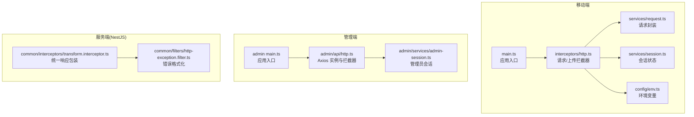
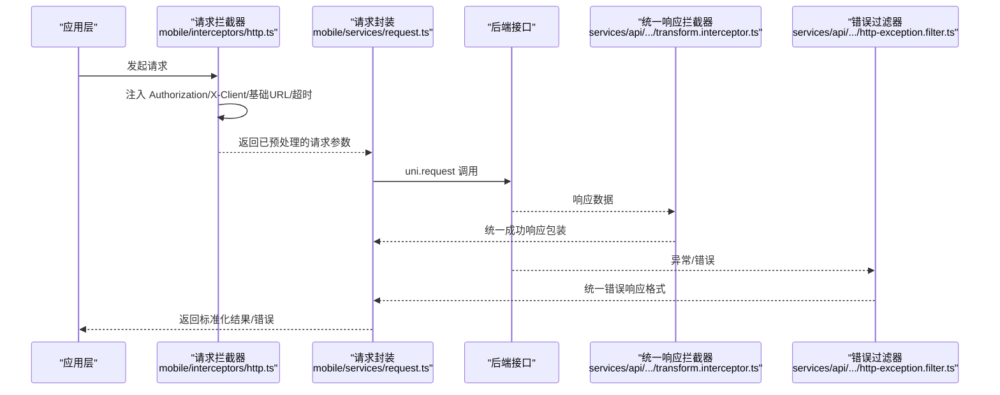
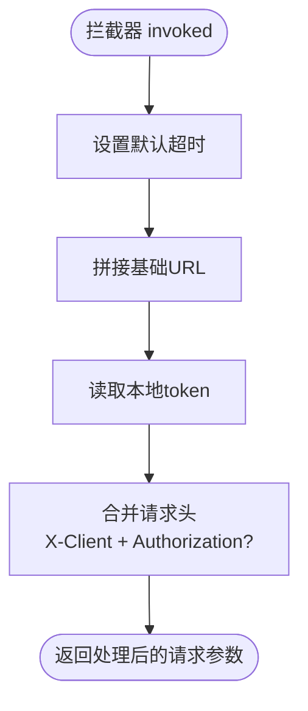
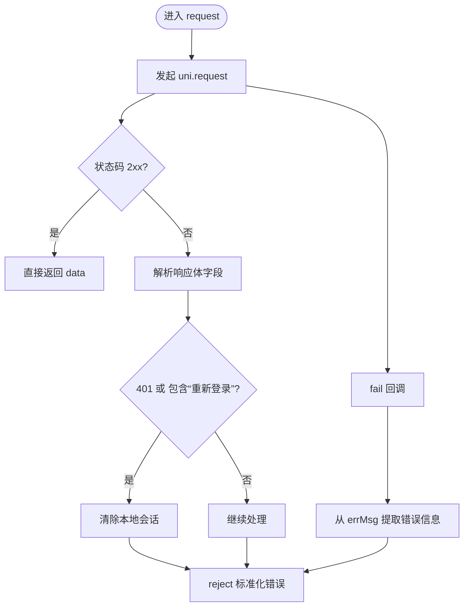
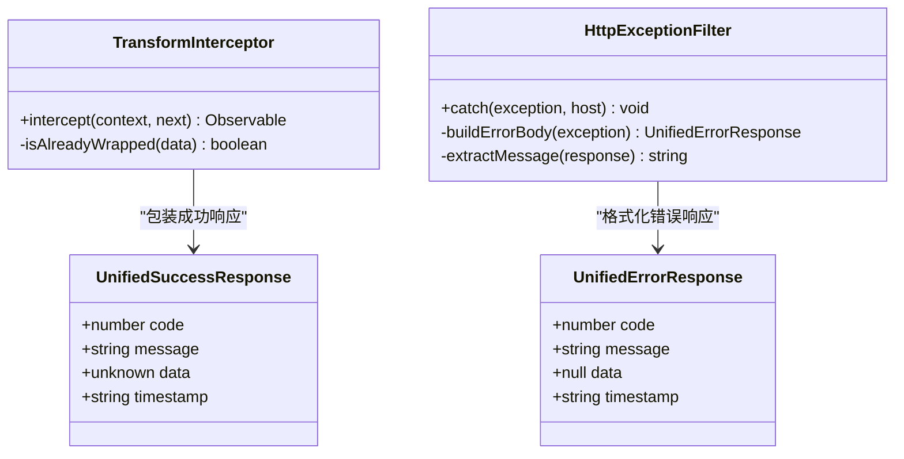
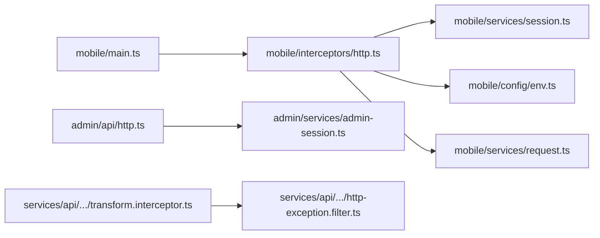

# HTTP 拦截器

<cite>
**本文引用的文件**
- [apps/mobile/src/interceptors/http.ts](file://apps/mobile/src/interceptors/http.ts)
- [apps/mobile/src/services/session.ts](file://apps/mobile/src/services/session.ts)
- [apps/mobile/src/config/env.ts](file://apps/mobile/src/config/env.ts)
- [apps/mobile/src/services/request.ts](file://apps/mobile/src/services/request.ts)
- [apps/mobile/src/services/errors.ts](file://apps/mobile/src/services/errors.ts)
- [apps/mobile/src/main.ts](file://apps/mobile/src/main.ts)
- [apps/admin/src/api/http.ts](file://apps/admin/src/api/http.ts)
- [apps/admin/src/services/admin-session.ts](file://apps/admin/src/services/admin-session.ts)
- [apps/admin/src/api/admin-auth.ts](file://apps/admin/src/api/admin-auth.ts)
- [services/api/src/common/interceptors/transform.interceptor.ts](file://services/api/src/common/interceptors/transform.interceptor.ts)
- [services/api/src/common/filters/http-exception.filter.ts](file://services/api/src/common/filters/http-exception.filter.ts)
</cite>

## 目录
1. [简介](#简介)
2. [项目结构](#项目结构)
3. [核心组件](#核心组件)
4. [架构总览](#架构总览)
5. [详细组件分析](#详细组件分析)
6. [依赖关系分析](#依赖关系分析)
7. [性能考量](#性能考量)
8. [故障排查指南](#故障排查指南)
9. [结论](#结论)
10. [附录](#附录)

## 简介
本文件系统性阐述本仓库中的 HTTP 拦截器实现与相关机制，覆盖移动端（小程序/H5）与服务端（NestJS）两套方案：
- 移动端：基于 uni-app 的请求拦截器，负责注入认证 token、设置基础 URL 与请求头、统一超时配置，并对上传接口进行差异化处理。
- 服务端：基于 NestJS 的拦截器与异常过滤器，负责统一成功响应包装与错误响应格式化。

文档同时解释拦截器链的执行顺序与优先级管理、与全局状态管理（会话存储）的集成方式，并给出请求重试、超时处理与网络状态检测的实践建议与参考路径。

## 项目结构
本仓库包含三类与 HTTP 拦截器直接相关的模块：
- 移动端拦截器与请求封装：位于 apps/mobile 下，包含拦截器安装、环境变量解析、会话状态读取与请求封装。
- 管理端 Axios 配置与拦截器：位于 apps/admin 下，包含 Axios 实例创建与请求拦截器。
- 服务端拦截器与异常过滤器：位于 services/api 下，包含统一响应包装与错误格式化。

图表来源
- [apps/mobile/src/main.ts:1-15](file://apps/mobile/src/main.ts#L1-L15)
- [apps/mobile/src/interceptors/http.ts:1-49](file://apps/mobile/src/interceptors/http.ts#L1-L49)
- [apps/mobile/src/services/request.ts:1-120](file://apps/mobile/src/services/request.ts#L1-L120)
- [apps/mobile/src/services/session.ts:1-56](file://apps/mobile/src/services/session.ts#L1-L56)
- [apps/mobile/src/config/env.ts:1-41](file://apps/mobile/src/config/env.ts#L1-L41)
- [apps/admin/src/api/http.ts:1-21](file://apps/admin/src/api/http.ts#L1-L21)
- [apps/admin/src/services/admin-session.ts:1-30](file://apps/admin/src/services/admin-session.ts#L1-L30)
- [services/api/src/common/interceptors/transform.interceptor.ts:1-59](file://services/api/src/common/interceptors/transform.interceptor.ts#L1-L59)
- [services/api/src/common/filters/http-exception.filter.ts:1-92](file://services/api/src/common/filters/http-exception.filter.ts#L1-L92)

章节来源
- [apps/mobile/src/main.ts:1-15](file://apps/mobile/src/main.ts#L1-L15)
- [apps/mobile/src/interceptors/http.ts:1-49](file://apps/mobile/src/interceptors/http.ts#L1-L49)
- [apps/admin/src/api/http.ts:1-21](file://apps/admin/src/api/http.ts#L1-L21)
- [services/api/src/common/interceptors/transform.interceptor.ts:1-59](file://services/api/src/common/interceptors/transform.interceptor.ts#L1-L59)
- [services/api/src/common/filters/http-exception.filter.ts:1-92](file://services/api/src/common/filters/http-exception.filter.ts#L1-L92)

## 核心组件
- 移动端请求拦截器
  - 功能：统一注入 Authorization 头、设置 X-Client 标识、自动拼接基础 URL、按接口类型设置默认超时。
  - 关键点：区分 request 与 uploadFile，分别设置不同超时与基础地址；通过会话模块读取 token。
- 移动端请求封装与错误处理
  - 功能：统一封装 uni.request，处理 2xx 成功、非 2xx 错误体解析、网络错误、鉴权过期清理等。
  - 关键点：从响应体或错误对象提取 message，识别 401 或“重新登录”提示触发登出清理。
- 管理端 Axios 请求拦截器
  - 功能：在 Axios 实例上注入 Authorization 头，统一设置客户端标识与超时。
- 服务端拦截器与异常过滤器
  - 功能：拦截器统一包装成功响应；异常过滤器统一格式化错误响应，记录 5xx 日志。

章节来源
- [apps/mobile/src/interceptors/http.ts:1-49](file://apps/mobile/src/interceptors/http.ts#L1-L49)
- [apps/mobile/src/services/request.ts:1-120](file://apps/mobile/src/services/request.ts#L1-L120)
- [apps/admin/src/api/http.ts:1-21](file://apps/admin/src/api/http.ts#L1-L21)
- [services/api/src/common/interceptors/transform.interceptor.ts:1-59](file://services/api/src/common/interceptors/transform.interceptor.ts#L1-L59)
- [services/api/src/common/filters/http-exception.filter.ts:1-92](file://services/api/src/common/filters/http-exception.filter.ts#L1-L92)

## 架构总览
下图展示了移动端与服务端的拦截器与请求处理链路：

图表来源
- [apps/mobile/src/interceptors/http.ts:1-49](file://apps/mobile/src/interceptors/http.ts#L1-L49)
- [apps/mobile/src/services/request.ts:1-120](file://apps/mobile/src/services/request.ts#L1-L120)
- [services/api/src/common/interceptors/transform.interceptor.ts:1-59](file://services/api/src/common/interceptors/transform.interceptor.ts#L1-L59)
- [services/api/src/common/filters/http-exception.filter.ts:1-92](file://services/api/src/common/filters/http-exception.filter.ts#L1-L92)

## 详细组件分析

### 移动端请求拦截器（installHttpInterceptors）
- 执行时机：应用启动时由入口调用安装一次，避免重复注册。
- 请求预处理逻辑：
  - 默认超时：request 默认 12000ms，uploadFile 默认 20000ms。
  - 基础 URL：自动拼接 appEnv 中的 apiBaseUrl 或 fileServiceBaseUrl。
  - 请求头：统一添加 X-Client；若存在 token，则注入 Authorization: Bearer {token}。
  - 合并策略：保留用户传入的 header 并与默认头合并。
- 与全局状态管理集成：
  - 通过会话模块读取本地存储的 token，实现无处不在的认证注入。
- 与请求封装协作：
  - 拦截器只做预处理，不改变调用方式；请求封装负责最终发送与错误处理。

图表来源
- [apps/mobile/src/interceptors/http.ts:18-48](file://apps/mobile/src/interceptors/http.ts#L18-L48)
- [apps/mobile/src/services/session.ts:15-25](file://apps/mobile/src/services/session.ts#L15-L25)
- [apps/mobile/src/config/env.ts:35-40](file://apps/mobile/src/config/env.ts#L35-L40)

章节来源
- [apps/mobile/src/interceptors/http.ts:1-49](file://apps/mobile/src/interceptors/http.ts#L1-L49)
- [apps/mobile/src/services/session.ts:1-56](file://apps/mobile/src/services/session.ts#L1-L56)
- [apps/mobile/src/config/env.ts:1-41](file://apps/mobile/src/config/env.ts#L1-L41)
- [apps/mobile/src/main.ts:1-15](file://apps/mobile/src/main.ts#L1-L15)

### 移动端请求封装与错误处理（request）
- 成功路径：当响应状态码在 2xx 区间时，直接返回后端数据。
- 错误路径：
  - 解析响应体：从 data 中提取 message/error/code/statusCode 等字段，支持数组 message 取首个字符串。
  - 鉴权过期判定：当状态码为 401 或 message 包含“重新登录”字样时，清除本地会话。
  - 网络错误：fail 回调中从 errMsg 提取错误信息，兜底为“网络请求失败，请稍后重试”。
- 与拦截器的关系：拦截器负责预处理，封装负责收尾与错误归一化。

图表来源
- [apps/mobile/src/services/request.ts:13-120](file://apps/mobile/src/services/request.ts#L13-L120)
- [apps/mobile/src/services/errors.ts:1-59](file://apps/mobile/src/services/errors.ts#L1-L59)

章节来源
- [apps/mobile/src/services/request.ts:1-120](file://apps/mobile/src/services/request.ts#L1-L120)
- [apps/mobile/src/services/errors.ts:1-59](file://apps/mobile/src/services/errors.ts#L1-L59)

### 管理端 Axios 请求拦截器（admin）
- Axios 实例：统一设置 baseURL、timeout、X-Client 头。
- 请求拦截：在请求发出前读取管理员 token 并注入 Authorization 头。
- 与移动端差异：移动端使用 uni.addInterceptor，管理端使用 axios.interceptors.request。

章节来源
- [apps/admin/src/api/http.ts:1-21](file://apps/admin/src/api/http.ts#L1-L21)
- [apps/admin/src/services/admin-session.ts:1-30](file://apps/admin/src/services/admin-session.ts#L1-L30)

### 服务端拦截器与异常过滤器（NestJS）
- 统一响应包装（TransformInterceptor）：
  - 对非手动响应（未使用 @Res 手动发送）的数据进行包装，确保统一的 code/message/data/timestamp 结构。
  - 自动识别已包装数据，避免重复包装。
- 错误响应格式化（HttpExceptionFilter）：
  - 将 HttpException 映射为统一错误体；非 HttpException 统一为 500。
  - 支持从响应体中提取 message（字符串或数组取首个），并记录 5xx 错误日志。

图表来源
- [services/api/src/common/interceptors/transform.interceptor.ts:1-59](file://services/api/src/common/interceptors/transform.interceptor.ts#L1-L59)
- [services/api/src/common/filters/http-exception.filter.ts:1-92](file://services/api/src/common/filters/http-exception.filter.ts#L1-L92)

章节来源
- [services/api/src/common/interceptors/transform.interceptor.ts:1-59](file://services/api/src/common/interceptors/transform.interceptor.ts#L1-L59)
- [services/api/src/common/filters/http-exception.filter.ts:1-92](file://services/api/src/common/filters/http-exception.filter.ts#L1-L92)

## 依赖关系分析
- 移动端
  - 入口 main.ts 调用 installHttpInterceptors 完成拦截器安装。
  - 拦截器依赖会话模块读取 token，依赖环境模块解析基础 URL。
  - 请求封装依赖拦截器预处理结果，负责最终错误处理与消息提取。
- 管理端
  - Axios 实例在 api/http.ts 创建，拦截器在同文件注册。
  - 管理员会话模块提供 token 存取。
- 服务端
  - 拦截器与异常过滤器通常在模块中注册，配合全局管道/过滤器使用。

图表来源
- [apps/mobile/src/main.ts:1-15](file://apps/mobile/src/main.ts#L1-L15)
- [apps/mobile/src/interceptors/http.ts:1-49](file://apps/mobile/src/interceptors/http.ts#L1-L49)
- [apps/mobile/src/services/session.ts:1-56](file://apps/mobile/src/services/session.ts#L1-L56)
- [apps/mobile/src/config/env.ts:1-41](file://apps/mobile/src/config/env.ts#L1-L41)
- [apps/mobile/src/services/request.ts:1-120](file://apps/mobile/src/services/request.ts#L1-L120)
- [apps/admin/src/api/http.ts:1-21](file://apps/admin/src/api/http.ts#L1-L21)
- [apps/admin/src/services/admin-session.ts:1-30](file://apps/admin/src/services/admin-session.ts#L1-L30)
- [services/api/src/common/interceptors/transform.interceptor.ts:1-59](file://services/api/src/common/interceptors/transform.interceptor.ts#L1-L59)
- [services/api/src/common/filters/http-exception.filter.ts:1-92](file://services/api/src/common/filters/http-exception.filter.ts#L1-L92)

章节来源
- [apps/mobile/src/main.ts:1-15](file://apps/mobile/src/main.ts#L1-L15)
- [apps/admin/src/api/http.ts:1-21](file://apps/admin/src/api/http.ts#L1-L21)
- [services/api/src/common/interceptors/transform.interceptor.ts:1-59](file://services/api/src/common/interceptors/transform.interceptor.ts#L1-L59)

## 性能考量
- 超时设置
  - 移动端：普通请求 12000ms，上传 20000ms；可根据接口体量调整。
  - 管理端：Axios 默认 12000ms；可按需覆盖。
- 重试策略
  - 当前拦截器未内置重试；可在请求封装层增加指数退避重试（例如对 5xx 或网络错误）。
  - 参考路径：[apps/mobile/src/services/request.ts:13-120](file://apps/mobile/src/services/request.ts#L13-L120)
- 连接复用与并发控制
  - 建议结合业务场景限制并发请求数量，避免资源争用。
- 缓存与去重
  - 对 GET 请求可引入缓存策略，减少重复请求。

## 故障排查指南
- 常见问题与定位
  - 401 未授权：检查拦截器是否正确注入 Authorization；确认会话是否过期。
    - 参考路径：[apps/mobile/src/interceptors/http.ts:23-34](file://apps/mobile/src/interceptors/http.ts#L23-L34)
    - 参考路径：[apps/mobile/src/services/request.ts:43-58](file://apps/mobile/src/services/request.ts#L43-L58)
  - URL 拼接错误：确认 appEnv 中的基础 URL 是否正确。
    - 参考路径：[apps/mobile/src/config/env.ts:35-40](file://apps/mobile/src/config/env.ts#L35-L40)
  - 上传超时：上传接口默认超时更长，如仍失败，适当提高阈值。
    - 参考路径：[apps/mobile/src/interceptors/http.ts:36-45](file://apps/mobile/src/interceptors/http.ts#L36-L45)
  - 错误消息不一致：服务端统一错误体由 HttpExceptionFilter 负责；前端错误封装由 request 负责。
    - 参考路径：[services/api/src/common/filters/http-exception.filter.ts:22-40](file://services/api/src/common/filters/http-exception.filter.ts#L22-L40)
    - 参考路径：[apps/mobile/src/services/request.ts:29-68](file://apps/mobile/src/services/request.ts#L29-L68)
- 会话清理
  - 当识别到鉴权过期时，前端会清除本地会话；需引导用户重新登录。
    - 参考路径：[apps/mobile/src/services/request.ts:47-49](file://apps/mobile/src/services/request.ts#L47-L49)

章节来源
- [apps/mobile/src/interceptors/http.ts:1-49](file://apps/mobile/src/interceptors/http.ts#L1-L49)
- [apps/mobile/src/services/request.ts:1-120](file://apps/mobile/src/services/request.ts#L1-L120)
- [apps/mobile/src/config/env.ts:1-41](file://apps/mobile/src/config/env.ts#L1-L41)
- [services/api/src/common/filters/http-exception.filter.ts:1-92](file://services/api/src/common/filters/http-exception.filter.ts#L1-L92)

## 结论
- 移动端通过拦截器实现了认证 token 注入、请求头与基础 URL 统一、超时策略与上传差异化处理，配合请求封装完成错误归一化与会话清理。
- 服务端通过拦截器与异常过滤器实现了统一的成功/错误响应格式，提升前后端交互一致性。
- 建议在现有基础上扩展重试与网络状态检测能力，并持续优化超时与并发策略以提升稳定性与用户体验。

## 附录
- 实际使用示例（移动端 API 层）
  - 登录、获取用户信息、发送手机验证码、绑定手机号、更新资料等接口均通过统一的请求封装调用。
  - 参考路径：
    - [apps/mobile/src/api/auth.ts:1-56](file://apps/mobile/src/api/auth.ts#L1-L56)
    - [apps/admin/src/api/admin-auth.ts:1-63](file://apps/admin/src/api/admin-auth.ts#L1-L63)