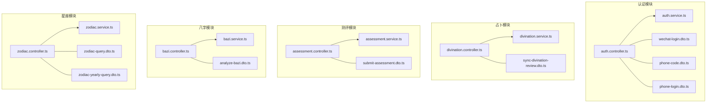
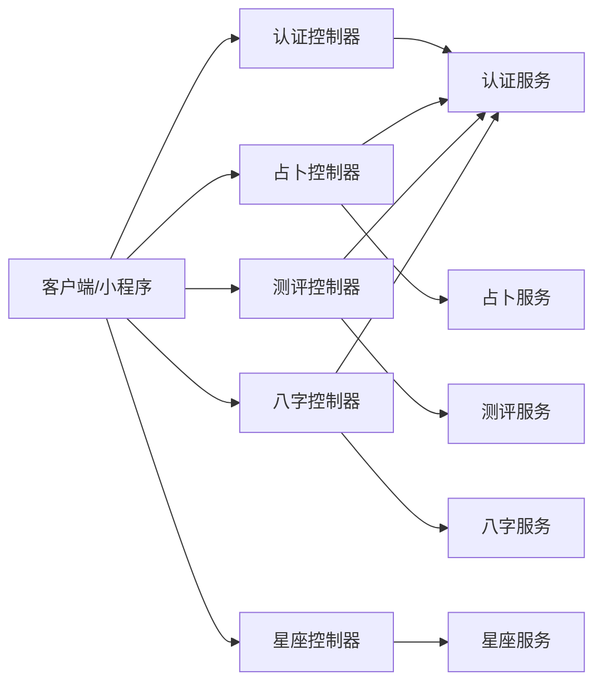
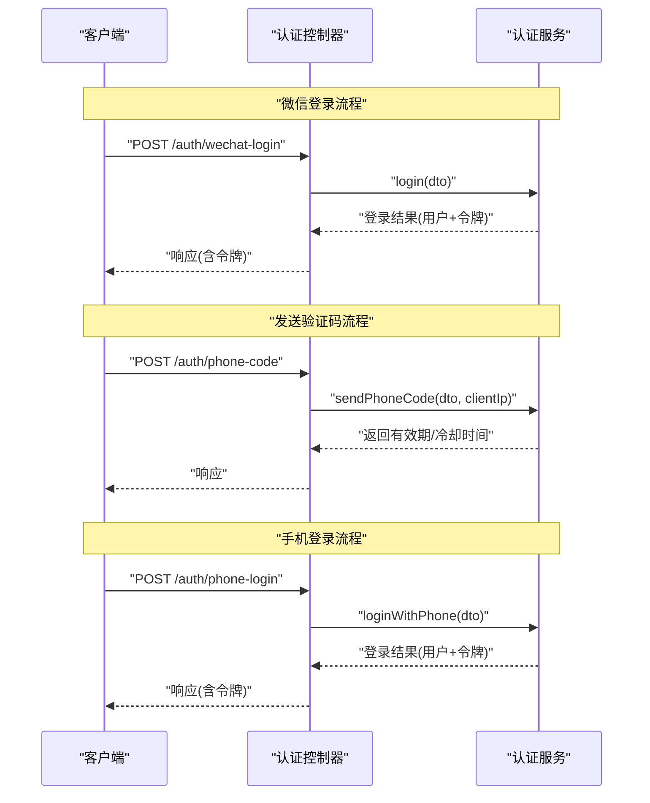
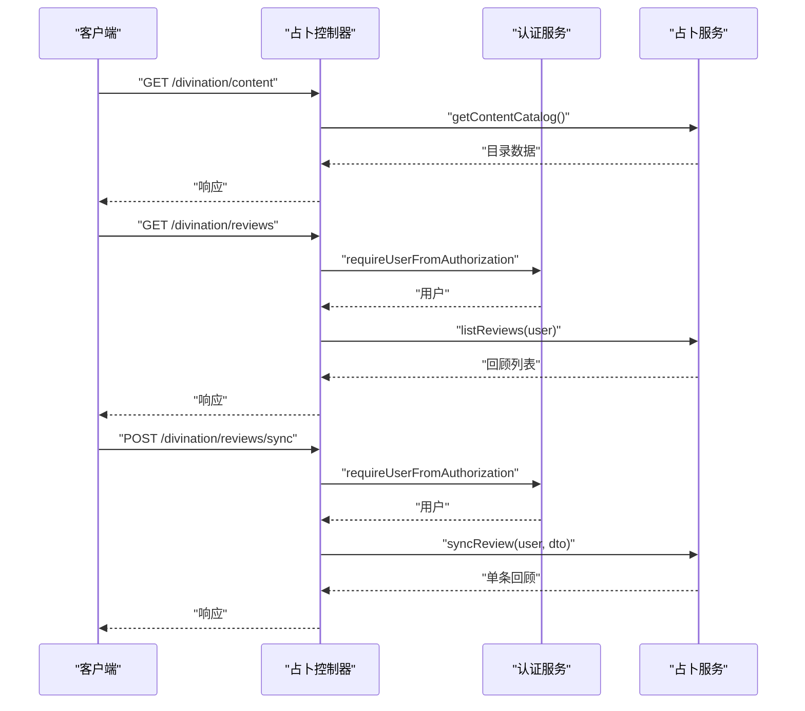
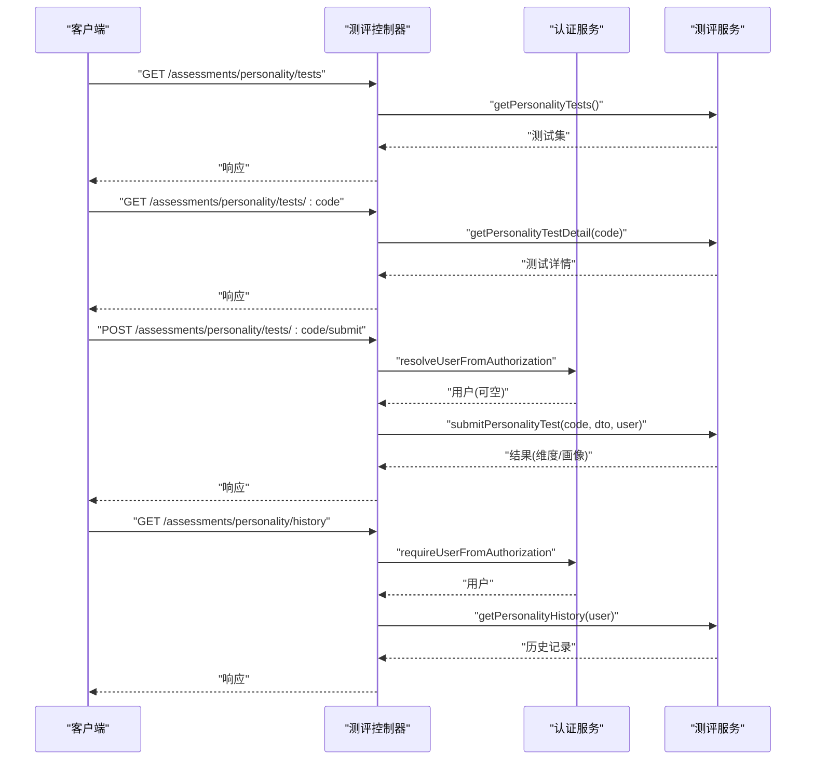
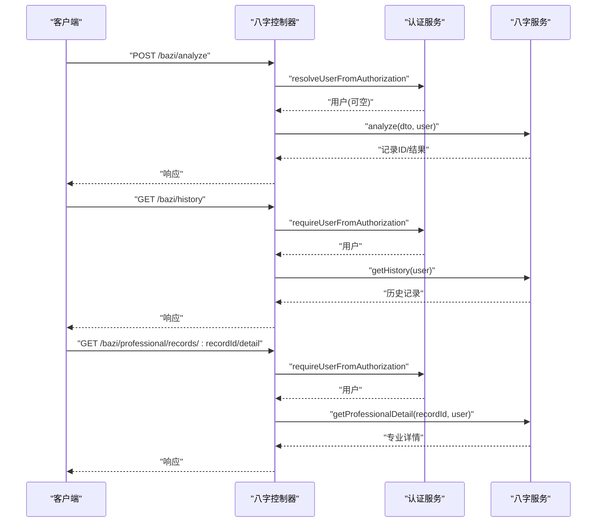
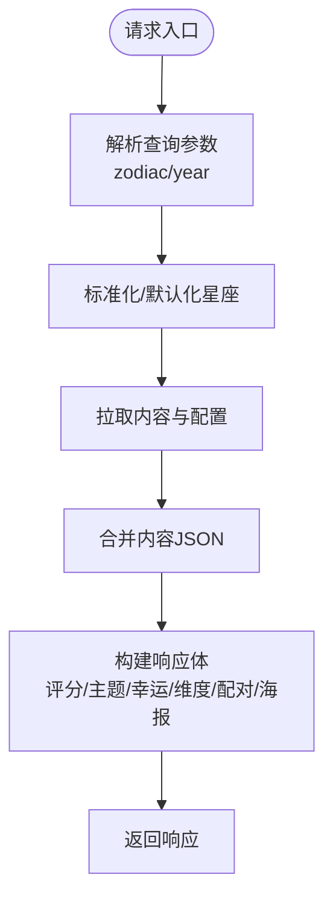
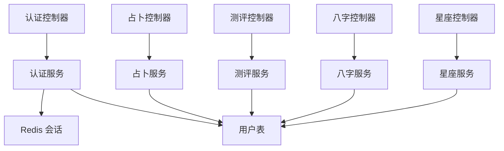

# 功能特定 API

<cite>
**本文引用的文件**
- [services/api/src/auth/auth.controller.ts](file://services/api/src/auth/auth.controller.ts)
- [services/api/src/auth/auth.service.ts](file://services/api/src/auth/auth.service.ts)
- [services/api/src/auth/dto/wechat-login.dto.ts](file://services/api/src/auth/dto/wechat-login.dto.ts)
- [services/api/src/auth/dto/phone-code.dto.ts](file://services/api/src/auth/dto/phone-code.dto.ts)
- [services/api/src/auth/dto/phone-login.dto.ts](file://services/api/src/auth/dto/phone-login.dto.ts)
- [services/api/src/divination/divination.controller.ts](file://services/api/src/divination/divination.controller.ts)
- [services/api/src/divination/divination.service.ts](file://services/api/src/divination/divination.service.ts)
- [services/api/src/divination/dto/sync-divination-review.dto.ts](file://services/api/src/divination/dto/sync-divination-review.dto.ts)
- [services/api/src/assessment/assessment.controller.ts](file://services/api/src/assessment/assessment.controller.ts)
- [services/api/src/assessment/assessment.service.ts](file://services/api/src/assessment/assessment.service.ts)
- [services/api/src/assessment/dto/submit-assessment.dto.ts](file://services/api/src/assessment/dto/submit-assessment.dto.ts)
- [services/api/src/bazi/bazi.controller.ts](file://services/api/src/bazi/bazi.controller.ts)
- [services/api/src/bazi/bazi.service.ts](file://services/api/src/bazi/bazi.service.ts)
- [services/api/src/bazi/dto/analyze-bazi.dto.ts](file://services/api/src/bazi/dto/analyze-bazi.dto.ts)
- [services/api/src/zodiac/zodiac.controller.ts](file://services/api/src/zodiac/zodiac.controller.ts)
- [services/api/src/zodiac/zodiac.service.ts](file://services/api/src/zodiac/zodiac.service.ts)
- [services/api/src/zodiac/dto/zodiac-query.dto.ts](file://services/api/src/zodiac/dto/zodiac-query.dto.ts)
- [services/api/src/zodiac/dto/zodiac-yearly-query.dto.ts](file://services/api/src/zodiac/dto/zodiac-yearly-query.dto.ts)
</cite>

## 目录
1. [简介](#简介)
2. [项目结构](#项目结构)
3. [核心组件](#核心组件)
4. [架构总览](#架构总览)
5. [详细组件分析](#详细组件分析)
6. [依赖关系分析](#依赖关系分析)
7. [性能考量](#性能考量)
8. [故障排查指南](#故障排查指南)
9. [结论](#结论)
10. [附录](#附录)

## 简介
本文件聚焦于系统内“功能特定 API”的实现与使用，覆盖以下业务模块：
- 认证 API：支持微信小程序授权登录、短信验证码发送与手机快捷登录
- 占卜 API：提供占卜内容目录、占卜回顾列表与回顾同步能力
- 测评 API：提供人格测评测试集、详情、提交答案与历史记录
- 八字 API：提供八字分析（含轻量与专业模式）、历史记录、专业详情查询与出生地检索
- 星座 API：提供今日/每日/每周/每月/每年运势、配对、知识库等查询

文档将逐模块说明请求参数、响应结构、错误处理与最佳实践，并给出调用序列图与流程图，帮助开发者正确集成与扩展。

## 项目结构
后端采用 NestJS 架构，按业务域划分模块，控制器负责路由与鉴权解析，服务层承载核心业务逻辑，DTO 定义输入校验规则，数据库实体通过 TypeORM 管理。

图表来源
- [services/api/src/auth/auth.controller.ts:1-36](file://services/api/src/auth/auth.controller.ts#L1-L36)
- [services/api/src/auth/auth.service.ts:1-200](file://services/api/src/auth/auth.service.ts#L1-L200)
- [services/api/src/auth/dto/wechat-login.dto.ts:1-22](file://services/api/src/auth/dto/wechat-login.dto.ts#L1-L22)
- [services/api/src/auth/dto/phone-code.dto.ts:1-20](file://services/api/src/auth/dto/phone-code.dto.ts#L1-L20)
- [services/api/src/auth/dto/phone-login.dto.ts:1-24](file://services/api/src/auth/dto/phone-login.dto.ts#L1-L24)
- [services/api/src/divination/divination.controller.ts:1-33](file://services/api/src/divination/divination.controller.ts#L1-L33)
- [services/api/src/divination/divination.service.ts:1-200](file://services/api/src/divination/divination.service.ts#L1-L200)
- [services/api/src/divination/dto/sync-divination-review.dto.ts:1-74](file://services/api/src/divination/dto/sync-divination-review.dto.ts#L1-L74)
- [services/api/src/assessment/assessment.controller.ts:1-39](file://services/api/src/assessment/assessment.controller.ts#L1-L39)
- [services/api/src/assessment/assessment.service.ts:1-200](file://services/api/src/assessment/assessment.service.ts#L1-L200)
- [services/api/src/assessment/dto/submit-assessment.dto.ts:1-27](file://services/api/src/assessment/dto/submit-assessment.dto.ts#L1-L27)
- [services/api/src/bazi/bazi.controller.ts:1-54](file://services/api/src/bazi/bazi.controller.ts#L1-L54)
- [services/api/src/bazi/bazi.service.ts:1-200](file://services/api/src/bazi/bazi.service.ts#L1-L200)
- [services/api/src/bazi/dto/analyze-bazi.dto.ts:1-54](file://services/api/src/bazi/dto/analyze-bazi.dto.ts#L1-L54)
- [services/api/src/zodiac/zodiac.controller.ts:1-47](file://services/api/src/zodiac/zodiac.controller.ts#L1-L47)
- [services/api/src/zodiac/zodiac.service.ts:1-200](file://services/api/src/zodiac/zodiac.service.ts#L1-L200)
- [services/api/src/zodiac/dto/zodiac-query.dto.ts:1-10](file://services/api/src/zodiac/dto/zodiac-query.dto.ts#L1-L10)
- [services/api/src/zodiac/dto/zodiac-yearly-query.dto.ts:1-11](file://services/api/src/zodiac/dto/zodiac-yearly-query.dto.ts#L1-L11)

章节来源
- [services/api/src/auth/auth.controller.ts:1-36](file://services/api/src/auth/auth.controller.ts#L1-L36)
- [services/api/src/divination/divination.controller.ts:1-33](file://services/api/src/divination/divination.controller.ts#L1-L33)
- [services/api/src/assessment/assessment.controller.ts:1-39](file://services/api/src/assessment/assessment.controller.ts#L1-L39)
- [services/api/src/bazi/bazi.controller.ts:1-54](file://services/api/src/bazi/bazi.controller.ts#L1-L54)
- [services/api/src/zodiac/zodiac.controller.ts:1-47](file://services/api/src/zodiac/zodiac.controller.ts#L1-L47)

## 核心组件
- 控制器层：定义路由、HTTP 方法与参数解析；部分控制器在鉴权头存在时解析用户身份
- 服务层：封装业务逻辑、数据持久化与外部依赖；统一返回包装结构
- DTO 层：基于 class-validator/class-transformer 的输入校验与类型约束
- 鉴权服务：解析 Authorization 头、从 Redis 读取会话、解析用户并进行必要校验

章节来源
- [services/api/src/auth/auth.controller.ts:1-36](file://services/api/src/auth/auth.controller.ts#L1-L36)
- [services/api/src/auth/auth.service.ts:171-200](file://services/api/src/auth/auth.service.ts#L171-L200)
- [services/api/src/divination/divination.controller.ts:1-33](file://services/api/src/divination/divination.controller.ts#L1-L33)
- [services/api/src/assessment/assessment.controller.ts:1-39](file://services/api/src/assessment/assessment.controller.ts#L1-L39)
- [services/api/src/bazi/bazi.controller.ts:1-54](file://services/api/src/bazi/bazi.controller.ts#L1-L54)
- [services/api/src/zodiac/zodiac.controller.ts:1-47](file://services/api/src/zodiac/zodiac.controller.ts#L1-L47)

## 架构总览
下图展示各模块间的关系与调用方向，以及鉴权服务在需要用户态的接口中的作用。

图表来源
- [services/api/src/auth/auth.controller.ts:1-36](file://services/api/src/auth/auth.controller.ts#L1-L36)
- [services/api/src/divination/divination.controller.ts:1-33](file://services/api/src/divination/divination.controller.ts#L1-L33)
- [services/api/src/assessment/assessment.controller.ts:1-39](file://services/api/src/assessment/assessment.controller.ts#L1-L39)
- [services/api/src/bazi/bazi.controller.ts:1-54](file://services/api/src/bazi/bazi.controller.ts#L1-L54)
- [services/api/src/zodiac/zodiac.controller.ts:1-47](file://services/api/src/zodiac/zodiac.controller.ts#L1-L47)

## 详细组件分析

### 认证 API
- 路由与方法
  - POST /auth/wechat-login：微信小程序授权登录
  - POST /auth/phone-code：发送短信验证码（支持登录/绑定场景）
  - POST /auth/phone-login：手机验证码登录
- 请求参数（DTO）
  - 微信登录：code（最小长度、平台限定）、可选昵称与头像
  - 发送验证码：手机号、可选场景（登录/绑定）
  - 手机登录：手机号、验证码、可选昵称与头像
- 响应结构
  - 统一 envelope 包裹，包含业务数据与时间戳
  - 登录成功返回用户态令牌与用户信息
- 错误处理
  - 参数校验失败抛出验证异常
  - 登录态失效/用户不存在抛出未授权异常
  - 绑定手机号冲突抛出冲突异常
- 最佳实践
  - 前端应在调用发送验证码前对手机号格式与场景进行本地校验
  - 登录成功后妥善保存令牌并在后续请求头携带 Authorization
  - 服务端解析客户端 IP 时优先取 x-forwarded-for，兜底到 ip/socket 地址

图表来源
- [services/api/src/auth/auth.controller.ts:1-36](file://services/api/src/auth/auth.controller.ts#L1-L36)
- [services/api/src/auth/auth.service.ts:50-131](file://services/api/src/auth/auth.service.ts#L50-L131)
- [services/api/src/auth/dto/wechat-login.dto.ts:1-22](file://services/api/src/auth/dto/wechat-login.dto.ts#L1-L22)
- [services/api/src/auth/dto/phone-code.dto.ts:1-20](file://services/api/src/auth/dto/phone-code.dto.ts#L1-L20)
- [services/api/src/auth/dto/phone-login.dto.ts:1-24](file://services/api/src/auth/dto/phone-login.dto.ts#L1-L24)

章节来源
- [services/api/src/auth/auth.controller.ts:1-36](file://services/api/src/auth/auth.controller.ts#L1-L36)
- [services/api/src/auth/auth.service.ts:50-131](file://services/api/src/auth/auth.service.ts#L50-L131)
- [services/api/src/auth/dto/wechat-login.dto.ts:1-22](file://services/api/src/auth/dto/wechat-login.dto.ts#L1-L22)
- [services/api/src/auth/dto/phone-code.dto.ts:1-20](file://services/api/src/auth/dto/phone-code.dto.ts#L1-L20)
- [services/api/src/auth/dto/phone-login.dto.ts:1-24](file://services/api/src/auth/dto/phone-login.dto.ts#L1-L24)

### 占卜 API
- 路由与方法
  - GET /divination/content：获取占卜内容目录
  - GET /divination/reviews：获取当前用户占卜回顾列表
  - POST /divination/reviews/sync：同步占卜回顾（收藏、结果状态、备注、维度情绪等）
- 请求参数
  - 内容目录：无需参数
  - 回顾列表：需 Authorization 头
  - 同步回顾：需 Authorization 头 + SyncDivinationReviewDto
- 响应结构
  - 统一 envelope 包裹，catalog 返回目录聚合结构；reviews 返回最近若干条
- 错误处理
  - 缺少 resultId 抛出参数错误
  - 未提供有效 Authorization 抛出未授权
- 最佳实践
  - 同步回顾时建议先校验 resultId 非空
  - 支持增量更新字段，避免全量覆盖

图表来源
- [services/api/src/divination/divination.controller.ts:1-33](file://services/api/src/divination/divination.controller.ts#L1-L33)
- [services/api/src/divination/divination.service.ts:25-141](file://services/api/src/divination/divination.service.ts#L25-L141)
- [services/api/src/divination/dto/sync-divination-review.dto.ts:1-74](file://services/api/src/divination/dto/sync-divination-review.dto.ts#L1-L74)

章节来源
- [services/api/src/divination/divination.controller.ts:1-33](file://services/api/src/divination/divination.controller.ts#L1-L33)
- [services/api/src/divination/divination.service.ts:25-141](file://services/api/src/divination/divination.service.ts#L25-L141)
- [services/api/src/divination/dto/sync-divination-review.dto.ts:1-74](file://services/api/src/divination/dto/sync-divination-review.dto.ts#L1-L74)

### 测评 API
- 路由与方法
  - GET /assessments/personality/tests：获取人格测评测试集
  - GET /assessments/personality/tests/:code：获取某测试详情
  - POST /assessments/personality/tests/:code/submit：提交答案
  - GET /assessments/personality/history：获取历史记录
- 请求参数
  - 提交答案：SubmitAssessmentDto，包含非空答案数组，每项含问题 ID 与选项键
  - 其余接口：Authorization 头可选（提交时解析当前用户，历史需强制要求用户）
- 响应结构
  - tests 返回测试元数据与题目集合
  - submit 返回评分维度与画像摘要
  - history 返回最近若干次测评记录
- 错误处理
  - 未找到测试抛出资源不存在
  - 提交答案为空数组抛出参数错误
- 最佳实践
  - 提交前确保答案数组非空且每项包含合法的 questionId 与 optionKey
  - 历史查询建议分页或限制数量

图表来源
- [services/api/src/assessment/assessment.controller.ts:1-39](file://services/api/src/assessment/assessment.controller.ts#L1-L39)
- [services/api/src/assessment/assessment.service.ts:1-200](file://services/api/src/assessment/assessment.service.ts#L1-L200)
- [services/api/src/assessment/dto/submit-assessment.dto.ts:1-27](file://services/api/src/assessment/dto/submit-assessment.dto.ts#L1-L27)

章节来源
- [services/api/src/assessment/assessment.controller.ts:1-39](file://services/api/src/assessment/assessment.controller.ts#L1-L39)
- [services/api/src/assessment/assessment.service.ts:1-200](file://services/api/src/assessment/assessment.service.ts#L1-L200)
- [services/api/src/assessment/dto/submit-assessment.dto.ts:1-27](file://services/api/src/assessment/dto/submit-assessment.dto.ts#L1-L27)

### 八字 API
- 路由与方法
  - POST /bazi/analyze：八字分析（轻量/专业模式）
  - POST /bazi/professional/analyze：专业模式八字分析
  - GET /bazi/history：当前用户历史记录
  - GET /bazi/professional/records/:recordId/detail：专业详情
  - GET /bazi/birth-places：出生地检索（关键词+数量）
- 请求参数
  - 分析：AnalyzeBaziDto，包含生日日期、出生时间、性别、模式、出生地与经纬度/时区
  - 专业详情：recordId 路径参数
  - 出生地：keyword、limit 查询参数
- 响应结构
  - analyze 返回记录 ID、是否保存、结果对象
  - getHistory 返回最近若干条记录摘要
  - getProfessionalDetail 返回专业版详细内容
- 错误处理
  - 专业详情不存在或无权限访问抛出资源不存在
  - 非专业记录查询专业详情抛出资源不存在
- 最佳实践
  - 专业模式建议在用户付费解锁后开放
  - 出生地检索建议前端做模糊匹配与分页

图表来源
- [services/api/src/bazi/bazi.controller.ts:1-54](file://services/api/src/bazi/bazi.controller.ts#L1-L54)
- [services/api/src/bazi/bazi.service.ts:45-200](file://services/api/src/bazi/bazi.service.ts#L45-L200)
- [services/api/src/bazi/dto/analyze-bazi.dto.ts:1-54](file://services/api/src/bazi/dto/analyze-bazi.dto.ts#L1-L54)

章节来源
- [services/api/src/bazi/bazi.controller.ts:1-54](file://services/api/src/bazi/bazi.controller.ts#L1-L54)
- [services/api/src/bazi/bazi.service.ts:45-200](file://services/api/src/bazi/bazi.service.ts#L45-L200)
- [services/api/src/bazi/dto/analyze-bazi.dto.ts:1-54](file://services/api/src/bazi/dto/analyze-bazi.dto.ts#L1-L54)

### 星座 API
- 路由与方法
  - GET /zodiac/today：今日运势
  - GET /zodiac/daily：每日运势
  - GET /zodiac/weekly：每周运势
  - GET /zodiac/monthly：月度运势
  - GET /zodiac/yearly：年度运势
  - GET /zodiac/compatibility：配对
  - GET /zodiac/knowledge：知识库
- 请求参数
  - 通用：zodiac 查询参数（枚举限定）
  - 年度：year 查询参数（年份范围限定）
- 响应结构
  - 今日/每日：综合分数、维度分数、主题词、幸运色/数/向、行动建议、配对提示、分享海报配置
  - 周/月/年：主题、概览、节奏/焦点等
  - 配对：最佳匹配与提示语
  - 知识：基础知识与建议
- 错误处理
  - 未提供有效 zodiac 或值不在枚举内将被规范化/默认化
- 最佳实践
  - 前端可缓存当日结果，结合服务端返回的评分与关键字生成分享海报

图表来源
- [services/api/src/zodiac/zodiac.controller.ts:1-47](file://services/api/src/zodiac/zodiac.controller.ts#L1-L47)
- [services/api/src/zodiac/zodiac.service.ts:57-179](file://services/api/src/zodiac/zodiac.service.ts#L57-L179)
- [services/api/src/zodiac/dto/zodiac-query.dto.ts:1-10](file://services/api/src/zodiac/dto/zodiac-query.dto.ts#L1-L10)
- [services/api/src/zodiac/dto/zodiac-yearly-query.dto.ts:1-11](file://services/api/src/zodiac/dto/zodiac-yearly-query.dto.ts#L1-L11)

章节来源
- [services/api/src/zodiac/zodiac.controller.ts:1-47](file://services/api/src/zodiac/zodiac.controller.ts#L1-L47)
- [services/api/src/zodiac/zodiac.service.ts:57-179](file://services/api/src/zodiac/zodiac.service.ts#L57-L179)
- [services/api/src/zodiac/dto/zodiac-query.dto.ts:1-10](file://services/api/src/zodiac/dto/zodiac-query.dto.ts#L1-L10)
- [services/api/src/zodiac/dto/zodiac-yearly-query.dto.ts:1-11](file://services/api/src/zodiac/dto/zodiac-yearly-query.dto.ts#L1-L11)

## 依赖关系分析
- 控制器依赖服务层与鉴权服务（当需要用户态时）
- 服务层依赖数据库仓库与常量/内容配置
- DTO 作为输入契约，贯穿控制器与服务层
- 鉴权服务依赖 Redis 存储会话与数据库查询用户

图表来源
- [services/api/src/auth/auth.controller.ts:1-36](file://services/api/src/auth/auth.controller.ts#L1-L36)
- [services/api/src/auth/auth.service.ts:171-200](file://services/api/src/auth/auth.service.ts#L171-L200)
- [services/api/src/divination/divination.controller.ts:1-33](file://services/api/src/divination/divination.controller.ts#L1-L33)
- [services/api/src/assessment/assessment.controller.ts:1-39](file://services/api/src/assessment/assessment.controller.ts#L1-L39)
- [services/api/src/bazi/bazi.controller.ts:1-54](file://services/api/src/bazi/bazi.controller.ts#L1-L54)
- [services/api/src/zodiac/zodiac.controller.ts:1-47](file://services/api/src/zodiac/zodiac.controller.ts#L1-L47)

章节来源
- [services/api/src/auth/auth.service.ts:171-200](file://services/api/src/auth/auth.service.ts#L171-L200)
- [services/api/src/divination/divination.service.ts:1-200](file://services/api/src/divination/divination.service.ts#L1-L200)
- [services/api/src/assessment/assessment.service.ts:1-200](file://services/api/src/assessment/assessment.service.ts#L1-L200)
- [services/api/src/bazi/bazi.service.ts:1-200](file://services/api/src/bazi/bazi.service.ts#L1-L200)
- [services/api/src/zodiac/zodiac.service.ts:1-200](file://services/api/src/zodiac/zodiac.service.ts#L1-L200)

## 性能考量
- 缓存策略
  - 使用 Redis 存储会话键，避免频繁查库
  - 对热点内容（如占卜/星座）可在网关或边缘层缓存当日结果
- 数据库优化
  - 适度索引：用户相关查询、占卜回顾按用户与更新时间排序
  - 批量读取：占卜目录聚合多个内容源时并发查询
- 传输与序列化
  - DTO 层严格约束字段长度与类型，减少无效负载
  - 响应统一 envelope，便于前端统一处理

## 故障排查指南
- 未授权/登录态失效
  - 现象：返回未授权错误
  - 排查：确认 Authorization 头格式与 Redis 中会话是否存在
  - 参考路径：[services/api/src/auth/auth.service.ts:171-200](file://services/api/src/auth/auth.service.ts#L171-L200)
- 绑定手机号冲突
  - 现象：冲突异常
  - 排查：检查手机号是否已被其他账户绑定
  - 参考路径：[services/api/src/auth/auth.service.ts:133-169](file://services/api/src/auth/auth.service.ts#L133-L169)
- 占卜同步缺少 resultId
  - 现象：参数错误
  - 排查：确保 resultId 非空且唯一
  - 参考路径：[services/api/src/divination/divination.service.ts:74-78](file://services/api/src/divination/divination.service.ts#L74-L78)
- 八字专业详情不存在
  - 现象：资源不存在
  - 排查：确认 recordId 属于当前用户且为专业模式生成
  - 参考路径：[services/api/src/bazi/bazi.service.ts:166-183](file://services/api/src/bazi/bazi.service.ts#L166-L183)

章节来源
- [services/api/src/auth/auth.service.ts:133-200](file://services/api/src/auth/auth.service.ts#L133-L200)
- [services/api/src/divination/divination.service.ts:74-141](file://services/api/src/divination/divination.service.ts#L74-L141)
- [services/api/src/bazi/bazi.service.ts:166-183](file://services/api/src/bazi/bazi.service.ts#L166-L183)

## 结论
本文档系统性梳理了认证、占卜、测评、八字与星座五大功能模块的 API 设计与实现要点，明确了参数约束、响应结构与错误处理策略，并提供了调用序列图与流程图以辅助集成。建议在生产环境中配合缓存、限流与监控，确保高可用与一致性。

## 附录
- 调用最佳实践清单
  - 参数校验：严格遵循 DTO 约束，前端先行校验
  - 数据转换：统一时间/数值/枚举的转换与默认化
  - 缓存策略：对当日/常量类内容进行缓存，设置合理过期
  - 错误处理：对未授权、冲突、参数缺失等场景进行明确处理
  - 日志与追踪：为关键流程添加上下文日志，便于定位问题