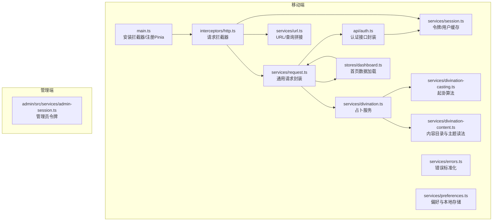
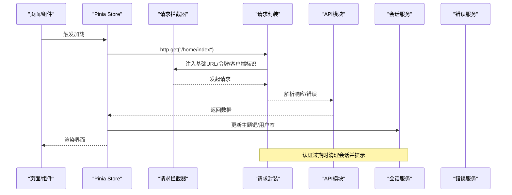
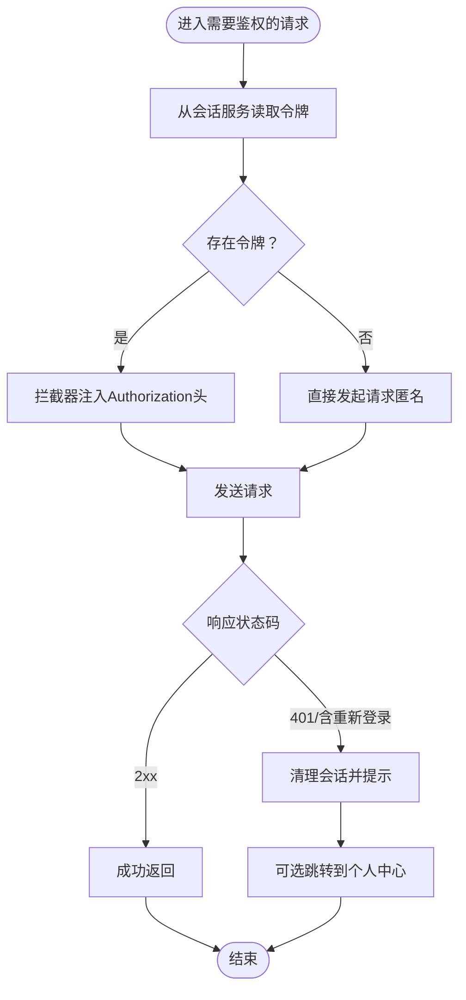
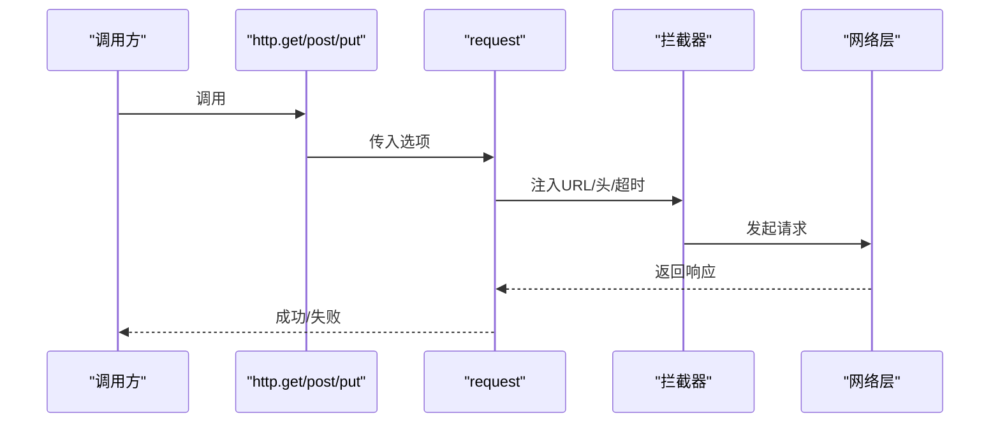
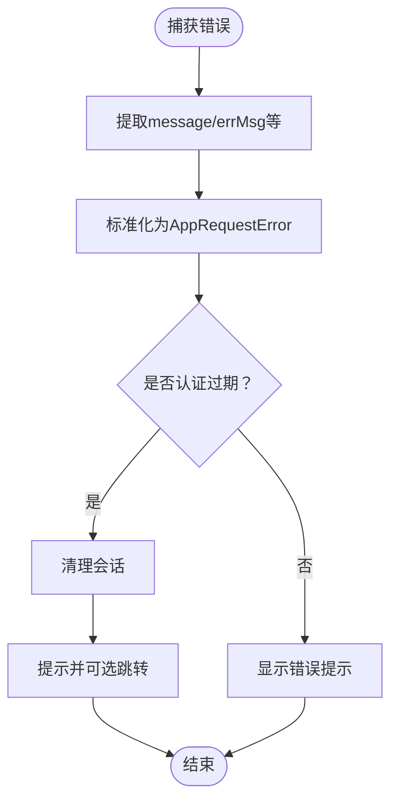
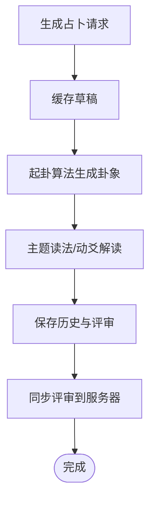
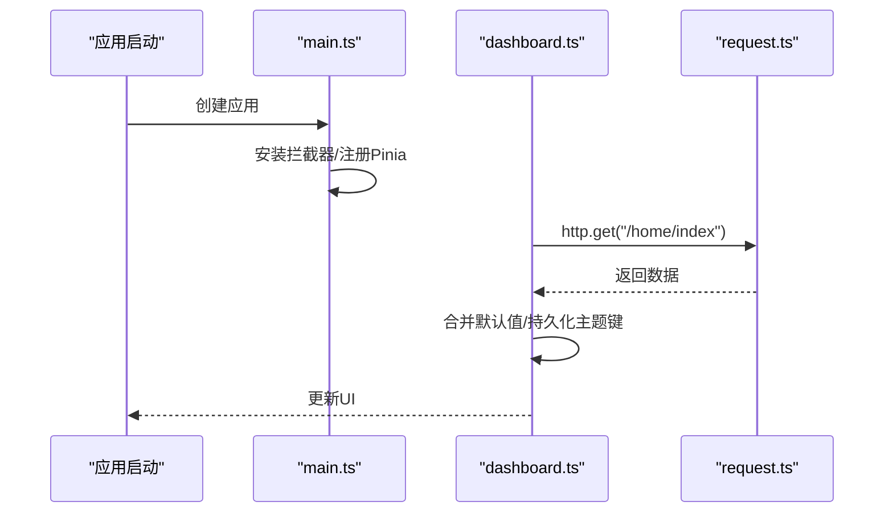
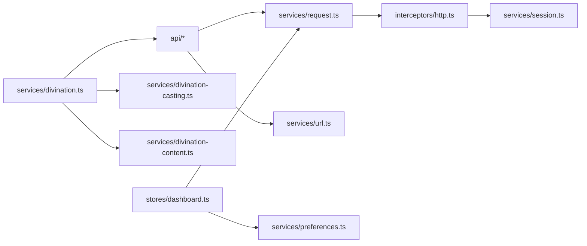

# 服务层设计

<cite>
**本文引用的文件**
- [apps/mobile/src/services/session.ts](file://apps/mobile/src/services/session.ts)
- [apps/mobile/src/interceptors/http.ts](file://apps/mobile/src/interceptors/http.ts)
- [apps/mobile/src/services/request.ts](file://apps/mobile/src/services/request.ts)
- [apps/mobile/src/api/auth.ts](file://apps/mobile/src/api/auth.ts)
- [apps/mobile/src/services/errors.ts](file://apps/mobile/src/services/errors.ts)
- [apps/mobile/src/services/preferences.ts](file://apps/mobile/src/services/preferences.ts)
- [apps/mobile/src/services/divination.ts](file://apps/mobile/src/services/divination.ts)
- [apps/mobile/src/services/divination-casting.ts](file://apps/mobile/src/services/divination-casting.ts)
- [apps/mobile/src/services/divination-content.ts](file://apps/mobile/src/services/divination-content.ts)
- [apps/mobile/src/services/url.ts](file://apps/mobile/src/services/url.ts)
- [apps/mobile/src/stores/dashboard.ts](file://apps/mobile/src/stores/dashboard.ts)
- [apps/mobile/src/main.ts](file://apps/mobile/src/main.ts)
- [apps/admin/src/services/admin-session.ts](file://apps/admin/src/services/admin-session.ts)
</cite>

## 目录
1. [引言](#引言)
2. [项目结构](#项目结构)
3. [核心组件](#核心组件)
4. [架构总览](#架构总览)
5. [详细组件分析](#详细组件分析)
6. [依赖分析](#依赖分析)
7. [性能考虑](#性能考虑)
8. [故障排查指南](#故障排查指南)
9. [结论](#结论)
10. [附录](#附录)

## 引言
本指南围绕移动端与管理端的服务层设计进行系统性阐述，聚焦以下目标：
- 抽象设计原则：业务逻辑封装、数据访问层分离、跨组件复用策略
- 请求服务实现模式：HTTP 客户端配置、请求拦截与错误处理、并发控制思路
- 会话服务设计：用户状态管理、认证状态维护、会话持久化
- 服务层与状态管理集成：服务注册、依赖注入、生命周期管理

## 项目结构
服务层位于移动端应用与管理端应用中，分别承担 HTTP 请求、会话与偏好存储、业务服务（如占卜）以及 Pinia Store 的数据加载与状态管理职责。

图表来源
- [apps/mobile/src/main.ts:1-15](file://apps/mobile/src/main.ts#L1-L15)
- [apps/mobile/src/interceptors/http.ts:1-49](file://apps/mobile/src/interceptors/http.ts#L1-L49)
- [apps/mobile/src/services/request.ts:1-120](file://apps/mobile/src/services/request.ts#L1-L120)
- [apps/mobile/src/services/session.ts:1-56](file://apps/mobile/src/services/session.ts#L1-L56)
- [apps/mobile/src/api/auth.ts:1-56](file://apps/mobile/src/api/auth.ts#L1-L56)
- [apps/mobile/src/services/errors.ts:1-82](file://apps/mobile/src/services/errors.ts#L1-L82)
- [apps/mobile/src/services/preferences.ts:1-73](file://apps/mobile/src/services/preferences.ts#L1-L73)
- [apps/mobile/src/services/divination.ts:1-991](file://apps/mobile/src/services/divination.ts#L1-L991)
- [apps/mobile/src/services/divination-casting.ts:1-528](file://apps/mobile/src/services/divination-casting.ts#L1-L528)
- [apps/mobile/src/services/divination-content.ts:1-531](file://apps/mobile/src/services/divination-content.ts#L1-L531)
- [apps/mobile/src/services/url.ts:1-60](file://apps/mobile/src/services/url.ts#L1-L60)
- [apps/mobile/src/stores/dashboard.ts:1-382](file://apps/mobile/src/stores/dashboard.ts#L1-L382)
- [apps/admin/src/services/admin-session.ts:1-30](file://apps/admin/src/services/admin-session.ts#L1-L30)

章节来源
- [apps/mobile/src/main.ts:1-15](file://apps/mobile/src/main.ts#L1-L15)
- [apps/mobile/src/interceptors/http.ts:18-48](file://apps/mobile/src/interceptors/http.ts#L18-L48)
- [apps/mobile/src/services/request.ts:13-120](file://apps/mobile/src/services/request.ts#L13-L120)
- [apps/mobile/src/services/session.ts:15-56](file://apps/mobile/src/services/session.ts#L15-L56)
- [apps/mobile/src/api/auth.ts:14-56](file://apps/mobile/src/api/auth.ts#L14-L56)
- [apps/mobile/src/services/errors.ts:11-82](file://apps/mobile/src/services/errors.ts#L11-L82)
- [apps/mobile/src/services/preferences.ts:23-73](file://apps/mobile/src/services/preferences.ts#L23-L73)
- [apps/mobile/src/services/divination.ts:35-205](file://apps/mobile/src/services/divination.ts#L35-L205)
- [apps/mobile/src/services/divination-casting.ts:229-376](file://apps/mobile/src/services/divination-casting.ts#L229-L376)
- [apps/mobile/src/services/divination-content.ts:179-310](file://apps/mobile/src/services/divination-content.ts#L179-L310)
- [apps/mobile/src/services/url.ts:11-60](file://apps/mobile/src/services/url.ts#L11-L60)
- [apps/mobile/src/stores/dashboard.ts:342-382](file://apps/mobile/src/stores/dashboard.ts#L342-L382)
- [apps/admin/src/services/admin-session.ts:1-30](file://apps/admin/src/services/admin-session.ts#L1-L30)

## 核心组件
- 会话与认证
  - 移动端：基于本地存储的令牌与用户信息缓存，拦截器自动注入 Authorization 头，统一处理 401 与“重新登录”类错误，触发会话清理。
  - 管理端：基于浏览器 localStorage 的管理员令牌存取。
- 请求与拦截
  - 统一封装 request 与 http 方法族，内置超时、错误消息提取与标准化，拦截器负责拼接基础 URL、注入客户端标识与令牌。
- 错误处理
  - 提供错误消息提取、标准化 AppRequestError、认证过期检测与处理（含可选跳转）。
- 偏好与本地存储
  - 应用设置、每日主题、反馈历史等本地持久化，提供默认值合并策略。
- 业务服务
  - 占卜服务：请求同步、本地缓存、草稿请求、结果归档与趋势计算；内容服务：主题读法、动爻解读、个性化旁参；起卦算法：分策/抽签两种方法，生成卦象与变卦。
- 状态管理
  - Pinia Store 负责首页数据加载、合并远端返回与本地默认值，并持久化每日主题键。

章节来源
- [apps/mobile/src/services/session.ts:15-56](file://apps/mobile/src/services/session.ts#L15-L56)
- [apps/admin/src/services/admin-session.ts:7-29](file://apps/admin/src/services/admin-session.ts#L7-L29)
- [apps/mobile/src/interceptors/http.ts:18-48](file://apps/mobile/src/interceptors/http.ts#L18-L48)
- [apps/mobile/src/services/request.ts:13-120](file://apps/mobile/src/services/request.ts#L13-L120)
- [apps/mobile/src/services/errors.ts:11-82](file://apps/mobile/src/services/errors.ts#L11-L82)
- [apps/mobile/src/services/preferences.ts:23-73](file://apps/mobile/src/services/preferences.ts#L23-L73)
- [apps/mobile/src/services/divination.ts:112-205](file://apps/mobile/src/services/divination.ts#L112-L205)
- [apps/mobile/src/services/divination-content.ts:179-310](file://apps/mobile/src/services/divination-content.ts#L179-L310)
- [apps/mobile/src/services/divination-casting.ts:229-376](file://apps/mobile/src/services/divination-casting.ts#L229-L376)
- [apps/mobile/src/stores/dashboard.ts:342-382](file://apps/mobile/src/stores/dashboard.ts#L342-L382)

## 架构总览
服务层通过“拦截器—请求封装—业务服务—状态管理”的分层实现，确保：
- 业务逻辑集中在服务模块，UI 层仅负责调用与渲染
- 数据访问通过统一的 http 模块与拦截器完成
- 会话状态与错误处理在服务层集中处理，避免重复代码

图表来源
- [apps/mobile/src/stores/dashboard.ts:348-382](file://apps/mobile/src/stores/dashboard.ts#L348-L382)
- [apps/mobile/src/interceptors/http.ts:18-48](file://apps/mobile/src/interceptors/http.ts#L18-L48)
- [apps/mobile/src/services/request.ts:13-120](file://apps/mobile/src/services/request.ts#L13-L120)
- [apps/mobile/src/services/session.ts:51-56](file://apps/mobile/src/services/session.ts#L51-L56)
- [apps/mobile/src/services/errors.ts:61-82](file://apps/mobile/src/services/errors.ts#L61-L82)

## 详细组件分析

### 会话与认证服务
- 设计要点
  - 使用本地存储区分不同客户端（移动端使用 uni 存储，管理端使用 window localStorage）
  - 拦截器统一注入 Authorization 头，避免各 API 手动拼装
  - 对 401 或“重新登录”相关错误，统一清理会话并提示
- 关键接口
  - 获取/设置/清除令牌与用户缓存
  - 获取会话元信息（登录方式、过期时间等）

图表来源
- [apps/mobile/src/interceptors/http.ts:23-33](file://apps/mobile/src/interceptors/http.ts#L23-L33)
- [apps/mobile/src/services/session.ts:15-56](file://apps/mobile/src/services/session.ts#L15-L56)
- [apps/mobile/src/services/errors.ts:61-82](file://apps/mobile/src/services/errors.ts#L61-L82)

章节来源
- [apps/mobile/src/services/session.ts:15-56](file://apps/mobile/src/services/session.ts#L15-L56)
- [apps/admin/src/services/admin-session.ts:7-29](file://apps/admin/src/services/admin-session.ts#L7-L29)
- [apps/mobile/src/interceptors/http.ts:18-48](file://apps/mobile/src/interceptors/http.ts#L18-L48)
- [apps/mobile/src/services/errors.ts:61-82](file://apps/mobile/src/services/errors.ts#L61-L82)

### 请求服务与拦截器
- 设计要点
  - request 封装 uni.request，统一处理 2xx 成功与非 2xx 错误，提取 message/error/code/statusCode
  - http 提供 get/post/put 快捷方法，简化调用
  - 拦截器负责：
    - 自动拼接基础 URL（支持相对/绝对路径）
    - 设置默认超时
    - 注入 X-Client 与 Authorization 头
    - 上传文件接口单独处理
- 并发与队列
  - 当前未见显式请求队列或并发上限控制；建议在业务层通过信号量或队列策略限制同时请求数，避免资源竞争与抖动

图表来源
- [apps/mobile/src/services/request.ts:13-120](file://apps/mobile/src/services/request.ts#L13-L120)
- [apps/mobile/src/interceptors/http.ts:18-48](file://apps/mobile/src/interceptors/http.ts#L18-L48)

章节来源
- [apps/mobile/src/services/request.ts:13-120](file://apps/mobile/src/services/request.ts#L13-L120)
- [apps/mobile/src/interceptors/http.ts:18-48](file://apps/mobile/src/interceptors/http.ts#L18-L48)

### 错误处理与认证过期
- 设计要点
  - getErrorMessage 支持多种错误形态的消息提取
  - normalizeRequestError 统一 AppRequestError 结构
  - isAuthExpiredError 识别认证过期
  - handleAuthExpired 清理会话并可选跳转到个人中心
- 建议
  - 在拦截器与业务层均保留兜底错误处理，避免 UI 阻塞
  - 对网络错误与业务错误进行区分，提供可读性强的提示文案

图表来源
- [apps/mobile/src/services/errors.ts:11-82](file://apps/mobile/src/services/errors.ts#L11-L82)

章节来源
- [apps/mobile/src/services/errors.ts:11-82](file://apps/mobile/src/services/errors.ts#L11-L82)

### 偏好与本地存储
- 设计要点
  - 默认设置与本地存储合并，保证首次使用体验
  - 提供每日主题键、反馈历史等键值管理
- 建议
  - 对大对象存储增加压缩或分片策略，避免本地存储溢出
  - 对敏感字段采用加密存储（视安全要求）

章节来源
- [apps/mobile/src/services/preferences.ts:23-73](file://apps/mobile/src/services/preferences.ts#L23-L73)

### 占卜服务与内容编排
- 设计要点
  - 占卜服务：本地历史与草稿缓存、云端评审同步、离线可用
  - 内容服务：主题读法、动爻解读、个性化旁参（画像/信号）
  - 起卦算法：分策与抽签两种方法，生成上卦/下卦/动爻/变卦与关键词
- 关键流程
  - 生成请求草稿 → 本地缓存 → 发起占卜 → 归档结果 → 同步评审
  - 同步评审：合并远端与本地，对过期本地评审进行回推

图表来源
- [apps/mobile/src/services/divination.ts:61-205](file://apps/mobile/src/services/divination.ts#L61-L205)
- [apps/mobile/src/services/divination-casting.ts:229-376](file://apps/mobile/src/services/divination-casting.ts#L229-L376)
- [apps/mobile/src/services/divination-content.ts:179-310](file://apps/mobile/src/services/divination-content.ts#L179-L310)

章节来源
- [apps/mobile/src/services/divination.ts:61-205](file://apps/mobile/src/services/divination.ts#L61-L205)
- [apps/mobile/src/services/divination-casting.ts:229-376](file://apps/mobile/src/services/divination-casting.ts#L229-L376)
- [apps/mobile/src/services/divination-content.ts:179-310](file://apps/mobile/src/services/divination-content.ts#L179-L310)

### 状态管理与服务集成
- 设计要点
  - Pinia Store 负责首页数据加载，合并远端返回与本地默认值
  - 加载完成后持久化每日主题键
- 生命周期
  - 应用启动时安装拦截器与注册 Pinia
  - Store 在页面初始化时触发加载

图表来源
- [apps/mobile/src/main.ts:6-14](file://apps/mobile/src/main.ts#L6-L14)
- [apps/mobile/src/stores/dashboard.ts:348-382](file://apps/mobile/src/stores/dashboard.ts#L348-L382)

章节来源
- [apps/mobile/src/main.ts:6-14](file://apps/mobile/src/main.ts#L6-L14)
- [apps/mobile/src/stores/dashboard.ts:342-382](file://apps/mobile/src/stores/dashboard.ts#L342-L382)

## 依赖分析
- 组件耦合
  - API 模块依赖 request 与 url 工具
  - 拦截器依赖会话服务与环境配置
  - 业务服务依赖会话与 API 模块
  - Store 依赖 request 与偏好服务
- 外部依赖
  - uni 生态（移动端）、浏览器 localStorage（管理端）
  - Vue/Pinia（状态管理）

图表来源
- [apps/mobile/src/api/auth.ts:1-56](file://apps/mobile/src/api/auth.ts#L1-L56)
- [apps/mobile/src/services/request.ts:1-120](file://apps/mobile/src/services/request.ts#L1-L120)
- [apps/mobile/src/services/url.ts:1-60](file://apps/mobile/src/services/url.ts#L1-L60)
- [apps/mobile/src/interceptors/http.ts:1-49](file://apps/mobile/src/interceptors/http.ts#L1-L49)
- [apps/mobile/src/services/session.ts:1-56](file://apps/mobile/src/services/session.ts#L1-L56)
- [apps/mobile/src/services/divination.ts:1-991](file://apps/mobile/src/services/divination.ts#L1-L991)
- [apps/mobile/src/services/divination-casting.ts:1-528](file://apps/mobile/src/services/divination-casting.ts#L1-L528)
- [apps/mobile/src/services/divination-content.ts:1-531](file://apps/mobile/src/services/divination-content.ts#L1-L531)
- [apps/mobile/src/stores/dashboard.ts:1-382](file://apps/mobile/src/stores/dashboard.ts#L1-L382)
- [apps/mobile/src/services/preferences.ts:1-73](file://apps/mobile/src/services/preferences.ts#L1-L73)

章节来源
- [apps/mobile/src/api/auth.ts:1-56](file://apps/mobile/src/api/auth.ts#L1-L56)
- [apps/mobile/src/services/request.ts:1-120](file://apps/mobile/src/services/request.ts#L1-L120)
- [apps/mobile/src/services/url.ts:1-60](file://apps/mobile/src/services/url.ts#L1-L60)
- [apps/mobile/src/interceptors/http.ts:1-49](file://apps/mobile/src/interceptors/http.ts#L1-L49)
- [apps/mobile/src/services/session.ts:1-56](file://apps/mobile/src/services/session.ts#L1-L56)
- [apps/mobile/src/services/divination.ts:1-991](file://apps/mobile/src/services/divination.ts#L1-L991)
- [apps/mobile/src/services/divination-casting.ts:1-528](file://apps/mobile/src/services/divination-casting.ts#L1-L528)
- [apps/mobile/src/services/divination-content.ts:1-531](file://apps/mobile/src/services/divination-content.ts#L1-L531)
- [apps/mobile/src/stores/dashboard.ts:1-382](file://apps/mobile/src/stores/dashboard.ts#L1-L382)
- [apps/mobile/src/services/preferences.ts:1-73](file://apps/mobile/src/services/preferences.ts#L1-L73)

## 性能考虑
- 请求并发
  - 建议引入请求队列与并发上限（如 3–5），避免同时大量请求导致网络拥塞与抖动
- 缓存策略
  - 对静态内容与远程目录采用短期缓存，结合 ETag/Last-Modified 实现条件请求
- 本地存储
  - 控制单条记录大小与数量，定期清理过期数据，避免本地存储膨胀
- UI 渲染
  - Store 加载采用骨架屏与懒加载，减少首屏阻塞

## 故障排查指南
- 常见问题
  - 登录态失效：拦截器检测到 401 或“重新登录”，自动清理会话并提示
  - 网络异常：统一错误消息提取与 fallback 提示
  - 本地存储异常：对异常进行 try/catch 并降级处理
- 排查步骤
  - 检查拦截器是否正确注入 Authorization 与基础 URL
  - 校验会话服务的令牌与用户缓存是否存在
  - 查看错误服务的标准化输出与认证过期判定
  - 确认 Store 的数据合并逻辑与默认值覆盖顺序

章节来源
- [apps/mobile/src/services/errors.ts:61-82](file://apps/mobile/src/services/errors.ts#L61-L82)
- [apps/mobile/src/services/session.ts:51-56](file://apps/mobile/src/services/session.ts#L51-L56)
- [apps/mobile/src/interceptors/http.ts:18-48](file://apps/mobile/src/interceptors/http.ts#L18-L48)

## 结论
本服务层设计通过“拦截器—请求封装—业务服务—状态管理”的分层，实现了：
- 明确的业务与数据访问分离
- 统一的会话与错误处理机制
- 可扩展的本地缓存与内容编排
- 与状态管理的无缝集成

建议在现有基础上进一步完善请求队列与并发控制、错误链路追踪与埋点，以提升稳定性与可观测性。

## 附录
- 术语
  - 令牌：用于鉴权的字符串，通常放在 Authorization 头中
  - 会话：包含令牌、用户信息与元数据的状态集合
  - 拦截器：在请求/响应前后执行的中间件
  - 本地存储：浏览器或小程序提供的持久化存储能力