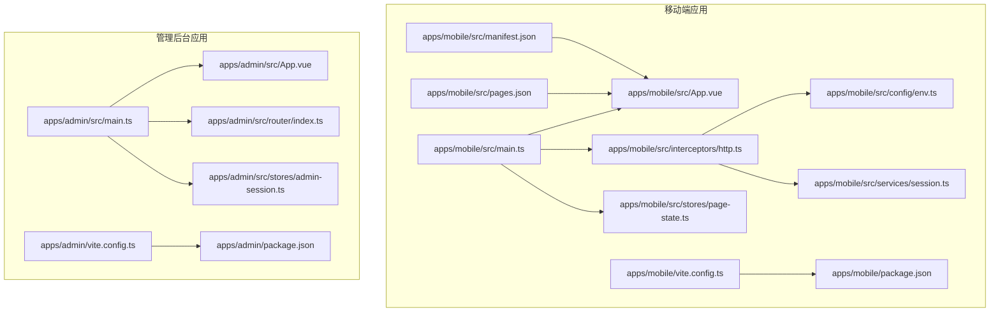
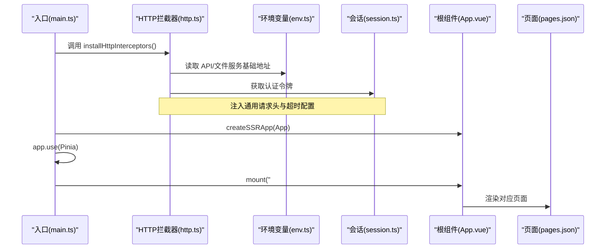
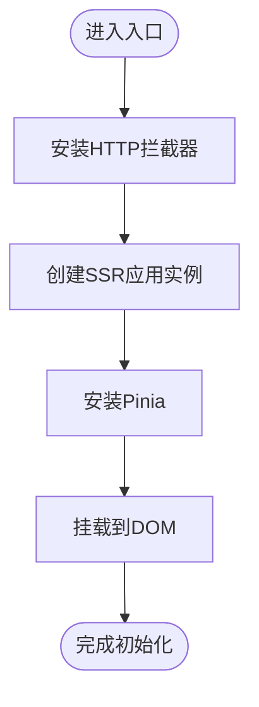
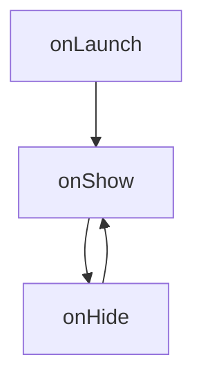
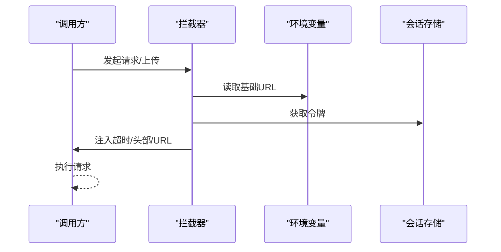
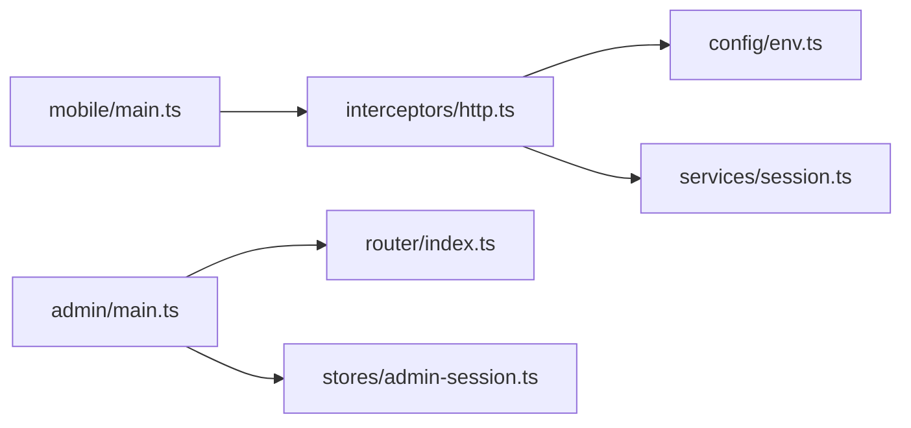

# uni-app 项目结构

<cite>
**本文引用的文件**
- [apps/mobile/src/main.ts](file://apps/mobile/src/main.ts)
- [apps/mobile/src/App.vue](file://apps/mobile/src/App.vue)
- [apps/mobile/src/pages.json](file://apps/mobile/src/pages.json)
- [apps/mobile/src/manifest.json](file://apps/mobile/src/manifest.json)
- [apps/mobile/src/interceptors/http.ts](file://apps/mobile/src/interceptors/http.ts)
- [apps/mobile/src/config/env.ts](file://apps/mobile/src/config/env.ts)
- [apps/mobile/src/services/session.ts](file://apps/mobile/src/services/session.ts)
- [apps/mobile/src/stores/page-state.ts](file://apps/mobile/src/stores/page-state.ts)
- [apps/admin/src/main.ts](file://apps/admin/src/main.ts)
- [apps/admin/src/App.vue](file://apps/admin/src/App.vue)
- [apps/admin/src/router/index.ts](file://apps/admin/src/router/index.ts)
- [apps/admin/src/stores/admin-session.ts](file://apps/admin/src/stores/admin-session.ts)
- [apps/mobile/vite.config.ts](file://apps/mobile/vite.config.ts)
- [apps/admin/vite.config.ts](file://apps/admin/vite.config.ts)
- [apps/mobile/package.json](file://apps/mobile/package.json)
- [apps/admin/package.json](file://apps/admin/package.json)
</cite>

## 目录
1. [简介](#简介)
2. [项目结构](#项目结构)
3. [核心组件](#核心组件)
4. [架构总览](#架构总览)
5. [详细组件分析](#详细组件分析)
6. [依赖分析](#依赖分析)
7. [性能考虑](#性能考虑)
8. [故障排查指南](#故障排查指南)
9. [结论](#结论)
10. [附录](#附录)

## 简介
本文件系统性梳理 uni-app 多端项目结构与关键实现，聚焦以下目标：
- 解释应用入口 main.ts 的初始化流程：SSR 应用创建、Pinia 状态管理集成、HTTP 拦截器安装
- 阐述根组件 App.vue 的设计模式与生命周期管理
- 说明 pages.json 的路由规则、分包策略与页面元数据设置
- 解析 manifest.json 的应用配置项：应用信息、权限配置、编译选项等
- 提供多端编译原理与配置最佳实践

## 项目结构
本仓库采用多应用工作区组织方式，包含移动端应用与管理后台两个子应用，分别位于 apps/mobile 与 apps/admin。每个应用均包含独立的入口、页面配置、清单与构建脚本。

图表来源
- [apps/mobile/src/main.ts:1-15](file://apps/mobile/src/main.ts#L1-L15)
- [apps/mobile/src/App.vue:1-299](file://apps/mobile/src/App.vue#L1-L299)
- [apps/mobile/src/pages.json:1-223](file://apps/mobile/src/pages.json#L1-L223)
- [apps/mobile/src/manifest.json:1-56](file://apps/mobile/src/manifest.json#L1-L56)
- [apps/mobile/src/interceptors/http.ts:1-49](file://apps/mobile/src/interceptors/http.ts#L1-L49)
- [apps/mobile/src/config/env.ts:1-41](file://apps/mobile/src/config/env.ts#L1-L41)
- [apps/mobile/src/services/session.ts:1-56](file://apps/mobile/src/services/session.ts#L1-L56)
- [apps/mobile/src/stores/page-state.ts:1-56](file://apps/mobile/src/stores/page-state.ts#L1-L56)
- [apps/admin/src/main.ts:1-15](file://apps/admin/src/main.ts#L1-L15)
- [apps/admin/src/App.vue:1-4](file://apps/admin/src/App.vue#L1-L4)
- [apps/admin/src/router/index.ts:1-62](file://apps/admin/src/router/index.ts#L1-L62)
- [apps/admin/src/stores/admin-session.ts:1-65](file://apps/admin/src/stores/admin-session.ts#L1-L65)
- [apps/mobile/vite.config.ts:1-8](file://apps/mobile/vite.config.ts#L1-L8)
- [apps/admin/vite.config.ts:1-58](file://apps/admin/vite.config.ts#L1-L58)
- [apps/mobile/package.json:1-76](file://apps/mobile/package.json#L1-L76)
- [apps/admin/package.json:1-32](file://apps/admin/package.json#L1-L32)

章节来源
- [apps/mobile/src/main.ts:1-15](file://apps/mobile/src/main.ts#L1-L15)
- [apps/admin/src/main.ts:1-15](file://apps/admin/src/main.ts#L1-L15)

## 核心组件
本节从入口初始化、状态管理、拦截器与页面配置四个维度，系统解析 uni-app 的核心组件与职责边界。

- 入口初始化
  - 移动端入口通过 SSR 应用工厂函数创建应用实例，集中安装 Pinia、HTTP 拦截器与全局样式，随后在运行时挂载。
  - 管理后台入口直接创建应用实例，按需安装 Pinia、路由与第三方 UI 组件库，最后挂载。
- 状态管理
  - 移动端使用 Pinia 定义页面状态版本控制 Store，用于缓存失效与增量更新。
  - 管理后台使用 Pinia 定义管理员会话 Store，负责登录态、菜单与用户信息的加载与持久化。
- HTTP 拦截器
  - 在移动端统一注入请求拦截器与上传拦截器，自动拼接基础 URL、注入超时与认证头，屏蔽平台差异。
- 页面配置
  - 通过 pages.json 声明页面路径与导航样式，统一全局导航风格，便于多端一致的页面体验。

章节来源
- [apps/mobile/src/main.ts:1-15](file://apps/mobile/src/main.ts#L1-L15)
- [apps/admin/src/main.ts:1-15](file://apps/admin/src/main.ts#L1-L15)
- [apps/mobile/src/stores/page-state.ts:1-56](file://apps/mobile/src/stores/page-state.ts#L1-L56)
- [apps/admin/src/stores/admin-session.ts:1-65](file://apps/admin/src/stores/admin-session.ts#L1-L65)
- [apps/mobile/src/interceptors/http.ts:1-49](file://apps/mobile/src/interceptors/http.ts#L1-L49)
- [apps/mobile/src/pages.json:1-223](file://apps/mobile/src/pages.json#L1-L223)

## 架构总览
下图展示移动端应用从入口到页面渲染的关键调用链，以及拦截器如何贯穿请求生命周期。

图表来源
- [apps/mobile/src/main.ts:1-15](file://apps/mobile/src/main.ts#L1-L15)
- [apps/mobile/src/interceptors/http.ts:1-49](file://apps/mobile/src/interceptors/http.ts#L1-L49)
- [apps/mobile/src/config/env.ts:1-41](file://apps/mobile/src/config/env.ts#L1-L41)
- [apps/mobile/src/services/session.ts:1-56](file://apps/mobile/src/services/session.ts#L1-L56)
- [apps/mobile/src/App.vue:1-299](file://apps/mobile/src/App.vue#L1-L299)
- [apps/mobile/src/pages.json:1-223](file://apps/mobile/src/pages.json#L1-L223)

## 详细组件分析

### 移动端入口与初始化流程（SSR 工厂）
- SSR 应用工厂
  - 通过 SSR 应用工厂函数创建应用实例，集中安装 Pinia，避免重复初始化。
  - 返回包含应用实例的对象，供运行时挂载。
- HTTP 拦截器安装
  - 在应用启动前安装拦截器，确保所有请求与上传行为被统一处理。
  - 拦截器根据平台与环境变量动态拼接基础 URL，注入超时与认证头。
- 全局样式与插件
  - 入口导入全局样式，安装第三方 UI 组件库（如适用），保证全局可用性。

图表来源
- [apps/mobile/src/main.ts:1-15](file://apps/mobile/src/main.ts#L1-L15)
- [apps/mobile/src/interceptors/http.ts:1-49](file://apps/mobile/src/interceptors/http.ts#L1-L49)

章节来源
- [apps/mobile/src/main.ts:1-15](file://apps/mobile/src/main.ts#L1-L15)
- [apps/mobile/src/interceptors/http.ts:1-49](file://apps/mobile/src/interceptors/http.ts#L1-L49)

### 根组件 App.vue 的设计模式与生命周期
- 设计模式
  - 使用单页容器组件，内部仅保留路由视图出口，便于统一管理页面切换与导航。
- 生命周期
  - 通过 uni-app 生命周期钩子记录应用启动、显示与隐藏事件，便于埋点与调试。
- 样式体系
  - 通过 CSS 变量定义主题色板与阴影、边框等视觉规范，支持 H5 与小程序端差异化样式处理。

图表来源
- [apps/mobile/src/App.vue:1-299](file://apps/mobile/src/App.vue#L1-L299)

章节来源
- [apps/mobile/src/App.vue:1-299](file://apps/mobile/src/App.vue#L1-L299)

### pages.json 路由规则、分包策略与页面元数据
- 页面声明
  - 以数组形式声明页面路径与样式，支持自定义导航栏标题、下拉刷新等能力。
- 全局样式
  - 统一设置导航栏文字颜色、标题文本与背景色，保证整体风格一致。
- 分包策略
  - 本项目 pages.json 未显式声明分包字段；若需要分包，请在 pages.json 中添加相应配置并结合构建工具进行分包打包。

章节来源
- [apps/mobile/src/pages.json:1-223](file://apps/mobile/src/pages.json#L1-L223)

### manifest.json 应用配置与多端编译
- 应用信息
  - 包含应用名称、版本号、描述等基础信息。
- 权限配置
  - Android 端声明网络与相机等权限，iOS 端可扩展权限声明。
- 编译选项
  - app-plus 模块启用组件化、nvue 编译器版本与启动屏配置。
  - 各小程序平台（微信、支付宝、百度、头条）开启组件化与安全校验等选项。
- 多端编译
  - 通过 CLI 脚本为不同平台生成构建产物，支持 H5、小程序与快应用等多端输出。

章节来源
- [apps/mobile/src/manifest.json:1-56](file://apps/mobile/src/manifest.json#L1-L56)
- [apps/mobile/package.json:1-76](file://apps/mobile/package.json#L1-L76)

### HTTP 拦截器安装与认证头注入
- 请求拦截
  - 自动设置超时时间、拼接基础 URL、注入通用请求头与认证令牌。
- 上传拦截
  - 对上传接口单独设置超时与基础 URL，确保大文件传输稳定性。
- 平台适配
  - 通过环境变量区分不同平台的基础地址，保障开发与生产环境一致性。

图表来源
- [apps/mobile/src/interceptors/http.ts:1-49](file://apps/mobile/src/interceptors/http.ts#L1-L49)
- [apps/mobile/src/config/env.ts:1-41](file://apps/mobile/src/config/env.ts#L1-L41)
- [apps/mobile/src/services/session.ts:1-56](file://apps/mobile/src/services/session.ts#L1-L56)

章节来源
- [apps/mobile/src/interceptors/http.ts:1-49](file://apps/mobile/src/interceptors/http.ts#L1-L49)
- [apps/mobile/src/config/env.ts:1-41](file://apps/mobile/src/config/env.ts#L1-L41)
- [apps/mobile/src/services/session.ts:1-56](file://apps/mobile/src/services/session.ts#L1-L56)

### Pinia 状态管理集成与最佳实践
- 移动端页面状态版本控制
  - 通过 Store 记录页面版本号，支持对核心页面集合进行批量标记，实现缓存失效与增量更新。
- 管理后台会话状态
  - Store 负责登录态、菜单与用户信息的加载与持久化，登录后并行拉取用户与菜单数据，提升首屏体验。
- 最佳实践
  - 将状态与副作用解耦，避免在 Store 中直接发起网络请求；通过服务层封装请求，Store 仅负责状态流转。

章节来源
- [apps/mobile/src/stores/page-state.ts:1-56](file://apps/mobile/src/stores/page-state.ts#L1-L56)
- [apps/admin/src/stores/admin-session.ts:1-65](file://apps/admin/src/stores/admin-session.ts#L1-L65)

### 管理后台路由守卫与页面元数据
- 路由结构
  - 登录页与主布局嵌套子路由，支持问题库、内容中心、商业中心与运营中心等模块化页面。
- 导航元信息
  - 子路由可设置标题与导航样式，配合全局样式实现一致的导航体验。
- 路由守卫
  - 未登录访问受保护路由时重定向至登录页；已登录访问登录页则重定向至首页，避免重复登录。

章节来源
- [apps/admin/src/router/index.ts:1-62](file://apps/admin/src/router/index.ts#L1-L62)
- [apps/admin/src/App.vue:1-4](file://apps/admin/src/App.vue#L1-L4)

### 多端编译原理与配置最佳实践
- 构建插件
  - 移动端使用 uni 插件驱动多端编译；管理后台使用 Vue 插件与本地代理与基础路径配置。
- 脚本命令
  - 通过 npm/yarn/pnpm 脚本为各平台生成开发与构建产物，支持 H5、小程序与快应用等多端。
- 最佳实践
  - 明确区分开发与生产环境的基础 URL；在拦截器中统一处理认证头与超时；在 manifest 中按平台声明必要权限；在 pages.json 中统一导航样式，减少平台差异带来的维护成本。

章节来源
- [apps/mobile/vite.config.ts:1-8](file://apps/mobile/vite.config.ts#L1-L8)
- [apps/admin/vite.config.ts:1-58](file://apps/admin/vite.config.ts#L1-L58)
- [apps/mobile/package.json:1-76](file://apps/mobile/package.json#L1-L76)
- [apps/admin/package.json:1-32](file://apps/admin/package.json#L1-L32)

## 依赖分析
- 组件耦合
  - 入口与拦截器存在直接依赖关系：入口负责安装拦截器，拦截器依赖环境变量与会话存储。
  - 管理后台入口与路由、状态管理存在松耦合：通过模块化导入实现职责分离。
- 外部依赖
  - 移动端依赖 uni-app 生态与 Pinia；管理后台依赖 Vue Router 与 Element Plus。
- 循环依赖
  - 当前结构未发现循环依赖；建议后续引入新模块时保持单向依赖与清晰的职责边界。

图表来源
- [apps/mobile/src/main.ts:1-15](file://apps/mobile/src/main.ts#L1-L15)
- [apps/mobile/src/interceptors/http.ts:1-49](file://apps/mobile/src/interceptors/http.ts#L1-L49)
- [apps/mobile/src/config/env.ts:1-41](file://apps/mobile/src/config/env.ts#L1-L41)
- [apps/mobile/src/services/session.ts:1-56](file://apps/mobile/src/services/session.ts#L1-L56)
- [apps/admin/src/main.ts:1-15](file://apps/admin/src/main.ts#L1-L15)
- [apps/admin/src/router/index.ts:1-62](file://apps/admin/src/router/index.ts#L1-L62)
- [apps/admin/src/stores/admin-session.ts:1-65](file://apps/admin/src/stores/admin-session.ts#L1-L65)

章节来源
- [apps/mobile/src/main.ts:1-15](file://apps/mobile/src/main.ts#L1-L15)
- [apps/admin/src/main.ts:1-15](file://apps/admin/src/main.ts#L1-L15)

## 性能考虑
- 请求优化
  - 在拦截器中统一设置超时与基础 URL，避免重复计算与网络抖动影响。
- 状态管理
  - 使用版本控制机制对核心页面进行增量更新，降低无效渲染与数据拉取频率。
- 构建优化
  - 合理配置基础路径与代理，减少开发阶段的资源重定向开销；按需开启组件化与编译器版本，平衡兼容性与性能。

## 故障排查指南
- 认证失败
  - 检查拦截器是否正确注入认证头；确认会话存储中的令牌是否存在且未过期。
- 请求超时或地址错误
  - 核对环境变量中的基础 URL 是否与实际服务一致；确认拦截器是否正确拼接 URL。
- 页面样式异常
  - 检查全局样式与平台条件编译指令；确认页面样式是否覆盖了全局样式。
- 路由跳转异常
  - 核对路由守卫逻辑与页面元信息；确认受保护路由的访问权限与重定向逻辑。

章节来源
- [apps/mobile/src/interceptors/http.ts:1-49](file://apps/mobile/src/interceptors/http.ts#L1-L49)
- [apps/mobile/src/services/session.ts:1-56](file://apps/mobile/src/services/session.ts#L1-L56)
- [apps/mobile/src/App.vue:1-299](file://apps/mobile/src/App.vue#L1-L299)
- [apps/admin/src/router/index.ts:1-62](file://apps/admin/src/router/index.ts#L1-L62)

## 结论
本项目在 uni-app 生态下实现了移动端与管理后台的清晰分层：入口初始化、拦截器、状态管理与页面配置相互解耦，既满足多端编译需求，又具备良好的可维护性。建议在后续迭代中进一步完善分包策略、增强错误监控与埋点能力，并持续优化拦截器与状态管理的边界与性能表现。

## 附录
- 关键实现路径参考
  - 移动端入口与拦截器：[apps/mobile/src/main.ts:1-15](file://apps/mobile/src/main.ts#L1-L15)，[apps/mobile/src/interceptors/http.ts:1-49](file://apps/mobile/src/interceptors/http.ts#L1-L49)
  - 管理后台入口与路由：[apps/admin/src/main.ts:1-15](file://apps/admin/src/main.ts#L1-L15)，[apps/admin/src/router/index.ts:1-62](file://apps/admin/src/router/index.ts#L1-L62)
  - 页面与清单配置：[apps/mobile/src/pages.json:1-223](file://apps/mobile/src/pages.json#L1-L223)，[apps/mobile/src/manifest.json:1-56](file://apps/mobile/src/manifest.json#L1-L56)
  - 状态管理示例：[apps/mobile/src/stores/page-state.ts:1-56](file://apps/mobile/src/stores/page-state.ts#L1-L56)，[apps/admin/src/stores/admin-session.ts:1-65](file://apps/admin/src/stores/admin-session.ts#L1-L65)
  - 多端构建脚本：[apps/mobile/package.json:1-76](file://apps/mobile/package.json#L1-L76)，[apps/admin/package.json:1-32](file://apps/admin/package.json#L1-L32)