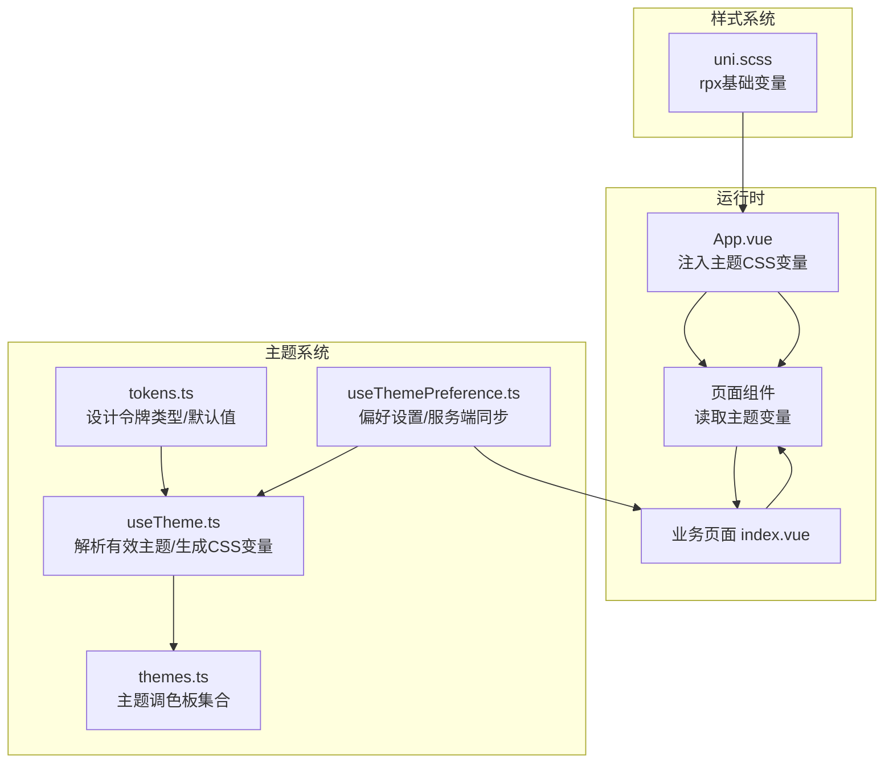
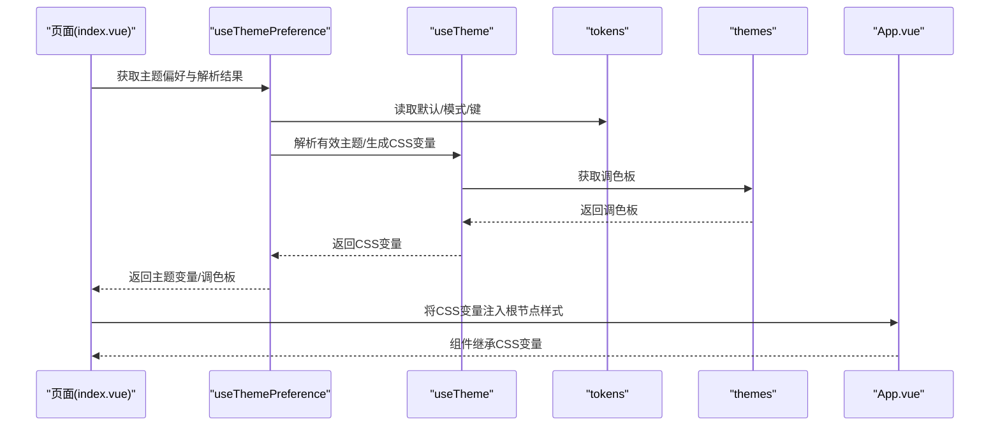
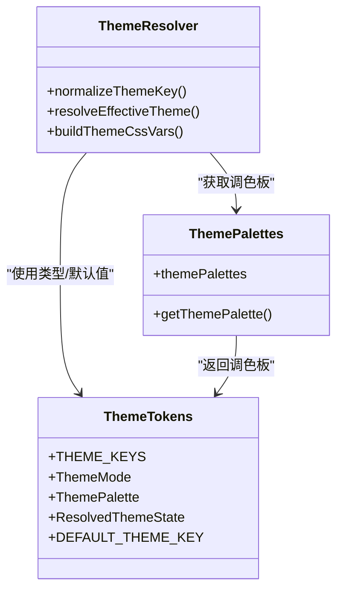
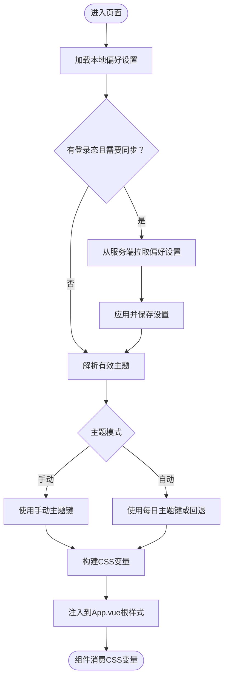
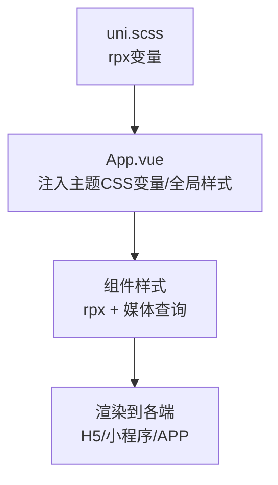
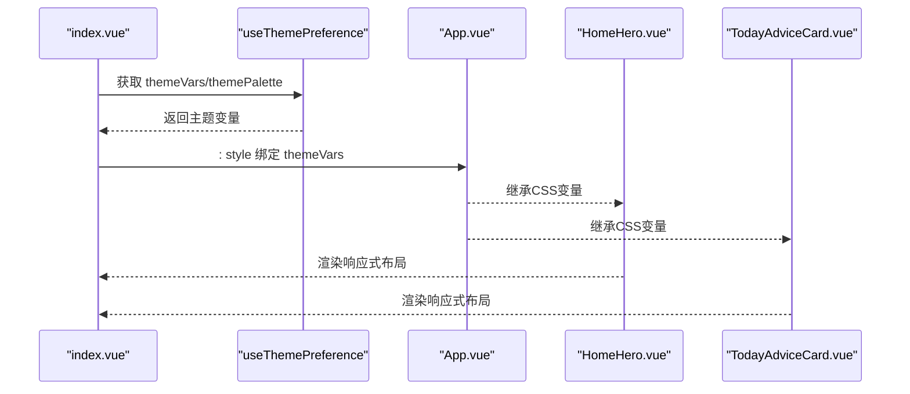
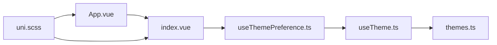

# 响应式设计

<cite>
**本文引用的文件**
- [apps/mobile/src/theme/themes.ts](file://apps/mobile/src/theme/themes.ts)
- [apps/mobile/src/theme/tokens.ts](file://apps/mobile/src/theme/tokens.ts)
- [apps/mobile/src/theme/useTheme.ts](file://apps/mobile/src/theme/useTheme.ts)
- [apps/mobile/src/composables/useThemePreference.ts](file://apps/mobile/src/composables/useThemePreference.ts)
- [apps/mobile/src/uni.scss](file://apps/mobile/src/uni.scss)
- [apps/mobile/src/App.vue](file://apps/mobile/src/App.vue)
- [apps/mobile/src/main.ts](file://apps/mobile/src/main.ts)
- [apps/mobile/vite.config.ts](file://apps/mobile/vite.config.ts)
- [apps/mobile/src/components/HomeHero.vue](file://apps/mobile/src/components/HomeHero.vue)
- [apps/mobile/src/components/TodayAdviceCard.vue](file://apps/mobile/src/components/TodayAdviceCard.vue)
- [apps/mobile/src/pages/index/index.vue](file://apps/mobile/src/pages/index/index.vue)
- [apps/mobile/src/services/preferences.ts](file://apps/mobile/src/services/preferences.ts)
- [apps/mobile/index.html](file://apps/mobile/index.html)
</cite>

## 目录
1. [简介](#简介)
2. [项目结构](#项目结构)
3. [核心组件](#核心组件)
4. [架构总览](#架构总览)
5. [详细组件分析](#详细组件分析)
6. [依赖关系分析](#依赖关系分析)
7. [性能考量](#性能考量)
8. [故障排查指南](#故障排查指南)
9. [结论](#结论)
10. [附录](#附录)

## 简介
本文件系统化阐述小程序端（UniApp/Vite）的响应式设计实现，覆盖屏幕适配、尺寸单位转换、多端兼容与主题系统的响应式特性（含暗色模式策略、动态主题切换与设计令牌的应用）。同时解析样式系统架构（SCSS 变量、混合器与工具类），并给出移动端适配最佳实践与性能优化建议。

## 项目结构
- 移动端采用 UniApp + Vue 3 + Vite 构建，页面通过 pages.json 配置路由，全局样式在 App.vue 中定义，组件样式以 SCSS 编写。
- 主题系统由设计令牌、主题调色板、主题解析与 CSS 变量构建模块组成，贯穿全局与页面组件。
- 样式系统以 uni.scss 定义基础变量，App.vue 注入主题 CSS 变量，组件内使用 rpx 单位与媒体查询实现响应式布局。

**图表来源**
- [apps/mobile/src/App.vue:17-65](file://apps/mobile/src/App.vue#L17-L65)
- [apps/mobile/src/theme/tokens.ts:1-52](file://apps/mobile/src/theme/tokens.ts#L1-L52)
- [apps/mobile/src/theme/useTheme.ts:37-101](file://apps/mobile/src/theme/useTheme.ts#L37-L101)
- [apps/mobile/src/theme/themes.ts:29-231](file://apps/mobile/src/theme/themes.ts#L29-L231)
- [apps/mobile/src/composables/useThemePreference.ts:41-61](file://apps/mobile/src/composables/useThemePreference.ts#L41-L61)
- [apps/mobile/src/uni.scss:1-39](file://apps/mobile/src/uni.scss#L1-L39)

**章节来源**
- [apps/mobile/src/App.vue:17-65](file://apps/mobile/src/App.vue#L17-L65)
- [apps/mobile/src/uni.scss:1-39](file://apps/mobile/src/uni.scss#L1-L39)
- [apps/mobile/src/main.ts:1-15](file://apps/mobile/src/main.ts#L1-L15)
- [apps/mobile/vite.config.ts:1-8](file://apps/mobile/vite.config.ts#L1-L8)

## 核心组件
- 设计令牌与主题键：定义主题键集合、主题模式、主题调色板接口与默认主题键，确保类型安全与可扩展性。
- 主题解析与 CSS 变量：根据手动/每日/回退策略解析有效主题，并将调色板映射为 CSS 自定义属性，供全局与组件使用。
- 偏好设置与服务端同步：持久化本地设置，支持登录态下的服务端同步；动态更新主题变量。
- 全局样式与工具类：在 App.vue 中注入主题变量，定义按钮等通用工具类，统一过渡与阴影效果。
- 组件级响应式：组件内部使用网格、媒体查询与 rpx 实现不同屏幕宽度下的布局调整。

**章节来源**
- [apps/mobile/src/theme/tokens.ts:1-52](file://apps/mobile/src/theme/tokens.ts#L1-L52)
- [apps/mobile/src/theme/useTheme.ts:37-101](file://apps/mobile/src/theme/useTheme.ts#L37-L101)
- [apps/mobile/src/theme/themes.ts:29-231](file://apps/mobile/src/theme/themes.ts#L29-L231)
- [apps/mobile/src/composables/useThemePreference.ts:41-61](file://apps/mobile/src/composables/useThemePreference.ts#L41-L61)
- [apps/mobile/src/App.vue:17-299](file://apps/mobile/src/App.vue#L17-L299)
- [apps/mobile/src/uni.scss:1-39](file://apps/mobile/src/uni.scss#L1-L39)

## 架构总览
主题系统围绕“设计令牌 → 主题解析 → CSS 变量注入 → 组件消费”的链路工作。页面通过组合式函数获取主题状态与变量，组件直接使用 CSS 变量与 rpx 单位实现一致的视觉与交互体验。

**图表来源**
- [apps/mobile/src/pages/index/index.vue:218-221](file://apps/mobile/src/pages/index/index.vue#L218-L221)
- [apps/mobile/src/composables/useThemePreference.ts:41-61](file://apps/mobile/src/composables/useThemePreference.ts#L41-L61)
- [apps/mobile/src/theme/useTheme.ts:37-101](file://apps/mobile/src/theme/useTheme.ts#L37-L101)
- [apps/mobile/src/theme/themes.ts:228-231](file://apps/mobile/src/theme/themes.ts#L228-L231)
- [apps/mobile/src/theme/tokens.ts:43-49](file://apps/mobile/src/theme/tokens.ts#L43-L49)
- [apps/mobile/src/App.vue:2-65](file://apps/mobile/src/App.vue#L2-L65)

## 详细组件分析

### 主题系统与设计令牌
- 设计令牌定义了主题键集合、主题模式（自动/手动）、调色板字段与默认键，保证主题扩展与类型约束。
- 主题解析函数根据用户设置与每日主题源计算有效主题键，并标注来源（手动/每日/回退）。
- CSS 变量构建函数将调色板映射为一组 CSS 自定义属性，包含主色 RGB、页面渐变、文本、边框、阴影等，便于组件直接使用。

**图表来源**
- [apps/mobile/src/theme/tokens.ts:1-52](file://apps/mobile/src/theme/tokens.ts#L1-L52)
- [apps/mobile/src/theme/useTheme.ts:33-101](file://apps/mobile/src/theme/useTheme.ts#L33-L101)
- [apps/mobile/src/theme/themes.ts:228-231](file://apps/mobile/src/theme/themes.ts#L228-L231)

**章节来源**
- [apps/mobile/src/theme/tokens.ts:1-52](file://apps/mobile/src/theme/tokens.ts#L1-L52)
- [apps/mobile/src/theme/useTheme.ts:33-101](file://apps/mobile/src/theme/useTheme.ts#L33-L101)
- [apps/mobile/src/theme/themes.ts:29-231](file://apps/mobile/src/theme/themes.ts#L29-L231)

### 偏好设置与动态主题切换
- 偏好设置存储在本地，包含主题模式与手动主题键；支持登录后的服务端同步，避免重复请求。
- 动态切换支持“自动/手动”两种模式：手动模式下优先使用用户选择的主题；自动模式下优先使用每日主题源，否则回退到默认主题。
- 页面通过组合式函数读取解析后的主题变量并注入到根节点样式，组件即可直接使用 CSS 变量。

**图表来源**
- [apps/mobile/src/composables/useThemePreference.ts:120-146](file://apps/mobile/src/composables/useThemePreference.ts#L120-L146)
- [apps/mobile/src/composables/useThemePreference.ts:63-92](file://apps/mobile/src/composables/useThemePreference.ts#L63-L92)
- [apps/mobile/src/pages/index/index.vue:218-221](file://apps/mobile/src/pages/index/index.vue#L218-L221)
- [apps/mobile/src/App.vue:2-65](file://apps/mobile/src/App.vue#L2-L65)

**章节来源**
- [apps/mobile/src/composables/useThemePreference.ts:41-163](file://apps/mobile/src/composables/useThemePreference.ts#L41-L163)
- [apps/mobile/src/services/preferences.ts:3-73](file://apps/mobile/src/services/preferences.ts#L3-L73)
- [apps/mobile/src/pages/index/index.vue:218-221](file://apps/mobile/src/pages/index/index.vue#L218-L221)

### 样式系统与屏幕适配
- SCSS 变量层：在 uni.scss 中集中定义颜色、字体、圆角、间距与 rpx 尺寸，形成统一的视觉语言。
- 全局样式层：App.vue 注入主题 CSS 变量，设置页面背景、字体族与滚动条隐藏，定义按钮等通用工具类。
- 组件样式层：组件内部使用 rpx 与媒体查询实现响应式布局，如在窄屏下调整内边距、字号与网格列数。

**图表来源**
- [apps/mobile/src/uni.scss:1-39](file://apps/mobile/src/uni.scss#L1-L39)
- [apps/mobile/src/App.vue:17-299](file://apps/mobile/src/App.vue#L17-L299)
- [apps/mobile/src/components/HomeHero.vue:251-270](file://apps/mobile/src/components/HomeHero.vue#L251-L270)

**章节来源**
- [apps/mobile/src/uni.scss:1-39](file://apps/mobile/src/uni.scss#L1-L39)
- [apps/mobile/src/App.vue:17-299](file://apps/mobile/src/App.vue#L17-L299)
- [apps/mobile/src/components/HomeHero.vue:52-270](file://apps/mobile/src/components/HomeHero.vue#L52-L270)
- [apps/mobile/src/components/TodayAdviceCard.vue:36-148](file://apps/mobile/src/components/TodayAdviceCard.vue#L36-L148)

### 页面与组件的响应式实现
- 页面 index.vue 通过组合式函数获取主题变量与调色板，将主题变量注入根节点样式，使全页面继承主题。
- HomeHero 与 TodayAdviceCard 等组件使用网格布局与媒体查询，在小屏设备上调整内容密度与字号，保证信息层级清晰。
- 按钮工具类统一过渡与阴影，提升交互一致性。

**图表来源**
- [apps/mobile/src/pages/index/index.vue:2-221](file://apps/mobile/src/pages/index/index.vue#L2-L221)
- [apps/mobile/src/App.vue:2-65](file://apps/mobile/src/App.vue#L2-L65)
- [apps/mobile/src/components/HomeHero.vue:52-270](file://apps/mobile/src/components/HomeHero.vue#L52-L270)
- [apps/mobile/src/components/TodayAdviceCard.vue:36-148](file://apps/mobile/src/components/TodayAdviceCard.vue#L36-L148)

**章节来源**
- [apps/mobile/src/pages/index/index.vue:1-800](file://apps/mobile/src/pages/index/index.vue#L1-L800)
- [apps/mobile/src/components/HomeHero.vue:1-271](file://apps/mobile/src/components/HomeHero.vue#L1-L271)
- [apps/mobile/src/components/TodayAdviceCard.vue:1-148](file://apps/mobile/src/components/TodayAdviceCard.vue#L1-L148)

## 依赖关系分析
- 页面依赖组合式函数 useThemePreference 获取主题状态与变量，进而影响全局样式注入。
- 组合式函数依赖 useTheme 进行主题解析与 CSS 变量构建，useTheme 再依赖 themes.ts 提供的调色板集合。
- App.vue 作为全局样式入口，承载主题变量注入与通用样式定义。
- 组件样式依赖 uni.scss 的 rpx 变量与 App.vue 的 CSS 变量，形成“变量层 → 全局层 → 组件层”的分层体系。

**图表来源**
- [apps/mobile/src/pages/index/index.vue:127-221](file://apps/mobile/src/pages/index/index.vue#L127-L221)
- [apps/mobile/src/composables/useThemePreference.ts:41-61](file://apps/mobile/src/composables/useThemePreference.ts#L41-L61)
- [apps/mobile/src/theme/useTheme.ts:103-114](file://apps/mobile/src/theme/useTheme.ts#L103-L114)
- [apps/mobile/src/theme/themes.ts:228-231](file://apps/mobile/src/theme/themes.ts#L228-L231)
- [apps/mobile/src/App.vue:17-65](file://apps/mobile/src/App.vue#L17-L65)
- [apps/mobile/src/uni.scss:1-39](file://apps/mobile/src/uni.scss#L1-L39)

**章节来源**
- [apps/mobile/src/pages/index/index.vue:127-221](file://apps/mobile/src/pages/index/index.vue#L127-L221)
- [apps/mobile/src/composables/useThemePreference.ts:41-61](file://apps/mobile/src/composables/useThemePreference.ts#L41-L61)
- [apps/mobile/src/theme/useTheme.ts:103-114](file://apps/mobile/src/theme/useTheme.ts#L103-L114)
- [apps/mobile/src/theme/themes.ts:228-231](file://apps/mobile/src/theme/themes.ts#L228-L231)
- [apps/mobile/src/App.vue:17-65](file://apps/mobile/src/App.vue#L17-L65)
- [apps/mobile/src/uni.scss:1-39](file://apps/mobile/src/uni.scss#L1-L39)

## 性能考量
- 使用 rpx 单位与媒体查询减少重绘与布局抖动，避免 px 在不同设备像素比下的缩放误差。
- CSS 变量集中管理主题色彩，组件仅消费变量，降低样式计算成本。
- 按需注入主题变量于根节点，避免全局样式冗余。
- 组件内使用 CSS Grid 与 Flex 布局，配合最小化动画与阴影，提升滚动与交互流畅度。
- 对大图与复杂 SVG 渲染建议懒加载与缓存，避免首屏阻塞。

## 故障排查指南
- 主题未生效
  - 检查页面是否正确绑定 themeVars 到根节点样式。
  - 确认 useThemePreference 是否成功解析有效主题并生成 CSS 变量。
  - 核对本地偏好设置与服务端同步状态。
- 字体与字号异常
  - 检查 uni.scss 中 rpx 基础变量是否被组件覆盖。
  - 确认 App.vue 中字体族与字号是否一致。
- 响应式布局错乱
  - 检查组件媒体查询断点与 rpx 使用是否合理。
  - 确认容器网格列数与间距在目标屏幕宽度下是否合适。
- 多端差异
  - H5/小程序/APP 的滚动条隐藏与安全区适配可能不同，需分别验证。

**章节来源**
- [apps/mobile/src/App.vue:17-299](file://apps/mobile/src/App.vue#L17-L299)
- [apps/mobile/src/uni.scss:1-39](file://apps/mobile/src/uni.scss#L1-L39)
- [apps/mobile/src/composables/useThemePreference.ts:120-146](file://apps/mobile/src/composables/useThemePreference.ts#L120-L146)
- [apps/mobile/src/components/HomeHero.vue:251-270](file://apps/mobile/src/components/HomeHero.vue#L251-L270)

## 结论
该移动端项目通过“设计令牌 + 主题解析 + CSS 变量注入 + 组件消费”的分层架构实现了完整的响应式设计。rpx 与媒体查询确保了跨设备的一致体验，主题系统支持手动与每日主题切换，并通过偏好设置持久化与服务端同步保障用户体验连贯性。样式系统以 SCSS 变量为基础，结合全局与组件层样式，形成清晰、可维护的视觉体系。

## 附录

### 屏幕适配与尺寸单位转换
- rpx 为小程序推荐单位，可在不同设备像素比下保持相对一致的视觉大小。
- 建议优先使用 rpx 定义尺寸、间距与字号，必要时配合媒体查询进行微调。
- App.vue 中的全局样式与组件样式共同作用，确保页面整体风格一致。

**章节来源**
- [apps/mobile/src/uni.scss:1-39](file://apps/mobile/src/uni.scss#L1-L39)
- [apps/mobile/src/App.vue:17-299](file://apps/mobile/src/App.vue#L17-L299)

### 多端兼容性处理
- 视口配置在 index.html 中动态注入，支持 viewport-fit=cover 以适配刘海屏。
- App.vue 中针对 H5 平台的滚动条隐藏与安全区适配做了条件编译处理。
- 组件中使用 env(safe-area-inset-*) 与 rpx，兼顾不同设备的安全区域与像素密度。

**章节来源**
- [apps/mobile/index.html:5-11](file://apps/mobile/index.html#L5-L11)
- [apps/mobile/src/App.vue:54-101](file://apps/mobile/src/App.vue#L54-L101)

### 主题系统的响应式特性
- 主题模式支持“自动/手动”，每日主题源可为空，系统自动回退到默认主题。
- CSS 变量覆盖页面背景、文本、边框、阴影等，组件直接消费变量，无需感知具体颜色值。
- 组件内可按需使用变量进行局部样式定制，保持与全局主题一致。

**章节来源**
- [apps/mobile/src/theme/tokens.ts:20-49](file://apps/mobile/src/theme/tokens.ts#L20-L49)
- [apps/mobile/src/theme/useTheme.ts:37-101](file://apps/mobile/src/theme/useTheme.ts#L37-L101)
- [apps/mobile/src/composables/useThemePreference.ts:41-111](file://apps/mobile/src/composables/useThemePreference.ts#L41-L111)