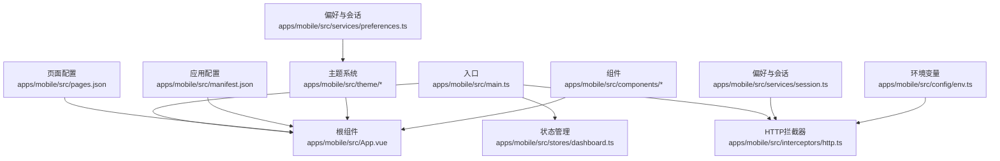
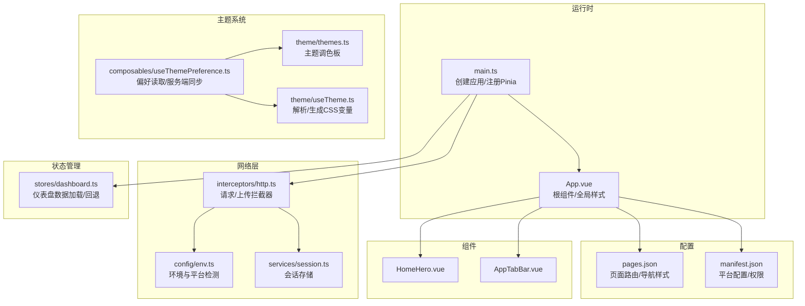
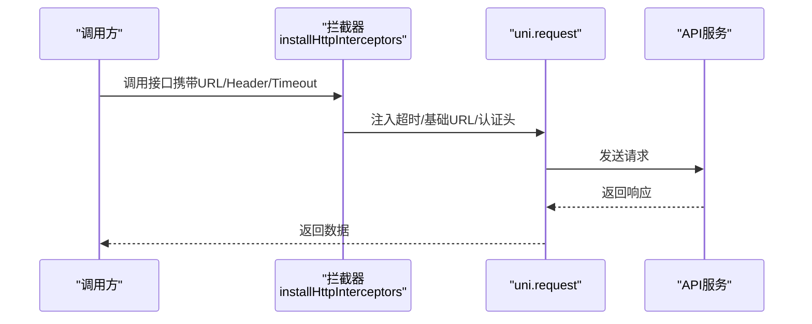
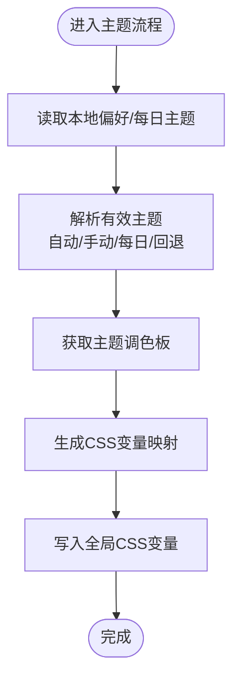
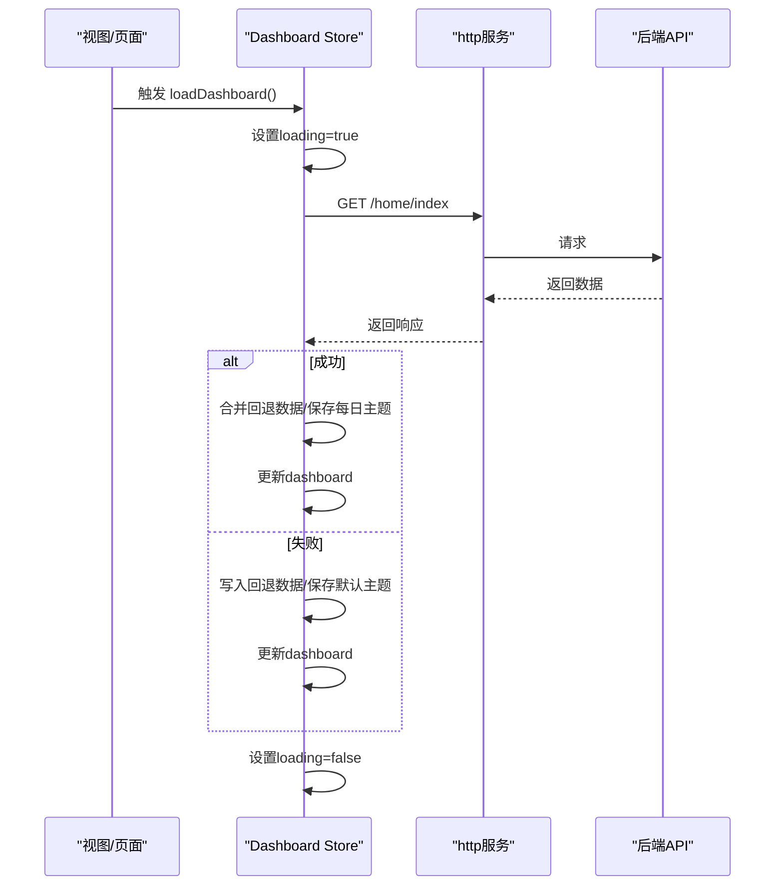
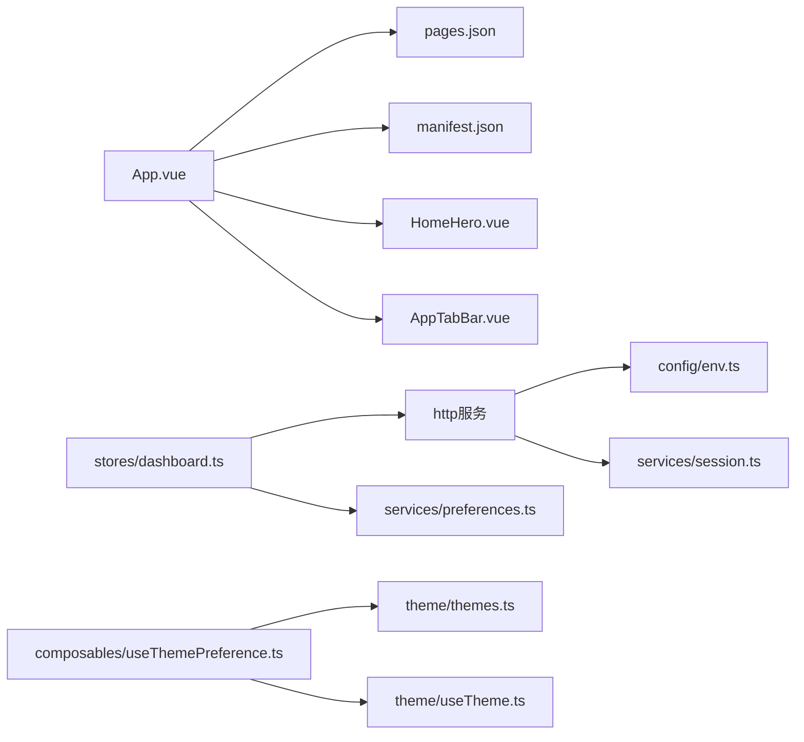

# 小程序端开发

<cite>
**本文引用的文件**
- [apps/mobile/src/main.ts](file://apps/mobile/src/main.ts)
- [apps/mobile/src/App.vue](file://apps/mobile/src/App.vue)
- [apps/mobile/src/pages.json](file://apps/mobile/src/pages.json)
- [apps/mobile/src/manifest.json](file://apps/mobile/src/manifest.json)
- [apps/mobile/package.json](file://apps/mobile/package.json)
- [apps/mobile/src/interceptors/http.ts](file://apps/mobile/src/interceptors/http.ts)
- [apps/mobile/src/config/env.ts](file://apps/mobile/src/config/env.ts)
- [apps/mobile/src/services/session.ts](file://apps/mobile/src/services/session.ts)
- [apps/mobile/src/services/preferences.ts](file://apps/mobile/src/services/preferences.ts)
- [apps/mobile/src/theme/themes.ts](file://apps/mobile/src/theme/themes.ts)
- [apps/mobile/src/theme/useTheme.ts](file://apps/mobile/src/theme/useTheme.ts)
- [apps/mobile/src/composables/useThemePreference.ts](file://apps/mobile/src/composables/useThemePreference.ts)
- [apps/mobile/src/stores/dashboard.ts](file://apps/mobile/src/stores/dashboard.ts)
- [apps/mobile/src/components/HomeHero.vue](file://apps/mobile/src/components/HomeHero.vue)
- [apps/mobile/src/components/AppTabBar.vue](file://apps/mobile/src/components/AppTabBar.vue)
</cite>

## 目录
1. [引言](#引言)
2. [项目结构](#项目结构)
3. [核心组件](#核心组件)
4. [架构总览](#架构总览)
5. [详细组件分析](#详细组件分析)
6. [依赖关系分析](#依赖关系分析)
7. [性能考虑](#性能考虑)
8. [故障排查指南](#故障排查指南)
9. [结论](#结论)
10. [附录](#附录)

## 引言
本指南面向使用 uni-app 开发小程序端（含微信小程序、H5 等多端）的工程师，围绕应用入口、根组件、页面配置、应用配置、多端编译、组件化开发、Pinia 状态管理、HTTP 拦截器、主题系统与响应式设计、性能优化与发布流程进行系统性讲解。文档基于仓库中的实际源码进行分析，提供可操作的开发流程与最佳实践。

## 项目结构
- 应用位于 apps/mobile，采用 uni-app 3 + Vue 3 + Vite 的现代前端技术栈。
- 关键文件职责：
  - 入口与运行时：main.ts 创建应用实例、挂载 Pinia；App.vue 作为根组件，定义全局样式与生命周期钩子。
  - 页面与应用配置：pages.json 定义页面路由与导航栏样式；manifest.json 配置各平台参数与权限。
  - 多端脚本：package.json 提供多端开发与构建脚本，覆盖微信小程序、H5、支付宝、百度、字节、快手、QQ、Harmony、小红书等平台。
  - 网络层：interceptors/http.ts 注册 uni.request/uni.uploadFile 拦截器，统一会话与请求头注入。
  - 主题系统：theme/* 提供主题调色板、解析与 CSS 变量生成；composables/useThemePreference.ts 提供主题偏好读取与服务端同步。
  - 状态管理：stores/dashboard.ts 使用 Pinia 定义仪表盘数据加载与回退策略。
  - 组件：components/* 提供通用业务组件，如首页头部卡片、底部导航等。

图表来源
- [apps/mobile/src/main.ts:1-15](file://apps/mobile/src/main.ts#L1-L15)
- [apps/mobile/src/App.vue:1-299](file://apps/mobile/src/App.vue#L1-L299)
- [apps/mobile/src/pages.json:1-223](file://apps/mobile/src/pages.json#L1-L223)
- [apps/mobile/src/manifest.json:1-56](file://apps/mobile/src/manifest.json#L1-L56)
- [apps/mobile/src/interceptors/http.ts:1-49](file://apps/mobile/src/interceptors/http.ts#L1-L49)
- [apps/mobile/src/theme/themes.ts:1-231](file://apps/mobile/src/theme/themes.ts#L1-L231)
- [apps/mobile/src/services/preferences.ts:1-73](file://apps/mobile/src/services/preferences.ts#L1-L73)
- [apps/mobile/src/services/session.ts:1-56](file://apps/mobile/src/services/session.ts#L1-L56)
- [apps/mobile/src/config/env.ts:1-41](file://apps/mobile/src/config/env.ts#L1-L41)
- [apps/mobile/src/stores/dashboard.ts:1-382](file://apps/mobile/src/stores/dashboard.ts#L1-L382)
- [apps/mobile/src/components/HomeHero.vue:1-271](file://apps/mobile/src/components/HomeHero.vue#L1-L271)
- [apps/mobile/src/components/AppTabBar.vue:1-205](file://apps/mobile/src/components/AppTabBar.vue#L1-L205)

章节来源
- [apps/mobile/src/main.ts:1-15](file://apps/mobile/src/main.ts#L1-L15)
- [apps/mobile/src/App.vue:1-299](file://apps/mobile/src/App.vue#L1-L299)
- [apps/mobile/src/pages.json:1-223](file://apps/mobile/src/pages.json#L1-L223)
- [apps/mobile/src/manifest.json:1-56](file://apps/mobile/src/manifest.json#L1-L56)
- [apps/mobile/package.json:1-76](file://apps/mobile/package.json#L1-L76)

## 核心组件
- 应用入口与运行时
  - main.ts 负责安装 HTTP 拦截器、创建 SSR 应用实例并注册 Pinia，导出工厂函数供 uni-app 运行时调用。
- 根组件与全局样式
  - App.vue 定义全局 CSS 变量（主题色、阴影、字体等），并为不同平台（如 H5）提供滚动条隐藏样式。
- 页面与应用配置
  - pages.json 声明页面路径与导航样式；globalStyle 统一导航栏文字颜色、背景色与页面背景色。
  - manifest.json 配置应用名、版本、编译器版本、启动页、平台特定参数（如微信小程序 appid、H5 权限等）。
- 多端脚本与编译
  - package.json 提供多端开发与构建命令，支持微信小程序、H5、支付宝、百度、字节、快手、QQ、Harmony、小红书等平台。

章节来源
- [apps/mobile/src/main.ts:1-15](file://apps/mobile/src/main.ts#L1-L15)
- [apps/mobile/src/App.vue:1-299](file://apps/mobile/src/App.vue#L1-L299)
- [apps/mobile/src/pages.json:1-223](file://apps/mobile/src/pages.json#L1-L223)
- [apps/mobile/src/manifest.json:1-56](file://apps/mobile/src/manifest.json#L1-L56)
- [apps/mobile/package.json:1-76](file://apps/mobile/package.json#L1-L76)

## 架构总览
下图展示了 uni-app 小程序端的整体架构：入口创建应用与状态管理，拦截器统一处理网络请求，主题系统通过 CSS 变量驱动 UI，页面与组件按 pages.json 与 manifest.json 配置进行多端编译与运行。

图表来源
- [apps/mobile/src/main.ts:1-15](file://apps/mobile/src/main.ts#L1-L15)
- [apps/mobile/src/App.vue:1-299](file://apps/mobile/src/App.vue#L1-L299)
- [apps/mobile/src/pages.json:1-223](file://apps/mobile/src/pages.json#L1-L223)
- [apps/mobile/src/manifest.json:1-56](file://apps/mobile/src/manifest.json#L1-L56)
- [apps/mobile/src/interceptors/http.ts:1-49](file://apps/mobile/src/interceptors/http.ts#L1-L49)
- [apps/mobile/src/config/env.ts:1-41](file://apps/mobile/src/config/env.ts#L1-L41)
- [apps/mobile/src/services/session.ts:1-56](file://apps/mobile/src/services/session.ts#L1-L56)
- [apps/mobile/src/theme/themes.ts:1-231](file://apps/mobile/src/theme/themes.ts#L1-L231)
- [apps/mobile/src/theme/useTheme.ts:1-115](file://apps/mobile/src/theme/useTheme.ts#L1-L115)
- [apps/mobile/src/composables/useThemePreference.ts:1-163](file://apps/mobile/src/composables/useThemePreference.ts#L1-L163)
- [apps/mobile/src/stores/dashboard.ts:1-382](file://apps/mobile/src/stores/dashboard.ts#L1-L382)
- [apps/mobile/src/components/HomeHero.vue:1-271](file://apps/mobile/src/components/HomeHero.vue#L1-L271)
- [apps/mobile/src/components/AppTabBar.vue:1-205](file://apps/mobile/src/components/AppTabBar.vue#L1-L205)

## 详细组件分析

### 应用入口与运行时（main.ts）
- 职责
  - 安装 HTTP 拦截器（仅一次安装）
  - 创建 SSR 应用实例
  - 注册 Pinia
  - 导出包含 app 的工厂对象，供 uni-app 运行时调用
- 设计要点
  - 将拦截器安装放在应用初始化早期，确保所有请求均被统一处理
  - 通过工厂函数返回应用实例，便于多端运行时接管

章节来源
- [apps/mobile/src/main.ts:1-15](file://apps/mobile/src/main.ts#L1-L15)

### 根组件与全局样式（App.vue）
- 职责
  - 定义全局 CSS 变量（主题主色、渐变背景、阴影、字体族等）
  - 为 H5 平台隐藏滚动条，提升视觉一致性
  - 生命周期钩子用于日志输出与平台感知
- 设计要点
  - 使用 CSS 自定义属性承载主题变量，配合主题系统动态切换
  - 在页面样式中直接引用变量，实现主题驱动的 UI

章节来源
- [apps/mobile/src/App.vue:1-299](file://apps/mobile/src/App.vue#L1-L299)

### 页面配置（pages.json）
- 职责
  - 声明页面路径与页面级导航样式（标题、下拉刷新、自定义导航等）
  - globalStyle 统一导航栏与页面背景色
- 设计要点
  - 将页面按功能模块分组，统一命名规范，便于维护
  - 对需要自定义导航的页面启用 custom，避免默认导航栏遮挡

章节来源
- [apps/mobile/src/pages.json:1-223](file://apps/mobile/src/pages.json#L1-L223)

### 应用配置（manifest.json）
- 职责
  - 应用元信息、版本号、编译器版本
  - 各平台模块与权限配置（如 Android 权限、H5 权限）
  - 平台特定参数（如微信小程序 appid、H5 setting 等）
- 设计要点
  - 平台差异通过条件编译与平台字段隔离，避免跨平台冲突

章节来源
- [apps/mobile/src/manifest.json:1-56](file://apps/mobile/src/manifest.json#L1-L56)

### 多端编译与脚本（package.json）
- 职责
  - 提供多端开发与构建脚本，覆盖微信小程序、H5、支付宝、百度、字节、快手、QQ、Harmony、小红书等
- 设计要点
  - 通过 uni 与 uni build 命令实现多端一键编译
  - H5 支持 ssr 选项，满足 SEO 与首屏性能需求

章节来源
- [apps/mobile/package.json:1-76](file://apps/mobile/package.json#L1-L76)

### HTTP 拦截器与 API 封装（interceptors/http.ts）
- 职责
  - 注册 uni.addInterceptor('request') 与 uni.addInterceptor('uploadFile')
  - 统一超时时间、基础 URL 拼接、Authorization 注入、客户端标识
- 设计要点
  - 仅安装一次，避免重复拦截
  - 通过环境配置决定 API 与文件服务的基础地址

图表来源
- [apps/mobile/src/interceptors/http.ts:18-48](file://apps/mobile/src/interceptors/http.ts#L18-L48)

章节来源
- [apps/mobile/src/interceptors/http.ts:1-49](file://apps/mobile/src/interceptors/http.ts#L1-L49)
- [apps/mobile/src/config/env.ts:1-41](file://apps/mobile/src/config/env.ts#L1-L41)
- [apps/mobile/src/services/session.ts:1-56](file://apps/mobile/src/services/session.ts#L1-L56)

### 主题系统与响应式设计
- 主题调色板（themes.ts）
  - 定义多套主题色板，包含主色、辅助色、页面渐变、表面色、阴影色等
- 主题解析与 CSS 变量（useTheme.ts）
  - 解析主题模式（自动/手动）、每日主题与回退主题，生成 CSS 变量映射
- 偏好读取与服务端同步（useThemePreference.ts）
  - 读取本地与服务端偏好，计算有效主题，支持异步同步与持久化
- 响应式设计
  - App.vue 中针对 H5 的滚动条隐藏与媒体查询适配
  - HomeHero.vue 中对窄屏的标题字号与布局微调

图表来源
- [apps/mobile/src/composables/useThemePreference.ts:41-162](file://apps/mobile/src/composables/useThemePreference.ts#L41-L162)
- [apps/mobile/src/theme/useTheme.ts:37-101](file://apps/mobile/src/theme/useTheme.ts#L37-L101)
- [apps/mobile/src/theme/themes.ts:29-230](file://apps/mobile/src/theme/themes.ts#L29-L230)

章节来源
- [apps/mobile/src/theme/themes.ts:1-231](file://apps/mobile/src/theme/themes.ts#L1-L231)
- [apps/mobile/src/theme/useTheme.ts:1-115](file://apps/mobile/src/theme/useTheme.ts#L1-L115)
- [apps/mobile/src/composables/useThemePreference.ts:1-163](file://apps/mobile/src/composables/useThemePreference.ts#L1-L163)
- [apps/mobile/src/App.vue:17-101](file://apps/mobile/src/App.vue#L17-L101)
- [apps/mobile/src/components/HomeHero.vue:251-270](file://apps/mobile/src/components/HomeHero.vue#L251-L270)

### 组件化开发模式
- 全局组件
  - 通过 uni-app 的全局组件能力或在 App.vue 中引入，实现跨页面复用（如全局样式、主题变量）
- 业务组件
  - HomeHero.vue：首页头部卡片，包含日期、农历、主题色与状态展示
  - AppTabBar.vue：底部导航，支持点击跳转与回到顶部
- 设计原则
  - 单一职责：每个组件聚焦一个功能域
  - 可复用性：通过 props 与事件解耦，便于在不同页面复用
  - 主题一致：组件内部使用 CSS 变量，随主题系统自动切换

章节来源
- [apps/mobile/src/components/HomeHero.vue:1-271](file://apps/mobile/src/components/HomeHero.vue#L1-L271)
- [apps/mobile/src/components/AppTabBar.vue:1-205](file://apps/mobile/src/components/AppTabBar.vue#L1-L205)

### Pinia 状态管理在小程序中的应用（stores/dashboard.ts）
- 职责
  - 定义仪表盘 Store，包含加载状态与回退数据
  - 通过 http 服务请求后端接口，合并回退数据并保存每日主题
- 设计要点
  - 回退策略：在网络异常或接口失败时，使用内置回退数据保证首屏体验
  - 主题联动：从接口返回的主题键写入偏好存储，驱动主题系统

图表来源
- [apps/mobile/src/stores/dashboard.ts:342-381](file://apps/mobile/src/stores/dashboard.ts#L342-L381)

章节来源
- [apps/mobile/src/stores/dashboard.ts:1-382](file://apps/mobile/src/stores/dashboard.ts#L1-L382)
- [apps/mobile/src/services/preferences.ts:49-55](file://apps/mobile/src/services/preferences.ts#L49-L55)

## 依赖关系分析
- 组件耦合
  - App.vue 依赖 pages.json 与 manifest.json 的配置；依赖主题系统与组件库样式
  - 组件之间通过 props 与事件通信，尽量避免跨组件直接访问状态
- 状态与网络
  - stores/dashboard.ts 依赖 http 服务与偏好存储；拦截器依赖会话存储与环境配置
- 主题与偏好
  - useThemePreference.ts 依赖 themes.ts 与 useTheme.ts，同时读写 preferences.ts

图表来源
- [apps/mobile/src/App.vue:1-299](file://apps/mobile/src/App.vue#L1-L299)
- [apps/mobile/src/pages.json:1-223](file://apps/mobile/src/pages.json#L1-L223)
- [apps/mobile/src/manifest.json:1-56](file://apps/mobile/src/manifest.json#L1-L56)
- [apps/mobile/src/components/HomeHero.vue:1-271](file://apps/mobile/src/components/HomeHero.vue#L1-L271)
- [apps/mobile/src/components/AppTabBar.vue:1-205](file://apps/mobile/src/components/AppTabBar.vue#L1-L205)
- [apps/mobile/src/stores/dashboard.ts:1-382](file://apps/mobile/src/stores/dashboard.ts#L1-L382)
- [apps/mobile/src/services/preferences.ts:1-73](file://apps/mobile/src/services/preferences.ts#L1-L73)
- [apps/mobile/src/interceptors/http.ts:1-49](file://apps/mobile/src/interceptors/http.ts#L1-L49)
- [apps/mobile/src/config/env.ts:1-41](file://apps/mobile/src/config/env.ts#L1-L41)
- [apps/mobile/src/services/session.ts:1-56](file://apps/mobile/src/services/session.ts#L1-L56)
- [apps/mobile/src/composables/useThemePreference.ts:1-163](file://apps/mobile/src/composables/useThemePreference.ts#L1-L163)
- [apps/mobile/src/theme/themes.ts:1-231](file://apps/mobile/src/theme/themes.ts#L1-L231)
- [apps/mobile/src/theme/useTheme.ts:1-115](file://apps/mobile/src/theme/useTheme.ts#L1-L115)

## 性能考虑
- 首屏与骨架
  - 仪表盘 Store 提供回退数据，保障网络异常时的首屏可用性
- 请求优化
  - 统一超时与基础 URL，避免重复拼接与无效请求
- 主题渲染
  - 使用 CSS 变量驱动主题切换，减少重绘与布局抖动
- 滚动与交互
  - H5 平台隐藏滚动条，减少视觉干扰；组件内使用过渡动画提升交互质感

章节来源
- [apps/mobile/src/stores/dashboard.ts:342-381](file://apps/mobile/src/stores/dashboard.ts#L342-L381)
- [apps/mobile/src/interceptors/http.ts:23-45](file://apps/mobile/src/interceptors/http.ts#L23-L45)
- [apps/mobile/src/App.vue:17-101](file://apps/mobile/src/App.vue#L17-L101)
- [apps/mobile/src/components/HomeHero.vue:240-249](file://apps/mobile/src/components/HomeHero.vue#L240-L249)

## 故障排查指南
- 登录态与会话
  - 检查会话存储键值是否存在与过期；必要时清理缓存并重新登录
- 请求失败
  - 确认拦截器已安装且未重复安装；检查基础 URL 与平台环境变量是否正确
- 主题不生效
  - 确认 CSS 变量已在根组件注入；检查主题解析逻辑与回退主题键
- 页面无法跳转
  - 检查 pages.json 中页面路径与导航样式配置；确认路由与 tab 切换逻辑

章节来源
- [apps/mobile/src/services/session.ts:15-55](file://apps/mobile/src/services/session.ts#L15-L55)
- [apps/mobile/src/interceptors/http.ts:18-48](file://apps/mobile/src/interceptors/http.ts#L18-L48)
- [apps/mobile/src/composables/useThemePreference.ts:120-148](file://apps/mobile/src/composables/useThemePreference.ts#L120-L148)
- [apps/mobile/src/pages.json:1-223](file://apps/mobile/src/pages.json#L1-L223)
- [apps/mobile/src/components/AppTabBar.vue:40-62](file://apps/mobile/src/components/AppTabBar.vue#L40-L62)

## 结论
本指南基于仓库源码，系统梳理了 uni-app 小程序端的入口、配置、拦截器、主题与状态管理等关键模块。通过统一的拦截器、主题系统与 Pinia Store，项目实现了良好的可维护性与跨平台一致性。建议在后续迭代中持续完善组件抽象、主题扩展与性能监控，以支撑更复杂的业务场景。

## 附录
- 开发与发布流程建议
  - 开发：使用 package.json 中的多端脚本启动对应平台（如微信小程序、H5），结合环境变量区分开发/生产
  - 调试：利用 uni-app DevTools 与浏览器控制台定位问题；关注拦截器与主题变量变更
  - 构建：按需选择平台构建命令，确保 pages.json 与 manifest.json 配置正确
  - 发布：在各平台开发者后台校验 appid、权限与编译版本，确保与 manifest.json 一致

章节来源
- [apps/mobile/package.json:4-37](file://apps/mobile/package.json#L4-L37)
- [apps/mobile/src/manifest.json:1-56](file://apps/mobile/src/manifest.json#L1-L56)