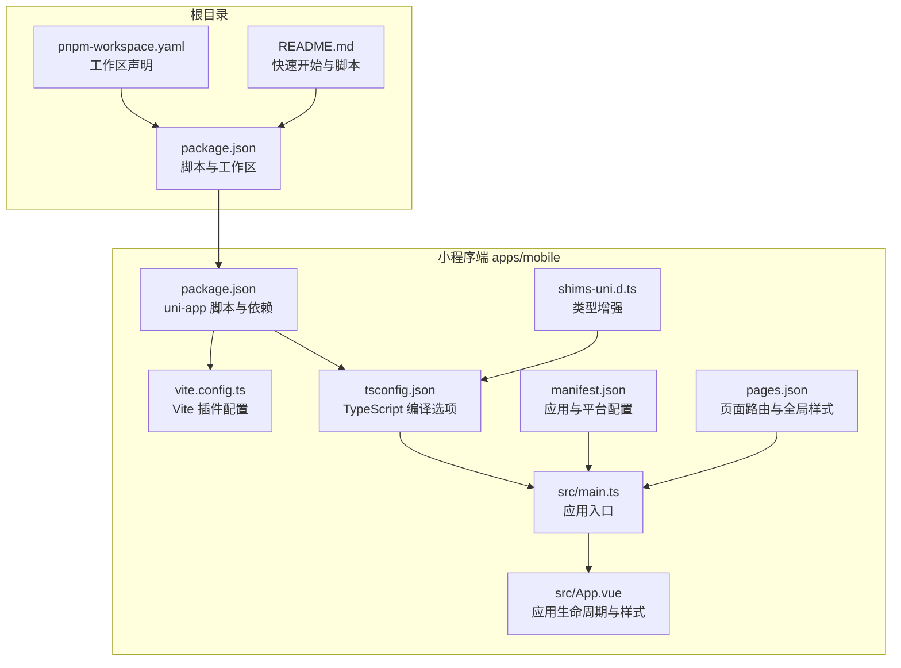
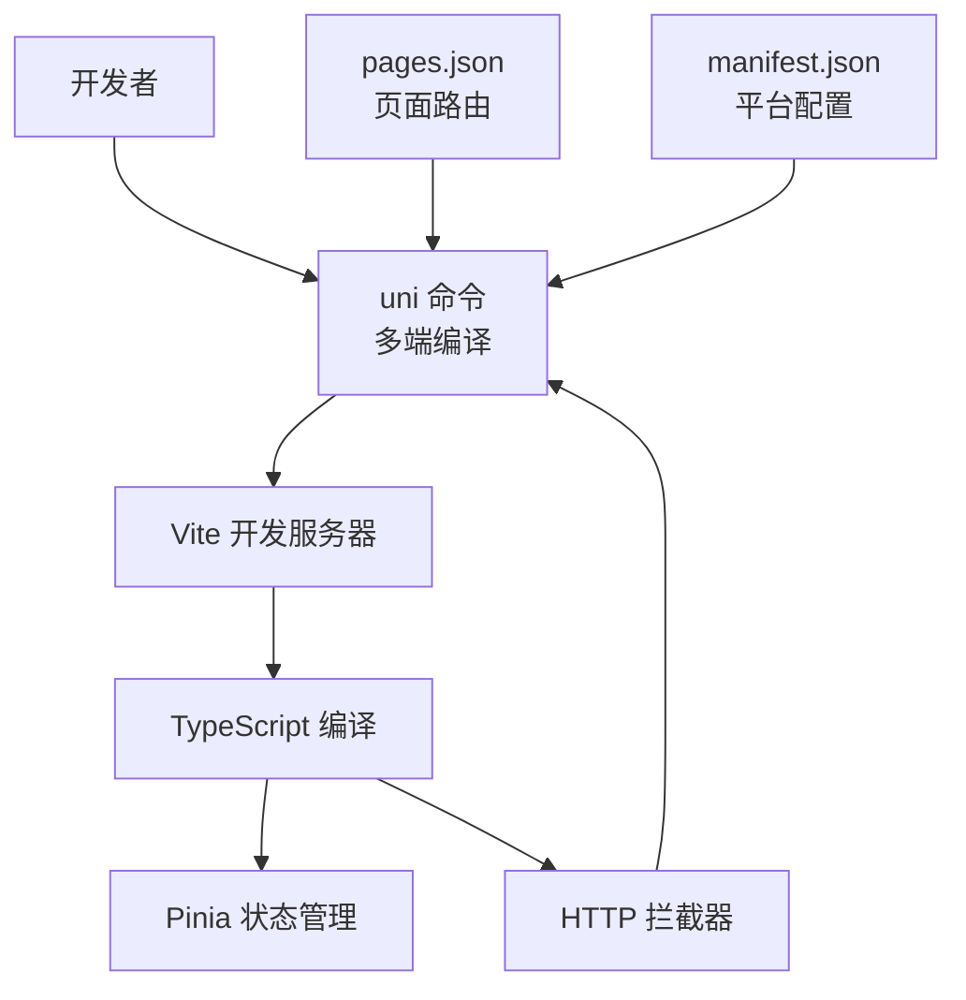
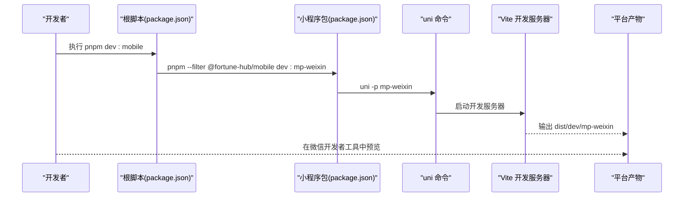
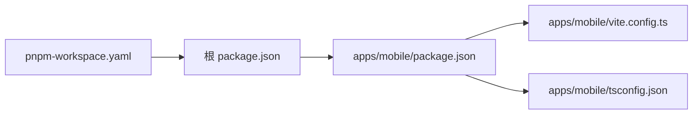

# 开发流程与调试

<cite>
**本文引用的文件**
- [apps/mobile/package.json](file://apps/mobile/package.json)
- [apps/mobile/vite.config.ts](file://apps/mobile/vite.config.ts)
- [apps/mobile/tsconfig.json](file://apps/mobile/tsconfig.json)
- [apps/mobile/src/manifest.json](file://apps/mobile/src/manifest.json)
- [apps/mobile/src/pages.json](file://apps/mobile/src/pages.json)
- [apps/mobile/src/main.ts](file://apps/mobile/src/main.ts)
- [apps/mobile/src/App.vue](file://apps/mobile/src/App.vue)
- [apps/mobile/shims-uni.d.ts](file://apps/mobile/shims-uni.d.ts)
- [package.json](file://package.json)
- [pnpm-workspace.yaml](file://pnpm-workspace.yaml)
- [README.md](file://README.md)
</cite>

## 目录
1. [简介](#简介)
2. [项目结构](#项目结构)
3. [核心组件](#核心组件)
4. [架构总览](#架构总览)
5. [详细组件分析](#详细组件分析)
6. [依赖关系分析](#依赖关系分析)
7. [性能考虑](#性能考虑)
8. [故障排查指南](#故障排查指南)
9. [结论](#结论)
10. [附录](#附录)

## 简介
本指南面向小程序端（uni-app）的开发与调试，聚焦于开发环境搭建（TypeScript、Vite、依赖管理）、调试技巧（开发者工具、远程调试、性能分析）、构建与打包（多端编译、资源优化、代码分割），以及开发效率提升（热重载、自动补全、代码检查）。文档以仓库中的实际配置与脚本为依据，帮助你快速上手并稳定迭代。

## 项目结构
该仓库采用 monorepo 结构，小程序端位于 apps/mobile，使用 uni-app + Vue 3 + TypeScript + Vite + Pinia 的技术栈；根目录通过 pnpm workspace 管理多包；README 提供了整体布局、脚本与本地联调地址。

图表来源
- [package.json:1-23](file://package.json#L1-L23)
- [pnpm-workspace.yaml:1-4](file://pnpm-workspace.yaml#L1-L4)
- [README.md:1-206](file://README.md#L1-L206)
- [apps/mobile/package.json:1-76](file://apps/mobile/package.json#L1-L76)
- [apps/mobile/vite.config.ts:1-8](file://apps/mobile/vite.config.ts#L1-L8)
- [apps/mobile/tsconfig.json:1-14](file://apps/mobile/tsconfig.json#L1-L14)
- [apps/mobile/src/manifest.json:1-56](file://apps/mobile/src/manifest.json#L1-L56)
- [apps/mobile/src/pages.json:1-223](file://apps/mobile/src/pages.json#L1-L223)
- [apps/mobile/src/main.ts:1-15](file://apps/mobile/src/main.ts#L1-L15)
- [apps/mobile/src/App.vue:1-299](file://apps/mobile/src/App.vue#L1-L299)
- [apps/mobile/shims-uni.d.ts:1-11](file://apps/mobile/shims-uni.d.ts#L1-L11)

章节来源
- [README.md:18-37](file://README.md#L18-L37)
- [pnpm-workspace.yaml:1-4](file://pnpm-workspace.yaml#L1-L4)
- [package.json:1-23](file://package.json#L1-L23)

## 核心组件
- 应用入口与状态：小程序端通过 createApp 导出应用实例，注册 Pinia 状态管理，并安装 HTTP 拦截器，确保请求统一处理。
- 页面路由与全局样式：pages.json 定义页面路径、标题与下拉刷新等页面级配置；globalStyle 统一导航栏与背景色。
- 平台配置：manifest.json 配置各小程序平台（如微信、支付宝、百度、字节、快手、QQ、飞书、Harmony）的 appid、编译与组件化设置。
- 构建与脚本：apps/mobile/package.json 提供 uni 命令的多端开发与构建脚本；根 package.json 提供跨包脚本与类型检查。
- 类型系统：tsconfig.json 扩展 @vue/tsconfig，启用 sourceMap、路径别名与 dcloudio 类型；shims-uni.d.ts 为 uni 生命周期钩子提供类型增强。

章节来源
- [apps/mobile/src/main.ts:1-15](file://apps/mobile/src/main.ts#L1-L15)
- [apps/mobile/src/pages.json:1-223](file://apps/mobile/src/pages.json#L1-L223)
- [apps/mobile/src/manifest.json:1-56](file://apps/mobile/src/manifest.json#L1-L56)
- [apps/mobile/package.json:4-38](file://apps/mobile/package.json#L4-L38)
- [package.json:6-22](file://package.json#L6-L22)
- [apps/mobile/tsconfig.json:1-14](file://apps/mobile/tsconfig.json#L1-L14)
- [apps/mobile/shims-uni.d.ts:1-11](file://apps/mobile/shims-uni.d.ts#L1-L11)

## 架构总览
小程序端基于 uni-app 的多端编译能力，通过 Vite 进行开发与构建，TypeScript 提供类型安全，Pinia 管理状态，HTTP 拦截器统一处理请求。pages.json 与 manifest.json 协同定义页面与平台特性，最终输出到各目标平台。

图表来源
- [apps/mobile/package.json:4-38](file://apps/mobile/package.json#L4-L38)
- [apps/mobile/vite.config.ts:1-8](file://apps/mobile/vite.config.ts#L1-L8)
- [apps/mobile/tsconfig.json:1-14](file://apps/mobile/tsconfig.json#L1-L14)
- [apps/mobile/src/pages.json:1-223](file://apps/mobile/src/pages.json#L1-L223)
- [apps/mobile/src/manifest.json:1-56](file://apps/mobile/src/manifest.json#L1-L56)
- [apps/mobile/src/main.ts:1-15](file://apps/mobile/src/main.ts#L1-L15)

## 详细组件分析

### 开发环境与脚本
- 多端开发脚本：apps/mobile/package.json 提供 dev:* 与 build:* 脚本，覆盖 H5、微信、支付宝、百度、字节、快手、QQ、飞书、Harmony、小红书及快应用 WebView 等平台。
- 根脚本：根 package.json 通过 pnpm --filter 将命令定向到 @fortune-hub/mobile 包，便于统一启动与构建。
- 类型检查：apps/mobile/package.json 提供 type-check，结合 tsconfig.json 的编译选项进行类型校验。

章节来源
- [apps/mobile/package.json:4-38](file://apps/mobile/package.json#L4-L38)
- [package.json:6-22](file://package.json#L6-L22)
- [apps/mobile/tsconfig.json:1-14](file://apps/mobile/tsconfig.json#L1-L14)

### TypeScript 配置
- 继承与扩展：tsconfig.json 继承 @vue/tsconfig，启用 sourceMap、路径别名 @/* 指向 src、lib 设置为 esnext 与 dom、引入 dcloudio 类型。
- 类型增强：shims-uni.d.ts 为 uni-app 生命周期钩子提供类型支持，确保在 Vue 文件中正确识别 onLaunch、onShow、onHide 等钩子。

章节来源
- [apps/mobile/tsconfig.json:1-14](file://apps/mobile/tsconfig.json#L1-L14)
- [apps/mobile/shims-uni.d.ts:1-11](file://apps/mobile/shims-uni.d.ts#L1-L11)

### Vite 构建配置
- 插件：vite.config.ts 使用 @dcloudio/vite-plugin-uni，使 Vite 支持 uni-app 的多端编译与运行时特性。
- 开发与构建：配合 uni 命令，Vite 在开发阶段提供热更新，在构建阶段输出各平台产物。

章节来源
- [apps/mobile/vite.config.ts:1-8](file://apps/mobile/vite.config.ts#L1-L8)

### 应用入口与生命周期
- 入口导出：src/main.ts 导出 createApp，安装 HTTP 拦截器，创建 SSR 应用并挂载 Pinia。
- 生命周期：App.vue 中 onLaunch/onShow/onHide 输出日志，便于调试与观察应用生命周期。

章节来源
- [apps/mobile/src/main.ts:1-15](file://apps/mobile/src/main.ts#L1-L15)
- [apps/mobile/src/App.vue:1-15](file://apps/mobile/src/App.vue#L1-L15)

### 页面路由与全局样式
- 页面定义：pages.json 的 pages 数组列出所有页面路径与页面级样式（如导航栏标题、下拉刷新）。
- 全局样式：globalStyle 统一导航栏文字颜色、标题文本、背景色等。

章节来源
- [apps/mobile/src/pages.json:1-223](file://apps/mobile/src/pages.json#L1-L223)

### 平台配置与组件化
- 平台配置：manifest.json 的 mp-weixin 等字段设置 appid、编译与组件化开关、懒加载策略等。
- 组件化：usingComponents:true 保证组件按需渲染与兼容性。

章节来源
- [apps/mobile/src/manifest.json:1-56](file://apps/mobile/src/manifest.json#L1-L56)

### 多端编译与构建流程
- uni 命令：apps/mobile/package.json 中的 dev:* 与 build:* 脚本分别用于开发与构建各平台产物。
- 平台产物输出：README 指明微信小程序默认输出路径为 apps/mobile/dist/dev/mp-weixin。
- H5 预览：提供 dev:h5 与 build:h5 脚本，便于在浏览器中预览。

图表来源
- [package.json:6-22](file://package.json#L6-L22)
- [apps/mobile/package.json:8-16](file://apps/mobile/package.json#L8-L16)

章节来源
- [apps/mobile/package.json:4-38](file://apps/mobile/package.json#L4-L38)
- [README.md:112-115](file://README.md#L112-L115)

### 调试技巧
- 微信开发者工具：使用 dev:mp-weixin 启动后，将 dist/dev/mp-weixin 导入微信开发者工具进行真机调试。
- H5 调试：使用 dev:h5 在浏览器中调试，便于快速验证 UI 与交互。
- 日志与生命周期：App.vue 的 onLaunch/onShow/onHide 可辅助定位应用生命周期问题。
- HTTP 拦截：在 main.ts 中安装拦截器，可在请求/响应阶段插入断点与日志。

章节来源
- [apps/mobile/src/App.vue:1-15](file://apps/mobile/src/App.vue#L1-L15)
- [apps/mobile/src/main.ts:1-15](file://apps/mobile/src/main.ts#L1-L15)
- [README.md:112-115](file://README.md#L112-L115)

### 性能分析与优化
- 懒加载：manifest.json 中的 lazyCodeLoading 设置为 requiredComponents，有助于减少初始包体。
- 组件化：usingComponents:true 有利于按需渲染与缓存。
- 资源优化：结合 pages.json 的页面级样式与全局样式，避免重复渲染与过度绘制。
- 构建优化：Vite 与 @dcloudio/vite-plugin-uni 提供快速热更新与多端编译，建议在开发阶段开启最小化与按需加载策略（视具体平台要求）。

章节来源
- [apps/mobile/src/manifest.json:33-40](file://apps/mobile/src/manifest.json#L33-L40)
- [apps/mobile/src/pages.json:216-222](file://apps/mobile/src/pages.json#L216-L222)
- [apps/mobile/vite.config.ts:1-8](file://apps/mobile/vite.config.ts#L1-L8)

### 代码质量与效率提升
- 类型检查：通过 type-check 与 tsconfig.json 的严格选项，降低运行时错误。
- 自动补全：TypeScript 与 dcloudio 类型提供良好的编辑器智能提示。
- 热重载：Vite 提供快速热更新，提升迭代效率。
- 代码检查：建议在 CI 中集成类型检查与构建任务，确保质量门禁。

章节来源
- [apps/mobile/package.json:37-37](file://apps/mobile/package.json#L37-L37)
- [apps/mobile/tsconfig.json:1-14](file://apps/mobile/tsconfig.json#L1-L14)
- [apps/mobile/vite.config.ts:1-8](file://apps/mobile/vite.config.ts#L1-L8)

## 依赖关系分析
- 工作区：pnpm-workspace.yaml 声明 apps/* 与 services/* 为工作区包，根 package.json 通过 pnpm --filter 统一调度。
- 小程序包：apps/mobile/package.json 声明 uni-app 生态相关依赖与脚本，Vite 与 TypeScript 作为开发与编译核心。
- 类型与插件：tsconfig.json 引入 dcloudio 类型，vite.config.ts 引入 @dcloudio/vite-plugin-uni。

图表来源
- [package.json:1-23](file://package.json#L1-L23)
- [pnpm-workspace.yaml:1-4](file://pnpm-workspace.yaml#L1-L4)
- [apps/mobile/package.json:1-76](file://apps/mobile/package.json#L1-L76)
- [apps/mobile/vite.config.ts:1-8](file://apps/mobile/vite.config.ts#L1-L8)
- [apps/mobile/tsconfig.json:1-14](file://apps/mobile/tsconfig.json#L1-L14)

章节来源
- [pnpm-workspace.yaml:1-4](file://pnpm-workspace.yaml#L1-L4)
- [package.json:1-23](file://package.json#L1-L23)
- [apps/mobile/package.json:1-76](file://apps/mobile/package.json#L1-L76)

## 性能考虑
- 构建阶段：利用 Vite 的快速冷启与热更新，结合 uni 的多端编译，缩短迭代周期。
- 运行阶段：合理使用懒加载与组件化，减少首屏渲染压力；在 pages.json 中精细化控制页面样式与交互。
- 平台差异：不同小程序平台对资源与组件的支持存在差异，建议在对应平台配置中开启合适的优化项。

## 故障排查指南
- 开发工具无法识别类型：确认 tsconfig.json 引入 dcloudio 类型，且 shims-uni.d.ts 正确声明类型增强。
- 页面不显示或样式异常：检查 pages.json 的 pages 与 globalStyle 配置是否正确。
- 平台编译失败：核对 manifest.json 中对应平台的 setting、appid 与 usingComponents 配置。
- 热更新无效：确认使用 uni 命令启动开发，且未禁用 HMR；同时检查 Vite 插件配置。
- 类型检查报错：执行 type-check 脚本，逐项修复类型问题。

章节来源
- [apps/mobile/tsconfig.json:1-14](file://apps/mobile/tsconfig.json#L1-L14)
- [apps/mobile/shims-uni.d.ts:1-11](file://apps/mobile/shims-uni.d.ts#L1-L11)
- [apps/mobile/src/pages.json:1-223](file://apps/mobile/src/pages.json#L1-L223)
- [apps/mobile/src/manifest.json:1-56](file://apps/mobile/src/manifest.json#L1-L56)
- [apps/mobile/vite.config.ts:1-8](file://apps/mobile/vite.config.ts#L1-L8)
- [apps/mobile/package.json:37-37](file://apps/mobile/package.json#L37-L37)

## 结论
本指南基于仓库现有配置，总结了小程序端的开发与调试流程：以 uni-app + Vite + TypeScript 为核心，配合 Pinia 与 HTTP 拦截器，通过 pages.json 与 manifest.json 管理页面与平台特性，借助多端脚本与根级脚本实现高效联调与构建。建议在日常开发中坚持类型检查、热更新与组件化实践，以获得更稳定的开发体验与更优的运行性能。

## 附录
- 快速开始与本地联调地址见 README 的“Quick Start”与“Local Development URLs”部分。
- 多端脚本与平台产物输出路径见 apps/mobile/package.json 与 README。

章节来源
- [README.md:66-137](file://README.md#L66-L137)
- [README.md:112-115](file://README.md#L112-L115)
- [apps/mobile/package.json:4-38](file://apps/mobile/package.json#L4-L38)