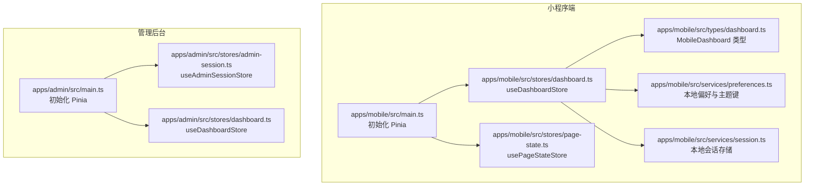
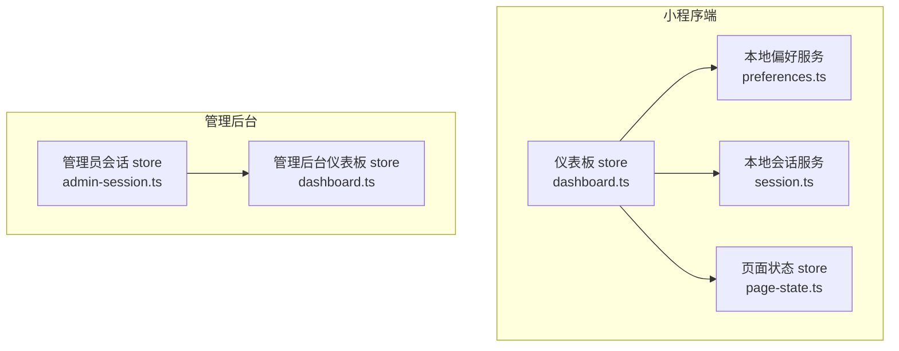
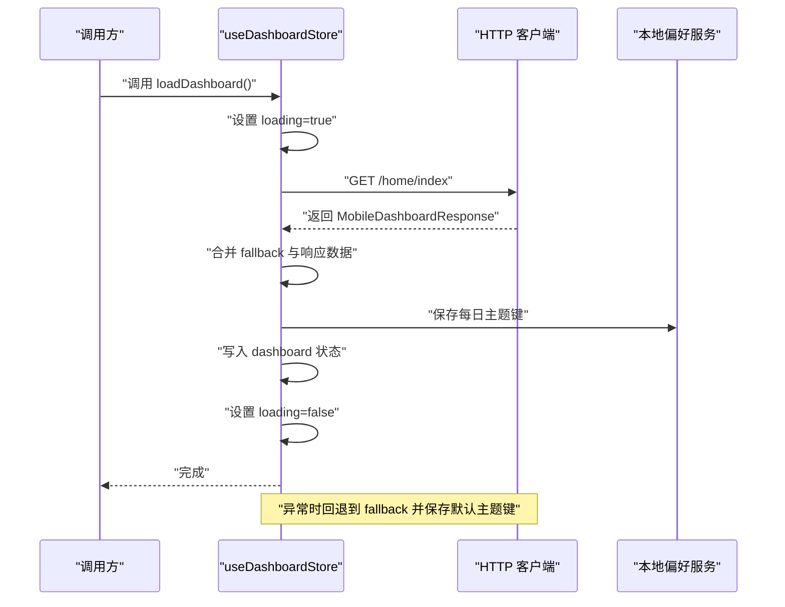
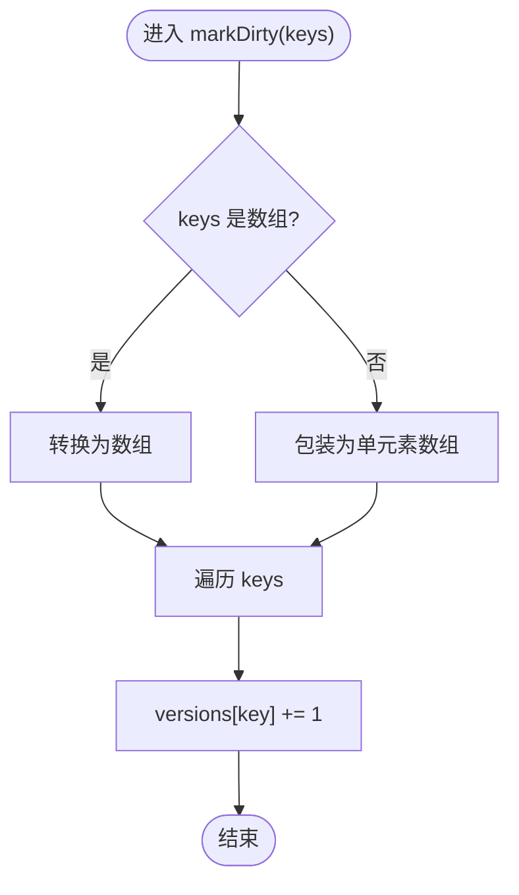
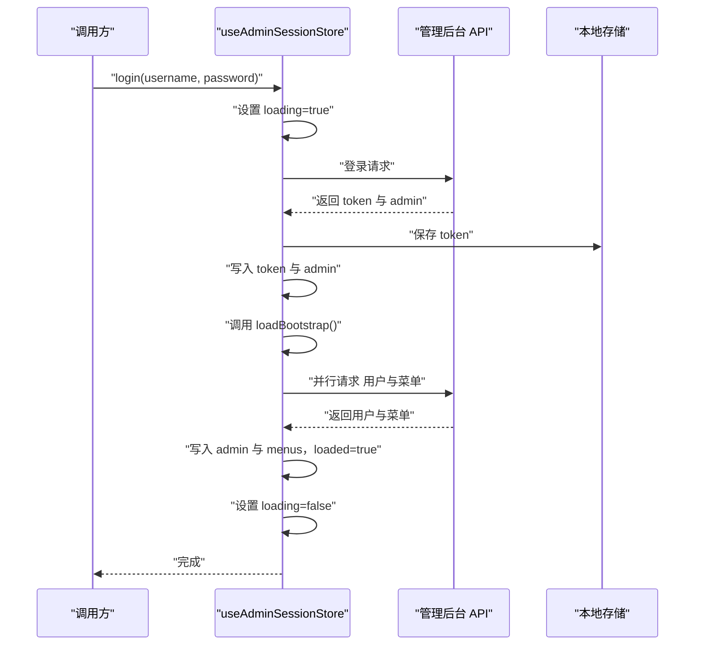
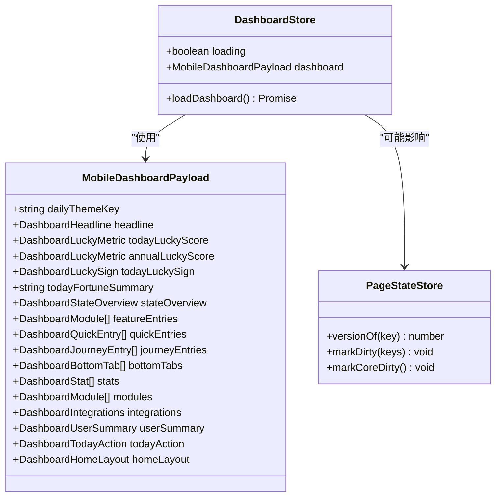
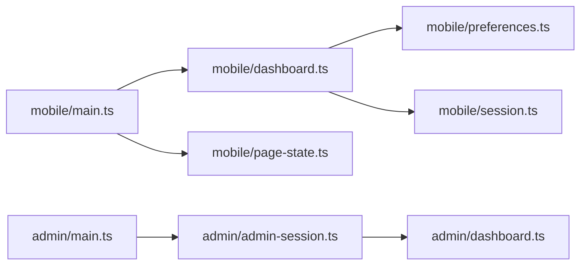

# 状态管理

<cite>
**本文引用的文件**
- [apps/mobile/src/main.ts](file://apps/mobile/src/main.ts)
- [apps/admin/src/main.ts](file://apps/admin/src/main.ts)
- [apps/mobile/src/stores/dashboard.ts](file://apps/mobile/src/stores/dashboard.ts)
- [apps/mobile/src/stores/page-state.ts](file://apps/mobile/src/stores/page-state.ts)
- [apps/admin/src/stores/admin-session.ts](file://apps/admin/src/stores/admin-session.ts)
- [apps/admin/src/stores/dashboard.ts](file://apps/admin/src/stores/dashboard.ts)
- [apps/mobile/src/types/dashboard.ts](file://apps/mobile/src/types/dashboard.ts)
- [apps/mobile/src/services/preferences.ts](file://apps/mobile/src/services/preferences.ts)
- [apps/mobile/src/services/session.ts](file://apps/mobile/src/services/session.ts)
- [apps/mobile/src/composables/useFavoriteToggle.ts](file://apps/mobile/src/composables/useFavoriteToggle.ts)
- [apps/mobile/src/composables/useThemePreference.ts](file://apps/mobile/src/composables/useThemePreference.ts)
</cite>

## 目录
1. [简介](#简介)
2. [项目结构](#项目结构)
3. [核心组件](#核心组件)
4. [架构总览](#架构总览)
5. [详细组件分析](#详细组件分析)
6. [依赖分析](#依赖分析)
7. [性能考虑](#性能考虑)
8. [故障排查指南](#故障排查指南)
9. [结论](#结论)
10. [附录](#附录)

## 简介
本文件系统性梳理小程序端与管理后台在 Pinia 状态管理上的落地实践，覆盖 store 设计模式、状态持久化、模块化组织、业务职责划分（仪表板、页面状态管理）、最佳实践（状态设计原则、异步处理、状态同步策略），以及调试技巧与性能优化建议。文档同时给出关键流程的时序图与类图，帮助读者快速把握代码结构与数据流。

## 项目结构
- 小程序端与管理后台分别在各自应用内初始化 Pinia，并按业务域拆分 store。
- 小程序端包含仪表板 store 与页面版本控制 store；管理后台包含管理员会话与仪表板 store。
- 类型定义集中在小程序端的 dashboard 类型文件，为 store 的数据契约提供约束。

图表来源
- [apps/mobile/src/main.ts:1-15](file://apps/mobile/src/main.ts#L1-L15)
- [apps/admin/src/main.ts:1-15](file://apps/admin/src/main.ts#L1-L15)
- [apps/mobile/src/stores/dashboard.ts:1-382](file://apps/mobile/src/stores/dashboard.ts#L1-L382)
- [apps/mobile/src/stores/page-state.ts:1-56](file://apps/mobile/src/stores/page-state.ts#L1-L56)
- [apps/admin/src/stores/admin-session.ts:1-65](file://apps/admin/src/stores/admin-session.ts#L1-L65)
- [apps/admin/src/stores/dashboard.ts:1-40](file://apps/admin/src/stores/dashboard.ts#L1-L40)
- [apps/mobile/src/types/dashboard.ts:1-168](file://apps/mobile/src/types/dashboard.ts#L1-L168)
- [apps/mobile/src/services/preferences.ts:1-73](file://apps/mobile/src/services/preferences.ts#L1-L73)
- [apps/mobile/src/services/session.ts:1-56](file://apps/mobile/src/services/session.ts#L1-L56)

章节来源
- [apps/mobile/src/main.ts:1-15](file://apps/mobile/src/main.ts#L1-L15)
- [apps/admin/src/main.ts:1-15](file://apps/admin/src/main.ts#L1-L15)

## 核心组件
- 小程序端仪表板 store（useDashboardStore）
  - 职责：拉取并缓存移动端首页仪表板数据，合并默认值与远端响应，持久化每日主题键，处理加载状态与异常回退。
  - 关键点：使用 HTTP 客户端请求接口，合并 fallback 与远端数据，最终写入 store 状态。
- 页面状态 store（usePageStateStore）
  - 职责：维护页面版本号映射，提供标记脏页能力，用于触发视图刷新与缓存失效。
  - 关键点：通过版本号递增实现“脏标记”，支持对一组页面批量标记。
- 管理后台会话 store（useAdminSessionStore）
  - 职责：管理管理员登录态、菜单与用户信息，支持登录、引导加载与登出。
  - 关键点：登录成功后并行拉取用户与菜单，确保加载完成标志位正确设置。
- 管理后台仪表板 store（useDashboardStore）
  - 职责：加载运营仪表板聚合数据，提供加载状态与异常回退。
  - 关键点：使用 API 获取聚合指标与图表数据，失败时回退到默认空数据。

章节来源
- [apps/mobile/src/stores/dashboard.ts:342-382](file://apps/mobile/src/stores/dashboard.ts#L342-L382)
- [apps/mobile/src/stores/page-state.ts:23-56](file://apps/mobile/src/stores/page-state.ts#L23-L56)
- [apps/admin/src/stores/admin-session.ts:15-65](file://apps/admin/src/stores/admin-session.ts#L15-L65)
- [apps/admin/src/stores/dashboard.ts:22-40](file://apps/admin/src/stores/dashboard.ts#L22-L40)

## 架构总览
Pinia 在两端均作为全局状态容器，通过 defineStore 定义业务域 store，结合本地存储与服务端 API 实现状态持久化与同步。

图表来源
- [apps/mobile/src/stores/dashboard.ts:1-382](file://apps/mobile/src/stores/dashboard.ts#L1-L382)
- [apps/mobile/src/stores/page-state.ts:1-56](file://apps/mobile/src/stores/page-state.ts#L1-L56)
- [apps/admin/src/stores/admin-session.ts:1-65](file://apps/admin/src/stores/admin-session.ts#L1-L65)
- [apps/admin/src/stores/dashboard.ts:1-40](file://apps/admin/src/stores/dashboard.ts#L1-L40)
- [apps/mobile/src/services/preferences.ts:1-73](file://apps/mobile/src/services/preferences.ts#L1-L73)
- [apps/mobile/src/services/session.ts:1-56](file://apps/mobile/src/services/session.ts#L1-L56)

## 详细组件分析

### 小程序端仪表板 store（useDashboardStore）
- 设计要点
  - 使用 defineStore 定义状态与动作，状态包含 loading 与 dashboard 对象。
  - 动作 loadDashboard 中进行网络请求，合并 fallback 与远端响应，持久化每日主题键，最后写入状态。
  - 异常时回退到 fallback 并持久化默认主题键，finally 统一关闭 loading。
- 数据模型
  - MobileDashboardPayload 与 MobileDashboardResponse 定义了完整的仪表板数据结构，涵盖标题、评分、运势签、状态概览、功能入口、快捷入口、旅程入口、底部标签、统计项、模块、集成信息、用户摘要、今日行动与首页布局等。
- 最佳实践
  - 合并与回退：始终以 fallback 为基础，仅覆盖远端返回字段，保证 UI 结构稳定。
  - 主题键持久化：在成功与失败分支均保存主题键，确保主题一致性。
  - 加载状态：统一设置 loading，避免 UI 瞬间闪烁。
- 可能的优化
  - 针对大对象合并可引入深拷贝策略，降低副作用风险。
  - 对远端字段进行白名单合并，避免未知字段污染。

图表来源
- [apps/mobile/src/stores/dashboard.ts:347-380](file://apps/mobile/src/stores/dashboard.ts#L347-L380)
- [apps/mobile/src/services/preferences.ts:53-55](file://apps/mobile/src/services/preferences.ts#L53-L55)

章节来源
- [apps/mobile/src/stores/dashboard.ts:342-382](file://apps/mobile/src/stores/dashboard.ts#L342-L382)
- [apps/mobile/src/types/dashboard.ts:142-168](file://apps/mobile/src/types/dashboard.ts#L142-L168)

### 页面状态 store（usePageStateStore）
- 设计要点
  - 使用组合式 defineStore，内部以 ref 维护页面版本号映射。
  - 提供 versionOf、markDirty、markCoreDirty 三个方法，用于查询与标记脏页。
  - 默认页面集合包含首页、探索、记录、我的、收藏、设置、幸运等。
- 最佳实践
  - 脏标记应与业务变更点对齐，例如收藏、记录、设置修改等。
  - markCoreDirty 可用于触发核心页面的统一刷新。
- 可能的优化
  - 版本号可抽象为通用的“版本令牌”机制，便于跨模块共享。

图表来源
- [apps/mobile/src/stores/page-state.ts:38-48](file://apps/mobile/src/stores/page-state.ts#L38-L48)

章节来源
- [apps/mobile/src/stores/page-state.ts:23-56](file://apps/mobile/src/stores/page-state.ts#L23-L56)

### 管理后台会话 store（useAdminSessionStore）
- 设计要点
  - 状态包含 token、admin、menus、loading、loaded。
  - login 登录成功后写入 token 与 admin，并调用 loadBootstrap 并行拉取用户与菜单。
  - loadBootstrap 在无 token 时清空状态并置 loaded=false。
  - logout 清除 token 与会话状态。
- 最佳实践
  - 并行加载用户与菜单，缩短引导时间。
  - 登录态变更后及时持久化 token。

图表来源
- [apps/admin/src/stores/admin-session.ts:27-55](file://apps/admin/src/stores/admin-session.ts#L27-L55)

章节来源
- [apps/admin/src/stores/admin-session.ts:15-65](file://apps/admin/src/stores/admin-session.ts#L15-L65)

### 管理后台仪表板 store（useDashboardStore）
- 设计要点
  - 状态包含 loading 与 dashboard。
  - 动作 load 通过 API 拉取运营数据，失败时回退到默认空数据。
- 最佳实践
  - 默认值应覆盖所有字段，避免 UI 展示空缺。
  - 加载状态与异常回退需一致化处理。

章节来源
- [apps/admin/src/stores/dashboard.ts:22-40](file://apps/admin/src/stores/dashboard.ts#L22-L40)

### 类关系与数据模型
以下类图展示了小程序端仪表板 store 与类型之间的关系，以及页面状态 store 的简单结构。

图表来源
- [apps/mobile/src/stores/dashboard.ts:342-382](file://apps/mobile/src/stores/dashboard.ts#L342-L382)
- [apps/mobile/src/stores/page-state.ts:23-56](file://apps/mobile/src/stores/page-state.ts#L23-L56)
- [apps/mobile/src/types/dashboard.ts:142-168](file://apps/mobile/src/types/dashboard.ts#L142-L168)

## 依赖分析
- 初始化与注入
  - 小程序端与管理后台均在各自的 main 文件中安装 Pinia，确保全局可用。
- store 间耦合
  - 小程序端仪表板 store 与页面状态 store 通过动作调用间接关联（例如收藏切换后标记页面脏）。
  - 管理后台 store 之间无直接依赖，职责清晰分离。
- 外部依赖
  - 小程序端仪表板 store 依赖本地偏好服务（主题键持久化）与本地会话服务（token 读取）。
  - 管理后台会话 store 依赖本地存储与管理后台 API。

图表来源
- [apps/mobile/src/main.ts:1-15](file://apps/mobile/src/main.ts#L1-L15)
- [apps/admin/src/main.ts:1-15](file://apps/admin/src/main.ts#L1-L15)
- [apps/mobile/src/stores/dashboard.ts:1-10](file://apps/mobile/src/stores/dashboard.ts#L1-L10)
- [apps/mobile/src/services/preferences.ts:1-73](file://apps/mobile/src/services/preferences.ts#L1-L73)
- [apps/mobile/src/services/session.ts:1-56](file://apps/mobile/src/services/session.ts#L1-L56)
- [apps/admin/src/stores/admin-session.ts:1-14](file://apps/admin/src/stores/admin-session.ts#L1-L14)

章节来源
- [apps/mobile/src/main.ts:1-15](file://apps/mobile/src/main.ts#L1-L15)
- [apps/admin/src/main.ts:1-15](file://apps/admin/src/main.ts#L1-L15)

## 性能考虑
- 网络请求与加载状态
  - 统一设置 loading，避免频繁重绘与闪烁。
  - 并行加载多个数据源（如管理后台的用户与菜单）以缩短引导时间。
- 数据合并与回退
  - 采用 fallback 合并策略，减少字段缺失导致的渲染异常。
  - 对大对象合并建议白名单策略，避免未知字段污染。
- 本地持久化
  - 主题键与用户偏好等轻量数据使用本地存储，减少重复请求。
  - 会话 token 清理需彻底，避免残留状态影响后续登录。
- 页面刷新策略
  - 使用页面版本标记（脏标记）精确控制刷新范围，避免全量刷新带来的性能损耗。

## 故障排查指南
- 仪表板加载失败
  - 现象：UI 显示默认 fallback。
  - 排查：检查网络请求是否抛错、fallback 是否完整、主题键是否被正确保存。
  - 参考路径：[apps/mobile/src/stores/dashboard.ts:347-380](file://apps/mobile/src/stores/dashboard.ts#L347-L380)
- 收藏状态不同步
  - 现象：收藏按钮状态与服务端不一致。
  - 排查：确认已登录、toggle 接口返回 active、页面脏标记是否触发刷新。
  - 参考路径：[apps/mobile/src/composables/useFavoriteToggle.ts:28-65](file://apps/mobile/src/composables/useFavoriteToggle.ts#L28-L65)
- 主题设置未生效
  - 现象：切换主题后样式未更新。
  - 排查：确认偏好设置已保存、每日主题键是否持久化、主题解析逻辑是否正常。
  - 参考路径：[apps/mobile/src/composables/useThemePreference.ts:120-148](file://apps/mobile/src/composables/useThemePreference.ts#L120-L148)
- 管理后台登录后无数据
  - 现象：登录成功但菜单与用户为空。
  - 排查：确认 token 已保存、并行加载是否成功、loaded 标志位是否置位。
  - 参考路径：[apps/admin/src/stores/admin-session.ts:39-55](file://apps/admin/src/stores/admin-session.ts#L39-L55)

章节来源
- [apps/mobile/src/stores/dashboard.ts:347-380](file://apps/mobile/src/stores/dashboard.ts#L347-L380)
- [apps/mobile/src/composables/useFavoriteToggle.ts:28-65](file://apps/mobile/src/composables/useFavoriteToggle.ts#L28-L65)
- [apps/mobile/src/composables/useThemePreference.ts:120-148](file://apps/mobile/src/composables/useThemePreference.ts#L120-L148)
- [apps/admin/src/stores/admin-session.ts:39-55](file://apps/admin/src/stores/admin-session.ts#L39-L55)

## 结论
本项目在 Pinia 的基础上实现了清晰的业务域划分与稳定的运行时行为：小程序端通过仪表板与页面状态 store 实现首页数据与视图刷新控制，管理后台通过会话与仪表板 store 实现登录态与运营数据管理。配合本地持久化与类型约束，整体具备良好的可维护性与扩展性。建议在后续迭代中进一步细化数据合并策略、完善错误边界与日志埋点，以提升可观测性与稳定性。

## 附录
- 状态设计原则
  - 以类型驱动数据结构，确保字段完备与默认值一致。
  - 使用 fallback 合并策略，保证 UI 稳定性。
  - 将轻量状态放入本地存储，减少网络依赖。
- 异步操作处理
  - 统一设置 loading，异常时回退到 fallback。
  - 并行加载多个数据源，缩短引导时间。
- 状态同步策略
  - 通过“脏标记”精确控制刷新范围，避免全量刷新。
  - 对外暴露统一的同步函数，确保服务端与本地状态一致。