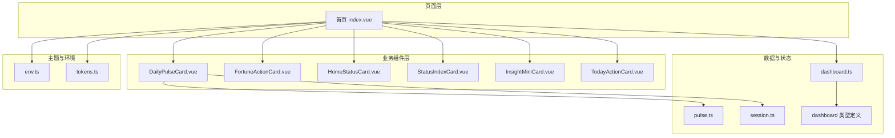
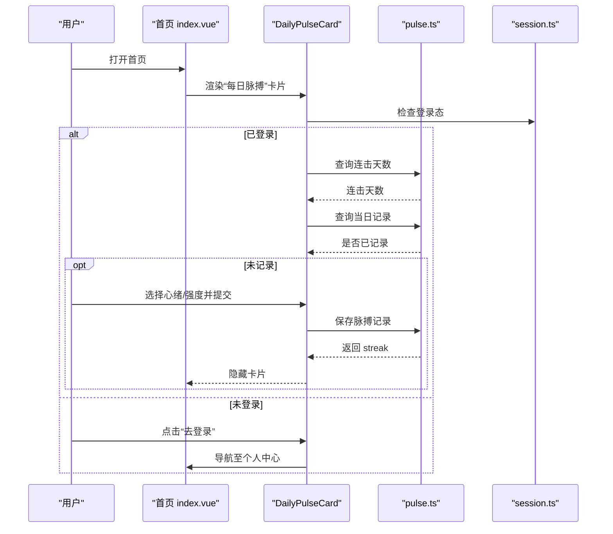
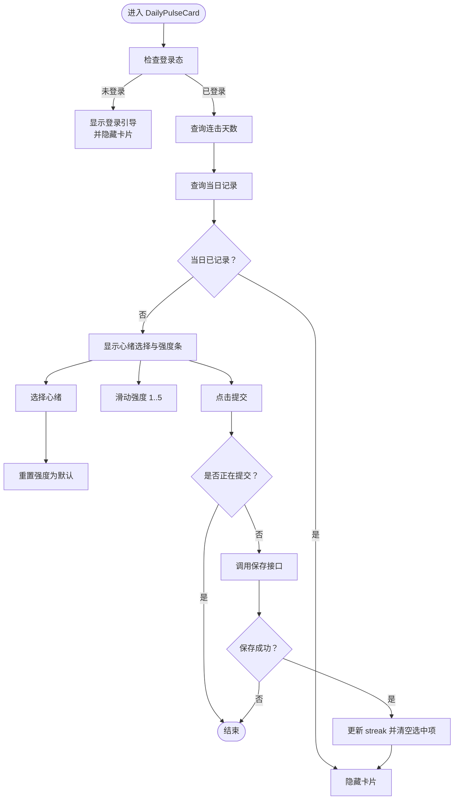
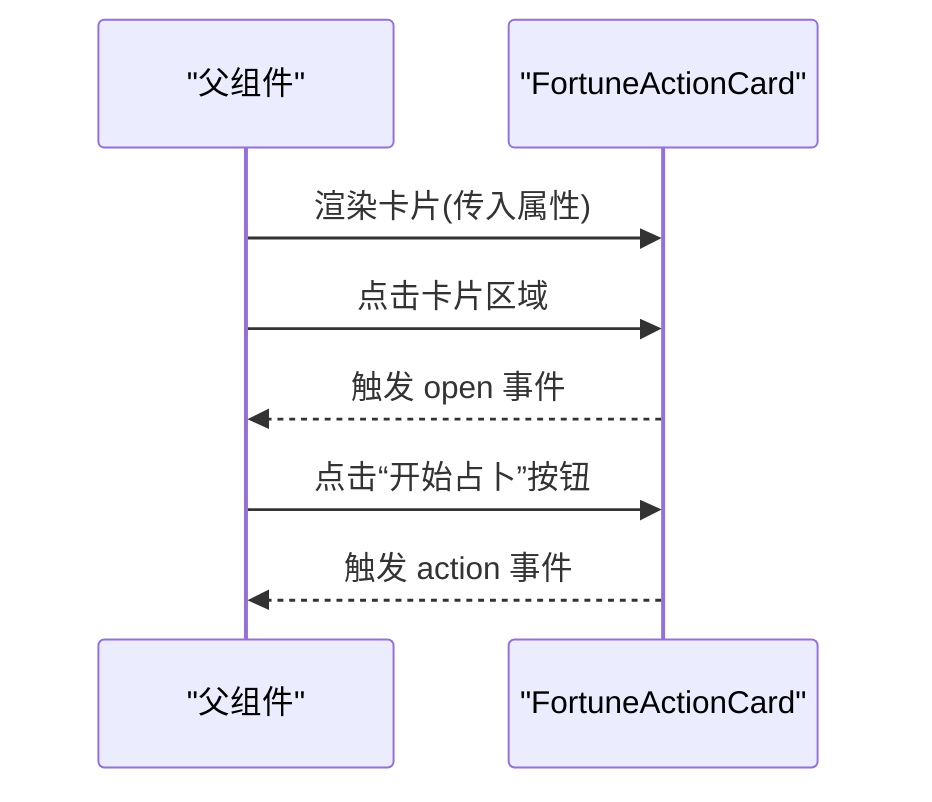
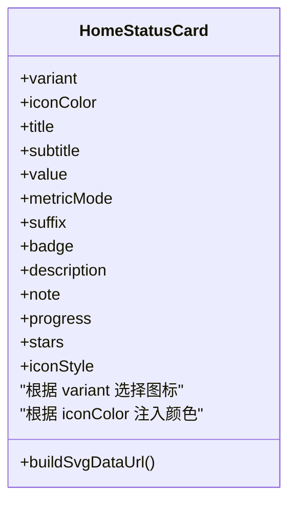
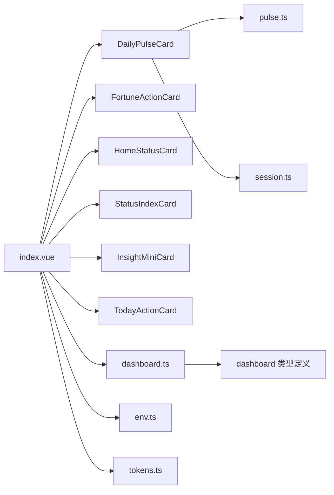

# 业务组件

<cite>
**本文引用的文件**   
- [DailyPulseCard.vue](file://apps/mobile/src/components/DailyPulseCard.vue)
- [FortuneActionCard.vue](file://apps/mobile/src/components/FortuneActionCard.vue)
- [HomeStatusCard.vue](file://apps/mobile/src/components/HomeStatusCard.vue)
- [StatusIndexCard.vue](file://apps/mobile/src/components/StatusIndexCard.vue)
- [InsightMiniCard.vue](file://apps/mobile/src/components/InsightMiniCard.vue)
- [TodayActionCard.vue](file://apps/mobile/src/components/TodayActionCard.vue)
- [pulse.ts](file://apps/mobile/src/api/pulse.ts)
- [session.ts](file://apps/mobile/src/services/session.ts)
- [dashboard.ts](file://apps/mobile/src/stores/dashboard.ts)
- [index.vue](file://apps/mobile/src/pages/index/index.vue)
- [env.ts](file://apps/mobile/src/config/env.ts)
- [tokens.ts](file://apps/mobile/src/theme/tokens.ts)
- [dashboard 类型定义](file://apps/mobile/src/types/dashboard.ts)
</cite>

## 目录
1. [简介](#简介)
2. [项目结构](#项目结构)
3. [核心组件](#核心组件)
4. [架构总览](#架构总览)
5. [详细组件分析](#详细组件分析)
6. [依赖分析](#依赖分析)
7. [性能考虑](#性能考虑)
8. [故障排查指南](#故障排查指南)
9. [结论](#结论)
10. [附录：开发模板与最佳实践](#附录开发模板与最佳实践)

## 简介
本文件聚焦于移动端业务组件的开发与应用，围绕 DailyPulseCard（每日脉搏卡片）、FortuneActionCard（运势行动卡片）、HomeStatusCard（首页状态卡片）等核心组件，系统阐述其设计理念、数据流、状态管理与用户交互，并给出父子组件通信、事件传递机制、错误处理、加载与空数据处理的最佳实践与模板。

## 项目结构
移动端采用基于功能域的组件组织方式，业务组件位于 components 目录，页面级容器在 pages 下，数据访问通过 api 层，状态管理由 stores 提供，主题与环境变量在 theme 与 config 中统一注入。

图表来源
- [index.vue:1-125](file://apps/mobile/src/pages/index/index.vue#L1-L125)
- [DailyPulseCard.vue:1-68](file://apps/mobile/src/components/DailyPulseCard.vue#L1-L68)
- [FortuneActionCard.vue:1-35](file://apps/mobile/src/components/FortuneActionCard.vue#L1-L35)
- [HomeStatusCard.vue:1-42](file://apps/mobile/src/components/HomeStatusCard.vue#L1-L42)
- [StatusIndexCard.vue:1-58](file://apps/mobile/src/components/StatusIndexCard.vue#L1-L58)
- [InsightMiniCard.vue:1-42](file://apps/mobile/src/components/InsightMiniCard.vue#L1-L42)
- [TodayActionCard.vue:1-27](file://apps/mobile/src/components/TodayActionCard.vue#L1-L27)
- [pulse.ts:1-47](file://apps/mobile/src/api/pulse.ts#L1-L47)
- [session.ts:1-56](file://apps/mobile/src/services/session.ts#L1-L56)
- [dashboard.ts:1-382](file://apps/mobile/src/stores/dashboard.ts#L1-L382)
- [dashboard 类型定义:1-168](file://apps/mobile/src/types/dashboard.ts#L1-L168)
- [env.ts:1-41](file://apps/mobile/src/config/env.ts#L1-L41)
- [tokens.ts:1-52](file://apps/mobile/src/theme/tokens.ts#L1-L52)

章节来源
- [index.vue:1-125](file://apps/mobile/src/pages/index/index/index.vue#L1-L125)

## 核心组件
- DailyPulseCard：封装“记录每日心绪”的业务流程，负责登录态判断、连击天数查询、当日是否已记录检查、提交心绪与强度，并在提交后隐藏自身。
- FortuneActionCard：通用“行动卡片”，用于承载“今日占卜”等动作入口，支持标签、文案与按钮点击事件透传。
- HomeStatusCard：通用“状态卡片”，用于展示指标值、进度、星评等，支持多种变体与图标渲染。
- StatusIndexCard：首页“状态指数卡片”，聚合分数、进度、证据、标签与操作按钮，作为首页主状态入口。
- InsightMiniCard：首页洞察网格中的迷你卡片，支持评分、等级、星评三种度量模式。
- TodayActionCard：首页“今日行动”卡片，提供主次两个操作按钮，引导用户完成下一步。

章节来源
- [DailyPulseCard.vue:1-164](file://apps/mobile/src/components/DailyPulseCard.vue#L1-L164)
- [FortuneActionCard.vue:1-50](file://apps/mobile/src/components/FortuneActionCard.vue#L1-L50)
- [HomeStatusCard.vue:1-100](file://apps/mobile/src/components/HomeStatusCard.vue#L1-L100)
- [StatusIndexCard.vue:1-111](file://apps/mobile/src/components/StatusIndexCard.vue#L1-L111)
- [InsightMiniCard.vue:1-101](file://apps/mobile/src/components/InsightMiniCard.vue#L1-L101)
- [TodayActionCard.vue:1-48](file://apps/mobile/src/components/TodayActionCard.vue#L1-L48)

## 架构总览
组件间协作以页面 index.vue 为中枢，通过 Pinia store 获取仪表盘数据，按布局 sections 动态渲染各类卡片；卡片之间通过 props 与 emits 实现单向数据流与事件冒泡，API 层负责与后端交互，session 负责本地认证态管理。

图表来源
- [index.vue:1-125](file://apps/mobile/src/pages/index/index.vue#L1-L125)
- [DailyPulseCard.vue:99-151](file://apps/mobile/src/components/DailyPulseCard.vue#L99-L151)
- [pulse.ts:29-46](file://apps/mobile/src/api/pulse.ts#L29-L46)
- [session.ts:15-17](file://apps/mobile/src/services/session.ts#L15-L17)

## 详细组件分析

### DailyPulseCard 组件分析
- 设计理念
  - 以“登录态驱动可见性”为核心：未登录时显示引导登录区域；已登录则查询连击天数与当日记录，若未记录则显示心绪选择与强度滑动条。
  - 以“提交即完成”为目标：提交成功后刷新 streak 并隐藏卡片，避免重复提交。
- 数据获取与状态管理
  - 登录态：通过 session.ts 的 getAuthToken 判断。
  - 连击天数：调用 fetchPulseStreak。
  - 当日记录：调用 fetchPulseHistory，以当天日期键过滤。
  - 提交记录：调用 saveDailyPulse，返回 streak 并清空选中项。
- 用户交互
  - 心绪选择：选中后重置强度为默认值。
  - 强度滑动：点击 1-5 步骤条更新强度。
  - 提交按钮：防重复提交，loading 状态，失败静默处理。
- 错误处理与边界
  - 查询失败时静默处理，保证卡片可见性不受影响。
  - 未登录点击提交时跳转个人中心。
- 代码片段路径
  - [onMounted 初始化与可见性控制:99-123](file://apps/mobile/src/components/DailyPulseCard.vue#L99-L123)
  - [提交流程与 loading 控制:130-151](file://apps/mobile/src/components/DailyPulseCard.vue#L130-L151)
  - [跳转个人中心:153-155](file://apps/mobile/src/components/DailyPulseCard.vue#L153-L155)

图表来源
- [DailyPulseCard.vue:99-151](file://apps/mobile/src/components/DailyPulseCard.vue#L99-L151)
- [pulse.ts:29-46](file://apps/mobile/src/api/pulse.ts#L29-L46)
- [session.ts:15-17](file://apps/mobile/src/services/session.ts#L15-L17)

章节来源
- [DailyPulseCard.vue:70-164](file://apps/mobile/src/components/DailyPulseCard.vue#L70-L164)
- [pulse.ts:1-47](file://apps/mobile/src/api/pulse.ts#L1-L47)
- [session.ts:1-56](file://apps/mobile/src/services/session.ts#L1-L56)

### FortuneActionCard 组件分析
- 设计理念
  - 通用“行动卡片”容器，承载标题、摘要、标签与按钮，支持整体点击与按钮点击事件透传，便于上层页面统一路由与埋点。
- 交互与事件
  - 整体点击触发 open 事件，按钮点击触发 action 事件，均通过 $emit 向父组件传递。
- 代码片段路径
  - [事件定义与触发:2-23](file://apps/mobile/src/components/FortuneActionCard.vue#L2-L23)
  - [属性定义:37-49](file://apps/mobile/src/components/FortuneActionCard.vue#L37-L49)

图表来源
- [FortuneActionCard.vue:2-23](file://apps/mobile/src/components/FortuneActionCard.vue#L2-L23)

章节来源
- [FortuneActionCard.vue:1-50](file://apps/mobile/src/components/FortuneActionCard.vue#L1-L50)

### HomeStatusCard 组件分析
- 设计理念
  - 以“指标可视化”为核心，支持分数、等级、星评三种度量模式；通过 variant 与 iconColor 动态切换图标与配色；支持描述与备注文本截断展示。
- 图标渲染
  - 通过内联 SVG 数据 URI 方式，将 SVG 标记中的 currentColor 替换为传入颜色，实现主题色一致。
- 代码片段路径
  - [SVG 图标映射与数据 URI 构建:79-99](file://apps/mobile/src/components/HomeStatusCard.vue#L79-L99)

图表来源
- [HomeStatusCard.vue:45-99](file://apps/mobile/src/components/HomeStatusCard.vue#L45-L99)

章节来源
- [HomeStatusCard.vue:1-100](file://apps/mobile/src/components/HomeStatusCard.vue#L1-L100)

### StatusIndexCard 与 InsightMiniCard 协同
- 协同关系
  - StatusIndexCard 作为首页主状态入口，展示综合分数与证据；InsightMiniCard 作为洞察网格中的子卡片，展示各维度指标与进度。
  - 两者均支持标签胶囊、进度条与操作按钮，风格统一，便于用户在不同粒度间切换。
- 代码片段路径
  - [StatusIndexCard 事件与标签格式化:68-111](file://apps/mobile/src/components/StatusIndexCard.vue#L68-L111)
  - [InsightMiniCard 图标与进度计算:81-100](file://apps/mobile/src/components/InsightMiniCard.vue#L81-L100)

章节来源
- [StatusIndexCard.vue:60-111](file://apps/mobile/src/components/StatusIndexCard.vue#L60-L111)
- [InsightMiniCard.vue:44-101](file://apps/mobile/src/components/InsightMiniCard.vue#L44-L101)

### TodayActionCard 组件分析
- 设计理念
  - 以“今日行动”为主题，强调“一步行动”的引导，提供主次两个按钮，便于快速决策与执行。
- 代码片段路径
  - [事件定义与默认属性:29-48](file://apps/mobile/src/components/TodayActionCard.vue#L29-L48)

章节来源
- [TodayActionCard.vue:1-48](file://apps/mobile/src/components/TodayActionCard.vue#L1-L48)

## 依赖分析
- 页面到组件
  - 首页 index.vue 通过 computed 与 store 决定 sections 渲染顺序与内容，动态引入各业务组件并传入 props。
- 组件到 API
  - DailyPulseCard 依赖 pulse.ts 的保存与查询接口；FortuneActionCard 与 TodayActionCard 通过事件驱动导航。
- 组件到状态
  - 首页 store dashboard.ts 提供仪表盘数据，组件通过 props 接收并渲染。
- 组件到主题与环境
  - 主题 palette 与环境变量 appEnv 在页面层注入，组件通过样式变量与主题常量保持视觉一致性。

图表来源
- [index.vue:1-125](file://apps/mobile/src/pages/index/index.vue#L1-L125)
- [pulse.ts:1-47](file://apps/mobile/src/api/pulse.ts#L1-L47)
- [session.ts:1-56](file://apps/mobile/src/services/session.ts#L1-L56)
- [dashboard.ts:1-382](file://apps/mobile/src/stores/dashboard.ts#L1-L382)
- [dashboard 类型定义:1-168](file://apps/mobile/src/types/dashboard.ts#L1-L168)
- [env.ts:1-41](file://apps/mobile/src/config/env.ts#L1-L41)
- [tokens.ts:1-52](file://apps/mobile/src/theme/tokens.ts#L1-L52)

章节来源
- [index.vue:127-242](file://apps/mobile/src/pages/index/index.vue#L127-L242)
- [dashboard.ts:342-382](file://apps/mobile/src/stores/dashboard.ts#L342-L382)

## 性能考虑
- 渲染优化
  - 使用 v-if 控制卡片可见性，避免不必要的 DOM 渲染。
  - 图标采用 SVG 数据 URI，减少额外请求。
- 网络优化
  - 对每日脉搏查询进行条件判断，仅在需要时发起请求。
  - 提交流程增加 loading 标志，避免重复提交。
- 主题与样式
  - 通过 CSS 变量与主题常量统一配色，减少样式计算成本。

## 故障排查指南
- 登录态相关
  - 若 DailyPulseCard 一直显示登录引导，请检查本地存储中认证令牌是否存在与有效。
  - 参考：[session.ts:15-17](file://apps/mobile/src/services/session.ts#L15-L17)
- 数据为空或异常
  - 连击天数与历史记录查询失败时组件会静默处理，确保界面可用。如需调试，可在对应位置添加日志。
  - 参考：[DailyPulseCard 查询分支:108-122](file://apps/mobile/src/components/DailyPulseCard.vue#L108-L122)
- 提交失败
  - 提交接口失败时组件会静默处理，建议在上层页面增加 toast 或重试机制。
  - 参考：[DailyPulseCard 提交流程:130-151](file://apps/mobile/src/components/DailyPulseCard.vue#L130-L151)
- 事件未响应
  - 确认父组件正确监听并处理了子组件的 emit 事件。
  - 参考：[FortuneActionCard 事件定义:46-49](file://apps/mobile/src/components/FortuneActionCard.vue#L46-L49)

章节来源
- [session.ts:15-17](file://apps/mobile/src/services/session.ts#L15-L17)
- [DailyPulseCard.vue:108-151](file://apps/mobile/src/components/DailyPulseCard.vue#L108-L151)
- [FortuneActionCard.vue:46-49](file://apps/mobile/src/components/FortuneActionCard.vue#L46-L49)

## 结论
上述业务组件以“明确职责、清晰数据流、可组合复用”为核心设计原则，通过页面层统一调度、store 提供数据、API 层封装网络请求、session 管理认证态，形成稳定的前端架构。DailyPulseCard、FortuneActionCard、HomeStatusCard 等组件在交互体验与可维护性方面具备良好示范作用，适合在类似业务场景中复用与扩展。

## 附录：开发模板与最佳实践

### 业务组件开发模板
- 组件职责
  - 明确单一职责：如 DailyPulseCard 专注“记录每日心绪”。
  - 以 props 输入、emits 输出为主，避免直接访问全局状态。
- 数据流
  - 通过 store/computed 获取数据，避免在组件内直接发起网络请求。
  - 对外暴露必要的事件，便于上层统一处理导航与埋点。
- 交互与状态
  - 使用 loading 标志防止重复提交。
  - 对失败场景进行静默处理或提供用户提示。
- 样式与主题
  - 使用 CSS 变量与主题常量，确保与整体风格一致。
  - 图标尽量采用 SVG 数据 URI，减少资源请求。

### 错误处理、加载状态与空数据处理
- 加载状态
  - 在提交或查询时设置 loading 标志，禁用相关按钮。
- 错误处理
  - 对网络请求失败进行捕获与降级，保证界面可用。
- 空数据处理
  - 通过 v-if 控制渲染，避免空列表导致的布局错乱。
  - 为关键指标提供默认值，保证首屏体验。

### 事件传递与父子通信
- 子组件通过 emits 向父组件传递事件，父组件负责路由跳转与埋点上报。
- 示例参考：
  - [FortuneActionCard 事件定义:46-49](file://apps/mobile/src/components/FortuneActionCard.vue#L46-L49)
  - [TodayActionCard 事件定义:44-47](file://apps/mobile/src/components/TodayActionCard.vue#L44-L47)

### 使用场景与集成要点
- 首页仪表盘
  - 通过 index.vue 的 sections 决定渲染顺序与内容，动态传入 props。
  - 参考：[index.vue 卡片渲染与事件绑定:9-120](file://apps/mobile/src/pages/index/index.vue#L9-L120)
- 主题与环境
  - 使用 tokens.ts 中的主题常量与 env.ts 中的环境变量，确保跨平台一致性。
  - 参考：[tokens.ts:1-52](file://apps/mobile/src/theme/tokens.ts#L1-L52)，[env.ts:1-41](file://apps/mobile/src/config/env.ts#L1-L41)