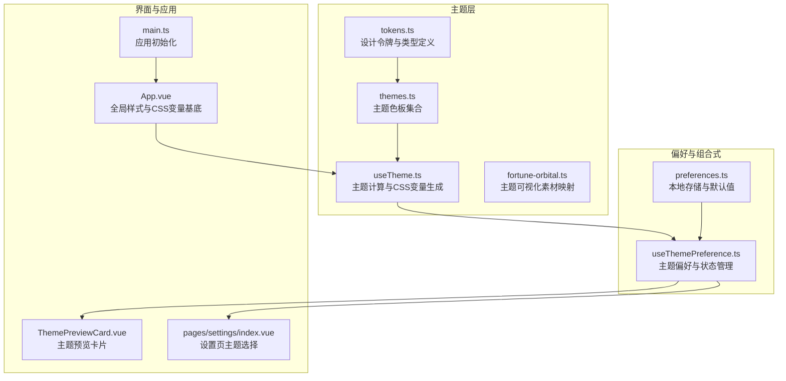
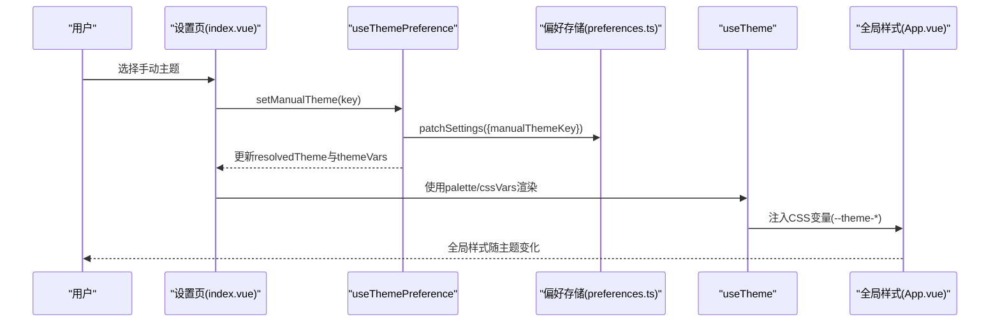
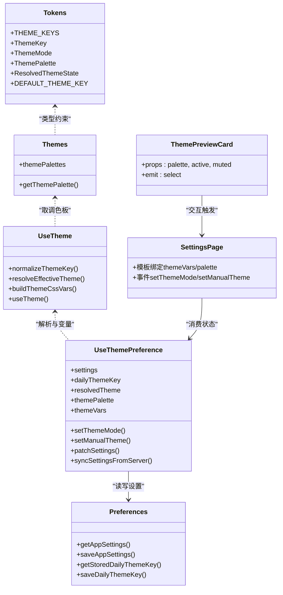

# 主题系统

<cite>
**本文引用的文件**
- [themes.ts](file://apps/mobile/src/theme/themes.ts)
- [tokens.ts](file://apps/mobile/src/theme/tokens.ts)
- [useTheme.ts](file://apps/mobile/src/theme/useTheme.ts)
- [fortune-orbital.ts](file://apps/mobile/src/theme/fortune-orbital.ts)
- [useThemePreference.ts](file://apps/mobile/src/composables/useThemePreference.ts)
- [preferences.ts](file://apps/mobile/src/services/preferences.ts)
- [ThemePreviewCard.vue](file://apps/mobile/src/components/ThemePreviewCard.vue)
- [index.vue（设置页）](file://apps/mobile/src/pages/settings/index.vue)
- [App.vue](file://apps/mobile/src/App.vue)
- [main.ts](file://apps/mobile/src/main.ts)
</cite>

## 目录
1. [简介](#简介)
2. [项目结构](#项目结构)
3. [核心组件](#核心组件)
4. [架构总览](#架构总览)
5. [详细组件分析](#详细组件分析)
6. [依赖关系分析](#依赖关系分析)
7. [性能考量](#性能考量)
8. [故障排查指南](#故障排查指南)
9. [结论](#结论)
10. [附录](#附录)

## 简介
本主题系统围绕“可配置、可扩展、可响应”的设计理念构建，支持多主题色板、动态CSS变量注入、自动/手动双模式主题切换，并提供完整的主题预览与偏好持久化能力。系统通过设计令牌（tokens）抽象统一的颜色、文本、阴影等视觉语义，结合组合式函数与偏好服务，实现从用户选择到全局样式应用的全链路闭环。

## 项目结构
主题系统主要位于移动端应用的 theme 与 composables 目录中，配合设置页与通用组件完成主题切换与展示。

图表来源
- [tokens.ts:1-52](file://apps/mobile/src/theme/tokens.ts#L1-L52)
- [themes.ts:1-231](file://apps/mobile/src/theme/themes.ts#L1-L231)
- [useTheme.ts:1-115](file://apps/mobile/src/theme/useTheme.ts#L1-L115)
- [fortune-orbital.ts:1-45](file://apps/mobile/src/theme/fortune-orbital.ts#L1-L45)
- [useThemePreference.ts:1-163](file://apps/mobile/src/composables/useThemePreference.ts#L1-L163)
- [preferences.ts:1-73](file://apps/mobile/src/services/preferences.ts#L1-L73)
- [ThemePreviewCard.vue:1-120](file://apps/mobile/src/components/ThemePreviewCard.vue#L1-L120)
- [index.vue（设置页）:1-374](file://apps/mobile/src/pages/settings/index.vue#L1-L374)
- [App.vue:1-299](file://apps/mobile/src/App.vue#L1-L299)
- [main.ts:1-15](file://apps/mobile/src/main.ts#L1-L15)

章节来源
- [themes.ts:1-231](file://apps/mobile/src/theme/themes.ts#L1-L231)
- [tokens.ts:1-52](file://apps/mobile/src/theme/tokens.ts#L1-L52)
- [useTheme.ts:1-115](file://apps/mobile/src/theme/useTheme.ts#L1-L115)
- [fortune-orbital.ts:1-45](file://apps/mobile/src/theme/fortune-orbital.ts#L1-L45)
- [useThemePreference.ts:1-163](file://apps/mobile/src/composables/useThemePreference.ts#L1-L163)
- [preferences.ts:1-73](file://apps/mobile/src/services/preferences.ts#L1-L73)
- [ThemePreviewCard.vue:1-120](file://apps/mobile/src/components/ThemePreviewCard.vue#L1-L120)
- [index.vue（设置页）:1-374](file://apps/mobile/src/pages/settings/index.vue#L1-L374)
- [App.vue:1-299](file://apps/mobile/src/App.vue#L1-L299)
- [main.ts:1-15](file://apps/mobile/src/main.ts#L1-L15)

## 核心组件
- 设计令牌与类型定义：统一主题键、模式、状态与默认主题键，确保类型安全与一致性。
- 主题色板集合：集中定义多套主题色板，覆盖不同情绪与场景。
- 主题计算与CSS变量：根据主题键生成CSS变量，供全局样式与组件使用。
- 偏好组合式：封装主题模式、手动/每日主题键解析、远程同步与本地持久化。
- 设置页与预览组件：提供主题选择UI与即时预览，联动偏好组合式进行状态变更。

章节来源
- [tokens.ts:1-52](file://apps/mobile/src/theme/tokens.ts#L1-L52)
- [themes.ts:1-231](file://apps/mobile/src/theme/themes.ts#L1-L231)
- [useTheme.ts:1-115](file://apps/mobile/src/theme/useTheme.ts#L1-L115)
- [useThemePreference.ts:1-163](file://apps/mobile/src/composables/useThemePreference.ts#L1-L163)
- [preferences.ts:1-73](file://apps/mobile/src/services/preferences.ts#L1-L73)
- [ThemePreviewCard.vue:1-120](file://apps/mobile/src/components/ThemePreviewCard.vue#L1-L120)
- [index.vue（设置页）:1-374](file://apps/mobile/src/pages/settings/index.vue#L1-L374)

## 架构总览
主题系统采用“令牌抽象 + 色板集合 + 计算函数 + 组合式偏好”的分层架构，实现主题状态的声明式管理与全局样式注入。

图表来源
- [index.vue（设置页）:134-143](file://apps/mobile/src/pages/settings/index.vue#L134-L143)
- [useThemePreference.ts:113-118](file://apps/mobile/src/composables/useThemePreference.ts#L113-L118)
- [preferences.ts:45-47](file://apps/mobile/src/services/preferences.ts#L45-L47)
- [useTheme.ts:103-114](file://apps/mobile/src/theme/useTheme.ts#L103-L114)
- [App.vue:17-65](file://apps/mobile/src/App.vue#L17-L65)

## 详细组件分析

### 设计令牌与类型定义（tokens.ts）
- 定义主题键集合与类型，确保仅允许受支持的主题键。
- 定义主题模式（自动/手动）与默认主题键。
- 定义主题调色板接口与解析后的主题状态接口，承载主题生效来源与键值。

章节来源
- [tokens.ts:1-52](file://apps/mobile/src/theme/tokens.ts#L1-L52)

### 主题色板集合（themes.ts）
- 提供基础调色板字段集，作为所有主题的共同基底。
- 通过工厂函数合并基础与各主题特有字段，形成完整的主题调色板集合。
- 暴露按键取调色板的查询函数，供其他模块使用。

章节来源
- [themes.ts:1-231](file://apps/mobile/src/theme/themes.ts#L1-L231)

### 主题计算与CSS变量（useTheme.ts）
- 主题键规范化：校验输入是否为合法主题键，否则回退到默认键。
- 主题解析：根据模式与手动/每日键，确定最终生效主题与来源。
- CSS变量构建：将主题调色板映射为一组CSS变量，含RGB通道以适配渐变与阴影。
- 组合式useTheme：对外暴露计算后的调色板与CSS变量，便于组件直接消费。

章节来源
- [useTheme.ts:1-115](file://apps/mobile/src/theme/useTheme.ts#L1-L115)

### 偏好组合式（useThemePreference.ts）
- 读取与合并本地存储的设置，提供响应式主题状态。
- 解析每日主题键来源（外部传入或本地存储），与用户设置共同决定生效主题。
- 提供切换模式、设置手动主题、批量更新设置与远端同步的能力。
- 将解析结果映射为调色板与CSS变量，供页面与组件使用。

章节来源
- [useThemePreference.ts:1-163](file://apps/mobile/src/composables/useThemePreference.ts#L1-L163)
- [preferences.ts:1-73](file://apps/mobile/src/services/preferences.ts#L1-L73)

### 设置页与主题预览（index.vue 与 ThemePreviewCard.vue）
- 设置页：展示当前生效主题摘要、模式切换、主题网格与开关项，绑定偏好组合式。
- 预览卡片：以三色块展示主色、强调色与页面底色，支持选中态与禁用态。

章节来源
- [index.vue（设置页）:1-374](file://apps/mobile/src/pages/settings/index.vue#L1-L374)
- [ThemePreviewCard.vue:1-120](file://apps/mobile/src/components/ThemePreviewCard.vue#L1-L120)

### 全局样式与应用入口（App.vue 与 main.ts）
- 应用入口：创建应用实例并安装状态管理。
- 全局样式：在page根节点注入主题CSS变量，统一背景、文字、边框、阴影等视觉元素。

章节来源
- [App.vue:1-299](file://apps/mobile/src/App.vue#L1-L299)
- [main.ts:1-15](file://apps/mobile/src/main.ts#L1-L15)

### 主题可视化素材（fortune-orbital.ts）
- 将每种主题键映射到对应的SVG内联数据URL，用于主题相关的插画或图标展示。
- 提供按主题键获取数据URL的工具函数，便于在需要时渲染主题化图形。

章节来源
- [fortune-orbital.ts:1-45](file://apps/mobile/src/theme/fortune-orbital.ts#L1-L45)

## 依赖关系分析

图表来源
- [tokens.ts:1-52](file://apps/mobile/src/theme/tokens.ts#L1-L52)
- [themes.ts:1-231](file://apps/mobile/src/theme/themes.ts#L1-L231)
- [useTheme.ts:1-115](file://apps/mobile/src/theme/useTheme.ts#L1-L115)
- [useThemePreference.ts:1-163](file://apps/mobile/src/composables/useThemePreference.ts#L1-L163)
- [preferences.ts:1-73](file://apps/mobile/src/services/preferences.ts#L1-L73)
- [index.vue（设置页）:1-374](file://apps/mobile/src/pages/settings/index.vue#L1-L374)
- [ThemePreviewCard.vue:1-120](file://apps/mobile/src/components/ThemePreviewCard.vue#L1-L120)

## 性能考量
- 响应式计算：主题状态与CSS变量均通过计算属性生成，避免重复渲染与无谓更新。
- 变量复用：CSS变量集中于page根节点，组件通过var引用，减少样式重排成本。
- 本地优先：偏好读取与默认值合并发生在内存，远端同步异步进行，不影响首屏渲染。
- SVG数据URL：主题可视化素材以数据URL形式缓存，减少额外HTTP请求。

## 故障排查指南
- 主题键无效：检查输入是否属于受支持的主题键集合，否则将回退到默认主题键。
- 自动模式未生效：确认每日主题键来源是否为空，必要时回退到默认主题键。
- 远端同步失败：组合式会捕获错误并输出警告，可在网络恢复后再次尝试同步。
- 样式未更新：确认页面根节点是否正确注入主题CSS变量，以及组件是否使用var引用。

章节来源
- [useTheme.ts:33-35](file://apps/mobile/src/theme/useTheme.ts#L33-L35)
- [useThemePreference.ts:89-91](file://apps/mobile/src/composables/useThemePreference.ts#L89-L91)
- [App.vue:17-65](file://apps/mobile/src/App.vue#L17-L65)

## 结论
该主题系统以类型安全的令牌体系为基础，通过主题色板与CSS变量实现一致的视觉语言；借助偏好组合式与本地/远端存储，提供灵活的主题切换体验。整体架构清晰、职责分离，易于扩展新主题与增强主题相关功能。

## 附录

### 不同主题的特色与适用场景
- 雾蓝（mist_blue）：安静、清透，适合日常与信息类页面。
- 樱花（sakura_pink）：柔和、明亮，适合社交与分享场景。
- 绿松石（turquoise）：自然、修复，适合健康与冥想类内容。
- 薰衣草（lavender）：梦感、安定，适合放松与夜间模式。
- 奶杏（milk_apricot）：温暖、稳定，适合日常与购物引导。
- 香槟金（champagne_gold）：高级、幸运，适合会员与奖励场景。
- 月光银（moon_silver）：冷静、澄明，适合专业与数据类页面。
- 桃子橘（peach_orange）：明亮、积极，适合激励与活动页。
- 豆沙玫瑰（rose_dust）：情绪、陪伴，适合情感与记录类页面。
- 薄荷青（mint_cyan）：清新、呼吸，适合运动与健康类内容。
- 海盐青（sea_salt）：清透、流动，适合探索与发现类页面。
- 玉石白（jade_white）：东方、清净，适合文化与哲学类内容。
- 琥珀蜜色（amber_honey）：温暖、能量，适合能量与活力类场景。
- 云雾灰紫（cloud_gray_purple）：静谧、清晰，适合思考与专注类页面。

章节来源
- [themes.ts:29-226](file://apps/mobile/src/theme/themes.ts#L29-L226)

### useTheme 组合式函数工作原理与使用方法
- 输入：主题键（可为ref/getter），内部进行规范化与解析。
- 输出：计算后的调色板与CSS变量对象，供组件直接使用。
- 使用方式：在组件模板中通过style绑定CSS变量，或在逻辑中访问palette字段。

章节来源
- [useTheme.ts:103-114](file://apps/mobile/src/theme/useTheme.ts#L103-L114)

### 主题切换完整实现示例（步骤）
- 在设置页引入偏好组合式，绑定主题模式与手动主题选择事件。
- 用户点击主题预览卡片时，调用设置手动主题的方法。
- 偏好组合式更新本地设置并尝试同步至远端，同时计算新的生效主题与CSS变量。
- 页面根节点自动注入新的CSS变量，组件通过var引用实现即时更新。

章节来源
- [index.vue（设置页）:134-143](file://apps/mobile/src/pages/settings/index.vue#L134-L143)
- [ThemePreviewCard.vue:1-120](file://apps/mobile/src/components/ThemePreviewCard.vue#L1-L120)
- [useThemePreference.ts:113-118](file://apps/mobile/src/composables/useThemePreference.ts#L113-L118)
- [App.vue:17-65](file://apps/mobile/src/App.vue#L17-L65)

### 自定义主题开发指南
- 新增主题键：在令牌定义中添加新键值，确保类型安全。
- 定义主题色板：在主题集合中新增条目，遵循基础字段与特有字段的合并规则。
- 生成CSS变量：确认useTheme的变量映射包含所需字段，保证组件可用。
- 可视化素材：如需主题化插画，可在主题可视化模块中添加对应SVG映射。
- 验证与回归：在设置页预览新主题，检查全局样式与组件渲染效果。

章节来源
- [tokens.ts:1-52](file://apps/mobile/src/theme/tokens.ts#L1-L52)
- [themes.ts:1-231](file://apps/mobile/src/theme/themes.ts#L1-L231)
- [useTheme.ts:76-101](file://apps/mobile/src/theme/useTheme.ts#L76-L101)
- [fortune-orbital.ts:1-45](file://apps/mobile/src/theme/fortune-orbital.ts#L1-L45)