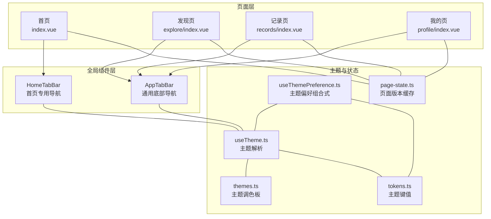
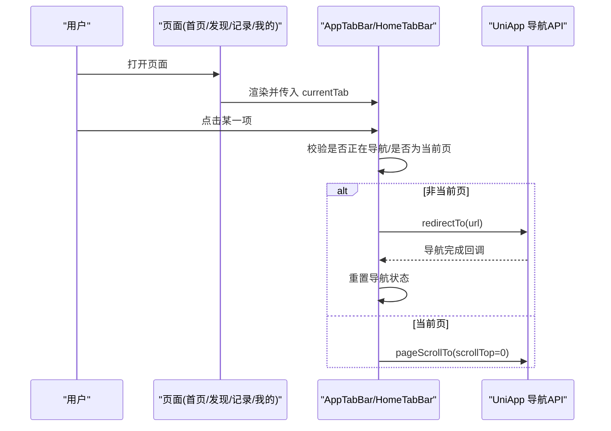
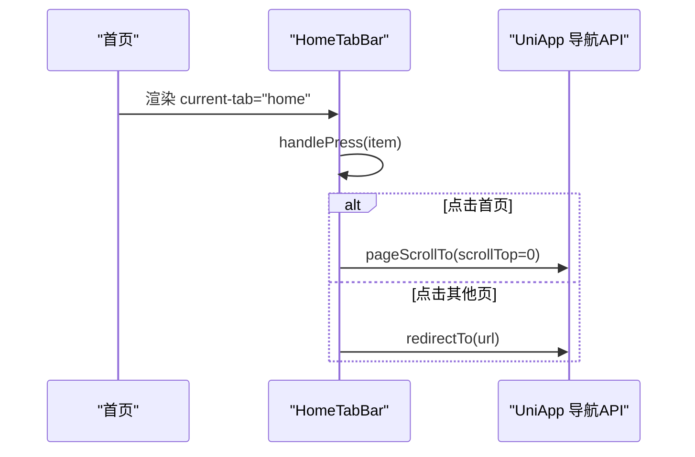
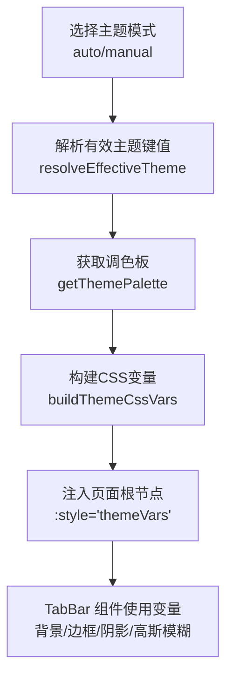
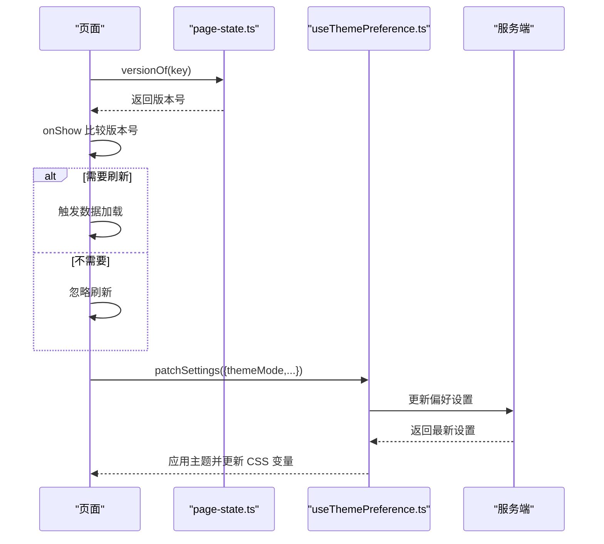
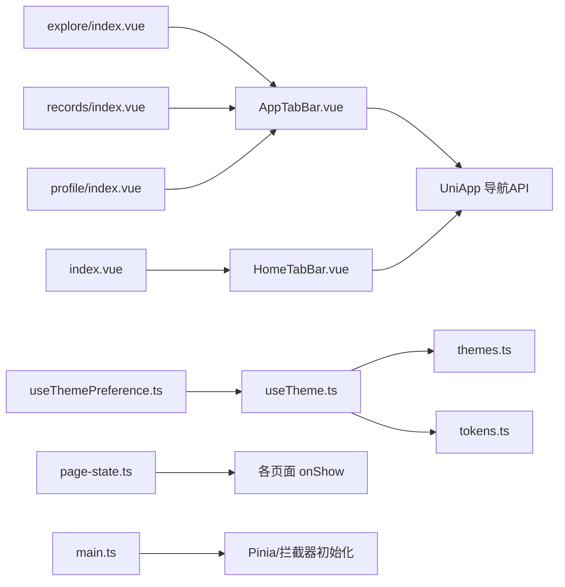

# 全局组件

<cite>
**本文引用的文件**
- [apps/mobile/src/components/AppTabBar.vue](file://apps/mobile/src/components/AppTabBar.vue)
- [apps/mobile/src/components/HomeTabBar.vue](file://apps/mobile/src/components/HomeTabBar.vue)
- [apps/mobile/src/pages/index/index.vue](file://apps/mobile/src/pages/index/index.vue)
- [apps/mobile/src/pages/explore/index.vue](file://apps/mobile/src/pages/explore/index.vue)
- [apps/mobile/src/pages/records/index.vue](file://apps/mobile/src/pages/records/index.vue)
- [apps/mobile/src/pages/profile/index.vue](file://apps/mobile/src/pages/profile/index.vue)
- [apps/mobile/src/theme/useTheme.ts](file://apps/mobile/src/theme/useTheme.ts)
- [apps/mobile/src/theme/themes.ts](file://apps/mobile/src/theme/themes.ts)
- [apps/mobile/src/theme/tokens.ts](file://apps/mobile/src/theme/tokens.ts)
- [apps/mobile/src/composables/useThemePreference.ts](file://apps/mobile/src/composables/useThemePreference.ts)
- [apps/mobile/src/stores/page-state.ts](file://apps/mobile/src/stores/page-state.ts)
- [apps/mobile/src/services/analytics.ts](file://apps/mobile/src/services/analytics.ts)
- [apps/mobile/src/main.ts](file://apps/mobile/src/main.ts)
</cite>

## 目录
1. [简介](#简介)
2. [项目结构](#项目结构)
3. [核心组件](#核心组件)
4. [架构总览](#架构总览)
5. [组件详解](#组件详解)
6. [依赖关系分析](#依赖关系分析)
7. [性能考量](#性能考量)
8. [故障排查指南](#故障排查指南)
9. [结论](#结论)
10. [附录](#附录)

## 简介
本文件聚焦于移动端应用中的“全局组件”开发，重点围绕 AppTabBar 与 HomeTabBar 的设计原则、实现细节与最佳实践展开。文档将系统阐述这两个组件的 props 设计、事件处理机制、生命周期管理、主题适配策略，以及它们在导航栏、工具栏等通用 UI 场景中的职责与协作方式；同时给出状态共享、事件传递与样式定制的复用范式，并结合实际页面使用场景进行可视化说明。

## 项目结构
移动端应用采用多页面架构，全局 TabBar 组件以可复用 UI 元素的形式被多个页面引用，配合主题系统与页面状态管理，形成统一的底部导航体验。

图表来源
- [apps/mobile/src/pages/index/index.vue](file://apps/mobile/src/pages/index/index.vue)
- [apps/mobile/src/pages/explore/index.vue](file://apps/mobile/src/pages/explore/index.vue)
- [apps/mobile/src/pages/records/index.vue](file://apps/mobile/src/pages/records/index.vue)
- [apps/mobile/src/pages/profile/index.vue](file://apps/mobile/src/pages/profile/index.vue)
- [apps/mobile/src/components/AppTabBar.vue](file://apps/mobile/src/components/AppTabBar.vue)
- [apps/mobile/src/components/HomeTabBar.vue](file://apps/mobile/src/components/HomeTabBar.vue)
- [apps/mobile/src/theme/useTheme.ts](file://apps/mobile/src/theme/useTheme.ts)
- [apps/mobile/src/theme/themes.ts](file://apps/mobile/src/theme/themes.ts)
- [apps/mobile/src/theme/tokens.ts](file://apps/mobile/src/theme/tokens.ts)
- [apps/mobile/src/composables/useThemePreference.ts](file://apps/mobile/src/composables/useThemePreference.ts)
- [apps/mobile/src/stores/page-state.ts](file://apps/mobile/src/stores/page-state.ts)

章节来源
- [apps/mobile/src/components/AppTabBar.vue](file://apps/mobile/src/components/AppTabBar.vue)
- [apps/mobile/src/components/HomeTabBar.vue](file://apps/mobile/src/components/HomeTabBar.vue)
- [apps/mobile/src/pages/index/index.vue](file://apps/mobile/src/pages/index/index.vue)
- [apps/mobile/src/pages/explore/index.vue](file://apps/mobile/src/pages/explore/index.vue)
- [apps/mobile/src/pages/records/index.vue](file://apps/mobile/src/pages/records/index.vue)
- [apps/mobile/src/pages/profile/index.vue](file://apps/mobile/src/pages/profile/index.vue)

## 核心组件
- AppTabBar：通用底部导航，承载首页、发现、记录、我的四个入口，支持点击切换与回到顶部滚动。
- HomeTabBar：首页专用导航，样式与交互略作优化，用于首页场景下的导航体验。

两者均通过 props currentTab 控制当前激活态，内部维护 items 列表与点击处理函数，避免重复点击与导航并发。

章节来源
- [apps/mobile/src/components/AppTabBar.vue](file://apps/mobile/src/components/AppTabBar.vue)
- [apps/mobile/src/components/HomeTabBar.vue](file://apps/mobile/src/components/HomeTabBar.vue)

## 架构总览
全局组件与页面的关系如下：

图表来源
- [apps/mobile/src/components/AppTabBar.vue](file://apps/mobile/src/components/AppTabBar.vue)
- [apps/mobile/src/components/HomeTabBar.vue](file://apps/mobile/src/components/HomeTabBar.vue)
- [apps/mobile/src/pages/index/index.vue](file://apps/mobile/src/pages/index/index.vue)
- [apps/mobile/src/pages/explore/index.vue](file://apps/mobile/src/pages/explore/index.vue)
- [apps/mobile/src/pages/records/index.vue](file://apps/mobile/src/pages/records/index.vue)
- [apps/mobile/src/pages/profile/index.vue](file://apps/mobile/src/pages/profile/index.vue)

## 组件详解

### AppTabBar 组件
- 设计要点
  - 使用网格布局均匀分布四项入口，支持响应式与安全区域适配。
  - 通过 currentTab 属性控制激活态，激活项与非激活项在颜色、阴影、圆角等方面有差异化。
  - 图标采用伪元素绘制，减少图片资源，提升性能与一致性。
- Props
  - currentTab: 当前激活的 Tab 标识（home/explore/record/mine）。
- 事件处理
  - handlePress(item): 点击处理，包含防抖（navigating 标志）、同页回到顶部、跨页跳转。
  - 跳转使用 redirectTo，确保页面栈简洁，避免重复历史记录。
- 生命周期管理
  - 组件本身无复杂生命周期钩子，主要依赖父页面在 onShow/onLoad 中按需刷新数据。
- 主题与样式
  - 通过 CSS 变量与主题系统联动，背景、边框、阴影、高斯模糊等视觉效果由主题驱动。
- 复用场景
  - 发现页、记录页、我的页等非首页页面使用 AppTabBar。
- 最佳实践
  - 在父页面中仅传入当前路由对应的 Tab 标识，避免外部状态污染。
  - 对于首页，使用 HomeTabBar 以获得更贴合首页的视觉与交互。

章节来源
- [apps/mobile/src/components/AppTabBar.vue](file://apps/mobile/src/components/AppTabBar.vue)
- [apps/mobile/src/pages/explore/index.vue](file://apps/mobile/src/pages/explore/index.vue)
- [apps/mobile/src/pages/records/index.vue](file://apps/mobile/src/pages/records/index.vue)
- [apps/mobile/src/pages/profile/index.vue](file://apps/mobile/src/pages/profile/index.vue)

### HomeTabBar 组件
- 设计要点
  - 首页专用样式，强调激活态的高亮与动效，图标与文字的对比度更高。
  - 与 AppTabBar 结构一致，但视觉层级与渐变背景更突出。
- Props
  - currentTab: 同上。
- 事件处理
  - 与 AppTabBar 类似，但首页场景下点击当前页时会触发回到顶部。
- 复用场景
  - 首页使用 HomeTabBar，确保首页导航体验的一致性与品牌化。

章节来源
- [apps/mobile/src/components/HomeTabBar.vue](file://apps/mobile/src/components/HomeTabBar.vue)
- [apps/mobile/src/pages/index/index.vue](file://apps/mobile/src/pages/index/index.vue)

### 页面集成与导航流程
- 首页
  - 页面模板中直接渲染 HomeTabBar，并传入 current-tab="home"。
  - 点击首页 Tab 时触发回到顶部，保证用户在长列表场景下的操作一致性。
- 发现页/记录页/我的页
  - 页面模板中渲染 AppTabBar，并传入对应 current-tab。
  - 点击非当前页时触发 redirectTo 跳转；点击当前页时回到顶部。

图表来源
- [apps/mobile/src/pages/index/index.vue](file://apps/mobile/src/pages/index/index.vue)
- [apps/mobile/src/components/HomeTabBar.vue](file://apps/mobile/src/components/HomeTabBar.vue)

章节来源
- [apps/mobile/src/pages/index/index.vue](file://apps/mobile/src/pages/index/index.vue)
- [apps/mobile/src/pages/explore/index.vue](file://apps/mobile/src/pages/explore/index.vue)
- [apps/mobile/src/pages/records/index.vue](file://apps/mobile/src/pages/records/index.vue)
- [apps/mobile/src/pages/profile/index.vue](file://apps/mobile/src/pages/profile/index.vue)

### 主题系统与样式定制
- 主题键值与调色板
  - tokens.ts 定义主题键值集合与模式类型，themes.ts 提供多种主题调色板。
  - useTheme.ts 提供主题解析与 CSS 变量构建能力，支持手动/每日/回退策略。
- 组合式函数 useThemePreference
  - 统一管理主题模式、手动主题、每日主题与服务端偏好同步，计算出最终主题并输出 CSS 变量。
- 样式定制
  - TabBar 组件通过 CSS 变量实现主题化，无需修改组件源码即可更换风格。
  - 首页与通用导航的样式差异通过独立样式文件与变量覆盖实现。

图表来源
- [apps/mobile/src/theme/tokens.ts](file://apps/mobile/src/theme/tokens.ts)
- [apps/mobile/src/theme/themes.ts](file://apps/mobile/src/theme/themes.ts)
- [apps/mobile/src/theme/useTheme.ts](file://apps/mobile/src/theme/useTheme.ts)
- [apps/mobile/src/composables/useThemePreference.ts](file://apps/mobile/src/composables/useThemePreference.ts)
- [apps/mobile/src/pages/index/index.vue](file://apps/mobile/src/pages/index/index.vue)
- [apps/mobile/src/pages/explore/index.vue](file://apps/mobile/src/pages/explore/index.vue)
- [apps/mobile/src/pages/records/index.vue](file://apps/mobile/src/pages/records/index.vue)
- [apps/mobile/src/pages/profile/index.vue](file://apps/mobile/src/pages/profile/index.vue)

章节来源
- [apps/mobile/src/theme/tokens.ts](file://apps/mobile/src/theme/tokens.ts)
- [apps/mobile/src/theme/themes.ts](file://apps/mobile/src/theme/themes.ts)
- [apps/mobile/src/theme/useTheme.ts](file://apps/mobile/src/theme/useTheme.ts)
- [apps/mobile/src/composables/useThemePreference.ts](file://apps/mobile/src/composables/useThemePreference.ts)
- [apps/mobile/src/pages/index/index.vue](file://apps/mobile/src/pages/index/index.vue)
- [apps/mobile/src/pages/explore/index.vue](file://apps/mobile/src/pages/explore/index.vue)
- [apps/mobile/src/pages/records/index.vue](file://apps/mobile/src/pages/records/index.vue)
- [apps/mobile/src/pages/profile/index.vue](file://apps/mobile/src/pages/profile/index.vue)

### 状态共享与事件传递
- 页面版本缓存
  - page-state.ts 维护各页面版本号，用于 onShow 时判断是否需要刷新数据，避免不必要的请求。
- 事件埋点
  - analytics.ts 提供 trackEvent，页面内对关键交互进行埋点，保证统计不阻塞主流程。
- 组合式函数 useThemePreference
  - 提供主题设置变更与服务端同步能力，避免主题切换导致的重复网络请求。

图表来源
- [apps/mobile/src/stores/page-state.ts](file://apps/mobile/src/stores/page-state.ts)
- [apps/mobile/src/composables/useThemePreference.ts](file://apps/mobile/src/composables/useThemePreference.ts)
- [apps/mobile/src/services/analytics.ts](file://apps/mobile/src/services/analytics.ts)

章节来源
- [apps/mobile/src/stores/page-state.ts](file://apps/mobile/src/stores/page-state.ts)
- [apps/mobile/src/composables/useThemePreference.ts](file://apps/mobile/src/composables/useThemePreference.ts)
- [apps/mobile/src/services/analytics.ts](file://apps/mobile/src/services/analytics.ts)

## 依赖关系分析

图表来源
- [apps/mobile/src/components/AppTabBar.vue](file://apps/mobile/src/components/AppTabBar.vue)
- [apps/mobile/src/components/HomeTabBar.vue](file://apps/mobile/src/components/HomeTabBar.vue)
- [apps/mobile/src/pages/index/index.vue](file://apps/mobile/src/pages/index/index.vue)
- [apps/mobile/src/pages/explore/index.vue](file://apps/mobile/src/pages/explore/index.vue)
- [apps/mobile/src/pages/records/index.vue](file://apps/mobile/src/pages/records/index.vue)
- [apps/mobile/src/pages/profile/index.vue](file://apps/mobile/src/pages/profile/index.vue)
- [apps/mobile/src/theme/useTheme.ts](file://apps/mobile/src/theme/useTheme.ts)
- [apps/mobile/src/theme/themes.ts](file://apps/mobile/src/theme/themes.ts)
- [apps/mobile/src/theme/tokens.ts](file://apps/mobile/src/theme/tokens.ts)
- [apps/mobile/src/composables/useThemePreference.ts](file://apps/mobile/src/composables/useThemePreference.ts)
- [apps/mobile/src/stores/page-state.ts](file://apps/mobile/src/stores/page-state.ts)
- [apps/mobile/src/main.ts](file://apps/mobile/src/main.ts)

章节来源
- [apps/mobile/src/main.ts](file://apps/mobile/src/main.ts)
- [apps/mobile/src/theme/useTheme.ts](file://apps/mobile/src/theme/useTheme.ts)
- [apps/mobile/src/theme/themes.ts](file://apps/mobile/src/theme/themes.ts)
- [apps/mobile/src/theme/tokens.ts](file://apps/mobile/src/theme/tokens.ts)
- [apps/mobile/src/composables/useThemePreference.ts](file://apps/mobile/src/composables/useThemePreference.ts)
- [apps/mobile/src/stores/page-state.ts](file://apps/mobile/src/stores/page-state.ts)

## 性能考量
- 避免重复导航
  - 组件内部通过 navigating 标志防止连续点击导致的重复跳转与页面栈膨胀。
- 跳转策略
  - 使用 redirectTo 替代 navigateTo，减少历史记录数量，降低内存占用。
- 主题渲染
  - 通过 CSS 变量与组合式函数集中管理主题，避免在运行时频繁创建样式对象。
- 页面刷新控制
  - 使用 page-state 版本号在 onShow 中判断是否需要刷新，减少无效请求。

[本节为通用指导，无需列出具体文件来源]

## 故障排查指南
- 点击无反应
  - 检查 navigating 状态是否被长时间置位；确认 handlePress 中的防抖逻辑是否生效。
- 导航异常
  - 确认 redirectTo 调用是否传入正确路由；检查路由表与 items.route 是否一致。
- 主题不生效
  - 检查 useThemePreference 返回的 themeVars 是否注入到页面根节点；确认 CSS 变量名与组件引用一致。
- 页面未刷新
  - 检查 page-state 版本号是否被正确标记；确认 onShow 中的版本比较逻辑。

章节来源
- [apps/mobile/src/components/AppTabBar.vue](file://apps/mobile/src/components/AppTabBar.vue)
- [apps/mobile/src/components/HomeTabBar.vue](file://apps/mobile/src/components/HomeTabBar.vue)
- [apps/mobile/src/composables/useThemePreference.ts](file://apps/mobile/src/composables/useThemePreference.ts)
- [apps/mobile/src/stores/page-state.ts](file://apps/mobile/src/stores/page-state.ts)

## 结论
AppTabBar 与 HomeTabBar 作为全局导航组件，在本项目中承担了统一的底部导航职责。通过 props 驱动的激活态、防抖与跳转策略、主题系统与页面状态管理的协同，实现了高复用、低耦合、易扩展的导航体验。遵循本文提供的最佳实践，可在不破坏现有架构的前提下快速扩展新的页面与导航项。

[本节为总结性内容，无需列出具体文件来源]

## 附录

### 组件属性与事件速查
- AppTabBar/HomeTabBar
  - Props: currentTab
  - 事件: 点击项触发导航或回到顶部
- 页面侧
  - 传入 current-tab 对应的标识字符串
  - 通过 uni.navigateTo/redirectTo 进行页面跳转

章节来源
- [apps/mobile/src/components/AppTabBar.vue](file://apps/mobile/src/components/AppTabBar.vue)
- [apps/mobile/src/components/HomeTabBar.vue](file://apps/mobile/src/components/HomeTabBar.vue)
- [apps/mobile/src/pages/index/index.vue](file://apps/mobile/src/pages/index/index.vue)
- [apps/mobile/src/pages/explore/index.vue](file://apps/mobile/src/pages/explore/index.vue)
- [apps/mobile/src/pages/records/index.vue](file://apps/mobile/src/pages/records/index.vue)
- [apps/mobile/src/pages/profile/index.vue](file://apps/mobile/src/pages/profile/index.vue)