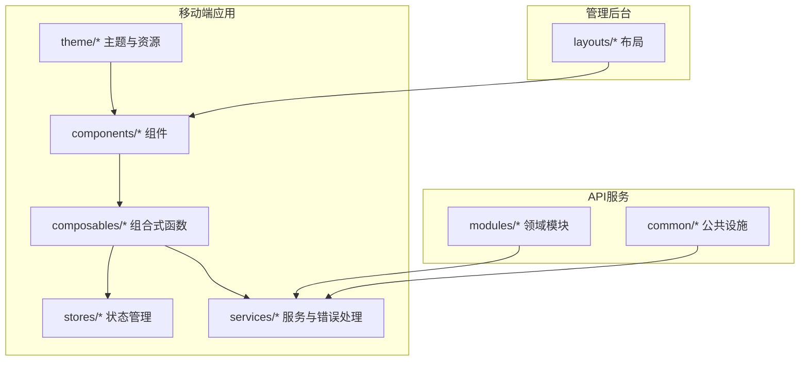
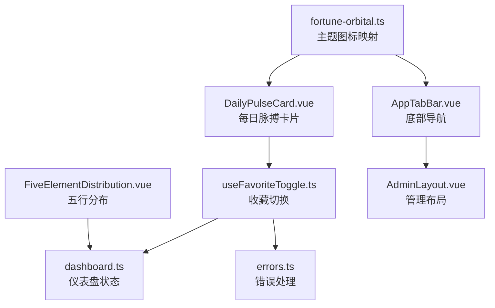
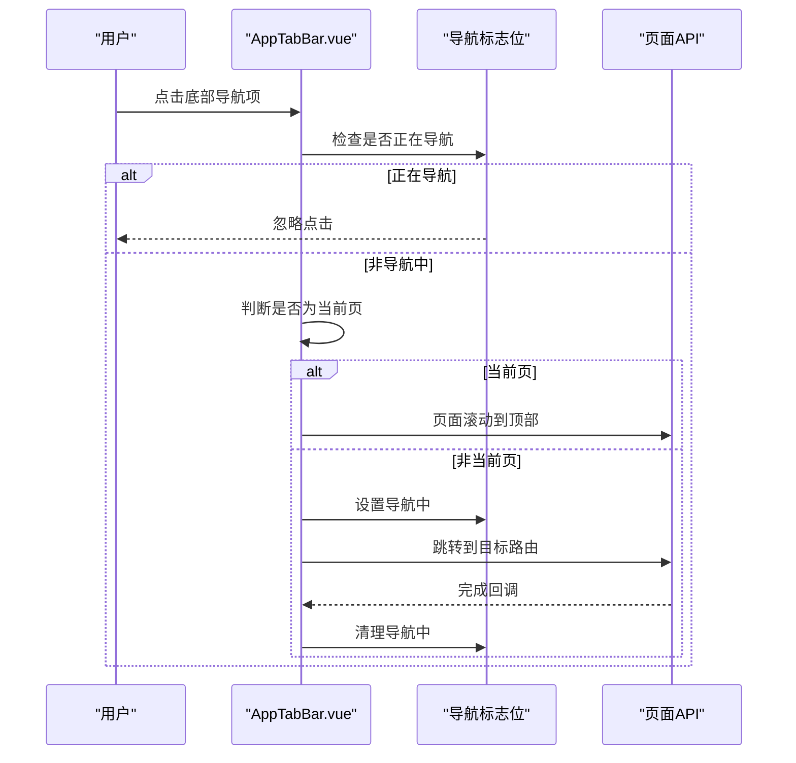
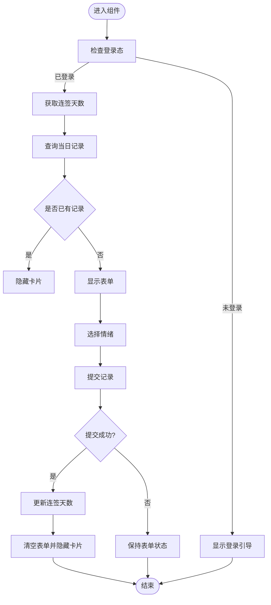
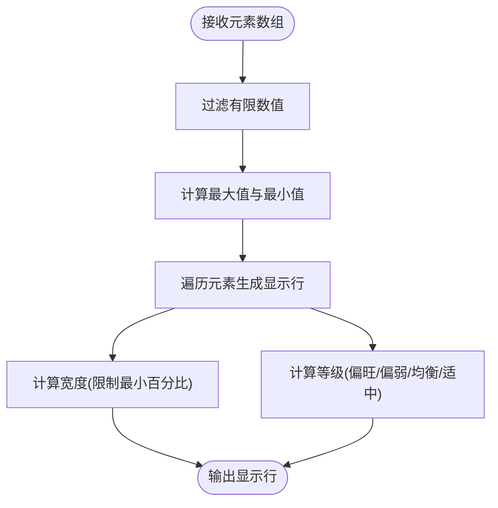
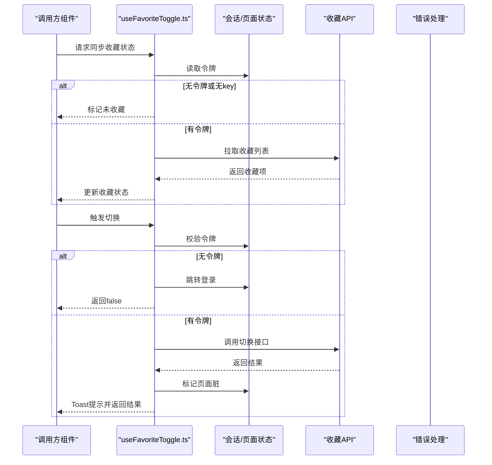
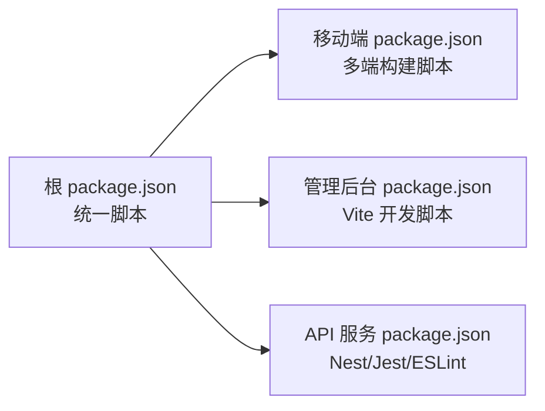

# 组件开发最佳实践

<cite>
**本文引用的文件**
- [AppTabBar.vue](file://apps/mobile/src/components/AppTabBar.vue)
- [DailyPulseCard.vue](file://apps/mobile/src/components/DailyPulseCard.vue)
- [FiveElementDistribution.vue](file://apps/mobile/src/components/FiveElementDistribution.vue)
- [useFavoriteToggle.ts](file://apps/mobile/src/composables/useFavoriteToggle.ts)
- [AdminLayout.vue](file://apps/admin/src/layouts/AdminLayout.vue)
- [fortune-orbital.ts](file://apps/mobile/src/theme/fortune-orbital.ts)
- [dashboard.ts](file://apps/mobile/src/stores/dashboard.ts)
- [errors.ts](file://apps/mobile/src/services/errors.ts)
- [package.json（根）](file://package.json)
- [package.json（移动端）](file://apps/mobile/package.json)
- [package.json（API服务）](file://services/api/package.json)
</cite>

## 目录
1. [引言](#引言)
2. [项目结构](#项目结构)
3. [核心组件](#核心组件)
4. [架构总览](#架构总览)
5. [详细组件分析](#详细组件分析)
6. [依赖分析](#依赖分析)
7. [性能考量](#性能考量)
8. [故障排查指南](#故障排查指南)
9. [结论](#结论)
10. [附录](#附录)

## 引言
本指南面向前端与全栈工程师，系统总结该仓库在组件开发中的最佳实践，覆盖命名规范、文件组织、代码风格、性能优化、可维护性设计、测试方法、跨平台兼容与文档标准。文中所有结论均基于仓库现有实现与脚手架配置提炼而来，便于团队快速落地与持续演进。

## 项目结构
项目采用多包工作区布局，包含移动端应用、管理后台、API服务与部署脚本。组件主要集中在移动端与管理端的 src/components 目录下，配合 composables、stores、services 等模块形成清晰分层。

**图表来源**
- [AppTabBar.vue](file://apps/mobile/src/components/AppTabBar.vue)
- [AdminLayout.vue](file://apps/admin/src/layouts/AdminLayout.vue)
- [dashboard.ts](file://apps/mobile/src/stores/dashboard.ts)
- [errors.ts](file://apps/mobile/src/services/errors.ts)

**章节来源**
- [package.json（根）:6-21](file://package.json#L6-L21)
- [package.json（移动端）:4-37](file://apps/mobile/package.json#L4-L37)
- [package.json（API服务）:8-24](file://services/api/package.json#L8-L24)

## 核心组件
- 移动端组件：以 Vue 单文件组件为主，使用 TypeScript 与 SCSS，强调可复用性与主题一致性。
- 组合式函数：封装可复用的业务逻辑（如收藏切换），降低组件耦合。
- 布局组件：管理导航与页面骨架，确保跨页面一致的交互体验。
- 主题系统：通过 SVG 资源映射为数据 URI，实现主题图标与配色的统一管理。

**章节来源**
- [AppTabBar.vue:1-205](file://apps/mobile/src/components/AppTabBar.vue#L1-L205)
- [DailyPulseCard.vue:1-492](file://apps/mobile/src/components/DailyPulseCard.vue#L1-L492)
- [FiveElementDistribution.vue:1-132](file://apps/mobile/src/components/FiveElementDistribution.vue#L1-L132)
- [useFavoriteToggle.ts:1-67](file://apps/mobile/src/composables/useFavoriteToggle.ts#L1-L67)
- [AdminLayout.vue:1-124](file://apps/admin/src/layouts/AdminLayout.vue#L1-L124)
- [fortune-orbital.ts:1-45](file://apps/mobile/src/theme/fortune-orbital.ts#L1-L45)

## 架构总览
移动端组件通过组合式函数与 Pinia Store 进行状态与副作用管理；布局组件负责路由与菜单渲染；主题模块提供图标与配色资源；服务层统一封装错误处理与会话状态。

**图表来源**
- [AppTabBar.vue:1-205](file://apps/mobile/src/components/AppTabBar.vue#L1-L205)
- [DailyPulseCard.vue:1-492](file://apps/mobile/src/components/DailyPulseCard.vue#L1-L492)
- [FiveElementDistribution.vue:1-132](file://apps/mobile/src/components/FiveElementDistribution.vue#L1-L132)
- [useFavoriteToggle.ts:1-67](file://apps/mobile/src/composables/useFavoriteToggle.ts#L1-L67)
- [AdminLayout.vue:1-124](file://apps/admin/src/layouts/AdminLayout.vue#L1-L124)
- [fortune-orbital.ts:1-45](file://apps/mobile/src/theme/fortune-orbital.ts#L1-L45)
- [dashboard.ts:1-382](file://apps/mobile/src/stores/dashboard.ts#L1-L382)
- [errors.ts:1-82](file://apps/mobile/src/services/errors.ts#L1-L82)

## 详细组件分析

### 底部导航组件（AppTabBar）
- 设计要点
  - 使用类型安全的 TabId 枚举约束路由标识，减少拼写错误。
  - 通过 props 接收当前选中项，结合样式类实现高亮态。
  - 防抖导航：在跳转过程中设置标志位，避免重复点击导致的导航异常。
  - 图标绘制：通过伪元素与几何图形实现简洁图标，减少外部资源依赖。
- 可维护性
  - 导航项集中定义，便于扩展与维护。
  - 使用 uni API 进行页面跳转与滚动，保证小程序平台一致性。
- 性能
  - 仅在激活时触发滚动回到顶部，避免不必要的滚动开销。
  - 图标绘制为纯 CSS，无额外图片请求。

**图表来源**
- [AppTabBar.vue:38-62](file://apps/mobile/src/components/AppTabBar.vue#L38-L62)

**章节来源**
- [AppTabBar.vue:1-205](file://apps/mobile/src/components/AppTabBar.vue#L1-L205)

### 每日脉搏卡片（DailyPulseCard）
- 设计要点
  - 登录态与可见性分离：未登录时显示引导区域，登录后根据历史记录决定是否展示。
  - 情绪选项与强度评分：通过计算属性动态生成提示文案，提升文案一致性。
  - 提交流程：防重复提交、错误捕获与最终态清理，保证 UI 一致性。
- 可维护性
  - 业务逻辑集中在脚本块内，便于单元测试与重构。
  - 通过 API 与服务层解耦，便于替换实现。
- 性能
  - 仅在挂载时进行必要的异步查询，避免阻塞首屏。
  - 使用条件渲染隐藏引导区域，减少 DOM 负担。

**图表来源**
- [DailyPulseCard.vue:99-151](file://apps/mobile/src/components/DailyPulseCard.vue#L99-L151)

**章节来源**
- [DailyPulseCard.vue:1-492](file://apps/mobile/src/components/DailyPulseCard.vue#L1-L492)

### 五行分布组件（FiveElementDistribution）
- 设计要点
  - 输入规范化：过滤非有限数值，避免异常值影响可视化。
  - 动态宽度与等级：根据最大/最小值计算百分比宽度与等级标签，保证视觉一致性。
  - 默认参数：通过 withDefaults 提供最小百分比默认值，增强健壮性。
- 可维护性
  - 计算逻辑独立于模板，便于单元测试与边界条件验证。
  - SCSS 样式模块化，易于主题扩展。

**图表来源**
- [FiveElementDistribution.vue:38-88](file://apps/mobile/src/components/FiveElementDistribution.vue#L38-L88)

**章节来源**
- [FiveElementDistribution.vue:1-132](file://apps/mobile/src/components/FiveElementDistribution.vue#L1-L132)

### 收藏切换组合式函数（useFavoriteToggle）
- 设计要点
  - 同步收藏状态：在有令牌时拉取收藏列表，否则置为未收藏。
  - 切换流程：鉴权校验、调用接口、更新页面状态标记、Toast 提示与错误兜底。
  - 错误处理：统一错误消息提取与认证过期处理，必要时跳转至登录页。
- 可维护性
  - 将 UI 行为与业务逻辑解耦，便于在多个组件中复用。
  - 通过页面状态存储标记脏数据，驱动相关页面刷新。

**图表来源**
- [useFavoriteToggle.ts:13-58](file://apps/mobile/src/composables/useFavoriteToggle.ts#L13-L58)
- [errors.ts:61-81](file://apps/mobile/src/services/errors.ts#L61-L81)

**章节来源**
- [useFavoriteToggle.ts:1-67](file://apps/mobile/src/composables/useFavoriteToggle.ts#L1-L67)
- [errors.ts:1-82](file://apps/mobile/src/services/errors.ts#L1-L82)

### 管理后台布局（AdminLayout）
- 设计要点
  - 动态导航：根据会话菜单动态渲染，若无菜单则回退到默认项。
  - 页面标题：根据路由路径动态展示当前页面标题与副标题。
  - 生命周期：挂载时水合会话并按需加载引导数据。
- 可维护性
  - 路由与菜单解耦，便于权限与导航结构变更。
  - 使用 Element Plus 组件，统一交互风格。

**章节来源**
- [AdminLayout.vue:1-124](file://apps/admin/src/layouts/AdminLayout.vue#L1-L124)

### 主题图标映射（fortune-orbital）
- 设计要点
  - 将 SVG 源码映射为数据 URI，便于直接注入到组件或样式中。
  - 提供默认主题键，缺失时回退到默认图标。
- 可维护性
  - 图标资源集中管理，便于替换与版本控制。

**章节来源**
- [fortune-orbital.ts:1-45](file://apps/mobile/src/theme/fortune-orbital.ts#L1-L45)

## 依赖分析
- 工作区脚本：根目录提供统一的开发与构建命令，分别启动移动端、管理后台与 API 服务。
- 移动端依赖：包含 uni-app 生态与 Vue 3/Pinia，支持多端编译与运行。
- API 服务：基于 NestJS，内置 ESLint、Jest 测试配置，支持迁移与覆盖率统计。

**图表来源**
- [package.json（根）:6-21](file://package.json#L6-L21)
- [package.json（移动端）:4-37](file://apps/mobile/package.json#L4-L37)
- [package.json（API服务）:8-24](file://services/api/package.json#L8-L24)

**章节来源**
- [package.json（根）:1-23](file://package.json#L1-L23)
- [package.json（移动端）:1-76](file://apps/mobile/package.json#L1-L76)
- [package.json（API服务）:1-91](file://services/api/package.json#L1-L91)

## 性能考量
- 懒加载与按需渲染
  - 组件内部通过条件渲染与可见性控制减少初始渲染压力（如每日脉搏卡片）。
  - 布局组件按需加载引导数据，避免首屏阻塞。
- 虚拟滚动
  - 仓库未见虚拟滚动实现。建议在长列表场景引入虚拟滚动库（如移动端场景可参考现有网格布局思路进行分页或懒加载）。
- 内存管理
  - 避免在组件内创建全局定时器或事件监听；在组合式函数中统一管理副作用与清理逻辑（如收藏切换流程）。
  - 对于主题资源（SVG 数据 URI），避免重复生成，可在模块级缓存。
- 网络与状态
  - 通过 Pinia Store 缓存与合并响应，减少重复请求（如仪表盘数据加载与回退策略）。
  - 错误处理统一化，避免异常堆栈泄漏与 UI 卡顿。

## 故障排查指南
- 错误消息提取
  - 统一从错误对象的 message、errmsg、errMsg 字段提取，若为空则使用默认提示。
- 认证过期处理
  - 识别认证过期错误后清理会话并提示用户；可选跳转至登录页。
- 日志与调试
  - 在关键流程中使用 warn 输出，便于定位问题；避免在生产环境打印敏感信息。
- 组件行为验证
  - 使用组合式函数封装业务逻辑，便于单元测试与断言；对 UI 行为（如收藏切换）进行端到端验证。

**章节来源**
- [errors.ts:11-81](file://apps/mobile/src/services/errors.ts#L11-L81)

## 结论
本项目在组件开发上体现了清晰的分层与职责划分：组件专注视图与交互，组合式函数承载业务逻辑，Pinia 管理状态，服务层统一错误与会话处理。建议在此基础上进一步引入虚拟滚动、统一测试策略与跨平台兼容性检查，持续提升性能与可维护性。

## 附录

### 组件命名规范
- 文件名：采用 PascalCase，如 AppTabBar.vue、DailyPulseCard.vue。
- 组件导出：默认导出组件对象，便于按需导入与 Tree Shaking。
- 类型与接口：在 TSX 中使用明确的接口定义 props 与事件，提升类型安全。

### 文件组织结构
- 组件：apps/mobile/src/components/*.vue 或 *.ts
- 组合式函数：apps/mobile/src/composables/*.ts
- 状态管理：apps/mobile/src/stores/*.ts
- 服务与错误处理：apps/mobile/src/services/*.ts
- 主题与静态资源：apps/mobile/src/theme/* 与 static/*

### 代码风格要求
- 语言：TypeScript + Vue 3 Composition API
- 样式：SCSS，模块化作用域样式（scoped）
- 命名：变量与函数使用 camelCase；常量使用 UPPER_SNAKE_CASE
- 注释：复杂逻辑添加注释，公共 API 添加 JSDoc 风格注释

### 性能优化策略
- 懒加载：路由级懒加载与图片资源按需加载
- 虚拟滚动：长列表场景引入虚拟滚动
- 内存管理：统一清理副作用，避免内存泄漏
- 网络优化：缓存策略、请求合并与降级回退

### 可维护性设计
- API 设计：统一 DTO 与响应结构，错误码与消息标准化
- 错误边界：服务层统一错误处理与提示
- 调试技巧：warn 输出、日志分级、UI 状态可视化

### 测试方法与工具
- 单元测试：Jest + Vue Test Utils（API 服务已配置 Jest）
- 集成测试：端到端测试（API 服务提供 e2e 配置）
- 跨端验证：多端构建脚本（移动端支持微信小程序、H5 等）

**章节来源**
- [package.json（API服务）:73-89](file://services/api/package.json#L73-L89)

### 跨平台兼容性
- 多端构建：移动端通过 uni-app 的多平台编译能力，统一一套代码适配微信小程序、H5 等。
- 平台差异：在组件中使用平台 API（如 uni.navigateTo）时，注意各平台差异并进行兼容处理。

**章节来源**
- [package.json（移动端）:4-37](file://apps/mobile/package.json#L4-L37)

### 文档编写标准
- 组件文档：包含功能说明、props 与事件、插槽、使用示例与注意事项
- API 文档：接口路径、请求/响应结构、错误码与示例
- 部署与运维：构建脚本、环境变量与健康检查脚本

**章节来源**
- [package.json（根）:16-21](file://package.json#L16-L21)