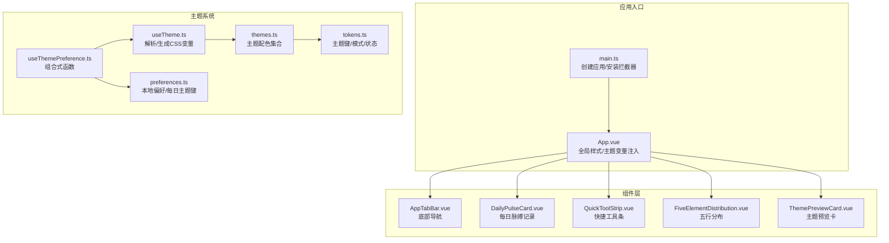
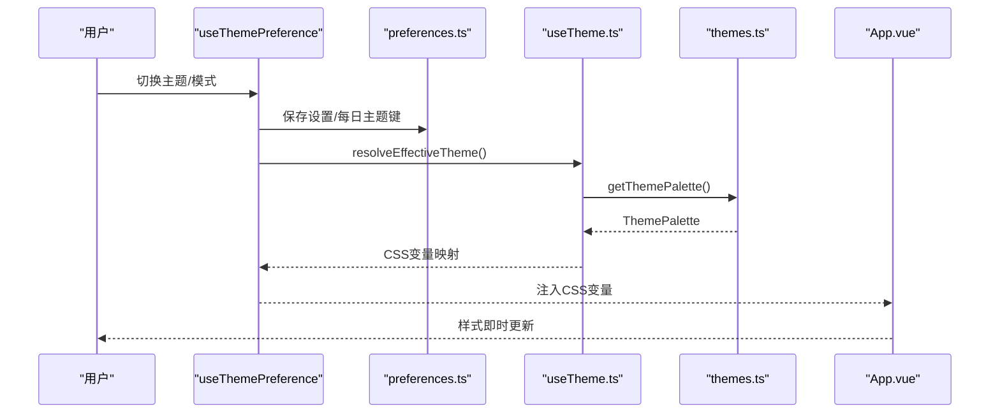
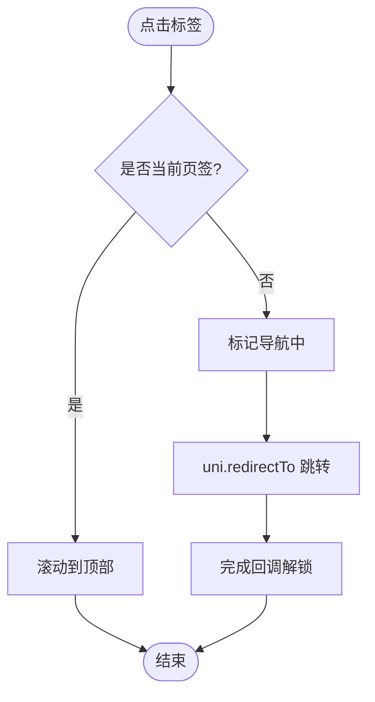
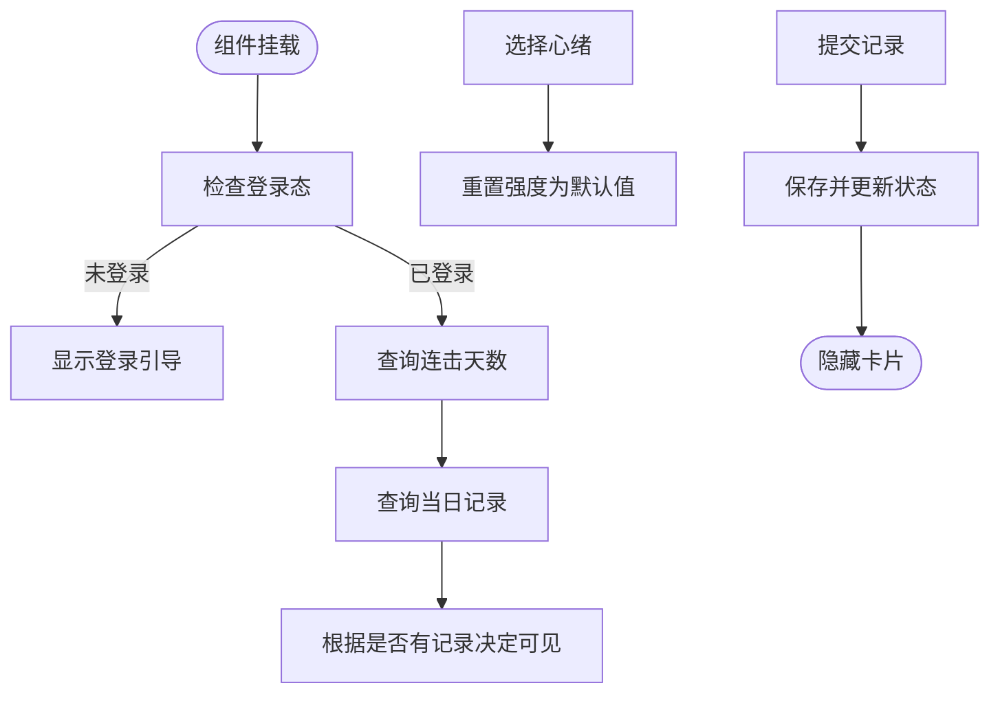
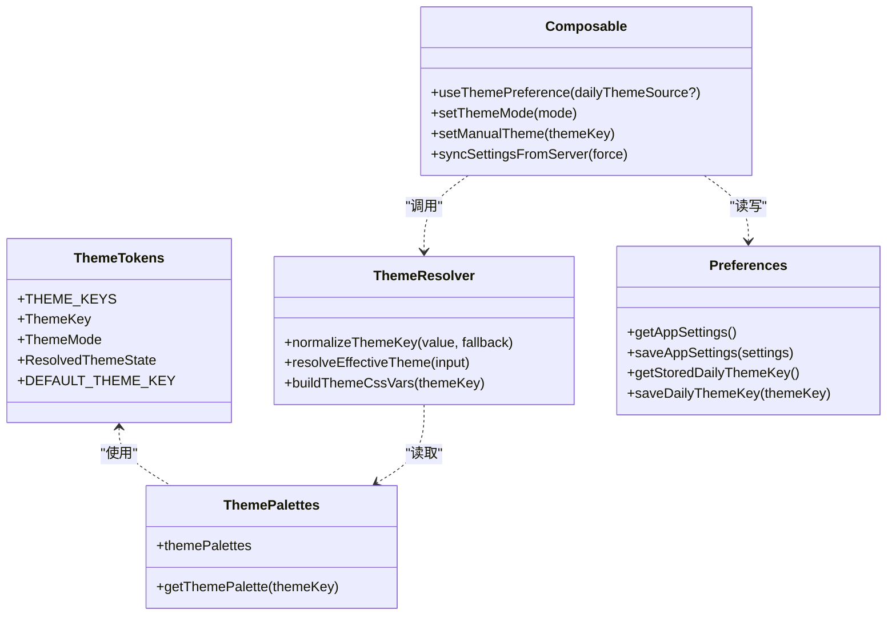
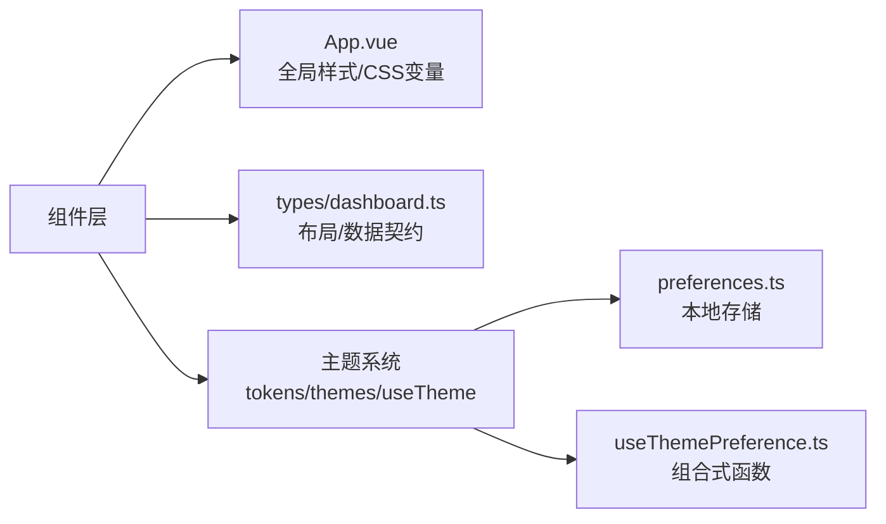

# 组件开发规范

<cite>
**本文引用的文件**   
- [apps/mobile/src/components/AppTabBar.vue](file://apps/mobile/src/components/AppTabBar.vue)
- [apps/mobile/src/components/DailyPulseCard.vue](file://apps/mobile/src/components/DailyPulseCard.vue)
- [apps/mobile/src/components/FiveElementDistribution.vue](file://apps/mobile/src/components/FiveElementDistribution.vue)
- [apps/mobile/src/components/QuickToolStrip.vue](file://apps/mobile/src/components/QuickToolStrip.vue)
- [apps/mobile/src/components/ThemePreviewCard.vue](file://apps/mobile/src/components/ThemePreviewCard.vue)
- [apps/mobile/src/theme/themes.ts](file://apps/mobile/src/theme/themes.ts)
- [apps/mobile/src/theme/tokens.ts](file://apps/mobile/src/theme/tokens.ts)
- [apps/mobile/src/theme/useTheme.ts](file://apps/mobile/src/theme/useTheme.ts)
- [apps/mobile/src/composables/useThemePreference.ts](file://apps/mobile/src/composables/useThemePreference.ts)
- [apps/mobile/src/services/preferences.ts](file://apps/mobile/src/services/preferences.ts)
- [apps/mobile/src/types/dashboard.ts](file://apps/mobile/src/types/dashboard.ts)
- [apps/mobile/src/App.vue](file://apps/mobile/src/App.vue)
- [apps/mobile/src/main.ts](file://apps/mobile/src/main.ts)
- [apps/mobile/package.json](file://apps/mobile/package.json)
</cite>

## 目录
1. [引言](#引言)
2. [项目结构](#项目结构)
3. [核心组件](#核心组件)
4. [架构总览](#架构总览)
5. [组件详解](#组件详解)
6. [依赖关系分析](#依赖关系分析)
7. [性能考量](#性能考量)
8. [故障排查指南](#故障排查指南)
9. [结论](#结论)
10. [附录](#附录)

## 引言
本指南面向小程序端组件开发，系统阐述全局组件与业务组件的设计原则、主题系统实现、组件可复用性策略以及最佳实践（性能优化、内存管理、跨平台兼容）。文档以实际代码为依据，结合架构图与流程图帮助读者快速理解并落地到业务场景。

## 项目结构
- 应用位于 apps/mobile，采用 Vue 3 + UniApp 架构，统一在 App.vue 中注入全局样式与主题变量。
- 组件集中在 apps/mobile/src/components，按功能域划分：导航、卡片、工具条、主题预览等。
- 主题系统位于 apps/mobile/src/theme，包含设计令牌、主题配色、解析与应用逻辑。
- 配置与偏好存储在 apps/mobile/src/services/preferences.ts，用于持久化用户设置与每日主题键。
- 类型定义集中于 apps/mobile/src/types，确保组件间数据契约一致。

图表来源
- [apps/mobile/src/main.ts:1-15](file://apps/mobile/src/main.ts#L1-L15)
- [apps/mobile/src/App.vue:1-299](file://apps/mobile/src/App.vue#L1-L299)
- [apps/mobile/src/components/AppTabBar.vue:1-205](file://apps/mobile/src/components/AppTabBar.vue#L1-L205)
- [apps/mobile/src/components/DailyPulseCard.vue:1-492](file://apps/mobile/src/components/DailyPulseCard.vue#L1-L492)
- [apps/mobile/src/components/QuickToolStrip.vue:1-237](file://apps/mobile/src/components/QuickToolStrip.vue#L1-L237)
- [apps/mobile/src/components/FiveElementDistribution.vue:1-132](file://apps/mobile/src/components/FiveElementDistribution.vue#L1-L132)
- [apps/mobile/src/components/ThemePreviewCard.vue:1-120](file://apps/mobile/src/components/ThemePreviewCard.vue#L1-L120)
- [apps/mobile/src/theme/tokens.ts:1-52](file://apps/mobile/src/theme/tokens.ts#L1-L52)
- [apps/mobile/src/theme/themes.ts:1-231](file://apps/mobile/src/theme/themes.ts#L1-L231)
- [apps/mobile/src/theme/useTheme.ts:1-115](file://apps/mobile/src/theme/useTheme.ts#L1-L115)
- [apps/mobile/src/services/preferences.ts:1-73](file://apps/mobile/src/services/preferences.ts#L1-L73)
- [apps/mobile/src/composables/useThemePreference.ts:1-163](file://apps/mobile/src/composables/useThemePreference.ts#L1-L163)

章节来源
- [apps/mobile/src/main.ts:1-15](file://apps/mobile/src/main.ts#L1-L15)
- [apps/mobile/src/App.vue:1-299](file://apps/mobile/src/App.vue#L1-L299)

## 核心组件
- 导航组件：AppTabBar 提供底部标签栏，支持路由跳转与滚动回到顶部。
- 业务卡片：DailyPulseCard 支持登录态判断、历史查询、连击天数展示与提交。
- 工具条：QuickToolStrip 提供快捷入口，通过事件向父级传递路由与标识。
- 数据展示：FiveElementDistribution 展示元素分布，计算宽度与等级。
- 主题预览：ThemePreviewCard 呈现主题配色与描述，支持选中态与静音态。

章节来源
- [apps/mobile/src/components/AppTabBar.vue:1-205](file://apps/mobile/src/components/AppTabBar.vue#L1-L205)
- [apps/mobile/src/components/DailyPulseCard.vue:1-492](file://apps/mobile/src/components/DailyPulseCard.vue#L1-L492)
- [apps/mobile/src/components/QuickToolStrip.vue:1-237](file://apps/mobile/src/components/QuickToolStrip.vue#L1-L237)
- [apps/mobile/src/components/FiveElementDistribution.vue:1-132](file://apps/mobile/src/components/FiveElementDistribution.vue#L1-L132)
- [apps/mobile/src/components/ThemePreviewCard.vue:1-120](file://apps/mobile/src/components/ThemePreviewCard.vue#L1-L120)

## 架构总览
主题系统围绕“设计令牌 → 主题配色 → CSS 变量 → 组件样式”的链路工作。用户偏好通过 useThemePreference 管理，resolveEffectiveTheme 决策生效主题，buildThemeCssVars 生成 CSS 变量，App.vue 注入页面级变量，组件通过 var(--theme-*) 使用。

图表来源
- [apps/mobile/src/composables/useThemePreference.ts:1-163](file://apps/mobile/src/composables/useThemePreference.ts#L1-L163)
- [apps/mobile/src/services/preferences.ts:1-73](file://apps/mobile/src/services/preferences.ts#L1-L73)
- [apps/mobile/src/theme/useTheme.ts:1-115](file://apps/mobile/src/theme/useTheme.ts#L1-L115)
- [apps/mobile/src/theme/themes.ts:1-231](file://apps/mobile/src/theme/themes.ts#L1-L231)
- [apps/mobile/src/App.vue:1-299](file://apps/mobile/src/App.vue#L1-L299)

## 组件详解

### 导航组件：AppTabBar
- 设计要点
  - props：currentTab 限定类型，避免运行时错误。
  - 交互：点击同项时触发滚动回到顶部；防止重复导航。
  - 路由：使用 uni.redirectTo 进行页面跳转，避免堆栈膨胀。
- 样式：通过 CSS 变量读取主题色，保证与整体风格一致。
- 可复用性：将图标 glyph 抽象为类名，便于扩展新图标。

图表来源
- [apps/mobile/src/components/AppTabBar.vue:38-62](file://apps/mobile/src/components/AppTabBar.vue#L38-L62)

章节来源
- [apps/mobile/src/components/AppTabBar.vue:1-205](file://apps/mobile/src/components/AppTabBar.vue#L1-L205)

### 业务卡片：DailyPulseCard
- 设计要点
  - 登录态控制：未登录显示引导区域，已登录才展示记录区域。
  - 历史与连击：首次加载查询 streak 与当日记录，控制可见性。
  - 表单交互：心绪选择与强度滑动，提交时防重复点击。
- 错误处理：API 调用失败静默处理，避免阻塞 UI。
- 可复用性：将日期格式化抽取为独立方法，便于测试与复用。

图表来源
- [apps/mobile/src/components/DailyPulseCard.vue:99-163](file://apps/mobile/src/components/DailyPulseCard.vue#L99-L163)

章节来源
- [apps/mobile/src/components/DailyPulseCard.vue:1-492](file://apps/mobile/src/components/DailyPulseCard.vue#L1-L492)

### 快捷工具条：QuickToolStrip
- 设计要点
  - 事件驱动：通过自定义事件向外抛出选择结果，便于上层统一处理。
  - 图标绘制：使用伪元素与几何图形绘制简洁图标，减少资源体积。
- 可复用性：将图标类型抽象为枚举，约束传参，提升类型安全。

章节来源
- [apps/mobile/src/components/QuickToolStrip.vue:1-237](file://apps/mobile/src/components/QuickToolStrip.vue#L1-L237)

### 数据展示：FiveElementDistribution
- 设计要点
  - 输入校验：过滤非有限数值，避免异常渲染。
  - 宽度与等级：基于最大/最小值归一化，提供等级文案。
- 可复用性：将计算逻辑封装为纯函数，便于单元测试与复用。

章节来源
- [apps/mobile/src/components/FiveElementDistribution.vue:1-132](file://apps/mobile/src/components/FiveElementDistribution.vue#L1-L132)

### 主题预览：ThemePreviewCard
- 设计要点
  - props 默认值：通过 withDefaults 提供默认静音态与非激活态。
  - 事件：对外暴露 select 事件，便于上层选择主题。
  - 样式：使用 var(--theme-*) 读取主题变量，自动适配当前主题。

章节来源
- [apps/mobile/src/components/ThemePreviewCard.vue:1-120](file://apps/mobile/src/components/ThemePreviewCard.vue#L1-L120)

### 主题系统：设计令牌与主题解析
- 设计令牌（tokens.ts）
  - 定义 ThemeKey、ThemeMode、ThemePalette 与 ResolvedThemeState。
  - 提供默认主题键与主题键集合常量。
- 主题配色（themes.ts）
  - 基于基础色板创建多套主题配色，包含主色、辅助色、表面色、阴影等。
- 主题解析与变量生成（useTheme.ts）
  - normalizeThemeKey 规范化输入。
  - resolveEffectiveTheme 根据模式与来源计算生效主题。
  - buildThemeCssVars 将主题配色映射为 CSS 变量。
- 偏好与组合式函数（useThemePreference.ts、preferences.ts）
  - useThemePreference 统一管理用户设置、每日主题键与服务器同步。
  - preferences.ts 提供本地存储接口与默认值合并。
- 全局注入（App.vue）
  - 在 page 作用域声明 CSS 变量，组件直接消费。

图表来源
- [apps/mobile/src/theme/tokens.ts:1-52](file://apps/mobile/src/theme/tokens.ts#L1-L52)
- [apps/mobile/src/theme/themes.ts:1-231](file://apps/mobile/src/theme/themes.ts#L1-L231)
- [apps/mobile/src/theme/useTheme.ts:1-115](file://apps/mobile/src/theme/useTheme.ts#L1-L115)
- [apps/mobile/src/services/preferences.ts:1-73](file://apps/mobile/src/services/preferences.ts#L1-L73)
- [apps/mobile/src/composables/useThemePreference.ts:1-163](file://apps/mobile/src/composables/useThemePreference.ts#L1-L163)

章节来源
- [apps/mobile/src/theme/tokens.ts:1-52](file://apps/mobile/src/theme/tokens.ts#L1-L52)
- [apps/mobile/src/theme/themes.ts:1-231](file://apps/mobile/src/theme/themes.ts#L1-L231)
- [apps/mobile/src/theme/useTheme.ts:1-115](file://apps/mobile/src/theme/useTheme.ts#L1-L115)
- [apps/mobile/src/composables/useThemePreference.ts:1-163](file://apps/mobile/src/composables/useThemePreference.ts#L1-L163)
- [apps/mobile/src/services/preferences.ts:1-73](file://apps/mobile/src/services/preferences.ts#L1-L73)
- [apps/mobile/src/App.vue:1-299](file://apps/mobile/src/App.vue#L1-L299)

## 依赖关系分析
- 组件依赖 App.vue 的全局样式与 CSS 变量，形成统一视觉语言。
- 主题系统通过组合式函数与服务层解耦，组件仅感知变量，不关心来源。
- 类型定义集中于 types/dashboard.ts，为首页布局与数据结构提供契约。

图表来源
- [apps/mobile/src/App.vue:1-299](file://apps/mobile/src/App.vue#L1-L299)
- [apps/mobile/src/types/dashboard.ts:1-168](file://apps/mobile/src/types/dashboard.ts#L1-L168)
- [apps/mobile/src/theme/tokens.ts:1-52](file://apps/mobile/src/theme/tokens.ts#L1-L52)
- [apps/mobile/src/theme/themes.ts:1-231](file://apps/mobile/src/theme/themes.ts#L1-L231)
- [apps/mobile/src/theme/useTheme.ts:1-115](file://apps/mobile/src/theme/useTheme.ts#L1-L115)
- [apps/mobile/src/services/preferences.ts:1-73](file://apps/mobile/src/services/preferences.ts#L1-L73)
- [apps/mobile/src/composables/useThemePreference.ts:1-163](file://apps/mobile/src/composables/useThemePreference.ts#L1-L163)

章节来源
- [apps/mobile/src/types/dashboard.ts:1-168](file://apps/mobile/src/types/dashboard.ts#L1-L168)
- [apps/mobile/src/App.vue:1-299](file://apps/mobile/src/App.vue#L1-L299)

## 性能考量
- 渲染优化
  - 合理使用 v-if/v-show 控制复杂卡片的渲染时机，如 DailyPulseCard 的登录态分支。
  - 列表渲染时使用 v-for 的 key，避免不必要的重排。
- 事件与交互
  - 导航组件中使用状态锁避免重复跳转，降低无效请求与页面抖动。
  - 表单提交增加保存状态，防止重复提交。
- 样式与变量
  - 通过 CSS 变量集中管理颜色与阴影，减少重复样式与重绘。
  - 使用相对单位（rpx）提升在不同设备上的适配性。
- 资源与体积
  - 图标使用伪元素绘制，减少图片资源与网络开销。
- 存储与同步
  - 偏好设置本地缓存，避免每次启动都发起网络请求；仅在登录状态下同步至服务端。

## 故障排查指南
- 主题不生效
  - 检查 App.vue 是否正确注入 CSS 变量。
  - 确认 useThemePreference 返回的 themeVars 已被应用到根节点或容器。
- 主题切换无响应
  - 核对 setThemeMode/setManualTheme 调用是否触发设置变更与持久化。
  - 检查 resolveEffectiveTheme 的输入参数（手动/每日/回退）是否符合预期。
- 卡片不显示或显示异常
  - DailyPulseCard：确认登录态与历史查询返回值；检查 visible 与 streak 的赋值逻辑。
  - QuickToolStrip：确认事件监听与路由跳转是否正确。
- 性能问题
  - 关注列表渲染与大图标的绘制；必要时拆分渲染或延迟加载。
  - 减少深层嵌套样式与复杂动画，优先使用 CSS 变量与简单过渡。

章节来源
- [apps/mobile/src/App.vue:1-299](file://apps/mobile/src/App.vue#L1-L299)
- [apps/mobile/src/composables/useThemePreference.ts:1-163](file://apps/mobile/src/composables/useThemePreference.ts#L1-L163)
- [apps/mobile/src/theme/useTheme.ts:1-115](file://apps/mobile/src/theme/useTheme.ts#L1-L115)
- [apps/mobile/src/components/DailyPulseCard.vue:1-492](file://apps/mobile/src/components/DailyPulseCard.vue#L1-L492)
- [apps/mobile/src/components/QuickToolStrip.vue:1-237](file://apps/mobile/src/components/QuickToolStrip.vue#L1-L237)

## 结论
本规范以实际代码为基础，总结了小程序端组件开发的设计原则与主题系统实现路径。通过明确的 props 设计、事件与插槽约定、主题变量注入与解析机制，以及可复用的数据展示组件，能够有效提升组件的可维护性与一致性。配合性能与故障排查建议，可在多平台环境下保持良好的用户体验。

## 附录
- 跨平台兼容性
  - 使用 uni.xxx API（如 uni.redirectTo、uni.pageScrollTo、uni.getStorageSync）保证在各小程序平台的一致行为。
  - 样式单位采用 rpx，提升在不同屏幕密度下的表现。
- 包管理与脚手架
  - package.json 中包含多平台构建脚本，便于一键编译与调试。

章节来源
- [apps/mobile/package.json:1-76](file://apps/mobile/package.json#L1-L76)
- [apps/mobile/src/components/AppTabBar.vue:40-62](file://apps/mobile/src/components/AppTabBar.vue#L40-L62)
- [apps/mobile/src/services/preferences.ts:36-55](file://apps/mobile/src/services/preferences.ts#L36-L55)