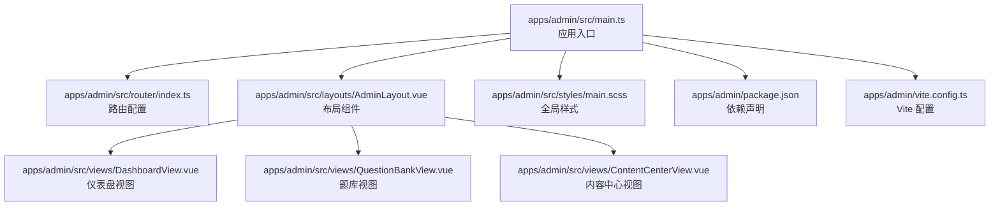
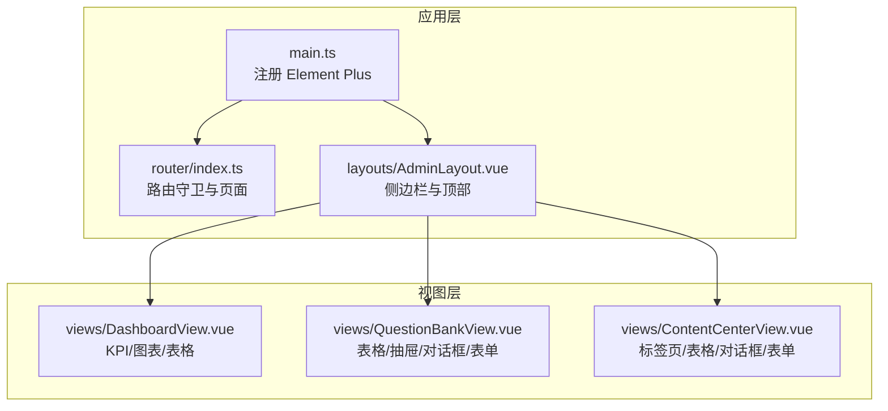
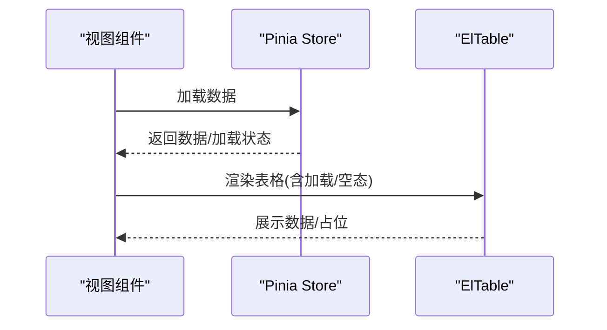
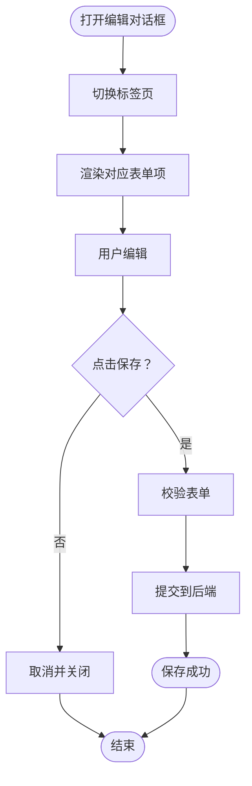
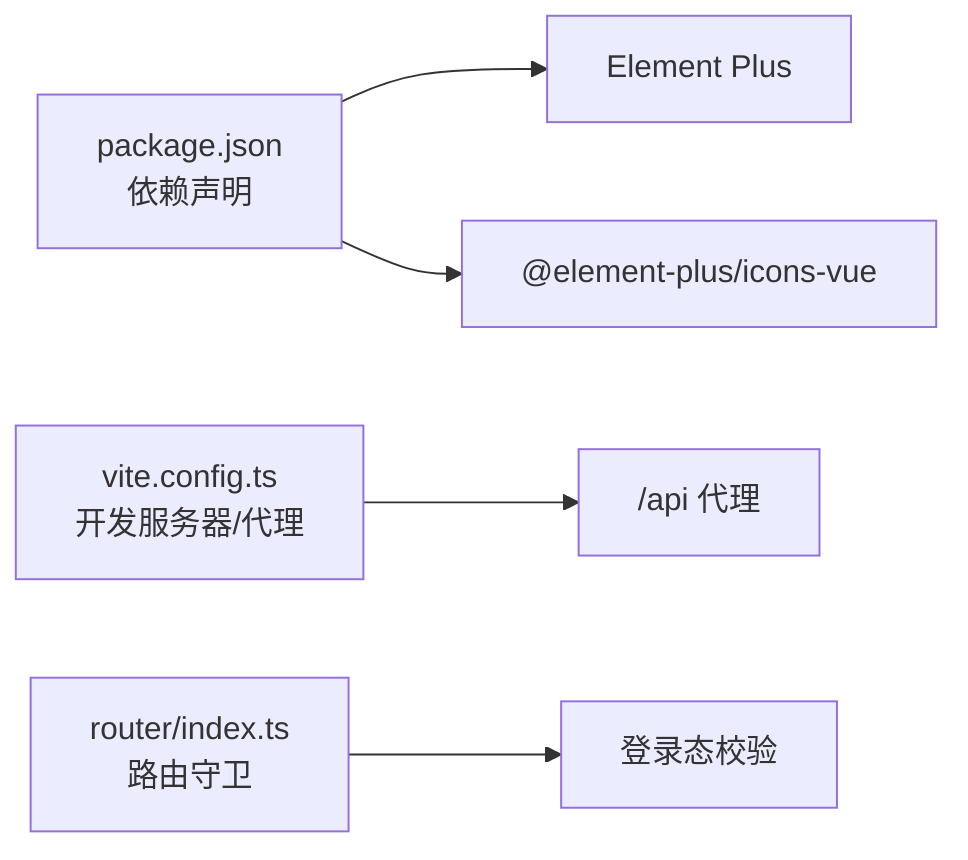

# Element Plus 组件库集成

<cite>
**本文引用的文件**
- [apps/admin/package.json](file://apps/admin/package.json)
- [apps/admin/vite.config.ts](file://apps/admin/vite.config.ts)
- [apps/admin/src/main.ts](file://apps/admin/src/main.ts)
- [apps/admin/src/styles/main.scss](file://apps/admin/src/styles/main.scss)
- [apps/admin/src/router/index.ts](file://apps/admin/src/router/index.ts)
- [apps/admin/src/layouts/AdminLayout.vue](file://apps/admin/src/layouts/AdminLayout.vue)
- [apps/admin/src/views/DashboardView.vue](file://apps/admin/src/views/DashboardView.vue)
- [apps/admin/src/views/QuestionBankView.vue](file://apps/admin/src/views/QuestionBankView.vue)
- [apps/admin/src/views/ContentCenterView.vue](file://apps/admin/src/views/ContentCenterView.vue)
</cite>

## 目录
1. [引言](#引言)
2. [项目结构](#项目结构)
3. [核心组件](#核心组件)
4. [架构总览](#架构总览)
5. [详细组件分析](#详细组件分析)
6. [依赖关系分析](#依赖关系分析)
7. [性能考虑](#性能考虑)
8. [故障排查指南](#故障排查指南)
9. [结论](#结论)
10. [附录](#附录)

## 引言
本指南面向在管理端应用中集成 Element Plus 的开发者，目标是帮助你从零开始完成安装与配置，掌握按需引入、主题定制与国际化设置；并结合实际业务场景，系统讲解表格、表单、对话框、抽屉、标签页、选择器、输入框、按钮、标签、消息与确认框等常用组件的使用方法与最佳实践。同时提供组件封装与复用策略，帮助你在复杂后台系统中高效构建一致、可维护的界面。

## 项目结构
管理端应用位于 apps/admin，采用 Vue 3 + TypeScript + Vite 构建，Element Plus 作为核心 UI 库被全局注册并在各视图中广泛使用。项目通过路由组织页面，布局组件负责导航与头部区域，视图组件承载具体业务功能。

**图表来源**
- [apps/admin/src/main.ts:1-15](file://apps/admin/src/main.ts#L1-L15)
- [apps/admin/src/router/index.ts:1-62](file://apps/admin/src/router/index.ts#L1-L62)
- [apps/admin/src/layouts/AdminLayout.vue:1-124](file://apps/admin/src/layouts/AdminLayout.vue#L1-L124)
- [apps/admin/src/views/DashboardView.vue:1-302](file://apps/admin/src/views/DashboardView.vue#L1-L302)
- [apps/admin/src/views/QuestionBankView.vue:1-800](file://apps/admin/src/views/QuestionBankView.vue#L1-L800)
- [apps/admin/src/views/ContentCenterView.vue:1-800](file://apps/admin/src/views/ContentCenterView.vue#L1-L800)
- [apps/admin/src/styles/main.scss:1-526](file://apps/admin/src/styles/main.scss#L1-L526)
- [apps/admin/package.json:1-32](file://apps/admin/package.json#L1-L32)
- [apps/admin/vite.config.ts:1-58](file://apps/admin/vite.config.ts#L1-L58)

**章节来源**
- [apps/admin/src/main.ts:1-15](file://apps/admin/src/main.ts#L1-L15)
- [apps/admin/src/router/index.ts:1-62](file://apps/admin/src/router/index.ts#L1-L62)
- [apps/admin/src/layouts/AdminLayout.vue:1-124](file://apps/admin/src/layouts/AdminLayout.vue#L1-L124)
- [apps/admin/src/styles/main.scss:1-526](file://apps/admin/src/styles/main.scss#L1-L526)
- [apps/admin/package.json:1-32](file://apps/admin/package.json#L1-L32)
- [apps/admin/vite.config.ts:1-58](file://apps/admin/vite.config.ts#L1-L58)

## 核心组件
- 全局注册与引入
  - 在应用入口完成 Element Plus 的全局注册，确保在所有组件中可直接使用。
  - 同时引入全局样式与图标库，保证视觉一致性与图标可用性。
- 主题与样式
  - 通过全局 SCSS 文件统一定义字体、背景、阴影与卡片圆角等基础样式。
  - 对 Element Plus 的卡片与表格容器进行圆角统一，提升整体质感。
- 国际化与尺寸
  - 当前项目未显式配置 Element Plus 的语言包与尺寸，若需要可参考官方文档进行扩展。

**章节来源**
- [apps/admin/src/main.ts:1-15](file://apps/admin/src/main.ts#L1-L15)
- [apps/admin/src/styles/main.scss:491-495](file://apps/admin/src/styles/main.scss#L491-L495)

## 架构总览
Element Plus 在管理端的使用遵循“全局注册 + 视图内按需组合”的模式。应用入口集中引入，视图层按业务需要组合多种组件，形成高复用、低耦合的界面模块。

**图表来源**
- [apps/admin/src/main.ts:1-15](file://apps/admin/src/main.ts#L1-L15)
- [apps/admin/src/router/index.ts:1-62](file://apps/admin/src/router/index.ts#L1-L62)
- [apps/admin/src/layouts/AdminLayout.vue:1-124](file://apps/admin/src/layouts/AdminLayout.vue#L1-L124)
- [apps/admin/src/views/DashboardView.vue:1-302](file://apps/admin/src/views/DashboardView.vue#L1-L302)
- [apps/admin/src/views/QuestionBankView.vue:1-800](file://apps/admin/src/views/QuestionBankView.vue#L1-L800)
- [apps/admin/src/views/ContentCenterView.vue:1-800](file://apps/admin/src/views/ContentCenterView.vue#L1-L800)

## 详细组件分析

### 表格（ElTable）
- 使用场景
  - 仪表盘最近订单列表、内容中心各类数据列表、题库视图的题库与题目列表。
- 关键特性
  - 支持固定列、斑马纹、空态与加载态。
  - 插槽用于自定义列内容（如格式化时间、状态标签）。
  - 与 Pinia 状态管理配合，实现数据驱动渲染。
- 高级用法
  - 通过计算属性与 v-loading 控制加载状态。
  - 使用 el-empty 在无数据时展示占位信息。
- 实战路径
  - 仪表盘最近订单：[apps/admin/src/views/DashboardView.vue:113-123](file://apps/admin/src/views/DashboardView.vue#L113-L123)
  - 内容中心通用表格：[apps/admin/src/views/ContentCenterView.vue:80-209](file://apps/admin/src/views/ContentCenterView.vue#L80-L209)
  - 题库视图表格：[apps/admin/src/views/QuestionBankView.vue:48-111](file://apps/admin/src/views/QuestionBankView.vue#L48-L111)

**图表来源**
- [apps/admin/src/views/DashboardView.vue:144-153](file://apps/admin/src/views/DashboardView.vue#L144-L153)
- [apps/admin/src/views/ContentCenterView.vue:80-209](file://apps/admin/src/views/ContentCenterView.vue#L80-L209)
- [apps/admin/src/views/QuestionBankView.vue:48-111](file://apps/admin/src/views/QuestionBankView.vue#L48-L111)

**章节来源**
- [apps/admin/src/views/DashboardView.vue:113-123](file://apps/admin/src/views/DashboardView.vue#L113-L123)
- [apps/admin/src/views/ContentCenterView.vue:80-209](file://apps/admin/src/views/ContentCenterView.vue#L80-L209)
- [apps/admin/src/views/QuestionBankView.vue:48-111](file://apps/admin/src/views/QuestionBankView.vue#L48-L111)

### 表单（ElForm）与输入控件
- 使用场景
  - 内容中心的多标签页编辑表单，包含文本输入、下拉选择、数字输入、开关、上传等。
- 关键特性
  - 表单项按标签页切换而切换，减少页面拥挤。
  - 使用 el-form-item 的 label-position 控制标签位置，提升可读性。
  - 上传组件结合业务接口实现音频上传与预览。
- 高级用法
  - 多级联动（如模板类型影响表单项）。
  - JSON 编辑区用于复杂配置的可视化与校验。
- 实战路径
  - 表单与上传：[apps/admin/src/views/ContentCenterView.vue:211-628](file://apps/admin/src/views/ContentCenterView.vue#L211-L628)

**图表来源**
- [apps/admin/src/views/ContentCenterView.vue:211-628](file://apps/admin/src/views/ContentCenterView.vue#L211-L628)

**章节来源**
- [apps/admin/src/views/ContentCenterView.vue:211-628](file://apps/admin/src/views/ContentCenterView.vue#L211-L628)

### 抽屉（ElDrawer）
- 使用场景
  - 题库详情编辑与状态变更，替代全屏页面，提升操作效率。
- 关键特性
  - 支持销毁策略与滚动容器，避免内存泄漏。
  - 通过 v-model 控制显示/隐藏，结合加载状态与只读模式。
- 实战路径
  - 题库抽屉：[apps/admin/src/views/QuestionBankView.vue:113-762](file://apps/admin/src/views/QuestionBankView.vue#L113-L762)

**章节来源**
- [apps/admin/src/views/QuestionBankView.vue:113-762](file://apps/admin/src/views/QuestionBankView.vue#L113-L762)

### 对话框（ElDialog）
- 使用场景
  - 新增/编辑内容、模板预览与版本回滚等轻量操作。
- 关键特性
  - 通过 v-model 控制显示/隐藏，配合 footer 自定义操作按钮。
  - 结合上传组件实现音频资源的上传与预览。
- 实战路径
  - 内容中心对话框：[apps/admin/src/views/ContentCenterView.vue:629-658](file://apps/admin/src/views/ContentCenterView.vue#L629-L658)
  - 题库新增对话框：[apps/admin/src/views/QuestionBankView.vue:764-800](file://apps/admin/src/views/QuestionBankView.vue#L764-L800)

**章节来源**
- [apps/admin/src/views/ContentCenterView.vue:629-658](file://apps/admin/src/views/ContentCenterView.vue#L629-L658)
- [apps/admin/src/views/QuestionBankView.vue:764-800](file://apps/admin/src/views/QuestionBankView.vue#L764-L800)

### 标签页（ElTabs）
- 使用场景
  - 内容中心按模块切换，分别维护运势内容、幸运物、报告模板与系统配置。
- 关键特性
  - 通过 v-model 绑定当前激活标签页，配合 tab-change 事件刷新数据。
  - 不同标签页下过滤器与表单项差异化展示。
- 实战路径
  - 标签页与过滤器：[apps/admin/src/views/ContentCenterView.vue:3-10](file://apps/admin/src/views/ContentCenterView.vue#L3-L10)

**章节来源**
- [apps/admin/src/views/ContentCenterView.vue:3-10](file://apps/admin/src/views/ContentCenterView.vue#L3-L10)

### 选择器与输入控件
- 使用场景
  - 筛选器（ElSelect）、关键词输入（ElInput）、数值输入（ElInputNumber）、开关（ElSwitch）等。
- 关键特性
  - clearable 与 placeholder 提升易用性。
  - 与 v-model 双向绑定，配合业务逻辑实现动态选项与联动。
- 实战路径
  - 筛选器与输入：[apps/admin/src/views/ContentCenterView.vue:11-77](file://apps/admin/src/views/ContentCenterView.vue#L11-L77)
  - 题库筛选：[apps/admin/src/views/QuestionBankView.vue:21-46](file://apps/admin/src/views/QuestionBankView.vue#L21-L46)

**章节来源**
- [apps/admin/src/views/ContentCenterView.vue:11-77](file://apps/admin/src/views/ContentCenterView.vue#L11-L77)
- [apps/admin/src/views/QuestionBankView.vue:21-46](file://apps/admin/src/views/QuestionBankView.vue#L21-L46)

### 按钮与标签
- 使用场景
  - 操作按钮（新建、保存、发布、归档、删除），状态标签（草稿/已发布/已归档）。
- 关键特性
  - 类型与朴素风格结合，突出关键动作。
  - 根据状态动态切换标签类型，增强可读性。
- 实战路径
  - 按钮与标签：[apps/admin/src/views/ContentCenterView.vue:175-208](file://apps/admin/src/views/ContentCenterView.vue#L175-L208)
  - 题库状态标签：[apps/admin/src/views/QuestionBankView.vue:78-84](file://apps/admin/src/views/QuestionBankView.vue#L78-L84)

**章节来源**
- [apps/admin/src/views/ContentCenterView.vue:175-208](file://apps/admin/src/views/ContentCenterView.vue#L175-L208)
- [apps/admin/src/views/QuestionBankView.vue:78-84](file://apps/admin/src/views/QuestionBankView.vue#L78-L84)

### 消息与确认框
- 使用场景
  - 登出成功提示、删除项前确认、保存状态反馈。
- 关键特性
  - ElMessage 提示成功/错误信息。
  - ElMessageBox 提供确认/取消交互，避免误操作。
- 实战路径
  - 登出与提示：[apps/admin/src/layouts/AdminLayout.vue:109-113](file://apps/admin/src/layouts/AdminLayout.vue#L109-L113)
  - 删除确认：[apps/admin/src/views/ContentCenterView.vue:175-208](file://apps/admin/src/views/ContentCenterView.vue#L175-L208)

**章节来源**
- [apps/admin/src/layouts/AdminLayout.vue:109-113](file://apps/admin/src/layouts/AdminLayout.vue#L109-L113)
- [apps/admin/src/views/ContentCenterView.vue:175-208](file://apps/admin/src/views/ContentCenterView.vue#L175-L208)

## 依赖关系分析
- 依赖声明
  - Element Plus 与图标库在 package.json 中声明，确保版本与功能稳定。
- 构建与代理
  - Vite 配置提供本地开发代理与基础路径，便于联调后端接口。
- 路由守卫
  - 路由前置守卫根据登录态跳转，保障受保护页面的安全访问。

**图表来源**
- [apps/admin/package.json:11-21](file://apps/admin/package.json#L11-L21)
- [apps/admin/vite.config.ts:42-56](file://apps/admin/vite.config.ts#L42-L56)
- [apps/admin/src/router/index.ts:46-61](file://apps/admin/src/router/index.ts#L46-L61)

**章节来源**
- [apps/admin/package.json:11-21](file://apps/admin/package.json#L11-L21)
- [apps/admin/vite.config.ts:42-56](file://apps/admin/vite.config.ts#L42-L56)
- [apps/admin/src/router/index.ts:46-61](file://apps/admin/src/router/index.ts#L46-L61)

## 性能考虑
- 按需引入
  - Element Plus 默认按需引入，可进一步通过构建工具的摇树优化减少打包体积。
- 图标与资源
  - 图标库按需引入，避免一次性加载过多资源。
- 表格与大列表
  - 使用 v-loading 与空态，避免空白闪烁；对超大数据集考虑虚拟滚动或分页。
- 样式体积
  - 全局样式集中管理，避免重复定义；对 Element Plus 容器统一圆角，减少重复样式。

[本节为通用指导，无需特定文件引用]

## 故障排查指南
- 组件不生效
  - 确认已在入口完成 Element Plus 注册与全局样式引入。
  - 检查是否正确导入所需图标与组件。
- 样式冲突
  - 检查全局 SCSS 是否覆盖了 Element Plus 的默认样式；必要时使用深度选择器。
- 路由跳转异常
  - 检查路由守卫逻辑与登录态判断，确保未登录用户无法访问受保护页面。
- 表单校验失败
  - 确认表单项绑定与校验规则一致；对异步校验添加 loading 状态。

**章节来源**
- [apps/admin/src/main.ts:1-15](file://apps/admin/src/main.ts#L1-L15)
- [apps/admin/src/router/index.ts:46-61](file://apps/admin/src/router/index.ts#L46-L61)

## 结论
通过在应用入口集中引入 Element Plus，并在视图层按业务场景灵活组合表格、表单、对话框、抽屉、标签页等组件，管理端能够快速搭建一致、可维护的后台界面。结合全局样式与路由守卫，可进一步提升用户体验与安全性。后续可在现有基础上完善国际化、主题定制与组件封装策略，持续提升开发效率与产品体验。

[本节为总结，无需特定文件引用]

## 附录

### 安装与配置步骤
- 安装依赖
  - 在管理端应用中安装 Element Plus 与图标库。
- 全局注册
  - 在应用入口注册 Element Plus，并引入全局样式。
- 按需引入
  - 保持默认按需引入策略，避免全量引入导致体积增大。
- 主题定制
  - 通过全局 SCSS 覆盖 Element Plus 容器样式；如需更细粒度定制，可引入 CSS 变量或 SCSS 变量文件。
- 国际化设置
  - 如需国际化，可在入口处引入语言包并配置默认语言。

**章节来源**
- [apps/admin/package.json:11-21](file://apps/admin/package.json#L11-L21)
- [apps/admin/src/main.ts:1-15](file://apps/admin/src/main.ts#L1-L15)
- [apps/admin/src/styles/main.scss:491-495](file://apps/admin/src/styles/main.scss#L491-L495)

### 常用组件使用清单
- 表格：用于数据列表展示与操作，支持空态与加载态。
- 表单：用于复杂配置与编辑，结合上传与校验。
- 抽屉：用于详情编辑与状态变更，提升操作效率。
- 对话框：用于新增/编辑与预览，配合底部操作按钮。
- 标签页：用于模块化管理，按标签页切换不同业务域。
- 选择器/输入控件：用于筛选与输入，结合双向绑定与联动。
- 按钮/标签：用于关键动作与状态标识，区分类型与朴素风格。
- 消息/确认框：用于提示与二次确认，避免误操作。

**章节来源**
- [apps/admin/src/views/DashboardView.vue:113-123](file://apps/admin/src/views/DashboardView.vue#L113-L123)
- [apps/admin/src/views/ContentCenterView.vue:80-209](file://apps/admin/src/views/ContentCenterView.vue#L80-L209)
- [apps/admin/src/views/QuestionBankView.vue:48-111](file://apps/admin/src/views/QuestionBankView.vue#L48-L111)
- [apps/admin/src/views/ContentCenterView.vue:211-628](file://apps/admin/src/views/ContentCenterView.vue#L211-L628)
- [apps/admin/src/views/QuestionBankView.vue:113-762](file://apps/admin/src/views/QuestionBankView.vue#L113-L762)
- [apps/admin/src/views/ContentCenterView.vue:3-10](file://apps/admin/src/views/ContentCenterView.vue#L3-L10)
- [apps/admin/src/views/ContentCenterView.vue:11-77](file://apps/admin/src/views/ContentCenterView.vue#L11-L77)
- [apps/admin/src/views/QuestionBankView.vue:21-46](file://apps/admin/src/views/QuestionBankView.vue#L21-L46)
- [apps/admin/src/views/ContentCenterView.vue:175-208](file://apps/admin/src/views/ContentCenterView.vue#L175-L208)
- [apps/admin/src/views/QuestionBankView.vue:78-84](file://apps/admin/src/views/QuestionBankView.vue#L78-L84)
- [apps/admin/src/layouts/AdminLayout.vue:109-113](file://apps/admin/src/layouts/AdminLayout.vue#L109-L113)