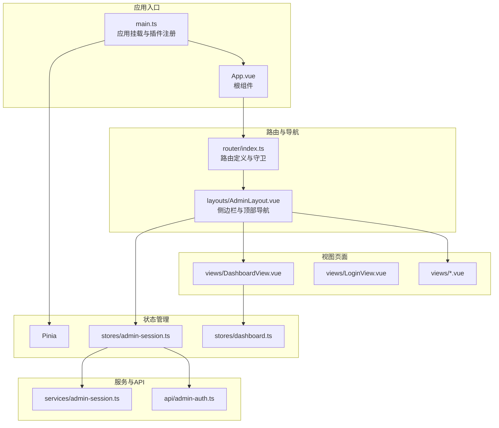
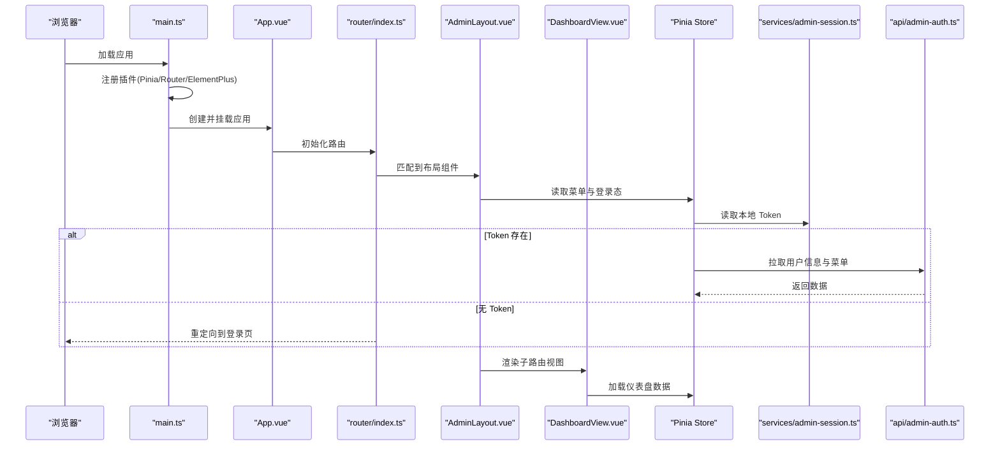
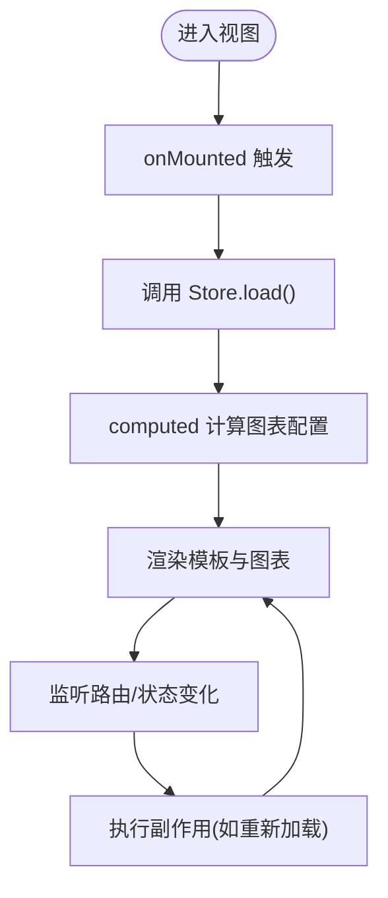
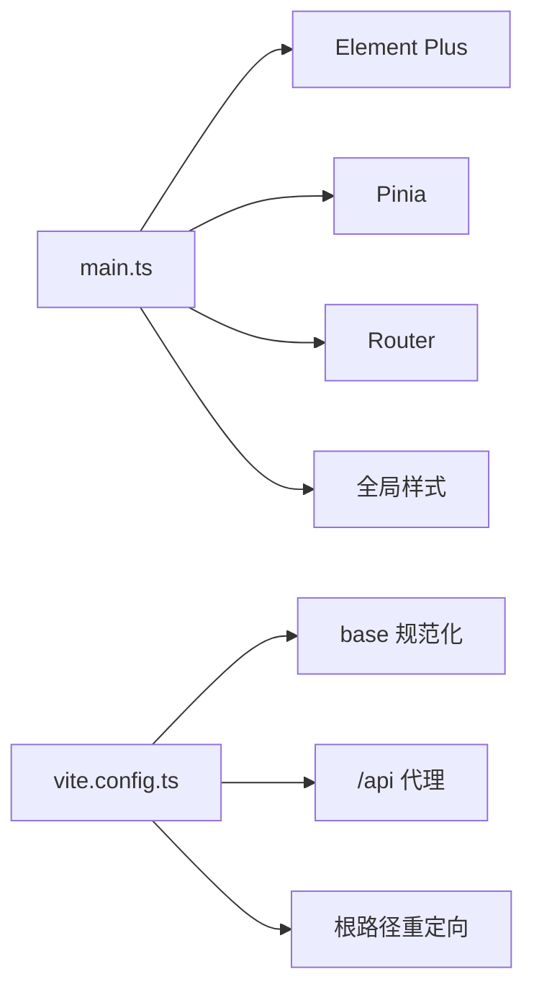
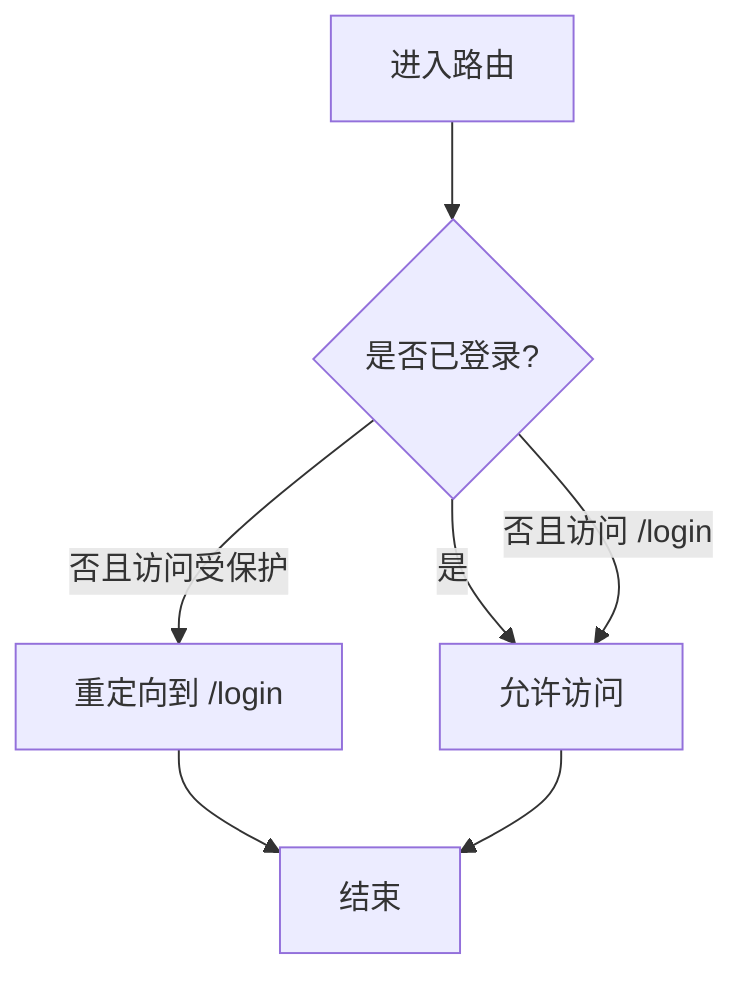
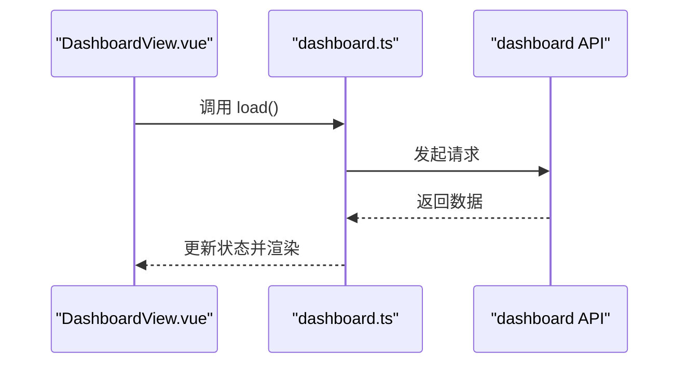
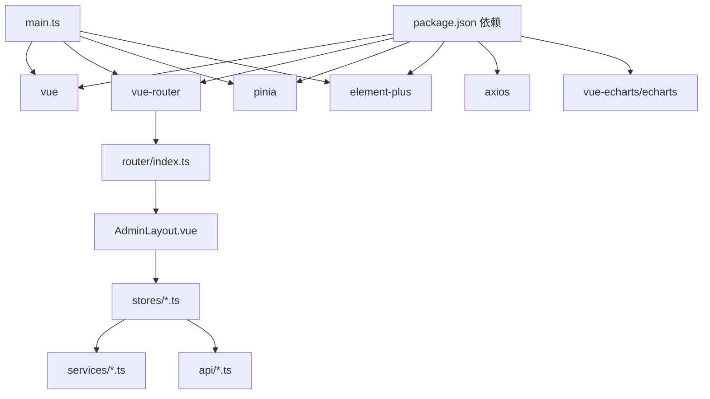

# Vue 3 架构与配置

<cite>
**本文引用的文件**
- [apps/admin/src/main.ts](file://apps/admin/src/main.ts)
- [apps/admin/src/App.vue](file://apps/admin/src/App.vue)
- [apps/admin/src/router/index.ts](file://apps/admin/src/router/index.ts)
- [apps/admin/src/layouts/AdminLayout.vue](file://apps/admin/src/layouts/AdminLayout.vue)
- [apps/admin/src/views/DashboardView.vue](file://apps/admin/src/views/DashboardView.vue)
- [apps/admin/src/stores/admin-session.ts](file://apps/admin/src/stores/admin-session.ts)
- [apps/admin/src/stores/dashboard.ts](file://apps/admin/src/stores/dashboard.ts)
- [apps/admin/src/services/admin-session.ts](file://apps/admin/src/services/admin-session.ts)
- [apps/admin/src/api/admin-auth.ts](file://apps/admin/src/api/admin-auth.ts)
- [apps/admin/vite.config.ts](file://apps/admin/vite.config.ts)
- [apps/admin/package.json](file://apps/admin/package.json)
- [apps/admin/tsconfig.json](file://apps/admin/tsconfig.json)
- [apps/admin/tsconfig.app.json](file://apps/admin/tsconfig.app.json)
</cite>

## 目录
1. [简介](#简介)
2. [项目结构](#项目结构)
3. [核心组件](#核心组件)
4. [架构总览](#架构总览)
5. [详细组件分析](#详细组件分析)
6. [依赖关系分析](#依赖关系分析)
7. [性能考虑](#性能考虑)
8. [故障排查指南](#故障排查指南)
9. [结论](#结论)
10. [附录](#附录)

## 简介
本文件面向 Vue 3 管理端应用，系统性阐述组合式 API 的使用模式、TypeScript 集成、初始化配置、根组件设计与生命周期、路由配置与守卫、以及状态管理最佳实践。目标是帮助开发者快速理解并高效扩展该管理端前端工程。

## 项目结构
管理端应用采用 Vite + Vue 3 + TypeScript + Pinia + Element Plus 技术栈，目录组织遵循“按功能域分层”的方式：入口、路由、布局、视图、组件、服务、API、状态管理与样式资源清晰分离。

图表来源
- [apps/admin/src/main.ts:1-15](file://apps/admin/src/main.ts#L1-L15)
- [apps/admin/src/App.vue:1-4](file://apps/admin/src/App.vue#L1-L4)
- [apps/admin/src/router/index.ts:1-62](file://apps/admin/src/router/index.ts#L1-L62)
- [apps/admin/src/layouts/AdminLayout.vue:1-124](file://apps/admin/src/layouts/AdminLayout.vue#L1-L124)
- [apps/admin/src/views/DashboardView.vue:1-302](file://apps/admin/src/views/DashboardView.vue#L1-L302)
- [apps/admin/src/stores/admin-session.ts:1-65](file://apps/admin/src/stores/admin-session.ts#L1-L65)
- [apps/admin/src/stores/dashboard.ts:1-40](file://apps/admin/src/stores/dashboard.ts#L1-L40)
- [apps/admin/src/services/admin-session.ts:1-30](file://apps/admin/src/services/admin-session.ts#L1-L30)
- [apps/admin/src/api/admin-auth.ts:1-63](file://apps/admin/src/api/admin-auth.ts#L1-L63)

章节来源
- [apps/admin/src/main.ts:1-15](file://apps/admin/src/main.ts#L1-L15)
- [apps/admin/src/router/index.ts:1-62](file://apps/admin/src/router/index.ts#L1-L62)

## 核心组件
- 应用入口与初始化：在入口文件中完成应用实例创建、插件注册（Pinia、Router、Element Plus）、全局样式引入与挂载。
- 路由与守卫：基于 History 模式的路由配置，结合登录态校验实现前置守卫，确保受保护页面仅在登录后访问。
- 布局与导航：侧边栏菜单动态来源于会话状态中的菜单列表；顶部区域展示当前页面标题与操作区。
- 视图与组合式 API：视图普遍采用 script setup + 组合式 API，使用 ref/reactive/computed/watch 管理本地状态与派生数据。
- 状态管理：Pinia Store 管理登录态、菜单、仪表盘数据等，提供 actions 异步加载与状态同步。
- TypeScript 集成：通过 tsconfig 与编译选项启用严格检查，接口定义 API 返回结构，增强类型安全。

章节来源
- [apps/admin/src/main.ts:1-15](file://apps/admin/src/main.ts#L1-L15)
- [apps/admin/src/router/index.ts:46-61](file://apps/admin/src/router/index.ts#L46-L61)
- [apps/admin/src/layouts/AdminLayout.vue:46-123](file://apps/admin/src/layouts/AdminLayout.vue#L46-L123)
- [apps/admin/src/views/DashboardView.vue:127-208](file://apps/admin/src/views/DashboardView.vue#L127-L208)
- [apps/admin/src/stores/admin-session.ts:15-64](file://apps/admin/src/stores/admin-session.ts#L15-L64)
- [apps/admin/src/stores/dashboard.ts:22-39](file://apps/admin/src/stores/dashboard.ts#L22-L39)

## 架构总览
下图展示了从入口到路由、布局、视图、状态与服务的整体交互流程。

图表来源
- [apps/admin/src/main.ts:9-14](file://apps/admin/src/main.ts#L9-L14)
- [apps/admin/src/App.vue:1-4](file://apps/admin/src/App.vue#L1-L4)
- [apps/admin/src/router/index.ts:4-44](file://apps/admin/src/router/index.ts#L4-L44)
- [apps/admin/src/layouts/AdminLayout.vue:54-122](file://apps/admin/src/layouts/AdminLayout.vue#L54-L122)
- [apps/admin/src/views/DashboardView.vue:144-149](file://apps/admin/src/views/DashboardView.vue#L144-L149)
- [apps/admin/src/stores/admin-session.ts:24-55](file://apps/admin/src/stores/admin-session.ts#L24-L55)
- [apps/admin/src/services/admin-session.ts:7-21](file://apps/admin/src/services/admin-session.ts#L7-L21)
- [apps/admin/src/api/admin-auth.ts:46-62](file://apps/admin/src/api/admin-auth.ts#L46-L62)

## 详细组件分析

### 组合式 API 使用模式与响应式实践
- setup() 与 script setup：视图普遍采用 script setup，直接在模板中声明与使用响应式数据与方法，减少样板代码。
- 响应式 API 实战：
  - ref：用于简单值或对象引用，如视图中的加载状态、本地计算属性。
  - reactive：用于复杂对象的响应式封装，Store 中的状态通常以 reactive 形式暴露。
  - computed：用于派生数据（如图表配置），根据 Store 数据动态生成。
  - watch/watchEffect：用于监听路由变化、状态变化并触发副作用（示例中多见于生命周期钩子与异步加载）。
- 生命周期钩子：在 onMounted 中触发数据加载，保证 DOM 可用后再进行网络请求或图表初始化。

图表来源
- [apps/admin/src/views/DashboardView.vue:144-149](file://apps/admin/src/views/DashboardView.vue#L144-L149)
- [apps/admin/src/views/DashboardView.vue:155-192](file://apps/admin/src/views/DashboardView.vue#L155-L192)

章节来源
- [apps/admin/src/views/DashboardView.vue:127-208](file://apps/admin/src/views/DashboardView.vue#L127-L208)

### TypeScript 集成与类型安全
- 编译配置：通过 tsconfig.json 的 references 将应用与 Node 环境配置拆分，tsconfig.app.json 启用严格本地检查与未使用项告警。
- 类型定义：
  - 接口：AdminProfile、AdminMenuItem 等明确 API 返回结构，便于在 Store 与组件中消费。
  - 泛型：HTTP 请求返回值使用泛型约束，确保类型推断准确。
- 最佳实践：
  - 明确 Props 类型与 Emits 类型（在需要时于组件中定义），避免 any。
  - 在 Store 中为 state 提供默认值与类型注解，确保 actions 返回值可控。

章节来源
- [apps/admin/tsconfig.json:1-8](file://apps/admin/tsconfig.json#L1-L8)
- [apps/admin/tsconfig.app.json:1-15](file://apps/admin/tsconfig.app.json#L1-L15)
- [apps/admin/src/api/admin-auth.ts:3-44](file://apps/admin/src/api/admin-auth.ts#L3-L44)

### 初始化配置与依赖注入
- main.ts 负责：
  - 引入并注册 Element Plus、Pinia、Router。
  - 引入全局样式。
  - 创建应用实例并挂载。
- 插件与全局配置：
  - Element Plus：提供 UI 组件库与主题能力。
  - Pinia：集中式状态管理。
  - Router：路由实例与历史模式。
- Vite 配置要点：
  - base：支持多子路径部署场景，自动规范化路径。
  - 代理：将 /api 前缀转发至后端服务。
  - 自定义中间件：根路径重定向到 base，提升部署体验。

图表来源
- [apps/admin/src/main.ts:1-15](file://apps/admin/src/main.ts#L1-L15)
- [apps/admin/vite.config.ts:42-57](file://apps/admin/vite.config.ts#L42-L57)

章节来源
- [apps/admin/src/main.ts:1-15](file://apps/admin/src/main.ts#L1-L15)
- [apps/admin/vite.config.ts:1-58](file://apps/admin/vite.config.ts#L1-L58)

### 根组件 App.vue 设计模式与生命周期
- 设计模式：根组件保持极简，仅包含一个路由出口，所有业务逻辑下沉至布局与视图层。
- 生命周期：根组件不直接参与业务逻辑，避免在顶层引入复杂副作用。

章节来源
- [apps/admin/src/App.vue:1-4](file://apps/admin/src/App.vue#L1-L4)

### 路由配置与守卫
- 路由结构：
  - 登录页：独立路由，无需登录态。
  - 根路由：包裹 AdminLayout，内部为嵌套路由（仪表盘、题库、内容中心、商业化、运营中心）。
- 懒加载：子路由组件通过动态导入实现按需加载。
- 守卫策略：
  - 未登录访问受保护路由时重定向到登录页。
  - 已登录访问登录页时重定向到首页。
  - 登录页自身放行。

图表来源
- [apps/admin/src/router/index.ts:46-61](file://apps/admin/src/router/index.ts#L46-L61)

章节来源
- [apps/admin/src/router/index.ts:1-62](file://apps/admin/src/router/index.ts#L1-L62)

### 状态管理与登录态
- 登录态存储：
  - Token 保存在 localStorage，键名固定，便于跨页面共享。
  - Store 初始化时从 localStorage 水合 token。
- 会话与菜单：
  - 登录成功后拉取用户信息与菜单，写入 Store 并持久化。
  - 退出登录清理 token 与状态。
- 仪表盘数据：
  - Store 提供统一的 load 方法，失败时回退到默认空数据，保证 UI 稳定性。

图表来源
- [apps/admin/src/views/DashboardView.vue:144-149](file://apps/admin/src/views/DashboardView.vue#L144-L149)
- [apps/admin/src/stores/dashboard.ts:27-37](file://apps/admin/src/stores/dashboard.ts#L27-L37)

章节来源
- [apps/admin/src/stores/admin-session.ts:15-64](file://apps/admin/src/stores/admin-session.ts#L15-L64)
- [apps/admin/src/services/admin-session.ts:1-30](file://apps/admin/src/services/admin-session.ts#L1-L30)
- [apps/admin/src/api/admin-auth.ts:46-62](file://apps/admin/src/api/admin-auth.ts#L46-L62)
- [apps/admin/src/stores/dashboard.ts:1-40](file://apps/admin/src/stores/dashboard.ts#L1-L40)

## 依赖关系分析
- 外部依赖：
  - Vue 3、Vue Router、Pinia、Element Plus、axios、vue-echarts、echarts。
- 内部模块耦合：
  - 视图依赖 Store；Store 依赖服务与 API；布局依赖 Store 与路由；入口统一注册插件。
- 可能的循环依赖风险：当前结构清晰，未发现明显循环依赖。

图表来源
- [apps/admin/package.json:11-30](file://apps/admin/package.json#L11-L30)
- [apps/admin/src/main.ts:1-15](file://apps/admin/src/main.ts#L1-L15)
- [apps/admin/src/router/index.ts:1-62](file://apps/admin/src/router/index.ts#L1-L62)
- [apps/admin/src/layouts/AdminLayout.vue:1-124](file://apps/admin/src/layouts/AdminLayout.vue#L1-L124)
- [apps/admin/src/stores/admin-session.ts:1-65](file://apps/admin/src/stores/admin-session.ts#L1-L65)
- [apps/admin/src/stores/dashboard.ts:1-40](file://apps/admin/src/stores/dashboard.ts#L1-L40)
- [apps/admin/src/services/admin-session.ts:1-30](file://apps/admin/src/services/admin-session.ts#L1-L30)
- [apps/admin/src/api/admin-auth.ts:1-63](file://apps/admin/src/api/admin-auth.ts#L1-L63)

章节来源
- [apps/admin/package.json:1-32](file://apps/admin/package.json#L1-L32)

## 性能考虑
- 路由懒加载：通过动态导入减少首屏包体，提升初始加载速度。
- 图表按需渲染：在 computed 中仅在有数据时渲染图表，避免空数据渲染开销。
- Store 回退策略：请求失败时使用默认空数据，避免重复错误重试导致的抖动。
- 代理与基础路径：合理设置 base 与 /api 代理，减少跨域与额外跳转。

## 故障排查指南
- 登录后仍被重定向到登录页
  - 检查 Token 是否正确写入 localStorage。
  - 确认路由守卫逻辑与登录页白名单。
- 仪表盘数据为空或报错
  - 查看 Store 的 load 行为与回退逻辑。
  - 检查后端接口可用性与鉴权头。
- 样式或主题异常
  - 确认 Element Plus 样式引入顺序与版本兼容。
- 开发服务器无法访问
  - 检查 Vite 代理配置与端口占用。

章节来源
- [apps/admin/src/router/index.ts:46-61](file://apps/admin/src/router/index.ts#L46-L61)
- [apps/admin/src/stores/dashboard.ts:27-37](file://apps/admin/src/stores/dashboard.ts#L27-L37)
- [apps/admin/src/services/admin-session.ts:7-21](file://apps/admin/src/services/admin-session.ts#L7-L21)
- [apps/admin/vite.config.ts:50-55](file://apps/admin/vite.config.ts#L50-L55)

## 结论
该管理端应用以清晰的分层架构与组合式 API 实践为基础，结合 Pinia 与 Element Plus 提供了良好的开发体验与可维护性。通过路由守卫、懒加载与状态回退等机制，兼顾了安全性与稳定性。建议在后续迭代中持续完善类型定义、组件 Props/Emits 的显式声明与更细粒度的错误边界处理。

## 附录
- 关键文件清单
  - 入口与配置：main.ts、vite.config.ts、tsconfig*.json、package.json
  - 路由与布局：router/index.ts、layouts/AdminLayout.vue
  - 视图与状态：views/*、stores/*.ts、services/admin-session.ts、api/admin-auth.ts
- 运行与构建
  - 开发：npm run dev
  - 构建：npm run build
  - 预览：npm run preview