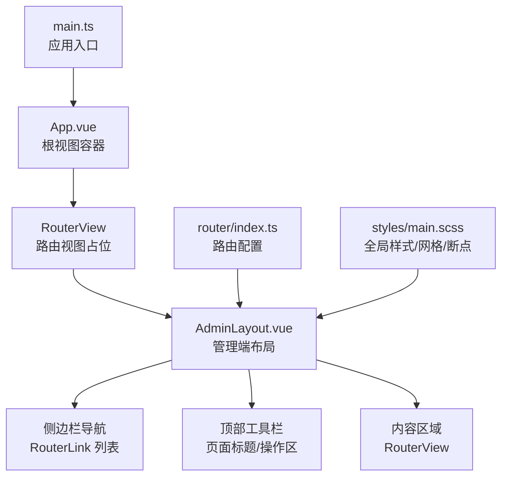
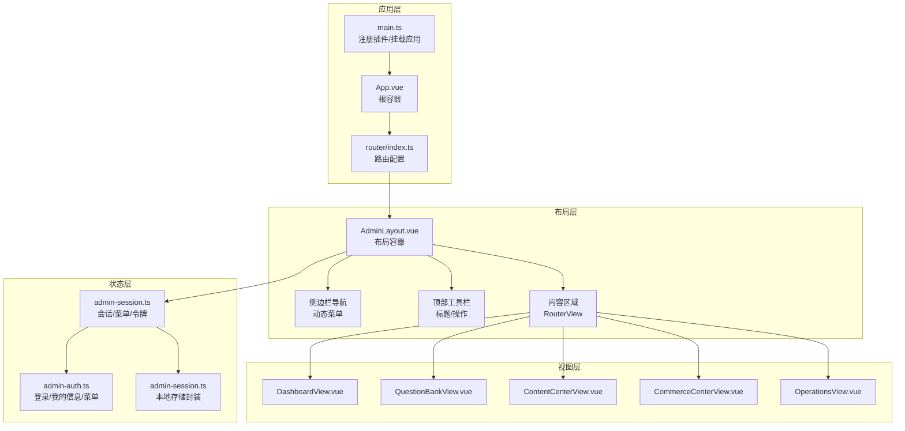
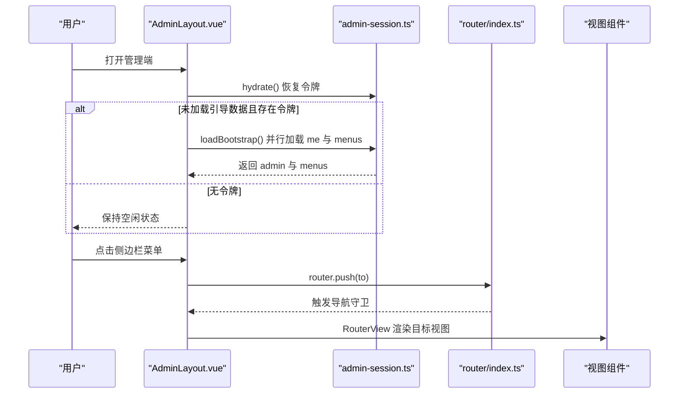
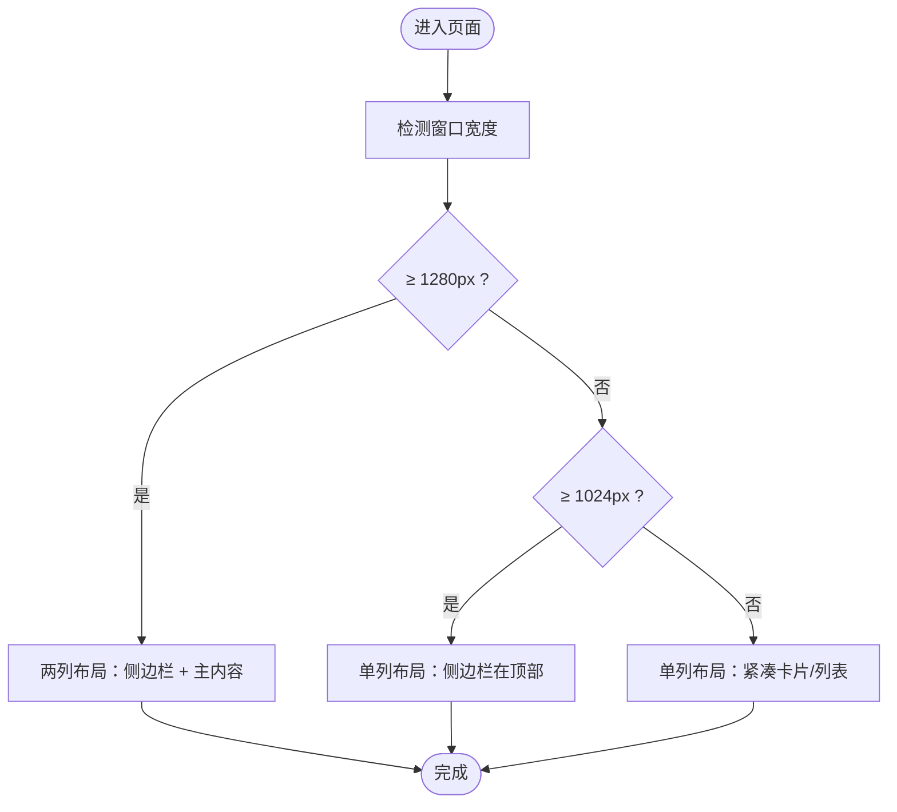
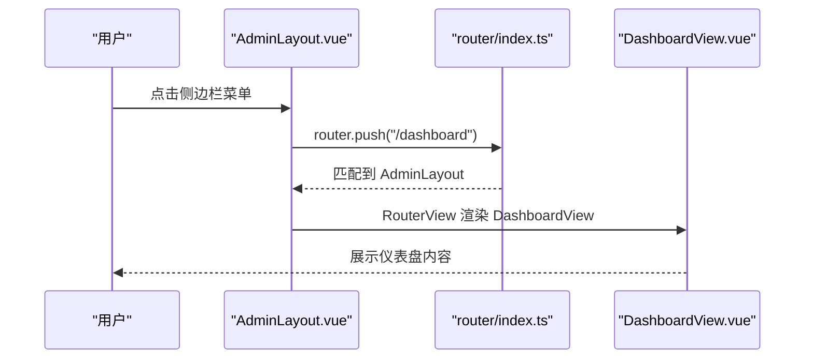
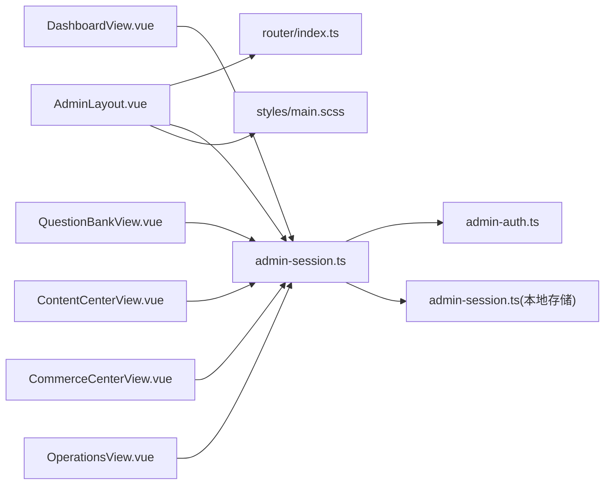

# 布局系统设计

<cite>
**本文引用的文件**
- [apps/admin/src/layouts/AdminLayout.vue](file://apps/admin/src/layouts/AdminLayout.vue)
- [apps/admin/src/router/index.ts](file://apps/admin/src/router/index.ts)
- [apps/admin/src/App.vue](file://apps/admin/src/App.vue)
- [apps/admin/src/main.ts](file://apps/admin/src/main.ts)
- [apps/admin/src/stores/admin-session.ts](file://apps/admin/src/stores/admin-session.ts)
- [apps/admin/src/styles/main.scss](file://apps/admin/src/styles/main.scss)
- [apps/admin/src/views/DashboardView.vue](file://apps/admin/src/views/DashboardView.vue)
- [apps/admin/src/views/QuestionBankView.vue](file://apps/admin/src/views/QuestionBankView.vue)
- [apps/admin/src/views/ContentCenterView.vue](file://apps/admin/src/views/ContentCenterView.vue)
- [apps/admin/src/views/CommerceCenterView.vue](file://apps/admin/src/views/CommerceCenterView.vue)
- [apps/admin/src/views/OperationsView.vue](file://apps/admin/src/views/OperationsView.vue)
- [apps/admin/src/api/admin-auth.ts](file://apps/admin/src/api/admin-auth.ts)
- [apps/admin/src/services/admin-session.ts](file://apps/admin/src/services/admin-session.ts)
</cite>

## 目录
1. [引言](#引言)
2. [项目结构](#项目结构)
3. [核心组件](#核心组件)
4. [架构总览](#架构总览)
5. [详细组件分析](#详细组件分析)
6. [依赖分析](#依赖分析)
7. [性能考虑](#性能考虑)
8. [故障排查指南](#故障排查指南)
9. [结论](#结论)
10. [附录](#附录)

## 引言
本设计文档围绕管理端布局系统展开，重点解析 AdminLayout.vue 的实现原理与设计理念，涵盖侧边栏导航、顶部工具栏、面包屑导航等核心布局元素；阐述响应式布局策略与移动端适配；说明布局组件的可配置性（菜单折叠、主题切换、语言切换等）现状与扩展路径；并给出视图组件与布局组件解耦的设计思路、路由与视图映射关系及动态路由处理方式，最后提供扩展指南与自定义布局实现方法。

## 项目结构
管理端采用单页应用（SPA）架构，基于 Vue 3 + Vue Router + Pinia + Element Plus 技术栈构建。AdminLayout.vue 作为根布局组件，承载侧边栏、顶部工具栏与内容区域；子路由通过 RouterView 动态渲染各业务视图；全局样式通过 SCSS 统一管理，包含网格布局与响应式断点。

**图表来源**
- [apps/admin/src/App.vue:1-4](file://apps/admin/src/App.vue#L1-L4)
- [apps/admin/src/layouts/AdminLayout.vue:1-124](file://apps/admin/src/layouts/AdminLayout.vue#L1-L124)
- [apps/admin/src/router/index.ts:1-62](file://apps/admin/src/router/index.ts#L1-L62)
- [apps/admin/src/main.ts:1-15](file://apps/admin/src/main.ts#L1-L15)
- [apps/admin/src/styles/main.scss:38-526](file://apps/admin/src/styles/main.scss#L38-L526)

**章节来源**
- [apps/admin/src/App.vue:1-4](file://apps/admin/src/App.vue#L1-L4)
- [apps/admin/src/main.ts:1-15](file://apps/admin/src/main.ts#L1-L15)
- [apps/admin/src/router/index.ts:1-62](file://apps/admin/src/router/index.ts#L1-L62)
- [apps/admin/src/styles/main.scss:38-526](file://apps/admin/src/styles/main.scss#L38-L526)

## 核心组件
- AdminLayout.vue：负责整体布局骨架，包括侧边栏导航、顶部工具栏、内容区域；根据路由动态计算页面标题与副标题；在挂载时加载会话与菜单数据；提供登出流程。
- 路由系统：通过嵌套路由将 AdminLayout 作为父布局，子路由对应各业务视图（仪表盘、题库、内容中心、商业化、运营中心）。
- 全局样式：采用 CSS Grid 实现两列布局（侧边栏 + 主内容），并在不同断点下自动降级为单列布局以适配移动端。
- 会话与菜单：Pinia Store 管理管理员令牌、个人信息与菜单项；在登录后并行拉取“我的信息”和“菜单列表”，用于动态生成导航。

**章节来源**
- [apps/admin/src/layouts/AdminLayout.vue:46-124](file://apps/admin/src/layouts/AdminLayout.vue#L46-L124)
- [apps/admin/src/router/index.ts:4-44](file://apps/admin/src/router/index.ts#L4-L44)
- [apps/admin/src/stores/admin-session.ts:15-65](file://apps/admin/src/stores/admin-session.ts#L15-L65)
- [apps/admin/src/styles/main.scss:38-526](file://apps/admin/src/styles/main.scss#L38-L526)

## 架构总览
管理端布局系统遵循“布局组件 + 子路由视图”的解耦架构。AdminLayout 仅承担布局职责，不直接耦合具体业务；业务视图通过路由懒加载按需加载，提升首屏性能。全局样式通过 SCSS 提供一致的视觉与交互体验，并通过媒体查询实现响应式布局。

**图表来源**
- [apps/admin/src/main.ts:1-15](file://apps/admin/src/main.ts#L1-L15)
- [apps/admin/src/App.vue:1-4](file://apps/admin/src/App.vue#L1-L4)
- [apps/admin/src/router/index.ts:1-62](file://apps/admin/src/router/index.ts#L1-L62)
- [apps/admin/src/layouts/AdminLayout.vue:1-124](file://apps/admin/src/layouts/AdminLayout.vue#L1-L124)
- [apps/admin/src/stores/admin-session.ts:1-65](file://apps/admin/src/stores/admin-session.ts#L1-L65)
- [apps/admin/src/api/admin-auth.ts:1-63](file://apps/admin/src/api/admin-auth.ts#L1-L63)
- [apps/admin/src/services/admin-session.ts:1-30](file://apps/admin/src/services/admin-session.ts#L1-L30)
- [apps/admin/src/views/DashboardView.vue:1-302](file://apps/admin/src/views/DashboardView.vue#L1-L302)
- [apps/admin/src/views/QuestionBankView.vue:1-800](file://apps/admin/src/views/QuestionBankView.vue#L1-L800)
- [apps/admin/src/views/ContentCenterView.vue:1-200](file://apps/admin/src/views/ContentCenterView.vue#L1-L200)
- [apps/admin/src/views/CommerceCenterView.vue:1-200](file://apps/admin/src/views/CommerceCenterView.vue#L1-L200)
- [apps/admin/src/views/OperationsView.vue:1-200](file://apps/admin/src/views/OperationsView.vue#L1-L200)

## 详细组件分析

### AdminLayout.vue 设计与实现
- 布局结构
  - 外层容器采用 CSS Grid，左侧固定宽度侧边栏，右侧为主内容区，满足桌面端双栏布局。
  - 顶部工具栏包含工作区标识、页面标题与副标题、用户信息与登出按钮。
  - 内容区通过 RouterView 渲染当前路由对应的视图组件。
- 侧边栏导航
  - 导航项来源于会话 Store 中的菜单数组；若无菜单则回退到默认“总览”菜单。
  - 当前激活项通过比较路由路径与菜单路径实现高亮。
- 顶部工具栏
  - 页面标题与副标题根据当前路由路径动态计算，覆盖仪表盘、题库、内容中心、商业化、运营中心等场景。
  - 登出流程调用会话 Store 的 logout 并跳转至登录页。
- 生命周期
  - 挂载时从本地存储恢复令牌，若存在令牌且未加载过引导数据，则并行加载“我的信息”和“菜单列表”。

**图表来源**
- [apps/admin/src/layouts/AdminLayout.vue:115-122](file://apps/admin/src/layouts/AdminLayout.vue#L115-L122)
- [apps/admin/src/stores/admin-session.ts:39-55](file://apps/admin/src/stores/admin-session.ts#L39-L55)
- [apps/admin/src/router/index.ts:46-61](file://apps/admin/src/router/index.ts#L46-L61)

**章节来源**
- [apps/admin/src/layouts/AdminLayout.vue:1-124](file://apps/admin/src/layouts/AdminLayout.vue#L1-L124)
- [apps/admin/src/stores/admin-session.ts:15-65](file://apps/admin/src/stores/admin-session.ts#L15-L65)
- [apps/admin/src/router/index.ts:46-61](file://apps/admin/src/router/index.ts#L46-L61)

### 响应式布局与移动端适配
- 布局策略
  - 桌面端：两列布局（侧边栏固定宽度 + 主内容自适应）。
  - 中等屏：侧边栏变为底部横条，主内容区紧随其后，形成单列布局。
  - 移动端：进一步简化网格结构，保证内容可读性与可操作性。
- 断点与样式
  - 通过媒体查询在不同宽度下调整网格列数与边框显示，确保在小屏设备上仍具备良好的可用性。

**图表来源**
- [apps/admin/src/styles/main.scss:507-525](file://apps/admin/src/styles/main.scss#L507-L525)

**章节来源**
- [apps/admin/src/styles/main.scss:38-526](file://apps/admin/src/styles/main.scss#L38-L526)

### 可配置性与扩展点
- 菜单折叠
  - 当前实现未提供侧边栏折叠开关；可在 AdminLayout 中引入折叠状态与切换按钮，结合 SCSS 控制侧边栏宽度与图标显隐。
- 主题切换
  - 当前未内置主题切换；可在全局样式中引入主题变量并通过 Store 管理主题偏好，动态切换 CSS 变量或主题类名。
- 语言切换
  - 当前未内置国际化；可在 Pinia Store 中维护语言状态，结合 i18n 库实现多语言切换，并在布局中暴露语言选择器。
- 顶部面包屑
  - 当前未实现面包屑导航；可在 AdminLayout 中基于路由元信息生成面包屑，或在各视图中自行实现并传入布局。

**章节来源**
- [apps/admin/src/layouts/AdminLayout.vue:1-124](file://apps/admin/src/layouts/AdminLayout.vue#L1-L124)
- [apps/admin/src/router/index.ts:1-62](file://apps/admin/src/router/index.ts#L1-L62)

### 视图组件与布局解耦
- 解耦方式
  - AdminLayout 仅负责布局与通用交互（登出、标题计算），业务视图通过路由懒加载独立加载，降低耦合度。
  - 各视图组件各自维护自身状态与业务逻辑，通过 Pinia Store 或 API 与后端交互。
- 路由与视图映射
  - 根路由指向 AdminLayout，其 children 定义了各业务视图的路径与组件映射。
  - 导航菜单项与路由路径一一对应，便于用户在侧边栏直接跳转。

**图表来源**
- [apps/admin/src/router/index.ts:13-42](file://apps/admin/src/router/index.ts#L13-L42)
- [apps/admin/src/layouts/AdminLayout.vue:10-21](file://apps/admin/src/layouts/AdminLayout.vue#L10-L21)

**章节来源**
- [apps/admin/src/router/index.ts:1-62](file://apps/admin/src/router/index.ts#L1-L62)
- [apps/admin/src/layouts/AdminLayout.vue:1-124](file://apps/admin/src/layouts/AdminLayout.vue#L1-L124)

### 关键视图组件概览
- 仪表盘（DashboardView）
  - 展示 KPI 卡片、图表与最近订单等运营数据；通过 Store 加载数据并提供刷新能力。
- 题库管理（QuestionBankView）
  - 支持题库列表、分类筛选、导入导出、状态流转与题干/选项编辑；提供抽屉式详情编辑器。
- 内容中心（ContentCenterView）
  - 多标签页管理运势内容、幸运物、报告模板与系统配置；支持筛选与状态变更。
- 商业化配置（CommerceCenterView）
  - 管理会员商品与订单统计；支持商品增删改与订单筛选。
- 运营中心（OperationsView）
  - 用户、订单、反馈、通知与审计日志的综合管理界面。

**章节来源**
- [apps/admin/src/views/DashboardView.vue:1-302](file://apps/admin/src/views/DashboardView.vue#L1-L302)
- [apps/admin/src/views/QuestionBankView.vue:1-800](file://apps/admin/src/views/QuestionBankView.vue#L1-L800)
- [apps/admin/src/views/ContentCenterView.vue:1-200](file://apps/admin/src/views/ContentCenterView.vue#L1-L200)
- [apps/admin/src/views/CommerceCenterView.vue:1-200](file://apps/admin/src/views/CommerceCenterView.vue#L1-L200)
- [apps/admin/src/views/OperationsView.vue:1-200](file://apps/admin/src/views/OperationsView.vue#L1-L200)

## 依赖分析
- 组件间依赖
  - AdminLayout 依赖路由与会话 Store；会话 Store 依赖 API 与本地存储服务；视图组件依赖各自业务 Store 与 API。
- 外部依赖
  - Vue Router：负责路由导航与守卫。
  - Pinia：集中式状态管理。
  - Element Plus：UI 组件库，提供按钮、表格、卡片、对话框等组件。
- 样式依赖
  - SCSS 全局样式定义网格布局与响应式断点，被 AdminLayout 与各视图共享。

**图表来源**
- [apps/admin/src/layouts/AdminLayout.vue:1-124](file://apps/admin/src/layouts/AdminLayout.vue#L1-L124)
- [apps/admin/src/router/index.ts:1-62](file://apps/admin/src/router/index.ts#L1-L62)
- [apps/admin/src/stores/admin-session.ts:1-65](file://apps/admin/src/stores/admin-session.ts#L1-L65)
- [apps/admin/src/api/admin-auth.ts:1-63](file://apps/admin/src/api/admin-auth.ts#L1-L63)
- [apps/admin/src/services/admin-session.ts:1-30](file://apps/admin/src/services/admin-session.ts#L1-L30)
- [apps/admin/src/styles/main.scss:38-526](file://apps/admin/src/styles/main.scss#L38-L526)

**章节来源**
- [apps/admin/src/layouts/AdminLayout.vue:1-124](file://apps/admin/src/layouts/AdminLayout.vue#L1-L124)
- [apps/admin/src/router/index.ts:1-62](file://apps/admin/src/router/index.ts#L1-L62)
- [apps/admin/src/stores/admin-session.ts:1-65](file://apps/admin/src/stores/admin-session.ts#L1-L65)
- [apps/admin/src/api/admin-auth.ts:1-63](file://apps/admin/src/api/admin-auth.ts#L1-L63)
- [apps/admin/src/services/admin-session.ts:1-30](file://apps/admin/src/services/admin-session.ts#L1-L30)
- [apps/admin/src/styles/main.scss:38-526](file://apps/admin/src/styles/main.scss#L38-L526)

## 性能考虑
- 路由懒加载：各视图通过动态导入按需加载，减少首屏体积与加载时间。
- 并行初始化：登录后并行请求“我的信息”和“菜单列表”，缩短引导时间。
- 样式优化：SCSS 全局样式避免重复定义，响应式断点集中管理，降低维护成本。
- 组件拆分：布局与视图解耦，便于缓存与复用。

[本节为通用性能建议，无需特定文件引用]

## 故障排查指南
- 登录后无法进入业务页
  - 检查路由守卫是否正确拦截未登录访问；确认令牌是否存在与有效。
  - 参考：[apps/admin/src/router/index.ts:46-61](file://apps/admin/src/router/index.ts#L46-L61)
- 侧边栏菜单为空
  - 确认会话 Store 是否成功加载菜单；检查网络请求与返回数据格式。
  - 参考：[apps/admin/src/stores/admin-session.ts:39-55](file://apps/admin/src/stores/admin-session.ts#L39-L55)
- 页面标题不匹配
  - 检查 AdminLayout 中的标题计算逻辑是否覆盖当前路由路径。
  - 参考：[apps/admin/src/layouts/AdminLayout.vue:74-107](file://apps/admin/src/layouts/AdminLayout.vue#L74-L107)
- 登出后未跳转
  - 确认登出流程是否调用 Store 的 logout 并触发路由跳转。
  - 参考：[apps/admin/src/layouts/AdminLayout.vue:109-113](file://apps/admin/src/layouts/AdminLayout.vue#L109-L113)

**章节来源**
- [apps/admin/src/router/index.ts:46-61](file://apps/admin/src/router/index.ts#L46-L61)
- [apps/admin/src/stores/admin-session.ts:39-55](file://apps/admin/src/stores/admin-session.ts#L39-L55)
- [apps/admin/src/layouts/AdminLayout.vue:74-113](file://apps/admin/src/layouts/AdminLayout.vue#L74-L113)

## 结论
AdminLayout.vue 以简洁清晰的布局结构与路由解耦设计，实现了管理端的统一入口与灵活扩展。通过 SCSS 媒体查询与网格布局，系统在桌面与移动设备上均具备良好的可用性。未来可在菜单折叠、主题切换、语言切换与面包屑导航等方面进行增强，进一步提升可配置性与用户体验。

[本节为总结性内容，无需特定文件引用]

## 附录

### 自定义布局实现步骤
- 新增布局组件
  - 在 layouts 目录创建新布局组件，定义所需区域（侧边栏、顶部、内容）。
  - 在 router 中为需要该布局的路由配置嵌套关系。
- 动态菜单与权限
  - 在会话 Store 中维护菜单数据结构，结合权限字段控制菜单显示。
- 响应式适配
  - 在全局样式中添加新的断点规则，确保在不同设备上的布局一致性。
- 主题与国际化
  - 引入主题变量与语言切换逻辑，通过 Store 管理用户偏好并持久化。

[本节为通用扩展指南，无需特定文件引用]