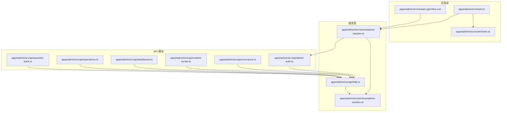
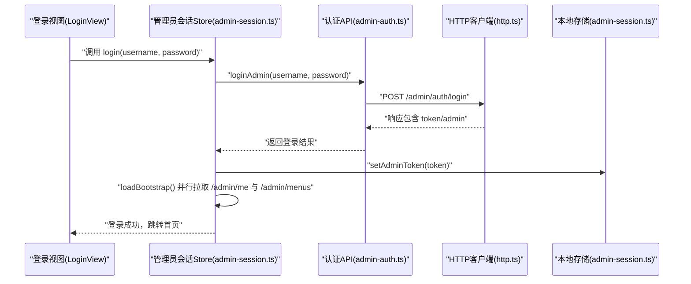
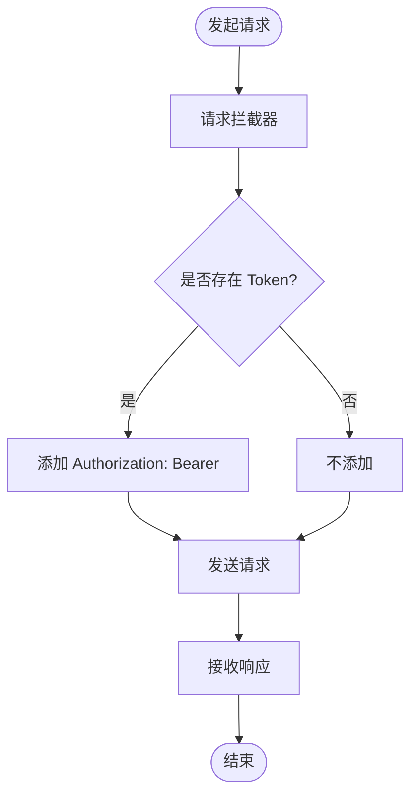
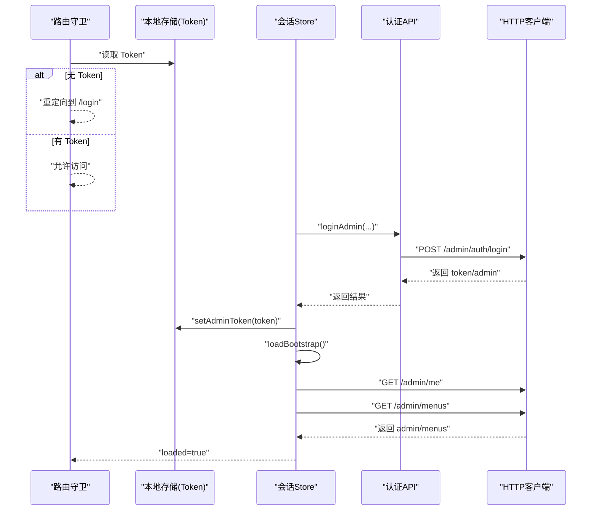
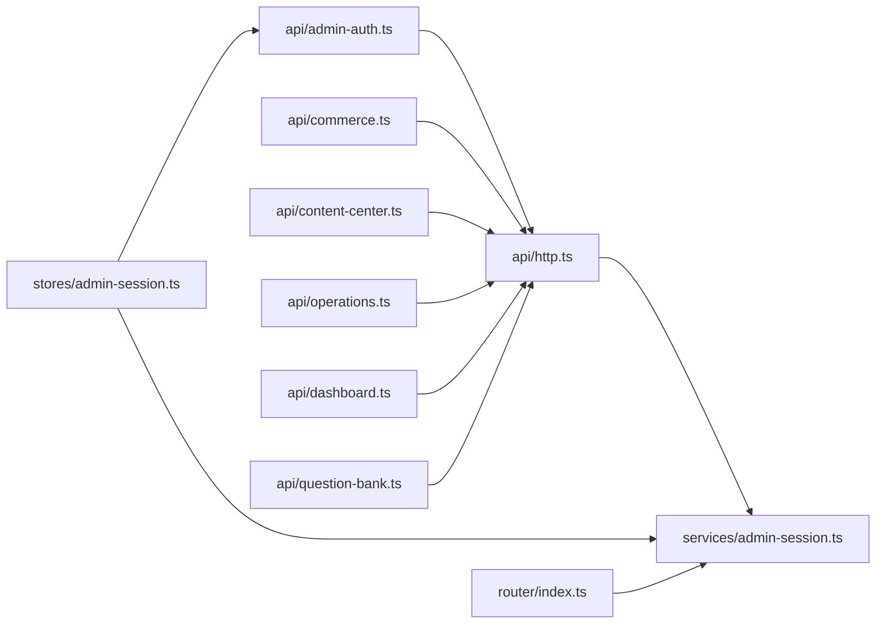

# 服务层开发

<cite>
**本文引用的文件**
- [apps/admin/src/services/admin-session.ts](file://apps/admin/src/services/admin-session.ts)
- [apps/admin/src/api/http.ts](file://apps/admin/src/api/http.ts)
- [apps/admin/src/stores/admin-session.ts](file://apps/admin/src/stores/admin-session.ts)
- [apps/admin/src/api/admin-auth.ts](file://apps/admin/src/api/admin-auth.ts)
- [apps/admin/src/api/commerce.ts](file://apps/admin/src/api/commerce.ts)
- [apps/admin/src/api/content-center.ts](file://apps/admin/src/api/content-center.ts)
- [apps/admin/src/api/dashboard.ts](file://apps/admin/src/api/dashboard.ts)
- [apps/admin/src/api/operations.ts](file://apps/admin/src/api/operations.ts)
- [apps/admin/src/api/question-bank.ts](file://apps/admin/src/api/question-bank.ts)
- [apps/admin/src/router/index.ts](file://apps/admin/src/router/index.ts)
- [apps/admin/src/views/LoginView.vue](file://apps/admin/src/views/LoginView.vue)
- [apps/admin/src/main.ts](file://apps/admin/src/main.ts)
- [apps/mobile/src/services/session.ts](file://apps/mobile/src/services/session.ts)
- [apps/mobile/src/services/errors.ts](file://apps/mobile/src/services/errors.ts)
- [services/api/src/auth/auth.service.spec.ts](file://services/api/src/auth/auth.service.spec.ts)
- [services/api/src/users/users.service.preferences.spec.ts](file://services/api/src/users/users.service.preferences.spec.ts)
</cite>

## 目录
1. [引言](#引言)
2. [项目结构](#项目结构)
3. [核心组件](#核心组件)
4. [架构总览](#架构总览)
5. [详细组件分析](#详细组件分析)
6. [依赖分析](#依赖分析)
7. [性能考虑](#性能考虑)
8. [故障排查指南](#故障排查指南)
9. [结论](#结论)
10. [附录](#附录)

## 引言
本指南面向管理端前端服务层开发，系统阐述服务层设计原则（单一职责、依赖注入思想、错误处理）、HTTP 请求封装（请求/响应拦截器、统一错误处理、可选重试机制）、管理员会话服务（登录认证、Token 管理、权限验证、自动登出）、API 抽象设计（接口定义、参数校验、返回值处理）以及单元测试策略与模拟数据使用方法。文档以管理端应用为载体，结合仓库中现有实现进行深入解析，并提供可操作的最佳实践建议。

## 项目结构
管理端服务层主要由以下层次构成：
- 应用入口与路由：初始化 Pinia、注册路由守卫，控制访问权限
- 会话与存储：Pinia Store 管理 Token、用户信息、菜单与加载状态；本地存储负责持久化 Token
- HTTP 层：Axios 实例封装、请求拦截器自动注入 Authorization 头
- API 模块：按功能域划分的 API 文件，统一返回结构与类型定义
- 视图层：登录页触发登录流程，成功后跳转首页

图表来源
- [apps/admin/src/main.ts:1-15](file://apps/admin/src/main.ts#L1-L15)
- [apps/admin/src/router/index.ts:1-62](file://apps/admin/src/router/index.ts#L1-L62)
- [apps/admin/src/stores/admin-session.ts:1-65](file://apps/admin/src/stores/admin-session.ts#L1-L65)
- [apps/admin/src/api/http.ts:1-21](file://apps/admin/src/api/http.ts#L1-L21)
- [apps/admin/src/services/admin-session.ts:1-30](file://apps/admin/src/services/admin-session.ts#L1-L30)
- [apps/admin/src/api/admin-auth.ts:1-63](file://apps/admin/src/api/admin-auth.ts#L1-L63)
- [apps/admin/src/api/commerce.ts:1-129](file://apps/admin/src/api/commerce.ts#L1-L129)
- [apps/admin/src/api/content-center.ts:1-381](file://apps/admin/src/api/content-center.ts#L1-L381)
- [apps/admin/src/api/dashboard.ts:1-46](file://apps/admin/src/api/dashboard.ts#L1-L46)
- [apps/admin/src/api/operations.ts:1-250](file://apps/admin/src/api/operations.ts#L1-L250)
- [apps/admin/src/api/question-bank.ts:1-275](file://apps/admin/src/api/question-bank.ts#L1-L275)

章节来源
- [apps/admin/src/main.ts:1-15](file://apps/admin/src/main.ts#L1-L15)
- [apps/admin/src/router/index.ts:1-62](file://apps/admin/src/router/index.ts#L1-L62)

## 核心组件
- 管理员会话服务：封装 Token 的读取、设置、清除，确保在浏览器可用时才进行持久化
- HTTP 客户端：创建 Axios 实例，设置基础地址、超时、公共头，并在请求拦截器中自动附加 Bearer Token
- 管理员会话 Store：集中管理 Token、管理员资料、菜单、加载状态；提供登录、引导加载（拉取 me 与 menus）、登出
- API 模块：按领域拆分，每个模块导出类型定义与具体请求函数，统一返回结构
- 路由守卫：根据 Token 控制访问，未登录跳转登录页，已登录禁止重复进入登录页

章节来源
- [apps/admin/src/services/admin-session.ts:1-30](file://apps/admin/src/services/admin-session.ts#L1-L30)
- [apps/admin/src/api/http.ts:1-21](file://apps/admin/src/api/http.ts#L1-L21)
- [apps/admin/src/stores/admin-session.ts:1-65](file://apps/admin/src/stores/admin-session.ts#L1-L65)
- [apps/admin/src/api/admin-auth.ts:1-63](file://apps/admin/src/api/admin-auth.ts#L1-L63)
- [apps/admin/src/router/index.ts:1-62](file://apps/admin/src/router/index.ts#L1-L62)

## 架构总览
管理端服务层采用“视图 -> Store -> API -> HTTP”链路，配合路由守卫实现权限控制。登录成功后，Store 将 Token 写入本地存储并通过请求拦截器自动携带；随后并行拉取管理员资料与菜单完成引导加载；登出时清空 Token 并重置状态。

图表来源
- [apps/admin/src/views/LoginView.vue:50-67](file://apps/admin/src/views/LoginView.vue#L50-L67)
- [apps/admin/src/stores/admin-session.ts:27-55](file://apps/admin/src/stores/admin-session.ts#L27-L55)
- [apps/admin/src/api/admin-auth.ts:46-62](file://apps/admin/src/api/admin-auth.ts#L46-L62)
- [apps/admin/src/api/http.ts:12-20](file://apps/admin/src/api/http.ts#L12-L20)
- [apps/admin/src/services/admin-session.ts:15-21](file://apps/admin/src/services/admin-session.ts#L15-L21)

## 详细组件分析

### 组件一：HTTP 请求封装
- 设计要点
  - 单一职责：仅负责创建 Axios 实例与通用拦截器
  - 可扩展性：通过 baseURL、headers、timeout 配置适配不同环境
  - 依赖注入思想：将 Token 获取能力注入到拦截器，避免在各 API 中重复实现
- 关键行为
  - 请求拦截：从本地存储读取 Token，存在则在 Authorization 头添加 Bearer
  - 响应拦截：当前未实现，可在后续扩展统一错误处理或日志
  - 错误统一处理：当前未实现，可在拦截器中捕获并转换为统一错误对象
  - 请求重试：当前未实现，可在拦截器中基于状态码与幂等性策略实现

图表来源
- [apps/admin/src/api/http.ts:12-20](file://apps/admin/src/api/http.ts#L12-L20)
- [apps/admin/src/services/admin-session.ts:7-13](file://apps/admin/src/services/admin-session.ts#L7-L13)

章节来源
- [apps/admin/src/api/http.ts:1-21](file://apps/admin/src/api/http.ts#L1-L21)
- [apps/admin/src/services/admin-session.ts:1-30](file://apps/admin/src/services/admin-session.ts#L1-L30)

### 组件二：管理员会话服务（登录认证、Token 管理、权限验证、自动登出）
- 设计要点
  - 单一职责：只负责 Token 的读写与清理，避免与业务耦合
  - 依赖注入思想：Store 在登录成功后写入 Token，HTTP 拦截器读取 Token，形成松耦合
  - 权限验证：路由守卫基于 Token 控制访问，防止未登录访问受保护页面
  - 自动登出：Store 提供 logout 清理 Token 与状态，配合路由守卫跳转登录页
- 关键行为
  - 登录：调用认证 API，保存 token 与 admin 信息，写入本地存储，执行引导加载
  - 引导加载：并行拉取管理员资料与菜单，标记 loaded
  - 登出：清理本地存储与 Store 状态，回到登录页

图表来源
- [apps/admin/src/router/index.ts:46-61](file://apps/admin/src/router/index.ts#L46-L61)
- [apps/admin/src/stores/admin-session.ts:27-55](file://apps/admin/src/stores/admin-session.ts#L27-L55)
- [apps/admin/src/api/admin-auth.ts:46-62](file://apps/admin/src/api/admin-auth.ts#L46-L62)
- [apps/admin/src/api/http.ts:12-20](file://apps/admin/src/api/http.ts#L12-L20)
- [apps/admin/src/services/admin-session.ts:15-21](file://apps/admin/src/services/admin-session.ts#L15-L21)

章节来源
- [apps/admin/src/stores/admin-session.ts:1-65](file://apps/admin/src/stores/admin-session.ts#L1-L65)
- [apps/admin/src/router/index.ts:1-62](file://apps/admin/src/router/index.ts#L1-L62)
- [apps/admin/src/views/LoginView.vue:1-139](file://apps/admin/src/views/LoginView.vue#L1-L139)

### 组件三：API 抽象设计（接口定义、参数校验、返回值处理）
- 设计要点
  - 类型驱动：每个 API 模块定义清晰的请求/响应类型，便于 IDE 提示与编译期校验
  - 返回结构：统一包装 code/message/timestamp/data，便于上层一致处理
  - 参数校验：在调用侧进行基本校验（如必填字段），复杂规则在后端 DTO 中实现
  - 返回值处理：API 函数返回 data 或 data.data，保持调用方一致性
- 典型模块
  - 认证模块：登录、获取管理员资料、获取菜单
  - 商业模块：会员产品、订单列表与统计
  - 内容中心模块：运势内容、幸运物、报告模板、配置项、上传音频
  - 运营模块：用户、反馈、审计日志、通知日志、图像生成状态
  - 仪表盘模块：聚合数据与趋势
  - 问卷题库模块：测试与分组的增删改查、状态变更

章节来源
- [apps/admin/src/api/admin-auth.ts:1-63](file://apps/admin/src/api/admin-auth.ts#L1-L63)
- [apps/admin/src/api/commerce.ts:1-129](file://apps/admin/src/api/commerce.ts#L1-L129)
- [apps/admin/src/api/content-center.ts:1-381](file://apps/admin/src/api/content-center.ts#L1-L381)
- [apps/admin/src/api/operations.ts:1-250](file://apps/admin/src/api/operations.ts#L1-L250)
- [apps/admin/src/api/dashboard.ts:1-46](file://apps/admin/src/api/dashboard.ts#L1-L46)
- [apps/admin/src/api/question-bank.ts:1-275](file://apps/admin/src/api/question-bank.ts#L1-L275)

### 组件四：单元测试策略与模拟数据
- 测试策略
  - 服务层测试：对核心业务逻辑进行单元测试，使用 Jest Mock 注入依赖（仓储、缓存、配置等）
  - 行为驱动：围绕边界条件、异常路径、组合场景编写用例
  - 模拟数据：构造最小化的用户/实体数据，确保测试稳定且可重复
- 示例参考
  - 认证服务：覆盖模拟登录、缺失 Token 场景、手机号登录与脱敏展示、偏好设置合并等
  - 用户服务：覆盖偏好更新合并逻辑与持久化行为

章节来源
- [services/api/src/auth/auth.service.spec.ts:1-186](file://services/api/src/auth/auth.service.spec.ts#L1-L186)
- [services/api/src/users/users.service.preferences.spec.ts:1-47](file://services/api/src/users/users.service.preferences.spec.ts#L1-L47)

## 依赖分析
- 组件内聚与耦合
  - admin-session.ts 与 http.ts 通过 Token 间接耦合，符合单一职责
  - stores/admin-session.ts 依赖 API 模块与本地存储，承担协调者角色
  - 各 API 模块仅依赖 http.ts，避免循环依赖
- 外部依赖
  - axios：HTTP 客户端
  - pinia：状态管理
  - vue-router：路由守卫与导航

图表来源
- [apps/admin/src/api/http.ts:1-21](file://apps/admin/src/api/http.ts#L1-L21)
- [apps/admin/src/services/admin-session.ts:1-30](file://apps/admin/src/services/admin-session.ts#L1-L30)
- [apps/admin/src/api/admin-auth.ts:1-63](file://apps/admin/src/api/admin-auth.ts#L1-L63)
- [apps/admin/src/api/commerce.ts:1-129](file://apps/admin/src/api/commerce.ts#L1-L129)
- [apps/admin/src/api/content-center.ts:1-381](file://apps/admin/src/api/content-center.ts#L1-L381)
- [apps/admin/src/api/operations.ts:1-250](file://apps/admin/src/api/operations.ts#L1-L250)
- [apps/admin/src/api/dashboard.ts:1-46](file://apps/admin/src/api/dashboard.ts#L1-L46)
- [apps/admin/src/api/question-bank.ts:1-275](file://apps/admin/src/api/question-bank.ts#L1-L275)
- [apps/admin/src/stores/admin-session.ts:1-65](file://apps/admin/src/stores/admin-session.ts#L1-L65)
- [apps/admin/src/router/index.ts:1-62](file://apps/admin/src/router/index.ts#L1-L62)

## 性能考虑
- 并行加载：引导阶段并行请求管理员资料与菜单，减少首屏等待时间
- 缓存策略：合理利用浏览器缓存与本地存储，避免重复请求
- 请求拦截器：统一注入 Token，减少重复代码与潜在错误
- 超时与重试：为长耗时上传（如音频）设置更高超时；可选在拦截器中实现幂等请求的指数退避重试
- 错误处理：在拦截器中统一处理网络错误与业务错误，避免分散处理导致性能与维护问题

## 故障排查指南
- 登录失败
  - 检查登录表单必填项与提示
  - 查看 Store 登录流程是否抛错，确认 API 返回结构
  - 确认 Token 是否写入本地存储
- 无法访问受保护页面
  - 检查路由守卫逻辑与 Token 读取
  - 确认登录成功后是否执行了引导加载
- 请求未携带 Token
  - 检查请求拦截器是否正确读取 Token
  - 确认浏览器支持 localStorage
- 退出登录后仍可访问
  - 确认 Store logout 是否清理了 Token 与状态
  - 确认路由守卫是否生效

章节来源
- [apps/admin/src/views/LoginView.vue:50-67](file://apps/admin/src/views/LoginView.vue#L50-L67)
- [apps/admin/src/stores/admin-session.ts:56-62](file://apps/admin/src/stores/admin-session.ts#L56-L62)
- [apps/admin/src/router/index.ts:46-61](file://apps/admin/src/router/index.ts#L46-L61)
- [apps/admin/src/api/http.ts:12-20](file://apps/admin/src/api/http.ts#L12-L20)
- [apps/admin/src/services/admin-session.ts:23-29](file://apps/admin/src/services/admin-session.ts#L23-L29)

## 结论
管理端服务层通过清晰的分层与职责划分，实现了登录认证、Token 管理、权限验证与自动登出的完整闭环。HTTP 层以拦截器为核心，统一注入 Token；API 层以类型驱动，保证契约稳定；Store 承担协调者，串联登录与引导加载。建议后续增强响应拦截器与统一错误处理、引入可选重试机制，并完善服务层与 API 层的单元测试覆盖率，持续提升稳定性与可维护性。

## 附录
- 移动端会话与错误处理参考
  - 移动端会话服务：提供 Token、用户信息、会话元数据的本地存储与清理
  - 错误处理：统一错误消息提取、认证过期判断与自动登出流程

章节来源
- [apps/mobile/src/services/session.ts:1-56](file://apps/mobile/src/services/session.ts#L1-L56)
- [apps/mobile/src/services/errors.ts:1-82](file://apps/mobile/src/services/errors.ts#L1-L82)