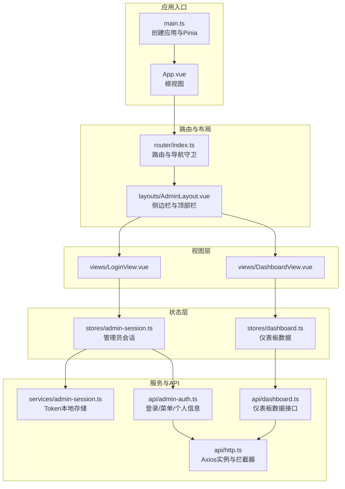
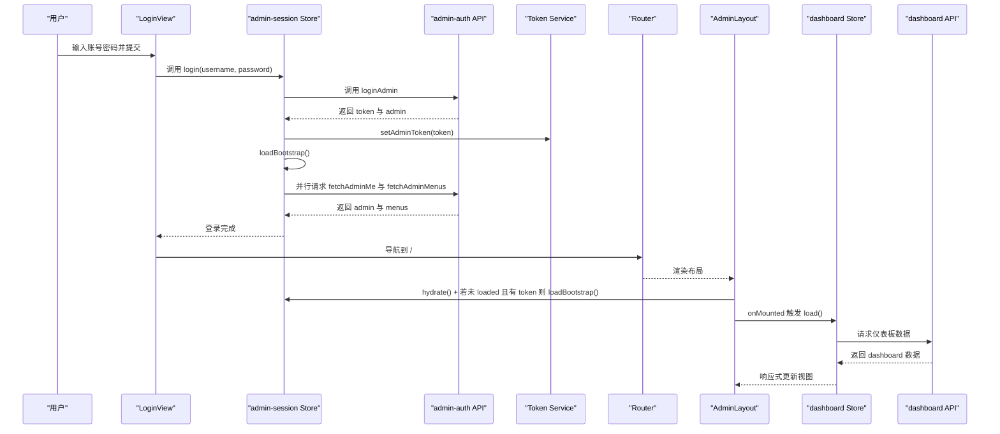
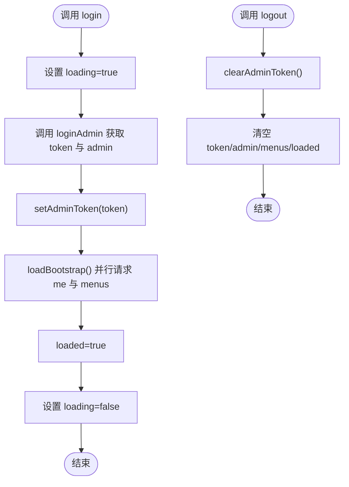
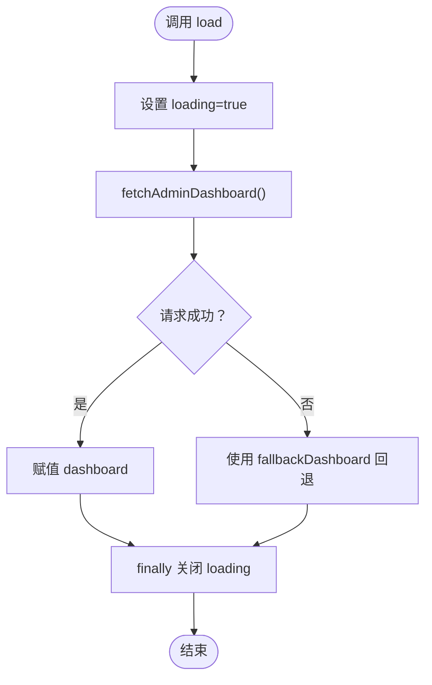
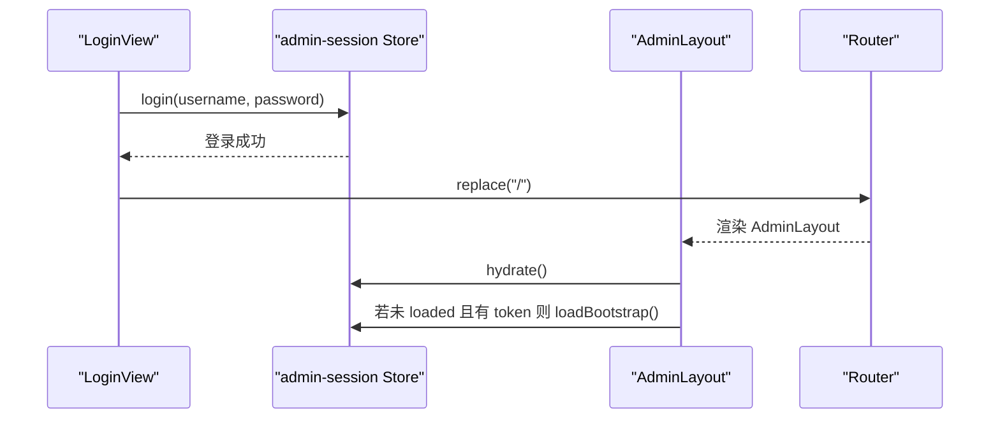
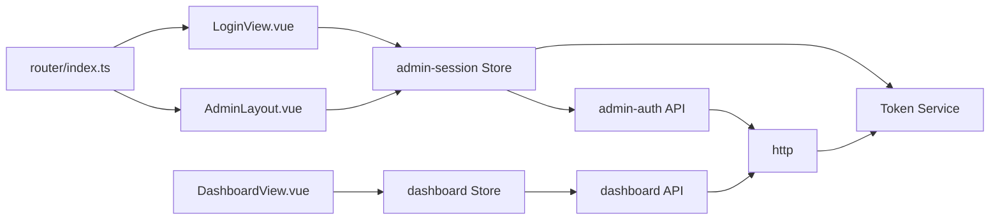

# 状态管理

<cite>
**本文引用的文件**
- [apps/admin/src/main.ts](file://apps/admin/src/main.ts)
- [apps/admin/src/App.vue](file://apps/admin/src/App.vue)
- [apps/admin/src/router/index.ts](file://apps/admin/src/router/index.ts)
- [apps/admin/src/layouts/AdminLayout.vue](file://apps/admin/src/layouts/AdminLayout.vue)
- [apps/admin/src/views/LoginView.vue](file://apps/admin/src/views/LoginView.vue)
- [apps/admin/src/views/DashboardView.vue](file://apps/admin/src/views/DashboardView.vue)
- [apps/admin/src/stores/admin-session.ts](file://apps/admin/src/stores/admin-session.ts)
- [apps/admin/src/stores/dashboard.ts](file://apps/admin/src/stores/dashboard.ts)
- [apps/admin/src/services/admin-session.ts](file://apps/admin/src/services/admin-session.ts)
- [apps/admin/src/api/admin-auth.ts](file://apps/admin/src/api/admin-auth.ts)
- [apps/admin/src/api/dashboard.ts](file://apps/admin/src/api/dashboard.ts)
- [apps/admin/src/api/http.ts](file://apps/admin/src/api/http.ts)
</cite>

## 目录
1. [简介](#简介)
2. [项目结构](#项目结构)
3. [核心组件](#核心组件)
4. [架构总览](#架构总览)
5. [详细组件分析](#详细组件分析)
6. [依赖关系分析](#依赖关系分析)
7. [性能考量](#性能考量)
8. [故障排查指南](#故障排查指南)
9. [结论](#结论)
10. [附录](#附录)

## 简介
本指南聚焦于管理端（admin）应用中的状态管理实践，基于 Pinia 实现。内容涵盖：
- Store 设计模式：模块化、职责清晰、可测试性
- 状态定义与 Actions：登录、会话引导、仪表板数据加载
- Getters 使用建议：当前未在示例中直接实现，但可扩展
- 管理员会话状态管理：登录状态维护、权限信息存储、用户信息缓存、Token 持久化
- 仪表板数据状态管理：数据获取、缓存更新、错误处理策略
- 跨组件状态共享：响应式订阅、状态持久化、路由守卫配合
- 调试技巧与性能优化建议

## 项目结构
管理端采用 Vue + Pinia 架构，状态集中在 stores 目录，通过 API 层与后端交互，服务层负责 Token 存取，路由守卫保障访问控制。

图表来源
- [apps/admin/src/main.ts:1-15](file://apps/admin/src/main.ts#L1-L15)
- [apps/admin/src/App.vue:1-4](file://apps/admin/src/App.vue#L1-L4)
- [apps/admin/src/router/index.ts:1-62](file://apps/admin/src/router/index.ts#L1-L62)
- [apps/admin/src/layouts/AdminLayout.vue:1-124](file://apps/admin/src/layouts/AdminLayout.vue#L1-L124)
- [apps/admin/src/views/LoginView.vue:1-139](file://apps/admin/src/views/LoginView.vue#L1-L139)
- [apps/admin/src/views/DashboardView.vue:1-302](file://apps/admin/src/views/DashboardView.vue#L1-L302)
- [apps/admin/src/stores/admin-session.ts:1-65](file://apps/admin/src/stores/admin-session.ts#L1-L65)
- [apps/admin/src/stores/dashboard.ts:1-40](file://apps/admin/src/stores/dashboard.ts#L1-L40)
- [apps/admin/src/services/admin-session.ts:1-30](file://apps/admin/src/services/admin-session.ts#L1-L30)
- [apps/admin/src/api/admin-auth.ts:1-63](file://apps/admin/src/api/admin-auth.ts#L1-L63)
- [apps/admin/src/api/dashboard.ts:1-46](file://apps/admin/src/api/dashboard.ts#L1-L46)
- [apps/admin/src/api/http.ts:1-21](file://apps/admin/src/api/http.ts#L1-L21)

章节来源
- [apps/admin/src/main.ts:1-15](file://apps/admin/src/main.ts#L1-L15)
- [apps/admin/src/router/index.ts:1-62](file://apps/admin/src/router/index.ts#L1-L62)

## 核心组件
- 管理员会话 Store（admin-session）
  - 状态：token、admin、menus、loading、loaded
  - Actions：hydrate、login、loadBootstrap、logout
  - 作用：登录态维护、菜单与个人信息拉取、Token 持久化
- 仪表板 Store（dashboard）
  - 状态：loading、dashboard（含 totals、today、revenue、charts、recentOrders）
  - Actions：load
  - 作用：仪表板数据获取、错误回退、加载状态管理
- Token 服务（admin-session service）
  - 提供 get/set/clearToken，封装 localStorage
- HTTP 客户端（http）
  - Axios 实例，自动注入 Authorization 头，统一超时与基础路径

章节来源
- [apps/admin/src/stores/admin-session.ts:15-64](file://apps/admin/src/stores/admin-session.ts#L15-L64)
- [apps/admin/src/stores/dashboard.ts:22-39](file://apps/admin/src/stores/dashboard.ts#L22-L39)
- [apps/admin/src/services/admin-session.ts:1-30](file://apps/admin/src/services/admin-session.ts#L1-L30)
- [apps/admin/src/api/http.ts:12-21](file://apps/admin/src/api/http.ts#L12-L21)

## 架构总览
管理端状态管理遵循“视图 -> Store -> API -> HTTP”链路，同时通过路由守卫与布局组件实现访问控制与菜单渲染。

图表来源
- [apps/admin/src/views/LoginView.vue:50-67](file://apps/admin/src/views/LoginView.vue#L50-L67)
- [apps/admin/src/stores/admin-session.ts:27-55](file://apps/admin/src/stores/admin-session.ts#L27-L55)
- [apps/admin/src/api/admin-auth.ts:46-62](file://apps/admin/src/api/admin-auth.ts#L46-L62)
- [apps/admin/src/services/admin-session.ts:15-21](file://apps/admin/src/services/admin-session.ts#L15-L21)
- [apps/admin/src/router/index.ts:46-61](file://apps/admin/src/router/index.ts#L46-L61)
- [apps/admin/src/layouts/AdminLayout.vue:115-122](file://apps/admin/src/layouts/AdminLayout.vue#L115-L122)
- [apps/admin/src/stores/dashboard.ts:28-37](file://apps/admin/src/stores/dashboard.ts#L28-L37)
- [apps/admin/src/api/dashboard.ts:42-45](file://apps/admin/src/api/dashboard.ts#L42-L45)

## 详细组件分析

### 管理员会话状态管理（admin-session Store）
- 状态设计
  - token：用于鉴权的字符串，初始化从本地存储读取
  - admin：当前管理员信息（用户名、显示名、角色、权限）
  - menus：菜单列表（路径、标签、元信息、权限标识）
  - loading/loaded：登录与引导加载的布尔状态
- Actions
  - hydrate：从本地存储同步 token 到内存
  - login：发起登录请求，成功后写入 token 并执行 loadBootstrap
  - loadBootstrap：并发拉取个人信息与菜单，设置 loaded=true
  - logout：清除 token 与内存状态，重置为未登录态
- 与服务层集成
  - 通过 Token Service 读写 localStorage，确保跨页面刷新仍保持登录态
- 与路由集成
  - 路由守卫根据 token 决定是否放行或重定向至登录页

图表来源
- [apps/admin/src/stores/admin-session.ts:27-62](file://apps/admin/src/stores/admin-session.ts#L27-L62)
- [apps/admin/src/services/admin-session.ts:15-29](file://apps/admin/src/services/admin-session.ts#L15-L29)

章节来源
- [apps/admin/src/stores/admin-session.ts:15-64](file://apps/admin/src/stores/admin-session.ts#L15-L64)
- [apps/admin/src/services/admin-session.ts:1-30](file://apps/admin/src/services/admin-session.ts#L1-L30)
- [apps/admin/src/router/index.ts:46-61](file://apps/admin/src/router/index.ts#L46-L61)

### 仪表板数据状态管理（dashboard Store）
- 状态设计
  - loading：数据加载中
  - dashboard：包含 totals、today、revenue、charts、recentOrders 的聚合数据
- Actions
  - load：发起请求获取仪表板数据；异常时回退到默认空数据；始终在 finally 中关闭 loading
- 错误处理策略
  - 通过 try/catch 包裹请求，失败时回退到 fallbackDashboard，保证 UI 不崩溃
- 与视图集成
  - DashboardView 使用 storeToRefs 订阅响应式状态，onMounted 自动触发加载

图表来源
- [apps/admin/src/stores/dashboard.ts:28-37](file://apps/admin/src/stores/dashboard.ts#L28-L37)
- [apps/admin/src/api/dashboard.ts:42-45](file://apps/admin/src/api/dashboard.ts#L42-L45)

章节来源
- [apps/admin/src/stores/dashboard.ts:22-39](file://apps/admin/src/stores/dashboard.ts#L22-L39)
- [apps/admin/src/views/DashboardView.vue:147-149](file://apps/admin/src/views/DashboardView.vue#L147-L149)

### 登录流程与会话引导（LoginView + AdminLayout）
- 登录视图
  - 表单校验、调用 admin-session Store 的 login，成功后跳转首页
- 会话引导
  - AdminLayout 在 mounted 中调用 hydrate 与条件性 loadBootstrap，确保进入受保护路由时具备菜单与用户信息
- 路由守卫
  - 未登录访问受保护路由自动跳转登录；已登录访问 /login 自动跳转 /

图表来源
- [apps/admin/src/views/LoginView.vue:50-67](file://apps/admin/src/views/LoginView.vue#L50-L67)
- [apps/admin/src/layouts/AdminLayout.vue:115-122](file://apps/admin/src/layouts/AdminLayout.vue#L115-L122)
- [apps/admin/src/router/index.ts:46-61](file://apps/admin/src/router/index.ts#L46-L61)

章节来源
- [apps/admin/src/views/LoginView.vue:1-139](file://apps/admin/src/views/LoginView.vue#L1-L139)
- [apps/admin/src/layouts/AdminLayout.vue:1-124](file://apps/admin/src/layouts/AdminLayout.vue#L1-L124)
- [apps/admin/src/router/index.ts:1-62](file://apps/admin/src/router/index.ts#L1-L62)

### HTTP 客户端与拦截器
- Axios 实例配置了基础 URL、超时与自定义头
- 请求拦截器自动从本地存储读取 token 并注入 Authorization 头，确保后续 API 调用具备鉴权

章节来源
- [apps/admin/src/api/http.ts:1-21](file://apps/admin/src/api/http.ts#L1-L21)

## 依赖关系分析
- 组件耦合
  - LoginView 依赖 admin-session Store 与路由
  - AdminLayout 依赖 admin-session Store 与路由，动态渲染菜单
  - DashboardView 依赖 dashboard Store
- 外部依赖
  - Pinia：状态容器
  - Element Plus：UI 组件库
  - Vue Router：路由与导航守卫
  - Axios：HTTP 客户端
- 可能的循环依赖
  - 当前结构清晰，未发现明显循环依赖

图表来源
- [apps/admin/src/views/LoginView.vue:40](file://apps/admin/src/views/LoginView.vue#L40)
- [apps/admin/src/layouts/AdminLayout.vue:52](file://apps/admin/src/layouts/AdminLayout.vue#L52)
- [apps/admin/src/views/DashboardView.vue:140](file://apps/admin/src/views/DashboardView.vue#L140)
- [apps/admin/src/stores/admin-session.ts:1](file://apps/admin/src/stores/admin-session.ts#L1)
- [apps/admin/src/stores/dashboard.ts:1](file://apps/admin/src/stores/dashboard.ts#L1)
- [apps/admin/src/api/admin-auth.ts:1](file://apps/admin/src/api/admin-auth.ts#L1)
- [apps/admin/src/api/dashboard.ts:1](file://apps/admin/src/api/dashboard.ts#L1)
- [apps/admin/src/api/http.ts:1](file://apps/admin/src/api/http.ts#L1)
- [apps/admin/src/services/admin-session.ts:1](file://apps/admin/src/services/admin-session.ts#L1)
- [apps/admin/src/router/index.ts:1](file://apps/admin/src/router/index.ts#L1)

章节来源
- [apps/admin/src/router/index.ts:1-62](file://apps/admin/src/router/index.ts#L1-L62)

## 性能考量
- 并发请求
  - 管理员会话引导阶段使用 Promise.all 并行拉取个人信息与菜单，减少首屏等待
- 加载状态
  - 仪表板与登录流程均设置 loading，在 finally 中统一关闭，避免 UI 卡顿
- 缓存策略
  - Token 本地持久化，避免每次刷新重新登录
  - 仪表板数据在异常时回退到 fallback，提升稳定性
- 建议
  - 对频繁切换的页面可引入轻量缓存（如内存缓存 + TTL），避免重复请求
  - 对大图表数据可做分页或懒加载，降低初始渲染压力
  - 使用 storeToRefs 避免不必要的响应式开销

## 故障排查指南
- 登录失败
  - 检查网络请求是否返回有效 token；确认 Token Service 是否正确写入 localStorage
  - 查看路由守卫是否正确重定向
- 仪表板数据为空
  - 确认 API 返回结构与类型定义一致；检查 fallback 是否生效
- 菜单不显示
  - 确认 loadBootstrap 是否成功；检查 menus 数据是否来自后端
- 退出登录后仍可访问
  - 确认 logout 是否清理了 token 与内存状态；检查路由守卫逻辑

章节来源
- [apps/admin/src/stores/admin-session.ts:56-62](file://apps/admin/src/stores/admin-session.ts#L56-L62)
- [apps/admin/src/stores/dashboard.ts:32-36](file://apps/admin/src/stores/dashboard.ts#L32-L36)
- [apps/admin/src/router/index.ts:46-61](file://apps/admin/src/router/index.ts#L46-L61)

## 结论
该管理端以 Pinia 为核心实现了清晰的状态管理：登录态与菜单信息通过会话 Store 统一维护，仪表板数据通过独立 Store 管理加载与回退策略。结合路由守卫与 HTTP 拦截器，形成从视图到状态再到 API 的完整闭环。建议在现有基础上进一步引入 Getters 与更细粒度的缓存策略，持续优化用户体验与性能表现。

## 附录
- 最佳实践清单
  - 使用 storeToRefs 订阅状态，避免解构丢失响应性
  - 在 Actions 中统一处理 loading 与错误，finally 中收尾
  - 将鉴权逻辑集中于路由守卫与 HTTP 拦截器，避免分散处理
  - 对高频数据引入缓存与节流，降低网络与渲染压力
- 调试技巧
  - 在浏览器开发者工具中查看 Pinia Store 状态变化
  - 使用 Vue DevTools 观察组件订阅与响应式更新
  - 打印网络请求与响应，定位 API 异常点