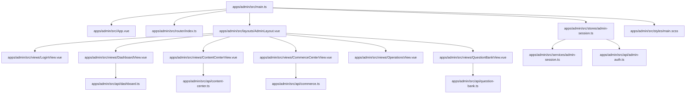
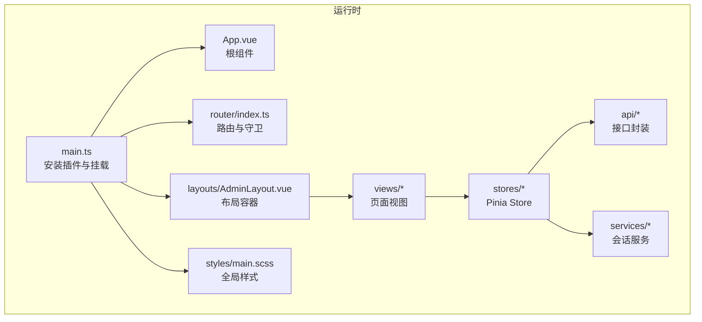
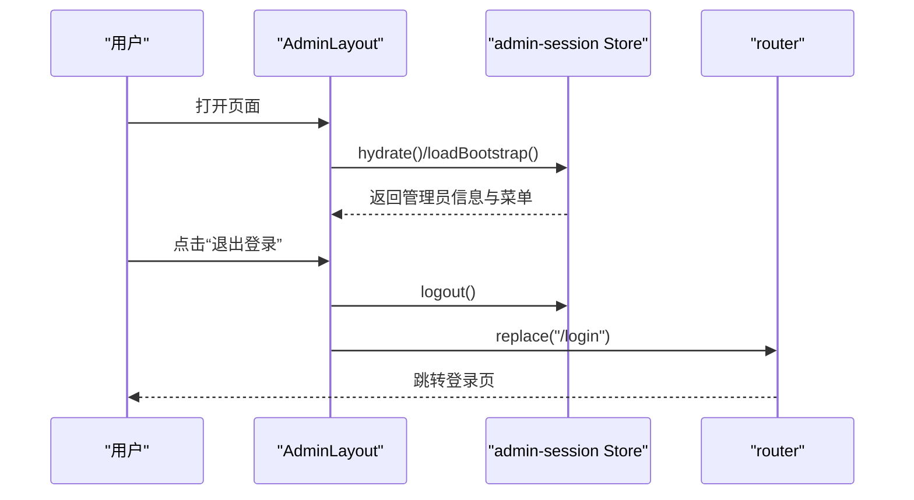
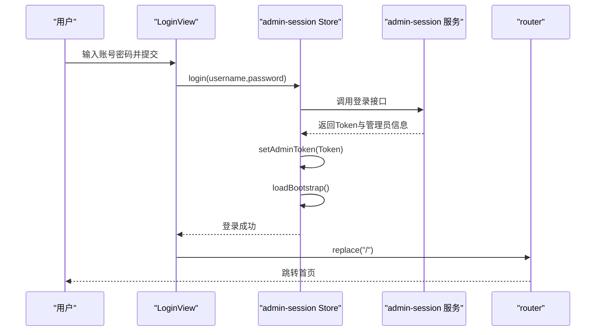
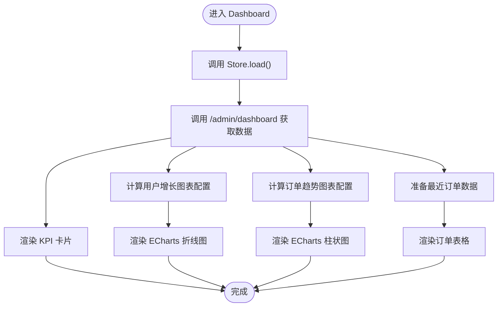
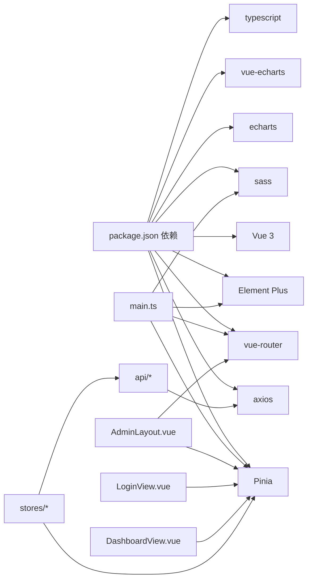

# 管理端开发

<cite>
**本文引用的文件**
- [apps/admin/package.json](file://apps/admin/package.json)
- [apps/admin/src/main.ts](file://apps/admin/src/main.ts)
- [apps/admin/src/App.vue](file://apps/admin/src/App.vue)
- [apps/admin/src/layouts/AdminLayout.vue](file://apps/admin/src/layouts/AdminLayout.vue)
- [apps/admin/src/router/index.ts](file://apps/admin/src/router/index.ts)
- [apps/admin/src/stores/admin-session.ts](file://apps/admin/src/stores/admin-session.ts)
- [apps/admin/src/services/admin-session.ts](file://apps/admin/src/services/admin-session.ts)
- [apps/admin/src/api/admin-auth.ts](file://apps/admin/src/api/admin-auth.ts)
- [apps/admin/src/views/LoginView.vue](file://apps/admin/src/views/LoginView.vue)
- [apps/admin/src/styles/main.scss](file://apps/admin/src/styles/main.scss)
- [apps/admin/src/views/DashboardView.vue](file://apps/admin/src/views/DashboardView.vue)
- [apps/admin/src/api/dashboard.ts](file://apps/admin/src/api/dashboard.ts)
- [apps/admin/src/api/question-bank.ts](file://apps/admin/src/api/question-bank.ts)
- [apps/admin/src/api/content-center.ts](file://apps/admin/src/api/content-center.ts)
- [apps/admin/src/api/commerce.ts](file://apps/admin/src/api/commerce.ts)
</cite>

## 目录
1. [简介](#简介)
2. [项目结构](#项目结构)
3. [核心组件](#核心组件)
4. [架构总览](#架构总览)
5. [详细组件分析](#详细组件分析)
6. [依赖关系分析](#依赖关系分析)
7. [性能考量](#性能考量)
8. [故障排查指南](#故障排查指南)
9. [结论](#结论)
10. [附录](#附录)

## 简介
本指南面向管理端（Vue 3 + Element Plus）的前端开发，围绕以下目标展开：  
- 深入讲解组合式 API 的使用与响应式数据管理  
- 基于 TypeScript 的类型系统与接口约束  
- Element Plus 组件库的集成与样式定制  
- 布局系统 AdminLayout 的职责与交互  
- 路由配置与权限控制机制  
- Pinia 状态管理在管理端的应用  
- 管理端特有功能模块：表格、表单、图表、文件上传等  
- SCSS 样式管理、主题与响应式布局  
- 工程化最佳实践与开发规范  

## 项目结构
管理端应用位于 apps/admin，采用 Vite + Vue 3 + TypeScript 技术栈，结合 Element Plus 提供丰富的 UI 能力；Pinia 负责状态管理；路由通过 vue-router 实现权限拦截。

**图表来源**
- [apps/admin/src/main.ts:1-15](file://apps/admin/src/main.ts#L1-L15)
- [apps/admin/src/App.vue:1-4](file://apps/admin/src/App.vue#L1-L4)
- [apps/admin/src/router/index.ts:1-62](file://apps/admin/src/router/index.ts#L1-L62)
- [apps/admin/src/layouts/AdminLayout.vue:1-124](file://apps/admin/src/layouts/AdminLayout.vue#L1-L124)
- [apps/admin/src/views/LoginView.vue:1-139](file://apps/admin/src/views/LoginView.vue#L1-L139)
- [apps/admin/src/views/DashboardView.vue:1-302](file://apps/admin/src/views/DashboardView.vue#L1-L302)
- [apps/admin/src/stores/admin-session.ts:1-65](file://apps/admin/src/stores/admin-session.ts#L1-L65)
- [apps/admin/src/services/admin-session.ts:1-30](file://apps/admin/src/services/admin-session.ts#L1-L30)
- [apps/admin/src/api/admin-auth.ts:1-63](file://apps/admin/src/api/admin-auth.ts#L1-L63)
- [apps/admin/src/api/dashboard.ts:1-46](file://apps/admin/src/api/dashboard.ts#L1-L46)
- [apps/admin/src/api/question-bank.ts:1-275](file://apps/admin/src/api/question-bank.ts#L1-L275)
- [apps/admin/src/api/content-center.ts:1-381](file://apps/admin/src/api/content-center.ts#L1-L381)
- [apps/admin/src/api/commerce.ts:1-129](file://apps/admin/src/api/commerce.ts#L1-L129)
- [apps/admin/src/styles/main.scss:1-526](file://apps/admin/src/styles/main.scss#L1-L526)

**章节来源**
- [apps/admin/package.json:1-32](file://apps/admin/package.json#L1-L32)
- [apps/admin/src/main.ts:1-15](file://apps/admin/src/main.ts#L1-L15)
- [apps/admin/src/App.vue:1-4](file://apps/admin/src/App.vue#L1-L4)
- [apps/admin/src/router/index.ts:1-62](file://apps/admin/src/router/index.ts#L1-L62)
- [apps/admin/src/layouts/AdminLayout.vue:1-124](file://apps/admin/src/layouts/AdminLayout.vue#L1-L124)
- [apps/admin/src/styles/main.scss:1-526](file://apps/admin/src/styles/main.scss#L1-L526)

## 核心组件
- 应用入口与插件注册：在入口文件中完成 Element Plus、Pinia、路由的安装与挂载，确保全局可用。  
- 布局系统 AdminLayout：负责侧边导航、顶部栏、面包屑信息与登出流程，同时在挂载时进行会话水合与引导加载。  
- 登录页 LoginView：基于 Element Plus 表单组件实现账号密码校验与登录流程，调用会话 Store 完成登录与跳转。  
- 路由与权限：通过前置守卫读取本地 Token，未登录则重定向至登录页；已登录访问登录页则重定向首页。  
- 状态管理：Pinia Store 管理管理员信息、菜单、Token 与加载状态，提供登录、引导加载与登出动作。  
- 样式体系：SCSS 全局样式定义栅格、卡片、导航与响应式断点，配合 Element Plus 组件样式覆盖。

**章节来源**
- [apps/admin/src/main.ts:1-15](file://apps/admin/src/main.ts#L1-L15)
- [apps/admin/src/layouts/AdminLayout.vue:46-124](file://apps/admin/src/layouts/AdminLayout.vue#L46-L124)
- [apps/admin/src/views/LoginView.vue:36-68](file://apps/admin/src/views/LoginView.vue#L36-L68)
- [apps/admin/src/router/index.ts:46-62](file://apps/admin/src/router/index.ts#L46-L62)
- [apps/admin/src/stores/admin-session.ts:15-65](file://apps/admin/src/stores/admin-session.ts#L15-L65)
- [apps/admin/src/styles/main.scss:38-526](file://apps/admin/src/styles/main.scss#L38-L526)

## 架构总览
管理端采用“入口装配 + 布局容器 + 视图页面 + API 层 + 状态层”的分层架构。Element Plus 提供 UI 能力，Pinia 管理会话与业务数据，路由负责页面切换与权限控制，SCSS 提供一致的视觉与交互体验。

**图表来源**
- [apps/admin/src/main.ts:1-15](file://apps/admin/src/main.ts#L1-L15)
- [apps/admin/src/App.vue:1-4](file://apps/admin/src/App.vue#L1-L4)
- [apps/admin/src/router/index.ts:1-62](file://apps/admin/src/router/index.ts#L1-L62)
- [apps/admin/src/layouts/AdminLayout.vue:1-124](file://apps/admin/src/layouts/AdminLayout.vue#L1-L124)
- [apps/admin/src/stores/admin-session.ts:1-65](file://apps/admin/src/stores/admin-session.ts#L1-L65)
- [apps/admin/src/services/admin-session.ts:1-30](file://apps/admin/src/services/admin-session.ts#L1-L30)
- [apps/admin/src/api/admin-auth.ts:1-63](file://apps/admin/src/api/admin-auth.ts#L1-L63)
- [apps/admin/src/styles/main.scss:1-526](file://apps/admin/src/styles/main.scss#L1-L526)

## 详细组件分析

### 布局系统 AdminLayout
- 职责：渲染侧边导航、顶部栏、内容区，根据当前路由动态展示页面标题与副标题，提供登出能力。  
- 导航数据来源：从会话 Store 中读取菜单列表，若无菜单则回退到默认仪表盘入口。  
- 生命周期：挂载时执行水合与引导加载，保证 Token 存在时拉取管理员信息与菜单。  
- 交互：点击退出登录后提示成功并跳转登录页。

**图表来源**
- [apps/admin/src/layouts/AdminLayout.vue:109-122](file://apps/admin/src/layouts/AdminLayout.vue#L109-L122)
- [apps/admin/src/stores/admin-session.ts:56-62](file://apps/admin/src/stores/admin-session.ts#L56-L62)
- [apps/admin/src/router/index.ts:46-61](file://apps/admin/src/router/index.ts#L46-L61)

**章节来源**
- [apps/admin/src/layouts/AdminLayout.vue:46-124](file://apps/admin/src/layouts/AdminLayout.vue#L46-L124)
- [apps/admin/src/stores/admin-session.ts:15-65](file://apps/admin/src/stores/admin-session.ts#L15-L65)
- [apps/admin/src/router/index.ts:46-62](file://apps/admin/src/router/index.ts#L46-L62)

### 登录流程与权限控制
- 登录页：使用 Element Plus 表单组件收集账号密码，提交时调用会话 Store 的 login 方法，成功后提示并跳转首页。  
- 权限守卫：前置守卫读取本地 Token，未登录访问非登录页则重定向登录；已登录访问登录页则重定向首页。  
- 会话持久化：Token 存储于 localStorage，提供读取、设置与清除方法。

**图表来源**
- [apps/admin/src/views/LoginView.vue:50-67](file://apps/admin/src/views/LoginView.vue#L50-L67)
- [apps/admin/src/stores/admin-session.ts:27-38](file://apps/admin/src/stores/admin-session.ts#L27-L38)
- [apps/admin/src/services/admin-session.ts:7-21](file://apps/admin/src/services/admin-session.ts#L7-L21)
- [apps/admin/src/router/index.ts:46-61](file://apps/admin/src/router/index.ts#L46-L61)

**章节来源**
- [apps/admin/src/views/LoginView.vue:36-68](file://apps/admin/src/views/LoginView.vue#L36-L68)
- [apps/admin/src/stores/admin-session.ts:15-65](file://apps/admin/src/stores/admin-session.ts#L15-L65)
- [apps/admin/src/services/admin-session.ts:1-30](file://apps/admin/src/services/admin-session.ts#L1-L30)
- [apps/admin/src/router/index.ts:46-62](file://apps/admin/src/router/index.ts#L46-L62)

### 仪表盘视图与数据可视化
- 数据来源：通过 Dashboard Store 加载仪表盘数据，包含 KPI、趋势图表与最近订单列表。  
- 可视化：使用 vue-echarts 与 ECharts 渲染折线图与柱状图，按需注册渲染器与组件。  
- 表格：使用 Element Plus 表格组件展示最近订单，支持空态与加载态。

**图表来源**
- [apps/admin/src/views/DashboardView.vue:127-208](file://apps/admin/src/views/DashboardView.vue#L127-L208)
- [apps/admin/src/api/dashboard.ts:42-45](file://apps/admin/src/api/dashboard.ts#L42-L45)

**章节来源**
- [apps/admin/src/views/DashboardView.vue:1-302](file://apps/admin/src/views/DashboardView.vue#L1-L302)
- [apps/admin/src/api/dashboard.ts:1-46](file://apps/admin/src/api/dashboard.ts#L1-L46)

### 题库管理 API 与数据模型
- 数据模型：题库测试、分组、问题、维度标签、阈值配置、分享海报配置等类型定义清晰，涵盖性格与情绪两类题库。  
- 接口能力：支持查询测试列表、详情、分组列表，以及创建、更新、删除、状态变更等操作。  
- 使用建议：在视图中按功能模块拆分组件，利用组合式 API 管理筛选条件与分页参数，统一错误提示与加载状态。

**章节来源**
- [apps/admin/src/api/question-bank.ts:1-275](file://apps/admin/src/api/question-bank.ts#L1-L275)

### 内容中心 API 与文件上传
- 内容类型：运势内容、幸运物、报告模板、配置项等，均提供列表、创建、更新、状态变更与删除等接口。  
- 文件上传：提供音频上传接口，使用 FormData 并设置合适的超时与内容类型。  
- 最佳实践：对上传进度与错误进行统一处理，对文件大小与类型进行前端校验，后端返回统一结构便于统一消费。

**章节来源**
- [apps/admin/src/api/content-center.ts:1-381](file://apps/admin/src/api/content-center.ts#L1-L381)

### 商业化配置 API
- 商品管理：会员产品列表、创建、更新、删除与状态变更。  
- 订单管理：订单列表、分页、统计信息查询。  
- 设计要点：接口返回统一封装结构，前端按需解构使用；对金额字段注意单位换算与格式化展示。

**章节来源**
- [apps/admin/src/api/commerce.ts:1-129](file://apps/admin/src/api/commerce.ts#L1-L129)

### Element Plus 集成与定制
- 安装与引入：在入口文件安装 Element Plus，并引入全局样式；在组件中按需使用图标、按钮、表单、表格、卡片等组件。  
- 主题与样式：通过 SCSS 变量与类名覆盖实现统一风格；为 Element Plus 组件容器设置圆角与阴影，提升卡片质感。  
- 响应式：在 SCSS 中定义断点，适配不同屏幕尺寸下的网格与布局。

**章节来源**
- [apps/admin/src/main.ts:1-15](file://apps/admin/src/main.ts#L1-L15)
- [apps/admin/src/styles/main.scss:1-526](file://apps/admin/src/styles/main.scss#L1-L526)

## 依赖关系分析
- 外部依赖：Vue 3、Element Plus、Pinia、vue-router、axios、echarts、vue-echarts、sass、typescript。  
- 内部依赖：入口文件依赖路由、Pinia、Element Plus；布局依赖路由与会话 Store；视图依赖对应 API 与 Store；样式全局生效。

**图表来源**
- [apps/admin/package.json:11-30](file://apps/admin/package.json#L11-L30)
- [apps/admin/src/main.ts:1-15](file://apps/admin/src/main.ts#L1-L15)

**章节来源**
- [apps/admin/package.json:1-32](file://apps/admin/package.json#L1-L32)
- [apps/admin/src/main.ts:1-15](file://apps/admin/src/main.ts#L1-L15)

## 性能考量
- 路由懒加载：路由组件采用动态导入，减少首屏体积。  
- 图表按需注册：仅注册需要的 ECharts 渲染器与组件，避免全量引入。  
- 状态缓存：Pinia Store 对已加载数据进行缓存，避免重复请求；在布局挂载时进行一次引导加载。  
- 样式优化：SCSS 使用变量与混入，减少重复样式；媒体查询集中在一处，便于维护。  
- 上传优化：对大文件上传设置合理超时与分片策略（如需），前端进行基础校验以降低无效请求。

## 故障排查指南
- 登录失败：检查账号密码是否为空，确认接口返回与错误提示；查看控制台是否有网络异常或跨域问题。  
- 未登录跳转循环：确认路由守卫逻辑与 Token 读取是否正确；检查 localStorage 是否可用。  
- 图表不显示：确认 ECharts 按需注册是否完成，数据源是否存在；检查 v-if 判断与空态渲染。  
- 表格无数据：确认接口返回结构与 Store 解构是否一致；检查 v-loading 与 empty-text 的使用。  
- 样式异常：检查 SCSS 变量与覆盖顺序，确认 Element Plus 样式优先级；核对媒体查询断点。

**章节来源**
- [apps/admin/src/views/LoginView.vue:50-67](file://apps/admin/src/views/LoginView.vue#L50-L67)
- [apps/admin/src/router/index.ts:46-61](file://apps/admin/src/router/index.ts#L46-L61)
- [apps/admin/src/views/DashboardView.vue:127-208](file://apps/admin/src/views/DashboardView.vue#L127-L208)
- [apps/admin/src/styles/main.scss:1-526](file://apps/admin/src/styles/main.scss#L1-L526)

## 结论
该管理端项目以 Vue 3 + Element Plus 为基础，结合 Pinia 与路由守卫实现了清晰的权限控制与良好的用户体验。通过 SCSS 统一样式与响应式布局，配合 ECharts 的数据可视化，满足管理后台的多样化需求。建议在后续迭代中持续完善组件抽象、错误处理与性能优化，保持代码一致性与可维护性。

## 附录
- 开发规范建议：  
  - 组合式 API：将逻辑按功能拆分，使用 computed、ref、watchEffect 等组织响应式数据。  
  - 类型安全：为所有 API 请求与响应定义明确的接口类型，统一错误处理结构。  
  - 组件设计：遵循单一职责，Props 明确、事件命名规范、插槽使用合理。  
  - 样式管理：使用 SCSS 变量与命名空间，避免全局污染；媒体查询集中管理。  
  - 状态管理：Store 动作聚焦业务，避免在组件中直接发起网络请求；统一错误提示与加载状态。  
  - 路由与权限：守卫逻辑清晰，登录与登出流程标准化；菜单与权限解耦，便于扩展。  
  - 可视化：图表配置抽取为可复用函数，数据预处理与空态处理一致化。  
  - 文件上传：前后端约定统一，前端做基础校验与超时控制，后端返回结构规范化。