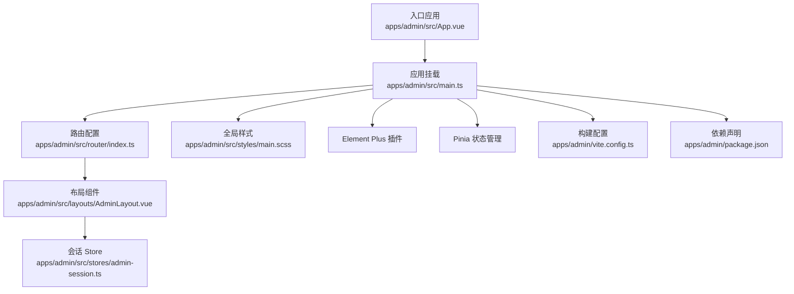
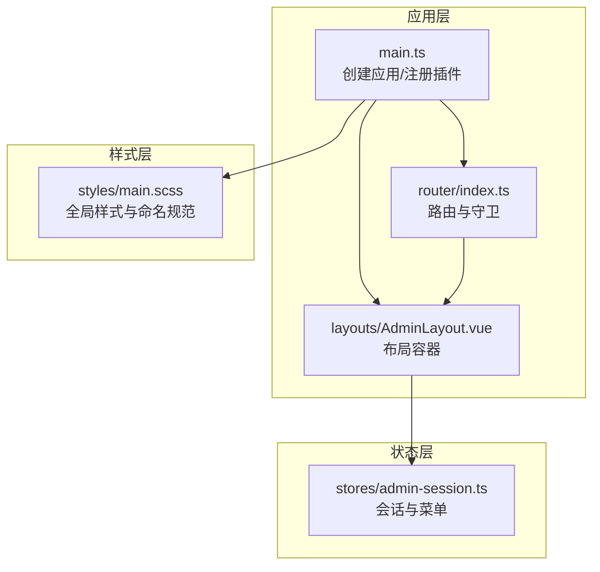
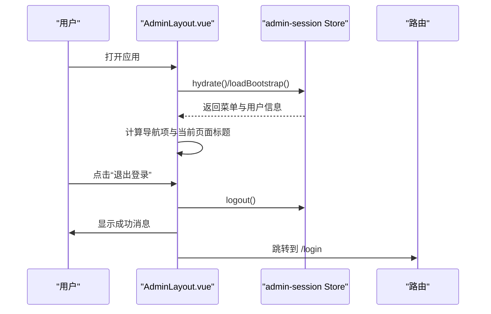
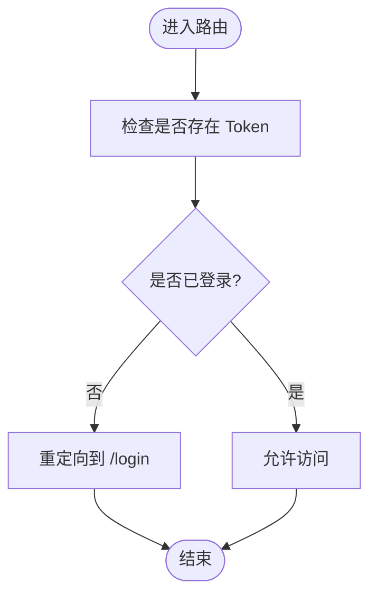
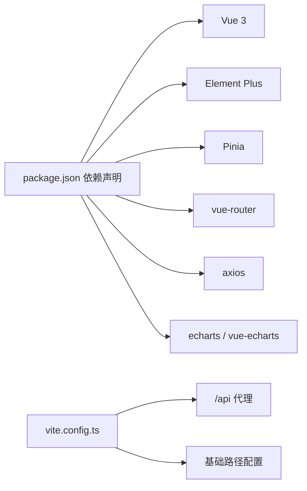

# 组件开发规范

<cite>
**本文引用的文件**
- [apps/admin/src/App.vue](file://apps/admin/src/App.vue)
- [apps/admin/src/main.ts](file://apps/admin/src/main.ts)
- [apps/admin/src/layouts/AdminLayout.vue](file://apps/admin/src/layouts/AdminLayout.vue)
- [apps/admin/src/router/index.ts](file://apps/admin/src/router/index.ts)
- [apps/admin/src/stores/admin-session.ts](file://apps/admin/src/stores/admin-session.ts)
- [apps/admin/src/styles/main.scss](file://apps/admin/src/styles/main.scss)
- [apps/admin/vite.config.ts](file://apps/admin/vite.config.ts)
- [apps/admin/package.json](file://apps/admin/package.json)
</cite>

## 目录
1. [引言](#引言)
2. [项目结构](#项目结构)
3. [核心组件](#核心组件)
4. [架构总览](#架构总览)
5. [详细组件分析](#详细组件分析)
6. [依赖分析](#依赖分析)
7. [性能考虑](#性能考虑)
8. [故障排查指南](#故障排查指南)
9. [结论](#结论)
10. [附录](#附录)

## 引言
本规范面向管理端（admin）应用的组件开发，目标是建立一套可复用、可维护、可测试的设计与实现标准。内容涵盖组件设计原则、Props 设计、事件系统、插槽使用、样式组织以及文档与示例编写方法。本文以现有工程为依据，结合实际文件进行说明，帮助开发者在统一规范下高效产出高质量组件。

## 项目结构
管理端采用 Vue 3 + TypeScript + Vite + Pinia + Element Plus 的技术栈，路由基于 vue-router，全局样式通过 SCSS 管理。入口文件负责挂载应用、注册插件与全局样式；布局组件承载侧边导航、顶部栏与主内容区；路由守卫保障登录态；Pinia Store 负责会话与菜单数据；Vite 配置提供代理与基础路径。

图表来源
- [apps/admin/src/App.vue:1-4](file://apps/admin/src/App.vue#L1-L4)
- [apps/admin/src/main.ts:1-15](file://apps/admin/src/main.ts#L1-L15)
- [apps/admin/src/router/index.ts:1-62](file://apps/admin/src/router/index.ts#L1-L62)
- [apps/admin/src/layouts/AdminLayout.vue:1-124](file://apps/admin/src/layouts/AdminLayout.vue#L1-L124)
- [apps/admin/src/stores/admin-session.ts:1-65](file://apps/admin/src/stores/admin-session.ts#L1-L65)
- [apps/admin/src/styles/main.scss:1-526](file://apps/admin/src/styles/main.scss#L1-L526)
- [apps/admin/vite.config.ts:1-58](file://apps/admin/vite.config.ts#L1-L58)
- [apps/admin/package.json:1-32](file://apps/admin/package.json#L1-L32)

章节来源
- [apps/admin/src/App.vue:1-4](file://apps/admin/src/App.vue#L1-L4)
- [apps/admin/src/main.ts:1-15](file://apps/admin/src/main.ts#L1-L15)
- [apps/admin/src/router/index.ts:1-62](file://apps/admin/src/router/index.ts#L1-L62)
- [apps/admin/src/styles/main.scss:1-526](file://apps/admin/src/styles/main.scss#L1-L526)
- [apps/admin/vite.config.ts:1-58](file://apps/admin/vite.config.ts#L1-L58)
- [apps/admin/package.json:1-32](file://apps/admin/package.json#L1-L32)

## 核心组件
- 应用入口与挂载：负责初始化应用实例、注册路由、状态管理与 UI 框架插件，并挂载到 DOM。
- 布局组件：提供侧边导航、顶部栏、主内容区的容器化结构，承载页面级标题与操作区。
- 路由与守卫：定义页面路由与登录态校验，确保未登录用户无法访问受保护页面。
- 全局样式：集中管理字体、颜色、阴影、网格布局与响应式断点，保证视觉一致性。
- 构建与环境：配置代理、基础路径与开发服务器行为，便于联调后端接口。

章节来源
- [apps/admin/src/App.vue:1-4](file://apps/admin/src/App.vue#L1-L4)
- [apps/admin/src/main.ts:1-15](file://apps/admin/src/main.ts#L1-L15)
- [apps/admin/src/layouts/AdminLayout.vue:1-124](file://apps/admin/src/layouts/AdminLayout.vue#L1-L124)
- [apps/admin/src/router/index.ts:1-62](file://apps/admin/src/router/index.ts#L1-L62)
- [apps/admin/src/styles/main.scss:1-526](file://apps/admin/src/styles/main.scss#L1-L526)
- [apps/admin/vite.config.ts:1-58](file://apps/admin/vite.config.ts#L1-L58)

## 架构总览
管理端采用“入口 -> 布局 -> 视图”的分层结构，配合 Pinia 进行跨组件状态共享，Element Plus 提供基础 UI 能力。路由在进入受保护页面前检查登录态，失败则重定向至登录页。

图表来源
- [apps/admin/src/main.ts:1-15](file://apps/admin/src/main.ts#L1-L15)
- [apps/admin/src/router/index.ts:1-62](file://apps/admin/src/router/index.ts#L1-L62)
- [apps/admin/src/layouts/AdminLayout.vue:1-124](file://apps/admin/src/layouts/AdminLayout.vue#L1-L124)
- [apps/admin/src/stores/admin-session.ts:1-65](file://apps/admin/src/stores/admin-session.ts#L1-L65)
- [apps/admin/src/styles/main.scss:1-526](file://apps/admin/src/styles/main.scss#L1-L526)

## 详细组件分析

### 布局组件（AdminLayout）
职责与结构
- 侧边栏：展示品牌信息与导航项，根据当前路由高亮对应菜单。
- 顶部栏：显示当前页面标题与副标题，提供登出操作。
- 主内容区：通过 RouterView 渲染子视图。

设计要点
- 使用 computed 动态生成导航项与页面标题，避免硬编码。
- 登出流程：清理会话、提示成功消息、跳转登录页。
- 生命周期：挂载时尝试加载引导数据（如菜单），失败静默处理。

图表来源
- [apps/admin/src/layouts/AdminLayout.vue:46-123](file://apps/admin/src/layouts/AdminLayout.vue#L46-L123)
- [apps/admin/src/stores/admin-session.ts:23-62](file://apps/admin/src/stores/admin-session.ts#L23-L62)

章节来源
- [apps/admin/src/layouts/AdminLayout.vue:1-124](file://apps/admin/src/layouts/AdminLayout.vue#L1-L124)
- [apps/admin/src/stores/admin-session.ts:1-65](file://apps/admin/src/stores/admin-session.ts#L1-L65)

### 路由与守卫
- 定义登录页与受保护页面的父子关系。
- 导航前置守卫：若已登录且访问登录页则重定向首页；未登录访问受保护页则重定向登录页。

图表来源
- [apps/admin/src/router/index.ts:46-61](file://apps/admin/src/router/index.ts#L46-L61)

章节来源
- [apps/admin/src/router/index.ts:1-62](file://apps/admin/src/router/index.ts#L1-L62)

### 样式组织与命名规范
- 全局样式集中于 main.scss，采用网格布局与响应式断点，确保在不同分辨率下的可用性。
- 命名采用 BEM 风格（如 .admin-sidebar__brand），提升可读性与可维护性。
- 使用 Element Plus 的卡片与表格组件时，统一圆角与阴影风格，保持一致的视觉语言。

章节来源
- [apps/admin/src/styles/main.scss:1-526](file://apps/admin/src/styles/main.scss#L1-L526)

### 组件设计原则
- 可复用性：通过 props 与插槽解耦功能与展示，避免强绑定具体业务字段。
- 可维护性：单一职责、清晰的数据流（Pinia）、明确的事件命名与文档注释。
- 可测试性：纯函数逻辑抽离、依赖注入（如 API 服务）、对 UI 的交互行为进行行为测试。

## 依赖分析
- 应用依赖：Vue 3、Element Plus、Pinia、vue-router、axios、echarts、vue-echarts。
- 构建工具：Vite、TypeScript、Sass。
- 代理与基础路径：通过 Vite 配置将 /api 代理到后端服务，并支持自定义公共基础路径。

图表来源
- [apps/admin/package.json:11-21](file://apps/admin/package.json#L11-L21)
- [apps/admin/vite.config.ts:45-57](file://apps/admin/vite.config.ts#L45-L57)

章节来源
- [apps/admin/package.json:1-32](file://apps/admin/package.json#L1-L32)
- [apps/admin/vite.config.ts:1-58](file://apps/admin/vite.config.ts#L1-L58)

## 性能考虑
- 路由懒加载：视图组件按需加载，减少首屏体积。
- 图表渲染：使用 vue-echarts 时，建议在组件卸载时销毁实例，避免内存泄漏。
- 样式体积：合并与压缩 SCSS，避免重复类名与冗余规则。
- 状态更新：Pinia 中的异步动作应合理使用 loading 状态，避免不必要的重渲染。

## 故障排查指南
- 登录态异常
  - 现象：进入受保护页面被重定向到登录页。
  - 排查：确认本地 Token 是否存在；检查路由守卫逻辑；核对后端返回的 Token 是否正确写入。
- 页面不显示或空白
  - 现象：路由切换后无内容。
  - 排查：确认 RouterView 是否位于正确布局中；检查路由配置与组件导出。
- 样式错乱
  - 现象：组件样式相互影响或不生效。
  - 排查：检查类名是否遵循 BEM 命名；确认 SCSS 文件是否被引入；避免使用深度选择器污染全局。
- 构建路径问题
  - 现象：静态资源 404 或接口请求被错误代理。
  - 排查：核对 Vite 的 base 与代理配置；确认浏览器访问路径与基础路径一致。

章节来源
- [apps/admin/src/router/index.ts:46-61](file://apps/admin/src/router/index.ts#L46-L61)
- [apps/admin/vite.config.ts:45-57](file://apps/admin/vite.config.ts#L45-L57)

## 结论
本规范以现有工程为基础，总结了管理端组件开发的关键实践：清晰的分层结构、统一的状态管理、严格的样式命名与响应式策略、完善的路由守卫与构建配置。遵循这些原则有助于提升组件的可复用性、可维护性与可测试性，降低团队协作成本并提高交付质量。

## 附录

### Props 设计最佳实践
- 类型定义：使用 TypeScript 接口或类型别名约束输入参数，确保编译期安全。
- 默认值：为可选属性提供明确默认值，避免未定义导致的渲染异常。
- 验证规则：在组件内部对关键字段进行校验，必要时抛出自定义错误或发出警告。
- 文档注释：为每个 Prop 添加简要说明，描述用途、取值范围与默认行为。

### 事件系统设计
- 自定义事件：使用 emits 明确声明对外暴露的事件名称与负载类型。
- 事件冒泡：默认允许原生事件冒泡，如需阻止请在组件内显式处理。
- 事件委托：在父组件中集中处理子组件触发的事件，保持数据流向单向。

### 插槽使用指南
- 具名插槽：用于替换组件特定区域（如头部、底部、操作区）。
- 作用域插槽：向插槽上下文传递数据，使插槽使用者能够按需渲染。
- 动态插槽：根据条件渲染不同插槽内容，注意保持结构一致性。

### 样式组织与命名规范
- CSS Modules：适用于需要隔离作用域的小组件，避免全局污染。
- Scoped Styles：在组件根元素上使用 scoped，限制样式边界。
- BEM 命名：采用块（block）__子项（element）--修饰符（modifier）的命名约定，增强可读性。
- 响应式断点：在全局样式中统一断点，确保组件在不同屏幕尺寸下表现一致。

### 文档与示例编写
- 组件文档：包含用途、Props 列表（含类型、默认值、必填性）、事件列表、插槽说明与使用示例。
- 示例展示：提供最小可运行示例，覆盖常见使用场景与边界情况。
- 变更记录：记录版本变更与破坏性改动，便于升级迁移。