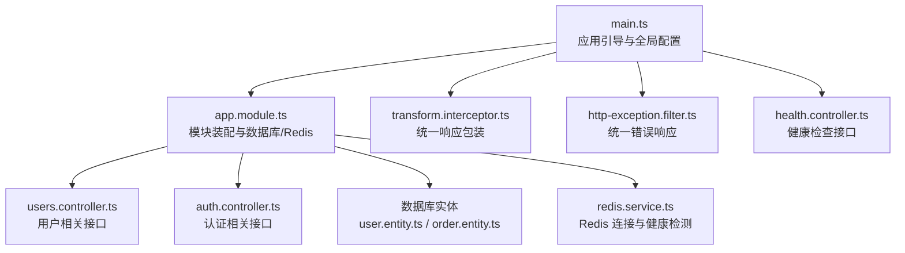
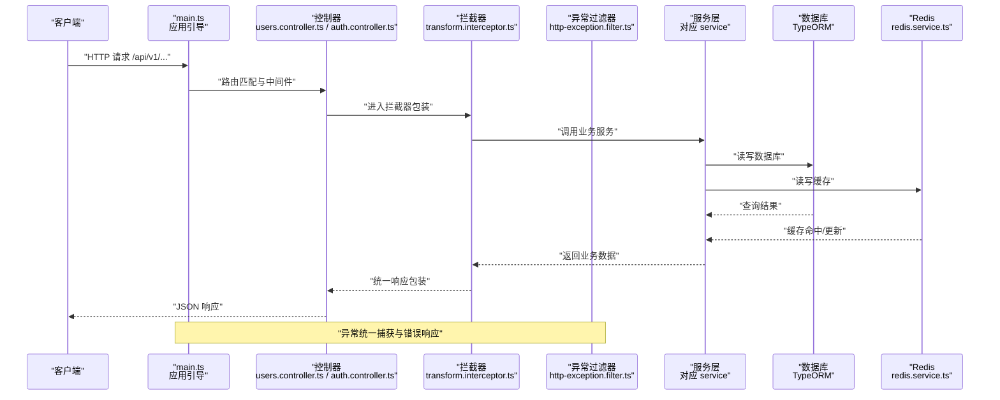
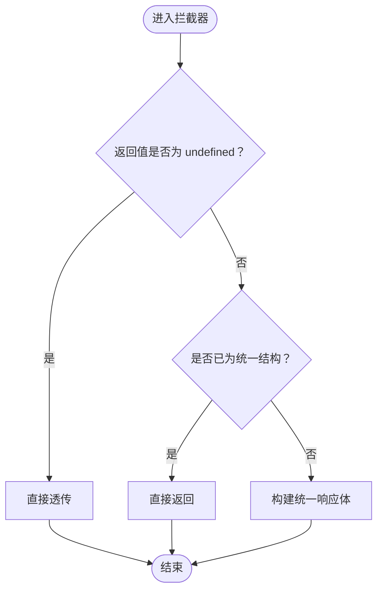
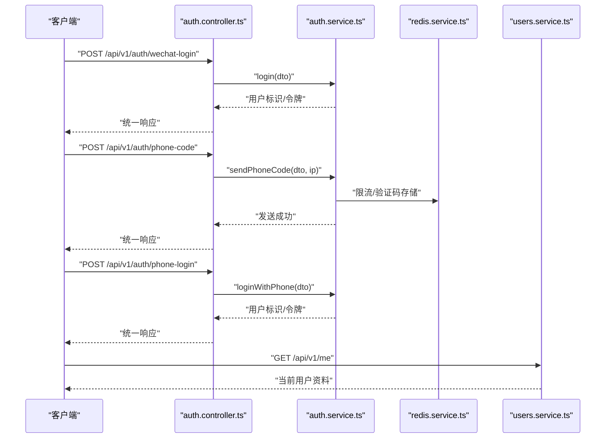
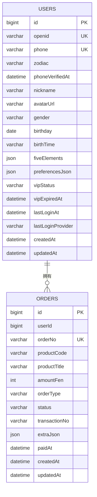
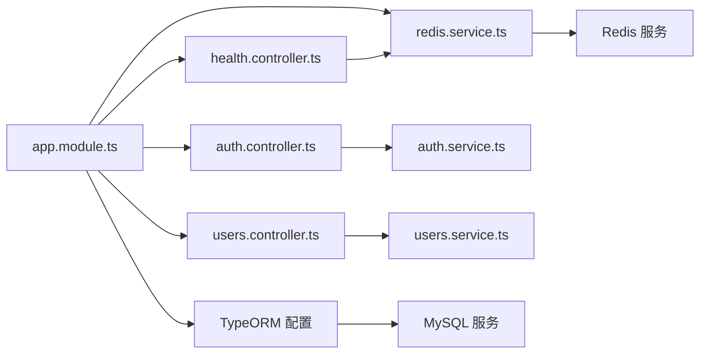

# API 开发规范

<cite>
**本文引用的文件**
- [services/api/src/main.ts](file://services/api/src/main.ts)
- [services/api/src/app.module.ts](file://services/api/src/app.module.ts)
- [services/api/src/common/interceptors/transform.interceptor.ts](file://services/api/src/common/interceptors/transform.interceptor.ts)
- [services/api/src/common/filters/http-exception.filter.ts](file://services/api/src/common/filters/http-exception.filter.ts)
- [services/api/src/common/production-config.validator.ts](file://services/api/src/common/production-config.validator.ts)
- [services/api/src/health/health.controller.ts](file://services/api/src/health/health.controller.ts)
- [services/api/src/auth/auth.controller.ts](file://services/api/src/auth/auth.controller.ts)
- [services/api/src/auth/dto/phone-login.dto.ts](file://services/api/src/auth/dto/phone-login.dto.ts)
- [services/api/src/users/users.controller.ts](file://services/api/src/users/users.controller.ts)
- [services/api/src/database/entities/user.entity.ts](file://services/api/src/database/entities/user.entity.ts)
- [services/api/src/database/entities/order.entity.ts](file://services/api/src/database/entities/order.entity.ts)
- [services/api/src/redis/redis.service.ts](file://services/api/src/redis/redis.service.ts)
- [services/api/test/app.e2e-spec.ts](file://services/api/test/app.e2e-spec.ts)
- [services/api/package.json](file://services/api/package.json)
</cite>

## 目录
1. [引言](#引言)
2. [项目结构](#项目结构)
3. [核心组件](#核心组件)
4. [架构总览](#架构总览)
5. [详细组件分析](#详细组件分析)
6. [依赖关系分析](#依赖关系分析)
7. [性能考虑](#性能考虑)
8. [故障排查指南](#故障排查指南)
9. [结论](#结论)
10. [附录](#附录)

## 引言
本规范面向 Fortune Hub API 的设计与实现，旨在建立一套标准化的 RESTful API 设计与工程实践体系。内容涵盖资源命名与 URL 结构、HTTP 方法使用、状态码规范、请求响应格式统一、参数验证、版本管理策略、安全实现（认证、授权、防重放、SQL 注入防护）、文档生成与测试策略、性能优化、CORS 配置、限流策略与监控告警等。

## 项目结构
服务端采用 NestJS 架构，模块化组织功能域，全局启用统一拦截器与异常过滤器，并通过 TypeORM 管理数据库连接与迁移，Redis 提供缓存与健康检测支持。应用启动时设置全局前缀、CORS、全局管道与过滤器。

图表来源
- [services/api/src/main.ts:1-74](file://services/api/src/main.ts#L1-L74)
- [services/api/src/app.module.ts:1-145](file://services/api/src/app.module.ts#L1-L145)
- [services/api/src/common/interceptors/transform.interceptor.ts:1-59](file://services/api/src/common/interceptors/transform.interceptor.ts#L1-L59)
- [services/api/src/common/filters/http-exception.filter.ts:1-92](file://services/api/src/common/filters/http-exception.filter.ts#L1-L92)
- [services/api/src/health/health.controller.ts:1-28](file://services/api/src/health/health.controller.ts#L1-L28)
- [services/api/src/users/users.controller.ts:1-204](file://services/api/src/users/users.controller.ts#L1-L204)
- [services/api/src/auth/auth.controller.ts:1-36](file://services/api/src/auth/auth.controller.ts#L1-L36)
- [services/api/src/database/entities/user.entity.ts:1-75](file://services/api/src/database/entities/user.entity.ts#L1-L75)
- [services/api/src/database/entities/order.entity.ts:1-53](file://services/api/src/database/entities/order.entity.ts#L1-L53)
- [services/api/src/redis/redis.service.ts:1-125](file://services/api/src/redis/redis.service.ts#L1-L125)

章节来源
- [services/api/src/main.ts:1-74](file://services/api/src/main.ts#L1-L74)
- [services/api/src/app.module.ts:1-145](file://services/api/src/app.module.ts#L1-L145)

## 核心组件
- 全局前缀与 CORS：统一以 /api/v1 作为全局前缀；CORS 支持多来源白名单，生产环境强制 HTTPS。
- 统一响应包装：TransformInterceptor 将控制器返回值包装为统一结构，避免重复样板代码。
- 统一错误处理：HttpExceptionFilter 捕获异常并输出统一错误体，区分 5xx 错误日志记录。
- 参数验证：全局 ValidationPipe 启用白名单与隐式转换，结合 class-validator DTO 实现强约束。
- 健康检查：/api/v1/health 返回 MySQL、Redis、文件服务基础地址与时间戳。
- 生产配置校验：assertProductionConfig 与 warnIfUnsafeDevelopmentConfig 在启动阶段进行安全与合规性检查。

章节来源
- [services/api/src/main.ts:32-59](file://services/api/src/main.ts#L32-L59)
- [services/api/src/common/interceptors/transform.interceptor.ts:17-58](file://services/api/src/common/interceptors/transform.interceptor.ts#L17-L58)
- [services/api/src/common/filters/http-exception.filter.ts:18-91](file://services/api/src/common/filters/http-exception.filter.ts#L18-L91)
- [services/api/src/health/health.controller.ts:6-27](file://services/api/src/health/health.controller.ts#L6-L27)
- [services/api/src/common/production-config.validator.ts:25-104](file://services/api/src/common/production-config.validator.ts#L25-L104)

## 架构总览
下图展示从客户端到控制器、服务层、数据库与缓存的整体调用链路与职责边界。

图表来源
- [services/api/src/main.ts:8-61](file://services/api/src/main.ts#L8-L61)
- [services/api/src/common/interceptors/transform.interceptor.ts:21-46](file://services/api/src/common/interceptors/transform.interceptor.ts#L21-L46)
- [services/api/src/common/filters/http-exception.filter.ts:22-40](file://services/api/src/common/filters/http-exception.filter.ts#L22-L40)
- [services/api/src/users/users.controller.ts:20-204](file://services/api/src/users/users.controller.ts#L20-L204)
- [services/api/src/auth/auth.controller.ts:8-36](file://services/api/src/auth/auth.controller.ts#L8-L36)
- [services/api/src/database/entities/user.entity.ts:10-75](file://services/api/src/database/entities/user.entity.ts#L10-L75)
- [services/api/src/redis/redis.service.ts:68-124](file://services/api/src/redis/redis.service.ts#L68-L124)

## 详细组件分析

### 统一响应与错误处理
- 统一响应结构：code、message、data、timestamp；当已包装或使用手动响应时跳过二次包装。
- 统一错误结构：继承 HttpException 时透传状态码与消息；非 HttpException 默认 500 并记录日志。
- 适配数组与对象形式的消息提取，优先取首个非空字符串。

图表来源
- [services/api/src/common/interceptors/transform.interceptor.ts:21-46](file://services/api/src/common/interceptors/transform.interceptor.ts#L21-L46)

章节来源
- [services/api/src/common/interceptors/transform.interceptor.ts:10-58](file://services/api/src/common/interceptors/transform.interceptor.ts#L10-L58)
- [services/api/src/common/filters/http-exception.filter.ts:11-91](file://services/api/src/common/filters/http-exception.filter.ts#L11-L91)

### 认证与授权流程
- 微信登录：接收授权码换取用户信息并签发会话。
- 手机验证码：根据请求头 X-Forwarded-For 或真实 IP 限制发送频率。
- 手机登录：校验验证码后完成登录。
- 用户资料与记录：通过 Authorization 头解析用户身份，部分接口要求必须登录，部分允许匿名。

图表来源
- [services/api/src/auth/auth.controller.ts:12-35](file://services/api/src/auth/auth.controller.ts#L12-L35)
- [services/api/src/users/users.controller.ts:27-37](file://services/api/src/users/users.controller.ts#L27-L37)

章节来源
- [services/api/src/auth/auth.controller.ts:1-36](file://services/api/src/auth/auth.controller.ts#L1-L36)
- [services/api/src/auth/dto/phone-login.dto.ts:1-24](file://services/api/src/auth/dto/phone-login.dto.ts#L1-L24)
- [services/api/src/users/users.controller.ts:1-204](file://services/api/src/users/users.controller.ts#L1-L204)

### 数据模型与索引
- 用户表：唯一索引 openid/phone，常用查询字段 zodiac 建有索引，便于快速检索。
- 订单表：唯一索引 orderNo，复合索引 (userId, status) 用于订单列表查询优化。

图表来源
- [services/api/src/database/entities/user.entity.ts:10-75](file://services/api/src/database/entities/user.entity.ts#L10-L75)
- [services/api/src/database/entities/order.entity.ts:10-53](file://services/api/src/database/entities/order.entity.ts#L10-L53)

章节来源
- [services/api/src/database/entities/user.entity.ts:1-75](file://services/api/src/database/entities/user.entity.ts#L1-L75)
- [services/api/src/database/entities/order.entity.ts:1-53](file://services/api/src/database/entities/order.entity.ts#L1-L53)

### 参数验证机制
- DTO 层约束：使用 class-validator 对输入进行字符串长度、可选性、格式等约束。
- 全局管道：ValidationPipe 启用白名单与隐式类型转换，确保仅允许受控字段进入业务层。
- 控制器层：对可选参数进行类型转换与边界检查（如 limit 转数字）。

章节来源
- [services/api/src/auth/dto/phone-login.dto.ts:1-24](file://services/api/src/auth/dto/phone-login.dto.ts#L1-L24)
- [services/api/src/main.ts:35-43](file://services/api/src/main.ts#L35-L43)
- [services/api/src/users/users.controller.ts:86-92](file://services/api/src/users/users.controller.ts#L86-L92)

### API 版本管理策略
- 版本控制：全局前缀 /api/v1 明确版本边界，便于后续升级。
- 向后兼容：在不破坏现有客户端行为的前提下扩展新接口；旧接口保留直至迁移完成。
- 废弃处理：通过文档与公告提前通知，设置过渡期并逐步移除。

章节来源
- [services/api/src/main.ts:32](file://services/api/src/main.ts#L32)

### 安全实现
- 身份认证：基于 Authorization 头解析用户身份，敏感接口要求登录态。
- 权限控制：控制器内按需区分“必须登录”与“允许匿名”，业务层进一步细化角色/资源权限。
- 防重放攻击：建议在网关层引入 nonce/timestamp 校验与签名机制（实现建议）。
- SQL 注入防护：使用 TypeORM ORM 查询与参数绑定，避免原生 SQL 拼接。
- CORS 配置：生产环境强制 HTTPS 来源白名单，允许必要的请求头与方法。
- 生产配置校验：禁止在生产使用弱默认值、禁用同步模式、禁止 mock 支付与短信等。

章节来源
- [services/api/src/main.ts:44-59](file://services/api/src/main.ts#L44-L59)
- [services/api/src/common/production-config.validator.ts:25-104](file://services/api/src/common/production-config.validator.ts#L25-L104)

### 文档生成与测试策略
- 文档生成：结合 OpenAPI/Swagger（建议集成）与接口注释，自动生成接口文档。
- 测试策略：单元测试覆盖核心业务逻辑；E2E 测试覆盖健康检查与关键流程；覆盖率统计由 Jest 配置提供。

章节来源
- [services/api/test/app.e2e-spec.ts:9-49](file://services/api/test/app.e2e-spec.ts#L9-L49)
- [services/api/package.json:73-89](file://services/api/package.json#L73-L89)

## 依赖关系分析
- 模块耦合：AppModule 聚合各功能模块，TypeORM 与 Redis 作为基础设施模块被所有业务模块复用。
- 控制器依赖：控制器仅依赖服务层接口，避免直接访问数据库或缓存细节。
- 外部依赖：MySQL、Redis、微信生态、短信服务等通过配置注入与服务封装隔离。

图表来源
- [services/api/src/app.module.ts:61-142](file://services/api/src/app.module.ts#L61-L142)
- [services/api/src/auth/auth.controller.ts:1-36](file://services/api/src/auth/auth.controller.ts#L1-L36)
- [services/api/src/users/users.controller.ts:1-204](file://services/api/src/users/users.controller.ts#L1-L204)
- [services/api/src/health/health.controller.ts:1-28](file://services/api/src/health/health.controller.ts#L1-L28)
- [services/api/src/redis/redis.service.ts:1-125](file://services/api/src/redis/redis.service.ts#L1-L125)

## 性能考虑
- 缓存策略：利用 Redis 缓存热点数据与验证码，减少数据库压力；提供 ping 健康检测。
- 数据库优化：为高频查询字段建立索引；使用分页与范围查询；避免 N+1 查询。
- 序列化与传输：统一响应体减少冗余字段；必要时开启压缩与长连接。
- 并发与限流：建议在网关层引入速率限制与熔断降级（实现建议）。

章节来源
- [services/api/src/redis/redis.service.ts:68-124](file://services/api/src/redis/redis.service.ts#L68-L124)
- [services/api/src/database/entities/user.entity.ts:11-13](file://services/api/src/database/entities/user.entity.ts#L11-L13)
- [services/api/src/database/entities/order.entity.ts:11-12](file://services/api/src/database/entities/order.entity.ts#L11-L12)

## 故障排查指南
- 健康检查：访问 /api/v1/health，确认 MySQL 初始化状态、Redis Ping 结果与配置项。
- CORS 问题：核对 CORS_ORIGIN 是否为 HTTPS 来源，生产环境不允许本地回环。
- 参数校验失败：检查 DTO 字段约束与请求体格式，关注最小/最大长度与必填项。
- 5xx 错误：查看服务端日志，定位异常堆栈；统一错误响应中包含时间戳便于追踪。

章节来源
- [services/api/src/health/health.controller.ts:14-26](file://services/api/src/health/health.controller.ts#L14-L26)
- [services/api/src/main.ts:44-59](file://services/api/src/main.ts#L44-L59)
- [services/api/src/common/filters/http-exception.filter.ts:32-37](file://services/api/src/common/filters/http-exception.filter.ts#L32-L37)

## 结论
本规范总结了 Fortune Hub API 的设计原则与工程实践，强调统一响应、参数验证、版本管理与安全合规。建议在现有基础上完善文档生成、限流与监控告警体系，并持续演进以满足业务增长与安全需求。

## 附录
- 关键实现路径参考
  - 应用引导与全局配置：[services/api/src/main.ts:1-74](file://services/api/src/main.ts#L1-L74)
  - 模块装配与数据库/Redis：[services/api/src/app.module.ts:1-145](file://services/api/src/app.module.ts#L1-L145)
  - 统一响应包装：[services/api/src/common/interceptors/transform.interceptor.ts:1-59](file://services/api/src/common/interceptors/transform.interceptor.ts#L1-L59)
  - 统一错误处理：[services/api/src/common/filters/http-exception.filter.ts:1-92](file://services/api/src/common/filters/http-exception.filter.ts#L1-L92)
  - 生产配置校验：[services/api/src/common/production-config.validator.ts:1-216](file://services/api/src/common/production-config.validator.ts#L1-L216)
  - 健康检查接口：[services/api/src/health/health.controller.ts:1-28](file://services/api/src/health/health.controller.ts#L1-L28)
  - 认证接口与 DTO：[services/api/src/auth/auth.controller.ts:1-36](file://services/api/src/auth/auth.controller.ts#L1-L36)，[services/api/src/auth/dto/phone-login.dto.ts:1-24](file://services/api/src/auth/dto/phone-login.dto.ts#L1-L24)
  - 用户接口：[services/api/src/users/users.controller.ts:1-204](file://services/api/src/users/users.controller.ts#L1-L204)
  - 数据模型：[services/api/src/database/entities/user.entity.ts:1-75](file://services/api/src/database/entities/user.entity.ts#L1-L75)，[services/api/src/database/entities/order.entity.ts:1-53](file://services/api/src/database/entities/order.entity.ts#L1-L53)
  - Redis 服务：[services/api/src/redis/redis.service.ts:1-125](file://services/api/src/redis/redis.service.ts#L1-L125)
  - E2E 测试：[services/api/test/app.e2e-spec.ts:1-50](file://services/api/test/app.e2e-spec.ts#L1-L50)
  - 包脚本与测试配置：[services/api/package.json:1-91](file://services/api/package.json#L1-L91)