# RESTful 设计原则

<cite>
**本文引用的文件**
- [services/api/src/app.module.ts](file://services/api/src/app.module.ts)
- [services/api/src/main.ts](file://services/api/src/main.ts)
- [services/api/src/common/interceptors/transform.interceptor.ts](file://services/api/src/common/interceptors/transform.interceptor.ts)
- [services/api/src/common/filters/http-exception.filter.ts](file://services/api/src/common/filters/http-exception.filter.ts)
- [services/api/src/auth/auth.controller.ts](file://services/api/src/auth/auth.controller.ts)
- [services/api/src/users/users.controller.ts](file://services/api/src/users/users.controller.ts)
- [services/api/src/orders/orders.controller.ts](file://services/api/src/orders/orders.controller.ts)
- [services/api/src/assessment/assessment.controller.ts](file://services/api/src/assessment/assessment.controller.ts)
- [services/api/src/explore/explore.controller.ts](file://services/api/src/explore/explore.controller.ts)
- [services/api/src/favorites/favorites.controller.ts](file://services/api/src/favorites/favorites.controller.ts)
- [services/api/src/notifications/notifications.controller.ts](file://services/api/src/notifications/notifications.controller.ts)
- [services/api/src/settings/settings.controller.ts](file://services/api/src/settings/settings.controller.ts)
- [services/api/src/admin-auth/admin-auth.controller.ts](file://services/api/src/admin-auth/admin-auth.controller.ts)
- [services/api/src/admin-content/admin-content.controller.ts](file://services/api/src/admin-content/admin-content.controller.ts)
</cite>

## 目录
1. [引言](#引言)
2. [项目结构](#项目结构)
3. [核心组件](#核心组件)
4. [架构总览](#架构总览)
5. [详细组件分析](#详细组件分析)
6. [依赖关系分析](#依赖关系分析)
7. [性能考量](#性能考量)
8. [故障排查指南](#故障排查指南)
9. [结论](#结论)
10. [附录](#附录)

## 引言
本文件面向 Fortune Hub 的后端 API 设计与实现，系统性总结 RESTful 设计原则在项目中的落地实践，覆盖资源命名、HTTP 方法语义、URL 结构、状态码规范、分页/排序/筛选统一处理，以及通过实际控制器示例展示设计原则的应用。目标是帮助开发者在保持一致性的同时提升接口可维护性与可理解性。

## 项目结构
- 全局前缀：所有路由均以 /api/v1 作为全局前缀，便于版本管理与多版本共存。
- 控制器按功能域划分（如用户、认证、订单、通知、设置、内容管理等），每个控制器聚焦一组相关资源操作。
- 统一拦截器与异常过滤器确保响应格式与错误处理的一致性。
- 跨域策略允许本地开发与指定生产域名访问，并开放常用方法与头部。

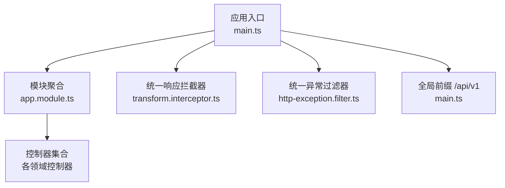

**图示来源**
- [services/api/src/main.ts:32](file://services/api/src/main.ts#L32)
- [services/api/src/app.module.ts:142](file://services/api/src/app.module.ts#L142)

**章节来源**
- [services/api/src/main.ts:32](file://services/api/src/main.ts#L32)
- [services/api/src/app.module.ts:142](file://services/api/src/app.module.ts#L142)

## 核心组件
- 全局前缀与 CORS
  - 前缀：/api/v1，便于未来升级与向后兼容。
  - CORS：允许本地开发与配置的生产域名；开放常见方法与必要头部。
- 统一响应体
  - 成功响应：自动包裹 code/message/data/timestamp 字段，约定 code=0 表示成功。
  - 已包装响应：避免重复包裹。
- 统一错误体
  - 异常捕获后统一返回 code/message/data/timestamp，服务端错误记录日志。
- 控制器职责
  - 每个控制器负责一组资源的 CRUD 与业务动作，遵循 REST 语义与路径设计。

**章节来源**
- [services/api/src/main.ts:32](file://services/api/src/main.ts#L32)
- [services/api/src/main.ts:44](file://services/api/src/main.ts#L44)
- [services/api/src/common/interceptors/transform.interceptor.ts:10](file://services/api/src/common/interceptors/transform.interceptor.ts#L10)
- [services/api/src/common/interceptors/transform.interceptor.ts:21](file://services/api/src/common/interceptors/transform.interceptor.ts#L21)
- [services/api/src/common/filters/http-exception.filter.ts:11](file://services/api/src/common/filters/http-exception.filter.ts#L11)
- [services/api/src/common/filters/http-exception.filter.ts:22](file://services/api/src/common/filters/http-exception.filter.ts#L22)

## 架构总览
下图展示了请求从客户端到控制器、服务层与数据库的整体流程，以及统一拦截器与异常过滤器的作用点。

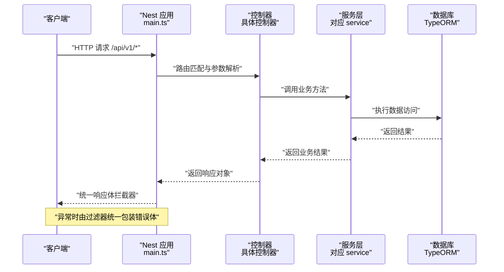

**图示来源**
- [services/api/src/main.ts:32](file://services/api/src/main.ts#L32)
- [services/api/src/common/interceptors/transform.interceptor.ts:21](file://services/api/src/common/interceptors/transform.interceptor.ts#L21)
- [services/api/src/common/filters/http-exception.filter.ts:22](file://services/api/src/common/filters/http-exception.filter.ts#L22)

## 详细组件分析

### 资源命名规范与层级设计
- 复数形式：资源名使用名词复数（如 /orders、/notifications、/favorites），体现集合语义。
- 层级结构：采用“父资源/子资源”组织，如 /admin/fortune-contents、/admin/lucky-items、/admin/report-templates 等，清晰表达资源归属。
- 资源标识符：使用路径参数（如 :id、:orderNo、:code）定位单个资源，避免在查询参数中传递主键。
- 动作资源：当操作不是标准 CRUD 时，使用动词短语（如 /create、/pay-callback、/toggle、/preview），语义明确且不改变资源状态。

示例要点（来自控制器）：
- 订单资源：/orders/create、/:orderNo/pay-callback
- 收藏资源：/favorites/toggle
- 内容资源：/admin/fortune-contents/:id、/admin/fortune-contents/:id/status
- 报告模板：/admin/report-templates/:id/versions、/admin/report-templates/:id/rollback/:versionId

**章节来源**
- [services/api/src/orders/orders.controller.ts:14](file://services/api/src/orders/orders.controller.ts#L14)
- [services/api/src/orders/orders.controller.ts:23](file://services/api/src/orders/orders.controller.ts#L23)
- [services/api/src/favorites/favorites.controller.ts:19](file://services/api/src/favorites/favorites.controller.ts#L19)
- [services/api/src/admin-content/admin-content.controller.ts:91](file://services/api/src/admin-content/admin-content.controller.ts#L91)
- [services/api/src/admin-content/admin-content.controller.ts:101](file://services/api/src/admin-content/admin-content.controller.ts#L101)
- [services/api/src/admin-content/admin-content.controller.ts:192](file://services/api/src/admin-content/admin-content.controller.ts#L192)
- [services/api/src/admin-content/admin-content.controller.ts:197](file://services/api/src/admin-content/admin-content.controller.ts#L197)

### HTTP 方法语义化应用
- GET：用于检索资源列表或详情，如 /records、/record/mood、/record/mood/detail、/record/meditation。
- POST：用于创建资源或触发动作，如 /orders/create、/favorites/toggle、/feedback、/feedback/attachments。
- PUT：用于完整更新资源，如 /admin/fortune-contents/:id、/admin/configs/:id。
- DELETE：用于删除资源，如 /admin/fortune-contents/:id、/admin/lucky-items/:id、/admin/report-templates/:id、/admin/configs/:id。
- PATCH：未在现有控制器中出现，建议后续扩展时遵循“部分更新”语义。

**章节来源**
- [services/api/src/users/users.controller.ts:82](file://services/api/src/users/users.controller.ts#L82)
- [services/api/src/users/users.controller.ts:100](file://services/api/src/users/users.controller.ts#L100)
- [services/api/src/users/users.controller.ts:106](file://services/api/src/users/users.controller.ts#L106)
- [services/api/src/users/users.controller.ts:128](file://services/api/src/users/users.controller.ts#L128)
- [services/api/src/orders/orders.controller.ts:14](file://services/api/src/orders/orders.controller.ts#L14)
- [services/api/src/favorites/favorites.controller.ts:19](file://services/api/src/favorites/favorites.controller.ts#L19)
- [services/api/src/settings/settings.controller.ts:62](file://services/api/src/settings/settings.controller.ts#L62)
- [services/api/src/admin-content/admin-content.controller.ts:72](file://services/api/src/admin-content/admin-content.controller.ts#L72)
- [services/api/src/admin-content/admin-content.controller.ts:91](file://services/api/src/admin-content/admin-content.controller.ts#L91)
- [services/api/src/admin-content/admin-content.controller.ts:96](file://services/api/src/admin-content/admin-content.controller.ts#L96)

### URL 结构设计最佳实践
- 路径参数：用于精确定位资源（如 :id、:orderNo、:code、:consentType、:versionId）。
- 查询参数：用于筛选、分页与排序（如 limit、range、recordDate、recordId、from、to、keyword、type、goal、sort、scene、status、sort 等）。
- 嵌套资源：通过父子路径清晰表达层次（如 /admin/report-templates/:id/versions、/admin/report-templates/:id/rollback/:versionId）。
- 动作后缀：对非标准 CRUD 的动作使用明确的路径后缀（如 /create、/pay-callback、/toggle、/preview、/status）。

**章节来源**
- [services/api/src/users/users.controller.ts:42](file://services/api/src/users/users.controller.ts#L42)
- [services/api/src/users/users.controller.ts:85](file://services/api/src/users/users.controller.ts#L85)
- [services/api/src/users/users.controller.ts:109](file://services/api/src/users/users.controller.ts#L109)
- [services/api/src/users/users.controller.ts:169](file://services/api/src/users/users.controller.ts#L169)
- [services/api/src/explore/explore.controller.ts:21](file://services/api/src/explore/explore.controller.ts#L21)
- [services/api/src/explore/explore.controller.ts:24](file://services/api/src/explore/explore.controller.ts#L24)
- [services/api/src/admin-content/admin-content.controller.ts:192](file://services/api/src/admin-content/admin-content.controller.ts#L192)
- [services/api/src/admin-content/admin-content.controller.ts:197](file://services/api/src/admin-content/admin-content.controller.ts#L197)

### 状态码使用规范
- 2xx 成功
  - 200 OK：常规成功响应，返回统一响应体。
  - 201 Created：创建资源成功（如创建订单、反馈提交）。
  - 204 No Content：无返回体的动作（如撤销同意）。
- 4xx 客户端错误
  - 400 Bad Request：参数校验失败、文件类型不支持、缺少必要字段等。
  - 401 Unauthorized：未授权或令牌无效。
  - 403 Forbidden：权限不足（如管理员接口需登录态）。
  - 404 Not Found：资源不存在。
  - 422 Unprocessable Entity：业务校验失败（如数据不合法）。
- 5xx 服务器错误
  - 500 Internal Server Error：未捕获异常统一映射为该状态码。

统一响应与错误包装由拦截器与过滤器保证一致性。

**章节来源**
- [services/api/src/common/interceptors/transform.interceptor.ts:10](file://services/api/src/common/interceptors/transform.interceptor.ts#L10)
- [services/api/src/common/interceptors/transform.interceptor.ts:21](file://services/api/src/common/interceptors/transform.interceptor.ts#L21)
- [services/api/src/common/filters/http-exception.filter.ts:27](file://services/api/src/common/filters/http-exception.filter.ts#L27)
- [services/api/src/common/filters/http-exception.filter.ts:42](file://services/api/src/common/filters/http-exception.filter.ts#L42)
- [services/api/src/settings/settings.controller.ts:40](file://services/api/src/settings/settings.controller.ts#L40)
- [services/api/src/admin-content/admin-content.controller.ts:304](file://services/api/src/admin-content/admin-content.controller.ts#L304)

### 分页、排序、筛选的统一处理
- 分页
  - 使用查询参数 limit 控制每页数量（如 /records?limit=...）。
  - 建议扩展 offset/after 或 cursor 方式以支持大列表场景。
- 排序
  - 建议引入 sort 参数（如 sort=-createdAt 或 sort=field:asc/desc）。
- 筛选
  - 使用 keyword、type、goal、status 等通用筛选参数（如 /explore/search?keyword=...&type=...&goal=...&sort=...）。
- 时间范围
  - 使用 from/to 或 range 等参数限定时间区间（如 /me/pulse?from=...&to=...）。

**章节来源**
- [services/api/src/users/users.controller.ts:85](file://services/api/src/users/users.controller.ts#L85)
- [services/api/src/explore/explore.controller.ts:21](file://services/api/src/explore/explore.controller.ts#L21)
- [services/api/src/explore/explore.controller.ts:24](file://services/api/src/explore/explore.controller.ts#L24)
- [services/api/src/users/users.controller.ts:169](file://services/api/src/users/users.controller.ts#L169)
- [services/api/src/users/users.controller.ts:170](file://services/api/src/users/users.controller.ts#L170)

### 控制器示例与设计原则应用

#### 认证与用户资源
- 资源命名：/auth（动作型）、/me（当前用户）、/user/profile（用户资料页）
- HTTP 方法：POST 登录/验证码发送/手机登录；GET 获取资料与历史；PUT 更新资料；POST 绑定手机号
- URL 设计：路径参数用于资源定位，查询参数用于筛选与分页
- 示例路径
  - POST /api/v1/auth/wechat-login
  - POST /api/v1/auth/phone-code
  - POST /api/v1/auth/phone-login
  - GET /api/v1/me
  - PUT /api/v1/me/profile
  - POST /api/v1/me/phone/bind
  - GET /api/v1/user/profile
  - GET /api/v1/records?limit=...
  - GET /api/v1/record/mood
  - POST /api/v1/record/mood
  - GET /api/v1/me/pulse?from=...&to=...

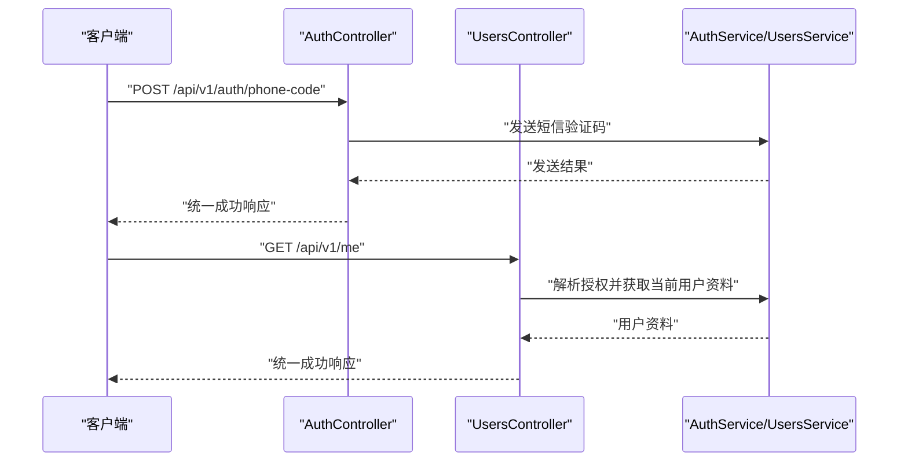

**图示来源**
- [services/api/src/auth/auth.controller.ts:12](file://services/api/src/auth/auth.controller.ts#L12)
- [services/api/src/auth/auth.controller.ts:17](file://services/api/src/auth/auth.controller.ts#L17)
- [services/api/src/auth/auth.controller.ts:22](file://services/api/src/auth/auth.controller.ts#L22)
- [services/api/src/users/users.controller.ts:27](file://services/api/src/users/users.controller.ts#L27)
- [services/api/src/users/users.controller.ts:33](file://services/api/src/users/users.controller.ts#L33)

**章节来源**
- [services/api/src/auth/auth.controller.ts:12](file://services/api/src/auth/auth.controller.ts#L12)
- [services/api/src/auth/auth.controller.ts:17](file://services/api/src/auth/auth.controller.ts#L17)
- [services/api/src/auth/auth.controller.ts:22](file://services/api/src/auth/auth.controller.ts#L22)
- [services/api/src/users/users.controller.ts:27](file://services/api/src/users/users.controller.ts#L27)
- [services/api/src/users/users.controller.ts:33](file://services/api/src/users/users.controller.ts#L33)
- [services/api/src/users/users.controller.ts:82](file://services/api/src/users/users.controller.ts#L82)

#### 订单与支付回调
- 资源命名：/orders
- HTTP 方法：POST /orders/create 创建订单；POST /orders/:orderNo/pay-callback 支付回调
- URL 设计：路径参数 :orderNo 精确匹配订单

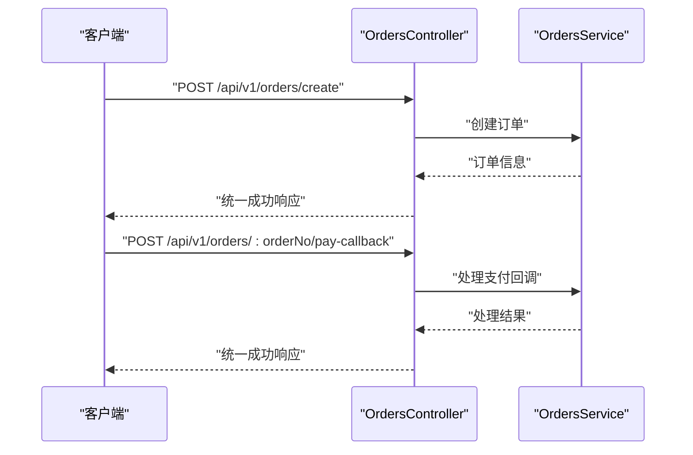

**图示来源**
- [services/api/src/orders/orders.controller.ts:14](file://services/api/src/orders/orders.controller.ts#L14)
- [services/api/src/orders/orders.controller.ts:23](file://services/api/src/orders/orders.controller.ts#L23)

**章节来源**
- [services/api/src/orders/orders.controller.ts:14](file://services/api/src/orders/orders.controller.ts#L14)
- [services/api/src/orders/orders.controller.ts:23](file://services/api/src/orders/orders.controller.ts#L23)

#### 心理测评与历史
- 资源命名：/assessments/personality
- HTTP 方法：GET 列表/详情；POST 提交测试；GET 历史
- URL 设计：路径参数 :code 标识测试编码

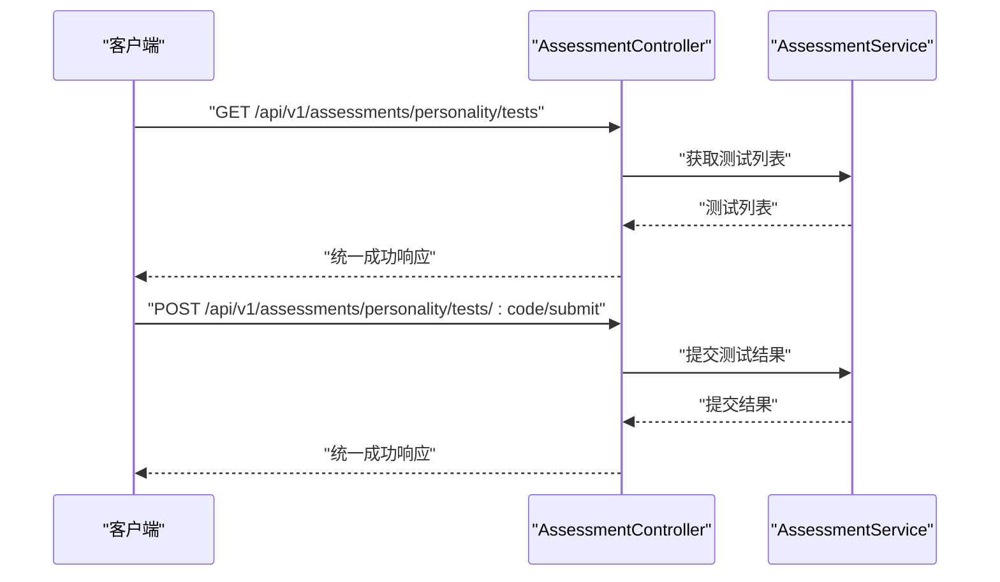

**图示来源**
- [services/api/src/assessment/assessment.controller.ts:13](file://services/api/src/assessment/assessment.controller.ts#L13)
- [services/api/src/assessment/assessment.controller.ts:23](file://services/api/src/assessment/assessment.controller.ts#L23)

**章节来源**
- [services/api/src/assessment/assessment.controller.ts:13](file://services/api/src/assessment/assessment.controller.ts#L13)
- [services/api/src/assessment/assessment.controller.ts:23](file://services/api/src/assessment/assessment.controller.ts#L23)

#### 发现与搜索
- 资源命名：/explore
- HTTP 方法：GET /explore/index 获取索引；GET /explore/search 执行搜索
- URL 设计：查询参数 keyword/type/goal/sort 实现筛选与排序

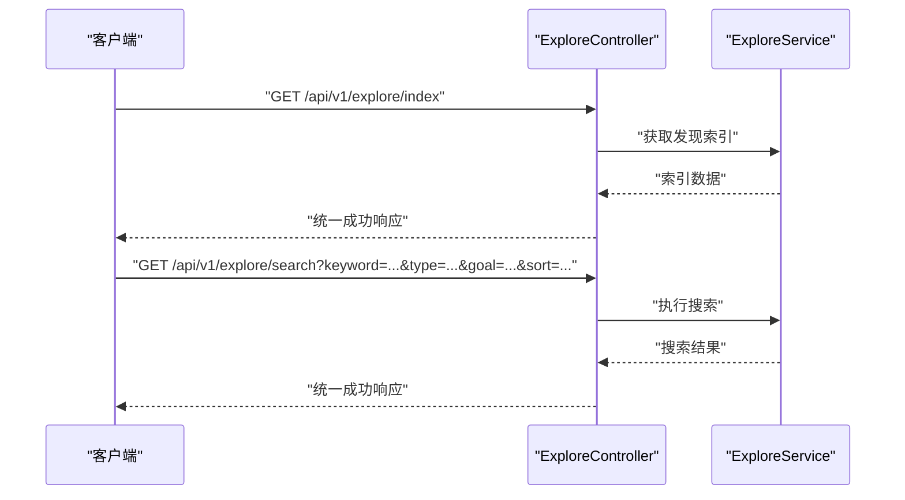

**图示来源**
- [services/api/src/explore/explore.controller.ts:12](file://services/api/src/explore/explore.controller.ts#L12)
- [services/api/src/explore/explore.controller.ts:18](file://services/api/src/explore/explore.controller.ts#L18)

**章节来源**
- [services/api/src/explore/explore.controller.ts:12](file://services/api/src/explore/explore.controller.ts#L12)
- [services/api/src/explore/explore.controller.ts:18](file://services/api/src/explore/explore.controller.ts#L18)

#### 收藏与切换
- 资源命名：/favorites
- HTTP 方法：GET 列表；POST /favorites/toggle 切换收藏
- URL 设计：动作后缀 /toggle 明确语义

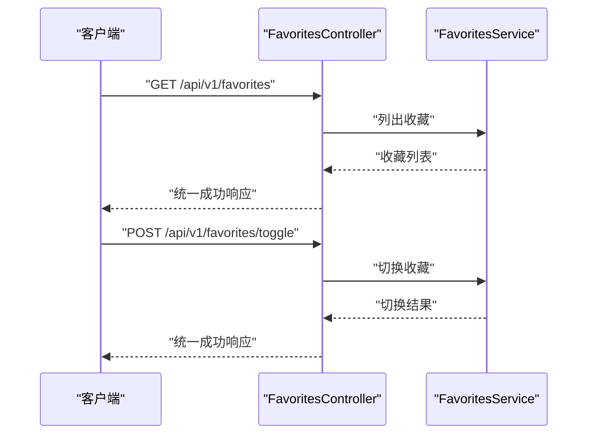

**图示来源**
- [services/api/src/favorites/favorites.controller.ts:13](file://services/api/src/favorites/favorites.controller.ts#L13)
- [services/api/src/favorites/favorites.controller.ts:19](file://services/api/src/favorites/favorites.controller.ts#L19)

**章节来源**
- [services/api/src/favorites/favorites.controller.ts:13](file://services/api/src/favorites/favorites.controller.ts#L13)
- [services/api/src/favorites/favorites.controller.ts:19](file://services/api/src/favorites/favorites.controller.ts#L19)

#### 通知订阅与管理
- 资源命名：/notifications
- HTTP 方法：GET /notifications/subscriptions 获取订阅；POST /notifications/subscribe 订阅；DELETE /notifications/subscribe 取消订阅
- 管理端：/admin/notifications 下提供日志、运行、重试、清理过期、定时任务等管理动作

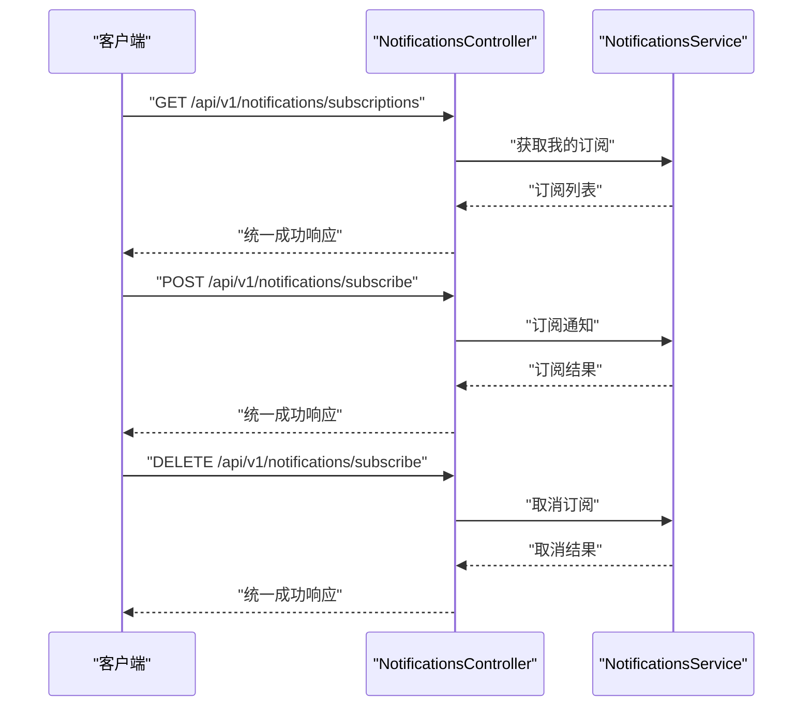

**图示来源**
- [services/api/src/notifications/notifications.controller.ts:18](file://services/api/src/notifications/notifications.controller.ts#L18)
- [services/api/src/notifications/notifications.controller.ts:24](file://services/api/src/notifications/notifications.controller.ts#L24)
- [services/api/src/notifications/notifications.controller.ts:33](file://services/api/src/notifications/notifications.controller.ts#L33)

**章节来源**
- [services/api/src/notifications/notifications.controller.ts:18](file://services/api/src/notifications/notifications.controller.ts#L18)
- [services/api/src/notifications/notifications.controller.ts:24](file://services/api/src/notifications/notifications.controller.ts#L24)
- [services/api/src/notifications/notifications.controller.ts:33](file://services/api/src/notifications/notifications.controller.ts#L33)

#### 设置与数据删除
- 资源命名：/settings
- HTTP 方法：GET /settings 获取设置；POST /feedback 提交反馈；POST /feedback/attachments 上传附件；GET /feedback/my 查看我的反馈；GET /me/consents 同意列表；POST /me/data-deletion-requests 提交删除请求；POST /me/consents 同意；DELETE /me/consents/:consentType 撤销同意；POST /me/consents/:consentType/revoke 撤销同意（POST 版本）
- 文件上传：限制 MIME 类型与大小，抛出 400 错误

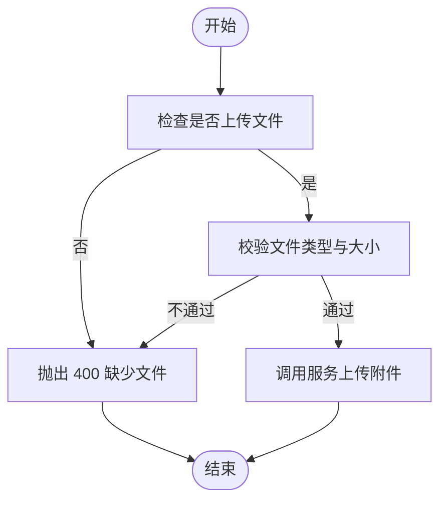

**图示来源**
- [services/api/src/settings/settings.controller.ts:71](file://services/api/src/settings/settings.controller.ts#L71)
- [services/api/src/settings/settings.controller.ts:72](file://services/api/src/settings/settings.controller.ts#L72)
- [services/api/src/settings/settings.controller.ts:40](file://services/api/src/settings/settings.controller.ts#L40)

**章节来源**
- [services/api/src/settings/settings.controller.ts:56](file://services/api/src/settings/settings.controller.ts#L56)
- [services/api/src/settings/settings.controller.ts:62](file://services/api/src/settings/settings.controller.ts#L62)
- [services/api/src/settings/settings.controller.ts:71](file://services/api/src/settings/settings.controller.ts#L71)
- [services/api/src/settings/settings.controller.ts:85](file://services/api/src/settings/settings.controller.ts#L85)
- [services/api/src/settings/settings.controller.ts:91](file://services/api/src/settings/settings.controller.ts#L91)
- [services/api/src/settings/settings.controller.ts:97](file://services/api/src/settings/settings.controller.ts#L97)
- [services/api/src/settings/settings.controller.ts:106](file://services/api/src/settings/settings.controller.ts#L106)
- [services/api/src/settings/settings.controller.ts:115](file://services/api/src/settings/settings.controller.ts#L115)
- [services/api/src/settings/settings.controller.ts:124](file://services/api/src/settings/settings.controller.ts#L124)

#### 管理端内容与配置
- 资源命名：/admin/fortune-contents、/admin/lucky-items、/admin/report-templates、/admin/configs、/admin/uploads
- HTTP 方法：GET 列表；POST 创建；POST /preview 预览；POST /batch-status 批量状态变更；PUT 更新；DELETE 删除；POST /:id/status 修改状态
- 文件上传：/admin/uploads/audio 限制音频类型与大小，抛出 400 错误

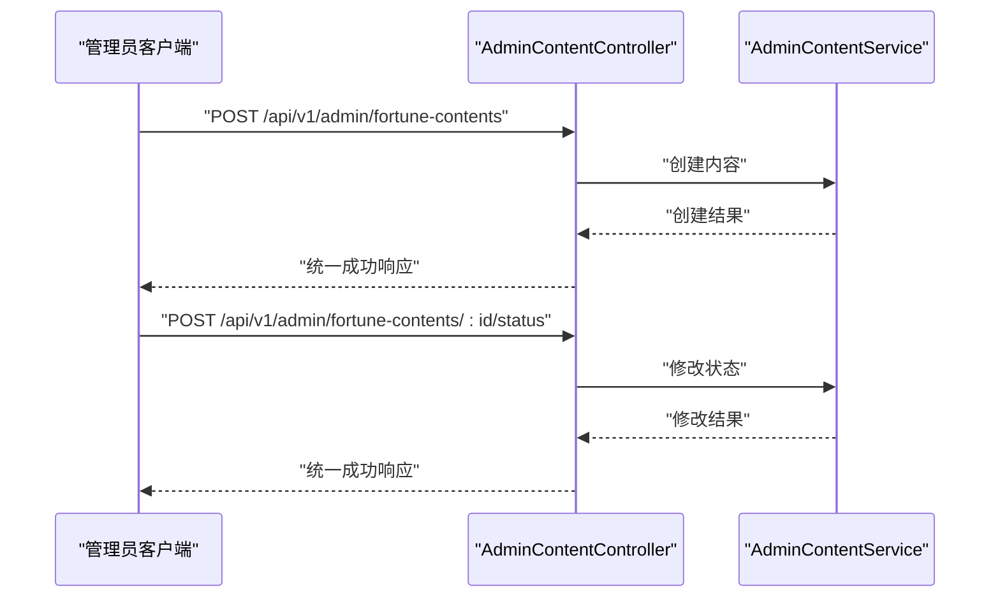

**图示来源**
- [services/api/src/admin-content/admin-content.controller.ts:72](file://services/api/src/admin-content/admin-content.controller.ts#L72)
- [services/api/src/admin-content/admin-content.controller.ts:101](file://services/api/src/admin-content/admin-content.controller.ts#L101)

**章节来源**
- [services/api/src/admin-content/admin-content.controller.ts:63](file://services/api/src/admin-content/admin-content.controller.ts#L63)
- [services/api/src/admin-content/admin-content.controller.ts:72](file://services/api/src/admin-content/admin-content.controller.ts#L72)
- [services/api/src/admin-content/admin-content.controller.ts:91](file://services/api/src/admin-content/admin-content.controller.ts#L91)
- [services/api/src/admin-content/admin-content.controller.ts:96](file://services/api/src/admin-content/admin-content.controller.ts#L96)
- [services/api/src/admin-content/admin-content.controller.ts:101](file://services/api/src/admin-content/admin-content.controller.ts#L101)
- [services/api/src/admin-content/admin-content.controller.ts:299](file://services/api/src/admin-content/admin-content.controller.ts#L299)

#### 管理端认证与菜单
- 资源命名：/admin
- HTTP 方法：POST /admin/auth/login 登录；GET /admin/me 获取管理员信息；GET /admin/menus 获取菜单
- 权限：使用守卫要求已登录管理员

**章节来源**
- [services/api/src/admin-auth/admin-auth.controller.ts:10](file://services/api/src/admin-auth/admin-auth.controller.ts#L10)
- [services/api/src/admin-auth/admin-auth.controller.ts:15](file://services/api/src/admin-auth/admin-auth.controller.ts#L15)
- [services/api/src/admin-auth/admin-auth.controller.ts:30](file://services/api/src/admin-auth/admin-auth.controller.ts#L30)

## 依赖关系分析
- 应用启动与全局配置
  - main.ts 设置全局前缀、CORS、验证管道、拦截器与过滤器。
  - app.module.ts 聚合各模块与实体，启用 TypeORM。
- 控制器与服务层
  - 控制器仅负责路由与参数解析，业务逻辑下沉至服务层。
  - 服务层通过 DTO 校验输入，返回标准化结果。
- 统一响应与错误处理
  - TransformInterceptor：统一成功响应包装。
  - HttpExceptionFilter：统一错误响应包装与日志记录。

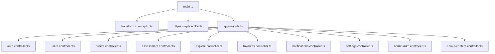

**图示来源**
- [services/api/src/main.ts:32](file://services/api/src/main.ts#L32)
- [services/api/src/common/interceptors/transform.interceptor.ts:21](file://services/api/src/common/interceptors/transform.interceptor.ts#L21)
- [services/api/src/common/filters/http-exception.filter.ts:22](file://services/api/src/common/filters/http-exception.filter.ts#L22)
- [services/api/src/app.module.ts:142](file://services/api/src/app.module.ts#L142)

**章节来源**
- [services/api/src/main.ts:32](file://services/api/src/main.ts#L32)
- [services/api/src/app.module.ts:142](file://services/api/src/app.module.ts#L142)

## 性能考量
- 响应体统一：减少前端解析成本，提高一致性。
- 参数校验：开启白名单与隐式转换，降低无效请求对后端的压力。
- 分页与筛选：建议在服务层实现数据库层面的分页与索引优化，避免一次性加载大量数据。
- 文件上传：限制文件大小与类型，防止恶意上传导致资源浪费。

## 故障排查指南
- 统一错误体
  - 服务器错误会记录堆栈日志，便于定位问题。
  - 客户端错误（4xx）返回明确 message，便于前端提示。
- 常见问题
  - 400：检查 DTO 校验规则与文件类型/大小限制。
  - 401/403：确认授权头与管理员登录态。
  - 404：核对路径参数与资源是否存在。
  - 500：查看日志定位异常并修复。

**章节来源**
- [services/api/src/common/filters/http-exception.filter.ts:32](file://services/api/src/common/filters/http-exception.filter.ts#L32)
- [services/api/src/common/filters/http-exception.filter.ts:57](file://services/api/src/common/filters/http-exception.filter.ts#L57)

## 结论
本项目在 RESTful 设计上体现了良好的一致性与可维护性：统一的全局前缀、统一的响应与错误体、清晰的资源命名与层级、规范的 HTTP 方法语义、合理的 URL 结构与参数使用。建议在后续迭代中补充分页/排序的标准化参数约定与部分更新（PATCH）的支持，持续提升 API 的易用性与扩展性。

## 附录
- 统一响应体字段
  - code：数字状态码，约定 0 表示成功
  - message：字符串消息
  - data：实际数据
  - timestamp：ISO 时间戳
- 统一错误体字段
  - code：HTTP 状态码
  - message：错误消息
  - data：null
  - timestamp：ISO 时间戳