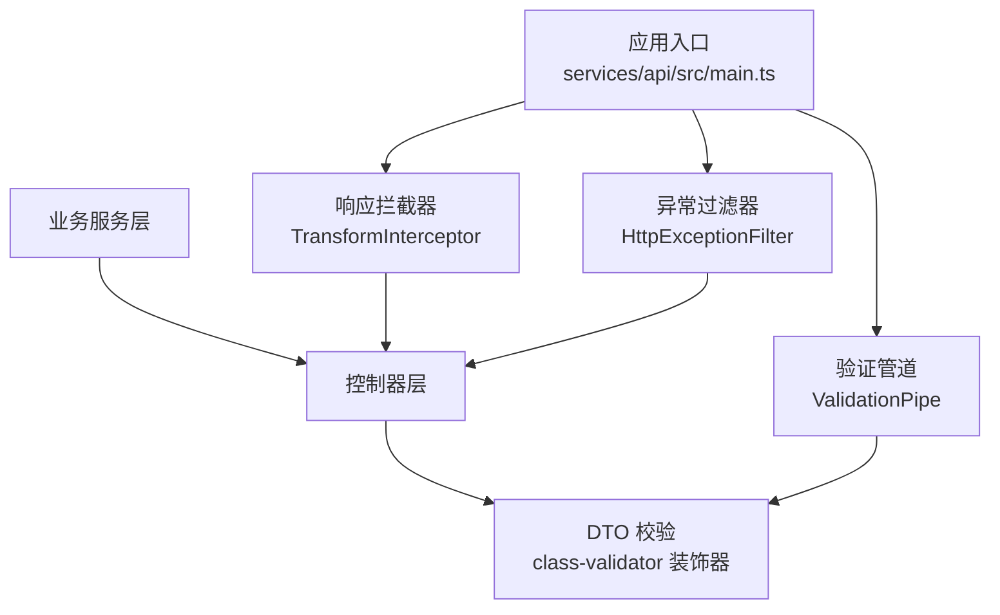
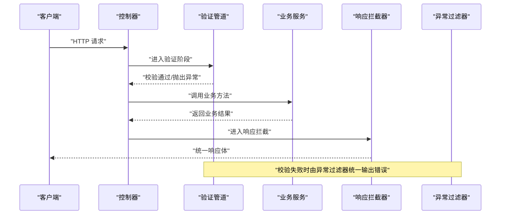
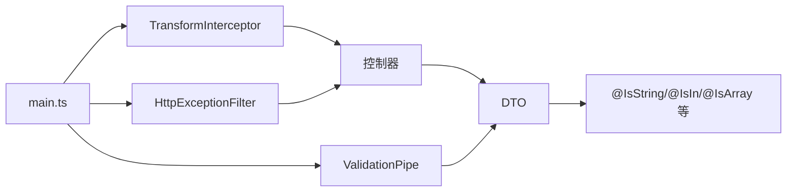

# 参数验证机制

<cite>
**本文引用的文件**
- [services/api/src/main.ts](file://services/api/src/main.ts)
- [services/api/src/common/filters/http-exception.filter.ts](file://services/api/src/common/filters/http-exception.filter.ts)
- [services/api/src/common/interceptors/transform.interceptor.ts](file://services/api/src/common/interceptors/transform.interceptor.ts)
- [services/api/src/admin-auth/dto/admin-login.dto.ts](file://services/api/src/admin-auth/dto/admin-login.dto.ts)
- [services/api/src/auth/dto/phone-login.dto.ts](file://services/api/src/auth/dto/phone-login.dto.ts)
- [services/api/src/auth/dto/wechat-login.dto.ts](file://services/api/src/auth/dto/wechat-login.dto.ts)
- [services/api/src/users/dto/update-profile.dto.ts](file://services/api/src/users/dto/update-profile.dto.ts)
- [services/api/src/assessment/dto/submit-assessment.dto.ts](file://services/api/src/assessment/dto/submit-assessment.dto.ts)
- [services/api/src/orders/dto/create-order.dto.ts](file://services/api/src/orders/dto/create-order.dto.ts)
- [services/api/src/settings/dto/submit-feedback.dto.ts](file://services/api/src/settings/dto/submit-feedback.dto.ts)
- [services/api/src/lucky/dto/generate-lucky-wallpaper.dto.ts](file://services/api/src/lucky/dto/generate-lucky-wallpaper.dto.ts)
</cite>

## 目录
1. [引言](#引言)
2. [项目结构](#项目结构)
3. [核心组件](#核心组件)
4. [架构总览](#架构总览)
5. [详细组件分析](#详细组件分析)
6. [依赖关系分析](#依赖关系分析)
7. [性能考虑](#性能考虑)
8. [故障排查指南](#故障排查指南)
9. [结论](#结论)
10. [附录](#附录)

## 引言
本文件系统性阐述 Fortune Hub 后端服务的 API 参数验证机制，覆盖 DTO 设计原则（字段定义、数据类型声明、必填项标记）、内置验证装饰器（如字符串、长度、枚举、数组、嵌套对象等）的使用、参数预处理（隐式转换、格式化、默认值策略）、以及统一错误处理与响应包装。通过多个实际 DTO 的分析，帮助开发者在新增或维护接口时遵循一致的验证规范。

## 项目结构
后端采用 NestJS 架构，全局注册了验证管道、响应拦截器与异常过滤器，并在各模块的控制器中使用 DTO 进行输入校验。关键位置如下：
- 全局配置：在应用启动时注册验证管道、拦截器与异常过滤器
- 响应包装：拦截器统一将成功响应封装为统一结构
- 错误处理：异常过滤器统一输出错误响应体
- DTO 验证：在各模块 DTO 中使用 class-validator 装饰器进行字段级校验

图表来源
- [services/api/src/main.ts:35-43](file://services/api/src/main.ts#L35-L43)
- [services/api/src/common/interceptors/transform.interceptor.ts:17-59](file://services/api/src/common/interceptors/transform.interceptor.ts#L17-L59)
- [services/api/src/common/filters/http-exception.filter.ts:18-92](file://services/api/src/common/filters/http-exception.filter.ts#L18-L92)

章节来源
- [services/api/src/main.ts:32-43](file://services/api/src/main.ts#L32-L43)

## 核心组件
- 验证管道（ValidationPipe）
  - 白名单策略：仅保留 DTO 中定义的字段
  - 参数预处理：开启隐式类型转换，自动将字符串等基础类型转换为目标类型
  - 统一错误：校验失败抛出 HTTP 异常，交由异常过滤器处理
- 响应拦截器（TransformInterceptor）
  - 成功响应统一封装 code/message/data/timestamp
  - 自动识别已包装响应，避免重复包装
- 异常过滤器（HttpExceptionFilter）
  - 将异常状态码映射为统一错误体
  - 提取错误消息（支持数组取首个有效消息）
  - 对 5xx 错误记录日志

章节来源
- [services/api/src/main.ts:35-43](file://services/api/src/main.ts#L35-L43)
- [services/api/src/common/interceptors/transform.interceptor.ts:17-59](file://services/api/src/common/interceptors/transform.interceptor.ts#L17-L59)
- [services/api/src/common/filters/http-exception.filter.ts:18-92](file://services/api/src/common/filters/http-exception.filter.ts#L18-L92)

## 架构总览
下图展示了从客户端请求到响应返回的关键流程，重点体现验证、预处理与错误处理的协作关系。

图表来源
- [services/api/src/main.ts:35-43](file://services/api/src/main.ts#L35-L43)
- [services/api/src/common/interceptors/transform.interceptor.ts:17-59](file://services/api/src/common/interceptors/transform.interceptor.ts#L17-L59)
- [services/api/src/common/filters/http-exception.filter.ts:18-92](file://services/api/src/common/filters/http-exception.filter.ts#L18-L92)

## 详细组件分析

### DTO 设计原则
- 字段定义
  - 明确每个字段的用途与约束，避免冗余字段
  - 使用可选字段（@IsOptional）表达非必填项
- 数据类型声明
  - 使用强类型装饰器（如 @IsString、@IsDateString、@IsIn、@IsObject 等）限定字段类型
- 必填项标记
  - 未标注 @IsOptional 的字段即视为必填
  - 结合 @IsNotEmpty、@MinLength、@MaxLength 等确保内容有效性

示例参考
- 用户资料更新：字段包含昵称、头像、生日、性别、出生时间、出生地等，部分可选，部分必填并有限制
- 订单创建：产品编码为必填字符串，长度受限
- 幸运壁纸生成：多字段可选，支持数组与枚举类型

章节来源
- [services/api/src/users/dto/update-profile.dto.ts:10-38](file://services/api/src/users/dto/update-profile.dto.ts#L10-L38)
- [services/api/src/orders/dto/create-order.dto.ts:3-8](file://services/api/src/orders/dto/create-order.dto.ts#L3-L8)
- [services/api/src/lucky/dto/generate-lucky-wallpaper.dto.ts:3-30](file://services/api/src/lucky/dto/generate-lucky-wallpaper.dto.ts#L3-L30)

### 内置验证装饰器应用
- 字符串与长度
  - @IsString：确保字段为字符串
  - @MinLength、@MaxLength：限制字符串长度
  - 示例：用户名、密码、手机号、验证码、昵称、头像地址等
- 枚举与范围
  - @IsIn：限定枚举值集合
  - 示例：平台标识、壁纸比例等
- 数组与嵌套
  - @IsArray、@ArrayMinSize、@ArrayMaxSize：数组长度控制
  - @ValidateNested：嵌套对象校验
  - @Type：指定嵌套对象类型
  - 示例：评估答题数组、附件数组等
- 日期与正则
  - @IsDateString：日期字符串格式
  - @Matches：正则表达式匹配
  - 示例：生日、出生时间等
- 必填与可选
  - @IsNotEmpty：非空字符串
  - @IsOptional：可选字段
  - 示例：可选昵称、可选头像、可选出生信息等

章节来源
- [services/api/src/admin-auth/dto/admin-login.dto.ts:3-14](file://services/api/src/admin-auth/dto/admin-login.dto.ts#L3-L14)
- [services/api/src/auth/dto/phone-login.dto.ts:3-24](file://services/api/src/auth/dto/phone-login.dto.ts#L3-L24)
- [services/api/src/auth/dto/wechat-login.dto.ts:3-22](file://services/api/src/auth/dto/wechat-login.dto.ts#L3-L22)
- [services/api/src/assessment/dto/submit-assessment.dto.ts:10-27](file://services/api/src/assessment/dto/submit-assessment.dto.ts#L10-L27)
- [services/api/src/settings/dto/submit-feedback.dto.ts:11-41](file://services/api/src/settings/dto/submit-feedback.dto.ts#L11-L41)

### 参数预处理机制
- 隐式类型转换
  - ValidationPipe 启用 transform 与 enableImplicitConversion，自动将字符串等基础类型转换为目标类型（如布尔、数字、日期字符串转 Date）
- 默认值策略
  - DTO 中未显式赋值的可选字段保持 undefined；若需默认值，应在业务层或控制器层进行兜底处理
- 格式化建议
  - 对邮箱、手机号等建议在业务层统一清洗（如去除空白），并在 DTO 中通过 @Matches 或业务逻辑保证格式一致性

章节来源
- [services/api/src/main.ts:35-43](file://services/api/src/main.ts#L35-L43)

### 错误消息本地化与统一处理
- 统一响应结构
  - 成功响应：code=0、message='ok'、data 为业务数据、timestamp 为当前时间
  - 失败响应：code 为状态码、message 为错误描述、data=null、timestamp 为当前时间
- 错误提取
  - 异常过滤器优先从异常响应体中提取第一条有效消息，否则回退为通用提示
- 日志记录
  - 5xx 错误会记录堆栈信息，便于定位问题

章节来源
- [services/api/src/common/interceptors/transform.interceptor.ts:10-15](file://services/api/src/common/interceptors/transform.interceptor.ts#L10-L15)
- [services/api/src/common/interceptors/transform.interceptor.ts:21-46](file://services/api/src/common/interceptors/transform.interceptor.ts#L21-L46)
- [services/api/src/common/filters/http-exception.filter.ts:42-90](file://services/api/src/common/filters/http-exception.filter.ts#L42-L90)

### 实际 DTO 应用示例

#### 管理员登录 DTO（字段定义、长度与类型）
- 字段：username、password
- 约束：字符串类型、最小/最大长度限制
- 设计要点：必填字段，长度约束保障安全与兼容性

章节来源
- [services/api/src/admin-auth/dto/admin-login.dto.ts:3-14](file://services/api/src/admin-auth/dto/admin-login.dto.ts#L3-L14)

#### 手机号登录 DTO（可选字段与长度）
- 字段：phone、code、nickname（可选）、avatarUrl（可选）
- 约束：字符串类型、长度限制；可选字段允许不传
- 设计要点：手机号与验证码必填，用户信息可选

章节来源
- [services/api/src/auth/dto/phone-login.dto.ts:3-24](file://services/api/src/auth/dto/phone-login.dto.ts#L3-L24)

#### 微信登录 DTO（枚举与可选字段）
- 字段：code、platform（限定枚举）、nickname（可选）、avatarUrl（可选）
- 约束：平台值必须为指定枚举；其他字段长度限制
- 设计要点：通过 @IsIn 严格限定平台来源

章节来源
- [services/api/src/auth/dto/wechat-login.dto.ts:3-22](file://services/api/src/auth/dto/wechat-login.dto.ts#L3-L22)

#### 评估提交 DTO（数组与嵌套对象）
- 子对象：AssessmentAnswerDto（questionId、optionKey 必填且非空）
- 主对象：SubmitAssessmentDto（answers 为数组，至少一项，逐项嵌套校验）
- 设计要点：@ValidateNested(each:true) 与 @Type 指定子类型，确保数组元素完整校验

章节来源
- [services/api/src/assessment/dto/submit-assessment.dto.ts:10-27](file://services/api/src/assessment/dto/submit-assessment.dto.ts#L10-L27)

#### 反馈提交 DTO（复杂字段组合）
- 字段：message（必填，长度范围）、contact（可选）、category（可选）、source（可选）、clientInfo（可选对象）、attachments（可选数组，最多5个）
- 约束：字符串长度、数组大小、对象类型
- 设计要点：通过 @IsOptional 与 @IsObject/@IsArray 组合表达灵活输入

章节来源
- [services/api/src/settings/dto/submit-feedback.dto.ts:11-41](file://services/api/src/settings/dto/submit-feedback.dto.ts#L11-L41)

#### 幸运壁纸 DTO（可选字段与枚举）
- 字段：sourceBizCode（可选）、title（可选）、prompt（可选）、mood（可选）、palette（可选数组，最多3个，每项为字符串）、aspectRatio（可选枚举）
- 约束：数组大小与每项类型、枚举取值
- 设计要点：以可选字段提升灵活性，同时通过装饰器约束边界

章节来源
- [services/api/src/lucky/dto/generate-lucky-wallpaper.dto.ts:3-30](file://services/api/src/lucky/dto/generate-lucky-wallpaper.dto.ts#L3-L30)

## 依赖关系分析
- 应用入口依赖全局管道、拦截器与过滤器
- 控制器依赖 DTO 进行输入校验
- 业务服务层接收已通过验证的参数，专注于业务逻辑

图表来源
- [services/api/src/main.ts:35-43](file://services/api/src/main.ts#L35-L43)
- [services/api/src/common/interceptors/transform.interceptor.ts:17-59](file://services/api/src/common/interceptors/transform.interceptor.ts#L17-L59)
- [services/api/src/common/filters/http-exception.filter.ts:18-92](file://services/api/src/common/filters/http-exception.filter.ts#L18-L92)

## 性能考虑
- 验证开销
  - 合理使用 @IsOptional 与白名单策略，减少不必要的字段转换
  - 嵌套对象与数组校验会增加 CPU 与内存消耗，建议控制数组规模
- 预处理策略
  - 启用隐式转换可降低业务层数据整形成本，但需确保输入来源可信
- 响应包装
  - 统一包装对性能影响极小，主要为序列化成本，建议保持开启

## 故障排查指南
- 常见问题
  - 字段缺失：未标注 @IsOptional 的字段缺失会导致校验失败
  - 类型不符：字符串与数字混用会触发类型转换失败
  - 数组越界：数组长度超出 @ArrayMinSize/@ArrayMaxSize 限制
  - 枚举越界：@IsIn 的取值不在允许集合内
- 定位方法
  - 查看异常过滤器输出的错误消息与状态码
  - 关注 5xx 错误日志，确认服务端异常
- 修复建议
  - 在 DTO 中补齐必填字段或调整为可选
  - 修正字段类型或补充转换逻辑
  - 调整数组大小或枚举取值

章节来源
- [services/api/src/common/filters/http-exception.filter.ts:42-90](file://services/api/src/common/filters/http-exception.filter.ts#L42-L90)

## 结论
Fortune Hub 的参数验证机制以 DTO 为核心，结合全局验证管道、响应拦截器与异常过滤器，实现了“强约束、可扩展、易维护”的输入治理方案。通过明确的字段定义、丰富的内置装饰器与统一的错误处理，既提升了接口安全性，也改善了开发体验。建议在新增接口时严格复用现有模式，确保一致性与可演进性。

## 附录
- 最佳实践清单
  - 所有对外接口均应使用 DTO
  - 必填字段不使用 @IsOptional
  - 对字符串长度进行合理限制
  - 对数组与嵌套对象使用 @ValidateNested 与 @Type
  - 对枚举使用 @IsIn 限定取值
  - 利用隐式转换减少业务层数据整形
  - 保持响应与错误体统一格式