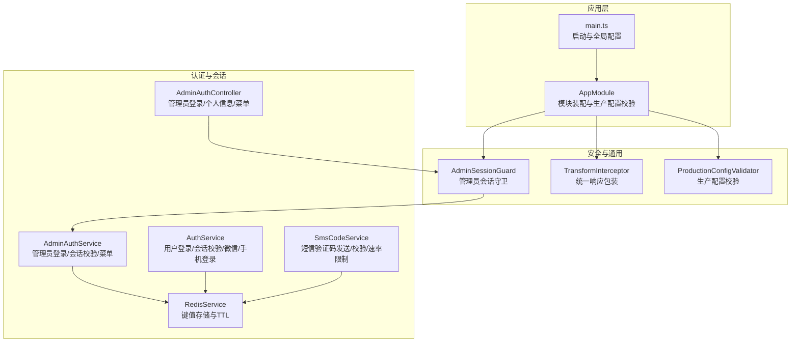
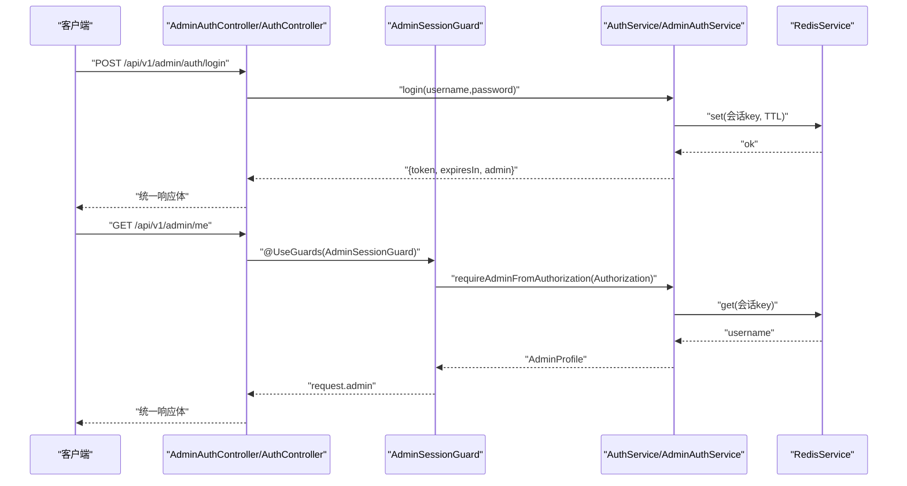
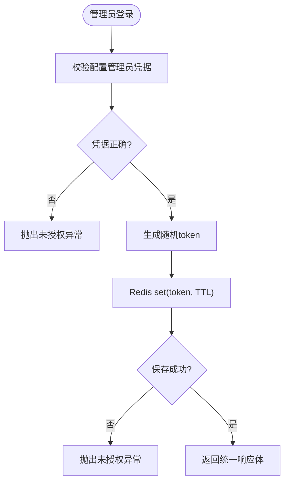
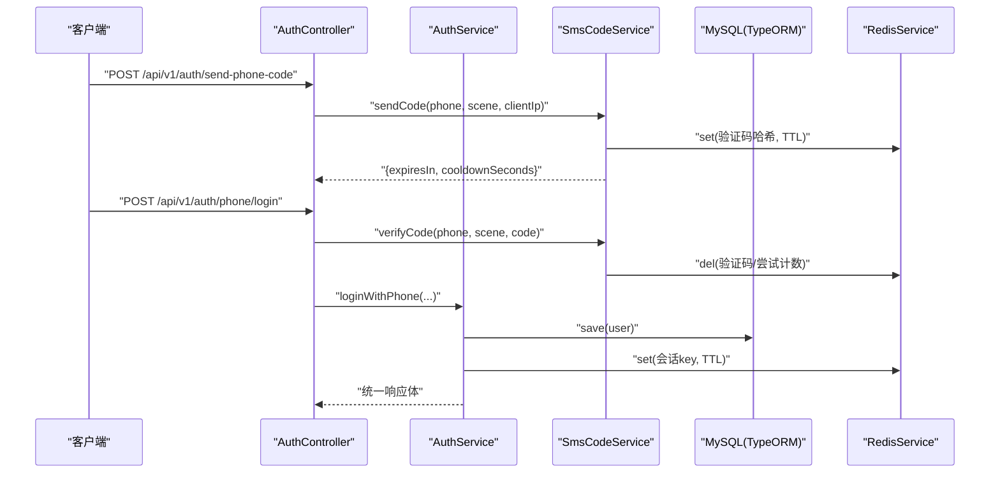
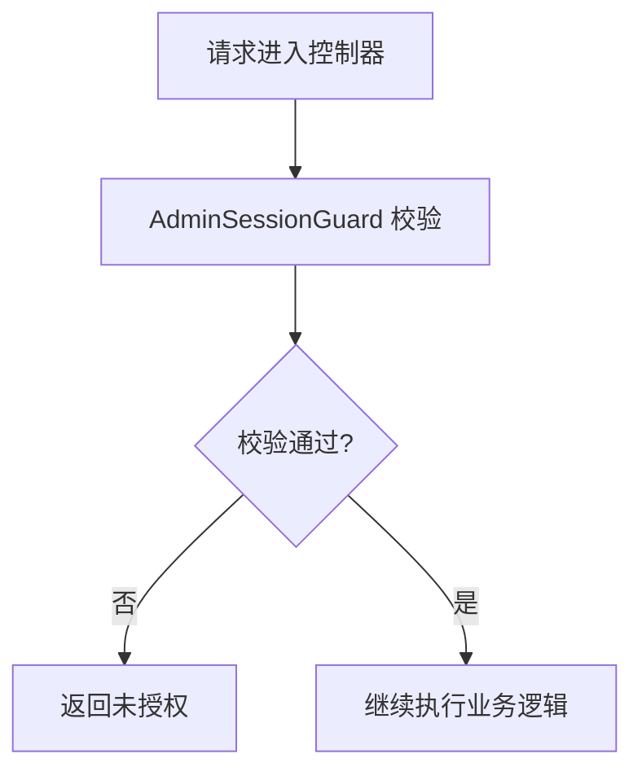
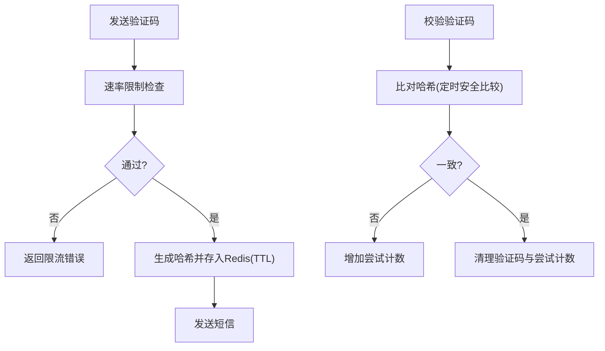
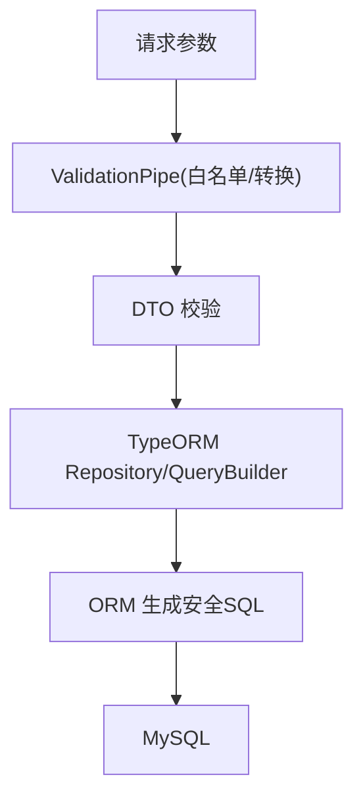
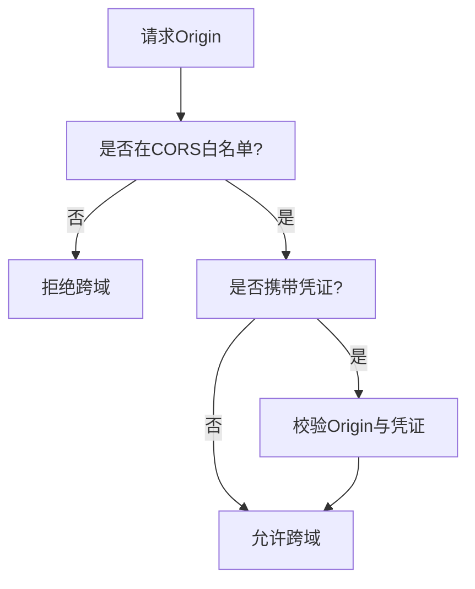
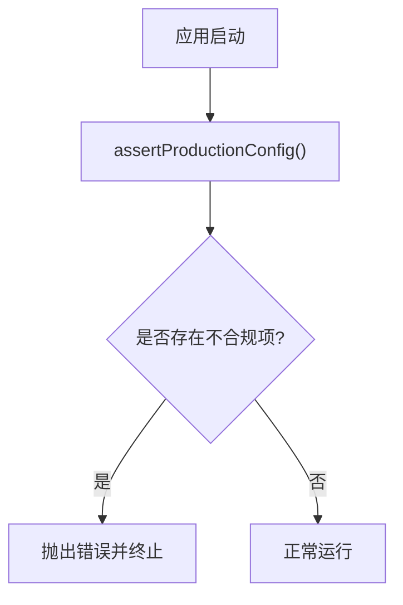
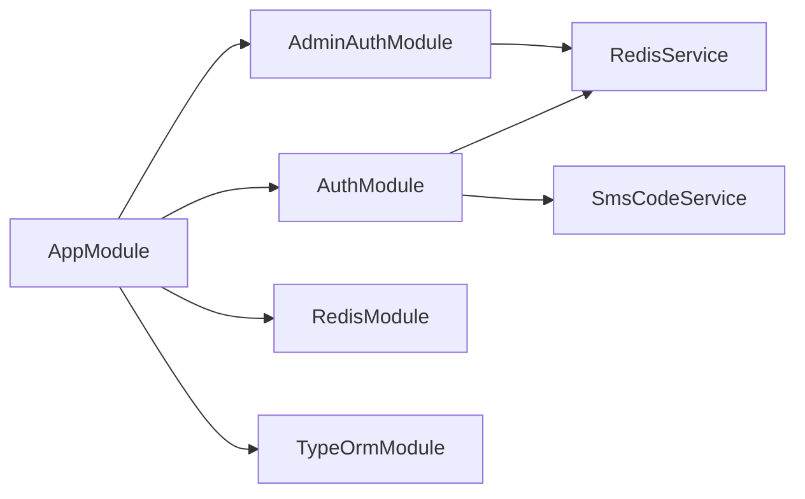

# 安全实现规范

<cite>
**本文引用的文件**
- [services/api/src/admin-auth/admin-auth.controller.ts](file://services/api/src/admin-auth/admin-auth.controller.ts)
- [services/api/src/admin-auth/admin-auth.service.ts](file://services/api/src/admin-auth/admin-auth.service.ts)
- [services/api/src/admin-auth/admin-session.guard.ts](file://services/api/src/admin-auth/admin-session.guard.ts)
- [services/api/src/auth/auth.service.ts](file://services/api/src/auth/auth.service.ts)
- [services/api/src/auth/sms-code.service.ts](file://services/api/src/auth/sms-code.service.ts)
- [services/api/src/redis/redis.service.ts](file://services/api/src/redis/redis.service.ts)
- [services/api/src/common/production-config.validator.ts](file://services/api/src/common/production-config.validator.ts)
- [services/api/src/common/interceptors/transform.interceptor.ts](file://services/api/src/common/interceptors/transform.interceptor.ts)
- [services/api/src/main.ts](file://services/api/src/main.ts)
- [services/api/src/app.module.ts](file://services/api/src/app.module.ts)
- [services/api/src/database/migrations/1761333600000-SettingsFeedbackNotificationsOps.ts](file://services/api/src/database/migrations/1761333600000-SettingsFeedbackNotificationsOps.ts)
- [scripts/check-production-health.sh](file://scripts/check-production-health.sh)
</cite>

## 目录
1. [简介](#简介)
2. [项目结构](#项目结构)
3. [核心组件](#核心组件)
4. [架构总览](#架构总览)
5. [详细组件分析](#详细组件分析)
6. [依赖关系分析](#依赖关系分析)
7. [性能考虑](#性能考虑)
8. [故障排查指南](#故障排查指南)
9. [结论](#结论)
10. [附录](#附录)

## 简介
本规范面向 Fortune Hub 的后端 API，系统性阐述安全实现方案，覆盖身份认证与会话管理、权限控制、防重放与请求签名、SQL 注入防护、XSS/CSRF/CORS 跨域安全、生产环境安全配置以及安全守卫与中间件的落地实践。文档以代码为依据，提供可追溯的来源路径，并通过图示帮助非技术读者理解整体安全机制。

## 项目结构
后端采用 NestJS 架构，按功能模块划分（如 admin-auth、auth、assessment、orders 等），统一在全局注册拦截器、异常过滤器与 CORS；认证态存储于 Redis，数据库连接通过 TypeORM 管理；生产配置校验在应用启动时执行，确保 HTTPS、CORS、敏感密钥等关键项符合生产要求。

**图表来源**
- [services/api/src/main.ts:8-62](file://services/api/src/main.ts#L8-L62)
- [services/api/src/app.module.ts:61-145](file://services/api/src/app.module.ts#L61-L145)
- [services/api/src/admin-auth/admin-session.guard.ts:13-24](file://services/api/src/admin-auth/admin-session.guard.ts#L13-L24)
- [services/api/src/admin-auth/admin-auth.controller.ts:6-44](file://services/api/src/admin-auth/admin-auth.controller.ts#L6-L44)
- [services/api/src/admin-auth/admin-auth.service.ts:17-119](file://services/api/src/admin-auth/admin-auth.service.ts#L17-L119)
- [services/api/src/auth/auth.service.ts:39-419](file://services/api/src/auth/auth.service.ts#L39-L419)
- [services/api/src/auth/sms-code.service.ts:25-400](file://services/api/src/auth/sms-code.service.ts#L25-L400)
- [services/api/src/redis/redis.service.ts:6-125](file://services/api/src/redis/redis.service.ts#L6-L125)

**章节来源**
- [services/api/src/main.ts:8-62](file://services/api/src/main.ts#L8-L62)
- [services/api/src/app.module.ts:61-145](file://services/api/src/app.module.ts#L61-L145)

## 核心组件
- 管理员认证与会话：基于 Bearer Token 的 Redis 会话存储，支持登录、获取当前管理员信息、获取菜单。
- 用户认证与会话：支持微信登录与手机号验证码登录，均采用 Redis 存储会话并设置 TTL。
- 短信验证码：发送与校验均受速率限制与安全哈希保护，防止暴力破解与重放。
- 生产配置校验：启动时对 HTTPS、CORS、密钥强度等进行严格校验。
- 统一响应与全局中间件：统一返回体结构，增强前端一致性与可观测性。
- 审计日志：数据库迁移中包含审计日志表结构，便于追踪管理员操作。

**章节来源**
- [services/api/src/admin-auth/admin-auth.controller.ts:6-44](file://services/api/src/admin-auth/admin-auth.controller.ts#L6-L44)
- [services/api/src/admin-auth/admin-auth.service.ts:17-119](file://services/api/src/admin-auth/admin-auth.service.ts#L17-L119)
- [services/api/src/auth/auth.service.ts:39-419](file://services/api/src/auth/auth.service.ts#L39-L419)
- [services/api/src/auth/sms-code.service.ts:25-400](file://services/api/src/auth/sms-code.service.ts#L25-L400)
- [services/api/src/common/production-config.validator.ts:25-104](file://services/api/src/common/production-config.validator.ts#L25-L104)
- [services/api/src/common/interceptors/transform.interceptor.ts:17-59](file://services/api/src/common/interceptors/transform.interceptor.ts#L17-L59)
- [services/api/src/database/migrations/1761333600000-SettingsFeedbackNotificationsOps.ts:149-179](file://services/api/src/database/migrations/1761333600000-SettingsFeedbackNotificationsOps.ts#L149-L179)

## 架构总览
下图展示了从客户端到服务端的关键交互与安全控制点，包括认证、会话校验、速率限制与统一响应。

**图表来源**
- [services/api/src/admin-auth/admin-auth.controller.ts:10-28](file://services/api/src/admin-auth/admin-auth.controller.ts#L10-L28)
- [services/api/src/admin-auth/admin-session.guard.ts:17-23](file://services/api/src/admin-auth/admin-session.guard.ts#L17-L23)
- [services/api/src/admin-auth/admin-auth.service.ts:24-68](file://services/api/src/admin-auth/admin-auth.service.ts#L24-L68)
- [services/api/src/auth/auth.service.ts:171-188](file://services/api/src/auth/auth.service.ts#L171-L188)
- [services/api/src/redis/redis.service.ts:79-104](file://services/api/src/redis/redis.service.ts#L79-L104)

## 详细组件分析

### 管理员认证与会话管理
- 登录流程：校验配置管理员凭据，生成随机 token 并写入 Redis，设置 TTL，返回统一响应。
- 会话校验：守卫从 Authorization 头解析 Bearer Token，读取 Redis 中的用户名，匹配配置管理员，失败抛出未授权异常。
- 菜单权限：根据管理员权限过滤菜单项，实现最小权限暴露。

**图表来源**
- [services/api/src/admin-auth/admin-auth.service.ts:24-52](file://services/api/src/admin-auth/admin-auth.service.ts#L24-L52)

**章节来源**
- [services/api/src/admin-auth/admin-auth.controller.ts:10-13](file://services/api/src/admin-auth/admin-auth.controller.ts#L10-L13)
- [services/api/src/admin-auth/admin-auth.service.ts:24-68](file://services/api/src/admin-auth/admin-auth.service.ts#L24-L68)
- [services/api/src/admin-auth/admin-session.guard.ts:17-23](file://services/api/src/admin-auth/admin-session.guard.ts#L17-L23)

### 用户认证与会话管理
- 微信登录：解析 code 获取 openid/unionid，创建或更新用户记录，生成 token 写入 Redis。
- 手机号登录：发送/校验短信验证码，校验通过后创建或更新用户，生成 token。
- 会话校验：从 Authorization 头提取 Bearer Token，Redis 中查找用户 ID，数据库二次校验用户存在性。

**图表来源**
- [services/api/src/auth/auth.service.ts:81-131](file://services/api/src/auth/auth.service.ts#L81-L131)
- [services/api/src/auth/sms-code.service.ts:35-76](file://services/api/src/auth/sms-code.service.ts#L35-L76)
- [services/api/src/auth/sms-code.service.ts:78-113](file://services/api/src/auth/sms-code.service.ts#L78-L113)
- [services/api/src/redis/redis.service.ts:89-104](file://services/api/src/redis/redis.service.ts#L89-L104)

**章节来源**
- [services/api/src/auth/auth.service.ts:50-131](file://services/api/src/auth/auth.service.ts#L50-L131)
- [services/api/src/auth/sms-code.service.ts:35-113](file://services/api/src/auth/sms-code.service.ts#L35-L113)

### 权限控制策略
- 角色与权限：管理员角色为“超级管理员”，权限集合在服务端集中定义，菜单项按权限过滤。
- 资源访问控制：控制器方法通过守卫进行会话校验，未通过则拒绝访问。
- 操作权限验证：建议在具体业务服务中增加细粒度权限判断（例如资源归属校验、操作动作白名单）。

**图表来源**
- [services/api/src/admin-auth/admin-session.guard.ts:17-23](file://services/api/src/admin-auth/admin-session.guard.ts#L17-L23)
- [services/api/src/admin-auth/admin-auth.controller.ts:15-28](file://services/api/src/admin-auth/admin-auth.controller.ts#L15-L28)

**章节来源**
- [services/api/src/admin-auth/admin-auth.service.ts:70-88](file://services/api/src/admin-auth/admin-auth.service.ts#L70-L88)
- [services/api/src/admin-auth/admin-auth.controller.ts:30-43](file://services/api/src/admin-auth/admin-auth.controller.ts#L30-L43)

### 防重放与请求签名
- 时间戳与有效期：会话与验证码均设置 TTL，超时即失效，降低长期有效令牌被滥用风险。
- 随机数与哈希：登录与短信验证码均使用随机 token 与哈希存储，避免明文泄露。
- 请求速率限制：短信服务对手机号冷却、每日上限、IP 小时上限进行限制，防止暴力破解。
- 建议增强：对关键接口引入 nonce+timestamp+签名组合，服务端校验时间窗口与签名一致性。

**图表来源**
- [services/api/src/auth/sms-code.service.ts:115-146](file://services/api/src/auth/sms-code.service.ts#L115-L146)
- [services/api/src/auth/sms-code.service.ts:360-378](file://services/api/src/auth/sms-code.service.ts#L360-L378)

**章节来源**
- [services/api/src/auth/sms-code.service.ts:19-23](file://services/api/src/auth/sms-code.service.ts#L19-L23)
- [services/api/src/auth/sms-code.service.ts:360-378](file://services/api/src/auth/sms-code.service.ts#L360-L378)

### SQL 注入防护
- ORM 使用：TypeORM Repository 与查询构造器用于数据访问，避免手写拼接 SQL。
- 参数绑定：查询参数通过 ORM 自动绑定，减少直接拼接风险。
- 输入过滤：全局管道开启白名单与转换，DTO 字段约束在控制器层生效。

**图表来源**
- [services/api/src/main.ts:35-43](file://services/api/src/main.ts#L35-L43)
- [services/api/src/app.module.ts:67-116](file://services/api/src/app.module.ts#L67-L116)

**章节来源**
- [services/api/src/main.ts:35-43](file://services/api/src/main.ts#L35-L43)
- [services/api/src/app.module.ts:67-116](file://services/api/src/app.module.ts#L67-L116)

### XSS、CSRF、CORS 跨域安全
- XSS 防护：统一响应包装与 DTO 校验减少危险输出；建议前端渲染时进行内容转义与 CSP 策略。
- CSRF 防护：当前未见专用 CSRF Token 机制；建议对状态变更类请求引入 SameSite Cookie、CSRF Token 与 Origin/Referer 校验。
- CORS 配置：仅允许白名单 HTTPS 来源，支持凭证与常用方法/头部；生产环境通过配置校验强制 HTTPS。

**图表来源**
- [services/api/src/main.ts:44-59](file://services/api/src/main.ts#L44-L59)
- [services/api/src/common/production-config.validator.ts:167-196](file://services/api/src/common/production-config.validator.ts#L167-L196)

**章节来源**
- [services/api/src/main.ts:44-59](file://services/api/src/main.ts#L44-L59)
- [services/api/src/common/production-config.validator.ts:50-52](file://services/api/src/common/production-config.validator.ts#L50-L52)

### 生产环境安全配置
- HTTPS 强制：公共 API 与文件服务必须为 HTTPS；CORS 来源必须为 HTTPS。
- 密钥强度：禁止使用弱默认值；生产环境禁止启用 mock 登录与短信。
- 支付与微信：支付模式仅允许 disabled 或 wechat，且需配置完整的证书与回调地址。
- 运行时校验：启动时执行生产配置校验，发现不合规立即终止。

**图表来源**
- [services/api/src/app.module.ts:57-71](file://services/api/src/app.module.ts#L57-L71)
- [services/api/src/common/production-config.validator.ts:25-104](file://services/api/src/common/production-config.validator.ts#L25-L104)

**章节来源**
- [services/api/src/common/production-config.validator.ts:46-101](file://services/api/src/common/production-config.validator.ts#L46-L101)
- [services/api/src/app.module.ts:57-71](file://services/api/src/app.module.ts#L57-L71)

### 审计日志
- 数据库迁移中包含审计日志表结构，字段覆盖操作者类型、动作、资源类型与标识、载荷等，便于审计追踪。

**章节来源**
- [services/api/src/database/migrations/1761333600000-SettingsFeedbackNotificationsOps.ts:149-179](file://services/api/src/database/migrations/1761333600000-SettingsFeedbackNotificationsOps.ts#L149-L179)

## 依赖关系分析
- 模块耦合：AppModule 统一装配各业务模块与基础设施；AdminAuthModule 依赖 RedisModule；AuthModule 依赖 RedisModule 与数据库。
- 全局中间件：TransformInterceptor 统一响应包装；HttpExceptionFilter 统一异常处理；ValidationPipe 进行输入校验。
- 外部依赖：Redis 提供高性能会话存储；TypeORM 提供 ORM 能力；阿里云短信 SDK（可选）用于短信发送。

**图表来源**
- [services/api/src/app.module.ts:61-145](file://services/api/src/app.module.ts#L61-L145)
- [services/api/src/admin-auth/admin-auth.module.ts:7-12](file://services/api/src/admin-auth/admin-auth.module.ts#L7-L12)

**章节来源**
- [services/api/src/app.module.ts:61-145](file://services/api/src/app.module.ts#L61-L145)

## 性能考虑
- Redis 会话：使用 TTL 控制内存占用；建议在高并发场景下启用 Redis 集群与持久化策略。
- 查询优化：TypeORM 自动加载实体，建议在复杂查询中显式选择列与分页，避免 N+1。
- CORS 与异常：全局中间件开销较小，但应避免过度宽泛的来源列表，减少不必要的预检请求。

## 故障排查指南
- 启动失败（生产配置不合规）
  - 现象：应用启动即报错，提示配置不安全或缺失。
  - 排查：核对 ADMIN_USERNAME/PASSWORD、MYSQL_PASSWORD、SMS_CODE_PEPPER、HTTPS URL 与 CORS 来源。
  - 参考：[生产配置校验:25-104](file://services/api/src/common/production-config.validator.ts#L25-L104)
- 登录失败（管理员/用户）
  - 现象：登录返回未授权或会话无效。
  - 排查：确认 Redis 连通性与会话键是否存在；检查配置管理员凭据；核对 Authorization 头格式。
  - 参考：[管理员登录:24-52](file://services/api/src/admin-auth/admin-auth.service.ts#L24-L52)、[用户会话校验:171-188](file://services/api/src/auth/auth.service.ts#L171-L188)、[Redis 服务:79-104](file://services/api/src/redis/redis.service.ts#L79-L104)
- 短信验证码问题
  - 现象：发送/校验失败或触发限流。
  - 排查：检查短信提供商配置、冷却时间、每日/每小时上限；确认 Redis 键存在与哈希一致。
  - 参考：[短信服务:35-146](file://services/api/src/auth/sms-code.service.ts#L35-L146)
- HTTPS 健康检查
  - 现象：健康检查脚本报告 TLS 校验失败或响应体不包含期望内容。
  - 排查：确认 Nginx/SSL 配置、证书链完整、域名解析正确。
  - 参考：[健康检查脚本:58-85](file://scripts/check-production-health.sh#L58-L85)

**章节来源**
- [services/api/src/common/production-config.validator.ts:25-104](file://services/api/src/common/production-config.validator.ts#L25-L104)
- [services/api/src/admin-auth/admin-auth.service.ts:24-52](file://services/api/src/admin-auth/admin-auth.service.ts#L24-L52)
- [services/api/src/auth/auth.service.ts:171-188](file://services/api/src/auth/auth.service.ts#L171-L188)
- [services/api/src/redis/redis.service.ts:79-104](file://services/api/src/redis/redis.service.ts#L79-L104)
- [services/api/src/auth/sms-code.service.ts:35-146](file://services/api/src/auth/sms-code.service.ts#L35-L146)
- [scripts/check-production-health.sh:58-85](file://scripts/check-production-health.sh#L58-L85)

## 结论
本项目在安全方面已具备较为完善的基础设施：基于 Redis 的会话管理、严格的生产配置校验、统一的响应与异常处理、以及针对短信验证码的多维风控。建议在后续迭代中补充 CSRF 保护、请求签名与更细粒度的操作权限控制，持续提升整体安全性与可审计性。

## 附录
- 关键实现路径索引
  - 管理员登录与会话：[services/api/src/admin-auth/admin-auth.service.ts:24-68](file://services/api/src/admin-auth/admin-auth.service.ts#L24-L68)
  - 用户登录与会话：[services/api/src/auth/auth.service.ts:50-131](file://services/api/src/auth/auth.service.ts#L50-L131)
  - 短信验证码与风控：[services/api/src/auth/sms-code.service.ts:35-146](file://services/api/src/auth/sms-code.service.ts#L35-L146)
  - Redis 会话存储：[services/api/src/redis/redis.service.ts:79-104](file://services/api/src/redis/redis.service.ts#L79-L104)
  - 生产配置校验：[services/api/src/common/production-config.validator.ts:25-104](file://services/api/src/common/production-config.validator.ts#L25-L104)
  - CORS 与全局中间件：[services/api/src/main.ts:44-59](file://services/api/src/main.ts#L44-L59)
  - 审计日志表结构：[services/api/src/database/migrations/1761333600000-SettingsFeedbackNotificationsOps.ts:149-179](file://services/api/src/database/migrations/1761333600000-SettingsFeedbackNotificationsOps.ts#L149-L179)