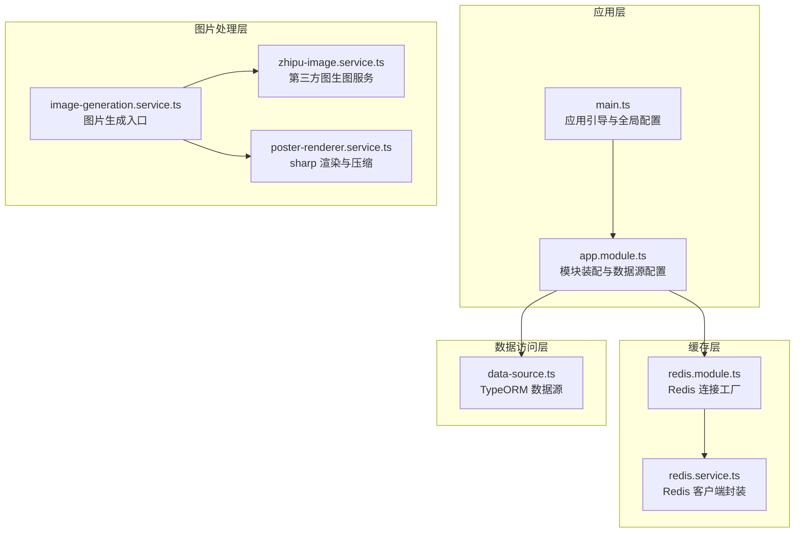
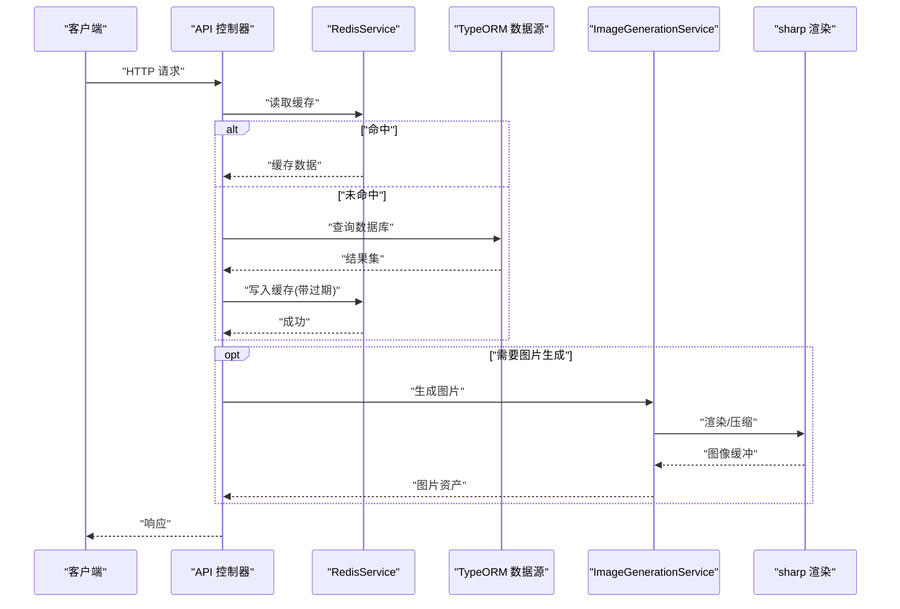
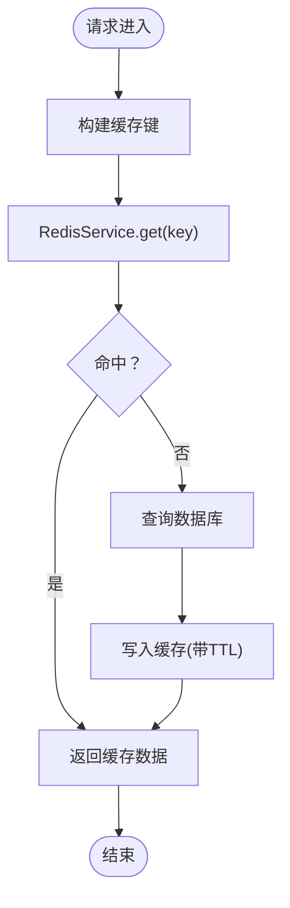
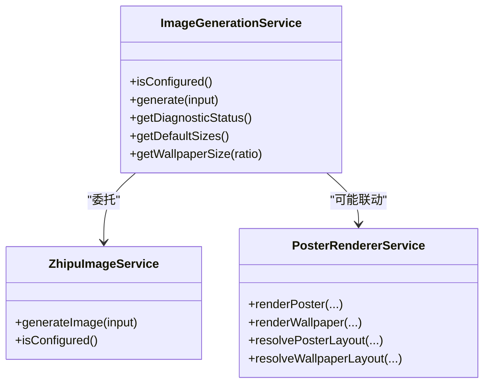
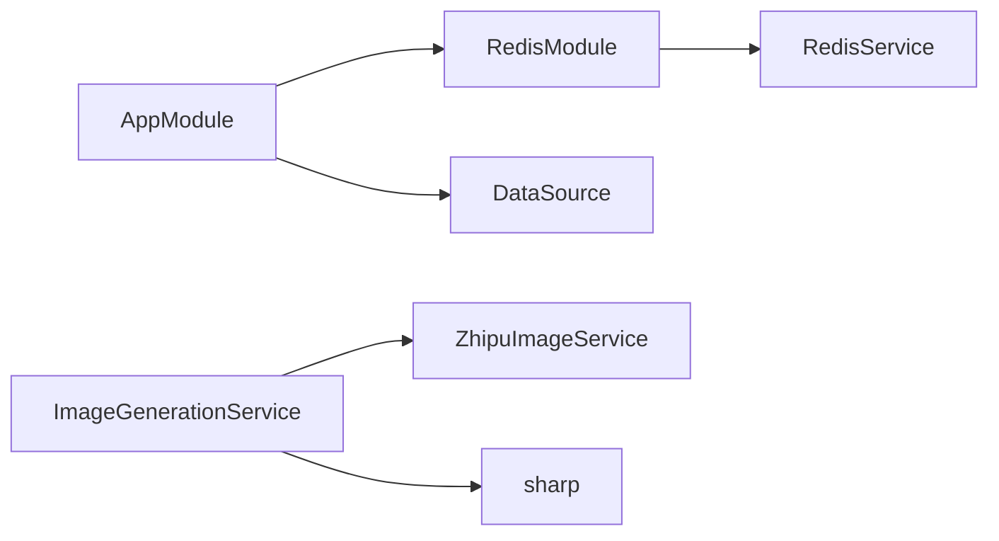

# 性能优化策略

<cite>
**本文引用的文件**
- [services/api/src/main.ts](file://services/api/src/main.ts)
- [services/api/src/app.module.ts](file://services/api/src/app.module.ts)
- [services/api/src/redis/redis.module.ts](file://services/api/src/redis/redis.module.ts)
- [services/api/src/redis/redis.service.ts](file://services/api/src/redis/redis.service.ts)
- [services/api/src/redis/redis.constants.ts](file://services/api/src/redis/redis.constants.ts)
- [services/api/src/common/image-generation.service.ts](file://services/api/src/common/image-generation.service.ts)
- [services/api/src/common/poster-renderer.service.ts](file://services/api/src/common/poster-renderer.service.ts)
- [services/api/src/common/zhipu-image.service.ts](file://services/api/src/common/zhipu-image.service.ts)
- [services/api/src/database/data-source.ts](file://services/api/src/database/data-source.ts)
- [services/api/src/common/production-config.validator.ts](file://services/api/src/common/production-config.validator.ts)
</cite>

## 目录
1. [简介](#简介)
2. [项目结构](#项目结构)
3. [核心组件](#核心组件)
4. [架构总览](#架构总览)
5. [详细组件分析](#详细组件分析)
6. [依赖关系分析](#依赖关系分析)
7. [性能考量与优化建议](#性能考量与优化建议)
8. [故障排查指南](#故障排查指南)
9. [结论](#结论)
10. [附录](#附录)

## 简介
本文件面向 Fortune Hub 的 API 层，系统化提出一套可落地的性能优化策略，覆盖缓存（Redis）、数据库（索引/连接池/批量）、图片处理（sharp/Zhipu 图生图）、限流（令牌桶/IP/用户级）、并发（异步/队列/资源池）以及监控（响应时间/吞吐量/错误率/资源使用）。文档在给出策略的同时，结合现有代码实现进行分析，并提供可视化图示与实操建议。

## 项目结构
后端采用 NestJS + TypeORM + MySQL 架构，Redis 作为缓存层；图片生成与渲染由 Zhipu 图生图服务与 sharp 组合完成；应用启动时统一注册全局拦截器、过滤器与 CORS 配置。

图表来源
- [services/api/src/main.ts:1-74](file://services/api/src/main.ts#L1-L74)
- [services/api/src/app.module.ts:1-145](file://services/api/src/app.module.ts#L1-L145)
- [services/api/src/redis/redis.module.ts:1-32](file://services/api/src/redis/redis.module.ts#L1-L32)
- [services/api/src/redis/redis.service.ts:1-125](file://services/api/src/redis/redis.service.ts#L1-L125)
- [services/api/src/database/data-source.ts:1-73](file://services/api/src/database/data-source.ts#L1-L73)
- [services/api/src/common/image-generation.service.ts:1-131](file://services/api/src/common/image-generation.service.ts#L1-L131)
- [services/api/src/common/poster-renderer.service.ts:1-800](file://services/api/src/common/poster-renderer.service.ts#L1-L800)

章节来源
- [services/api/src/main.ts:1-74](file://services/api/src/main.ts#L1-L74)
- [services/api/src/app.module.ts:1-145](file://services/api/src/app.module.ts#L1-L145)

## 核心组件
- 应用引导与中间件
  - 全局前缀、验证管道、拦截器、过滤器、CORS 配置均在引导阶段集中设置，便于统一治理与性能控制。
- 缓存层
  - RedisModule 提供连接工厂与重连策略；RedisService 封装 get/set/del/ping 等常用操作，并内置连接状态保障与超时等待机制。
- 数据访问层
  - TypeORM 数据源集中配置，实体列表明确，支持迁移与同步开关控制。
- 图片处理层
  - ImageGenerationService 聚合 Zhipu 图生图能力与尺寸策略；PosterRendererService 使用 sharp 进行渲染、缩放与压缩，内置模板缓存与 SVG 构建。
- 生产配置校验
  - 对生产环境的关键配置进行强约束，避免因配置不当导致的性能隐患。

章节来源
- [services/api/src/main.ts:1-74](file://services/api/src/main.ts#L1-L74)
- [services/api/src/redis/redis.module.ts:1-32](file://services/api/src/redis/redis.module.ts#L1-L32)
- [services/api/src/redis/redis.service.ts:1-125](file://services/api/src/redis/redis.service.ts#L1-L125)
- [services/api/src/database/data-source.ts:1-73](file://services/api/src/database/data-source.ts#L1-L73)
- [services/api/src/common/image-generation.service.ts:1-131](file://services/api/src/common/image-generation.service.ts#L1-L131)
- [services/api/src/common/poster-renderer.service.ts:1-800](file://services/api/src/common/poster-renderer.service.ts#L1-L800)
- [services/api/src/common/production-config.validator.ts:1-216](file://services/api/src/common/production-config.validator.ts#L1-L216)

## 架构总览
下图展示从请求进入至响应返回的关键路径，以及与缓存、数据库、图片处理的交互点。

图表来源
- [services/api/src/redis/redis.service.ts:79-124](file://services/api/src/redis/redis.service.ts#L79-L124)
- [services/api/src/database/data-source.ts:32-72](file://services/api/src/database/data-source.ts#L32-L72)
- [services/api/src/common/image-generation.service.ts:53-55](file://services/api/src/common/image-generation.service.ts#L53-L55)
- [services/api/src/common/poster-renderer.service.ts:256-321](file://services/api/src/common/poster-renderer.service.ts#L256-L321)

## 详细组件分析

### 缓存策略（Redis）
- 连接与可用性
  - RedisModule 使用延迟连接、最大重试次数、就绪检查与重连策略，降低异常对主流程的影响。
  - RedisService 在每次操作前确保连接处于 ready 状态，必要时等待或超时报错，保证幂等与稳定性。
- 键设计
  - 建议以“模块:业务维度:标识”命名，例如 user:profile:123、content:report:456，便于清理与定位。
  - 对热点数据增加业务维度前缀，避免键空间冲突。
- 过期策略
  - 常用接口（如首页、内容详情）设置中短 TTL（分钟级），列表页设置较短 TTL 并配合预热。
  - 对于低频更新数据（如配置项）设置较长 TTL，定期后台刷新。
- 缓存穿透防护
  - 未命中时写入空值或短 TTL 的占位，防止同一时间大量击穿数据库。
  - 对非法参数直接拒绝或返回兜底数据，减少无效查询。
- 命中/未命中统计
  - 在 RedisService 上增加计数器，记录 get/set/del 成功与失败次数，用于后续告警与容量规划。

图表来源
- [services/api/src/redis/redis.service.ts:79-124](file://services/api/src/redis/redis.service.ts#L79-L124)

章节来源
- [services/api/src/redis/redis.module.ts:1-32](file://services/api/src/redis/redis.module.ts#L1-L32)
- [services/api/src/redis/redis.service.ts:1-125](file://services/api/src/redis/redis.service.ts#L1-L125)
- [services/api/src/redis/redis.constants.ts:1-2](file://services/api/src/redis/redis.constants.ts#L1-L2)

### 数据库优化（索引/查询/连接池/批量）
- 索引设计
  - 唯一索引：用户标识、订单号、分享记录唯一键。
  - 复合索引：常用于分页与筛选的组合字段（如创建时间+状态、用户ID+类型）。
  - 前缀索引：对长文本字段（摘要、描述）建立前缀索引，平衡存储与查询。
- 查询优化
  - 使用投影只取必要字段，避免 SELECT *。
  - 分页使用“基于游标”的方式，减少 deep pagination 的偏移成本。
  - 批量查询使用 IN 列表，限制单次 IN 数量，避免超大 SQL。
- 连接池配置
  - TypeORM 默认连接池适配大多数场景；在高并发下可考虑调整 poolSize、maxWaitingRequests、acquireTimeoutMillis 等参数（需结合压测结果）。
- 批量操作
  - 写入：使用事务 + 批量 INSERT/UPDATE，减少往返。
  - 删除：分批删除，避免长事务锁表。
  - 导出：使用流式输出，避免一次性加载到内存。

章节来源
- [services/api/src/database/data-source.ts:1-73](file://services/api/src/database/data-source.ts#L1-L73)
- [services/api/src/app.module.ts:67-117](file://services/api/src/app.module.ts#L67-L117)

### 图片处理优化（sharp/Zhipu）
- Zhipu 图生图
  - ImageGenerationService 聚合模型、尺寸、超时等配置，提供诊断状态接口，便于运维观测。
  - 建议对高频请求进行本地缓存（Redis），命中则直接返回缓存结果，降低第三方调用频率。
- sharp 渲染与压缩
  - PosterRendererService 使用 sharp 进行 resize、composite、JPEG/WebP 输出，已开启高质量参数。
  - 建议：
    - 模板缓存：已内置 zodiac 模板缓存 Map，可扩展到其他模板。
    - 按需裁剪：根据目标设备 DPR 与屏幕宽度选择合适分辨率，避免过度渲染。
    - CDN 加速：将最终生成的图片通过 CDN 分发，缩短边缘节点距离。
    - 懒加载策略：前端对非首屏图片采用懒加载，减少初始带宽压力。

图表来源
- [services/api/src/common/image-generation.service.ts:42-131](file://services/api/src/common/image-generation.service.ts#L42-L131)
- [services/api/src/common/poster-renderer.service.ts:174-321](file://services/api/src/common/poster-renderer.service.ts#L174-L321)

章节来源
- [services/api/src/common/image-generation.service.ts:1-131](file://services/api/src/common/image-generation.service.ts#L1-L131)
- [services/api/src/common/poster-renderer.service.ts:1-800](file://services/api/src/common/poster-renderer.service.ts#L1-L800)

### API 限流（令牌桶/IP/用户级）
- 设计思路
  - 令牌桶：固定速率发放令牌，突发窗口限制，适合应对短时尖峰。
  - IP 级限流：针对来源 IP 的总体请求速率限制，阻断恶意扫描。
  - 用户级限流：登录态用户单独令牌桶，保障正常用户体验。
- 实现要点
  - 使用 Redis 记录每个维度的令牌桶状态（桶容量、剩余令牌、最后发放时间）。
  - 在全局拦截器中统一判断，快速失败返回 429。
  - 对白名单（内部服务/监控/健康检查）放行或放宽阈值。
- 参数建议
  - IP：每分钟 600 次
  - 用户：每分钟 300 次
  - 登录接口：每分钟 30 次
  - 图片生成：每分钟 10 次（可结合缓存）

章节来源
- [services/api/src/redis/redis.service.ts:79-124](file://services/api/src/redis/redis.service.ts#L79-L124)

### 并发处理优化（异步/队列/资源池）
- 异步任务
  - 图片生成、报表导出、推送通知等 IO 密集型任务放入队列异步执行，避免阻塞请求线程。
- 队列处理
  - 使用消息队列（如 Redis Streams/RabbitMQ/Kafka）承载任务，支持重试与死信。
  - 对高优先级任务（实时反馈）与低优先级任务（离线报表）分区处理。
- 资源池管理
  - sharp 渲染与第三方图生图接口应限制并发度，避免 CPU/IO 抖动。
  - 连接池（MySQL/Redis）按 CPU 核数与实例规格调优，避免过度竞争。

章节来源
- [services/api/src/common/poster-renderer.service.ts:337-341](file://services/api/src/common/poster-renderer.service.ts#L337-L341)
- [services/api/src/common/image-generation.service.ts:53-55](file://services/api/src/common/image-generation.service.ts#L53-L55)

### 监控指标（响应时间/吞吐量/错误率/资源使用）
- 指标定义
  - 响应时间：P50/P95/P99 分位；慢请求追踪 ID。
  - 吞吐量：QPS（每秒请求数）与并发数。
  - 错误率：HTTP 5xx/4xx 比例与错误分类。
  - 资源使用：CPU/内存/磁盘/网络；数据库连接池占用；Redis 连接数。
- 采集与上报
  - 在全局拦截器中埋点，记录开始/结束时间、状态码、路由、用户 ID、耗时。
  - 使用 Prometheus/Grafana 或云监控平台聚合指标，设置阈值告警。
- 优化闭环
  - 基于指标定位瓶颈（缓存未命中、慢查询、IO 等），迭代优化并回归验证。

章节来源
- [services/api/src/main.ts:35-43](file://services/api/src/main.ts#L35-L43)

## 依赖关系分析
- 模块耦合
  - AppModule 统一装配 Redis、数据库与各业务模块，保持低耦合高内聚。
  - RedisService 通过注入符号 REDIS 与 RedisModule 解耦，便于替换实现。
- 外部依赖
  - Redis/ioredis：连接与命令封装。
  - TypeORM/MySQL：持久化与迁移。
  - sharp：图片渲染与压缩。
  - Zhipu 图生图：外部能力接入。

图表来源
- [services/api/src/app.module.ts:61-141](file://services/api/src/app.module.ts#L61-L141)
- [services/api/src/redis/redis.module.ts:7-31](file://services/api/src/redis/redis.module.ts#L7-L31)
- [services/api/src/common/image-generation.service.ts:44-47](file://services/api/src/common/image-generation.service.ts#L44-L47)

章节来源
- [services/api/src/app.module.ts:1-145](file://services/api/src/app.module.ts#L1-L145)
- [services/api/src/redis/redis.module.ts:1-32](file://services/api/src/redis/redis.module.ts#L1-L32)

## 性能考量与优化建议

### 缓存策略
- 键设计与过期
  - 命名规范：模块:业务:标识，TTL 明确分级。
  - 热点数据：短 TTL + 预热；冷数据：长 TTL + 定期刷新。
- 穿透防护
  - 未命中写入空值占位，限制同 key 并发重建。
- 命中率提升
  - 对高频 GET 接口统一走缓存；对写后读场景采用写后失效策略。

### 数据库优化
- 索引与查询
  - 为分页/筛选/关联字段建立复合索引；避免全表扫描。
  - 使用投影与游标分页，减少排序成本。
- 连接池与批量
  - 结合压测调整 poolSize 与超时；批量写入使用事务。
- 迁移与同步
  - 生产禁用自动同步，统一迁移发布。

### 图片处理优化
- sharp 与 CDN
  - 模板缓存 + CDN 分发；按设备选择分辨率。
- 第三方图生图
  - 本地缓存 + 降级策略；超时与重试配置合理化。

### 限流与并发
- 令牌桶 + 多维限流（IP/用户/接口）。
- 异步队列 + 资源池上限，避免雪崩。

### 监控与回归
- 全链路埋点 + 分位指标 + 告警阈值。
- 建立优化前后对比基线，持续迭代。

## 故障排查指南
- Redis 连接问题
  - 现象：ping 失败、set/get 抛错。
  - 处理：检查连接状态、重连策略、超时时间；查看日志警告。
- 数据库连接池耗尽
  - 现象：SQL 超时、连接排队。
  - 处理：增大 poolSize、优化慢查询、减少长事务。
- 图片生成失败
  - 现象：sharp 渲染异常、第三方接口超时。
  - 处理：检查输入尺寸/模板、CDN 回源、第三方密钥与配额。
- 生产配置不合规
  - 现象：启动即报错。
  - 处理：核对 HTTPS 基础地址、CORS 来源、微信/支付配置。

章节来源
- [services/api/src/redis/redis.service.ts:68-77](file://services/api/src/redis/redis.service.ts#L68-L77)
- [services/api/src/common/production-config.validator.ts:25-104](file://services/api/src/common/production-config.validator.ts#L25-L104)

## 结论
通过在缓存、数据库、图片处理、限流、并发与监控六个维度协同优化，可显著提升 Fortune Hub API 的稳定性与吞吐能力。建议以 Redis 缓存与索引优化为切入点，配合限流与异步化改造，逐步完善监控体系，形成持续优化的闭环。

## 附录
- 关键实现参考路径
  - 应用引导与全局配置：[services/api/src/main.ts:1-74](file://services/api/src/main.ts#L1-L74)
  - 模块装配与数据源：[services/api/src/app.module.ts:67-117](file://services/api/src/app.module.ts#L67-L117)
  - Redis 连接与封装：[services/api/src/redis/redis.module.ts:13-25](file://services/api/src/redis/redis.module.ts#L13-L25)、[services/api/src/redis/redis.service.ts:12-66](file://services/api/src/redis/redis.service.ts#L12-L66)
  - 数据源配置：[services/api/src/database/data-source.ts:32-72](file://services/api/src/database/data-source.ts#L32-L72)
  - 图片生成与渲染：[services/api/src/common/image-generation.service.ts:53-55](file://services/api/src/common/image-generation.service.ts#L53-L55)、[services/api/src/common/poster-renderer.service.ts:256-321](file://services/api/src/common/poster-renderer.service.ts#L256-L321)
  - 生产配置校验：[services/api/src/common/production-config.validator.ts:25-104](file://services/api/src/common/production-config.validator.ts#L25-L104)