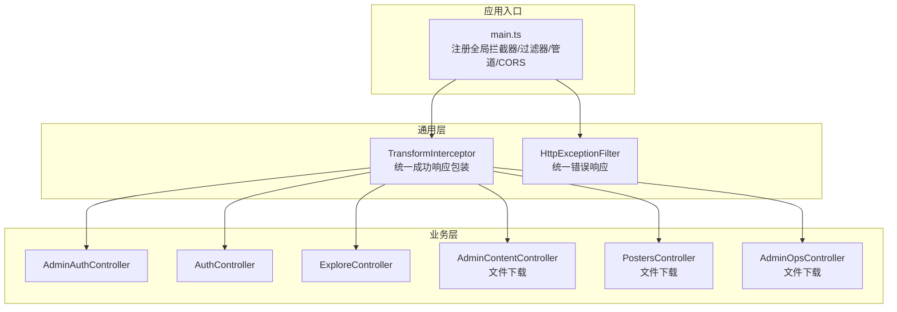
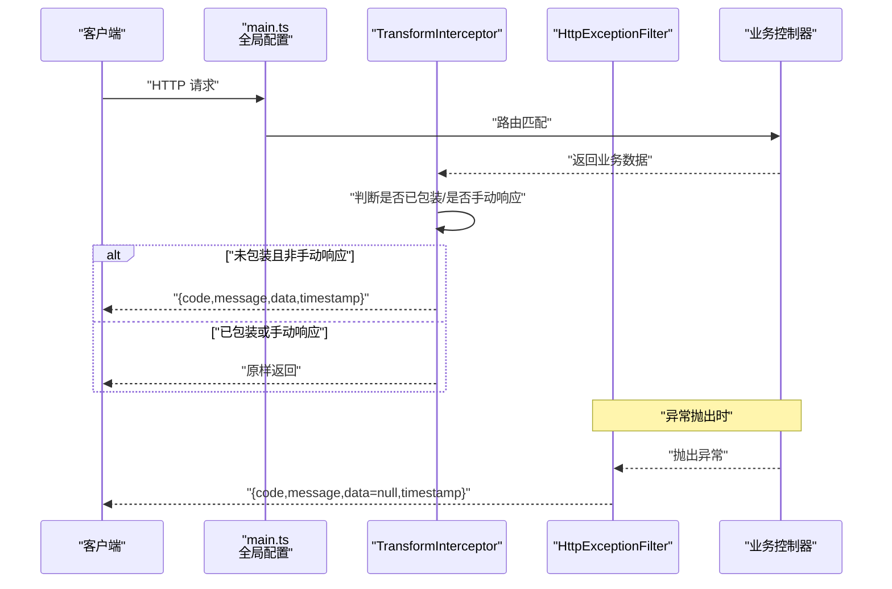
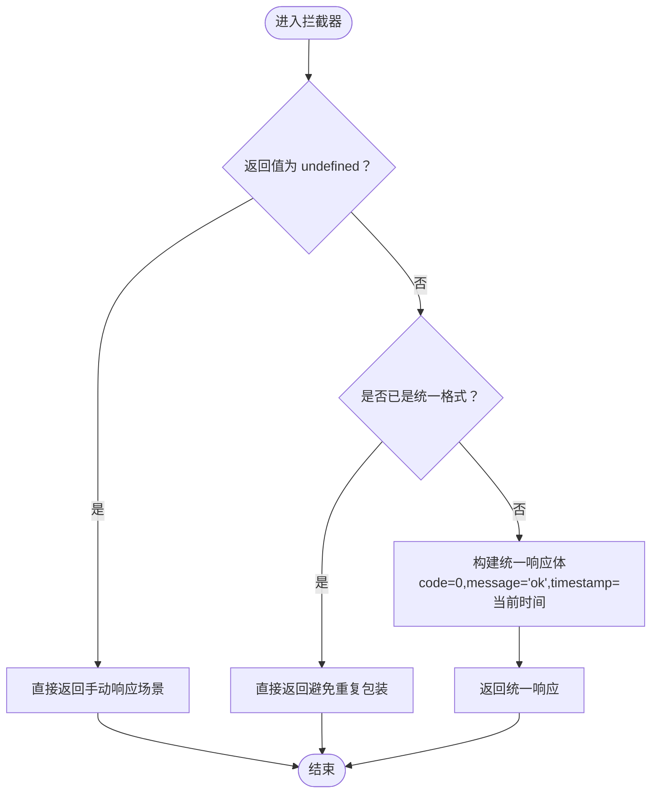
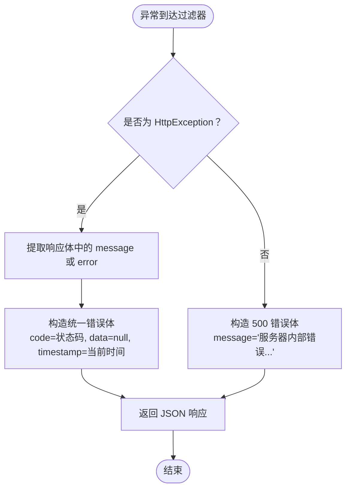
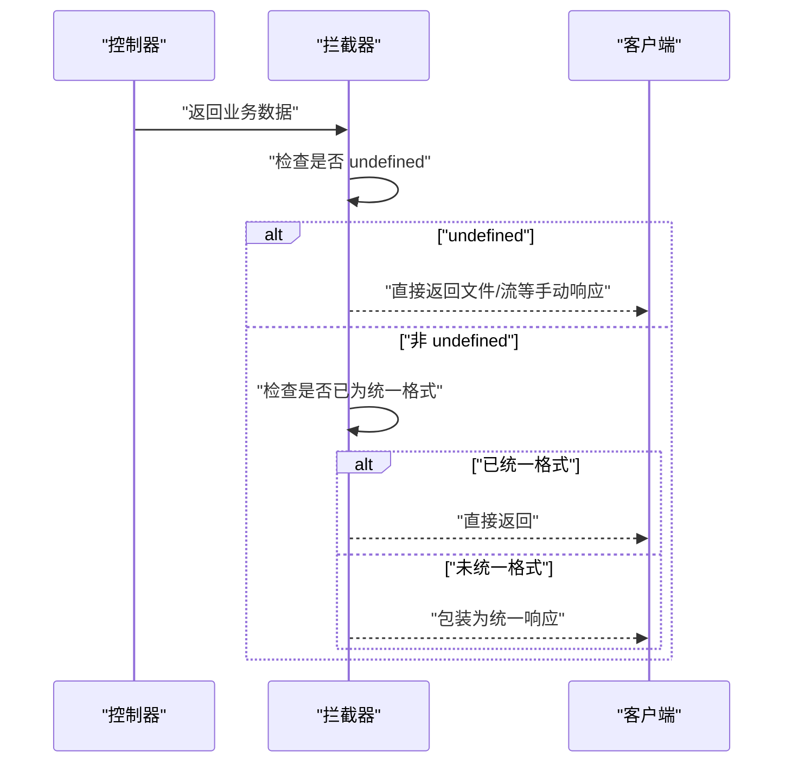
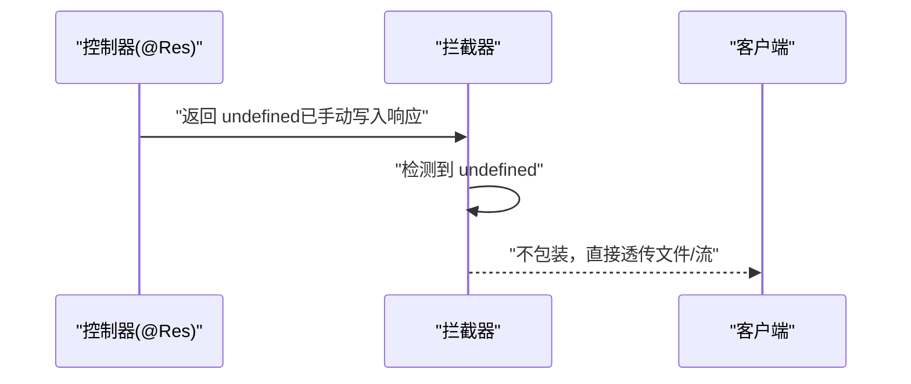
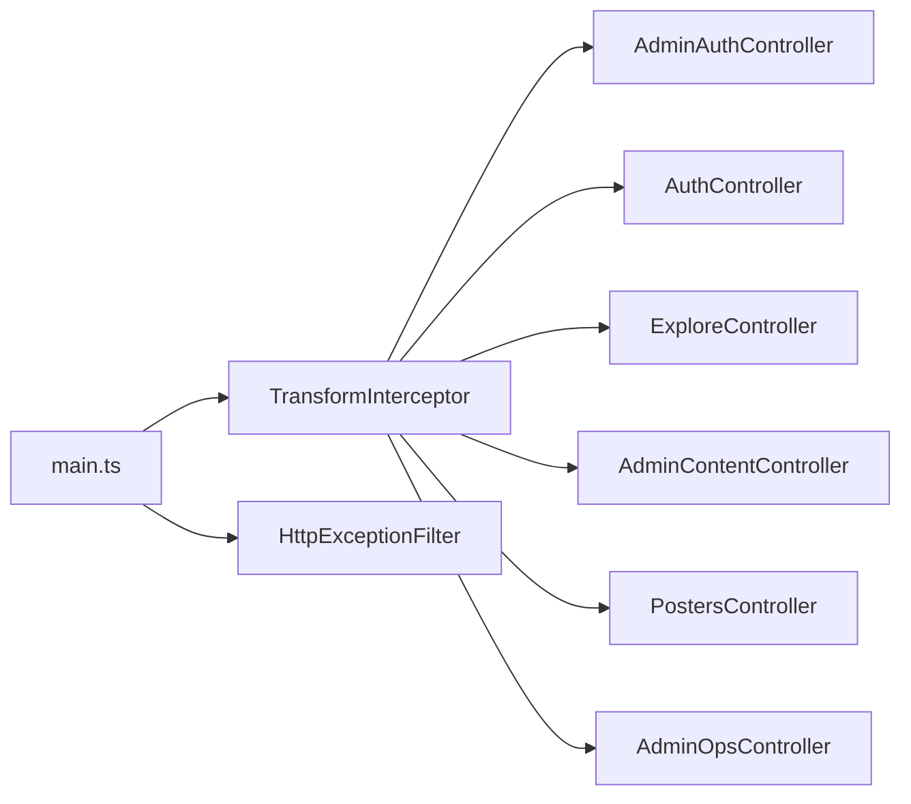

# 请求响应格式

<cite>
**本文引用的文件**
- [services/api/src/common/interceptors/transform.interceptor.ts](file://services/api/src/common/interceptors/transform.interceptor.ts)
- [services/api/src/common/filters/http-exception.filter.ts](file://services/api/src/common/filters/http-exception.filter.ts)
- [services/api/src/main.ts](file://services/api/src/main.ts)
- [services/api/src/admin-auth/admin-auth.controller.ts](file://services/api/src/admin-auth/admin-auth.controller.ts)
- [services/api/src/auth/auth.controller.ts](file://services/api/src/auth/auth.controller.ts)
- [services/api/src/explore/explore.controller.ts](file://services/api/src/explore/explore.controller.ts)
- [services/api/src/admin-content/admin-content.controller.ts](file://services/api/src/admin-content/admin-content.controller.ts)
- [services/api/src/posters/posters.controller.ts](file://services/api/src/posters/posters.controller.ts)
- [services/api/src/admin-ops/admin-ops.controller.ts](file://services/api/src/admin-ops/admin-ops.controller.ts)
</cite>

## 目录
1. [引言](#引言)
2. [项目结构](#项目结构)
3. [核心组件](#核心组件)
4. [架构总览](#架构总览)
5. [详细组件分析](#详细组件分析)
6. [依赖关系分析](#依赖关系分析)
7. [性能考量](#性能考量)
8. [故障排查指南](#故障排查指南)
9. [结论](#结论)
10. [附录](#附录)

## 引言
本规范文档面向 Fortune Hub 的后端与前端协作，统一定义请求与响应的数据结构与处理流程，确保所有接口返回一致、可预期且易于消费。内容涵盖：
- 成功响应的标准格式：code、message、data、timestamp
- 错误响应的统一处理：异常捕获、错误码映射、错误信息标准化
- TransformInterceptor 的工作机制：自动包装响应、避免重复包装
- 分页响应格式：total、page、pageSize、list
- 特殊场景：文件下载、流式响应等
- 结合实际代码示例路径，帮助快速定位实现位置

## 项目结构
后端采用 NestJS 架构，全局注册拦截器与过滤器，统一处理响应与异常；控制器直接返回业务对象，由拦截器自动包装为统一格式。

**图表来源**
- [services/api/src/main.ts:32-43](file://services/api/src/main.ts#L32-L43)
- [services/api/src/common/interceptors/transform.interceptor.ts:17-46](file://services/api/src/common/interceptors/transform.interceptor.ts#L17-L46)
- [services/api/src/common/filters/http-exception.filter.ts:18-40](file://services/api/src/common/filters/http-exception.filter.ts#L18-L40)

**章节来源**
- [services/api/src/main.ts:32-43](file://services/api/src/main.ts#L32-L43)

## 核心组件
- 统一成功响应体（TransformInterceptor）
  - 字段：code、message、data、timestamp
  - 自动包装：对控制器返回值进行包裹；当使用 @Res() 手动响应或已为统一格式时跳过包装
- 统一错误响应体（HttpExceptionFilter）
  - 字段：code、message、data=null、timestamp
  - 映射：基于 HttpException 状态码；非 HttpException 默认 500
  - 日志：5xx 错误记录堆栈
- 全局配置（main.ts）
  - 设置全局前缀、CORS、验证管道、拦截器与过滤器

**章节来源**
- [services/api/src/common/interceptors/transform.interceptor.ts:10-15](file://services/api/src/common/interceptors/transform.interceptor.ts#L10-L15)
- [services/api/src/common/interceptors/transform.interceptor.ts:21-46](file://services/api/src/common/interceptors/transform.interceptor.ts#L21-L46)
- [services/api/src/common/interceptors/transform.interceptor.ts:48-57](file://services/api/src/common/interceptors/transform.interceptor.ts#L48-L57)
- [services/api/src/common/filters/http-exception.filter.ts:11-16](file://services/api/src/common/filters/http-exception.filter.ts#L11-L16)
- [services/api/src/common/filters/http-exception.filter.ts:22-40](file://services/api/src/common/filters/http-exception.filter.ts#L22-L40)
- [services/api/src/common/filters/http-exception.filter.ts:42-63](file://services/api/src/common/filters/http-exception.filter.ts#L42-L63)
- [services/api/src/common/filters/http-exception.filter.ts:65-90](file://services/api/src/common/filters/http-exception.filter.ts#L65-L90)
- [services/api/src/main.ts:32-43](file://services/api/src/main.ts#L32-L43)

## 架构总览
下图展示了从控制器到客户端的完整响应链路，以及错误处理路径。

**图表来源**
- [services/api/src/main.ts:32-43](file://services/api/src/main.ts#L32-L43)
- [services/api/src/common/interceptors/transform.interceptor.ts:21-46](file://services/api/src/common/interceptors/transform.interceptor.ts#L21-L46)
- [services/api/src/common/filters/http-exception.filter.ts:22-40](file://services/api/src/common/filters/http-exception.filter.ts#L22-L40)

## 详细组件分析

### 统一成功响应格式
- 结构字段
  - code: number；成功时固定为 0
  - message: string；默认“ok”
  - data: any；业务数据主体
  - timestamp: string；ISO 时间字符串
- 包装时机
  - 控制器返回值将被拦截器包裹
  - 若控制器显式使用 @Res() 手动响应，拦截器不会二次包装
  - 若返回值本身已是统一格式，拦截器会识别并跳过包装
- 示例路径
  - [services/api/src/admin-auth/admin-auth.controller.ts:20-27](file://services/api/src/admin-auth/admin-auth.controller.ts#L20-L27)
  - [services/api/src/admin-auth/admin-auth.controller.ts:35-42](file://services/api/src/admin-auth/admin-auth.controller.ts#L35-L42)
  - [services/api/src/auth/auth.controller.ts:12-15](file://services/api/src/auth/auth.controller.ts#L12-L15)
  - [services/api/src/explore/explore.controller.ts:12-16](file://services/api/src/explore/explore.controller.ts#L12-L16)

**图表来源**
- [services/api/src/common/interceptors/transform.interceptor.ts:21-46](file://services/api/src/common/interceptors/transform.interceptor.ts#L21-L46)
- [services/api/src/common/interceptors/transform.interceptor.ts:48-57](file://services/api/src/common/interceptors/transform.interceptor.ts#L48-L57)

**章节来源**
- [services/api/src/common/interceptors/transform.interceptor.ts:10-15](file://services/api/src/common/interceptors/transform.interceptor.ts#L10-L15)
- [services/api/src/common/interceptors/transform.interceptor.ts:21-46](file://services/api/src/common/interceptors/transform.interceptor.ts#L21-L46)
- [services/api/src/common/interceptors/transform.interceptor.ts:48-57](file://services/api/src/common/interceptors/transform.interceptor.ts#L48-L57)

### 统一错误响应格式
- 结构字段
  - code: number；HTTP 状态码或 500
  - message: string；错误信息
  - data: null
  - timestamp: string；ISO 时间字符串
- 映射规则
  - HttpException：使用其状态码与响应体中的 message/error
  - 非 HttpException：默认 500，message 为“服务器内部错误，请稍后再试”
- 日志策略
  - 5xx 错误记录堆栈信息，便于排查
- 示例路径
  - [services/api/src/common/filters/http-exception.filter.ts:42-63](file://services/api/src/common/filters/http-exception.filter.ts#L42-L63)
  - [services/api/src/common/filters/http-exception.filter.ts:65-90](file://services/api/src/common/filters/http-exception.filter.ts#L65-L90)

**图表来源**
- [services/api/src/common/filters/http-exception.filter.ts:22-40](file://services/api/src/common/filters/http-exception.filter.ts#L22-L40)
- [services/api/src/common/filters/http-exception.filter.ts:42-63](file://services/api/src/common/filters/http-exception.filter.ts#L42-L63)
- [services/api/src/common/filters/http-exception.filter.ts:65-90](file://services/api/src/common/filters/http-exception.filter.ts#L65-L90)

**章节来源**
- [services/api/src/common/filters/http-exception.filter.ts:11-16](file://services/api/src/common/filters/http-exception.filter.ts#L11-L16)
- [services/api/src/common/filters/http-exception.filter.ts:22-40](file://services/api/src/common/filters/http-exception.filter.ts#L22-L40)
- [services/api/src/common/filters/http-exception.filter.ts:42-63](file://services/api/src/common/filters/http-exception.filter.ts#L42-L63)
- [services/api/src/common/filters/http-exception.filter.ts:65-90](file://services/api/src/common/filters/http-exception.filter.ts#L65-L90)

### TransformInterceptor 工作机制
- 跳过条件
  - 返回值为 undefined（典型于 @Res() 手动响应）
  - 返回值已是统一格式（含 code/message/data/timestamp）
- 包装行为
  - 将业务数据封装为统一响应体，并设置默认 message 与 timestamp
- 与 @Res() 的兼容性
  - 当控制器使用 @Res() 发送文件或流时，拦截器不进行二次包装，保证响应体类型正确

**图表来源**
- [services/api/src/common/interceptors/transform.interceptor.ts:21-46](file://services/api/src/common/interceptors/transform.interceptor.ts#L21-L46)
- [services/api/src/common/interceptors/transform.interceptor.ts:48-57](file://services/api/src/common/interceptors/transform.interceptor.ts#L48-L57)

**章节来源**
- [services/api/src/common/interceptors/transform.interceptor.ts:21-46](file://services/api/src/common/interceptors/transform.interceptor.ts#L21-L46)
- [services/api/src/common/interceptors/transform.interceptor.ts:48-57](file://services/api/src/common/interceptors/transform.interceptor.ts#L48-L57)

### 分页响应格式
- 统一结构
  - total: number；总数
  - page: number；当前页码
  - pageSize: number；每页条数
  - list: any[]；列表数据
- 使用建议
  - 列表查询接口优先采用该结构，便于前端统一分页处理
  - 后端服务在拦截器之外返回该结构即可，拦截器不会对分页结构做额外包装
- 示例路径
  - [services/api/src/admin-auth/admin-auth.controller.ts:20-27](file://services/api/src/admin-auth/admin-auth.controller.ts#L20-L27)
  - [services/api/src/admin-auth/admin-auth.controller.ts:35-42](file://services/api/src/admin-auth/admin-auth.controller.ts#L35-L42)

**章节来源**
- [services/api/src/admin-auth/admin-auth.controller.ts:20-27](file://services/api/src/admin-auth/admin-auth.controller.ts#L20-L27)
- [services/api/src/admin-auth/admin-auth.controller.ts:35-42](file://services/api/src/admin-auth/admin-auth.controller.ts#L35-L42)

### 特殊场景：文件下载与流式响应
- 处理方式
  - 控制器使用 @Res() 手动发送响应（如文件流、二进制流）
  - 拦截器检测到返回值为 undefined 时，不进行统一包装，直接透传
- 典型场景
  - 管理后台内容文件下载
  - 海报生成后的图片下载
  - 运营导出数据的流式响应
- 示例路径
  - [services/api/src/admin-content/admin-content.controller.ts:316-325](file://services/api/src/admin-content/admin-content.controller.ts#L316-L325)
  - [services/api/src/posters/posters.controller.ts:45-55](file://services/api/src/posters/posters.controller.ts#L45-L55)
  - [services/api/src/admin-ops/admin-ops.controller.ts:31-40](file://services/api/src/admin-ops/admin-ops.controller.ts#L31-L40)

**图表来源**
- [services/api/src/common/interceptors/transform.interceptor.ts:21-32](file://services/api/src/common/interceptors/transform.interceptor.ts#L21-L32)
- [services/api/src/admin-content/admin-content.controller.ts:316-325](file://services/api/src/admin-content/admin-content.controller.ts#L316-L325)
- [services/api/src/posters/posters.controller.ts:45-55](file://services/api/src/posters/posters.controller.ts#L45-L55)
- [services/api/src/admin-ops/admin-ops.controller.ts:31-40](file://services/api/src/admin-ops/admin-ops.controller.ts#L31-L40)

**章节来源**
- [services/api/src/common/interceptors/transform.interceptor.ts:21-32](file://services/api/src/common/interceptors/transform.interceptor.ts#L21-L32)
- [services/api/src/admin-content/admin-content.controller.ts:316-325](file://services/api/src/admin-content/admin-content.controller.ts#L316-L325)
- [services/api/src/posters/posters.controller.ts:45-55](file://services/api/src/posters/posters.controller.ts#L45-L55)
- [services/api/src/admin-ops/admin-ops.controller.ts:31-40](file://services/api/src/admin-ops/admin-ops.controller.ts#L31-L40)

## 依赖关系分析
- 全局注册
  - main.ts 中注册 TransformInterceptor 与 HttpExceptionFilter，作用于所有路由
- 控制器职责
  - 控制器仅关注业务返回，无需关心统一格式细节
- 拦截器与过滤器的边界
  - 拦截器负责成功响应包装与去重
  - 过滤器负责异常响应与日志

**图表来源**
- [services/api/src/main.ts:32-43](file://services/api/src/main.ts#L32-L43)
- [services/api/src/common/interceptors/transform.interceptor.ts:17-46](file://services/api/src/common/interceptors/transform.interceptor.ts#L17-L46)
- [services/api/src/common/filters/http-exception.filter.ts:18-40](file://services/api/src/common/filters/http-exception.filter.ts#L18-L40)

**章节来源**
- [services/api/src/main.ts:32-43](file://services/api/src/main.ts#L32-L43)

## 性能考量
- 拦截器开销
  - 仅在成功路径执行 map 操作，成本极低
- 避免重复包装
  - 通过 isAlreadyWrapped 快速判断，减少不必要的对象复制
- 手动响应优化
  - 对 @Res() 返回值直接透传，避免序列化与二次包装带来的额外开销

## 故障排查指南
- 常见问题
  - 控制器已返回统一格式，但前端仍收到嵌套的统一响应
    - 检查是否遗漏了 @Res() 导致返回值为 undefined
    - 确认拦截器的 isAlreadyWrapped 判断逻辑
  - 500 错误未记录堆栈
    - 检查是否自定义了异常处理，导致过滤器未生效
- 定位方法
  - 查看 main.ts 中全局过滤器与拦截器的注册顺序
  - 在 HttpExceptionFilter 的 catch 中确认异常类型与状态码映射
- 参考路径
  - [services/api/src/main.ts:32-43](file://services/api/src/main.ts#L32-L43)
  - [services/api/src/common/filters/http-exception.filter.ts:22-40](file://services/api/src/common/filters/http-exception.filter.ts#L22-L40)
  - [services/api/src/common/interceptors/transform.interceptor.ts:48-57](file://services/api/src/common/interceptors/transform.interceptor.ts#L48-L57)

**章节来源**
- [services/api/src/main.ts:32-43](file://services/api/src/main.ts#L32-L43)
- [services/api/src/common/filters/http-exception.filter.ts:22-40](file://services/api/src/common/filters/http-exception.filter.ts#L22-L40)
- [services/api/src/common/interceptors/transform.interceptor.ts:48-57](file://services/api/src/common/interceptors/transform.interceptor.ts#L48-L57)

## 结论
通过 TransformInterceptor 与 HttpExceptionFilter 的协同，Fortune Hub 实现了前后端一致的请求响应格式与错误处理体验。开发者只需专注于业务返回，其余由框架统一处理。对于文件下载与流式响应等特殊场景，拦截器提供了安全的透传保障。建议在新增接口时遵循本文规范，确保系统一致性与可维护性。

## 附录
- 统一成功响应体字段
  - code: number；成功时为 0
  - message: string；默认“ok”
  - data: any；业务数据主体
  - timestamp: string；ISO 时间字符串
- 统一错误响应体字段
  - code: number；HTTP 状态码或 500
  - message: string；错误信息
  - data: null
  - timestamp: string；ISO 时间字符串
- 分页响应体字段
  - total: number；总数
  - page: number；当前页码
  - pageSize: number；每页条数
  - list: any[]；列表数据