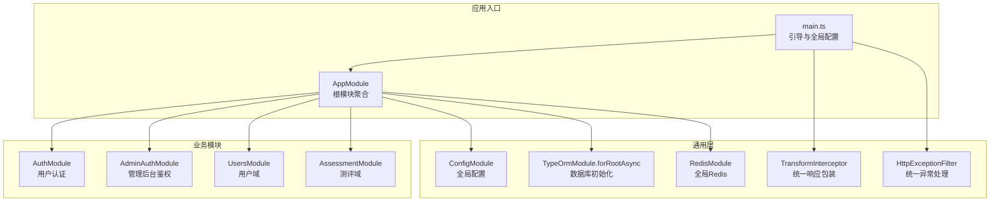
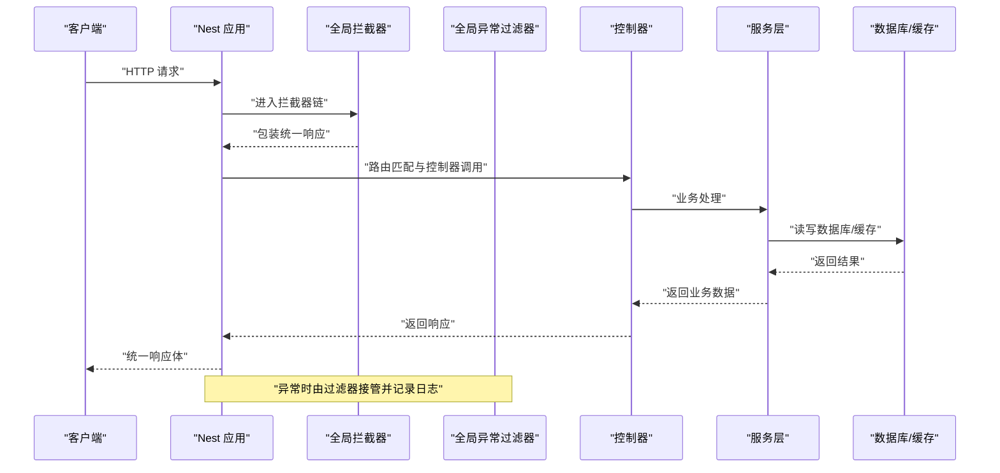
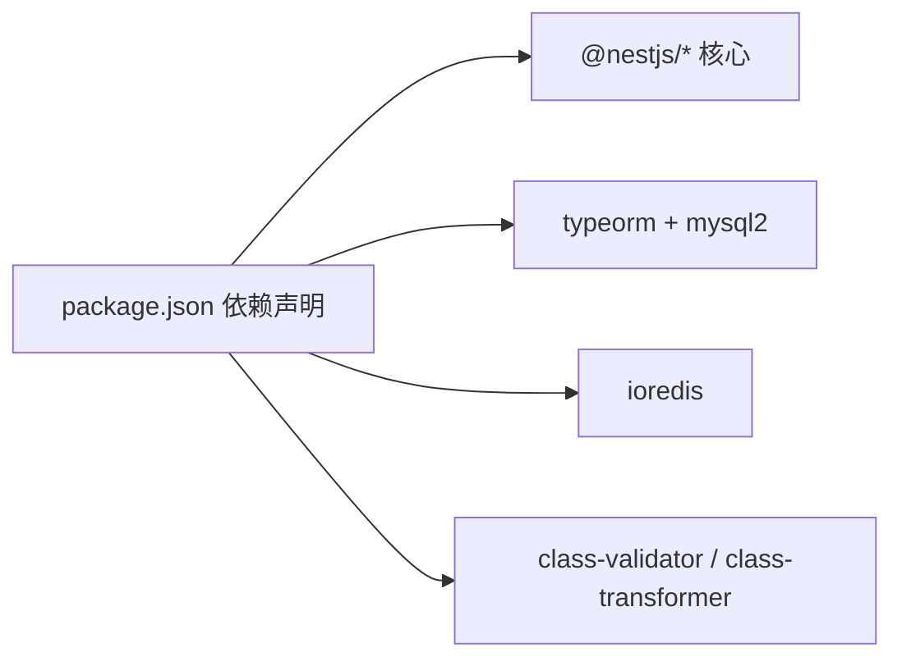
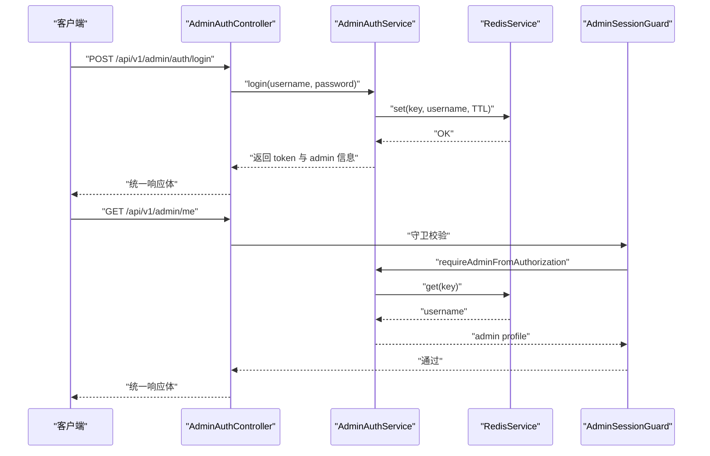

# NestJS 框架架构

<cite>
**本文引用的文件**   
- [services/api/src/app.module.ts](file://services/api/src/app.module.ts)
- [services/api/src/main.ts](file://services/api/src/main.ts)
- [services/api/src/admin-auth/admin-auth.module.ts](file://services/api/src/admin-auth/admin-auth.module.ts)
- [services/api/src/admin-auth/admin-auth.controller.ts](file://services/api/src/admin-auth/admin-auth.controller.ts)
- [services/api/src/admin-auth/admin-auth.service.ts](file://services/api/src/admin-auth/admin-auth.service.ts)
- [services/api/src/auth/auth.controller.ts](file://services/api/src/auth/auth.controller.ts)
- [services/api/src/common/interceptors/transform.interceptor.ts](file://services/api/src/common/interceptors/transform.interceptor.ts)
- [services/api/src/common/filters/http-exception.filter.ts](file://services/api/src/common/filters/http-exception.filter.ts)
- [services/api/src/common/common.module.ts](file://services/api/src/common/common.module.ts)
- [services/api/src/redis/redis.module.ts](file://services/api/src/redis/redis.module.ts)
- [services/api/src/database/data-source.ts](file://services/api/src/database/data-source.ts)
- [services/api/src/users/users.service.ts](file://services/api/src/users/users.service.ts)
- [services/api/src/assessment/assessment.service.ts](file://services/api/src/assessment/assessment.service.ts)
- [services/api/src/common/production-config.validator.ts](file://services/api/src/common/production-config.validator.ts)
- [services/api/package.json](file://services/api/package.json)
</cite>

## 目录
1. [引言](#引言)
2. [项目结构](#项目结构)
3. [核心组件](#核心组件)
4. [架构总览](#架构总览)
5. [详细组件分析](#详细组件分析)
6. [依赖分析](#依赖分析)
7. [性能考虑](#性能考虑)
8. [故障排查指南](#故障排查指南)
9. [结论](#结论)
10. [附录](#附录)

## 引言
本文件面向企业级应用，系统性解析该 NestJS 后端服务的架构设计与实现要点，覆盖模块化理念、控制器设计、服务层职责、中间件/拦截器/过滤器的执行顺序与场景、TypeORM 集成、Redis 缓存策略、配置管理与生产校验、错误处理与日志记录、以及性能优化建议。文档以代码为依据，辅以图示帮助读者快速理解模块关系与数据流。

## 项目结构
后端服务位于 services/api，采用多模块分层组织：根模块聚合各业务模块；通用能力通过公共模块与全局配置注入；TypeORM 管理数据库；Redis 提供缓存与会话存储；全局拦截器与过滤器统一响应与异常处理；生产环境通过配置校验保障安全。

图表来源
- [services/api/src/main.ts:1-74](file://services/api/src/main.ts#L1-L74)
- [services/api/src/app.module.ts:1-145](file://services/api/src/app.module.ts#L1-L145)

章节来源
- [services/api/src/app.module.ts:1-145](file://services/api/src/app.module.ts#L1-L145)
- [services/api/src/main.ts:1-74](file://services/api/src/main.ts#L1-L74)

## 核心组件
- 根模块与全局配置
  - 根模块集中导入配置、数据库、Redis 与所有业务模块，并注册全局过滤器、拦截器与验证管道。
  - 全局前缀设置为 api/v1，统一跨域策略，支持本地开发与生产环境差异。
- 中间件/拦截器/过滤器
  - 全局拦截器统一将业务返回包装为统一响应体，避免重复样板代码。
  - 全局异常过滤器捕获异常并输出统一错误体，区分 5xx 错误的日志级别。
- 数据库与实体
  - TypeORM 使用异步工厂读取配置，集中注册大量实体与迁移路径，支持同步与迁移开关。
- 缓存与会话
  - RedisModule 作为全局模块提供连接实例与服务，业务模块通过依赖注入使用。

章节来源
- [services/api/src/app.module.ts:61-144](file://services/api/src/app.module.ts#L61-L144)
- [services/api/src/main.ts:32-59](file://services/api/src/main.ts#L32-L59)
- [services/api/src/common/interceptors/transform.interceptor.ts:17-58](file://services/api/src/common/interceptors/transform.interceptor.ts#L17-L58)
- [services/api/src/common/filters/http-exception.filter.ts:18-91](file://services/api/src/common/filters/http-exception.filter.ts#L18-L91)

## 架构总览
下图展示请求从入口到业务处理再到响应返回的全链路，包括全局拦截器与异常过滤器的介入时机。

图表来源
- [services/api/src/main.ts:32-43](file://services/api/src/main.ts#L32-L43)
- [services/api/src/common/interceptors/transform.interceptor.ts:21-46](file://services/api/src/common/interceptors/transform.interceptor.ts#L21-L46)
- [services/api/src/common/filters/http-exception.filter.ts:22-40](file://services/api/src/common/filters/http-exception.filter.ts#L22-L40)

## 详细组件分析

### 模块化与依赖注入
- @Module 装饰器与模块依赖
  - 根模块通过 imports 导入 ConfigModule（全局）、TypeOrmModule（异步工厂）、RedisModule 与各业务模块。
  - 各业务模块仅导出所需 Provider，避免循环依赖与过度暴露。
- 全局模块与提供者
  - RedisModule 使用 @Global() 使 Redis 连接可在任意模块注入使用。
  - ConfigService 在根模块中用于驱动数据库连接参数与运行开关。
- 控制器与服务的依赖注入
  - 控制器构造函数注入服务，服务通过 @InjectRepository 注入 TypeORM Repository，实现业务与数据访问解耦。

章节来源
- [services/api/src/app.module.ts:61-144](file://services/api/src/app.module.ts#L61-L144)
- [services/api/src/redis/redis.module.ts:7-31](file://services/api/src/redis/redis.module.ts#L7-L31)
- [services/api/src/admin-auth/admin-auth.module.ts:7-13](file://services/api/src/admin-auth/admin-auth.module.ts#L7-L13)

### 控制器设计原则
- 路由与方法映射
  - 控制器使用 @Controller 定义资源路径前缀，结合 @Post/@Get 等装饰器映射具体接口。
- 路由参数与请求体
  - 通过 @Body/@Headers 等装饰器提取请求参数，实现参数与 DTO 的解耦。
- 统一响应格式
  - 控制器返回的数据由全局拦截器包装为统一响应体；若控制器显式使用 @Res() 返回文件等场景，拦截器会跳过包装以避免二次包装。

章节来源
- [services/api/src/admin-auth/admin-auth.controller.ts:6-44](file://services/api/src/admin-auth/admin-auth.controller.ts#L6-L44)
- [services/api/src/auth/auth.controller.ts:8-35](file://services/api/src/auth/auth.controller.ts#L8-L35)
- [services/api/src/common/interceptors/transform.interceptor.ts:21-46](file://services/api/src/common/interceptors/transform.interceptor.ts#L21-L46)

### 服务层职责与最佳实践
- 业务逻辑封装
  - 服务层承担核心业务规则与流程编排，如用户画像计算、记录聚合、权限菜单生成等。
- 数据访问抽象
  - 通过 @InjectRepository 注入仓储对象，隔离数据库细节；服务层负责事务边界与并发控制。
- 依赖注入最佳实践
  - 服务之间通过构造函数注入，避免硬编码依赖；跨模块共享能力通过公共模块导出。

章节来源
- [services/api/src/users/users.service.ts:205-229](file://services/api/src/users/users.service.ts#L205-L229)
- [services/api/src/assessment/assessment.service.ts:266-275](file://services/api/src/assessment/assessment.service.ts#L266-L275)

### 中间件、拦截器、过滤器的执行顺序与场景
- 执行顺序
  - 全局拦截器在路由处理器之前执行，统一包装响应体；全局异常过滤器在拦截器之后捕获未处理异常。
- 应用场景
  - 拦截器：统一成功响应结构、避免重复封装。
  - 过滤器：统一错误响应、记录 5xx 错误日志、提取错误消息。
  - 中间件：本项目未显式使用 express 中间件，统一通过全局拦截器与过滤器实现横切关注点。

章节来源
- [services/api/src/main.ts:32-43](file://services/api/src/main.ts#L32-L43)
- [services/api/src/common/interceptors/transform.interceptor.ts:17-58](file://services/api/src/common/interceptors/transform.interceptor.ts#L17-L58)
- [services/api/src/common/filters/http-exception.filter.ts:18-91](file://services/api/src/common/filters/http-exception.filter.ts#L18-L91)

### TypeORM 集成与配置
- 数据源配置
  - 使用异步工厂读取 ConfigService，集中配置主机、端口、用户名、密码、数据库名、时区、实体列表、迁移路径与开关。
  - 自动加载实体与迁移执行开关由配置控制，生产环境默认关闭同步，推荐使用迁移。
- 实体与仓储
  - 服务层通过 @InjectRepository 注入仓储，进行 CRUD 与聚合查询。
- 数据源独立文件
  - 提供独立的数据源文件用于 CLI 工具链，便于迁移生成与执行。

章节来源
- [services/api/src/app.module.ts:67-117](file://services/api/src/app.module.ts#L67-L117)
- [services/api/src/database/data-source.ts:32-72](file://services/api/src/database/data-source.ts#L32-L72)
- [services/api/src/users/users.service.ts:208-223](file://services/api/src/users/users.service.ts#L208-L223)

### Redis 缓存策略
- 全局 Redis 连接
  - RedisModule 作为全局模块提供 Redis 实例与服务，支持懒连接、重试策略与连接错误恢复。
- 管理后台会话
  - 管理员登录生成 token 并写入 Redis，设置 TTL；后续接口通过守卫从 Redis 校验 token 有效性。

章节来源
- [services/api/src/redis/redis.module.ts:7-31](file://services/api/src/redis/redis.module.ts#L7-L31)
- [services/api/src/admin-auth/admin-auth.service.ts:24-68](file://services/api/src/admin-auth/admin-auth.service.ts#L24-L68)

### 配置管理与生产校验
- 全局配置
  - ConfigModule.forRoot({ isGlobal: true }) 提供全局配置读取能力。
- 生产环境校验
  - 启动时对关键配置进行完整性与安全性检查，如 HTTPS 要求、敏感密钥强度、支付与短信配置限制等。
  - 开发环境警告：如开启同步模式给出风险提示。

章节来源
- [services/api/src/app.module.ts:63-66](file://services/api/src/app.module.ts#L63-L66)
- [services/api/src/common/production-config.validator.ts:25-104](file://services/api/src/common/production-config.validator.ts#L25-L104)
- [services/api/src/common/production-config.validator.ts:106-114](file://services/api/src/common/production-config.validator.ts#L106-L114)

### 错误处理模式与日志记录
- 统一错误响应
  - 过滤器根据 HttpException 状态码构建统一错误体，提取 message/error 字段，兼容数组与字符串。
- 日志记录
  - 对 5xx 错误输出错误堆栈日志，便于定位问题。
- 控制器返回
  - 控制器返回数据由拦截器包装；显式使用 @Res() 的场景由拦截器检测并跳过包装。

章节来源
- [services/api/src/common/filters/http-exception.filter.ts:22-91](file://services/api/src/common/filters/http-exception.filter.ts#L22-L91)
- [services/api/src/common/interceptors/transform.interceptor.ts:21-58](file://services/api/src/common/interceptors/transform.interceptor.ts#L21-L58)

### 性能监控与可观测性（建议）
- 建议引入指标采集与链路追踪组件，结合现有拦截器/过滤器输出统一结构，便于埋点与告警。
- 对热点接口增加缓存策略，结合 Redis 与数据库读写分离，降低数据库压力。

## 依赖分析
- 外部依赖
  - NestJS 核心、TypeORM、MySQL、ioredis、class-validator/class-transformer、RxJS 等。
- 内部模块耦合
  - 业务模块仅依赖公共模块与基础设施模块，避免交叉导入；Redis 与数据库通过模块化提供者注入，降低耦合度。

图表来源
- [services/api/package.json:26-46](file://services/api/package.json#L26-L46)

章节来源
- [services/api/package.json:1-91](file://services/api/package.json#L1-L91)

## 性能考虑
- 数据库
  - 生产默认关闭同步，推荐使用迁移；合理设置索引与查询条件，避免 N+1 查询。
- 缓存
  - 对高频读取与会话数据使用 Redis；设置合理的 TTL 与键空间策略。
- 响应与异常
  - 全局拦截器与过滤器减少重复逻辑，提升一致性与维护性。
- 并发与事务
  - 服务层合理划分事务边界，避免长事务阻塞；对批量操作使用批处理与分页。

## 故障排查指南
- 启动失败
  - 检查生产配置校验是否通过；确认数据库连接参数、Redis 连接可用性。
- 接口异常
  - 查看 5xx 错误日志堆栈；确认 DTO 校验与业务异常是否正确抛出。
- 响应格式异常
  - 确认控制器是否使用 @Res() 手动返回；拦截器会跳过包装。

章节来源
- [services/api/src/common/production-config.validator.ts:25-104](file://services/api/src/common/production-config.validator.ts#L25-L104)
- [services/api/src/common/filters/http-exception.filter.ts:32-37](file://services/api/src/common/filters/http-exception.filter.ts#L32-L37)

## 结论
该 NestJS 服务通过模块化与全局配置实现了清晰的分层与高内聚低耦合；统一的拦截器与异常过滤器提升了响应一致性与可维护性；TypeORM 与 Redis 的集成满足了数据持久化与缓存需求；严格的生产配置校验保障了线上安全。建议在现有基础上进一步完善监控与链路追踪，持续优化数据库与缓存策略，以支撑更大规模的业务增长。

## 附录
- 关键流程：管理员登录与会话校验

图表来源
- [services/api/src/admin-auth/admin-auth.controller.ts:10-43](file://services/api/src/admin-auth/admin-auth.controller.ts#L10-L43)
- [services/api/src/admin-auth/admin-auth.service.ts:24-68](file://services/api/src/admin-auth/admin-auth.service.ts#L24-L68)
- [services/api/src/redis/redis.module.ts:7-31](file://services/api/src/redis/redis.module.ts#L7-L31)