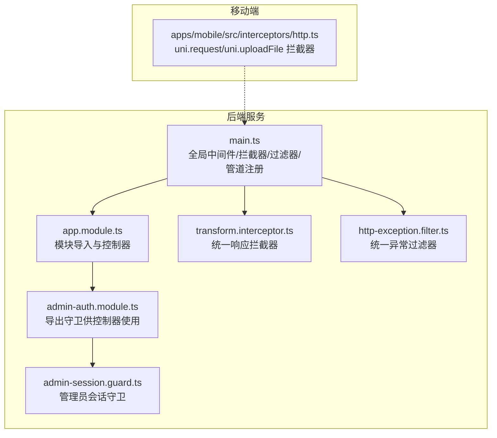
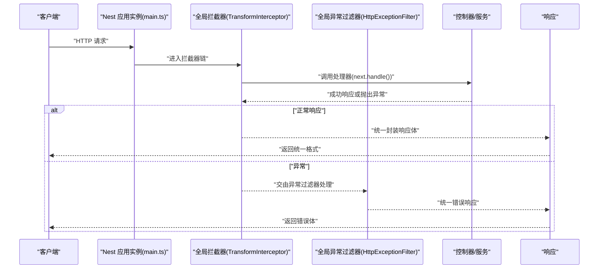
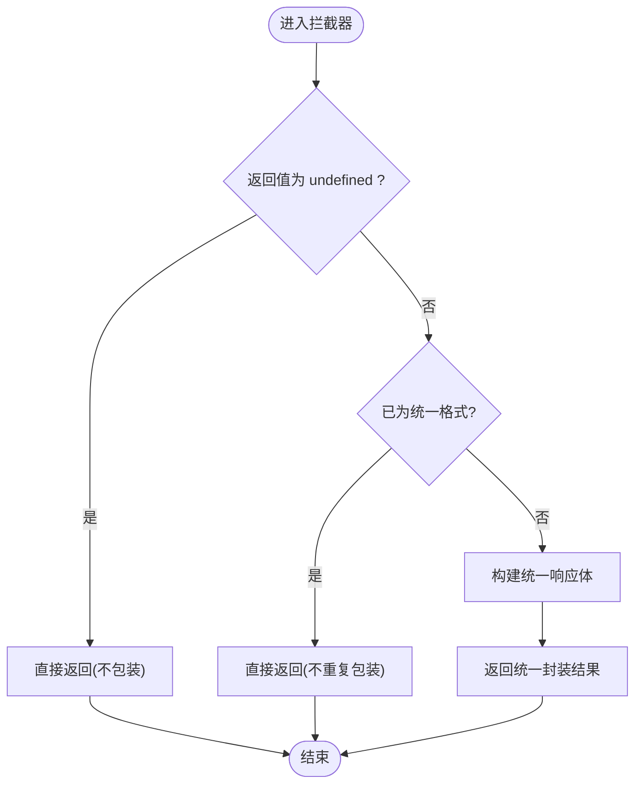
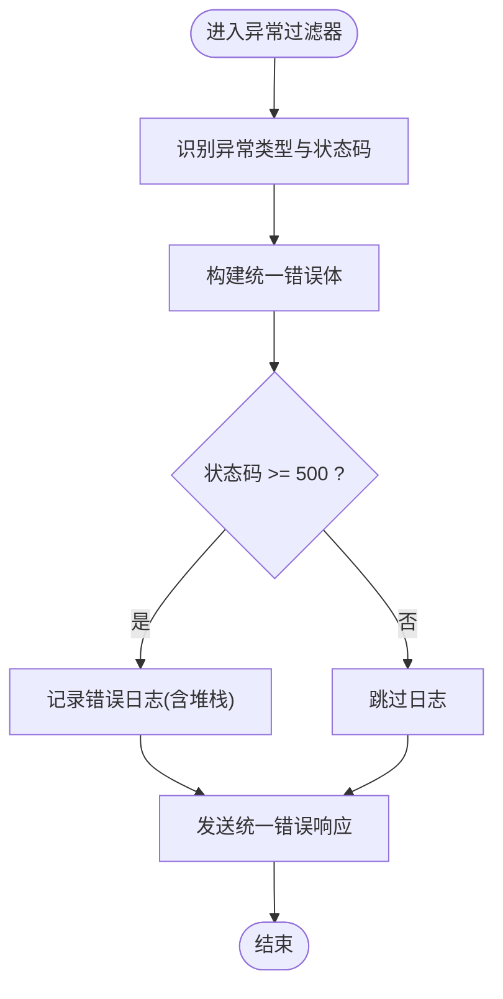
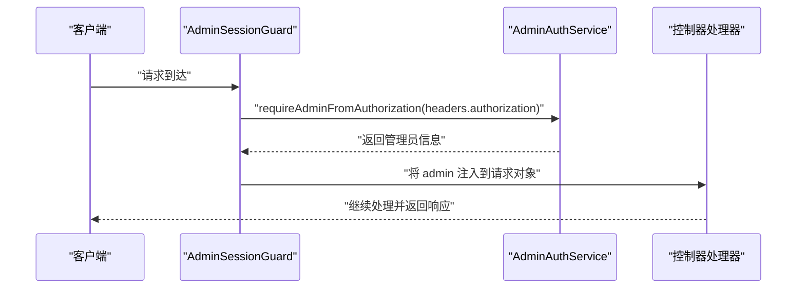
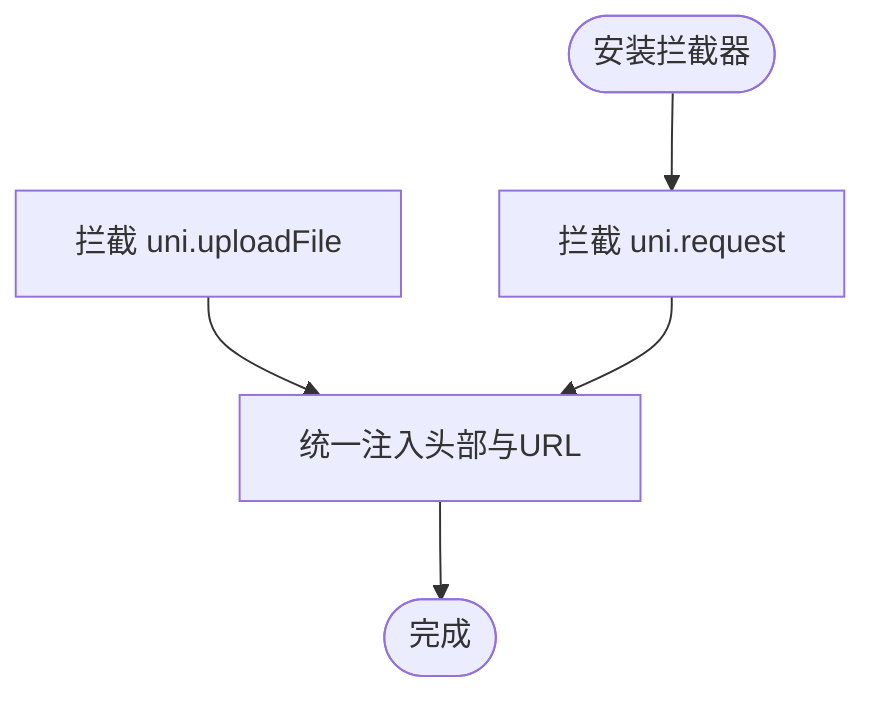
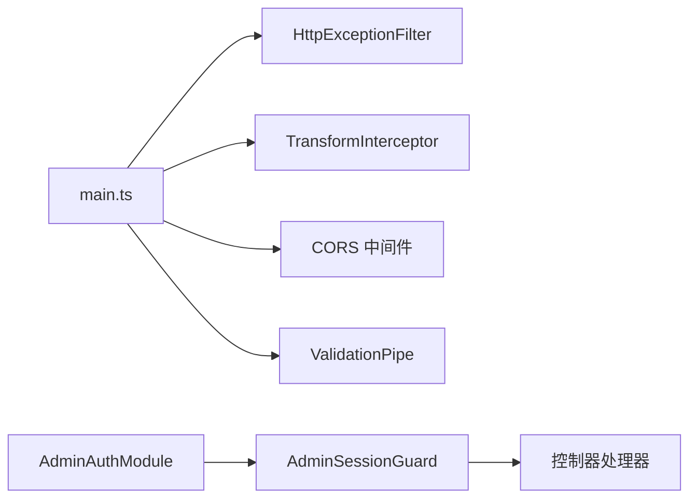

# 中间件、拦截器、过滤器

<cite>
**本文引用的文件**
- [services/api/src/main.ts](file://services/api/src/main.ts)
- [services/api/src/app.module.ts](file://services/api/src/app.module.ts)
- [services/api/src/common/interceptors/transform.interceptor.ts](file://services/api/src/common/interceptors/transform.interceptor.ts)
- [services/api/src/common/filters/http-exception.filter.ts](file://services/api/src/common/filters/http-exception.filter.ts)
- [services/api/src/admin-auth/admin-session.guard.ts](file://services/api/src/admin-auth/admin-session.guard.ts)
- [services/api/src/admin-auth/admin-auth.module.ts](file://services/api/src/admin-auth/admin-auth.module.ts)
- [apps/mobile/src/interceptors/http.ts](file://apps/mobile/src/interceptors/http.ts)
</cite>

## 目录
1. [简介](#简介)
2. [项目结构](#项目结构)
3. [核心组件](#核心组件)
4. [架构总览](#架构总览)
5. [详细组件分析](#详细组件分析)
6. [依赖关系分析](#依赖关系分析)
7. [性能考量](#性能考量)
8. [故障排查指南](#故障排查指南)
9. [结论](#结论)
10. [附录：自定义开发指南与最佳实践](#附录自定义开发指南与最佳实践)

## 简介
本文件围绕 NestJS 的中间件、拦截器、过滤器与守卫展开，结合仓库中的实际实现，系统讲解其执行顺序、应用场景与落地实践。重点覆盖：
- 全局中间件（CORS）与全局管道（ValidationPipe）
- 统一响应格式化拦截器（TransformInterceptor）
- 统一异常过滤器（HttpExceptionFilter）
- 权限守卫（AdminSessionGuard）
- 移动端请求拦截器（HTTP 拦截器）
- 调试技巧、性能影响与安全注意事项

## 项目结构
本项目在后端服务中通过全局注册的方式启用中间件、拦截器与过滤器，并在模块中注入守卫；移动端通过 uni-app 的拦截器统一注入请求头与基础 URL。

图表来源
- [services/api/src/main.ts:1-74](file://services/api/src/main.ts#L1-L74)
- [services/api/src/app.module.ts:1-145](file://services/api/src/app.module.ts#L1-L145)
- [services/api/src/common/interceptors/transform.interceptor.ts:1-59](file://services/api/src/common/interceptors/transform.interceptor.ts#L1-L59)
- [services/api/src/common/filters/http-exception.filter.ts:1-92](file://services/api/src/common/filters/http-exception.filter.ts#L1-L92)
- [services/api/src/admin-auth/admin-session.guard.ts:1-25](file://services/api/src/admin-auth/admin-session.guard.ts#L1-L25)
- [services/api/src/admin-auth/admin-auth.module.ts:1-14](file://services/api/src/admin-auth/admin-auth.module.ts#L1-L14)
- [apps/mobile/src/interceptors/http.ts:1-49](file://apps/mobile/src/interceptors/http.ts#L1-L49)

章节来源
- [services/api/src/main.ts:1-74](file://services/api/src/main.ts#L1-L74)
- [services/api/src/app.module.ts:1-145](file://services/api/src/app.module.ts#L1-L145)
- [apps/mobile/src/interceptors/http.ts:1-49](file://apps/mobile/src/interceptors/http.ts#L1-L49)

## 核心组件
- 全局 CORS 中间件：在启动时通过应用实例启用，基于配置允许特定来源并支持本地开发环境。
- 全局拦截器：TransformInterceptor 统一包装成功响应，避免重复包装与手动响应场景。
- 全局异常过滤器：HttpExceptionFilter 统一错误响应，区分 5xx 错误的日志记录策略。
- 全局管道：ValidationPipe 启用白名单与隐式转换，提升数据校验一致性。
- 权限守卫：AdminSessionGuard 从请求头解析管理员会话，注入到请求对象。
- 移动端拦截器：统一设置基础 URL、超时、客户端标识与认证令牌。

章节来源
- [services/api/src/main.ts:8-62](file://services/api/src/main.ts#L8-L62)
- [services/api/src/common/interceptors/transform.interceptor.ts:17-58](file://services/api/src/common/interceptors/transform.interceptor.ts#L17-L58)
- [services/api/src/common/filters/http-exception.filter.ts:18-91](file://services/api/src/common/filters/http-exception.filter.ts#L18-L91)
- [services/api/src/admin-auth/admin-session.guard.ts:13-24](file://services/api/src/admin-auth/admin-session.guard.ts#L13-L24)
- [apps/mobile/src/interceptors/http.ts:18-48](file://apps/mobile/src/interceptors/http.ts#L18-L48)

## 架构总览
下图展示了请求从进入应用到返回响应的关键路径，以及异常如何被统一捕获与格式化。

图表来源
- [services/api/src/main.ts:33-34](file://services/api/src/main.ts#L33-L34)
- [services/api/src/common/interceptors/transform.interceptor.ts:21-46](file://services/api/src/common/interceptors/transform.interceptor.ts#L21-L46)
- [services/api/src/common/filters/http-exception.filter.ts:22-40](file://services/api/src/common/filters/http-exception.filter.ts#L22-L40)

## 详细组件分析

### 统一响应拦截器（TransformInterceptor）
- 功能要点
  - 对控制器返回的成功响应进行统一封装，包含状态码、消息、时间戳与数据字段。
  - 避免对已封装数据与未定义数据的重复处理，兼容手动响应场景。
- 执行时机
  - 在控制器处理完成后、响应发送前执行。
- 复杂度与性能
  - 时间复杂度 O(1)，仅做轻量对象包装与字段拼装，开销极低。
- 安全与兼容性
  - 通过检测字段集合判断是否已封装，避免重复包装。
  - 忽略 undefined 返回值，适配流式响应（如文件下载）。

图表来源
- [services/api/src/common/interceptors/transform.interceptor.ts:21-58](file://services/api/src/common/interceptors/transform.interceptor.ts#L21-L58)

章节来源
- [services/api/src/common/interceptors/transform.interceptor.ts:17-58](file://services/api/src/common/interceptors/transform.interceptor.ts#L17-L58)

### 统一异常过滤器（HttpExceptionFilter）
- 功能要点
  - 捕获所有未处理异常，根据 HttpException 状态码生成统一错误体。
  - 对 5xx 错误输出日志栈信息，便于定位问题。
  - 从响应体中提取可读消息，优先数组首个字符串或 error 字段。
- 执行时机
  - 在拦截器之后、响应发送前，若发生异常则拦截并返回统一错误体。
- 性能与可观测性
  - 仅在异常分支执行，正常路径无额外开销。
  - 5xx 分支写入日志，建议结合日志聚合系统进行集中分析。

图表来源
- [services/api/src/common/filters/http-exception.filter.ts:22-91](file://services/api/src/common/filters/http-exception.filter.ts#L22-L91)

章节来源
- [services/api/src/common/filters/http-exception.filter.ts:18-91](file://services/api/src/common/filters/http-exception.filter.ts#L18-L91)

### 权限守卫（AdminSessionGuard）
- 功能要点
  - 从请求头解析管理员身份，注入到请求对象，供后续处理器使用。
  - 适用于需要管理员鉴权的路由或控制器。
- 执行时机
  - 在路由处理器执行前，作为守卫进行权限判定。
- 与模块的关系
  - 由 AdminAuthModule 导出，可在控制器中按需使用。

图表来源
- [services/api/src/admin-auth/admin-session.guard.ts:17-23](file://services/api/src/admin-auth/admin-session.guard.ts#L17-L23)
- [services/api/src/admin-auth/admin-auth.module.ts:5](file://services/api/src/admin-auth/admin-auth.module.ts#L5)

章节来源
- [services/api/src/admin-auth/admin-session.guard.ts:13-24](file://services/api/src/admin-auth/admin-session.guard.ts#L13-L24)
- [services/api/src/admin-auth/admin-auth.module.ts:1-14](file://services/api/src/admin-auth/admin-auth.module.ts#L1-L14)

### 移动端请求拦截器（uni-app）
- 功能要点
  - 自动为请求添加基础 URL、超时、客户端标识与认证令牌。
  - 支持通用请求与上传文件两类拦截点。
- 执行时机
  - 在 uni.request/uni.uploadFile 发起前统一注入头部与 URL 规范化。
- 与后端协作
  - 通过 X-Client 与 Authorization 头部与后端约定一致的鉴权与来源标识。

图表来源
- [apps/mobile/src/interceptors/http.ts:18-48](file://apps/mobile/src/interceptors/http.ts#L18-L48)

章节来源
- [apps/mobile/src/interceptors/http.ts:18-48](file://apps/mobile/src/interceptors/http.ts#L18-L48)

## 依赖关系分析
- 全局注册顺序
  - main.ts 中先注册全局过滤器与拦截器，再启用 CORS 与管道，最后启动服务。
- 模块导出
  - AdminAuthModule 导出守卫，可在控制器中按需使用。
- 响应链路
  - 请求经由全局拦截器与守卫，最终由控制器处理；异常由全局过滤器接管。

图表来源
- [services/api/src/main.ts:33-43](file://services/api/src/main.ts#L33-L43)
- [services/api/src/admin-auth/admin-auth.module.ts:10](file://services/api/src/admin-auth/admin-auth.module.ts#L10)

章节来源
- [services/api/src/main.ts:33-43](file://services/api/src/main.ts#L33-L43)
- [services/api/src/admin-auth/admin-auth.module.ts:7-12](file://services/api/src/admin-auth/admin-auth.module.ts#L7-L12)

## 性能考量
- 全局拦截器与过滤器均为轻量操作，对正常路径无明显延迟。
- 异常过滤器仅在异常时触发，不影响正常请求吞吐。
- CORS 采用白名单校验，生产环境严格限制来源，减少无效请求。
- ValidationPipe 的隐式转换与白名单策略有助于减少脏数据带来的额外处理成本。

## 故障排查指南
- 统一响应未生效
  - 检查是否使用了手动响应（如 @Res），拦截器会跳过 undefined 数据。
  - 确认拦截器已全局注册且未被局部覆盖。
- 统一错误未返回
  - 确认异常是否被抛出为 HttpException 或被上层捕获。
  - 检查 5xx 错误是否正确记录日志以便定位。
- CORS 报错
  - 核对配置项中的允许来源列表，确认本地开发域名是否包含。
  - 生产环境若出现跨域失败，检查代理与网关配置。
- 认证失败
  - 确认请求头中携带正确的 Authorization 令牌。
  - 检查守卫注入的管理员信息是否正确解析。

章节来源
- [services/api/src/common/interceptors/transform.interceptor.ts:27-32](file://services/api/src/common/interceptors/transform.interceptor.ts#L27-L32)
- [services/api/src/common/filters/http-exception.filter.ts:32-37](file://services/api/src/common/filters/http-exception.filter.ts#L32-L37)
- [services/api/src/main.ts:44-59](file://services/api/src/main.ts#L44-L59)
- [services/api/src/admin-auth/admin-session.guard.ts:17-22](file://services/api/src/admin-auth/admin-session.guard.ts#L17-L22)

## 结论
本项目通过全局拦截器与过滤器实现了统一的响应与错误处理，配合 CORS 中间件与 ValidationPipe 提升了接口的一致性与安全性；AdminSessionGuard 则为后台管理提供了简洁的权限注入方案。移动端拦截器进一步规范了客户端请求行为，确保与后端约定一致。整体架构清晰、职责分明，便于扩展与维护。

## 附录：自定义开发指南与最佳实践
- 自定义中间件（CORS）
  - 在应用启动阶段通过应用实例启用 CORS，支持动态来源校验与本地开发豁免。
  - 参考路径：[services/api/src/main.ts:44-59](file://services/api/src/main.ts#L44-L59)
- 自定义拦截器
  - 在拦截器中进行请求/响应格式化、日志记录与性能监控，注意避免对已封装数据重复处理。
  - 参考路径：[services/api/src/common/interceptors/transform.interceptor.ts:21-46](file://services/api/src/common/interceptors/transform.interceptor.ts#L21-L46)
- 自定义异常过滤器
  - 统一错误响应体结构，区分 5xx 错误并记录日志，从响应体中提取可读消息。
  - 参考路径：[services/api/src/common/filters/http-exception.filter.ts:22-63](file://services/api/src/common/filters/http-exception.filter.ts#L22-L63)
- 自定义守卫
  - 在守卫中解析认证信息并注入到请求对象，结合模块导出在控制器中使用。
  - 参考路径：[services/api/src/admin-auth/admin-session.guard.ts:17-22](file://services/api/src/admin-auth/admin-session.guard.ts#L17-L22)
- 最佳实践
  - 全局注册拦截器与过滤器，避免重复代码。
  - 使用 ValidationPipe 统一校验规则，开启白名单与隐式转换。
  - 对敏感接口启用守卫与权限控制，确保最小权限原则。
  - 移动端统一注入头部与基础 URL，减少重复逻辑。