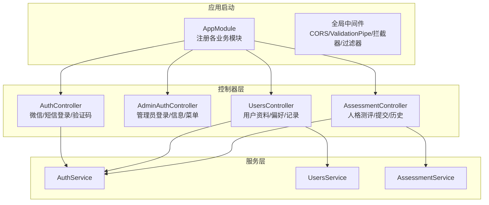
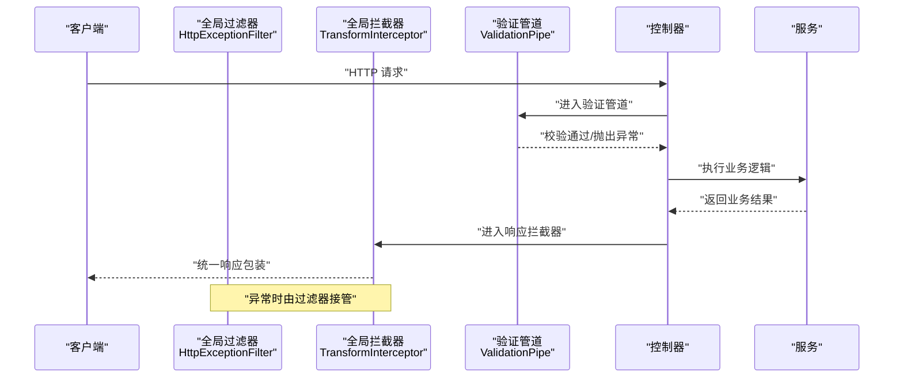
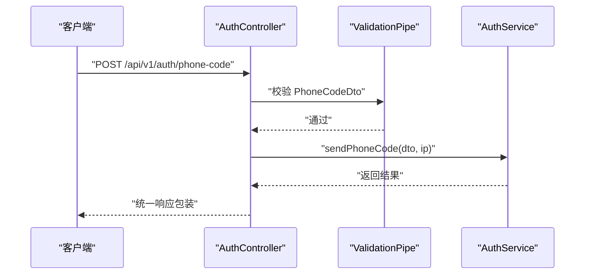
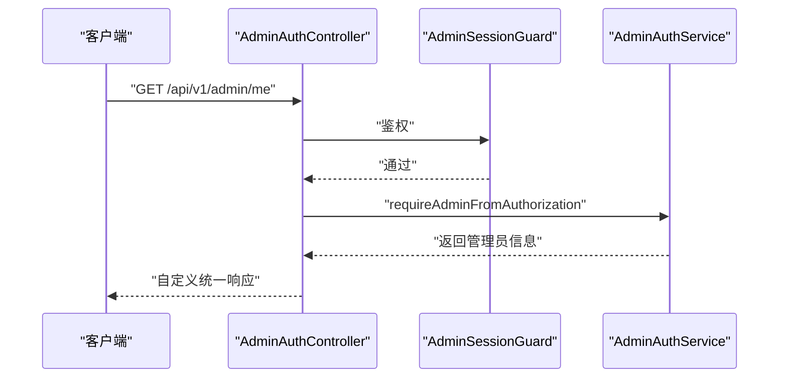
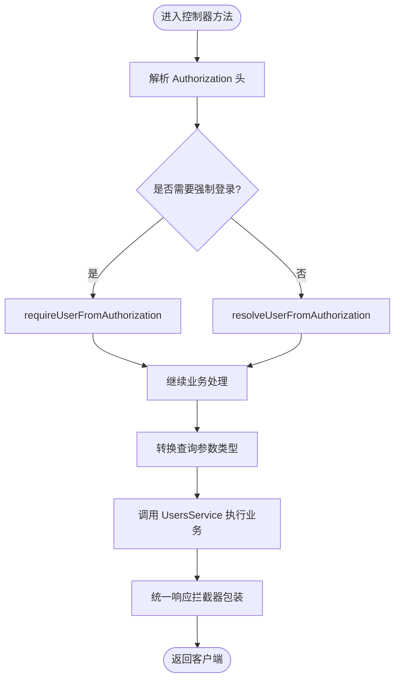
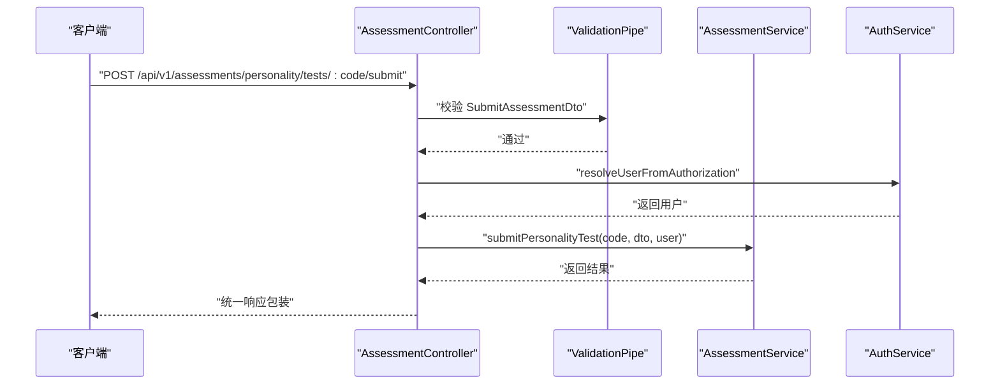
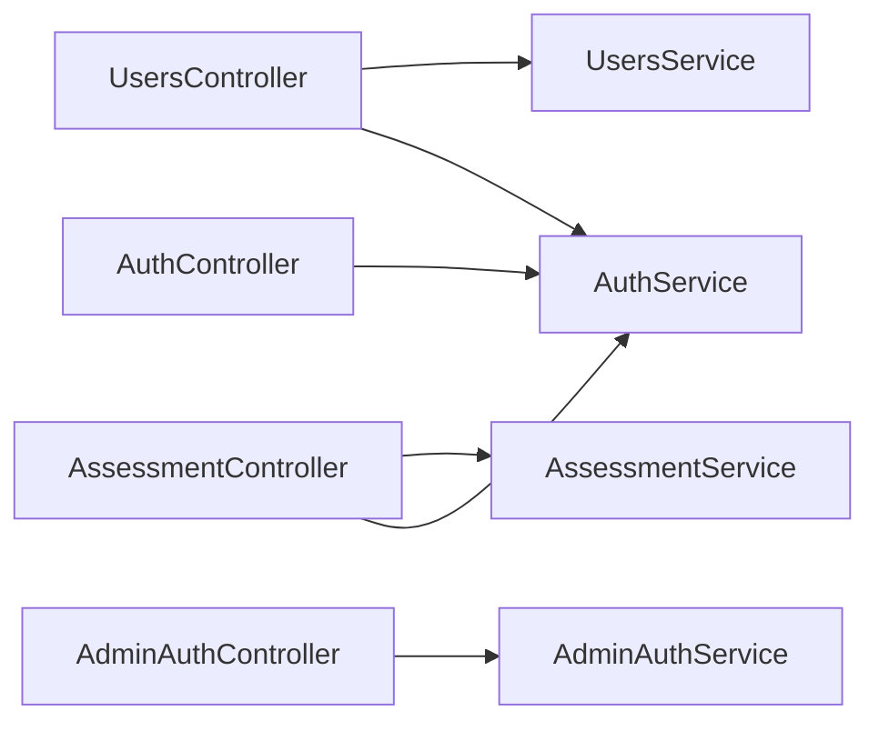

# 控制器层设计

<cite>
**本文引用的文件**
- [services/api/src/app.module.ts](file://services/api/src/app.module.ts)
- [services/api/src/main.ts](file://services/api/src/main.ts)
- [services/api/src/common/filters/http-exception.filter.ts](file://services/api/src/common/filters/http-exception.filter.ts)
- [services/api/src/common/interceptors/transform.interceptor.ts](file://services/api/src/common/interceptors/transform.interceptor.ts)
- [services/api/src/auth/auth.controller.ts](file://services/api/src/auth/auth.controller.ts)
- [services/api/src/admin-auth/admin-auth.controller.ts](file://services/api/src/admin-auth/admin-auth.controller.ts)
- [services/api/src/users/users.controller.ts](file://services/api/src/users/users.controller.ts)
- [services/api/src/assessment/assessment.controller.ts](file://services/api/src/assessment/assessment.controller.ts)
- [services/api/src/auth/dto/wechat-login.dto.ts](file://services/api/src/auth/dto/wechat-login.dto.ts)
- [services/api/src/auth/dto/phone-login.dto.ts](file://services/api/src/auth/dto/phone-login.dto.ts)
- [services/api/src/auth/dto/phone-code.dto.ts](file://services/api/src/auth/dto/phone-code.dto.ts)
- [services/api/src/assessment/dto/submit-assessment.dto.ts](file://services/api/src/assessment/dto/submit-assessment.dto.ts)
- [services/api/src/users/dto/update-profile.dto.ts](file://services/api/src/users/dto/update-profile.dto.ts)
</cite>

## 目录
1. [引言](#引言)
2. [项目结构](#项目结构)
3. [核心组件](#核心组件)
4. [架构总览](#架构总览)
5. [详细组件分析](#详细组件分析)
6. [依赖关系分析](#依赖关系分析)
7. [性能考量](#性能考量)
8. [故障排查指南](#故障排查指南)
9. [结论](#结论)
10. [附录](#附录)

## 引言
本文件面向 NestJS 控制器层设计，系统性阐述控制器装饰器与路由映射、参数处理、请求与响应处理机制、依赖注入、以及基于统一错误与响应拦截器的 RESTful 设计实践。文档以实际代码为依据，结合模块组织与全局中间件配置，帮助开发者在保持一致性的前提下高效扩展控制器功能。

## 项目结构
后端采用多模块架构，主模块集中导入各业务模块（如认证、用户、评估等），并在全局启用 CORS、统一异常过滤器、统一响应拦截器与全局校验管道。控制器通过 @Controller 装饰器声明路由前缀，并在方法上使用 HTTP 方法装饰器进行路由映射；参数通过 @Body、@Query、@Param、@Headers 等装饰器绑定；服务通过构造函数注入，实现关注点分离。

图表来源
- [services/api/src/app.module.ts:61-142](file://services/api/src/app.module.ts#L61-L142)
- [services/api/src/main.ts:32-59](file://services/api/src/main.ts#L32-L59)
- [services/api/src/auth/auth.controller.ts:8-35](file://services/api/src/auth/auth.controller.ts#L8-L35)
- [services/api/src/admin-auth/admin-auth.controller.ts:6-44](file://services/api/src/admin-auth/admin-auth.controller.ts#L6-L44)
- [services/api/src/users/users.controller.ts:20-203](file://services/api/src/users/users.controller.ts#L20-L203)
- [services/api/src/assessment/assessment.controller.ts:6-38](file://services/api/src/assessment/assessment.controller.ts#L6-L38)

章节来源
- [services/api/src/app.module.ts:1-145](file://services/api/src/app.module.ts#L1-L145)
- [services/api/src/main.ts:1-74](file://services/api/src/main.ts#L1-L74)

## 核心组件
- 控制器装饰器与路由映射
  - 使用 @Controller 声明路由前缀；在方法上使用 @Get/@Post/@Put/@Delete 等映射具体路径。
  - 示例：认证控制器、管理员认证控制器、用户控制器、评估控制器均按资源语义划分路径。
- 参数处理
  - @Body 绑定请求体；@Query 绑定查询参数；@Param 绑定路径参数；@Headers 获取请求头。
  - 示例：用户控制器中对 Authorization 头部进行解析，评估控制器中对路径参数进行绑定。
- 请求处理流程
  - 全局 ValidationPipe 启用白名单与隐式类型转换，自动进行 DTO 校验与类型转换。
  - 统一响应拦截器将成功响应包装为统一结构；统一异常过滤器将异常标准化输出。
- 响应处理机制
  - 成功响应：统一拦截器包装 code/message/data/timestamp；当控制器直接使用 @Res 返回时跳过包装。
  - 错误响应：异常过滤器根据 HttpException 状态码或默认 500 输出统一结构。
- 依赖注入
  - 控制器通过构造函数注入服务；部分控制器同时注入多个服务以复用授权能力。
  - 守卫与拦截器通过 @UseGuards/@UseInterceptors 应用于特定路由或整个控制器。

章节来源
- [services/api/src/auth/auth.controller.ts:8-35](file://services/api/src/auth/auth.controller.ts#L8-L35)
- [services/api/src/admin-auth/admin-auth.controller.ts:6-44](file://services/api/src/admin-auth/admin-auth.controller.ts#L6-L44)
- [services/api/src/users/users.controller.ts:20-203](file://services/api/src/users/users.controller.ts#L20-L203)
- [services/api/src/assessment/assessment.controller.ts:6-38](file://services/api/src/assessment/assessment.controller.ts#L6-L38)
- [services/api/src/main.ts:32-59](file://services/api/src/main.ts#L32-L59)
- [services/api/src/common/interceptors/transform.interceptor.ts:17-58](file://services/api/src/common/interceptors/transform.interceptor.ts#L17-L58)
- [services/api/src/common/filters/http-exception.filter.ts:18-91](file://services/api/src/common/filters/http-exception.filter.ts#L18-L91)

## 架构总览
控制器层位于应用入口与服务层之间，负责：
- 解析与校验请求参数
- 执行业务逻辑（调用服务）
- 组织响应数据（统一包装或直接返回）

图表来源
- [services/api/src/main.ts:32-59](file://services/api/src/main.ts#L32-L59)
- [services/api/src/common/interceptors/transform.interceptor.ts:17-58](file://services/api/src/common/interceptors/transform.interceptor.ts#L17-L58)
- [services/api/src/common/filters/http-exception.filter.ts:18-91](file://services/api/src/common/filters/http-exception.filter.ts#L18-L91)

## 详细组件分析

### 认证控制器（AuthController）
- 路由与方法
  - 登录：POST /api/v1/auth/wechat-login
  - 发送手机验证码：POST /api/v1/auth/phone-code
  - 手机号登录：POST /api/v1/auth/phone-login
- 参数与校验
  - 使用 DTO 对请求体进行强类型约束与校验，确保字段长度、格式与可选性符合预期。
- 请求处理
  - 控制器仅做参数透传与调用服务，不承担业务细节。
- 响应处理
  - 成功响应由统一拦截器包装；错误由统一过滤器处理。

图表来源
- [services/api/src/auth/auth.controller.ts:8-35](file://services/api/src/auth/auth.controller.ts#L8-L35)
- [services/api/src/auth/dto/phone-code.dto.ts:9-19](file://services/api/src/auth/dto/phone-code.dto.ts#L9-L19)
- [services/api/src/main.ts:35-43](file://services/api/src/main.ts#L35-L43)

章节来源
- [services/api/src/auth/auth.controller.ts:1-36](file://services/api/src/auth/auth.controller.ts#L1-L36)
- [services/api/src/auth/dto/wechat-login.dto.ts:1-22](file://services/api/src/auth/dto/wechat-login.dto.ts#L1-L22)
- [services/api/src/auth/dto/phone-login.dto.ts:1-24](file://services/api/src/auth/dto/phone-login.dto.ts#L1-L24)
- [services/api/src/auth/dto/phone-code.dto.ts:1-20](file://services/api/src/auth/dto/phone-code.dto.ts#L1-L20)

### 管理员认证控制器（AdminAuthController）
- 路由与方法
  - 登录：POST /api/v1/admin/auth/login
  - 获取当前管理员：GET /api/v1/admin/me（需守卫）
  - 获取菜单：GET /api/v1/admin/menus（需守卫）
- 参数与校验
  - 登录使用 DTO 校验用户名/密码；其他接口通过 @Headers 获取 Authorization 并交由服务解析。
- 安全与守卫
  - 使用 @UseGuards(AdminSessionGuard) 保护受控路由，确保会话有效性。

图表来源
- [services/api/src/admin-auth/admin-auth.controller.ts:6-44](file://services/api/src/admin-auth/admin-auth.controller.ts#L6-L44)

章节来源
- [services/api/src/admin-auth/admin-auth.controller.ts:1-45](file://services/api/src/admin-auth/admin-auth.controller.ts#L1-L45)

### 用户控制器（UsersController）
- 资源与路由
  - 个人信息：GET /api/v1/me
  - 个人资料页：GET /api/v1/user/profile
  - 指标详情：GET /api/v1/user/metrics/:metricKey/detail?range=...
  - 更新资料：PUT /api/v1/me/profile
  - 绑定手机：POST /api/v1/me/phone/bind
  - 偏好设置：GET/PUT /api/v1/me/preferences
  - 历史记录：GET /api/v1/records?limit=...
  - 记录概览：GET /api/v1/record/overview
  - 情绪记录：GET/POST /api/v1/record/mood
  - 冥想记录：GET/POST /api/v1/record/meditation
  - 日常脉搏：GET/POST /api/v1/me/pulse
  - 呼吸训练：POST /api/v1/record/breathing
- 参数与类型转换
  - 查询参数通过 @Query 获取并进行显式类型转换（如 Number）。
  - 路径参数通过 @Param 获取字符串值，必要时再转换。
  - 请求头通过 @Headers 获取 Authorization 进行用户解析。
- 依赖注入
  - 同时注入 AuthService 与 UsersService，前者负责鉴权解析，后者负责业务数据。

图表来源
- [services/api/src/users/users.controller.ts:20-203](file://services/api/src/users/users.controller.ts#L20-L203)

章节来源
- [services/api/src/users/users.controller.ts:1-204](file://services/api/src/users/users.controller.ts#L1-L204)
- [services/api/src/users/dto/update-profile.dto.ts:10-37](file://services/api/src/users/dto/update-profile.dto.ts#L10-L37)

### 评估控制器（AssessmentController）
- 路由与方法
  - 测评列表：GET /api/v1/assessments/personality/tests
  - 测评详情：GET /api/v1/assessments/personality/tests/:code
  - 提交答案：POST /api/v1/assessments/personality/tests/:code/submit
  - 历史记录：GET /api/v1/assessments/personality/history
- 参数与校验
  - 路径参数 code 通过 @Param 获取；提交答案使用 SubmitAssessmentDto 校验数组与嵌套对象。
  - Authorization 通过 @Headers 获取并解析用户身份。

图表来源
- [services/api/src/assessment/assessment.controller.ts:6-38](file://services/api/src/assessment/assessment.controller.ts#L6-L38)
- [services/api/src/assessment/dto/submit-assessment.dto.ts:20-26](file://services/api/src/assessment/dto/submit-assessment.dto.ts#L20-L26)

章节来源
- [services/api/src/assessment/assessment.controller.ts:1-39](file://services/api/src/assessment/assessment.controller.ts#L1-L39)
- [services/api/src/assessment/dto/submit-assessment.dto.ts:1-27](file://services/api/src/assessment/dto/submit-assessment.dto.ts#L1-L27)

## 依赖关系分析
- 控制器到服务
  - AuthController → AuthService
  - AdminAuthController → AdminAuthService
  - UsersController → AuthService, UsersService
  - AssessmentController → AuthService, AssessmentService
- 全局中间件
  - CORS、ValidationPipe、TransformInterceptor、HttpExceptionFilter 在应用启动时全局启用。
- 模块组织
  - AppModule 导入各业务模块，形成清晰的领域边界与职责划分。

图表来源
- [services/api/src/auth/auth.controller.ts:8-35](file://services/api/src/auth/auth.controller.ts#L8-L35)
- [services/api/src/admin-auth/admin-auth.controller.ts:6-44](file://services/api/src/admin-auth/admin-auth.controller.ts#L6-L44)
- [services/api/src/users/users.controller.ts:20-203](file://services/api/src/users/users.controller.ts#L20-L203)
- [services/api/src/assessment/assessment.controller.ts:6-38](file://services/api/src/assessment/assessment.controller.ts#L6-L38)

章节来源
- [services/api/src/app.module.ts:61-142](file://services/api/src/app.module.ts#L61-L142)
- [services/api/src/main.ts:32-59](file://services/api/src/main.ts#L32-L59)

## 性能考量
- 全局 ValidationPipe 已开启隐式类型转换，减少手写转换逻辑带来的开销与错误。
- 统一拦截器仅在数据非 undefined 且未被包装时进行封装，避免重复包装与序列化成本。
- 建议
  - 控制器内尽量使用 DTO 与 @Param/@Query 的强类型约束，减少运行时分支判断。
  - 对高频接口考虑缓存策略（如菜单、配置类数据），避免重复查询数据库。
  - 避免在控制器中执行耗时操作，将复杂逻辑下沉至服务层并异步化。

## 故障排查指南
- 统一错误响应结构
  - 字段：code（HTTP 状态码）、message（错误描述）、data（空）、timestamp（ISO 时间）。
  - 当 HttpException 抛出时，过滤器提取响应体中的 message/error；未知异常统一返回“服务器内部错误”。
- 常见问题定位
  - 参数校验失败：检查 DTO 字段约束与请求体结构是否匹配。
  - CORS 跨域失败：确认请求来源在允许列表或本地开发环境。
  - 自定义响应被拦截器包装：若控制器使用 @Res 手动返回（如文件下载），拦截器不会再次包装。

章节来源
- [services/api/src/common/filters/http-exception.filter.ts:18-91](file://services/api/src/common/filters/http-exception.filter.ts#L18-L91)
- [services/api/src/common/interceptors/transform.interceptor.ts:17-58](file://services/api/src/common/interceptors/transform.interceptor.ts#L17-L58)
- [services/api/src/main.ts:44-59](file://services/api/src/main.ts#L44-L59)

## 结论
本项目通过模块化与全局中间件实现了控制器层的高内聚、低耦合与一致性。控制器专注于路由与参数处理，服务层承载业务逻辑，统一拦截器与过滤器保障了响应与错误的标准化。遵循本文的 RESTful 设计原则与最佳实践，可在保证可维护性的同时提升开发效率与系统稳定性。

## 附录
- RESTful 设计要点
  - 资源命名：使用名词复数形式表达资源集合，路径参数用于唯一标识单个资源。
  - HTTP 方法：GET/POST/PUT/DELETE 明确语义；幂等性与安全性遵循约定。
  - 状态码：成功 2xx，客户端错误 4xx，服务器错误 5xx；错误响应统一结构。
  - 错误处理：优先抛出 HttpException 并携带明确 message；未知异常由全局过滤器兜底。
- 测试建议
  - 单元测试：针对控制器方法输入 DTO、参数装饰器绑定、服务调用进行断言。
  - 集成测试：覆盖完整请求链路（含全局管道、拦截器、过滤器）。
  - 安全测试：验证守卫生效、CORS 限制、敏感接口访问控制。
- 安全防护
  - 使用守卫（如 AdminSessionGuard）保护受控路由。
  - 严格 DTO 校验与最小权限原则，避免暴露内部实现细节。
  - 对外部来源 IP 解析（如 X-Forwarded-For）进行可信范围限制。