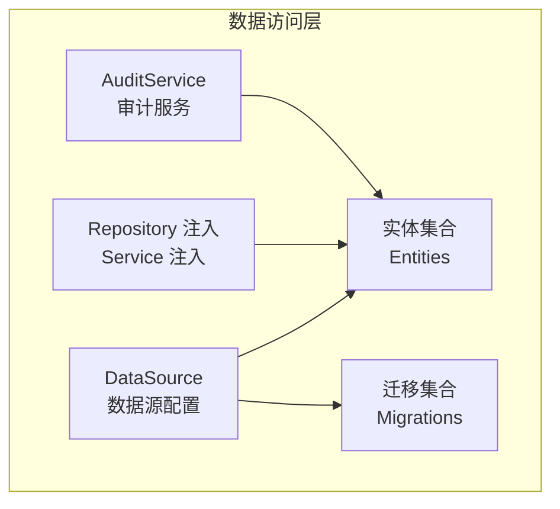
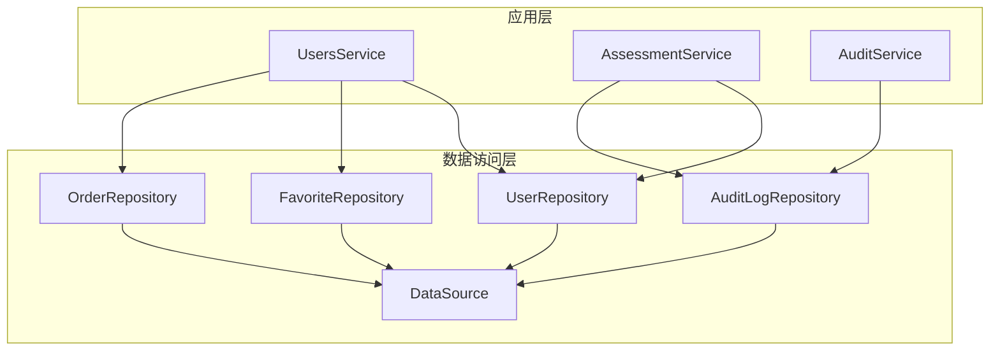
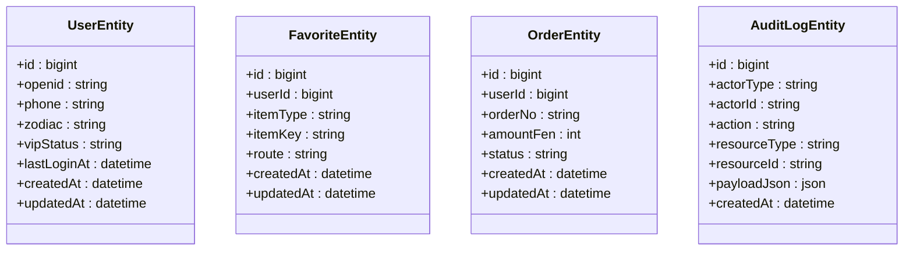
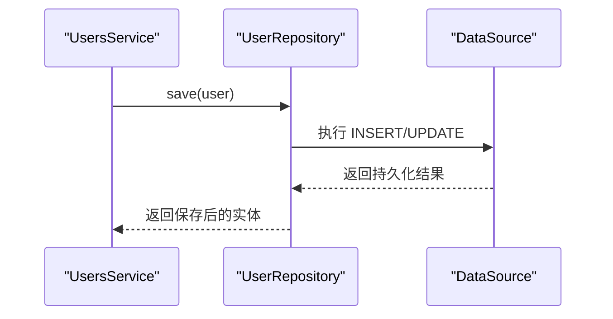
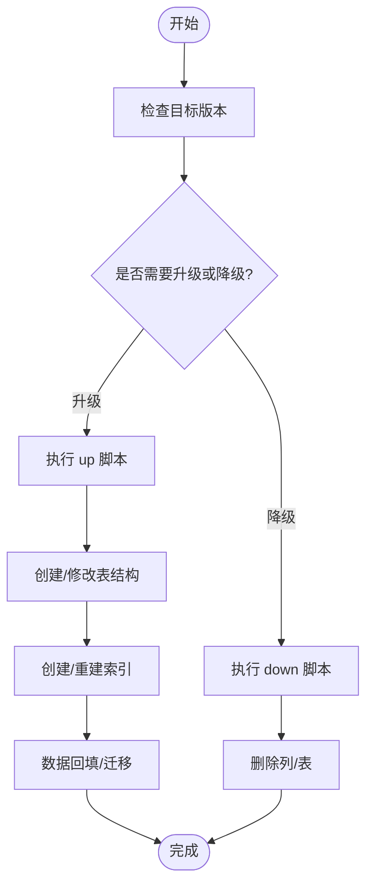
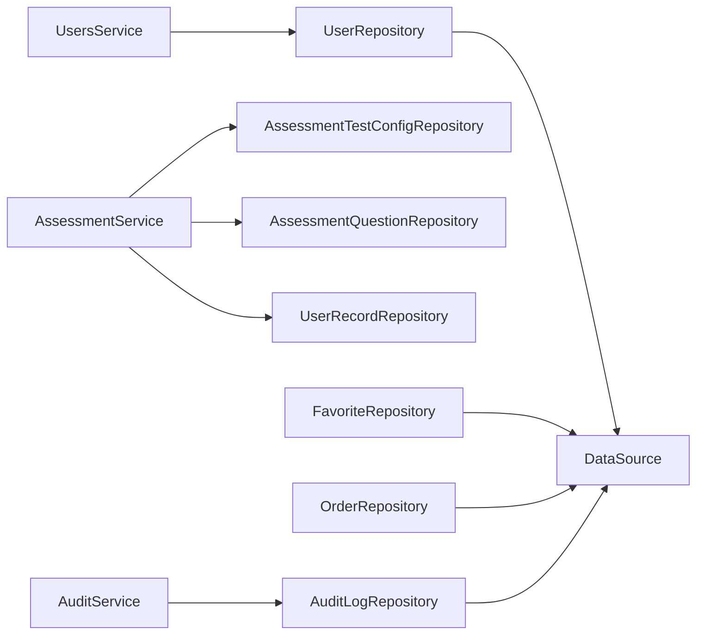

# 数据访问层设计

<cite>
**本文引用的文件**
- [services/api/src/database/data-source.ts](file://services/api/src/database/data-source.ts)
- [services/api/src/database/entities/user.entity.ts](file://services/api/src/database/entities/user.entity.ts)
- [services/api/src/database/entities/assessment-session.entity.ts](file://services/api/src/database/entities/assessment-session.entity.ts)
- [services/api/src/database/entities/audit-log.entity.ts](file://services/api/src/database/entities/audit-log.entity.ts)
- [services/api/src/database/entities/favorite.entity.ts](file://services/api/src/database/entities/favorite.entity.ts)
- [services/api/src/database/entities/order.entity.ts](file://services/api/src/database/entities/order.entity.ts)
- [services/api/src/database/migrations/1761262800000-ContentOpsFoundation.ts](file://services/api/src/database/migrations/1761262800000-ContentOpsFoundation.ts)
- [services/api/src/common/audit.service.ts](file://services/api/src/common/audit.service.ts)
- [services/api/src/users/users.service.ts](file://services/api/src/users/users.service.ts)
- [services/api/src/assessment/assessment.service.ts](file://services/api/src/assessment/assessment.service.ts)
</cite>

## 目录
1. [简介](#简介)
2. [项目结构](#项目结构)
3. [核心组件](#核心组件)
4. [架构总览](#架构总览)
5. [详细组件分析](#详细组件分析)
6. [依赖分析](#依赖分析)
7. [性能考虑](#性能考虑)
8. [故障排查指南](#故障排查指南)
9. [结论](#结论)
10. [附录](#附录)

## 简介
本文件面向 NestJS 数据访问层设计，围绕 TypeORM 集成与配置、实体定义与映射、Repository 模式实现、数据库迁移管理、查询优化策略以及数据验证、软删除、审计日志与性能监控等主题进行系统化技术文档整理。文档以仓库现有实现为基础，结合代码结构与迁移脚本，给出可操作的实践建议与可视化图示。

## 项目结构
数据访问层主要由以下部分组成：
- 数据源配置：集中于数据源工厂，统一管理连接参数、实体集合与迁移路径。
- 实体定义：基于装饰器声明表结构、索引与列类型映射。
- 迁移管理：通过迁移脚本维护数据库演进，确保版本控制与生产部署一致性。
- 仓储与服务：在业务服务中注入对应 Repository，封装 CRUD、查询构建与事务处理。
- 审计日志：独立的审计实体与服务，用于记录关键操作与资源变更。

图表来源
- [services/api/src/database/data-source.ts:32-72](file://services/api/src/database/data-source.ts#L32-L72)

章节来源
- [services/api/src/database/data-source.ts:1-73](file://services/api/src/database/data-source.ts#L1-L73)

## 核心组件
- 数据源配置（DataSource）
  - 类型：MySQL
  - 连接参数：主机、端口、用户名、密码、数据库名、时区
  - 同步策略：关闭自动同步，强制显式迁移
  - 实体集合：涵盖用户、评估、收藏、订单、审计等核心业务实体
  - 迁移路径：扫描 migrations 目录下的 TypeScript/JavaScript 文件
- 实体定义
  - 使用装饰器声明表名、主键、列类型、索引与生命周期列
  - 示例：用户表、收藏表、订单表、审计日志表
- 迁移管理
  - 迁移脚本采用时间戳命名，保证执行顺序
  - 提供 up/down 双向迁移，支持列与表的增删改
- 审计日志
  - 独立实体与服务，统一写入审计记录
  - 服务通过注入 Repository 执行持久化

章节来源
- [services/api/src/database/data-source.ts:32-72](file://services/api/src/database/data-source.ts#L32-L72)
- [services/api/src/database/entities/user.entity.ts:10-74](file://services/api/src/database/entities/user.entity.ts#L10-L74)
- [services/api/src/database/entities/favorite.entity.ts:10-48](file://services/api/src/database/entities/favorite.entity.ts#L10-L48)
- [services/api/src/database/entities/order.entity.ts:10-52](file://services/api/src/database/entities/order.entity.ts#L10-L52)
- [services/api/src/database/entities/audit-log.entity.ts:9-36](file://services/api/src/database/entities/audit-log.entity.ts#L9-L36)
- [services/api/src/database/migrations/1761262800000-ContentOpsFoundation.ts:9-64](file://services/api/src/database/migrations/1761262800000-ContentOpsFoundation.ts#L9-L64)
- [services/api/src/common/audit.service.ts:16-34](file://services/api/src/common/audit.service.ts#L16-L34)

## 架构总览
数据访问层遵循“数据源 → 实体 → 迁移 → 仓储/服务”的分层架构。业务服务通过依赖注入获得对应 Repository，完成数据读写；审计服务独立于业务服务，统一记录关键操作。

图表来源
- [services/api/src/users/users.service.ts:206-229](file://services/api/src/users/users.service.ts#L206-L229)
- [services/api/src/assessment/assessment.service.ts:266-275](file://services/api/src/assessment/assessment.service.ts#L266-L275)
- [services/api/src/common/audit.service.ts:16-20](file://services/api/src/common/audit.service.ts#L16-L20)
- [services/api/src/database/data-source.ts:32-72](file://services/api/src/database/data-source.ts#L32-L72)

## 详细组件分析

### 数据源配置与连接池
- 配置要点
  - 数据库类型：MySQL
  - 连接参数：通过环境变量注入，支持默认值
  - 时区：UTC（Z）
  - 同步策略：关闭自动同步，避免生产环境误操作
  - 实体与迁移：集中声明，便于维护与扩展
- 连接池管理
  - TypeORM 默认使用连接池；可通过 DataSource 参数进一步细化（如最大连接数、空闲超时等）
  - 建议在生产环境通过环境变量与容器编排设置连接池参数，避免峰值抖动

章节来源
- [services/api/src/database/data-source.ts:32-72](file://services/api/src/database/data-source.ts#L32-L72)

### 实体定义与映射
- 用户实体（UserEntity）
  - 主键：无符号 bigint，自增
  - 索引：唯一索引（openid、phone），普通索引（zodiac）
  - 列类型：字符串、日期、JSON 等
  - 生命周期：创建时间、更新时间
- 收藏实体（FavoriteEntity）
  - 复合唯一索引：用户 + 条目类型 + 条目键
  - 时间索引：用户 + 创建时间
- 订单实体（OrderEntity）
  - 唯一索引：订单号
  - 复合索引：用户 + 状态
- 审计日志实体（AuditLogEntity）
  - 复合索引：操作者 + 动作、资源类型 + 资源 ID
  - JSON 字段：存储结构化负载

图表来源
- [services/api/src/database/entities/user.entity.ts:14-74](file://services/api/src/database/entities/user.entity.ts#L14-L74)
- [services/api/src/database/entities/favorite.entity.ts:15-48](file://services/api/src/database/entities/favorite.entity.ts#L15-L48)
- [services/api/src/database/entities/order.entity.ts:13-52](file://services/api/src/database/entities/order.entity.ts#L13-L52)
- [services/api/src/database/entities/audit-log.entity.ts:12-36](file://services/api/src/database/entities/audit-log.entity.ts#L12-L36)

章节来源
- [services/api/src/database/entities/user.entity.ts:10-74](file://services/api/src/database/entities/user.entity.ts#L10-L74)
- [services/api/src/database/entities/favorite.entity.ts:10-48](file://services/api/src/database/entities/favorite.entity.ts#L10-L48)
- [services/api/src/database/entities/order.entity.ts:10-52](file://services/api/src/database/entities/order.entity.ts#L10-L52)
- [services/api/src/database/entities/audit-log.entity.ts:9-36](file://services/api/src/database/entities/audit-log.entity.ts#L9-L36)

### Repository 模式实现
- 注入与使用
  - 在业务服务构造函数中通过 @InjectRepository 注入对应 Repository
  - 通过 Repository 执行 save、find、findOne、count、remove 等操作
- 典型场景
  - 用户画像更新：修改用户字段后保存
  - 收藏与订单统计：使用 count 统计数量
  - 记录查询：按用户与时间排序，限制返回条数
- 事务处理
  - 对于跨表写入或幂等性要求高的流程，可在服务层使用 QueryRunner 或事务装饰器进行包裹
  - 建议在需要一致性的关键流程中开启事务，失败回滚

图表来源
- [services/api/src/users/users.service.ts:332-359](file://services/api/src/users/users.service.ts#L332-L359)
- [services/api/src/users/users.service.ts:206-229](file://services/api/src/users/users.service.ts#L206-L229)

章节来源
- [services/api/src/users/users.service.ts:206-229](file://services/api/src/users/users.service.ts#L206-L229)
- [services/api/src/users/users.service.ts:332-359](file://services/api/src/users/users.service.ts#L332-L359)
- [services/api/src/users/users.service.ts:389-404](file://services/api/src/users/users.service.ts#L389-L404)
- [services/api/src/users/users.service.ts:449-481](file://services/api/src/users/users.service.ts#L449-L481)
- [services/api/src/users/users.service.ts:483-498](file://services/api/src/users/users.service.ts#L483-L498)
- [services/api/src/users/users.service.ts:559-603](file://services/api/src/users/users.service.ts#L559-L603)
- [services/api/src/assessment/assessment.service.ts:314-393](file://services/api/src/assessment/assessment.service.ts#L314-L393)

### 数据库迁移管理
- 迁移脚本
  - 采用时间戳命名，保证执行顺序
  - 提供 up/down 双向迁移，支持表创建、列增删、索引维护与数据回填
- 典型迁移
  - 内容运营基础：创建幸运物、配置、报告模板表，添加发布/归档时间列并回填
  - 用户偏好与记录：新增用户偏好、冥想记录字段与索引优化
  - 电话认证与索引优化：为用户表增加电话字段与索引
- 生产部署建议
  - 使用 down 迁移回滚风险点
  - 在部署前先执行迁移预检，确保兼容性
  - 结合蓝绿/滚动发布，最小化迁移窗口

图表来源
- [services/api/src/database/migrations/1761262800000-ContentOpsFoundation.ts:12-64](file://services/api/src/database/migrations/1761262800000-ContentOpsFoundation.ts#L12-L64)
- [services/api/src/database/migrations/1761262800000-ContentOpsFoundation.ts:281-308](file://services/api/src/database/migrations/1761262800000-ContentOpsFoundation.ts#L281-L308)

章节来源
- [services/api/src/database/migrations/1761262800000-ContentOpsFoundation.ts:9-64](file://services/api/src/database/migrations/1761262800000-ContentOpsFoundation.ts#L9-L64)
- [services/api/src/database/migrations/1761262800000-ContentOpsFoundation.ts:66-138](file://services/api/src/database/migrations/1761262800000-ContentOpsFoundation.ts#L66-L138)
- [services/api/src/database/migrations/1761262800000-ContentOpsFoundation.ts:140-205](file://services/api/src/database/migrations/1761262800000-ContentOpsFoundation.ts#L140-L205)
- [services/api/src/database/migrations/1761262800000-ContentOpsFoundation.ts:207-279](file://services/api/src/database/migrations/1761262800000-ContentOpsFoundation.ts#L207-L279)
- [services/api/src/database/migrations/1761262800000-ContentOpsFoundation.ts:281-308](file://services/api/src/database/migrations/1761262800000-ContentOpsFoundation.ts#L281-L308)

### 查询优化策略
- 索引设计
  - 用户：唯一索引（openid、phone）、普通索引（zodiac）
  - 收藏：复合唯一索引（用户+条目类型+条目键）、时间索引（用户+创建时间）
  - 订单：唯一索引（订单号）、复合索引（用户+状态）
  - 审计：复合索引（操作者+动作、资源类型+资源ID）
- 批量操作
  - 使用 upsert/insertMany 批量写入，减少往返次数
  - 注意 MySQL 语法差异与约束冲突处理
- 分页查询
  - 使用 take/offset 或游标分页（基于时间戳或主键）
  - 对高频查询字段建立合适索引，避免全表扫描

章节来源
- [services/api/src/database/entities/user.entity.ts:11-13](file://services/api/src/database/entities/user.entity.ts#L11-L13)
- [services/api/src/database/entities/favorite.entity.ts:11-14](file://services/api/src/database/entities/favorite.entity.ts#L11-L14)
- [services/api/src/database/entities/order.entity.ts:11-12](file://services/api/src/database/entities/order.entity.ts#L11-L12)
- [services/api/src/database/entities/audit-log.entity.ts:10-11](file://services/api/src/database/entities/audit-log.entity.ts#L10-L11)

### 数据验证、软删除、审计日志与性能监控
- 数据验证
  - 建议在 DTO 层使用校验装饰器（如 @IsString、@IsInt 等）配合拦截器统一处理
  - 在 Repository 层可结合触发器或应用层校验，确保业务规则
- 软删除
  - 可引入软删除列（如 deletedAt），在查询时默认过滤
  - 对历史审计与合规要求高的场景尤为适用
- 审计日志
  - 已有独立实体与服务，建议在关键写操作后统一调用审计服务
  - 记录操作者、资源类型/ID、动作与负载
- 性能监控
  - 建议接入慢查询日志与 ORM 查询统计
  - 对热点查询建立缓存层（如 Redis），结合 TTL 与失效策略

章节来源
- [services/api/src/common/audit.service.ts:16-34](file://services/api/src/common/audit.service.ts#L16-L34)
- [services/api/src/database/entities/audit-log.entity.ts:12-36](file://services/api/src/database/entities/audit-log.entity.ts#L12-L36)

## 依赖分析
- 组件耦合
  - 业务服务通过 @InjectRepository 依赖 Repository，Repository 依赖 DataSource
  - 审计服务独立于业务服务，仅依赖审计实体的 Repository
- 外部依赖
  - TypeORM 作为 ORM 框架
  - MySQL 作为持久化存储
  - Redis 用于会话与缓存（非本文重点，但与审计/会话相关）

图表来源
- [services/api/src/users/users.service.ts:206-229](file://services/api/src/users/users.service.ts#L206-L229)
- [services/api/src/assessment/assessment.service.ts:266-275](file://services/api/src/assessment/assessment.service.ts#L266-L275)
- [services/api/src/common/audit.service.ts:16-20](file://services/api/src/common/audit.service.ts#L16-L20)
- [services/api/src/database/data-source.ts:32-72](file://services/api/src/database/data-source.ts#L32-L72)

章节来源
- [services/api/src/users/users.service.ts:206-229](file://services/api/src/users/users.service.ts#L206-L229)
- [services/api/src/assessment/assessment.service.ts:266-275](file://services/api/src/assessment/assessment.service.ts#L266-L275)
- [services/api/src/common/audit.service.ts:16-20](file://services/api/src/common/audit.service.ts#L16-L20)

## 性能考虑
- 连接池与并发
  - 合理设置最大连接数与空闲超时，避免高并发下的连接争用
- 查询优化
  - 为高频查询字段建立索引，避免 SELECT *
  - 使用分页或游标分页，限制单次返回量
- 写入优化
  - 批量写入与 upsert，减少网络往返
  - 控制事务范围，避免长事务锁定
- 缓存策略
  - 对只读或低频变更数据使用缓存，结合失效策略
  - 审计与会话数据可放入 Redis，减轻数据库压力

## 故障排查指南
- 连接问题
  - 检查环境变量是否正确，确认主机、端口、用户名、密码与数据库名
  - 核对时区配置与服务器时区一致性
- 迁移失败
  - 查看迁移脚本执行日志，定位 up/down 的具体失败点
  - 必要时手动回滚到上一个稳定版本
- 查询性能差
  - 使用 EXPLAIN 分析 SQL，确认索引命中情况
  - 检查是否存在全表扫描或隐式转换
- 审计缺失
  - 确认审计服务调用链路是否覆盖关键写操作
  - 校验审计实体索引与字段类型

章节来源
- [services/api/src/database/data-source.ts:32-72](file://services/api/src/database/data-source.ts#L32-L72)
- [services/api/src/database/migrations/1761262800000-ContentOpsFoundation.ts:12-64](file://services/api/src/database/migrations/1761262800000-ContentOpsFoundation.ts#L12-L64)
- [services/api/src/common/audit.service.ts:16-34](file://services/api/src/common/audit.service.ts#L16-L34)

## 结论
本数据访问层设计以 TypeORM 为核心，通过集中化的数据源配置、完善的实体映射与索引设计、规范的迁移管理与审计机制，实现了可维护、可扩展且具备生产级质量的数据持久化能力。建议在后续迭代中进一步完善 DTO 校验、软删除策略与缓存层，并持续优化热点查询与事务边界，以提升整体性能与稳定性。

## 附录
- 关键实体一览
  - 用户：用户基本信息、VIP 状态、偏好与社交关联
  - 收藏：用户收藏的条目，支持去重与时间排序
  - 订单：商品购买与支付状态，支持按用户与状态检索
  - 审计：管理员与系统关键操作的审计轨迹
- 迁移清单（示例）
  - 内容运营基础：幸运物、配置、报告模板表创建与生命周期字段回填
  - 用户偏好与记录：新增偏好字段与记录表字段扩展
  - 电话认证与索引优化：用户电话字段与索引优化

章节来源
- [services/api/src/database/entities/user.entity.ts:10-74](file://services/api/src/database/entities/user.entity.ts#L10-L74)
- [services/api/src/database/entities/favorite.entity.ts:10-48](file://services/api/src/database/entities/favorite.entity.ts#L10-L48)
- [services/api/src/database/entities/order.entity.ts:10-52](file://services/api/src/database/entities/order.entity.ts#L10-L52)
- [services/api/src/database/entities/audit-log.entity.ts:9-36](file://services/api/src/database/entities/audit-log.entity.ts#L9-L36)
- [services/api/src/database/migrations/1761262800000-ContentOpsFoundation.ts:66-138](file://services/api/src/database/migrations/1761262800000-ContentOpsFoundation.ts#L66-L138)
- [services/api/src/database/migrations/1761262800000-ContentOpsFoundation.ts:140-205](file://services/api/src/database/migrations/1761262800000-ContentOpsFoundation.ts#L140-L205)
- [services/api/src/database/migrations/1761262800000-ContentOpsFoundation.ts:207-279](file://services/api/src/database/migrations/1761262800000-ContentOpsFoundation.ts#L207-L279)