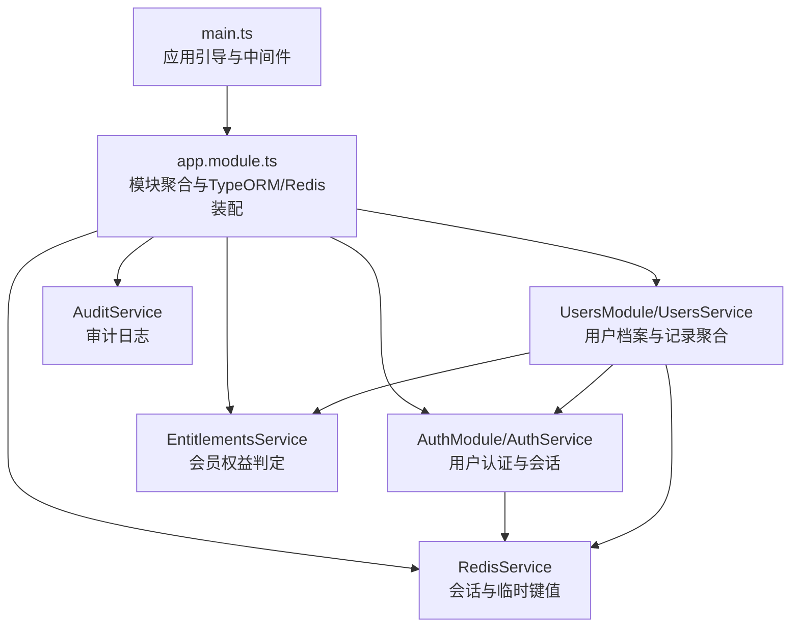
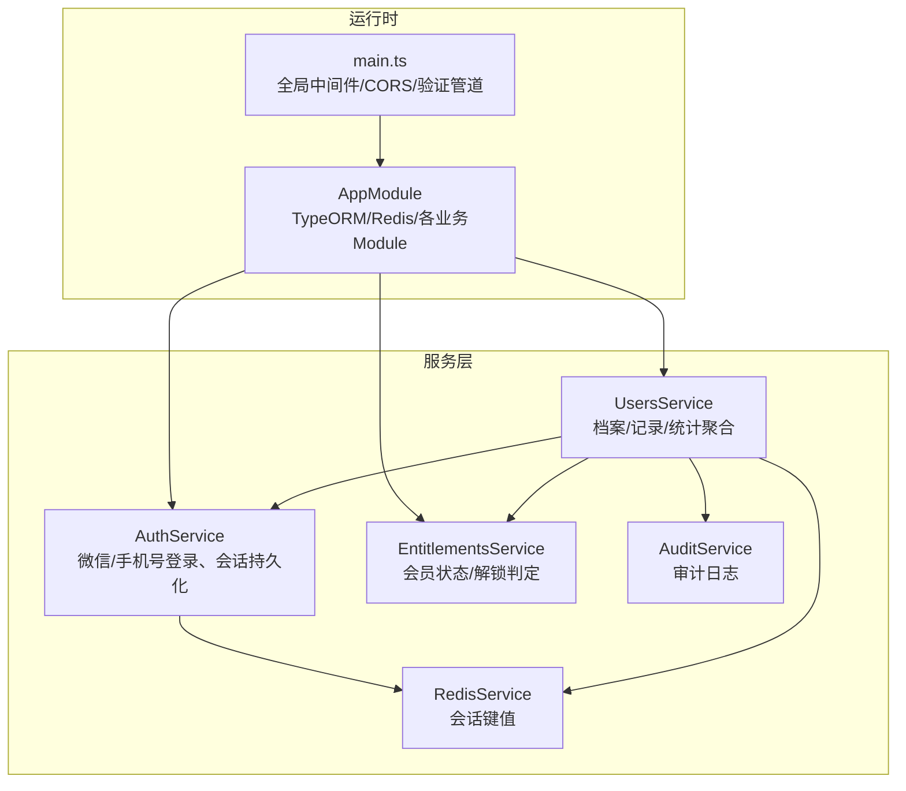
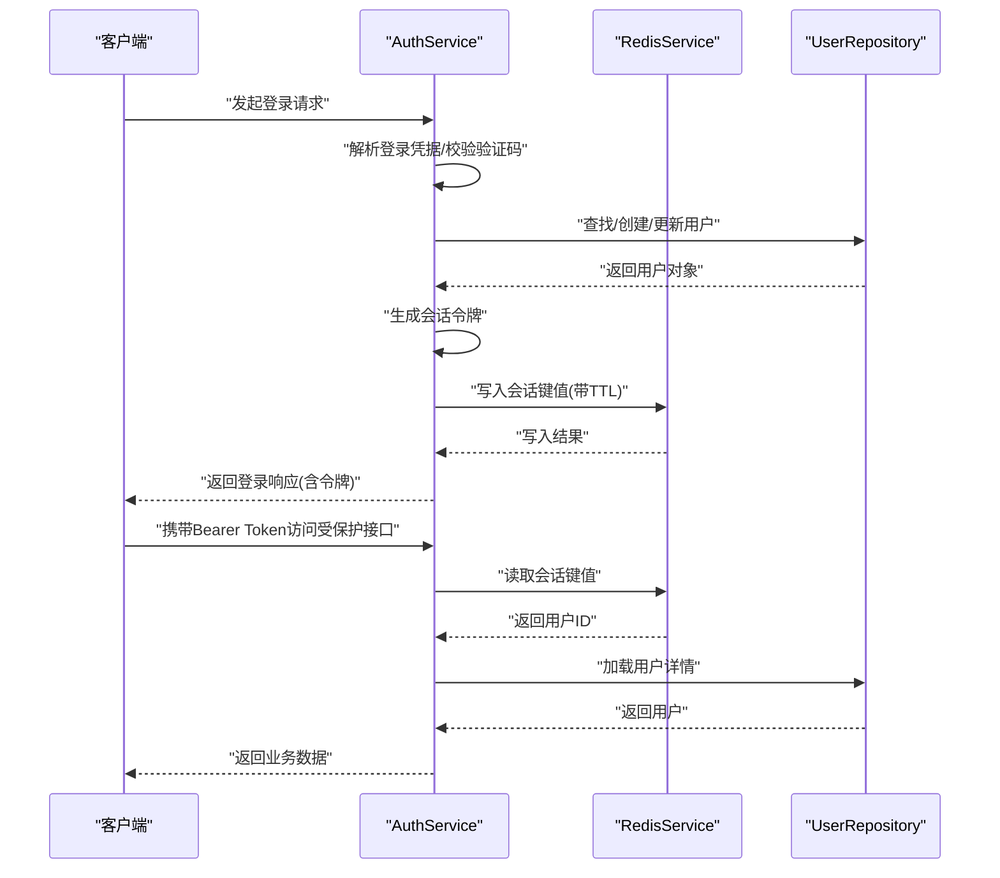
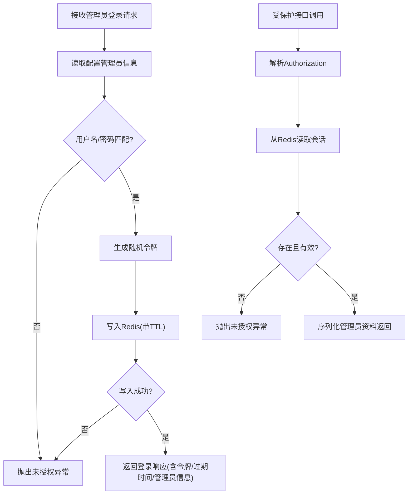
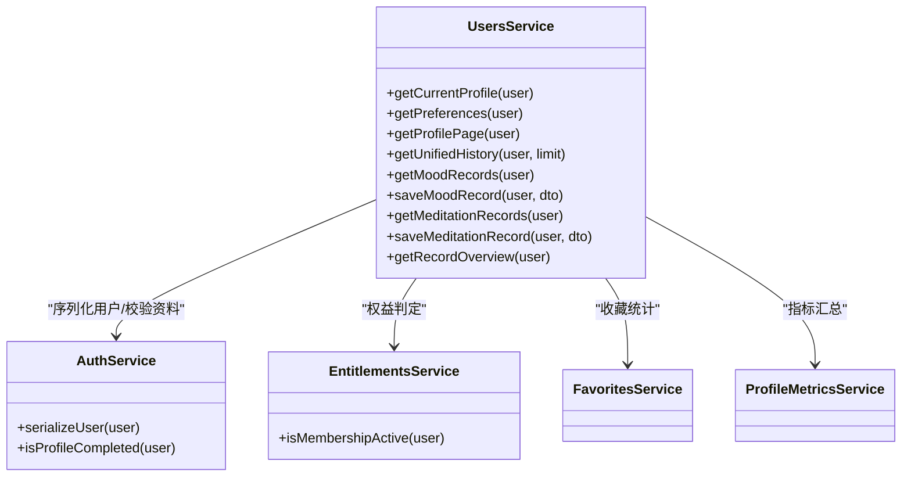
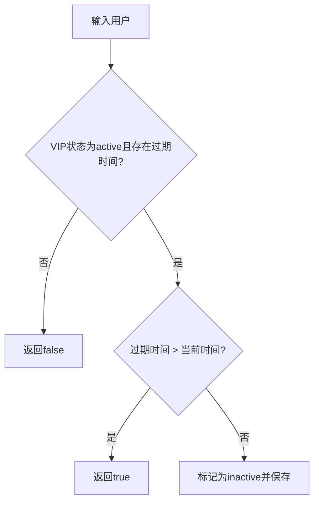
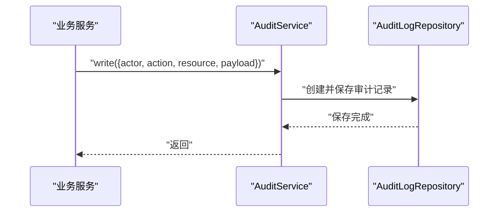
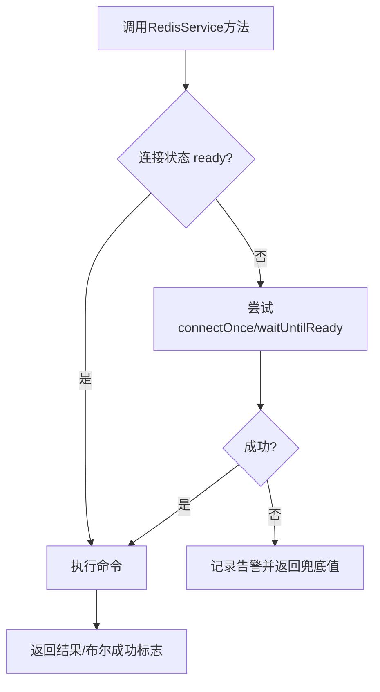
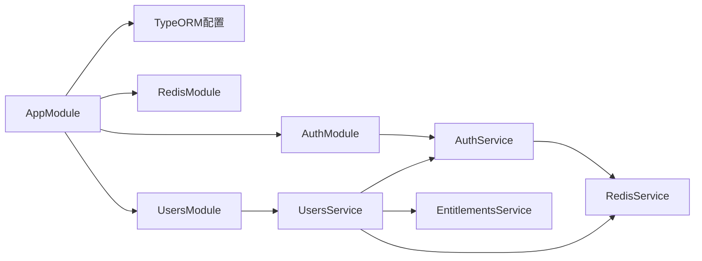

# 服务层设计

<cite>
**本文引用的文件**
- [services/api/src/app.module.ts](file://services/api/src/app.module.ts)
- [services/api/src/main.ts](file://services/api/src/main.ts)
- [services/api/src/admin-auth/admin-auth.service.ts](file://services/api/src/admin-auth/admin-auth.service.ts)
- [services/api/src/auth/auth.service.ts](file://services/api/src/auth/auth.service.ts)
- [services/api/src/users/users.service.ts](file://services/api/src/users/users.service.ts)
- [services/api/src/database/data-source.ts](file://services/api/src/database/data-source.ts)
- [services/api/src/redis/redis.service.ts](file://services/api/src/redis/redis.service.ts)
- [services/api/src/entitlements/entitlements.service.ts](file://services/api/src/entitlements/entitlements.service.ts)
- [services/api/src/common/audit.service.ts](file://services/api/src/common/audit.service.ts)
- [services/api/src/auth/auth.service.spec.ts](file://services/api/src/auth/auth.service.spec.ts)
- [services/api/test/app.e2e-spec.ts](file://services/api/test/app.e2e-spec.ts)
</cite>

## 目录
1. [引言](#引言)
2. [项目结构](#项目结构)
3. [核心组件](#核心组件)
4. [架构总览](#架构总览)
5. [详细组件分析](#详细组件分析)
6. [依赖关系分析](#依赖关系分析)
7. [性能考量](#性能考量)
8. [故障排查指南](#故障排查指南)
9. [结论](#结论)
10. [附录](#附录)

## 引言
本文件面向企业级 NestJS 服务层设计，围绕以下目标展开：深入讲解 @Service 装饰器与服务定义、依赖注入与单例模式；阐述业务逻辑封装原则（领域模型、业务规则、数据访问抽象）；说明服务间协作机制（组合、事件驱动、异步处理）；解释数据访问层设计（Repository 模式、TypeORM 集成、事务管理）；给出测试策略（单元测试、集成测试、Mock 使用）；并提供性能优化、缓存策略与错误处理的企业级实现方案。

## 项目结构
服务层位于 services/api 下，采用按功能域划分的模块化组织方式。应用入口在 main.ts 中初始化全局管道、拦截器、过滤器与 CORS；数据库通过 TypeORM 在 AppModule 中集中配置；Redis 作为会话与临时数据存储由独立模块提供；各业务域（认证、用户、评估、订单等）以 Module + Service 的形式组织。

图表来源
- [services/api/src/main.ts:1-74](file://services/api/src/main.ts#L1-L74)
- [services/api/src/app.module.ts:1-145](file://services/api/src/app.module.ts#L1-L145)

章节来源
- [services/api/src/main.ts:1-74](file://services/api/src/main.ts#L1-L74)
- [services/api/src/app.module.ts:1-145](file://services/api/src/app.module.ts#L1-L145)

## 核心组件
- 服务定义与单例：所有业务服务均使用 @Injectable() 装饰，Nest 默认以单例模式注册，确保线程安全与资源复用。
- 依赖注入：通过构造函数注入 Repository、ConfigService、RedisService、其他 Service，实现关注点分离与可测试性。
- 单例模式实现：Nest 容器默认生命周期为应用级单例，无需额外声明。
- 业务封装原则：
  - 领域模型：UserEntity、UserRecordEntity 等实体承载数据结构与业务状态。
  - 业务规则：如手机号绑定冲突检测、微信/手机号登录策略、会员权益判定、会话有效期管理。
  - 数据访问抽象：Repository 抽象屏蔽 SQL 细节，统一 CRUD 与查询。

章节来源
- [services/api/src/auth/auth.service.ts:39-48](file://services/api/src/auth/auth.service.ts#L39-L48)
- [services/api/src/users/users.service.ts:205-229](file://services/api/src/users/users.service.ts#L205-L229)
- [services/api/src/entitlements/entitlements.service.ts:8-13](file://services/api/src/entitlements/entitlements.service.ts#L8-L13)

## 架构总览
服务层围绕“认证—用户—权益—数据访问—缓存—审计”的主链路构建，辅以健康检查与全局中间件保障运行质量。

图表来源
- [services/api/src/main.ts:32-59](file://services/api/src/main.ts#L32-L59)
- [services/api/src/app.module.ts:61-141](file://services/api/src/app.module.ts#L61-L141)
- [services/api/src/auth/auth.service.ts:39-48](file://services/api/src/auth/auth.service.ts#L39-L48)
- [services/api/src/users/users.service.ts:205-229](file://services/api/src/users/users.service.ts#L205-L229)
- [services/api/src/redis/redis.service.ts:5-10](file://services/api/src/redis/redis.service.ts#L5-L10)
- [services/api/src/common/audit.service.ts:15-20](file://services/api/src/common/audit.service.ts#L15-L20)

## 详细组件分析

### 认证服务（AuthService）
职责与流程
- 处理微信登录与开发环境模拟登录，解析并持久化用户信息。
- 生成会话令牌并写入 Redis，设置 TTL。
- 提供基于 Authorization 的用户解析与鉴权。
- 手机号登录与验证码校验，支持绑定手机号并做唯一性约束处理。
- 序列化用户信息，包含 VIP 状态与偏好字段。

图表来源
- [services/api/src/auth/auth.service.ts:50-79](file://services/api/src/auth/auth.service.ts#L50-L79)
- [services/api/src/auth/auth.service.ts:95-131](file://services/api/src/auth/auth.service.ts#L95-L131)
- [services/api/src/auth/auth.service.ts:171-188](file://services/api/src/auth/auth.service.ts#L171-L188)
- [services/api/src/redis/redis.service.ts:89-104](file://services/api/src/redis/redis.service.ts#L89-L104)

章节来源
- [services/api/src/auth/auth.service.ts:39-48](file://services/api/src/auth/auth.service.ts#L39-L48)
- [services/api/src/auth/auth.service.ts:50-131](file://services/api/src/auth/auth.service.ts#L50-L131)
- [services/api/src/auth/auth.service.ts:171-188](file://services/api/src/auth/auth.service.ts#L171-L188)
- [services/api/src/redis/redis.service.ts:5-10](file://services/api/src/redis/redis.service.ts#L5-L10)

### 管理端认证服务（AdminAuthService）
职责与流程
- 读取配置中的管理员账号与密码，进行登录校验。
- 生成管理端会话令牌并写入 Redis，设置 TTL。
- 从 Authorization 中提取 Bearer Token 并校验有效性，返回管理员资料。

图表来源
- [services/api/src/admin-auth/admin-auth.service.ts:24-52](file://services/api/src/admin-auth/admin-auth.service.ts#L24-L52)
- [services/api/src/admin-auth/admin-auth.service.ts:54-68](file://services/api/src/admin-auth/admin-auth.service.ts#L54-L68)
- [services/api/src/admin-auth/admin-auth.service.ts:74-88](file://services/api/src/admin-auth/admin-auth.service.ts#L74-L88)

章节来源
- [services/api/src/admin-auth/admin-auth.service.ts:17-119](file://services/api/src/admin-auth/admin-auth.service.ts#L17-L119)

### 用户服务（UsersService）
职责与流程
- 聚合用户档案、偏好、记录与统计，提供首页与个人中心所需数据。
- 与 AuthService、EntitlementsService、FavoritesService、ProfileMetricsService 等协作。
- 使用多个 Repository 进行多表聚合查询与批量操作，利用 Promise.all 并行提升性能。
- 提供冥想音乐库、情绪记录、日常脉搏记录等子能力的数据序列化与校验。

图表来源
- [services/api/src/users/users.service.ts:205-229](file://services/api/src/users/users.service.ts#L205-L229)
- [services/api/src/users/users.service.ts:231-326](file://services/api/src/users/users.service.ts#L231-L326)
- [services/api/src/users/users.service.ts:380-481](file://services/api/src/users/users.service.ts#L380-L481)
- [services/api/src/users/users.service.ts:559-603](file://services/api/src/users/users.service.ts#L559-L603)

章节来源
- [services/api/src/users/users.service.ts:205-800](file://services/api/src/users/users.service.ts#L205-L800)

### 权益服务（EntitlementsService）
职责与流程
- 判断用户会员状态是否有效（基于过期时间与状态字段）。
- 刷新会员状态（过期则置为非激活）。
- 基于商品时长为用户续期并更新过期时间。

图表来源
- [services/api/src/entitlements/entitlements.service.ts:15-34](file://services/api/src/entitlements/entitlements.service.ts#L15-L34)

章节来源
- [services/api/src/entitlements/entitlements.service.ts:8-78](file://services/api/src/entitlements/entitlements.service.ts#L8-L78)

### 审计服务（AuditService）
职责与流程
- 统一写入审计日志，记录操作者、动作、资源与载荷，便于合规与追踪。

图表来源
- [services/api/src/common/audit.service.ts:22-33](file://services/api/src/common/audit.service.ts#L22-L33)

章节来源
- [services/api/src/common/audit.service.ts:15-35](file://services/api/src/common/audit.service.ts#L15-L35)

### 缓存服务（RedisService）
职责与流程
- 统一封装 Redis 连接、ping、get、set、del 等操作，内置连接状态管理与超时/错误处理。
- 用于会话令牌、管理端会话等短期键值数据存储。

图表来源
- [services/api/src/redis/redis.service.ts:12-66](file://services/api/src/redis/redis.service.ts#L12-L66)
- [services/api/src/redis/redis.service.ts:79-104](file://services/api/src/redis/redis.service.ts#L79-L104)

章节来源
- [services/api/src/redis/redis.service.ts:5-125](file://services/api/src/redis/redis.service.ts#L5-L125)

## 依赖关系分析
- 模块装配：AppModule 通过 TypeORM 注册实体与迁移，并导入各业务 Module；同时装配 RedisModule。
- 服务耦合：UsersService 依赖 AuthService、EntitlementsService、RedisService、多个 Repository；AuthService 依赖 RedisService、ConfigService、EntitlementsService、SmsCodeService。
- 外部依赖：MySQL（TypeORM）、Redis（ioredis）、微信登录接口（仅在生产配置存在时调用）。

图表来源
- [services/api/src/app.module.ts:61-141](file://services/api/src/app.module.ts#L61-L141)
- [services/api/src/auth/auth.service.ts:41-48](file://services/api/src/auth/auth.service.ts#L41-L48)
- [services/api/src/users/users.service.ts:207-229](file://services/api/src/users/users.service.ts#L207-L229)

章节来源
- [services/api/src/app.module.ts:1-145](file://services/api/src/app.module.ts#L1-L145)
- [services/api/src/auth/auth.service.ts:39-48](file://services/api/src/auth/auth.service.ts#L39-L48)
- [services/api/src/users/users.service.ts:205-229](file://services/api/src/users/users.service.ts#L205-L229)

## 性能考量
- 并行查询：UsersService 在构建首页概览时对多个 Repository 查询使用 Promise.all 并行执行，减少往返等待。
- 缓存命中：会话与短期数据通过 Redis 存储，避免重复数据库查询与外部接口调用。
- 数据库优化：TypeORM 配置同步/迁移开关与时区设置，结合实体索引与查询条件，减少慢查询风险。
- 事务管理：对于跨表写入与幂等场景，建议在 Service 层使用事务包裹，保证一致性（见“最佳实践”）。

## 故障排查指南
- 登录鉴权失败
  - 检查 Authorization 格式与 Bearer Token 是否正确；确认 Redis 中是否存在对应键值。
  - 参考路径：[services/api/src/auth/auth.service.ts:171-188](file://services/api/src/auth/auth.service.ts#L171-L188)，[services/api/src/redis/redis.service.ts:79-104](file://services/api/src/redis/redis.service.ts#L79-L104)
- 微信登录异常
  - 核对 WECHAT_APP_ID/WECHAT_APP_SECRET 配置；确认网络可达与返回体结构。
  - 参考路径：[services/api/src/auth/auth.service.ts:372-417](file://services/api/src/auth/auth.service.ts#L372-L417)
- 会员状态不一致
  - 触发刷新逻辑，确保过期时间与状态字段一致。
  - 参考路径：[services/api/src/entitlements/entitlements.service.ts:23-34](file://services/api/src/entitlements/entitlements.service.ts#L23-L34)
- Redis 连接问题
  - 使用 ping 探测连接状态；检查连接参数与网络；关注告警日志。
  - 参考路径：[services/api/src/redis/redis.service.ts:68-77](file://services/api/src/redis/redis.service.ts#L68-L77)

章节来源
- [services/api/src/auth/auth.service.ts:171-188](file://services/api/src/auth/auth.service.ts#L171-L188)
- [services/api/src/redis/redis.service.ts:68-77](file://services/api/src/redis/redis.service.ts#L68-L77)
- [services/api/src/entitlements/entitlements.service.ts:23-34](file://services/api/src/entitlements/entitlements.service.ts#L23-L34)

## 结论
本服务层以模块化与依赖注入为核心，结合 Redis 与 TypeORM 实现高可用的认证、用户与权益体系。通过并行查询、统一审计与严格的异常处理，满足企业级稳定性与可观测性要求。建议在关键写入路径引入事务与幂等设计，持续完善测试矩阵与监控告警。

## 附录

### 测试策略
- 单元测试
  - 使用 Jest 对 AuthService 关键行为进行断言，覆盖模拟登录、令牌解析、手机号登录与隐私脱敏。
  - 参考路径：[services/api/src/auth/auth.service.spec.ts:4-186](file://services/api/src/auth/auth.service.spec.ts#L4-L186)
- 集成测试
  - e2e 测试通过 supertest 访问 /api/v1/health，校验应用健康状态；Mock DataSource、RedisService、ConfigService 以隔离外部依赖。
  - 参考路径：[services/api/test/app.e2e-spec.ts:9-50](file://services/api/test/app.e2e-spec.ts#L9-L50)
- Mock 使用
  - 在测试中通过 provide + useValue 或 useFactory 注入 Mock 实例，确保测试可控与可重复。

章节来源
- [services/api/src/auth/auth.service.spec.ts:4-186](file://services/api/src/auth/auth.service.spec.ts#L4-L186)
- [services/api/test/app.e2e-spec.ts:9-50](file://services/api/test/app.e2e-spec.ts#L9-L50)

### 数据访问层设计
- Repository 模式
  - 通过 @InjectRepository 注入各实体 Repository，封装查询与保存逻辑，避免控制器直接操作底层 ORM。
  - 参考路径：[services/api/src/auth/auth.service.ts:42-43](file://services/api/src/auth/auth.service.ts#L42-L43)，[services/api/src/users/users.service.ts:208-223](file://services/api/src/users/users.service.ts#L208-L223)
- TypeORM 集成
  - AppModule 中集中配置 MySQL 连接、实体列表、迁移与同步策略；dataSource.ts 提供独立数据源定义。
  - 参考路径：[services/api/src/app.module.ts:67-117](file://services/api/src/app.module.ts#L67-L117)，[services/api/src/database/data-source.ts:32-72](file://services/api/src/database/data-source.ts#L32-L72)
- 事务管理
  - 对于跨表写入与一致性要求高的场景，建议在 Service 层使用事务包裹，确保原子性与回滚能力。

章节来源
- [services/api/src/app.module.ts:67-117](file://services/api/src/app.module.ts#L67-L117)
- [services/api/src/database/data-source.ts:32-72](file://services/api/src/database/data-source.ts#L32-L72)

### 服务间协作机制
- 服务组合
  - UsersService 组合 AuthService（序列化用户/资料完整性）、EntitlementsService（会员权益）、RedisService（会话）、多个 Repository（记录聚合）。
  - 参考路径：[services/api/src/users/users.service.ts:207-229](file://services/api/src/users/users.service.ts#L207-L229)
- 事件驱动与异步处理
  - 建议在写入侧引入事件总线或消息队列，将耗时任务（推送、海报生成、报表导出）异步化，避免阻塞请求链路。
- 错误处理
  - 全局 ValidationPipe、HttpExceptionFilter、TransformInterceptor 统一处理输入校验、异常与响应包装。
  - 参考路径：[services/api/src/main.ts:35-43](file://services/api/src/main.ts#L35-L43)，[services/api/src/main.ts:33-34](file://services/api/src/main.ts#L33-L34)

章节来源
- [services/api/src/users/users.service.ts:207-229](file://services/api/src/users/users.service.ts#L207-L229)
- [services/api/src/main.ts:33-43](file://services/api/src/main.ts#L33-L43)