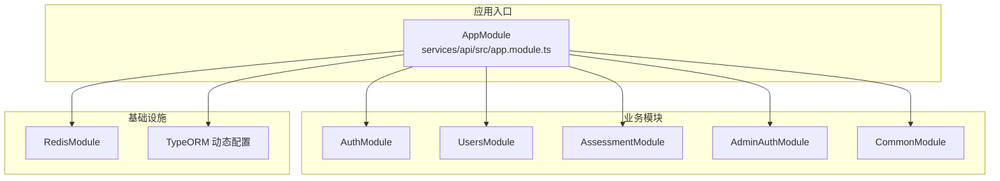
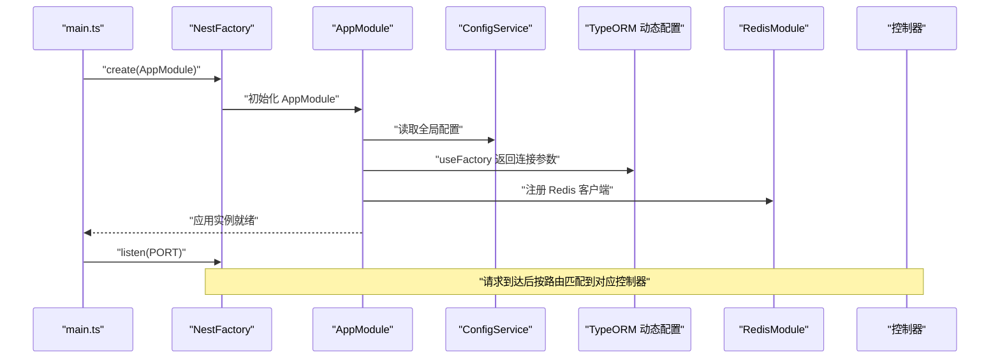
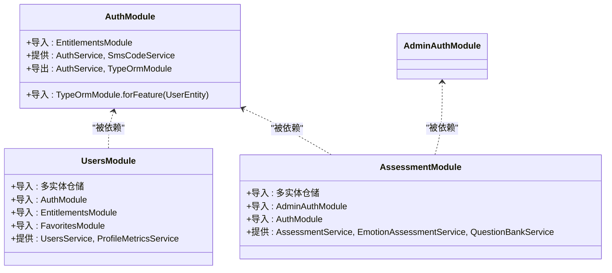
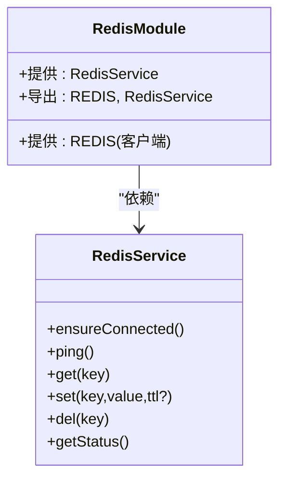
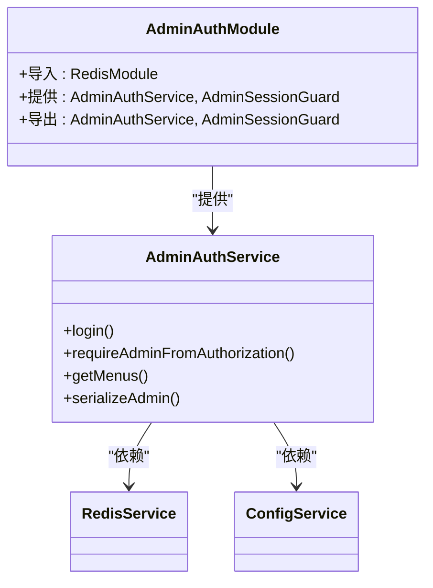
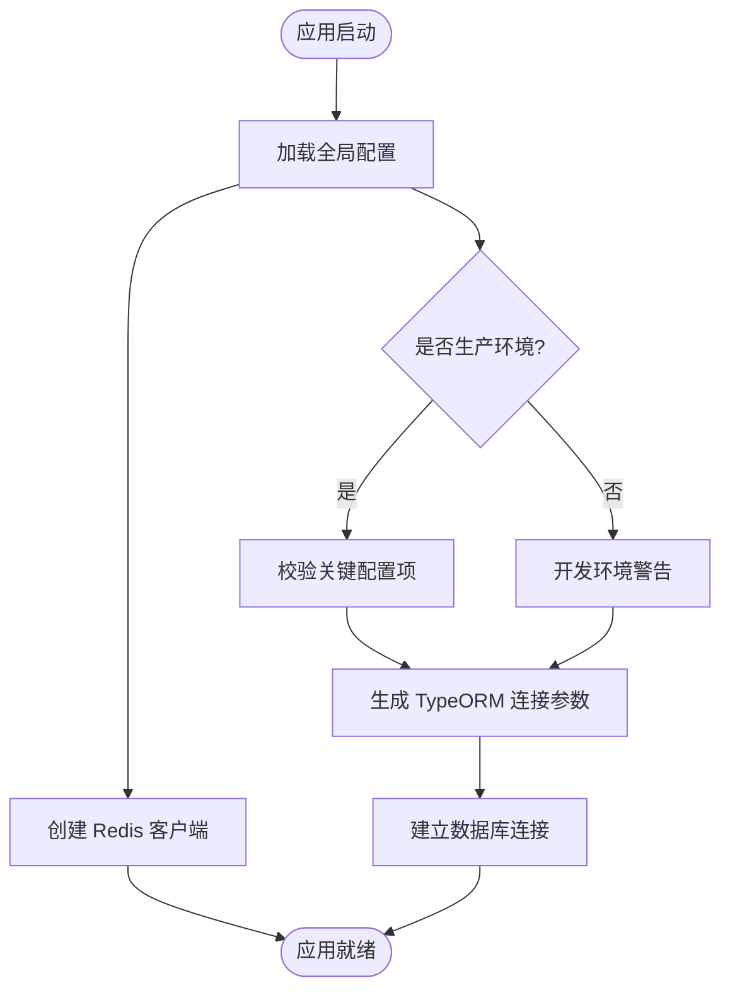
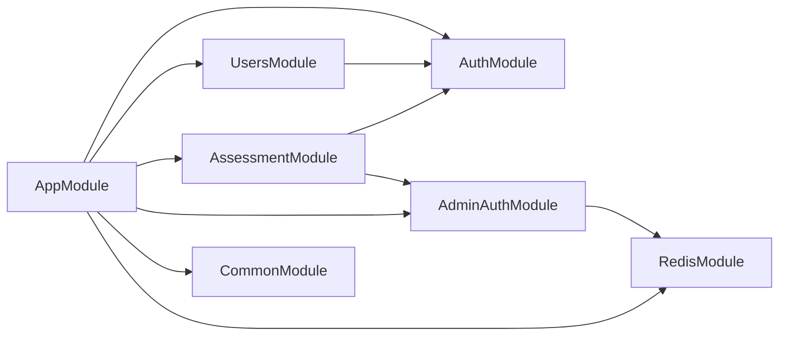

# 模块系统设计

<cite>
**本文引用的文件**
- [services/api/src/app.module.ts](file://services/api/src/app.module.ts)
- [services/api/src/main.ts](file://services/api/src/main.ts)
- [services/api/src/admin-auth/admin-auth.module.ts](file://services/api/src/admin-auth/admin-auth.module.ts)
- [services/api/src/assessment/assessment.module.ts](file://services/api/src/assessment/assessment.module.ts)
- [services/api/src/auth/auth.module.ts](file://services/api/src/auth/auth.module.ts)
- [services/api/src/users/users.module.ts](file://services/api/src/users/users.module.ts)
- [services/api/src/common/common.module.ts](file://services/api/src/common/common.module.ts)
- [services/api/src/redis/redis.module.ts](file://services/api/src/redis/redis.module.ts)
- [services/api/src/redis/redis.service.ts](file://services/api/src/redis/redis.service.ts)
- [services/api/src/admin-auth/admin-auth.service.ts](file://services/api/src/admin-auth/admin-auth.service.ts)
- [services/api/src/common/production-config.validator.ts](file://services/api/src/common/production-config.validator.ts)
- [services/api/src/database/data-source.ts](file://services/api/src/database/data-source.ts)
- [services/api/nest-cli.json](file://services/api/nest-cli.json)
</cite>

## 目录
1. [引言](#引言)
2. [项目结构](#项目结构)
3. [核心组件](#核心组件)
4. [架构总览](#架构总览)
5. [详细组件分析](#详细组件分析)
6. [依赖关系分析](#依赖关系分析)
7. [性能考量](#性能考量)
8. [故障排查指南](#故障排查指南)
9. [结论](#结论)
10. [附录](#附录)

## 引言
本文件面向 NestJS 模块系统设计与实现，结合仓库中的实际代码，系统阐述 @Module 装饰器的使用方法、模块声明、导入与导出机制、依赖注入配置；详解模块分类（功能模块、共享模块、可选模块、动态模块）的设计原则与使用场景；解释模块加载顺序、循环依赖处理与懒加载机制；给出业务模块拆分的最佳实践与模块生命周期管理方案，并覆盖配置管理与环境变量处理。

## 项目结构
服务端采用单体应用结构，入口模块集中声明所有子模块，形成“根模块统一编排”的组织方式。各业务域以独立模块划分，模块内部通过 TypeORM 实体、控制器、服务与 Guard 组织职责，公共能力以模块化服务形式提供。

图表来源
- [services/api/src/app.module.ts:61-144](file://services/api/src/app.module.ts#L61-L144)

章节来源
- [services/api/src/app.module.ts:1-145](file://services/api/src/app.module.ts#L1-L145)
- [services/api/src/main.ts:8-74](file://services/api/src/main.ts#L8-L74)

## 核心组件
- 应用入口模块（AppModule）
  - 全局配置：ConfigModule、TypeORM 动态配置、RedisModule、各业务模块导入。
  - 控制器：全局健康检查控制器。
  - 关键点：使用 ConfigService 在运行时读取环境变量，动态生成 TypeORM 连接参数；在开发/生产环境执行配置校验。
- 启动引导（main.ts）
  - 创建 Nest 应用实例，设置全局前缀、过滤器、拦截器、管道、CORS 策略，并从 ConfigService 获取端口等配置。
- 配置校验（production-config.validator.ts）
  - 生产环境严格校验关键配置项，拒绝弱口令、非 HTTPS、禁用项等不安全配置；开发环境仅发出警告提示。
- 数据源（data-source.ts）
  - 基于 TypeORM 的数据源定义，集中注册实体与迁移路径；与动态配置配合使用。

章节来源
- [services/api/src/app.module.ts:61-144](file://services/api/src/app.module.ts#L61-L144)
- [services/api/src/main.ts:8-74](file://services/api/src/main.ts#L8-L74)
- [services/api/src/common/production-config.validator.ts:25-104](file://services/api/src/common/production-config.validator.ts#L25-L104)
- [services/api/src/database/data-source.ts:32-72](file://services/api/src/database/data-source.ts#L32-L72)

## 架构总览
下图展示应用启动到请求处理的关键流程，体现模块加载顺序、依赖注入与配置生效路径。

图表来源
- [services/api/src/main.ts:8-62](file://services/api/src/main.ts#L8-L62)
- [services/api/src/app.module.ts:67-117](file://services/api/src/app.module.ts#L67-L117)
- [services/api/src/redis/redis.module.ts:7-31](file://services/api/src/redis/redis.module.ts#L7-L31)

## 详细组件分析

### 功能模块：认证与用户模块
- AuthModule
  - 导入：TypeORM 针对用户实体的仓储、EntitlementsModule。
  - 提供：Auth 服务、短信验证码服务。
  - 导出：Auth 服务、TypeORM 模块，便于其他模块复用仓储与认证能力。
- UsersModule
  - 导入：多实体仓储、AuthModule、EntitlementsModule、FavoritesModule。
  - 提供：用户服务、指标统计服务。
  - 设计要点：围绕用户相关实体聚合，避免跨模块直接访问实体，统一通过模块接口暴露。
- AssessmentModule
  - 导入：TypeORM 针对测评相关实体、AdminAuthModule、AuthModule。
  - 提供：测评、情感测评、题库相关服务。
  - 设计要点：将 AdminAuth 与 Auth 作为前置依赖，确保权限控制与用户上下文可用。

图表来源
- [services/api/src/auth/auth.module.ts:9-15](file://services/api/src/auth/auth.module.ts#L9-L15)
- [services/api/src/users/users.module.ts:22-45](file://services/api/src/users/users.module.ts#L22-L45)
- [services/api/src/assessment/assessment.module.ts:17-36](file://services/api/src/assessment/assessment.module.ts#L17-L36)

章节来源
- [services/api/src/auth/auth.module.ts:1-16](file://services/api/src/auth/auth.module.ts#L1-L16)
- [services/api/src/users/users.module.ts:1-46](file://services/api/src/users/users.module.ts#L1-L46)
- [services/api/src/assessment/assessment.module.ts:1-37](file://services/api/src/assessment/assessment.module.ts#L1-L37)

### 共享模块：RedisModule
- 特性：使用 @Global() 使 Redis 客户端在整个应用中可用，无需重复导入。
- 依赖注入：通过 provide/Inject 绑定自定义令牌，工厂函数从 ConfigService 读取连接参数。
- 服务封装：RedisService 对底层连接状态进行保障与错误降级，提供 get/set/del/ping 等常用操作。

图表来源
- [services/api/src/redis/redis.module.ts:7-31](file://services/api/src/redis/redis.module.ts#L7-L31)
- [services/api/src/redis/redis.service.ts:5-125](file://services/api/src/redis/redis.service.ts#L5-L125)

章节来源
- [services/api/src/redis/redis.module.ts:1-32](file://services/api/src/redis/redis.module.ts#L1-L32)
- [services/api/src/redis/redis.service.ts:1-125](file://services/api/src/redis/redis.service.ts#L1-L125)

### 管理后台模块：AdminAuthModule
- 导入：RedisModule。
- 提供：AdminAuthService、AdminSessionGuard。
- 导出：AdminAuthService、AdminSessionGuard，供管理端控制器与守卫使用。
- 关键点：AdminAuthService 使用 RedisService 存储会话，结合 ConfigService 读取管理员账号信息，实现会话校验与菜单过滤。

图表来源
- [services/api/src/admin-auth/admin-auth.module.ts:7-13](file://services/api/src/admin-auth/admin-auth.module.ts#L7-L13)
- [services/api/src/admin-auth/admin-auth.service.ts:17-119](file://services/api/src/admin-auth/admin-auth.service.ts#L17-L119)
- [services/api/src/redis/redis.service.ts:5-125](file://services/api/src/redis/redis.service.ts#L5-L125)

章节来源
- [services/api/src/admin-auth/admin-auth.module.ts:1-14](file://services/api/src/admin-auth/admin-auth.module.ts#L1-L14)
- [services/api/src/admin-auth/admin-auth.service.ts:1-119](file://services/api/src/admin-auth/admin-auth.service.ts#L1-L119)

### 公共模块：CommonModule
- 导入：审计日志实体仓储。
- 提供与导出：审计服务、图片生成服务、海报渲染服务、智谱图像服务。
- 设计要点：将跨领域通用能力收敛至公共模块，避免重复实现与分散耦合。

章节来源
- [services/api/src/common/common.module.ts:1-15](file://services/api/src/common/common.module.ts#L1-L15)

### 动态模块：AppModule 中的动态配置
- ConfigModule.forRoot({ isGlobal: true })：全局配置读取与变量展开。
- TypeOrmModule.forRootAsync：基于 ConfigService 动态生成连接参数，集中校验生产配置，支持迁移与同步策略。
- RedisModule：全局注册 Redis 客户端，延迟连接与重试策略增强稳定性。
- main.ts：全局 CORS、过滤器、拦截器、管道、前缀设置均来自 ConfigService。

图表来源
- [services/api/src/app.module.ts:63-117](file://services/api/src/app.module.ts#L63-L117)
- [services/api/src/common/production-config.validator.ts:25-104](file://services/api/src/common/production-config.validator.ts#L25-L104)
- [services/api/src/redis/redis.module.ts:13-25](file://services/api/src/redis/redis.module.ts#L13-L25)
- [services/api/src/main.ts:18-59](file://services/api/src/main.ts#L18-L59)

章节来源
- [services/api/src/app.module.ts:61-144](file://services/api/src/app.module.ts#L61-L144)
- [services/api/src/main.ts:8-74](file://services/api/src/main.ts#L8-L74)
- [services/api/src/common/production-config.validator.ts:106-114](file://services/api/src/common/production-config.validator.ts#L106-L114)

## 依赖关系分析
- 模块导入链路
  - AppModule 作为根模块，集中导入所有业务模块与基础设施模块。
  - UsersModule、AssessmentModule 明确依赖 AuthModule，确保用户上下文与权限能力可用。
  - AdminAuthModule 依赖 RedisModule，用于会话存储。
- 循环依赖处理
  - 通过模块拆分与明确的导入顺序避免循环依赖；若出现潜在循环，可考虑引入接口层或惰性导入。
- 懒加载机制
  - 通过动态模块与延迟连接（Redis.lazyConnect）降低启动时资源占用；TypeORM 支持按需加载实体与迁移。

图表来源
- [services/api/src/app.module.ts:119-141](file://services/api/src/app.module.ts#L119-L141)
- [services/api/src/users/users.module.ts:38-40](file://services/api/src/users/users.module.ts#L38-L40)
- [services/api/src/assessment/assessment.module.ts:26-27](file://services/api/src/assessment/assessment.module.ts#L26-L27)
- [services/api/src/admin-auth/admin-auth.module.ts:8](file://services/api/src/admin-auth/admin-auth.module.ts#L8)

章节来源
- [services/api/src/app.module.ts:1-145](file://services/api/src/app.module.ts#L1-L145)
- [services/api/src/users/users.module.ts:1-46](file://services/api/src/users/users.module.ts#L1-L46)
- [services/api/src/assessment/assessment.module.ts:1-37](file://services/api/src/assessment/assessment.module.ts#L1-L37)
- [services/api/src/admin-auth/admin-auth.module.ts:1-14](file://services/api/src/admin-auth/admin-auth.module.ts#L1-L14)

## 性能考量
- 启动阶段优化
  - 使用 Redis.lazyConnect 与延迟连接策略，减少启动阻塞。
  - TypeORM 迁移与同步策略由配置控制，避免在生产环境启用同步导致性能与一致性问题。
- 运行时优化
  - 全局拦截器与过滤器统一处理响应与异常，减少重复逻辑。
  - CORS 策略在运行时解析配置，避免硬编码带来的维护成本。
- 资源管理
  - RedisService 对连接状态进行保障与超时处理，提升稳定性。

章节来源
- [services/api/src/redis/redis.module.ts:17-25](file://services/api/src/redis/redis.module.ts#L17-L25)
- [services/api/src/redis/redis.service.ts:12-66](file://services/api/src/redis/redis.service.ts#L12-L66)
- [services/api/src/common/production-config.validator.ts:56-58](file://services/api/src/common/production-config.validator.ts#L56-L58)
- [services/api/src/main.ts:33-59](file://services/api/src/main.ts#L33-L59)

## 故障排查指南
- 配置相关
  - 生产环境配置校验失败：根据校验器输出逐项修正关键配置（如管理员账号、数据库密码、HTTPS 地址、支付配置等）。
  - 开发环境警告：关注 DB_SYNCHRONIZE 等仅限本地使用的配置项。
- Redis 连接问题
  - 检查 RedisModule 的连接参数与重试策略；使用 RedisService.ping 进行连通性测试。
- CORS 与端口
  - 核对 main.ts 中 CORS 允许来源与端口配置，确认环境变量是否正确。
- 数据库连接
  - 校验 TypeORM 动态配置返回值与实体列表，确认迁移与同步策略符合预期。

章节来源
- [services/api/src/common/production-config.validator.ts:25-104](file://services/api/src/common/production-config.validator.ts#L25-L104)
- [services/api/src/redis/redis.service.ts:68-77](file://services/api/src/redis/redis.service.ts#L68-L77)
- [services/api/src/main.ts:18-59](file://services/api/src/main.ts#L18-L59)
- [services/api/src/app.module.ts:67-117](file://services/api/src/app.module.ts#L67-L117)

## 结论
本项目以 AppModule 为中心，采用清晰的模块边界与职责分离，结合动态模块与共享模块，实现了高内聚、低耦合的服务组织方式。通过严格的配置校验与运行时优化，兼顾了开发效率与生产稳定性。建议在后续演进中持续完善模块间通信契约、引入更细粒度的领域事件与异步处理，以进一步提升可扩展性与可观测性。

## 附录
- 编译与资源打包配置参考
  - nest-cli.json 定义了源码目录与静态资源输出规则，便于构建与部署。

章节来源
- [services/api/nest-cli.json:1-15](file://services/api/nest-cli.json#L1-L15)