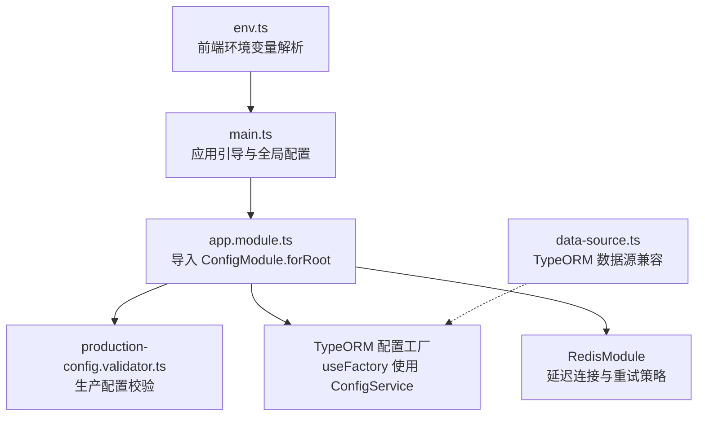
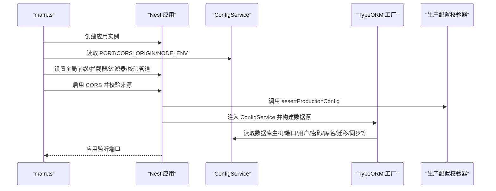
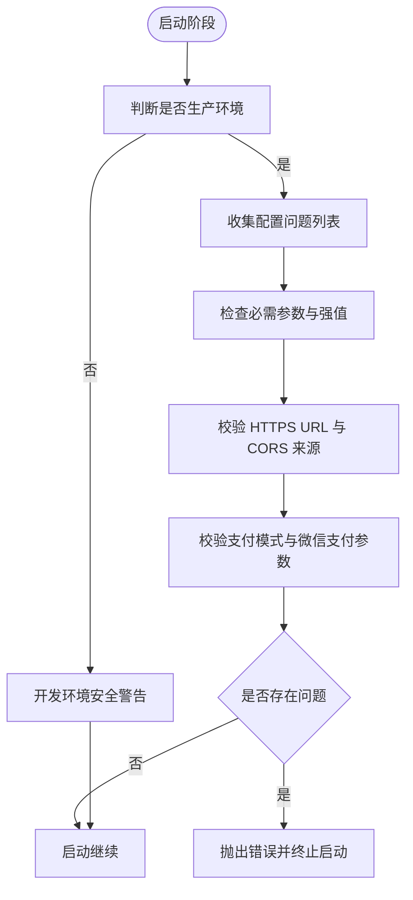
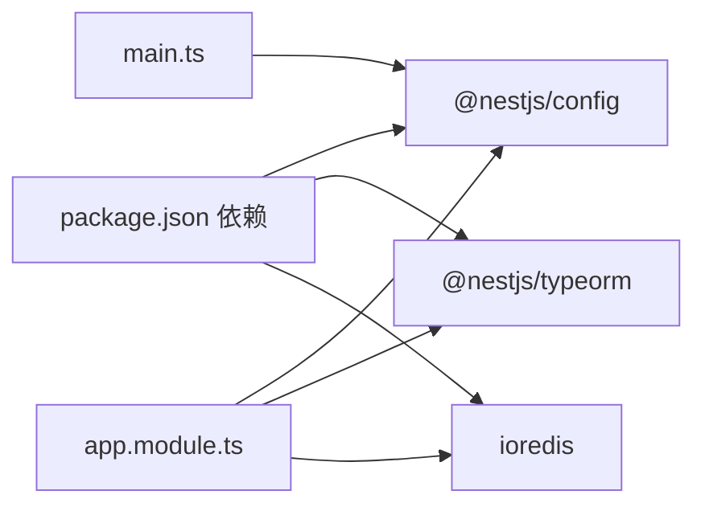

# 配置管理与环境变量

<cite>
**本文引用的文件**
- [services/api/src/main.ts](file://services/api/src/main.ts)
- [services/api/src/app.module.ts](file://services/api/src/app.module.ts)
- [services/api/src/common/production-config.validator.ts](file://services/api/src/common/production-config.validator.ts)
- [services/api/src/redis/redis.module.ts](file://services/api/src/redis/redis.module.ts)
- [services/api/src/database/data-source.ts](file://services/api/src/database/data-source.ts)
- [apps/mobile/src/config/env.ts](file://apps/mobile/src/config/env.ts)
- [services/api/package.json](file://services/api/package.json)
</cite>

## 目录
1. [简介](#简介)
2. [项目结构](#项目结构)
3. [核心组件](#核心组件)
4. [架构总览](#架构总览)
5. [详细组件分析](#详细组件分析)
6. [依赖关系分析](#依赖关系分析)
7. [性能考量](#性能考量)
8. [故障排查指南](#故障排查指南)
9. [结论](#结论)
10. [附录](#附录)

## 简介
本文件面向 NestJS 后端服务与前端移动端的配置管理与环境变量使用，系统性阐述以下主题：
- ConfigModule 的使用方式：配置文件加载、环境变量读取、配置验证
- 生产环境配置校验：必需参数检查、类型与格式验证、安全配置警告
- 多环境配置管理：开发、测试、生产环境的差异处理
- 动态配置更新机制：运行时配置修改、配置热更新、配置缓存策略
- 配置最佳实践：敏感信息保护、配置分组、默认值设置
- 安全性、性能优化与故障排查的实现方案

## 项目结构
后端采用 NestJS，前端采用 Vite + UniApp（H5/小程序）。配置相关的关键位置如下：
- 后端入口与全局配置：bootstrap 中读取端口、CORS 源、环境模式等
- 全局配置模块：ConfigModule.forRoot 并开启变量展开
- 生产配置校验：启动时对生产环境进行严格校验与安全警告
- 数据库与缓存：通过 ConfigService 注入配置；Redis 连接延迟建立
- 前端环境变量：基于 Vite 的 import.meta.env 与平台差异化选择

图表来源
- [services/api/src/main.ts:1-74](file://services/api/src/main.ts#L1-L74)
- [services/api/src/app.module.ts:61-117](file://services/api/src/app.module.ts#L61-L117)
- [services/api/src/common/production-config.validator.ts:25-104](file://services/api/src/common/production-config.validator.ts#L25-L104)
- [services/api/src/redis/redis.module.ts:7-31](file://services/api/src/redis/redis.module.ts#L7-L31)
- [services/api/src/database/data-source.ts:32-72](file://services/api/src/database/data-source.ts#L32-L72)
- [apps/mobile/src/config/env.ts:1-41](file://apps/mobile/src/config/env.ts#L1-L41)

章节来源
- [services/api/src/main.ts:1-74](file://services/api/src/main.ts#L1-L74)
- [services/api/src/app.module.ts:61-117](file://services/api/src/app.module.ts#L61-L117)
- [apps/mobile/src/config/env.ts:1-41](file://apps/mobile/src/config/env.ts#L1-L41)

## 核心组件
- ConfigModule 全局注册与变量展开：在根模块中通过 forRoot 注册，并设置 isGlobal 与 expandVariables，确保全局可用且支持变量替换。
- ConfigService 使用：在 bootstrap 中读取端口、CORS 源、环境模式；在 TypeORM 工厂与 RedisModule 中注入 ConfigService 获取数据库、缓存等配置。
- 生产配置校验器：assertProductionConfig 在启动阶段收集并报告生产环境不完整或不安全的配置项；warnIfUnsafeDevelopmentConfig 对开发环境给出安全警告。
- 前端环境变量：根据平台与开发/生产模式从 import.meta.env 中挑选合适的 API 基础地址。

章节来源
- [services/api/src/app.module.ts:61-117](file://services/api/src/app.module.ts#L61-L117)
- [services/api/src/main.ts:8-61](file://services/api/src/main.ts#L8-L61)
- [services/api/src/common/production-config.validator.ts:25-114](file://services/api/src/common/production-config.validator.ts#L25-L114)
- [apps/mobile/src/config/env.ts:13-41](file://apps/mobile/src/config/env.ts#L13-L41)

## 架构总览
下图展示后端启动流程中的配置读取与校验路径，以及数据库与缓存模块如何通过 ConfigService 注入配置。

图表来源
- [services/api/src/main.ts:8-61](file://services/api/src/main.ts#L8-L61)
- [services/api/src/app.module.ts:67-117](file://services/api/src/app.module.ts#L67-L117)
- [services/api/src/common/production-config.validator.ts:25-104](file://services/api/src/common/production-config.validator.ts#L25-L104)

## 详细组件分析

### ConfigModule 使用与配置加载
- 全局注册：在根模块导入 ConfigModule.forRoot，并设置 isGlobal 与 expandVariables，使配置可在全局范围内使用且支持变量展开。
- 默认值策略：在读取配置时提供合理的默认值，避免因缺失导致的异常。
- 与 TypeORM 集成：通过 useFactory 注入 ConfigService，在工厂函数内读取数据库相关配置并返回数据源配置对象。
- 与 Redis 集成：在 RedisModule 中通过 provider 的 useFactory 注入 ConfigService，按需读取 Redis 主机、端口等配置，并启用延迟连接与重试策略。

章节来源
- [services/api/src/app.module.ts:61-117](file://services/api/src/app.module.ts#L61-L117)
- [services/api/src/redis/redis.module.ts:7-31](file://services/api/src/redis/redis.module.ts#L7-L31)

### 环境变量读取与 CORS 配置
- 端口与环境：从 ConfigService 读取 PORT，默认值为 3001；通过 NODE_ENV 判断是否为生产环境。
- CORS 源：从 ConfigService 读取 CORS_ORIGIN 字符串，按逗号拆分并去重，支持本地开发来源校验。
- 全局中间件：设置全局前缀、拦截器、过滤器与 ValidationPipe，统一处理请求与响应。

章节来源
- [services/api/src/main.ts:8-61](file://services/api/src/main.ts#L8-L61)

### 生产环境配置校验
- 校验触发时机：在 TypeORM 工厂中调用 assertProductionConfig，确保生产环境配置完整且安全。
- 校验内容：
  - 必需参数：管理员账号、密码、数据库密码、短信 pepper、微信 App ID/Secret、公共 API 与文件服务基础 URL 等
  - 安全要求：URL 必须为 HTTPS 且非本地回环；禁止在生产环境启用 DB_SYNCHRONIZE、微信登录 Mock、短信 Provider 为 mock、默认短信验证码等
  - 支付模式：仅允许 disabled 或 wechat，且微信支付需提供商户号、API v3 key、证书序列号、回调地址，至少提供私钥或私钥路径之一
- 开发环境警告：当 DB_SYNCHRONIZE=true 时输出警告，提示仅用于本地临时数据库

图表来源
- [services/api/src/common/production-config.validator.ts:25-104](file://services/api/src/common/production-config.validator.ts#L25-L104)

章节来源
- [services/api/src/common/production-config.validator.ts:25-114](file://services/api/src/common/production-config.validator.ts#L25-L114)

### 多环境配置管理
- 环境标识：通过 NODE_ENV 区分 development、production 等环境。
- 默认值策略：在读取配置时提供合理默认值，保证开发与测试环境可快速启动。
- CORS 来源：在非生产环境允许本地开发来源，生产环境强制 HTTPS 与明确来源白名单。
- 数据库行为：通过 DB_RUN_MIGRATIONS、DB_SYNCHRONIZE 控制迁移执行与自动同步，生产环境建议仅使用迁移。

章节来源
- [services/api/src/main.ts:30-59](file://services/api/src/main.ts#L30-L59)
- [services/api/src/app.module.ts:112-113](file://services/api/src/app.module.ts#L112-L113)

### 动态配置更新机制
- 运行时配置读取：ConfigService 提供 get 方法按需读取配置，适合在模块初始化或服务方法中使用。
- 缓存策略：ConfigService 内部对已读取的配置键进行缓存，避免重复解析与 IO。
- 热更新能力：当前代码未显式实现“热更新”机制；若需热更新，可在业务层引入配置中心或事件订阅，结合 ConfigService 的 get 方法在运行时重新读取配置并刷新相关服务状态。
- 建议实现思路（概念性）：通过消息总线或轮询拉取配置中心变更，触发服务重建或参数刷新，同时保持对外接口稳定。

章节来源
- [services/api/src/app.module.ts:67-117](file://services/api/src/app.module.ts#L67-L117)

### 前端环境变量与平台差异化
- 平台识别：通过 uni.getSystemInfoSync 获取 uniPlatform，区分小程序平台（如 mp-weixin）与其他平台。
- 开发/生产切换：根据 import.meta.env.DEV 选择开发或生产下的 API 基础地址。
- 值选择策略：使用 pickEnvValue 从多个候选值中选取首个非空字符串，确保优先使用显式覆盖值。

章节来源
- [apps/mobile/src/config/env.ts:1-41](file://apps/mobile/src/config/env.ts#L1-L41)

## 依赖关系分析
- 后端依赖 @nestjs/config 提供配置管理能力；@nestjs/typeorm 与 ioredis 通过 ConfigService 注入配置。
- 启动流程耦合点：main.ts 与 app.module.ts 的协作，前者负责运行时配置读取与 CORS，后者负责模块级配置与校验。
- 风险点：若生产环境缺少必要配置或使用弱默认值，assertProductionConfig 会直接抛错阻止启动。

图表来源
- [services/api/package.json:26-46](file://services/api/package.json#L26-L46)
- [services/api/src/main.ts:1-10](file://services/api/src/main.ts#L1-L10)
- [services/api/src/app.module.ts:9-117](file://services/api/src/app.module.ts#L9-L117)

章节来源
- [services/api/package.json:26-46](file://services/api/package.json#L26-L46)
- [services/api/src/main.ts:1-10](file://services/api/src/main.ts#L1-L10)
- [services/api/src/app.module.ts:9-117](file://services/api/src/app.module.ts#L9-L117)

## 性能考量
- Redis 连接策略：启用 lazyConnect、maxRetriesPerRequest、enableReadyCheck 与自定义重连策略，降低连接抖动对启动与运行的影响。
- CORS 校验：在启动阶段完成一次解析与校验，避免每次请求重复解析来源列表。
- 数据库同步：生产环境禁用 DB_SYNCHRONIZE，改用迁移脚本，减少同步开销与一致性风险。
- 缓存命中：ConfigService 对已读取配置键进行缓存，减少重复解析成本。

章节来源
- [services/api/src/redis/redis.module.ts:14-25](file://services/api/src/redis/redis.module.ts#L14-L25)
- [services/api/src/app.module.ts:112-113](file://services/api/src/app.module.ts#L112-L113)

## 故障排查指南
- 启动失败（生产配置不合规）
  - 现象：应用启动即抛出错误，列出不完整或不安全的配置项
  - 排查：对照生产配置校验清单逐项检查，修正缺失或弱默认值
  - 参考：assertProductionConfig 与 collectProductionConfigIssues 的规则
- CORS 拒绝访问
  - 现象：浏览器报跨域错误
  - 排查：确认 CORS_ORIGIN 是否为 HTTPS 来源，且未包含本地回环地址；开发环境可接受本地来源
  - 参考：main.ts 中 CORS 配置与 isLocalDevOrigin 辅助函数
- 数据库无法连接或结构不一致
  - 现象：TypeORM 初始化失败或实体不匹配
  - 排查：确认数据库主机、端口、用户名、密码、库名；生产环境应使用迁移而非 DB_SYNCHRONIZE
  - 参考：TypeORM 工厂与 data-source.ts 的配置读取
- Redis 连接不稳定
  - 现象：连接频繁断开或超时
  - 排查：检查主机、端口、网络策略；关注重连策略与只读/连接类错误的处理
  - 参考：RedisModule 的连接配置

章节来源
- [services/api/src/common/production-config.validator.ts:25-104](file://services/api/src/common/production-config.validator.ts#L25-L104)
- [services/api/src/main.ts:44-59](file://services/api/src/main.ts#L44-L59)
- [services/api/src/app.module.ts:67-117](file://services/api/src/app.module.ts#L67-L117)
- [services/api/src/database/data-source.ts:32-72](file://services/api/src/database/data-source.ts#L32-L72)
- [services/api/src/redis/redis.module.ts:14-25](file://services/api/src/redis/redis.module.ts#L14-L25)

## 结论
本项目在 NestJS 中实现了完善的配置管理与环境变量使用：
- 通过 ConfigModule 全局化配置读取与变量展开
- 在启动阶段对生产环境进行严格校验与安全警告
- 以默认值与灵活的读取策略支撑多环境部署
- 通过延迟连接与重试策略提升 Redis 的稳定性
- 建议在需要时引入配置中心以实现真正的“热更新”，并在生产环境持续监控配置合规性

## 附录
- 最佳实践摘要
  - 敏感信息保护：严禁在代码中硬编码密钥；使用强默认值检测与 HTTPS 强约束
  - 配置分组：将数据库、缓存、第三方服务等配置按模块分组，便于维护
  - 默认值设置：为开发与测试提供合理默认值，但生产必须显式覆盖
  - 安全性：生产环境禁用 DB_SYNCHRONIZE、Mock 与弱默认值；支付与微信相关配置必须齐全
  - 性能：利用 ConfigService 缓存、延迟连接与重试策略，减少启动与运行时开销
  - 故障排查：结合日志与校验器输出定位问题，优先修复缺失与弱默认值