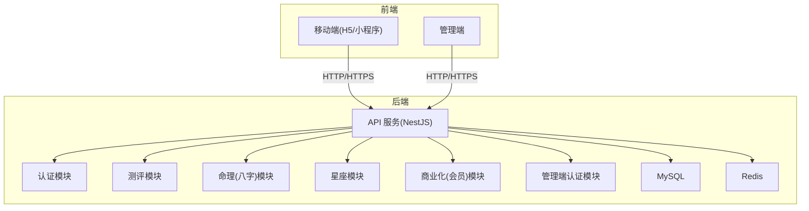
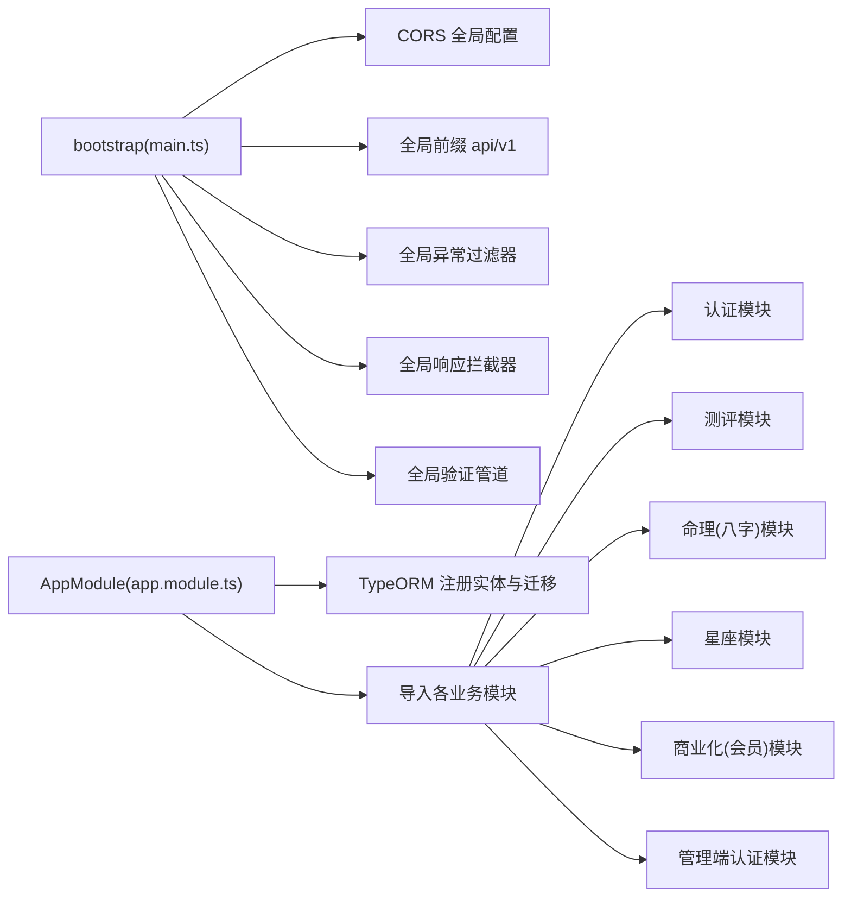
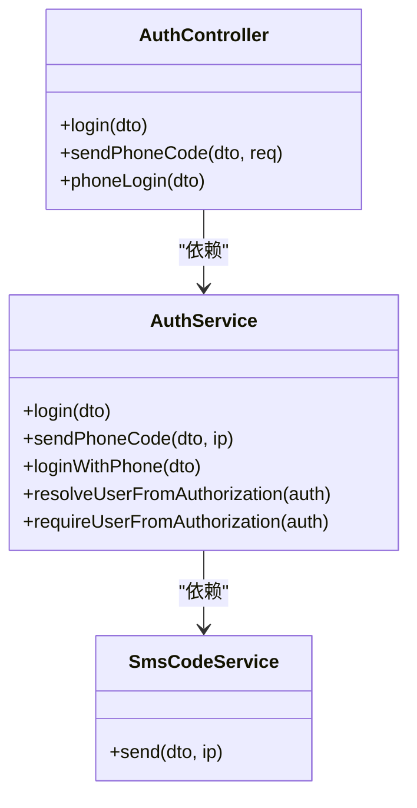
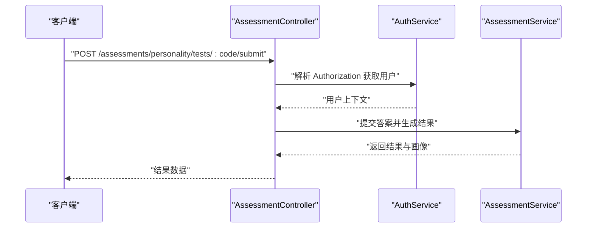
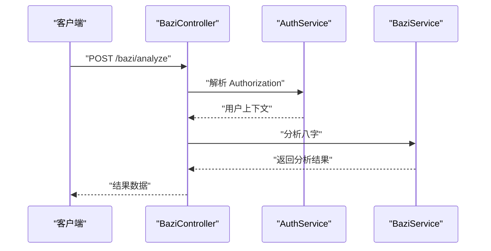
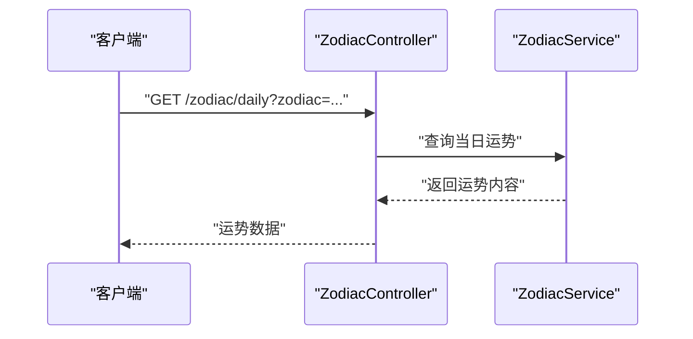
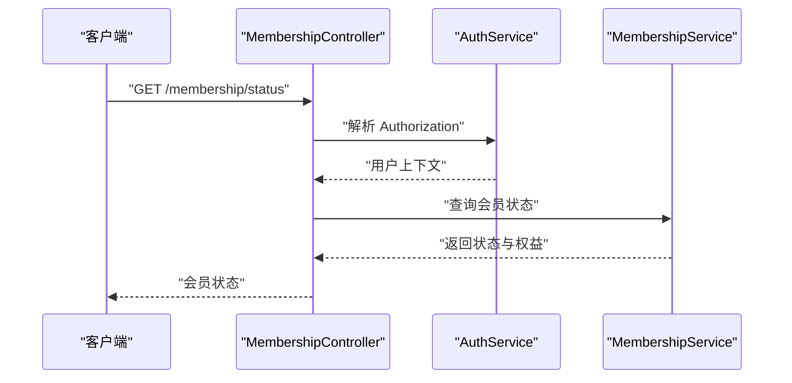
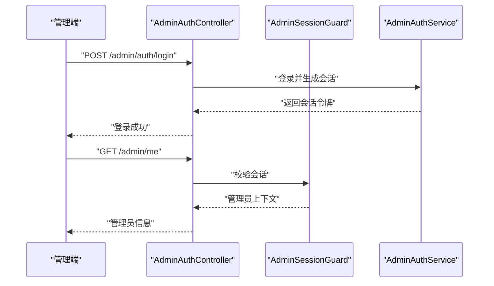
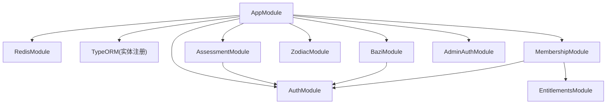

# 业务模块开发

<cite>
**本文引用的文件**
- [README.md](file://README.md)
- [开发文档.md](file://docs/开发文档.md)
- [app.module.ts](file://services/api/src/app.module.ts)
- [main.ts](file://services/api/src/main.ts)
- [auth.module.ts](file://services/api/src/auth/auth.module.ts)
- [assessment.module.ts](file://services/api/src/assessment/assessment.module.ts)
- [bazi.module.ts](file://services/api/src/bazi/bazi.module.ts)
- [zodiac.module.ts](file://services/api/src/zodiac/zodiac.module.ts)
- [membership.module.ts](file://services/api/src/membership/membership.module.ts)
- [admin-auth.module.ts](file://services/api/src/admin-auth/admin-auth.module.ts)
- [auth.controller.ts](file://services/api/src/auth/auth.controller.ts)
- [assessment.controller.ts](file://services/api/src/assessment/assessment.controller.ts)
- [bazi.controller.ts](file://services/api/src/bazi/bazi.controller.ts)
- [zodiac.controller.ts](file://services/api/src/zodiac/zodiac.controller.ts)
- [membership.controller.ts](file://services/api/src/membership/membership.controller.ts)
- [admin-auth.controller.ts](file://services/api/src/admin-auth/admin-auth.controller.ts)
- [package.json（移动端）](file://apps/mobile/package.json)
- [package.json（管理端）](file://apps/admin/package.json)
</cite>

## 目录
1. [引言](#引言)
2. [项目结构](#项目结构)
3. [核心组件](#核心组件)
4. [架构总览](#架构总览)
5. [详细组件分析](#详细组件分析)
6. [依赖分析](#依赖分析)
7. [性能考虑](#性能考虑)
8. [故障排查指南](#故障排查指南)
9. [结论](#结论)
10. [附录](#附录)

## 引言
本技术指南面向 Fortune Hub 业务模块开发，聚焦认证、测评、命理（八字）、星座、商业化等核心模块的职责划分、设计模式与架构实现。文档从系统架构、模块边界、数据与控制流、服务层抽象、DTO 使用、模块化最佳实践、扩展性设计、监控与性能分析等方面进行系统化阐述，并提供可视化图示帮助不同背景读者快速理解与落地。

## 项目结构
Fortune Hub 采用 monorepo 结构，包含移动端（uni-app/Vue3）、管理端（Vue3/Vite/Element Plus）、API 服务（NestJS + TypeORM + MySQL + Redis），并通过 Nginx 进行反向代理与路由分发。API 层通过模块化方式组织业务域，每个业务模块自包含 Controller/Service/DTO/Entity/Module，便于演进与复用。

图表来源
- [app.module.ts:1-145](file://services/api/src/app.module.ts#L1-L145)
- [main.ts:1-74](file://services/api/src/main.ts#L1-L74)

章节来源
- [README.md:18-37](file://README.md#L18-L37)
- [开发文档.md:129-142](file://docs/开发文档.md#L129-L142)

## 核心组件
- 认证模块：负责微信登录、短信验证码、手机号登录、用户会话与权限解析；对外暴露 DTO、Service 与 Controller。
- 测评模块：提供性格测评与情绪自检的题库、答题、提交、历史查询与结果画像配置。
- 命理（八字）模块：提供八字分析、专业分析、历史记录与出生地检索。
- 星座模块：提供今日/每日/每周/每月/年度运势、配对与知识卡片。
- 商业化（会员）模块：提供会员状态查询与权益解析。
- 管理端认证模块：提供管理员登录、菜单与会话守卫。

章节来源
- [auth.module.ts:1-16](file://services/api/src/auth/auth.module.ts#L1-L16)
- [assessment.module.ts:1-37](file://services/api/src/assessment/assessment.module.ts#L1-L37)
- [bazi.module.ts:1-15](file://services/api/src/bazi/bazi.module.ts#L1-L15)
- [zodiac.module.ts:1-14](file://services/api/src/zodiac/zodiac.module.ts#L1-L14)
- [membership.module.ts:1-20](file://services/api/src/membership/membership.module.ts#L1-L20)
- [admin-auth.module.ts:1-14](file://services/api/src/admin-auth/admin-auth.module.ts#L1-L14)

## 架构总览
API 服务通过全局前缀、过滤器、拦截器与管道统一处理请求；TypeORM 注入多个业务实体；各业务模块按需引入 TypeORM 实体与依赖模块，形成清晰的领域边界与低耦合的服务层。

图表来源
- [main.ts:8-62](file://services/api/src/main.ts#L8-L62)
- [app.module.ts:61-141](file://services/api/src/app.module.ts#L61-L141)

章节来源
- [main.ts:1-74](file://services/api/src/main.ts#L1-L74)
- [app.module.ts:1-145](file://services/api/src/app.module.ts#L1-L145)

## 详细组件分析

### 认证模块（Auth）
职责与边界
- 提供微信登录、短信验证码发送、手机号登录。
- 解析与校验用户会话，为其他模块提供用户上下文。
- 与 Redis/数据库交互，确保会话与用户状态一致。

设计模式
- 控制器-服务-DTO 分层，服务层封装业务规则与外部依赖。
- 使用 TypeORM 实体与仓储模式抽象数据访问。
- 通过全局管道与过滤器保证输入校验与异常统一处理。

图表来源
- [auth.controller.ts:1-36](file://services/api/src/auth/auth.controller.ts#L1-L36)
- [auth.module.ts:1-16](file://services/api/src/auth/auth.module.ts#L1-L16)

章节来源
- [auth.controller.ts:1-36](file://services/api/src/auth/auth.controller.ts#L1-L36)
- [auth.module.ts:1-16](file://services/api/src/auth/auth.module.ts#L1-L16)

### 测评模块（Assessment）
职责与边界
- 提供性格测评与情绪自检的测试集查询、详情、提交与历史查询。
- 与题库、测试配置、用户记录等实体协作，产出结果画像与海报配置。

设计模式
- 控制器仅负责参数解析与鉴权，业务逻辑集中在服务层。
- DTO 严格约束请求参数，避免脏数据进入服务层。
- 通过模块内 TypeORM 实体注册，隔离数据访问。

图表来源
- [assessment.controller.ts:1-39](file://services/api/src/assessment/assessment.controller.ts#L1-L39)
- [assessment.module.ts:1-37](file://services/api/src/assessment/assessment.module.ts#L1-L37)

章节来源
- [assessment.controller.ts:1-39](file://services/api/src/assessment/assessment.controller.ts#L1-L39)
- [assessment.module.ts:1-37](file://services/api/src/assessment/assessment.module.ts#L1-L37)

### 命理（八字）模块（Bazi）
职责与边界
- 提供八字分析、专业分析、历史记录查询与出生地检索。
- 与用户记录实体协作，保障分析结果与用户绑定。

设计模式
- 控制器负责参数与鉴权，服务层封装算法与外部依赖。
- 通过模块内实体注册与 Auth 模块集成，确保用户上下文可用。

图表来源
- [bazi.controller.ts:1-54](file://services/api/src/bazi/bazi.controller.ts#L1-L54)
- [bazi.module.ts:1-15](file://services/api/src/bazi/bazi.module.ts#L1-L15)

章节来源
- [bazi.controller.ts:1-54](file://services/api/src/bazi/bazi.controller.ts#L1-L54)
- [bazi.module.ts:1-15](file://services/api/src/bazi/bazi.module.ts#L1-L15)

### 星座模块（Zodiac）
职责与边界
- 提供今日/每日/每周/每月/年度运势、配对与知识卡片。
- 依赖内容实体与服务层组合文案与配置。

设计模式
- 控制器仅负责参数与查询，服务层负责内容拼装与规则。
- 通过模块导出服务，便于其他模块复用。

图表来源
- [zodiac.controller.ts:1-47](file://services/api/src/zodiac/zodiac.controller.ts#L1-L47)
- [zodiac.module.ts:1-14](file://services/api/src/zodiac/zodiac.module.ts#L1-L14)

章节来源
- [zodiac.controller.ts:1-47](file://services/api/src/zodiac/zodiac.controller.ts#L1-L47)
- [zodiac.module.ts:1-14](file://services/api/src/zodiac/zodiac.module.ts#L1-L14)

### 商业化（会员）模块（Membership）
职责与边界
- 提供会员状态查询，结合权益模块与认证模块判断用户权益。

设计模式
- 控制器仅负责鉴权与调用服务，服务层封装权益判定。
- 通过模块导出服务，便于在其他模块中复用。

图表来源
- [membership.controller.ts:1-18](file://services/api/src/membership/membership.controller.ts#L1-L18)
- [membership.module.ts:1-20](file://services/api/src/membership/membership.module.ts#L1-L20)

章节来源
- [membership.controller.ts:1-18](file://services/api/src/membership/membership.controller.ts#L1-L18)
- [membership.module.ts:1-20](file://services/api/src/membership/membership.module.ts#L1-L20)

### 管理端认证模块（AdminAuth）
职责与边界
- 提供管理员登录、个人信息与菜单查询。
- 通过会话守卫保护受控接口。

设计模式
- 控制器仅负责参数与鉴权，服务层封装会话与菜单逻辑。
- 通过 Redis 模块存储会话，确保跨实例一致性。

图表来源
- [admin-auth.controller.ts:1-45](file://services/api/src/admin-auth/admin-auth.controller.ts#L1-L45)
- [admin-auth.module.ts:1-14](file://services/api/src/admin-auth/admin-auth.module.ts#L1-L14)

章节来源
- [admin-auth.controller.ts:1-45](file://services/api/src/admin-auth/admin-auth.controller.ts#L1-L45)
- [admin-auth.module.ts:1-14](file://services/api/src/admin-auth/admin-auth.module.ts#L1-L14)

## 依赖分析
模块间依赖关系
- AppModule 导入所有业务模块与基础设施模块（Redis、配置、TypeORM）。
- 各业务模块按需引入 TypeORM 实体与依赖模块（如 AuthModule、EntitlementsModule）。
- 控制器依赖服务层，服务层依赖实体与外部能力（短信、海报渲染等）。

图表来源
- [app.module.ts:61-141](file://services/api/src/app.module.ts#L61-L141)

章节来源
- [app.module.ts:1-145](file://services/api/src/app.module.ts#L1-L145)

## 性能考虑
- 请求处理链路优化
  - 全局管道启用隐式转换与白名单校验，减少无效参数进入服务层。
  - 全局拦截器统一响应格式，降低重复序列化成本。
  - 全局异常过滤器集中处理错误，避免异常穿透。
- 数据访问优化
  - TypeORM 实体按模块注册，避免不必要的扫描与加载。
  - 合理使用查询构造与索引，结合迁移脚本持续优化。
- 缓存与会话
  - 管理端会话通过 Redis 存储，支持水平扩展与高可用。
- 前端与后端协同
  - 移动端与管理端分别维护独立包脚本，便于差异化构建与部署。
  - API 服务通过全局前缀与 CORS 配置，确保跨端访问安全可控。

章节来源
- [main.ts:35-59](file://services/api/src/main.ts#L35-L59)
- [app.module.ts:67-117](file://services/api/src/app.module.ts#L67-L117)
- [package.json（移动端）:4-37](file://apps/mobile/package.json#L4-L37)
- [package.json（管理端）:6-10](file://apps/admin/package.json#L6-L10)

## 故障排查指南
- CORS 问题
  - 检查 CORS 允许来源是否包含本地开发地址或生产域名。
  - 确认 Credentials 与 AllowedHeaders 配置正确。
- 鉴权失败
  - 确认 Authorization 头是否正确传递。
  - 检查会话守卫与用户解析逻辑是否正常。
- 数据库连接
  - 校验 TypeORM 配置项（主机、端口、用户名、密码、数据库、时区）。
  - 确认迁移开关与同步开关在不同环境下的取值。
- 异常处理
  - 使用全局异常过滤器捕获未处理异常，输出统一错误格式。
- 日志与可观测性
  - 在控制器与服务层添加必要日志点，便于定位问题。
  - 对关键流程（登录、提交、分析、生成海报）增加埋点与追踪 ID。

章节来源
- [main.ts:12-59](file://services/api/src/main.ts#L12-L59)
- [app.module.ts:67-117](file://services/api/src/app.module.ts#L67-L117)

## 结论
本指南从架构、模块、数据流、设计模式与最佳实践五个维度，系统梳理了 Fortune Hub 的业务模块开发要点。通过模块化、服务层抽象、DTO 规范与统一中间件，实现了清晰的职责边界与良好的扩展性。建议在后续迭代中进一步完善商业化闭环、模板体系与生产治理，持续提升系统的稳定性与可运维性。

## 附录
- 快速启动与开发
  - 根目录安装依赖后，分别启动 API、管理端与移动端开发服务。
  - 本地联调地址与默认路由约定见 README。
- 文档与排期
  - 开发文档、接口文档、数据库设计文档与排期表为后续推进的重要参考。

章节来源
- [README.md:66-137](file://README.md#L66-L137)
- [开发文档.md:172-182](file://docs/开发文档.md#L172-L182)