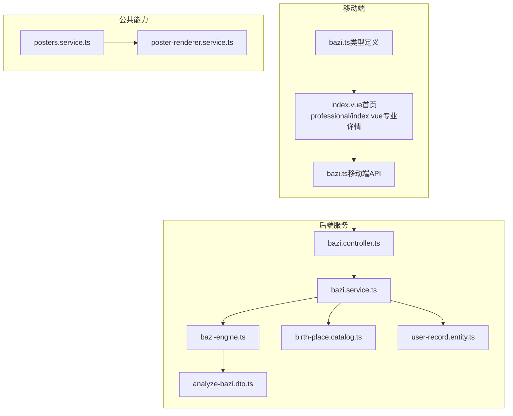
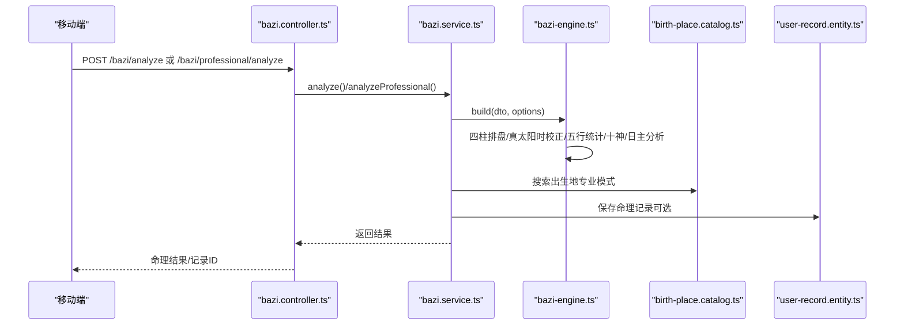
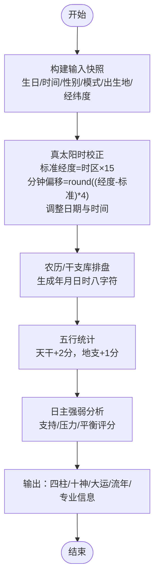
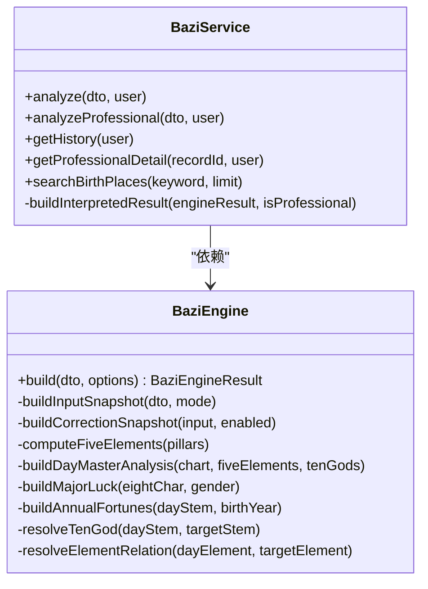
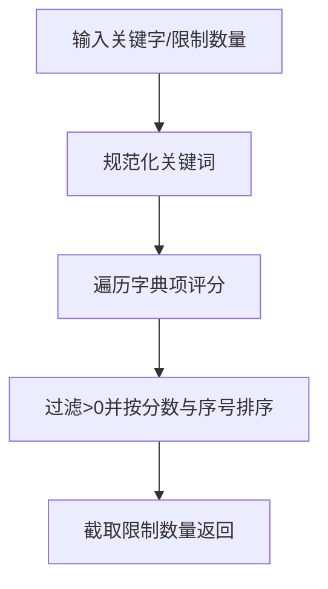
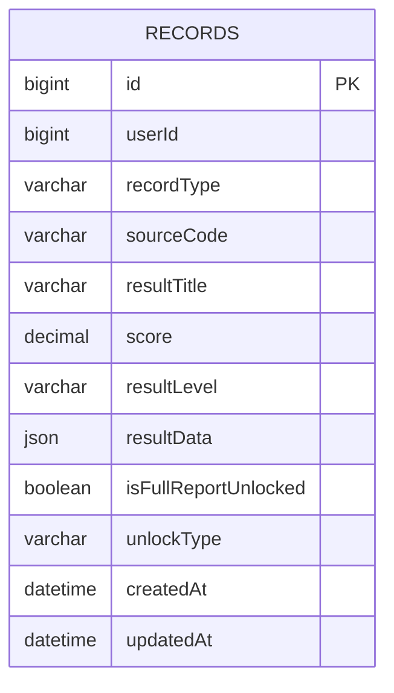
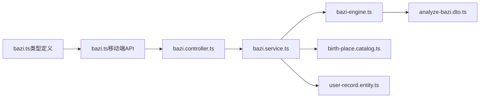

# 八字命理模块

<cite>
**本文引用的文件**
- [bazi.controller.ts](file://services/api/src/bazi/bazi.controller.ts)
- [bazi.service.ts](file://services/api/src/bazi/bazi.service.ts)
- [bazi-engine.ts](file://services/api/src/bazi/bazi-engine.ts)
- [birth-place.catalog.ts](file://services/api/src/bazi/birth-place.catalog.ts)
- [analyze-bazi.dto.ts](file://services/api/src/bazi/dto/analyze-bazi.dto.ts)
- [user-record.entity.ts](file://services/api/src/database/entities/user-record.entity.ts)
- [bazi.ts](file://apps/mobile/src/types/bazi.ts)
- [bazi.ts（移动端API）](file://apps/mobile/src/api/bazi.ts)
- [index.vue（移动端专业详情页）](file://apps/mobile/src/pages/bazi/professional/index.vue)
- [index.vue（移动端首页）](file://apps/mobile/src/pages/bazi/index.vue)
- [poster-renderer.service.ts](file://services/api/src/common/poster-renderer.service.ts)
- [posters.service.ts](file://services/api/src/posters/posters.service.ts)
- [bazi.service.spec.ts](file://services/api/src/bazi/bazi.service.spec.ts)
</cite>

## 目录
1. [简介](#简介)
2. [项目结构](#项目结构)
3. [核心组件](#核心组件)
4. [架构总览](#架构总览)
5. [详细组件分析](#详细组件分析)
6. [依赖关系分析](#依赖关系分析)
7. [性能考虑](#性能考虑)
8. [故障排查指南](#故障排查指南)
9. [结论](#结论)
10. [附录](#附录)

## 简介
本技术文档面向八字命理模块，系统性阐述四柱排盘算法、命理分析引擎、出生地点数据字典、民俗解读实现、数据存储与缓存策略，以及准确性验证与质量保障措施。文档兼顾工程实现细节与非技术读者的理解需求，提供可视化图示与分层讲解。

## 项目结构
八字命理模块位于后端 NestJS 服务与前端 UniApp 移动端之间，采用“控制器-服务-引擎-数据字典-实体”的分层组织。后端通过分析接口接收出生信息，调用命理引擎计算四柱、五行、十神与大运流年，结合出生地点字典进行真太阳时校正；移动端负责输入采集、展示与分享海报生成。

**图表来源**
- [bazi.controller.ts:1-54](file://services/api/src/bazi/bazi.controller.ts#L1-L54)
- [bazi.service.ts:1-436](file://services/api/src/bazi/bazi.service.ts#L1-L436)
- [bazi-engine.ts:1-647](file://services/api/src/bazi/bazi-engine.ts#L1-L647)
- [birth-place.catalog.ts:1-140](file://services/api/src/bazi/birth-place.catalog.ts#L1-L140)
- [user-record.entity.ts:1-50](file://services/api/src/database/entities/user-record.entity.ts#L1-L50)
- [bazi.ts（移动端API）:1-42](file://apps/mobile/src/api/bazi.ts#L1-L42)
- [bazi.ts:1-250](file://apps/mobile/src/types/bazi.ts#L1-L250)
- [index.vue（移动端首页）:1-200](file://apps/mobile/src/pages/bazi/index.vue#L1-L200)
- [index.vue（移动端专业详情页）:1-800](file://apps/mobile/src/pages/bazi/professional/index.vue#L1-L800)
- [poster-renderer.service.ts:2230-2343](file://services/api/src/common/poster-renderer.service.ts#L2230-L2343)
- [posters.service.ts:1329-1381](file://services/api/src/posters/posters.service.ts#L1329-L1381)

**章节来源**
- [bazi.controller.ts:1-54](file://services/api/src/bazi/bazi.controller.ts#L1-L54)
- [bazi.service.ts:1-436](file://services/api/src/bazi/bazi.service.ts#L1-L436)
- [bazi-engine.ts:1-647](file://services/api/src/bazi/bazi-engine.ts#L1-L647)
- [birth-place.catalog.ts:1-140](file://services/api/src/bazi/birth-place.catalog.ts#L1-L140)
- [user-record.entity.ts:1-50](file://services/api/src/database/entities/user-record.entity.ts#L1-L50)
- [bazi.ts（移动端API）:1-42](file://apps/mobile/src/api/bazi.ts#L1-L42)
- [bazi.ts:1-250](file://apps/mobile/src/types/bazi.ts#L1-L250)
- [index.vue（移动端首页）:1-200](file://apps/mobile/src/pages/bazi/index.vue#L1-L200)
- [index.vue（移动端专业详情页）:1-800](file://apps/mobile/src/pages/bazi/professional/index.vue#L1-L800)
- [poster-renderer.service.ts:2230-2343](file://services/api/src/common/poster-renderer.service.ts#L2230-L2343)
- [posters.service.ts:1329-1381](file://services/api/src/posters/posters.service.ts#L1329-L1381)

## 核心组件
- 控制器：提供分析、历史查询、专业详情与出生地检索接口，负责鉴权与请求转发。
- 服务：封装输入参数处理、调用引擎、构建结果、持久化记录、历史与详情查询。
- 引擎：执行四柱排盘、真太阳时校正、五行统计、十神与日主强弱分析、大运与流年计算。
- 出生地点字典：提供经纬度与时区，支撑真太阳时校正与搜索。
- 类型与DTO：前后端一致的数据契约，确保字段与约束一致。
- 实体：用户命理记录的数据库映射，含索引优化与JSON字段存储。
- 海报渲染：基于SVG绘制四柱命盘与分析要点，支持主题与配色。

**章节来源**
- [bazi.controller.ts:1-54](file://services/api/src/bazi/bazi.controller.ts#L1-L54)
- [bazi.service.ts:1-436](file://services/api/src/bazi/bazi.service.ts#L1-L436)
- [bazi-engine.ts:1-647](file://services/api/src/bazi/bazi-engine.ts#L1-L647)
- [birth-place.catalog.ts:1-140](file://services/api/src/bazi/birth-place.catalog.ts#L1-L140)
- [analyze-bazi.dto.ts:1-54](file://services/api/src/bazi/dto/analyze-bazi.dto.ts#L1-L54)
- [user-record.entity.ts:1-50](file://services/api/src/database/entities/user-record.entity.ts#L1-L50)
- [bazi.ts（移动端API）:1-42](file://apps/mobile/src/api/bazi.ts#L1-L42)
- [bazi.ts:1-250](file://apps/mobile/src/types/bazi.ts#L1-L250)
- [poster-renderer.service.ts:2230-2343](file://services/api/src/common/poster-renderer.service.ts#L2230-L2343)

## 架构总览
后端采用“控制器-服务-引擎-数据字典-实体”分层，移动端通过HTTP接口与后端交互，最终生成命理结果与海报。

**图表来源**
- [bazi.controller.ts:1-54](file://services/api/src/bazi/bazi.controller.ts#L1-L54)
- [bazi.service.ts:1-436](file://services/api/src/bazi/bazi.service.ts#L1-L436)
- [bazi-engine.ts:1-647](file://services/api/src/bazi/bazi-engine.ts#L1-L647)
- [birth-place.catalog.ts:1-140](file://services/api/src/bazi/birth-place.catalog.ts#L1-L140)
- [user-record.entity.ts:1-50](file://services/api/src/database/entities/user-record.entity.ts#L1-L50)

## 详细组件分析

### 四柱排盘与真太阳时校正
- 输入快照：标准化出生日期、时间、性别、模式、出生地与经纬度。
- 真太阳时校正：基于时区标准经度与实际经度差，计算分钟偏移并调整日期与时间。
- 四柱排盘：使用农历库生成年月日时柱，提取十神与隐藏干、纳音等信息。
- 五行统计：天干计2分、地支计1分，排序得出主气与用神。
- 日主强弱：综合支持与压力得分，判定强弱与可用/忌元素。

**图表来源**
- [bazi-engine.ts:196-291](file://services/api/src/bazi/bazi-engine.ts#L196-L291)
- [bazi-engine.ts:307-347](file://services/api/src/bazi/bazi-engine.ts#L307-L347)
- [bazi-engine.ts:349-424](file://services/api/src/bazi/bazi-engine.ts#L349-L424)
- [bazi-engine.ts:426-500](file://services/api/src/bazi/bazi-engine.ts#L426-L500)

**章节来源**
- [bazi-engine.ts:196-291](file://services/api/src/bazi/bazi-engine.ts#L196-L291)
- [bazi-engine.ts:307-347](file://services/api/src/bazi/bazi-engine.ts#L307-L347)
- [bazi-engine.ts:349-424](file://services/api/src/bazi/bazi-engine.ts#L349-L424)
- [bazi-engine.ts:426-500](file://services/api/src/bazi/bazi-engine.ts#L426-L500)

### 命理分析引擎设计
- 数据结构：定义引擎结果接口，覆盖输入/校正快照、四柱、基础档案、五行、日主分析、大运、流年、十神、隐藏干、纳音等。
- 计算逻辑：封装真太阳时、五行计数、日主强弱、十神解析、元素关系、大运周期与流年映射。
- 结果格式化：服务层将引擎结果转化为对外可读的标题、摘要、解读与实用建议，并补充海报与合规声明。

**图表来源**
- [bazi-engine.ts:87-192](file://services/api/src/bazi/bazi-engine.ts#L87-L192)
- [bazi.service.ts:38-436](file://services/api/src/bazi/bazi.service.ts#L38-L436)

**章节来源**
- [bazi-engine.ts:87-192](file://services/api/src/bazi/bazi-engine.ts#L87-L192)
- [bazi.service.ts:38-436](file://services/api/src/bazi/bazi.service.ts#L38-L436)

### 出生地点数据字典与校正
- 字典结构：包含代码、名称、省市区、经纬度、时区与关键词，支持模糊搜索与评分排序。
- 校正流程：计算标准经度与分钟偏移，必要时跨日调整日期，确保真太阳时一致性。
- 移动端交互：首页提供搜索框与候选列表，支持拼音/关键词快速定位。

**图表来源**
- [birth-place.catalog.ts:84-140](file://services/api/src/bazi/birth-place.catalog.ts#L84-L140)
- [index.vue（移动端首页）:101-138](file://apps/mobile/src/pages/bazi/index.vue#L101-L138)

**章节来源**
- [birth-place.catalog.ts:1-140](file://services/api/src/bazi/birth-place.catalog.ts#L1-L140)
- [index.vue（移动端首页）:101-138](file://apps/mobile/src/pages/bazi/index.vue#L101-L138)

### 命理民俗解读与个性化输出
- 解读维度：职业倾向、人际关系、生活节奏，结合五行与日主强弱给出建议。
- 实用建议：方向、颜色与每日焦点，辅助日常调和。
- 合规声明：区分体验版与专业版，强调真太阳时与专业校准的说明。
- 移动端展示：专业详情页按“排盘/强弱/大运/流年”分栏，直观呈现十神、隐藏干、纳音与流年关系。

**章节来源**
- [bazi.service.ts:316-434](file://services/api/src/bazi/bazi.service.ts#L316-L434)
- [index.vue（移动端专业详情页）:1-800](file://apps/mobile/src/pages/bazi/professional/index.vue#L1-L800)

### 命理数据存储与缓存策略
- 数据模型：用户命理记录实体，包含用户ID、记录类型、来源码、标题、等级、JSON结果、解锁状态与时间戳。
- 索引策略：复合索引（用户ID+记录类型）、创建时间索引，提升历史查询与分页性能。
- 缓存建议：对高频出生地搜索与热门城市结果进行内存缓存；对专业详情可引入Redis缓存短期热点记录。

**图表来源**
- [user-record.entity.ts:10-50](file://services/api/src/database/entities/user-record.entity.ts#L10-L50)

**章节来源**
- [user-record.entity.ts:10-50](file://services/api/src/database/entities/user-record.entity.ts#L10-L50)

### 命理海报生成与可视化
- 绘制面板：四柱命盘、分析要点与流年概览，采用SVG路径与文本渲染。
- 主题适配：根据五行主轴选择主题色系，增强视觉识别。
- 文本测量：按字符宽度估算显示单位，确保排版稳定。

**章节来源**
- [poster-renderer.service.ts:2230-2343](file://services/api/src/common/poster-renderer.service.ts#L2230-L2343)
- [posters.service.ts:1329-1381](file://services/api/src/posters/posters.service.ts#L1329-L1381)

## 依赖关系分析
- 控制器依赖服务与鉴权模块，暴露REST接口。
- 服务依赖引擎、字典与数据库实体，负责业务编排与持久化。
- 引擎依赖农历库与数学计算，完成核心算法。
- 前端类型与API与后端DTO/实体保持一致，确保契约稳定。

**图表来源**
- [bazi.controller.ts:1-54](file://services/api/src/bazi/bazi.controller.ts#L1-L54)
- [bazi.service.ts:1-436](file://services/api/src/bazi/bazi.service.ts#L1-L436)
- [bazi-engine.ts:1-647](file://services/api/src/bazi/bazi-engine.ts#L1-L647)
- [birth-place.catalog.ts:1-140](file://services/api/src/bazi/birth-place.catalog.ts#L1-L140)
- [user-record.entity.ts:1-50](file://services/api/src/database/entities/user-record.entity.ts#L1-L50)
- [analyze-bazi.dto.ts:1-54](file://services/api/src/bazi/dto/analyze-bazi.dto.ts#L1-L54)
- [bazi.ts（移动端API）:1-42](file://apps/mobile/src/api/bazi.ts#L1-L42)
- [bazi.ts:1-250](file://apps/mobile/src/types/bazi.ts#L1-L250)

**章节来源**
- [bazi.controller.ts:1-54](file://services/api/src/bazi/bazi.controller.ts#L1-L54)
- [bazi.service.ts:1-436](file://services/api/src/bazi/bazi.service.ts#L1-L436)
- [bazi-engine.ts:1-647](file://services/api/src/bazi/bazi-engine.ts#L1-L647)
- [birth-place.catalog.ts:1-140](file://services/api/src/bazi/birth-place.catalog.ts#L1-L140)
- [user-record.entity.ts:1-50](file://services/api/src/database/entities/user-record.entity.ts#L1-L50)
- [analyze-bazi.dto.ts:1-54](file://services/api/src/bazi/dto/analyze-bazi.dto.ts#L1-L54)
- [bazi.ts（移动端API）:1-42](file://apps/mobile/src/api/bazi.ts#L1-L42)
- [bazi.ts:1-250](file://apps/mobile/src/types/bazi.ts#L1-L250)

## 性能考虑
- 算法复杂度：五行统计与十神计数线性于柱数（常数级），整体O(n)；流年计算固定长度数组，开销极小。
- 数据库查询：历史查询按用户+类型+时间倒序分页，建议在高并发下增加读副本与连接池。
- 缓存策略：对出生地搜索与热门城市结果进行短期缓存；对专业详情可按记录ID缓存。
- 前端渲染：SVG绘制与文本换行需注意字符宽度估算，避免长文本导致重排。

[本节为通用指导，无需特定文件引用]

## 故障排查指南
- 参数校验失败：确认生日日期格式、时间格式、性别与模式枚举值、经纬度与时区范围。
- 真太阳时跨日：当分钟偏移导致日期变更时，检查标准经度与时区偏移计算。
- 大运缺失：未知性别时不生成大运，需在请求中提供明确性别。
- 专业详情重建：若记录不完整，服务层会尝试从输入快照重建结果，确保关键字段齐全。
- 测试用例参考：包含专业模式排盘、真太阳时校正、性别影响大运、历史记录持久化等场景。

**章节来源**
- [analyze-bazi.dto.ts:1-54](file://services/api/src/bazi/dto/analyze-bazi.dto.ts#L1-L54)
- [bazi-engine.ts:307-347](file://services/api/src/bazi/bazi-engine.ts#L307-L347)
- [bazi.service.ts:166-214](file://services/api/src/bazi/bazi.service.ts#L166-L214)
- [bazi.service.spec.ts:1-228](file://services/api/src/bazi/bazi.service.spec.ts#L1-L228)

## 结论
八字命理模块通过清晰的分层设计与严谨的算法实现，提供了从输入到结果再到可视化的完整链路。真太阳时校正与专业排盘增强了准确性，而服务层的解读与实用建议提升了用户体验。配合合理的数据存储与缓存策略，可在保证质量的同时满足性能要求。

[本节为总结，无需特定文件引用]

## 附录

### API 定义（后端）
- POST /bazi/analyze：轻解读分析
- POST /bazi/professional/analyze：专业版分析
- GET /bazi/history：获取历史记录
- GET /bazi/professional/records/{recordId}/detail：专业详情
- GET /bazi/birth-places：出生地搜索

**章节来源**
- [bazi.controller.ts:13-52](file://services/api/src/bazi/bazi.controller.ts#L13-L52)

### 关键数据结构（后端）
- AnalyzeBaziDto：输入参数约束
- BaziEngineResult：引擎输出结构
- UserRecordEntity：记录实体

**章节来源**
- [analyze-bazi.dto.ts:13-53](file://services/api/src/bazi/dto/analyze-bazi.dto.ts#L13-L53)
- [bazi-engine.ts:87-192](file://services/api/src/bazi/bazi-engine.ts#L87-L192)
- [user-record.entity.ts:10-50](file://services/api/src/database/entities/user-record.entity.ts#L10-L50)

### 前端类型与页面
- 类型定义：前后端一致的结构体
- 页面：首页输入与结果展示、专业详情页

**章节来源**
- [bazi.ts:3-250](file://apps/mobile/src/types/bazi.ts#L3-L250)
- [index.vue（移动端首页）:1-200](file://apps/mobile/src/pages/bazi/index.vue#L1-L200)
- [index.vue（移动端专业详情页）:1-800](file://apps/mobile/src/pages/bazi/professional/index.vue#L1-L800)