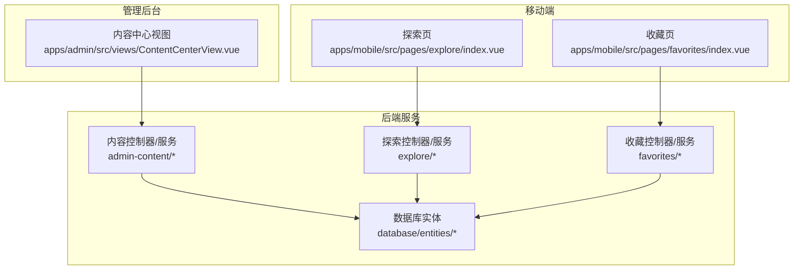
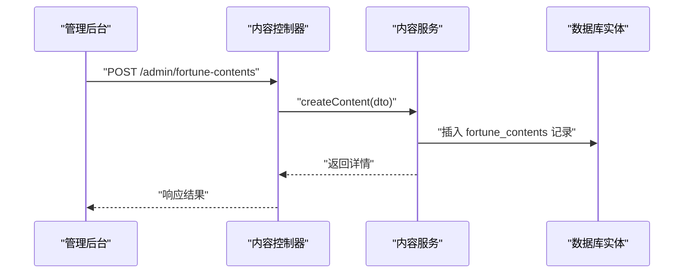
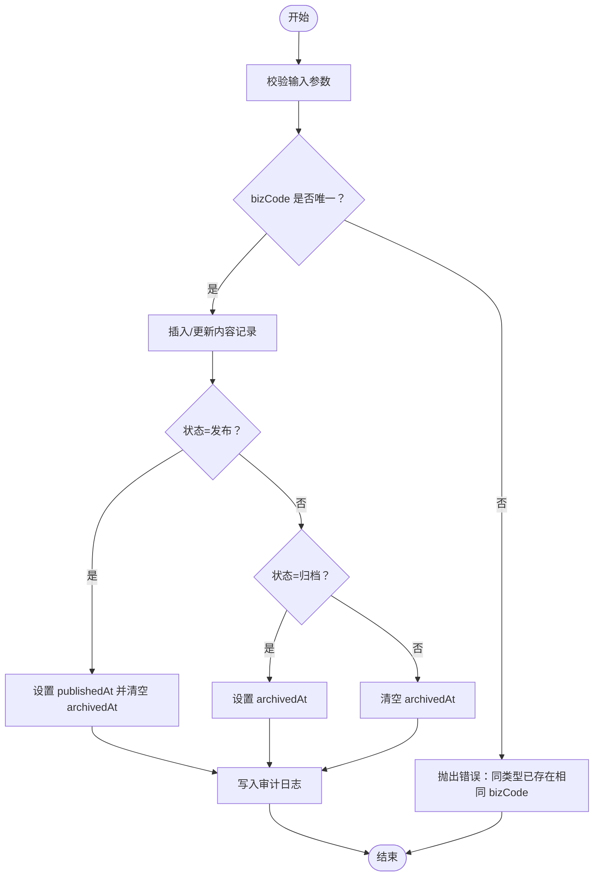
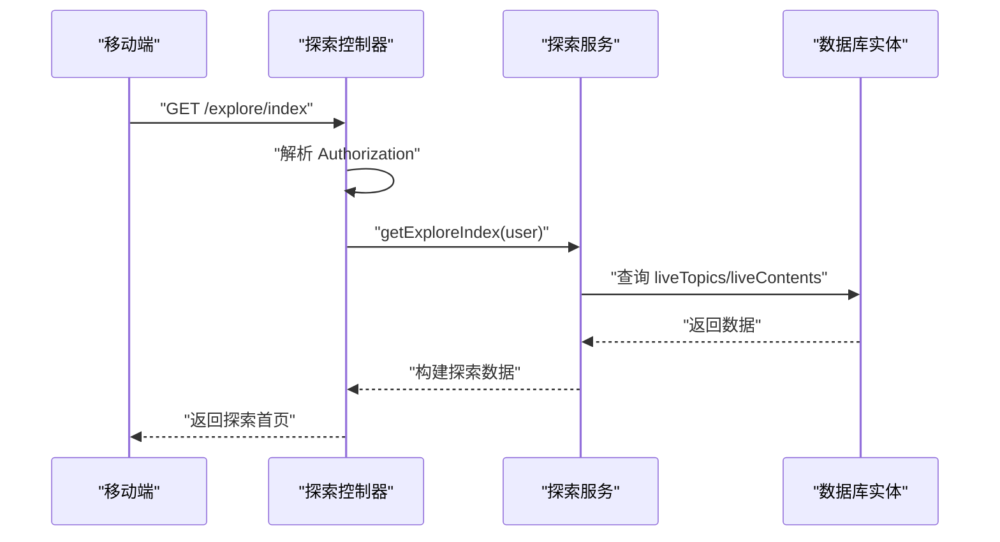
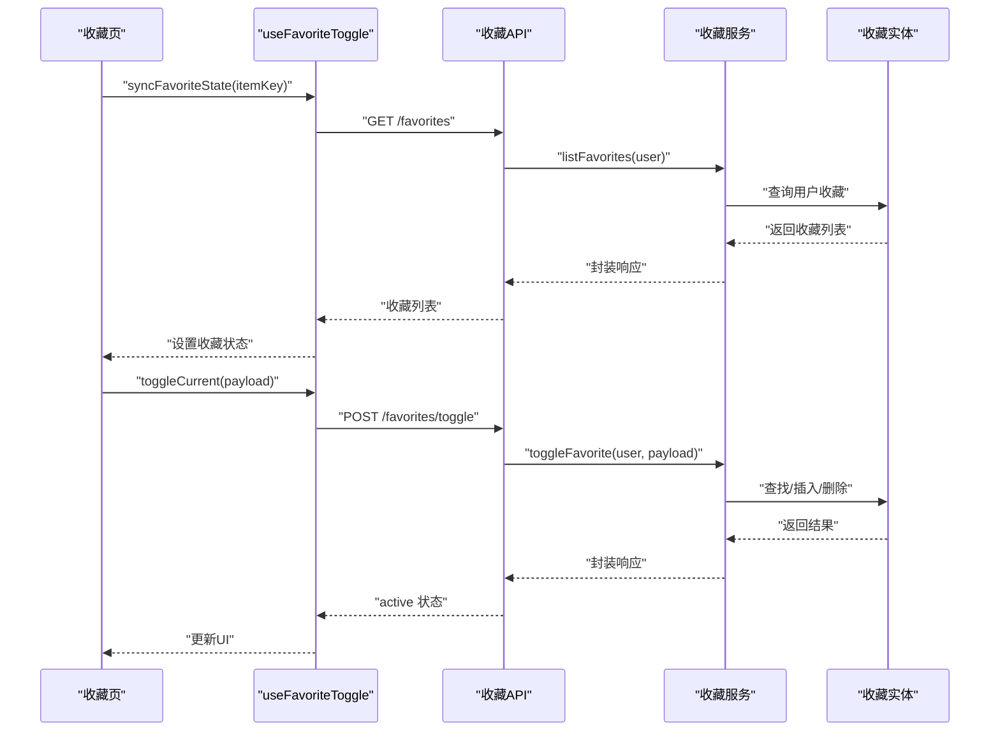
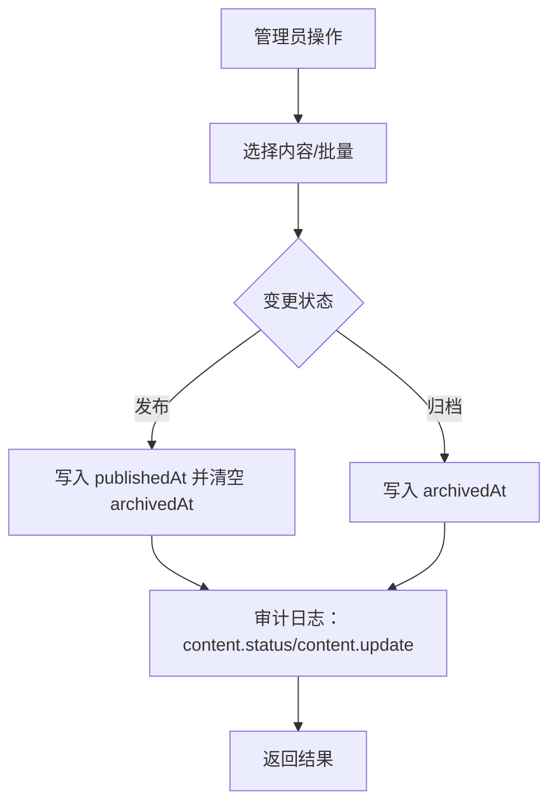
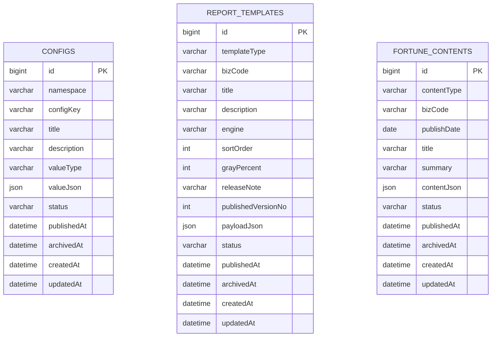
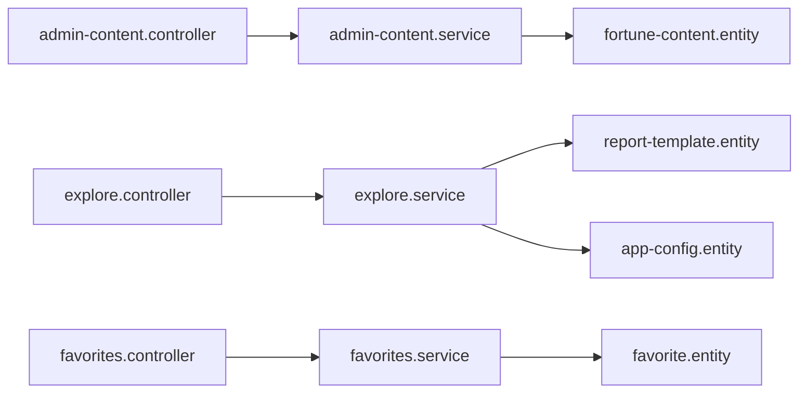

# 内容管理模块

<cite>
**本文引用的文件**
- [services/api/src/admin-content/admin-content.controller.ts](file://services/api/src/admin-content/admin-content.controller.ts)
- [services/api/src/admin-content/admin-content.service.ts](file://services/api/src/admin-content/admin-content.service.ts)
- [services/api/src/admin-content/dto/save-fortune-content.dto.ts](file://services/api/src/admin-content/dto/save-fortune-content.dto.ts)
- [services/api/src/admin-content/dto/save-config-entry.dto.ts](file://services/api/src/admin-content/dto/save-config-entry.dto.ts)
- [services/api/src/admin-content/dto/save-report-template.dto.ts](file://services/api/src/admin-content/dto/save-report-template.dto.ts)
- [services/api/src/admin-content/admin-content.module.ts](file://services/api/src/admin-content/admin-content.module.ts)
- [services/api/src/database/entities/fortune-content.entity.ts](file://services/api/src/database/entities/fortune-content.entity.ts)
- [services/api/src/database/entities/report-template.entity.ts](file://services/api/src/database/entities/report-template.entity.ts)
- [services/api/src/database/entities/app-config.entity.ts](file://services/api/src/database/entities/app-config.entity.ts)
- [services/api/src/database/entities/audit-log.entity.ts](file://services/api/src/database/entities/audit-log.entity.ts)
- [services/api/src/explore/explore.controller.ts](file://services/api/src/explore/explore.controller.ts)
- [services/api/src/explore/explore.service.ts](file://services/api/src/explore/explore.service.ts)
- [apps/mobile/src/api/explore.ts](file://apps/mobile/src/api/explore.ts)
- [apps/mobile/src/types/explore.ts](file://apps/mobile/src/types/explore.ts)
- [apps/mobile/src/pages/explore/index.vue](file://apps/mobile/src/pages/explore/index.vue)
- [services/api/src/favorites/favorites.controller.ts](file://services/api/src/favorites/favorites.controller.ts)
- [services/api/src/favorites/favorites.service.ts](file://services/api/src/favorites/favorites.service.ts)
- [services/api/src/database/entities/favorite.entity.ts](file://services/api/src/database/entities/favorite.entity.ts)
- [apps/mobile/src/api/favorites.ts](file://apps/mobile/src/api/favorites.ts)
- [apps/mobile/src/composables/useFavoriteToggle.ts](file://apps/mobile/src/composables/useFavoriteToggle.ts)
- [apps/mobile/src/pages/favorites/index.vue](file://apps/mobile/src/pages/favorites/index.vue)
- [services/api/src/users/profile-metrics.service.ts](file://services/api/src/users/profile-metrics.service.ts)
- [services/api/src/admin-ops/admin-ops.service.ts](file://services/api/src/admin-ops/admin-ops.service.ts)
- [services/api/src/zodiac/zodiac.service.ts](file://services/api/src/zodiac/zodiac.service.ts)
</cite>

## 目录
1. [简介](#简介)
2. [项目结构](#项目结构)
3. [核心组件](#核心组件)
4. [架构总览](#架构总览)
5. [详细组件分析](#详细组件分析)
6. [依赖关系分析](#依赖关系分析)
7. [性能考量](#性能考量)
8. [故障排查指南](#故障排查指南)
9. [结论](#结论)
10. [附录](#附录)

## 简介
本技术文档聚焦“内容管理模块”，围绕以下目标展开：  
- 运势内容的创建、审核与发布策略、效果追踪  
- 探索功能的实现（内容推荐算法、用户行为分析、个性化展示）  
- 收藏系统的架构设计（收藏逻辑、同步机制、批量操作、清理策略）  
- 内容审核流程（人工审核、自动过滤、违规处理、申诉机制）  
- 内容配置管理工具（分类管理、标签系统、搜索优化、SEO配置）  
- 内容数据分析（热度统计、用户偏好分析、内容效果评估）

## 项目结构
内容管理模块横跨前端与后端，后端采用 NestJS 微服务风格，前端分为管理后台与移动端应用。核心目录与职责如下：
- 后端服务（services/api）
  - admin-content：内容与配置的增删改查、生命周期管理、审计日志
  - explore：探索页检索与排序
  - favorites：收藏列表与切换
  - users：用户画像与指标计算
  - database/entities：内容、收藏、配置、审计等实体
- 前端应用（apps/mobile）
  - 移动端探索页与收藏页
  - 管理后台内容中心
- 管理后台（apps/admin）
  - 内容中心视图与接口封装

图表来源
- [services/api/src/admin-content/admin-content.controller.ts:58-108](file://services/api/src/admin-content/admin-content.controller.ts#L58-L108)
- [services/api/src/explore/explore.controller.ts:1-34](file://services/api/src/explore/explore.controller.ts#L1-L34)
- [services/api/src/favorites/favorites.controller.ts](file://services/api/src/favorites/favorites.controller.ts)
- [services/api/src/database/entities/fortune-content.entity.ts:1-48](file://services/api/src/database/entities/fortune-content.entity.ts#L1-L48)
- [services/api/src/database/entities/favorite.entity.ts:1-48](file://services/api/src/database/entities/favorite.entity.ts#L1-L48)

章节来源
- [services/api/src/admin-content/admin-content.controller.ts:58-108](file://services/api/src/admin-content/admin-content.controller.ts#L58-L108)
- [services/api/src/explore/explore.controller.ts:1-34](file://services/api/src/explore/explore.controller.ts#L1-L34)
- [services/api/src/favorites/favorites.controller.ts](file://services/api/src/favorites/favorites.controller.ts)

## 核心组件
- 内容生命周期与审核
  - 内容实体与索引：contentType、bizCode、publishDate、status、publishedAt、archivedAt
  - 生命周期状态：draft/published/archived；发布时填充 publishedAt，归档时填充 archivedAt
  - 审计日志：对内容更新与状态变更进行审计
- 探索与推荐
  - 探索控制器/服务：根据用户身份返回探索首页与搜索结果
  - 推荐算法：基于来源优先级与关键词匹配度综合评分
- 收藏系统
  - 收藏实体：唯一约束（userId,itemType,itemKey），按创建时间倒序
  - 切换逻辑：存在即删除，不存在即新增
- 配置管理
  - 应用配置实体：命名空间+键唯一，支持字符串/数字/布尔/JSON值
  - 报告模板实体：模板类型+业务码唯一，支持灰度百分比与排序
- 数据分析
  - 用户画像与指标：探索报告数量、收藏数、记录数、海报数等

章节来源
- [services/api/src/admin-content/admin-content.service.ts:603-623](file://services/api/src/admin-content/admin-content.service.ts#L603-L623)
- [services/api/src/database/entities/fortune-content.entity.ts:10-48](file://services/api/src/database/entities/fortune-content.entity.ts#L10-L48)
- [services/api/src/database/entities/app-config.entity.ts:10-50](file://services/api/src/database/entities/app-config.entity.ts#L10-L50)
- [services/api/src/database/entities/report-template.entity.ts:10-62](file://services/api/src/database/entities/report-template.entity.ts#L10-L62)
- [services/api/src/database/entities/audit-log.entity.ts:9-37](file://services/api/src/database/entities/audit-log.entity.ts#L9-L37)
- [services/api/src/explore/explore.service.ts:763-823](file://services/api/src/explore/explore.service.ts#L763-L823)
- [services/api/src/favorites/favorites.service.ts:15-46](file://services/api/src/favorites/favorites.service.ts#L15-L46)
- [services/api/src/database/entities/favorite.entity.ts:10-48](file://services/api/src/database/entities/favorite.entity.ts#L10-L48)
- [services/api/src/users/profile-metrics.service.ts:153-438](file://services/api/src/users/profile-metrics.service.ts#L153-L438)

## 架构总览
内容管理模块由“内容中心”“探索中心”“收藏中心”“配置中心”四大部分组成，前后端通过HTTP API交互。

图表来源
- [services/api/src/admin-content/admin-content.controller.ts:72-75](file://services/api/src/admin-content/admin-content.controller.ts#L72-L75)
- [services/api/src/admin-content/admin-content.service.ts:150-181](file://services/api/src/admin-content/admin-content.service.ts#L150-L181)
- [services/api/src/database/entities/fortune-content.entity.ts:10-48](file://services/api/src/database/entities/fortune-content.entity.ts#L10-L48)

章节来源
- [services/api/src/admin-content/admin-content.controller.ts:58-108](file://services/api/src/admin-content/admin-content.controller.ts#L58-L108)
- [services/api/src/admin-content/admin-content.service.ts:150-181](file://services/api/src/admin-content/admin-content.service.ts#L150-L181)

## 详细组件分析

### 运势内容管理机制
- 创建与更新
  - DTO校验：contentType、bizCode、title、summary、status、contentJson 等字段长度与取值范围
  - 更新时确保同类型下 bizCode 唯一，避免重复
- 发布策略
  - 状态机：draft → published（写入 publishedAt，清空 archivedAt）→ archived（写入 archivedAt）
  - 搜索与筛选：支持 contentType、keyword、status 查询
- 效果追踪
  - 审计日志：记录内容更新与状态变更，便于回溯
  - 指标汇总：结合用户画像服务统计探索报告、收藏、记录、海报等指标

图表来源
- [services/api/src/admin-content/dto/save-fortune-content.dto.ts:9-38](file://services/api/src/admin-content/dto/save-fortune-content.dto.ts#L9-L38)
- [services/api/src/admin-content/admin-content.service.ts:625-640](file://services/api/src/admin-content/admin-content.service.ts#L625-L640)
- [services/api/src/admin-content/admin-content.service.ts:603-623](file://services/api/src/admin-content/admin-content.service.ts#L603-L623)
- [services/api/src/database/entities/audit-log.entity.ts:9-37](file://services/api/src/database/entities/audit-log.entity.ts#L9-L37)

章节来源
- [services/api/src/admin-content/dto/save-fortune-content.dto.ts:9-38](file://services/api/src/admin-content/dto/save-fortune-content.dto.ts#L9-L38)
- [services/api/src/admin-content/admin-content.service.ts:163-181](file://services/api/src/admin-content/admin-content.service.ts#L163-L181)
- [services/api/src/admin-content/admin-content.service.ts:603-623](file://services/api/src/admin-content/admin-content.service.ts#L603-L623)
- [services/api/src/admin-content/admin-content.service.ts:625-640](file://services/api/src/admin-content/admin-content.service.ts#L625-L640)

### 探索功能实现
- 接口与数据流
  - 控制器：解析 Authorization 头部解析用户身份，调用服务层构建探索数据
  - 服务层：聚合“特性”“专题”“内容”，按关键字与筛选条件匹配，按排序策略排序
- 推荐算法
  - 综合评分：来源优先级（assessment_test > fortune_content > report_template > lucky_item > fallback）+ 关键词匹配度
  - 排序策略：latest（按ID升序）、related（按关键词相关性）、recommended（默认，优先级权重更高）
- 个性化展示
  - 根据用户画像完善度与目标标签进行过滤与打分
  - 前端探索页负责UI渲染与收藏按钮联动

图表来源
- [services/api/src/explore/explore.controller.ts:12-16](file://services/api/src/explore/explore.controller.ts#L12-L16)
- [services/api/src/explore/explore.service.ts:283-294](file://services/api/src/explore/explore.service.ts#L283-L294)

章节来源
- [services/api/src/explore/explore.controller.ts:1-34](file://services/api/src/explore/explore.controller.ts#L1-L34)
- [services/api/src/explore/explore.service.ts:238-281](file://services/api/src/explore/explore.service.ts#L238-L281)
- [services/api/src/explore/explore.service.ts:763-823](file://services/api/src/explore/explore.service.ts#L763-L823)
- [apps/mobile/src/api/explore.ts:1-26](file://apps/mobile/src/api/explore.ts#L1-L26)
- [apps/mobile/src/types/explore.ts:76-86](file://apps/mobile/src/types/explore.ts#L76-L86)
- [apps/mobile/src/pages/explore/index.vue:1-200](file://apps/mobile/src/pages/explore/index.vue#L1-L200)

### 收藏系统架构设计
- 收藏逻辑
  - 唯一约束：userId + itemType + itemKey
  - 切换：存在则删除，不存在则新增，并返回 active 状态
- 同步机制
  - 前端组合式函数：登录态存在时拉取收藏列表，用于初始化收藏状态
  - 页面状态版本：通过页面状态存储版本号判断是否需要刷新
- 批量操作
  - 后端支持批量更新状态（内容与模板）
- 清理策略
  - 可通过删除接口移除单条收藏
  - 前端收藏页为空时引导用户前往探索页

图表来源
- [apps/mobile/src/composables/useFavoriteToggle.ts:13-67](file://apps/mobile/src/composables/useFavoriteToggle.ts#L13-L67)
- [apps/mobile/src/api/favorites.ts:1-17](file://apps/mobile/src/api/favorites.ts#L1-L17)
- [services/api/src/favorites/favorites.service.ts:15-46](file://services/api/src/favorites/favorites.service.ts#L15-L46)
- [services/api/src/database/entities/favorite.entity.ts:10-48](file://services/api/src/database/entities/favorite.entity.ts#L10-L48)
- [apps/mobile/src/pages/favorites/index.vue:57-92](file://apps/mobile/src/pages/favorites/index.vue#L57-L92)

章节来源
- [services/api/src/favorites/favorites.service.ts:15-46](file://services/api/src/favorites/favorites.service.ts#L15-L46)
- [services/api/src/database/entities/favorite.entity.ts:10-48](file://services/api/src/database/entities/favorite.entity.ts#L10-L48)
- [apps/mobile/src/composables/useFavoriteToggle.ts:1-67](file://apps/mobile/src/composables/useFavoriteToggle.ts#L1-L67)
- [apps/mobile/src/pages/favorites/index.vue:1-199](file://apps/mobile/src/pages/favorites/index.vue#L1-L199)

### 内容审核流程
- 人工审核
  - 管理后台提供内容列表、预览、批量状态更新、单条状态变更
- 自动过滤
  - 基于状态与日期索引的查询过滤（如按 contentType、status、publishDate）
- 违规处理
  - 归档状态（archivedAt 被设置），并记录审计日志
- 申诉机制
  - 当前代码未见明确“申诉”接口，建议在审计日志基础上扩展申诉工单流程

图表来源
- [services/api/src/admin-content/admin-content.controller.ts:82-107](file://services/api/src/admin-content/admin-content.controller.ts#L82-L107)
- [services/api/src/admin-content/admin-content.service.ts:183-189](file://services/api/src/admin-content/admin-content.service.ts#L183-L189)
- [services/api/src/admin-content/admin-content.service.ts:603-623](file://services/api/src/admin-content/admin-content.service.ts#L603-L623)
- [services/api/src/database/entities/audit-log.entity.ts:9-37](file://services/api/src/database/entities/audit-log.entity.ts#L9-L37)

章节来源
- [services/api/src/admin-content/admin-content.controller.ts:58-108](file://services/api/src/admin-content/admin-content.controller.ts#L58-L108)
- [services/api/src/admin-content/admin-content.service.ts:183-189](file://services/api/src/admin-content/admin-content.service.ts#L183-L189)
- [services/api/src/admin-content/admin-content.service.ts:603-623](file://services/api/src/admin-content/admin-content.service.ts#L603-L623)

### 内容配置管理工具
- 分类管理
  - 内容类型（contentType）、模板类型（templateType）、业务码（bizCode）唯一约束
- 标签系统
  - 内容与模板均支持多目标标签（goals）与类型过滤
- 搜索优化
  - 探索服务支持按标题/描述/类型/目标标签检索与排序
- SEO配置
  - 应用配置实体支持命名空间+键唯一，valueType 支持多种类型，便于前端动态注入SEO元信息

图表来源
- [services/api/src/database/entities/app-config.entity.ts:10-50](file://services/api/src/database/entities/app-config.entity.ts#L10-L50)
- [services/api/src/database/entities/report-template.entity.ts:10-62](file://services/api/src/database/entities/report-template.entity.ts#L10-L62)
- [services/api/src/database/entities/fortune-content.entity.ts:10-48](file://services/api/src/database/entities/fortune-content.entity.ts#L10-L48)

章节来源
- [services/api/src/admin-content/dto/save-config-entry.dto.ts:9-39](file://services/api/src/admin-content/dto/save-config-entry.dto.ts#L9-L39)
- [services/api/src/admin-content/dto/save-report-template.dto.ts:12-57](file://services/api/src/admin-content/dto/save-report-template.dto.ts#L12-L57)
- [services/api/src/explore/explore.service.ts:238-281](file://services/api/src/explore/explore.service.ts#L238-L281)

### 内容数据分析
- 热度统计
  - 结合用户画像服务统计探索报告总量、收藏数、记录数、海报数
- 用户偏好分析
  - 基于探索服务的目标标签与类型过滤，结合收藏行为进行偏好建模
- 内容效果评估
  - 通过审计日志与指标服务评估内容发布后的访问与互动情况

章节来源
- [services/api/src/users/profile-metrics.service.ts:153-438](file://services/api/src/users/profile-metrics.service.ts#L153-L438)
- [services/api/src/explore/explore.service.ts:238-281](file://services/api/src/explore/explore.service.ts#L238-L281)
- [services/api/src/database/entities/audit-log.entity.ts:9-37](file://services/api/src/database/entities/audit-log.entity.ts#L9-L37)

## 依赖关系分析
- 控制器到服务：admin-content.controller 依赖 admin-content.service；explore.controller 依赖 explore.service；favorites.controller 依赖 favorites.service
- 服务到实体：各服务依赖对应实体进行数据持久化
- 前端到后端：移动端探索与收藏API分别调用后端对应接口

图表来源
- [services/api/src/admin-content/admin-content.controller.ts:58-108](file://services/api/src/admin-content/admin-content.controller.ts#L58-L108)
- [services/api/src/explore/explore.controller.ts:1-34](file://services/api/src/explore/explore.controller.ts#L1-L34)
- [services/api/src/favorites/favorites.controller.ts](file://services/api/src/favorites/favorites.controller.ts)
- [services/api/src/database/entities/fortune-content.entity.ts:10-48](file://services/api/src/database/entities/fortune-content.entity.ts#L10-L48)
- [services/api/src/database/entities/report-template.entity.ts:10-62](file://services/api/src/database/entities/report-template.entity.ts#L10-L62)
- [services/api/src/database/entities/app-config.entity.ts:10-50](file://services/api/src/database/entities/app-config.entity.ts#L10-L50)
- [services/api/src/database/entities/favorite.entity.ts:10-48](file://services/api/src/database/entities/favorite.entity.ts#L10-L48)

章节来源
- [services/api/src/admin-content/admin-content.controller.ts:58-108](file://services/api/src/admin-content/admin-content.controller.ts#L58-L108)
- [services/api/src/explore/explore.controller.ts:1-34](file://services/api/src/explore/explore.controller.ts#L1-L34)
- [services/api/src/favorites/favorites.controller.ts](file://services/api/src/favorites/favorites.controller.ts)

## 性能考量
- 查询索引
  - 内容：contentType/status/publishDate 复合索引
  - 收藏：userId/itemType/itemKey 唯一索引，userId/createdAt 索引
  - 配置：namespace/configKey 唯一索引，namespace/status 索引
- 排序与评分
  - 探索排序使用本地数组排序与评分函数，建议在大数据量场景引入数据库侧排序或分页
- 批量操作
  - 批量状态更新可减少网络往返，提升管理效率

章节来源
- [services/api/src/database/entities/fortune-content.entity.ts:10-11](file://services/api/src/database/entities/fortune-content.entity.ts#L10-L11)
- [services/api/src/database/entities/favorite.entity.ts:10-14](file://services/api/src/database/entities/favorite.entity.ts#L10-L14)
- [services/api/src/database/entities/app-config.entity.ts:10-12](file://services/api/src/database/entities/app-config.entity.ts#L10-L12)

## 故障排查指南
- 内容创建失败
  - 检查 contentType/bizCode 是否唯一；确认 DTO 字段长度与类型
- 发布状态异常
  - 确认状态转换逻辑：发布时应写入 publishedAt，归档时写入 archivedAt
- 收藏不同步
  - 确认登录态是否存在；检查 useFavoriteToggle 的同步逻辑与页面状态版本
- 探索结果不准确
  - 校验 keyword、type、goal 参数；确认排序策略与评分函数
- 审计日志缺失
  - 确认状态变更与更新操作是否触发审计记录

章节来源
- [services/api/src/admin-content/admin-content.service.ts:603-623](file://services/api/src/admin-content/admin-content.service.ts#L603-L623)
- [services/api/src/admin-content/admin-content.service.ts:625-640](file://services/api/src/admin-content/admin-content.service.ts#L625-L640)
- [apps/mobile/src/composables/useFavoriteToggle.ts:13-26](file://apps/mobile/src/composables/useFavoriteToggle.ts#L13-L26)
- [services/api/src/explore/explore.service.ts:763-823](file://services/api/src/explore/explore.service.ts#L763-L823)
- [services/api/src/database/entities/audit-log.entity.ts:9-37](file://services/api/src/database/entities/audit-log.entity.ts#L9-L37)

## 结论
内容管理模块以清晰的实体模型与控制器/服务分层实现了内容全生命周期管理、探索推荐、收藏与配置能力，并通过审计日志与用户指标服务支撑了效果追踪与数据分析。后续可在申诉流程、搜索与排序的数据库侧优化、以及收藏批量清理等方面进一步完善。

## 附录
- 运维与发布检查清单（摘自运营服务）
  - 生肖/星座/塔罗/首页探索内容已发布
  - 每日幸运签内容已发布
  - 幸运物料已发布
  - 报告模板已发布
  - 会员商品已发布
  - 公开设置配置已发布
  - 情绪自检合规配置已发布

章节来源
- [services/api/src/admin-ops/admin-ops.service.ts:148-204](file://services/api/src/admin-ops/admin-ops.service.ts#L148-L204)