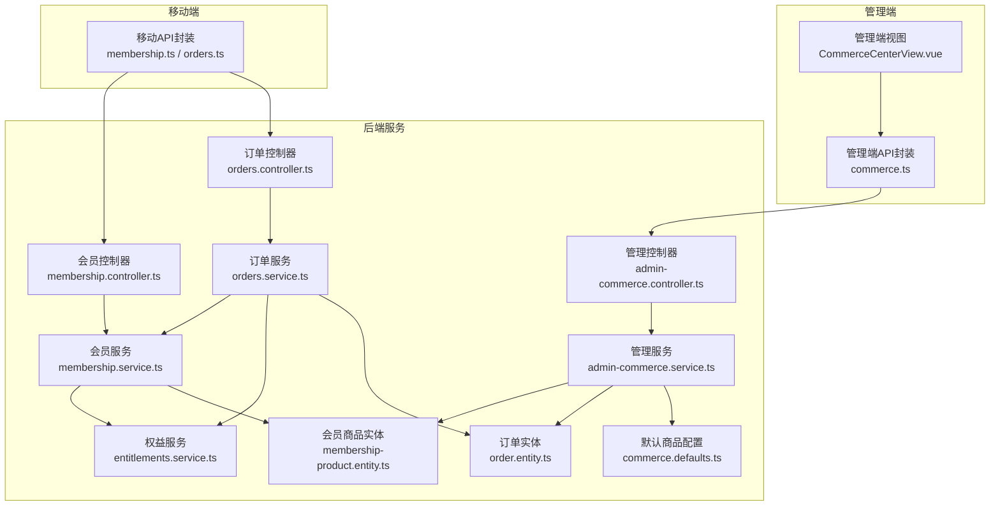
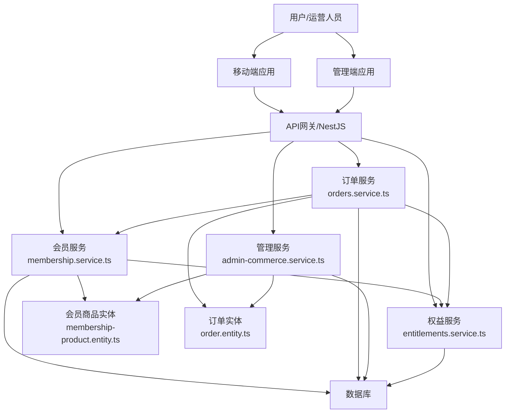
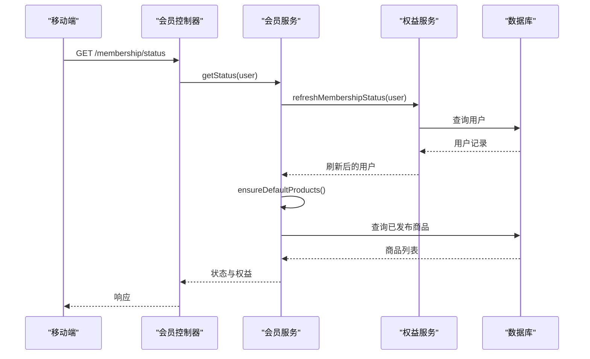
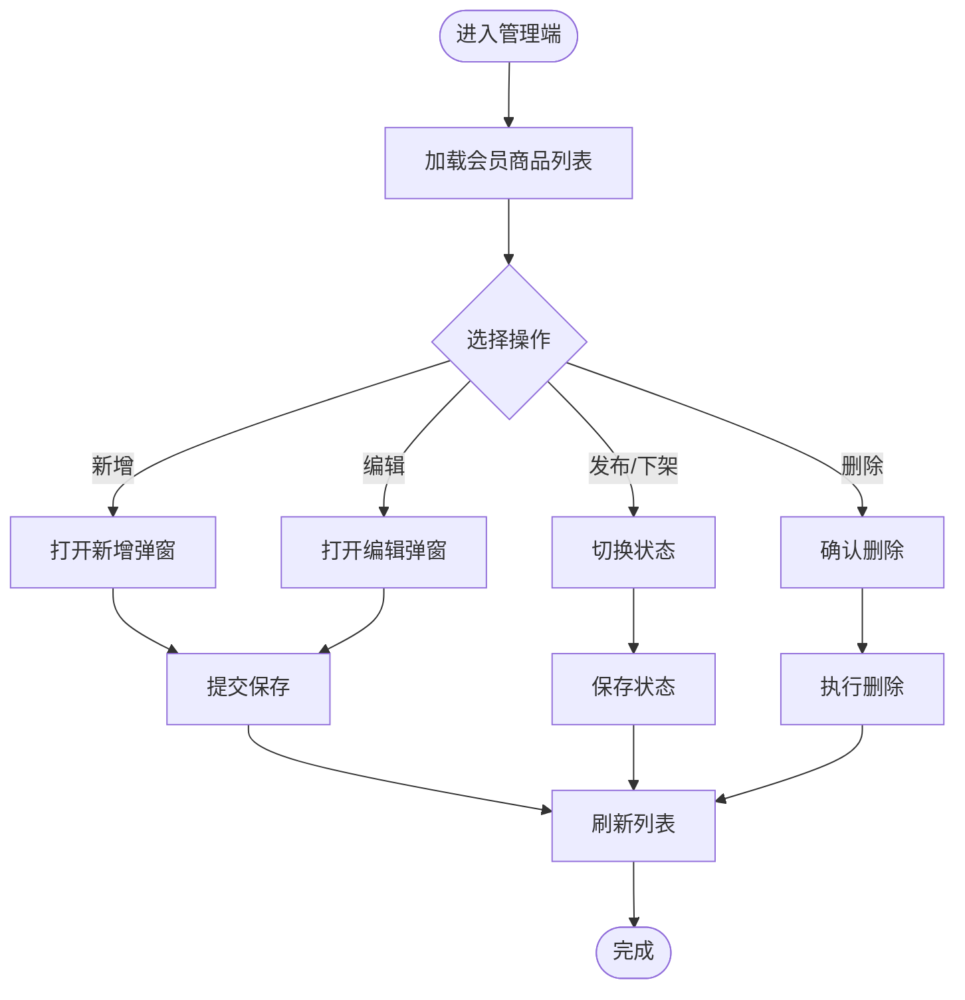
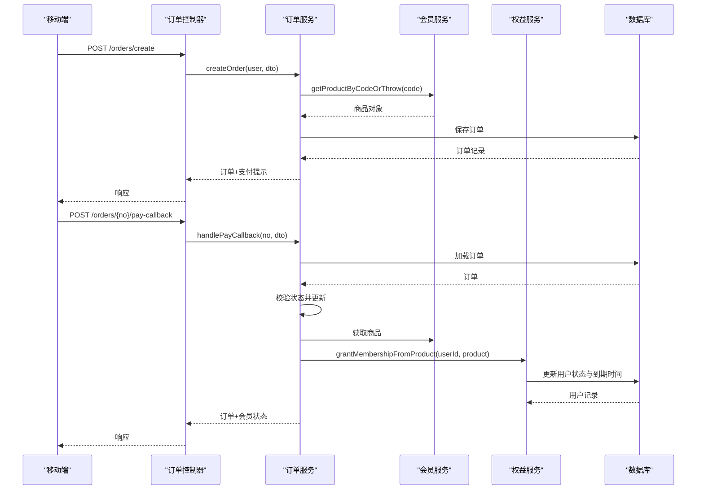
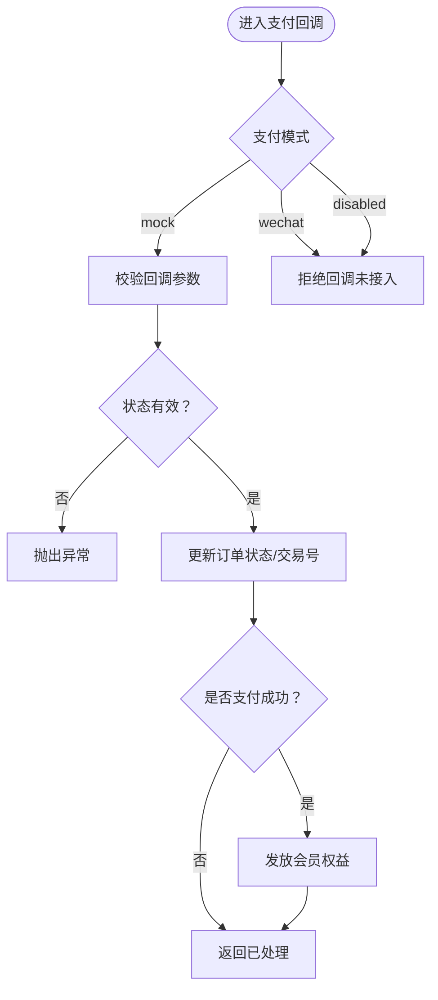
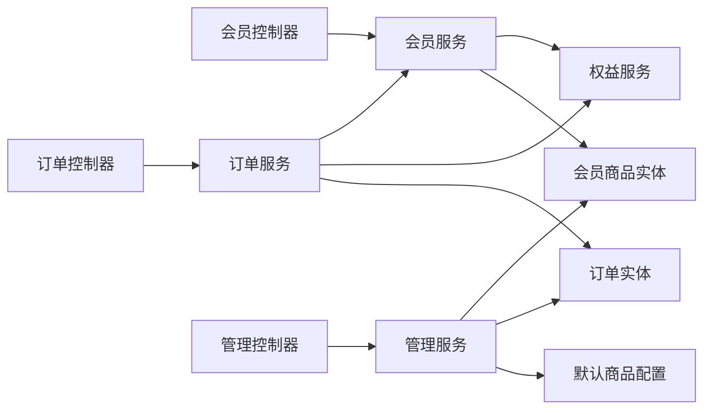

# 商业化模块

<cite>
**本文引用的文件**
- [services/api/src/membership/membership.controller.ts](file://services/api/src/membership/membership.controller.ts)
- [services/api/src/membership/membership.service.ts](file://services/api/src/membership/membership.service.ts)
- [services/api/src/orders/orders.controller.ts](file://services/api/src/orders/orders.controller.ts)
- [services/api/src/orders/orders.service.ts](file://services/api/src/orders/orders.service.ts)
- [services/api/src/orders/dto/order-pay-callback.dto.ts](file://services/api/src/orders/dto/order-pay-callback.dto.ts)
- [services/api/src/admin-commerce/admin-commerce.controller.ts](file://services/api/src/admin-commerce/admin-commerce.controller.ts)
- [services/api/src/admin-commerce/admin-commerce.service.ts](file://services/api/src/admin-commerce/admin-commerce.service.ts)
- [services/api/src/entitlements/entitlements.service.ts](file://services/api/src/entitlements/entitlements.service.ts)
- [services/api/src/database/entities/membership-product.entity.ts](file://services/api/src/database/entities/membership-product.entity.ts)
- [services/api/src/database/entities/order.entity.ts](file://services/api/src/database/entities/order.entity.ts)
- [services/api/src/commerce/commerce.defaults.ts](file://services/api/src/commerce/commerce.defaults.ts)
- [apps/mobile/src/api/membership.ts](file://apps/mobile/src/api/membership.ts)
- [apps/mobile/src/api/orders.ts](file://apps/mobile/src/api/orders.ts)
- [apps/admin/src/api/commerce.ts](file://apps/admin/src/api/commerce.ts)
- [apps/admin/src/views/CommerceCenterView.vue](file://apps/admin/src/views/CommerceCenterView.vue)
</cite>

## 目录
1. [引言](#引言)
2. [项目结构](#项目结构)
3. [核心组件](#核心组件)
4. [架构总览](#架构总览)
5. [详细组件分析](#详细组件分析)
6. [依赖关系分析](#依赖关系分析)
7. [性能考量](#性能考量)
8. [故障排查指南](#故障排查指南)
9. [结论](#结论)
10. [附录](#附录)

## 引言
本文件面向商业化模块的业务与技术实现，围绕会员体系、商品管理、订单处理、支付集成、管理工具与商业分析进行系统化说明。文档以代码为依据，结合前后端交互与数据库实体，帮助产品、运营与研发协同推进会员与交易能力建设。

## 项目结构
商业化模块由“后端服务 + 管理端 + 移动端”三层构成：
- 后端服务：提供会员状态查询、商品管理、订单创建与支付回调、权益发放等能力
- 管理端：提供会员商品与订单的可视化管理界面
- 移动端：提供会员状态查询与订单模拟支付能力

图表来源
- [services/api/src/membership/membership.controller.ts:1-18](file://services/api/src/membership/membership.controller.ts#L1-L18)
- [services/api/src/membership/membership.service.ts:1-115](file://services/api/src/membership/membership.service.ts#L1-L115)
- [services/api/src/orders/orders.controller.ts:1-31](file://services/api/src/orders/orders.controller.ts#L1-L31)
- [services/api/src/orders/orders.service.ts:1-160](file://services/api/src/orders/orders.service.ts#L1-L160)
- [services/api/src/admin-commerce/admin-commerce.controller.ts:1-60](file://services/api/src/admin-commerce/admin-commerce.controller.ts#L1-L60)
- [services/api/src/admin-commerce/admin-commerce.service.ts:1-256](file://services/api/src/admin-commerce/admin-commerce.service.ts#L1-L256)
- [services/api/src/entitlements/entitlements.service.ts:1-78](file://services/api/src/entitlements/entitlements.service.ts#L1-L78)
- [services/api/src/database/entities/membership-product.entity.ts:1-50](file://services/api/src/database/entities/membership-product.entity.ts#L1-L50)
- [services/api/src/database/entities/order.entity.ts:1-53](file://services/api/src/database/entities/order.entity.ts#L1-L53)
- [services/api/src/commerce/commerce.defaults.ts:1-36](file://services/api/src/commerce/commerce.defaults.ts#L1-L36)
- [apps/mobile/src/api/membership.ts:1-7](file://apps/mobile/src/api/membership.ts#L1-L7)
- [apps/mobile/src/api/orders.ts:1-18](file://apps/mobile/src/api/orders.ts#L1-L18)
- [apps/admin/src/api/commerce.ts:1-129](file://apps/admin/src/api/commerce.ts#L1-L129)
- [apps/admin/src/views/CommerceCenterView.vue:1-459](file://apps/admin/src/views/CommerceCenterView.vue#L1-L459)

章节来源
- [services/api/src/membership/membership.controller.ts:1-18](file://services/api/src/membership/membership.controller.ts#L1-L18)
- [services/api/src/orders/orders.controller.ts:1-31](file://services/api/src/orders/orders.controller.ts#L1-L31)
- [services/api/src/admin-commerce/admin-commerce.controller.ts:1-60](file://services/api/src/admin-commerce/admin-commerce.controller.ts#L1-L60)
- [apps/mobile/src/api/membership.ts:1-7](file://apps/mobile/src/api/membership.ts#L1-L7)
- [apps/mobile/src/api/orders.ts:1-18](file://apps/mobile/src/api/orders.ts#L1-L18)
- [apps/admin/src/api/commerce.ts:1-129](file://apps/admin/src/api/commerce.ts#L1-L129)
- [apps/admin/src/views/CommerceCenterView.vue:1-459](file://apps/admin/src/views/CommerceCenterView.vue#L1-L459)

## 核心组件
- 会员体系
  - 会员状态查询：移动端通过会员API获取当前用户会员状态与权益清单
  - 权益发放与续期：基于订单支付成功后的权益授予与到期状态刷新
- 商品管理
  - 商品 CRUD 与上下架：管理端可创建、编辑、删除、发布/草稿切换会员商品
  - 默认商品初始化：首次启动自动写入默认会员商品
- 订单处理
  - 订单创建：校验支付模式、解析商品、生成唯一订单号、持久化
  - 支付回调：支持模拟支付回调，按状态更新订单并触发权益发放
- 管理工具
  - 商品与订单管理界面：可视化维护商品与订单数据
  - 订单统计：总单量、已支付单量、总营收、本月营收、转化率
- 支付集成
  - 支付模式解析：支持 disabled、mock、wechat 三种模式
  - 回调参数校验：对回调状态与交易号进行约束

章节来源
- [services/api/src/membership/membership.service.ts:1-115](file://services/api/src/membership/membership.service.ts#L1-L115)
- [services/api/src/entitlements/entitlements.service.ts:1-78](file://services/api/src/entitlements/entitlements.service.ts#L1-L78)
- [services/api/src/admin-commerce/admin-commerce.service.ts:1-256](file://services/api/src/admin-commerce/admin-commerce.service.ts#L1-L256)
- [services/api/src/commerce/commerce.defaults.ts:1-36](file://services/api/src/commerce/commerce.defaults.ts#L1-L36)
- [services/api/src/orders/orders.service.ts:1-160](file://services/api/src/orders/orders.service.ts#L1-L160)
- [apps/admin/src/views/CommerceCenterView.vue:1-459](file://apps/admin/src/views/CommerceCenterView.vue#L1-L459)
- [apps/admin/src/api/commerce.ts:1-129](file://apps/admin/src/api/commerce.ts#L1-L129)

## 架构总览
商业化模块采用“控制器-服务-仓储-实体”的分层架构，配合管理端与移动端的 API 调用，形成完整的会员与交易闭环。

图表来源
- [services/api/src/membership/membership.service.ts:1-115](file://services/api/src/membership/membership.service.ts#L1-L115)
- [services/api/src/orders/orders.service.ts:1-160](file://services/api/src/orders/orders.service.ts#L1-L160)
- [services/api/src/admin-commerce/admin-commerce.service.ts:1-256](file://services/api/src/admin-commerce/admin-commerce.service.ts#L1-L256)
- [services/api/src/entitlements/entitlements.service.ts:1-78](file://services/api/src/entitlements/entitlements.service.ts#L1-L78)
- [services/api/src/database/entities/membership-product.entity.ts:1-50](file://services/api/src/database/entities/membership-product.entity.ts#L1-L50)
- [services/api/src/database/entities/order.entity.ts:1-53](file://services/api/src/database/entities/order.entity.ts#L1-L53)

## 详细组件分析

### 会员体系
- 设计要点
  - 会员状态刷新：若用户处于非激活但存在到期时间，则在访问时刷新为 inactive
  - 权益授予：支付完成后根据商品时长续期或叠加有效期
  - 权益展示：根据是否激活返回不同权益清单
  - 默认商品：首次启动自动落库默认商品，保证商品目录可用
- 关键流程
  - 获取会员状态：鉴权 -> 刷新会员状态 -> 查询已发布商品 -> 返回状态与权益
  - 激活会员：根据商品时长计算到期时间并更新用户状态

图表来源
- [services/api/src/membership/membership.controller.ts:1-18](file://services/api/src/membership/membership.controller.ts#L1-L18)
- [services/api/src/membership/membership.service.ts:1-115](file://services/api/src/membership/membership.service.ts#L1-L115)
- [services/api/src/entitlements/entitlements.service.ts:1-78](file://services/api/src/entitlements/entitlements.service.ts#L1-L78)

章节来源
- [services/api/src/membership/membership.service.ts:17-47](file://services/api/src/membership/membership.service.ts#L17-L47)
- [services/api/src/entitlements/entitlements.service.ts:23-61](file://services/api/src/entitlements/entitlements.service.ts#L23-L61)
- [services/api/src/commerce/commerce.defaults.ts:1-36](file://services/api/src/commerce/commerce.defaults.ts#L1-L36)

### 商品管理
- 功能范围
  - 商品 CRUD：code 唯一性校验、字段清洗与保存
  - 上下架控制：draft/published 状态切换
  - 默认商品回填：空库时写入默认商品
- 管理端能力
  - 商品列表、新增/编辑弹窗、发布/下架、删除
  - 订单列表、筛选、分页、统计卡片

图表来源
- [apps/admin/src/views/CommerceCenterView.vue:197-318](file://apps/admin/src/views/CommerceCenterView.vue#L197-L318)
- [apps/admin/src/api/commerce.ts:81-113](file://apps/admin/src/api/commerce.ts#L81-L113)
- [services/api/src/admin-commerce/admin-commerce.service.ts:41-148](file://services/api/src/admin-commerce/admin-commerce.service.ts#L41-L148)

章节来源
- [services/api/src/admin-commerce/admin-commerce.service.ts:22-148](file://services/api/src/admin-commerce/admin-commerce.service.ts#L22-L148)
- [apps/admin/src/views/CommerceCenterView.vue:197-318](file://apps/admin/src/views/CommerceCenterView.vue#L197-L318)
- [apps/admin/src/api/commerce.ts:81-113](file://apps/admin/src/api/commerce.ts#L81-L113)

### 订单处理系统
- 订单创建
  - 解析支付模式：非生产环境支持 mock；生产默认 disabled
  - 校验商品：必须为已发布状态
  - 生成订单：设置订单号、金额、类型、扩展信息（时长）
- 支付回调
  - 仅允许在 mock 模式下使用
  - 更新订单状态与交易号，支付成功时发放会员权益
- 序列化输出：统一返回格式，含金额格式化、时间戳等

图表来源
- [services/api/src/orders/orders.controller.ts:1-31](file://services/api/src/orders/orders.controller.ts#L1-L31)
- [services/api/src/orders/orders.service.ts:23-116](file://services/api/src/orders/orders.service.ts#L23-L116)
- [services/api/src/membership/membership.service.ts:49-63](file://services/api/src/membership/membership.service.ts#L49-L63)
- [services/api/src/entitlements/entitlements.service.ts:36-61](file://services/api/src/entitlements/entitlements.service.ts#L36-L61)

章节来源
- [services/api/src/orders/orders.controller.ts:14-29](file://services/api/src/orders/orders.controller.ts#L14-L29)
- [services/api/src/orders/orders.service.ts:23-116](file://services/api/src/orders/orders.service.ts#L23-L116)
- [services/api/src/orders/dto/order-pay-callback.dto.ts:1-13](file://services/api/src/orders/dto/order-pay-callback.dto.ts#L1-L13)

### 支付集成方案
- 支付模式解析
  - 非生产环境：优先使用配置值，若开启 mock 或配置为 mock 则启用
  - 生产环境：默认 disabled，需显式配置为 wechat 才启用
- 回调处理
  - 仅 mock 模式允许回调
  - 校验状态与交易号，更新订单并触发权益发放
- 安全与风控
  - 当前实现未见签名/验签与风控拦截逻辑，建议在接入第三方支付时补充回调签名验证与重复回调幂等处理

图表来源
- [services/api/src/orders/orders.service.ts:137-158](file://services/api/src/orders/orders.service.ts#L137-L158)
- [services/api/src/orders/dto/order-pay-callback.dto.ts:1-13](file://services/api/src/orders/dto/order-pay-callback.dto.ts#L1-L13)

章节来源
- [services/api/src/orders/orders.service.ts:137-158](file://services/api/src/orders/orders.service.ts#L137-L158)

### 商业化配置管理工具
- 管理端页面
  - 商品管理：增删改查、发布/下架、排序
  - 订单管理：分页、筛选、统计卡片（总单量、已支付、总营收、本月营收、转化率）
- API 封装
  - 商品与订单的列表、详情、状态变更、统计查询

章节来源
- [apps/admin/src/views/CommerceCenterView.vue:1-459](file://apps/admin/src/views/CommerceCenterView.vue#L1-L459)
- [apps/admin/src/api/commerce.ts:1-129](file://apps/admin/src/api/commerce.ts#L1-L129)
- [services/api/src/admin-commerce/admin-commerce.service.ts:150-225](file://services/api/src/admin-commerce/admin-commerce.service.ts#L150-L225)

### 商业数据分析
- 统计指标
  - 总订单数、已支付订单数、总营收（分/元）、本月营收（分/元）、转化率
- 实现方式
  - 统计查询：订单总数、已支付数、最近若干笔已支付订单明细
  - 营收计算：对已支付订单金额求和，区分总与当月
  - 转化率：已支付/总订单 × 100

章节来源
- [services/api/src/admin-commerce/admin-commerce.service.ts:189-225](file://services/api/src/admin-commerce/admin-commerce.service.ts#L189-L225)

## 依赖关系分析
- 控制器到服务
  - 会员控制器依赖会员服务；订单控制器依赖订单服务；管理控制器依赖管理服务
- 服务到实体
  - 会员服务依赖会员商品实体；订单服务依赖订单实体；管理服务依赖两者；权益服务依赖用户实体
- 外部依赖
  - 支付模式受配置驱动；移动端与管理端通过 API 封装调用后端

图表来源
- [services/api/src/membership/membership.controller.ts:1-18](file://services/api/src/membership/membership.controller.ts#L1-L18)
- [services/api/src/orders/orders.controller.ts:1-31](file://services/api/src/orders/orders.controller.ts#L1-L31)
- [services/api/src/admin-commerce/admin-commerce.controller.ts:1-60](file://services/api/src/admin-commerce/admin-commerce.controller.ts#L1-L60)
- [services/api/src/membership/membership.service.ts:1-115](file://services/api/src/membership/membership.service.ts#L1-L115)
- [services/api/src/orders/orders.service.ts:1-160](file://services/api/src/orders/orders.service.ts#L1-L160)
- [services/api/src/admin-commerce/admin-commerce.service.ts:1-256](file://services/api/src/admin-commerce/admin-commerce.service.ts#L1-L256)
- [services/api/src/entitlements/entitlements.service.ts:1-78](file://services/api/src/entitlements/entitlements.service.ts#L1-L78)
- [services/api/src/database/entities/membership-product.entity.ts:1-50](file://services/api/src/database/entities/membership-product.entity.ts#L1-L50)
- [services/api/src/database/entities/order.entity.ts:1-53](file://services/api/src/database/entities/order.entity.ts#L1-L53)
- [services/api/src/commerce/commerce.defaults.ts:1-36](file://services/api/src/commerce/commerce.defaults.ts#L1-L36)

## 性能考量
- 数据库索引
  - 会员商品：按 code 唯一键、按 status+sortOrder 索引，利于发布态查询与排序
  - 订单：按 orderNo 唯一键、按 userId+status 索引，便于用户维度与状态检索
- 查询优化
  - 商品列表与订单列表均按创建时间倒序，分页查询避免全表扫描
  - 统计查询限制最近 N 笔已支付订单，控制聚合成本
- 内存与序列化
  - 金额统一以“分”存储，序列化时转换为“元”字符串，减少前端格式化开销

章节来源
- [services/api/src/database/entities/membership-product.entity.ts:11-12](file://services/api/src/database/entities/membership-product.entity.ts#L11-L12)
- [services/api/src/database/entities/order.entity.ts:11-12](file://services/api/src/database/entities/order.entity.ts#L11-L12)
- [services/api/src/admin-commerce/admin-commerce.service.ts:150-187](file://services/api/src/admin-commerce/admin-commerce.service.ts#L150-L187)

## 故障排查指南
- 无法创建订单
  - 检查支付模式配置：生产环境默认 disabled，需正确配置
  - 检查商品状态：必须为 published
- 支付回调无效
  - 确认当前环境为 mock 模式；非 mock 环境不接受回调
  - 校验回调参数：status 与 transactionNo 的约束
- 会员状态未更新
  - 确认订单已支付且回调成功
  - 检查权益服务的用户到期时间与状态刷新逻辑
- 管理端商品/订单异常
  - 查看接口返回码与消息体，确认必填字段与状态值合法

章节来源
- [services/api/src/orders/orders.service.ts:24-30](file://services/api/src/orders/orders.service.ts#L24-L30)
- [services/api/src/orders/orders.service.ts:61-63](file://services/api/src/orders/orders.service.ts#L61-L63)
- [services/api/src/orders/dto/order-pay-callback.dto.ts:1-13](file://services/api/src/orders/dto/order-pay-callback.dto.ts#L1-L13)
- [services/api/src/entitlements/entitlements.service.ts:23-34](file://services/api/src/entitlements/entitlements.service.ts#L23-L34)

## 结论
商业化模块以清晰的分层架构实现了会员状态管理、商品与订单全链路、以及管理端可视化工具。当前实现具备良好的扩展性，建议后续在支付回调中增加签名验证与风控策略，并完善退款与对账机制，以满足更复杂的商业化场景。

## 附录
- 前端调用路径参考
  - 会员状态：移动端 API 封装调用后端控制器
  - 订单创建/回调：移动端 API 封装调用后端控制器
  - 管理端商品/订单：管理端 API 封装调用后端控制器

章节来源
- [apps/mobile/src/api/membership.ts:1-7](file://apps/mobile/src/api/membership.ts#L1-L7)
- [apps/mobile/src/api/orders.ts:1-18](file://apps/mobile/src/api/orders.ts#L1-L18)
- [apps/admin/src/api/commerce.ts:1-129](file://apps/admin/src/api/commerce.ts#L1-L129)