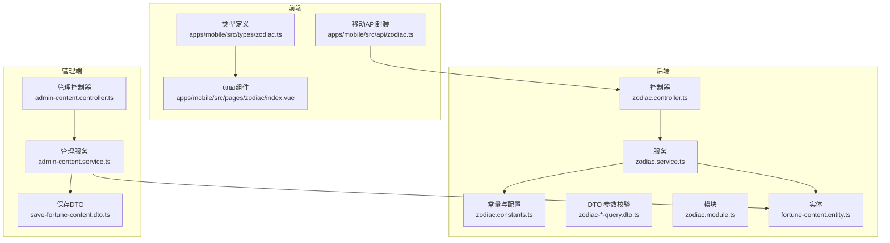
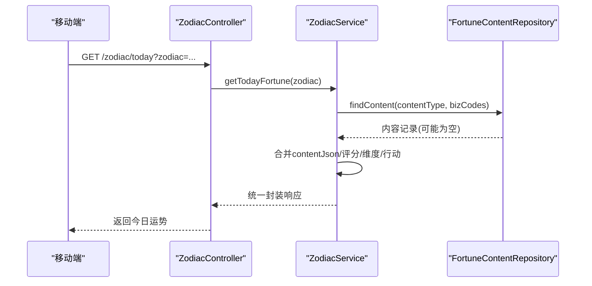
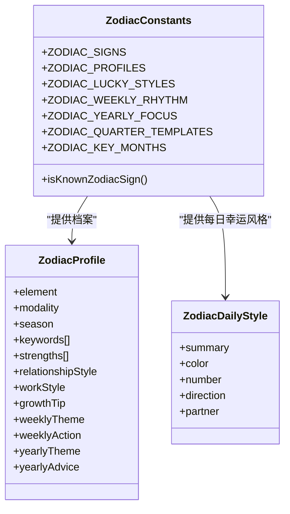
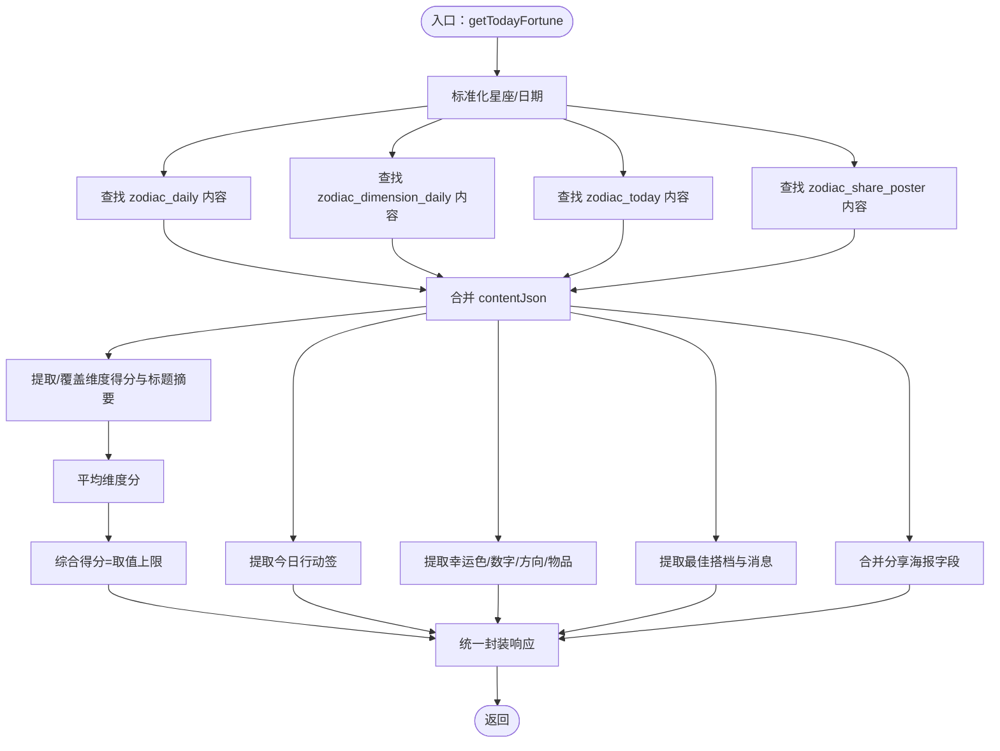
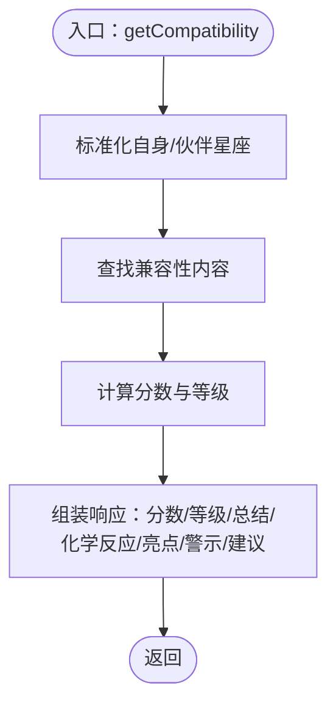
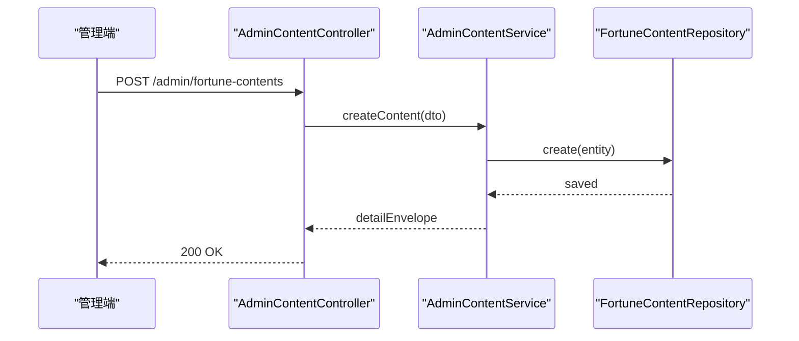
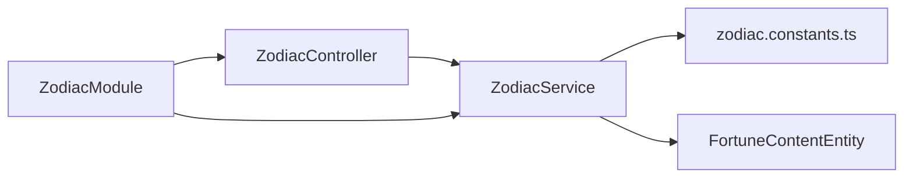

# 星座运势模块

<cite>
**本文引用的文件**
- [zodiac.controller.ts](file://services/api/src/zodiac/zodiac.controller.ts)
- [zodiac.service.ts](file://services/api/src/zodiac/zodiac.service.ts)
- [zodiac.constants.ts](file://services/api/src/zodiac/zodiac.constants.ts)
- [zodiac.module.ts](file://services/api/src/zodiac/zodiac.module.ts)
- [zodiac-query.dto.ts](file://services/api/src/zodiac/dto/zodiac-query.dto.ts)
- [zodiac-daily-query.dto.ts](file://services/api/src/zodiac/dto/zodiac-daily-query.dto.ts)
- [zodiac-compatibility-query.dto.ts](file://services/api/src/zodiac/dto/zodiac-compatibility-query.dto.ts)
- [zodiac-monthly-query.dto.ts](file://services/api/src/zodiac/dto/zodiac-monthly-query.dto.ts)
- [zodiac-yearly-query.dto.ts](file://services/api/src/zodiac/dto/zodiac-yearly-query.dto.ts)
- [fortune-content.entity.ts](file://services/api/src/database/entities/fortune-content.entity.ts)
- [admin-content.controller.ts](file://services/api/src/admin-content/admin-content.controller.ts)
- [admin-content.service.ts](file://services/api/src/admin-content/admin-content.service.ts)
- [save-fortune-content.dto.ts](file://services/api/src/admin-content/dto/save-fortune-content.dto.ts)
- [zodiac.ts](file://apps/mobile/src/api/zodiac.ts)
- [zodiac.ts（类型）](file://apps/mobile/src/types/zodiac.ts)
- [index.vue（星座页）](file://apps/mobile/src/pages/zodiac/index.vue)
- [接口开发文档.md](file://docs/接口开发文档.md)
- [开发文档.md](file://docs/开发文档.md)
</cite>

## 目录
1. [简介](#简介)
2. [项目结构](#项目结构)
3. [核心组件](#核心组件)
4. [架构总览](#架构总览)
5. [详细组件分析](#详细组件分析)
6. [依赖分析](#依赖分析)
7. [性能考量](#性能考量)
8. [故障排查指南](#故障排查指南)
9. [结论](#结论)
10. [附录](#附录)

## 简介
本指南面向“星座运势模块”的开发与维护，覆盖以下要点：
- 星座数据模型设计：包含星座列表、日期范围、属性配置与常量管理
- 运势查询接口实现：今日/每日/每周/每月/年度运势的计算逻辑
- 星座兼容性分析：配对算法、相性评估与建议输出
- 运势数据获取与更新：内容实体、API集成、发布流与生命周期管理
- 常量配置管理：数据字典维护、版本升级与向后兼容
- 个性化定制：用户偏好、推送通知、历史记录（移动端）

## 项目结构
星座运势模块由后端 API、数据库实体、前端 API 与页面组件构成，采用分层与模块化组织：
- 后端模块：NestJS 模块 zodiac，控制器暴露 REST 接口，服务实现业务逻辑，常量与 DTO 定义数据契约
- 数据层：TypeORM 实体 fortune_contents 存储运势内容，支持草稿/发布/归档生命周期
- 管理端：提供内容管理、发布流与审计
- 前端：移动端 API 封装、类型定义与页面渲染

图表来源
- [zodiac.controller.ts:1-46](file://services/api/src/zodiac/zodiac.controller.ts#L1-L46)
- [zodiac.service.ts:1-120](file://services/api/src/zodiac/zodiac.service.ts#L1-L120)
- [zodiac.constants.ts:1-120](file://services/api/src/zodiac/zodiac.constants.ts#L1-L120)
- [zodiac.module.ts:1-13](file://services/api/src/zodiac/zodiac.module.ts#L1-L13)
- [fortune-content.entity.ts:1-49](file://services/api/src/database/entities/fortune-content.entity.ts#L1-L49)
- [admin-content.controller.ts:58-108](file://services/api/src/admin-content/admin-content.controller.ts#L58-L108)
- [admin-content.service.ts:123-196](file://services/api/src/admin-content/admin-content.service.ts#L123-L196)
- [save-fortune-content.dto.ts:1-39](file://services/api/src/admin-content/dto/save-fortune-content.dto.ts#L1-L39)
- [zodiac.ts:1-50](file://apps/mobile/src/api/zodiac.ts#L1-L50)
- [zodiac.ts（类型）:1-221](file://apps/mobile/src/types/zodiac.ts#L1-L221)
- [index.vue（星座页）:1-120](file://apps/mobile/src/pages/zodiac/index.vue#L1-L120)

章节来源
- [zodiac.controller.ts:1-46](file://services/api/src/zodiac/zodiac.controller.ts#L1-L46)
- [zodiac.service.ts:1-120](file://services/api/src/zodiac/zodiac.service.ts#L1-L120)
- [zodiac.constants.ts:1-120](file://services/api/src/zodiac/zodiac.constants.ts#L1-L120)
- [zodiac.module.ts:1-13](file://services/api/src/zodiac/zodiac.module.ts#L1-L13)
- [fortune-content.entity.ts:1-49](file://services/api/src/database/entities/fortune-content.entity.ts#L1-L49)
- [admin-content.controller.ts:58-108](file://services/api/src/admin-content/admin-content.controller.ts#L58-L108)
- [admin-content.service.ts:123-196](file://services/api/src/admin-content/admin-content.service.ts#L123-L196)
- [save-fortune-content.dto.ts:1-39](file://services/api/src/admin-content/dto/save-fortune-content.dto.ts#L1-L39)
- [zodiac.ts:1-50](file://apps/mobile/src/api/zodiac.ts#L1-L50)
- [zodiac.ts（类型）:1-221](file://apps/mobile/src/types/zodiac.ts#L1-L221)
- [index.vue（星座页）:1-120](file://apps/mobile/src/pages/zodiac/index.vue#L1-L120)

## 核心组件
- 控制器：提供 REST 接口，映射 /zodiac/{today|daily|weekly|monthly|yearly|compatibility|knowledge}
- 服务：实现运势计算、内容合并、评分聚合、兼容性算法与默认回退
- 常量与配置：星座列表、元素/模式标签、每日幸运风格、年度焦点、季度模板、关键月份等
- DTO：参数校验与约束（星座枚举、月份格式、年份范围）
- 实体：fortune_contents 内容表，支持 contentType、bizCode、publishDate、status、contentJson
- 管理服务：内容 CRUD、状态变更、唯一性校验、生命周期应用与审计

章节来源
- [zodiac.controller.ts:1-46](file://services/api/src/zodiac/zodiac.controller.ts#L1-L46)
- [zodiac.service.ts:50-120](file://services/api/src/zodiac/zodiac.service.ts#L50-L120)
- [zodiac.constants.ts:1-120](file://services/api/src/zodiac/zodiac.constants.ts#L1-L120)
- [zodiac.module.ts:1-13](file://services/api/src/zodiac/zodiac.module.ts#L1-L13)
- [zodiac-query.dto.ts:1-10](file://services/api/src/zodiac/dto/zodiac-query.dto.ts#L1-L10)
- [zodiac-daily-query.dto.ts:1-24](file://services/api/src/zodiac/dto/zodiac-daily-query.dto.ts#L1-L24)
- [zodiac-compatibility-query.dto.ts:1-11](file://services/api/src/zodiac/dto/zodiac-compatibility-query.dto.ts#L1-L11)
- [zodiac-monthly-query.dto.ts:1-14](file://services/api/src/zodiac/dto/zodiac-monthly-query.dto.ts#L1-L14)
- [zodiac-yearly-query.dto.ts:1-11](file://services/api/src/zodiac/dto/zodiac-yearly-query.dto.ts#L1-L11)
- [fortune-content.entity.ts:1-49](file://services/api/src/database/entities/fortune-content.entity.ts#L1-L49)
- [admin-content.service.ts:123-196](file://services/api/src/admin-content/admin-content.service.ts#L123-L196)

## 架构总览
后端以 NestJS 模块化组织，控制器负责路由与参数校验，服务负责业务计算与数据合并，TypeORM 实体承载内容存储；管理端提供内容生命周期管理与审计。

图表来源
- [zodiac.controller.ts:12-15](file://services/api/src/zodiac/zodiac.controller.ts#L12-L15)
- [zodiac.service.ts:57-141](file://services/api/src/zodiac/zodiac.service.ts#L57-L141)
- [fortune-content.entity.ts:10-49](file://services/api/src/database/entities/fortune-content.entity.ts#L10-L49)

章节来源
- [zodiac.controller.ts:1-46](file://services/api/src/zodiac/zodiac.controller.ts#L1-L46)
- [zodiac.service.ts:57-141](file://services/api/src/zodiac/zodiac.service.ts#L57-L141)
- [fortune-content.entity.ts:1-49](file://services/api/src/database/entities/fortune-content.entity.ts#L1-L49)

## 详细组件分析

### 数据模型与常量
- 星座集合与类型：定义 12 座及元素、模式类型
- 每日幸运风格：每座的摘要、颜色、数字、方向、最佳搭档、知识描述
- 星座档案：元素/模式/季节/关键词/优势/关系/工作/成长建议/主题等
- 周/年/季度/关键月份：基于元素/模式的模板与映射
- 辅助函数：校验星座、构建业务码、日期范围与格式化

图表来源
- [zodiac.constants.ts:1-513](file://services/api/src/zodiac/zodiac.constants.ts#L1-L513)

章节来源
- [zodiac.constants.ts:1-513](file://services/api/src/zodiac/zodiac.constants.ts#L1-L513)

### 运势查询接口与计算逻辑
- 今日运势（today/daily）：合并每日、维度、今日与分享海报内容，计算综合得分与维度得分，生成主题、幸运物、行动签与兼容建议
- 每日运势（daily）：返回当日摘要、四维指标、幸运要素、兼容消息与建议
- 每周运势（weekly）：返回主题、概览、周节奏、关注维度、幸运窗口、最佳搭档与行动提示
- 月度运势（monthly）：返回主题、节奏、关注维度、机会/警示、关键日期与行动建议
- 年度运势（yearly）：返回主题、季度预测、关注维度、关键月份与锚定建议
- 兼容性（compatibility）：计算分数与等级，输出化学反应（情感/沟通/成长）、亮点、警示与建议
- 知识（knowledge）：返回星座速写、快速事实、优势、关系/工作风格与关键词

图表来源
- [zodiac.service.ts:57-141](file://services/api/src/zodiac/zodiac.service.ts#L57-L141)

章节来源
- [zodiac.service.ts:57-388](file://services/api/src/zodiac/zodiac.service.ts#L57-L388)

### 兼容性分析与配对算法
- 输入：自身星座与伙伴星座（可省略，默认取自身幸运搭档）
- 计算：基于元素（相同/互补）、模式（相同）、最佳搭档互认、自身配对微调，累加权重得到分数并限定范围
- 输出：分数、等级、总结、化学反应三要素、亮点、警示与建议

图表来源
- [zodiac.service.ts:311-365](file://services/api/src/zodiac/zodiac.service.ts#L311-L365)

章节来源
- [zodiac.service.ts:311-365](file://services/api/src/zodiac/zodiac.service.ts#L311-L365)

### 内容获取与更新机制
- 查询策略：按 contentType 与 bizCode 列表匹配，优先精确匹配（如 sign），其次通用匹配（如 sign），支持按 publishDate 区间查询（月度）
- 生命周期：draft/published/archived，发布时写入 publishedAt，归档时写入 archivedAt
- 管理端：提供列表、创建、更新、状态变更、删除、预览与批量状态变更，确保 bizCode 唯一性

图表来源
- [admin-content.controller.ts:72-75](file://services/api/src/admin-content/admin-content.controller.ts#L72-L75)
- [admin-content.service.ts:141-161](file://services/api/src/admin-content/admin-content.service.ts#L141-L161)
- [save-fortune-content.dto.ts:9-38](file://services/api/src/admin-content/dto/save-fortune-content.dto.ts#L9-L38)

章节来源
- [admin-content.controller.ts:58-108](file://services/api/src/admin-content/admin-content.controller.ts#L58-L108)
- [admin-content.service.ts:123-196](file://services/api/src/admin-content/admin-content.service.ts#L123-L196)
- [save-fortune-content.dto.ts:1-39](file://services/api/src/admin-content/dto/save-fortune-content.dto.ts#L1-L39)

### 常量配置管理方案
- 数据字典：通过 zodiac.constants.ts 维护星座、元素/模式标签、每日幸运风格、档案、模板与映射
- 版本升级：新增/修改常量需遵循向后兼容策略（如默认值、兼容性算法权重）
- 向后兼容：服务层提供默认回退（如维度得分、幸运物、行动签），保证内容缺失时仍可返回可用结果

章节来源
- [zodiac.constants.ts:1-513](file://services/api/src/zodiac/zodiac.constants.ts#L1-L513)
- [zodiac.service.ts:604-758](file://services/api/src/zodiac/zodiac.service.ts#L604-L758)

### 个性化定制
- 用户偏好：移动端页面支持切换星座、查看不同周期（今日/周/月/年），并提供“今日行动签”打卡
- 推送通知：可在管理端配置推送订阅与投递日志（见管理端文档）
- 历史记录：移动端页面提供历史查看与导出能力（见移动端页面）

章节来源
- [index.vue（星座页）:1-120](file://apps/mobile/src/pages/zodiac/index.vue#L1-L120)
- [接口开发文档.md:659-715](file://docs/接口开发文档.md#L659-L715)
- [开发文档.md:348-409](file://docs/开发文档.md#L348-L409)

## 依赖分析
- 控制器依赖服务：ZodiacController 注入 ZodiacService
- 服务依赖实体仓库：ZodiacService 注入 FortuneContentRepository
- 服务依赖常量：使用 zodiac.constants.ts 中的配置与映射
- 模块装配：ZodiacModule 导入 TypeOrmModule.forFeature([FortuneContentEntity]) 并导出 ZodiacService

图表来源
- [zodiac.controller.ts:1-46](file://services/api/src/zodiac/zodiac.controller.ts#L1-L46)
- [zodiac.service.ts:1-55](file://services/api/src/zodiac/zodiac.service.ts#L1-L55)
- [zodiac.constants.ts:1-513](file://services/api/src/zodiac/zodiac.constants.ts#L1-L513)
- [zodiac.module.ts:1-13](file://services/api/src/zodiac/zodiac.module.ts#L1-L13)
- [fortune-content.entity.ts:1-49](file://services/api/src/database/entities/fortune-content.entity.ts#L1-L49)

章节来源
- [zodiac.controller.ts:1-46](file://services/api/src/zodiac/zodiac.controller.ts#L1-L46)
- [zodiac.service.ts:1-55](file://services/api/src/zodiac/zodiac.service.ts#L1-L55)
- [zodiac.constants.ts:1-513](file://services/api/src/zodiac/zodiac.constants.ts#L1-L513)
- [zodiac.module.ts:1-13](file://services/api/src/zodiac/zodiac.module.ts#L1-L13)
- [fortune-content.entity.ts:1-49](file://services/api/src/database/entities/fortune-content.entity.ts#L1-L49)

## 性能考量
- 查询优化：fortune_contents 建有复合索引，按 contentType/status/publishDate 查询，减少扫描
- 合并与排序：服务层对多源内容进行合并与排序，尽量减少重复查询
- 默认回退：内容缺失时使用常量与算法生成默认值，避免空响应
- 前端缓存：移动端页面支持下拉刷新与状态管理，降低重复请求

章节来源
- [fortune-content.entity.ts:10-11](file://services/api/src/database/entities/fortune-content.entity.ts#L10-L11)
- [zodiac.service.ts:424-494](file://services/api/src/zodiac/zodiac.service.ts#L424-L494)
- [index.vue（星座页）:24-27](file://apps/mobile/src/pages/zodiac/index.vue#L24-L27)

## 故障排查指南
- 参数校验失败：确认 zodiac 是否在允许枚举内，月份格式是否为 YYYY-MM，年份是否在允许范围内
- 内容未发布：检查 status 是否为 published，publishDate 是否正确
- 兼容性异常：确认 partner 是否省略或为有效星座，否则使用默认搭档
- 管理端操作失败：bizCode 唯一性冲突时需改为更新；状态变更仅支持 draft/published/archived

章节来源
- [zodiac-query.dto.ts:1-10](file://services/api/src/zodiac/dto/zodiac-query.dto.ts#L1-L10)
- [zodiac-monthly-query.dto.ts:1-14](file://services/api/src/zodiac/dto/zodiac-monthly-query.dto.ts#L1-L14)
- [zodiac-yearly-query.dto.ts:1-11](file://services/api/src/zodiac/dto/zodiac-yearly-query.dto.ts#L1-L11)
- [admin-content.service.ts:603-623](file://services/api/src/admin-content/admin-content.service.ts#L603-L623)
- [admin-content.service.ts:625-640](file://services/api/src/admin-content/admin-content.service.ts#L625-L640)

## 结论
本模块以清晰的数据模型与模块化架构支撑多周期运势查询与兼容性分析，结合内容生命周期管理与默认回退策略，确保在内容缺失或异常情况下仍可提供稳定体验。建议在后续迭代中完善管理端权限与审计、增强内容模板版本化与灰度发布能力，并扩展移动端个性化与推送能力。

## 附录
- 接口清单与状态：参考接口开发文档中的“运势内容管理”与“目标后台接口”
- 后端服务清单：参考开发文档中的“后端服务”与“zodiac/*”接口

章节来源
- [接口开发文档.md:659-715](file://docs/接口开发文档.md#L659-L715)
- [开发文档.md:374-404](file://docs/开发文档.md#L374-L404)